# documentacion actividad parcial

## FASE 1 — `00_BASE_INIT_NESTJS`

#### 1.1 — Crear carpetas padre y permisos

Prepara la ruta de trabajo en WSL. Los permisos evitan fallos de escritura del CLI.

```bash
mkdir -p /home/portatiljq/apps/dlloweb/nestjs/express_sequelize
chmod -R 755 /home/portatiljq/apps/dlloweb/nestjs/express_sequelize
```


#### 1.2 — Instalar Nest CLI (si no existe)

El CLI genera `main.ts`, `app.module.ts`, `tsconfig`, scripts npm, etc.

```bash
npm install -g @nestjs/cli
nest --version
```

#### 1.3 — Crear proyecto NestJS

Usamos el nombre `backend_ia` (workspace didáctico). Responde las preguntas del CLI (package manager: npm).

```bash
cd /home/portatiljq/apps/dlloweb/nestjs/express_sequelize
nest new backend_ia
cd backend_ia
```


#### 1.4 — Crear `.env` mínimo (puerto)

El puerto `3002` evita choques con el 3000. Más adelante el `.env` crecerá con BD y JWT.

```bash
cat > .env <<'EOF_BACKEND_IA'
PORT=3002
NODE_ENV=development
EOF_BACKEND_IA
```


#### 1.5 — Commit inicial del esqueleto

Congela el punto de partida reproducible.

```bash
git init
git add .
git commit -m "chore: inicialización del proyecto NestJS"
```

------------------------------------------------------------------------

## FASE 2 — `01_BASE_DEPS_Y_PUERTO`

### Dependencias + manejo de puerto (EADDRINUSE)

> **Objetivo de la fase:** Instalar el stack profesional y evitar que un `start:dev` colgado bloquee el puerto.

#### 2.1 — Dependencias de producción

Config, Swagger, JWT/Passport, Sequelize + drivers de 4 motores, validación, bcrypt y utilidades HTTP.

```bash
 yarn add @nestjs/config @nestjs/swagger @nestjs/jwt @nestjs/passport @nestjs/mapped-types \
  passport passport-jwt sequelize sequelize-typescript mysql2 pg tedious oracledb \
  class-validator class-transformer bcrypt reflect-metadata express compression helmet
```


#### 2.2 — Dependencias de desarrollo

Tipados y sequelize-cli para herramientas de BD.

```bash
yarn add -D @types/bcrypt @types/passport-jwt sequelize-cli
```


#### 2.3 — Script para liberar puerto (evita EADDRINUSE)

Si reinicias Nest sin matar el proceso anterior, Node lanza `listen EADDRINUSE`. Este script lee `PORT` del `.env` y libera el puerto en Linux/WSL.

```bash
mkdir -p scripts
cat > scripts/free-port.js <<'EOF_BACKEND_IA'
/**
 * Libera el puerto configurado en .env (PORT) antes de arrancar Nest.
 * Evita EADDRINUSE cuando queda una instancia previa de start:dev.
 */
const { execSync } = require('child_process');
const fs = require('fs');
const path = require('path');

function readPortFromEnv() {
  const envPath = path.join(__dirname, '..', '.env');
  let port = 3002;

  if (fs.existsSync(envPath)) {
    const content = fs.readFileSync(envPath, 'utf8');
    const match = content.match(/^\s*PORT\s*=\s*(\d+)\s*$/m);
    if (match) {
      port = parseInt(match[1], 10);
    }
  }

  if (process.env.PORT) {
    port = parseInt(process.env.PORT, 10) || port;
  }

  return port;
}

function freePort(port) {
  try {
    // Linux/WSL: mata el proceso que escucha en el puerto
    execSync(`fuser -k ${port}/tcp`, { stdio: 'ignore' });
    console.log(`✅ Puerto ${port} liberado`);
  } catch {
    // No había proceso escuchando: ok
    console.log(`ℹ️  Puerto ${port} disponible`);
  }
}

const port = readPortFromEnv();
freePort(port);
EOF_BACKEND_IA
```


#### 2.4 — Actualizar scripts npm en package.json

Integra `free:port` en `start:dev` / `start:debug`. Aplica el cambio con Node para no editar JSON a mano.

```bash
node <<'EOF_BACKEND_IA'
const fs = require('fs');
const pkg = JSON.parse(fs.readFileSync('package.json', 'utf8'));
pkg.scripts = {
  ...pkg.scripts,
  'free:port': 'node scripts/free-port.js',
  'start:dev': 'npm run free:port && nest start --watch',
  'start:debug': 'npm run free:port && nest start --debug --watch',
};
fs.writeFileSync('package.json', JSON.stringify(pkg, null, 2) + '\n');
console.log('✅ package.json scripts actualizados');
EOF_BACKEND_IA
```


#### 2.5 — Verificar arranque base

Debe levantar el Hello World de Nest en el puerto del `.env`.

```bash
npm run start:dev
# Ctrl+C cuando veas el log de arranque
curl -s http://localhost:3002 || true
```


## FASE 3 — `02_BASE_ESTRUCTURA_CA`

### Estructura de carpetas Clean Architecture

> **Objetivo de la fase:** Crear el mapa mental: config / common / infrastructure / features (business + auth).

#### 3.1 — Crear árbol base de carpetas

Aún no hay código de dominio. Solo directorios y módulos vacíos de features para anclar imports futuros.

```bash
mkdir -p src/config/{app,database,environment,jwt,logger,swagger}
mkdir -p src/common/{constants,decorators,enums,exceptions,filters,guards,interceptors,interfaces,pipes,types,utils,validators}
mkdir -p src/infrastructure/database/{sequelize,migrations,seeders}
mkdir -p src/infrastructure/{logging,security/hashing,security/tokens}
mkdir -p src/features/business/{clients,product-types,products,sales}/{application/{dto,mappers,use-cases},domain/{entities,enums,exceptions,interfaces,services,validators},infrastructure/persistence/{models,repositories,migrations,seeders},presentation/http/{controllers,decorators,serializers,swagger},tests}
mkdir -p src/features/auth/{users,roles,role-users,resources,resource-roles,refresh-tokens}/{application/{dto,mappers,use-cases},domain/{entities,enums,exceptions,interfaces,services,validators},infrastructure/persistence/{models,repositories,migrations,seeders},presentation/http/{controllers,decorators,serializers,swagger},tests}
mkdir -p src/features/auth/authentication/{application/{dto,mappers,use-cases},domain/{entities,enums,exceptions,interfaces,services,validators},infrastructure/{jwt,password},presentation/http/{controllers,decorators,serializers,swagger},tests}
mkdir -p src/features/auth/infrastructure/database
cat > src/features/business/business.module.ts <<'EOF_BACKEND_IA'
import { Module } from '@nestjs/common';

@Module({
  imports: [],
  exports: [],
})
export class BusinessModule {}
EOF_BACKEND_IA
cat > src/features/auth/auth.module.ts <<'EOF_BACKEND_IA'
import { Module } from '@nestjs/common';

@Module({
  imports: [],
  exports: [],
})
export class AuthModule {}
EOF_BACKEND_IA
```


#### 3.2 — Recordatorio de responsabilidades

| Carpeta | Responsabilidad |
|---------|------------------|
| `config/` | Cómo se configura la app (env, jwt, swagger) |
| `common/` | Piezas transversales reutilizables |
| `infrastructure/` | Detalles técnicos (Sequelize, bcrypt, JWT) |
| `features/*` | Dominios (business/auth) con CA interna |

**Error típico:** poner `@Table` de Sequelize dentro de `domain/entities`.

## FASE 4 — `03_BASE_ENTORNO_ENV`

### Configuración del entorno tipado (multi-base)

> **Objetivo de la fase:** Centralizar variables en `.env`: selector `DB_DIALECT` y un bloque de credenciales por motor (MySQL, PostgreSQL, SQL Server, Oracle). Validar antes del boot.

#### 4.1 — Crear `.env.example` y actualizar `.env` completo

El `.env` real NO se sube a Git. Usa BD dedicada `tecnogua_ia`.

**Contrato multi-base (igual que `docs/Prompt.md`):**
- `DB_DIALECT` = `mysql` | `postgres` | `mssql` | `oracle` (elige qué motor corre).
- MySQL: `DB_MYSQL_HOST`, `DB_MYSQL_PORT`, `DB_MYSQL_USERNAME`, `DB_MYSQL_PASSWORD`, `DB_MYSQL_NAME`.
- PostgreSQL: `DB_POSTGRES_*` (puerto lab 5432).
- SQL Server: `DB_MSSQL_*` (puerto lab 1433, usuario `sa`).
- Oracle: `DB_ORACLE_*` + `DB_ORACLE_CONNECT_STRING` (puerto lab 1521).
- Para cambiar de motor, cambia **solo** `DB_DIALECT`. No uses `DB_HOST` / `DB_USERNAME` genéricos.

```bash
cat > .env.example <<'EOF_BACKEND_IA'
# ==========================================
# APP
# ==========================================
PORT=3002
NODE_ENV=development

# ==========================================
# DATABASE
# ==========================================
# Selector del motor en ejecución (un solo valor):
# mysql | postgres | mssql | oracle
DB_DIALECT=mysql

# --- MYSQL ---
DB_MYSQL_HOST=localhost
DB_MYSQL_PORT=3306
DB_MYSQL_USERNAME=root
DB_MYSQL_PASSWORD=root
DB_MYSQL_NAME=tecnogua_ia

# --- POSTGRES ---
DB_POSTGRES_HOST=localhost
DB_POSTGRES_PORT=5432
DB_POSTGRES_USERNAME=postgres
DB_POSTGRES_PASSWORD=postgres
DB_POSTGRES_NAME=tecnogua_ia

# --- MSSQL (SQL Server) ---
DB_MSSQL_HOST=localhost
DB_MSSQL_PORT=1433
DB_MSSQL_USERNAME=sa
DB_MSSQL_PASSWORD=YourStrong@Passw0rd
DB_MSSQL_NAME=tecnogua_ia

# --- ORACLE ---
DB_ORACLE_HOST=localhost
DB_ORACLE_PORT=1521
DB_ORACLE_USERNAME=system
DB_ORACLE_PASSWORD=oracle
DB_ORACLE_NAME=tecnogua_ia
DB_ORACLE_CONNECT_STRING=localhost:1521/XEPDB1

# ==========================================
# JWT (pista completa; el guion simple no implementa login)
# ==========================================
JWT_SECRET=lab-jwt-secret-tecnogua-ia
JWT_EXPIRES_IN=1d
JWT_REFRESH_SECRET=lab-jwt-refresh-tecnogua-ia
JWT_REFRESH_EXPIRES_IN=7d
EOF_BACKEND_IA
```


```bash
cp .env.example .env
# Laboratorio: DB_DIALECT + un bloque por motor (MYSQL/POSTGRES/MSSQL/ORACLE).
# Cambia solo el bloque del motor que uses. Mantén DB_*_NAME=tecnogua_ia
```

#### 4.2 — Interface de entorno

Tipos TypeScript de las variables de entorno (APP, DB, JWT) y enum de dialectos.

**Archivo:** `src/config/environment/env.interface.ts`

```bash
mkdir -p src/config/environment
cat > src/config/environment/env.interface.ts <<'EOF_BACKEND_MANUAL'
export enum Environment {
  Development = 'development',
  Production = 'production',
  Test = 'test',
}

export enum DatabaseDialect {
  MySQL = 'mysql',
  Postgres = 'postgres',
  MSSQL = 'mssql',
  Oracle = 'oracle',
}

export interface AppConfig {
  port: number;
  nodeEnv: Environment;
}

export interface DatabaseConfig {
  dialect: DatabaseDialect;
  host: string;
  port: number;
  username: string;
  password: string;
  database: string;
  connectString?: string;
}

export interface JwtConfig {
  secret: string;
  expiresIn: string;
  refreshSecret: string;
  refreshExpiresIn: string;
}

export interface EnvironmentConfig {
  app: AppConfig;
  database: DatabaseConfig;
  jwt: JwtConfig;
}
EOF_BACKEND_IA
```


#### 4.3 — Validación de entorno con class-validator

Si falta JWT_SECRET o DB_DIALECT es inválido, o el bloque del motor activo está vacío, el boot falla con mensaje claro.

**Archivo:** `src/config/environment/env.validation.ts`

```bash
mkdir -p src/config/environment
cat > src/config/environment/env.validation.ts <<'EOF_BACKEND_MANUAL'
import { plainToInstance } from 'class-transformer';
import {
  IsEnum,
  IsNumber,
  IsOptional,
  IsString,
  Max,
  Min,
  validateSync,
} from 'class-validator';
import {
  assertActiveDialectCredentials,
  resolveDialectCredentials,
} from './db-env';
import { DatabaseDialect, Environment } from './env.interface';

export class EnvironmentVariables {
  @IsEnum(Environment)
  @IsOptional()
  NODE_ENV: Environment = Environment.Development;

  @IsNumber()
  @Min(0)
  @Max(65535)
  @IsOptional()
  PORT: number = 3002;

  @IsEnum(DatabaseDialect)
  DB_DIALECT: DatabaseDialect;

  @IsString()
  @IsOptional()
  DB_MYSQL_HOST?: string;

  @IsNumber()
  @IsOptional()
  DB_MYSQL_PORT?: number;

  @IsString()
  @IsOptional()
  DB_MYSQL_USERNAME?: string;

  @IsString()
  @IsOptional()
  DB_MYSQL_PASSWORD?: string;

  @IsString()
  @IsOptional()
  DB_MYSQL_NAME?: string;

  @IsString()
  @IsOptional()
  DB_POSTGRES_HOST?: string;

  @IsNumber()
  @IsOptional()
  DB_POSTGRES_PORT?: number;

  @IsString()
  @IsOptional()
  DB_POSTGRES_USERNAME?: string;

  @IsString()
  @IsOptional()
  DB_POSTGRES_PASSWORD?: string;

  @IsString()
  @IsOptional()
  DB_POSTGRES_NAME?: string;

  @IsString()
  @IsOptional()
  DB_MSSQL_HOST?: string;

  @IsNumber()
  @IsOptional()
  DB_MSSQL_PORT?: number;

  @IsString()
  @IsOptional()
  DB_MSSQL_USERNAME?: string;

  @IsString()
  @IsOptional()
  DB_MSSQL_PASSWORD?: string;

  @IsString()
  @IsOptional()
  DB_MSSQL_NAME?: string;

  @IsString()
  @IsOptional()
  DB_ORACLE_HOST?: string;

  @IsNumber()
  @IsOptional()
  DB_ORACLE_PORT?: number;

  @IsString()
  @IsOptional()
  DB_ORACLE_USERNAME?: string;

  @IsString()
  @IsOptional()
  DB_ORACLE_PASSWORD?: string;

  @IsString()
  @IsOptional()
  DB_ORACLE_NAME?: string;

  @IsString()
  @IsOptional()
  DB_ORACLE_CONNECT_STRING?: string;

  @IsString()
  JWT_SECRET: string;

  @IsString()
  @IsOptional()
  JWT_EXPIRES_IN: string = '1d';

  @IsString()
  JWT_REFRESH_SECRET: string;

  @IsString()
  @IsOptional()
  JWT_REFRESH_EXPIRES_IN: string = '7d';
}

function formatValidationErrors(
  errors: ReturnType<typeof validateSync>,
): string {
  return errors
    .map((error) => {
      const constraints = error.constraints
        ? Object.values(error.constraints).join(', ')
        : 'valor inválido';
      return `${error.property}: ${constraints}`;
    })
    .join('; ');
}

export function validate(config: Record<string, unknown>): EnvironmentVariables {
  const validatedConfig = plainToInstance(EnvironmentVariables, config, {
    enableImplicitConversion: true,
    exposeDefaultValues: true,
  });

  const errors = validateSync(validatedConfig, {
    skipMissingProperties: false,
  });

  if (errors.length > 0) {
    throw new Error(
      `Error de configuración: variable(s) crítica(s) inválida(s) o ausente(s). ${formatValidationErrors(errors)}. Copia .env.example a .env y completa el bloque del motor elegido (DB_DIALECT).`,
    );
  }

  assertActiveDialectCredentials(resolveDialectCredentials(validatedConfig));

  return validatedConfig;
}
EOF_BACKEND_IA
```


#### 4.4 — Resolver de credenciales por motor

Lee el bloque DB_MYSQL_* / DB_POSTGRES_* / DB_MSSQL_* / DB_ORACLE_* según DB_DIALECT.

**Archivo:** `src/config/environment/db-env.ts`

```bash
mkdir -p src/config/environment
cat > src/config/environment/db-env.ts <<'EOF_BACKEND_MANUAL'
import { DatabaseConfig, DatabaseDialect } from './env.interface';

export const DEFAULT_DB_PORTS: Record<DatabaseDialect, number> = {
  [DatabaseDialect.MySQL]: 3306,
  [DatabaseDialect.Postgres]: 5432,
  [DatabaseDialect.MSSQL]: 1433,
  [DatabaseDialect.Oracle]: 1521,
};

export type DialectEnvSource = {
  DB_DIALECT: DatabaseDialect;
  DB_MYSQL_HOST?: string;
  DB_MYSQL_PORT?: string | number;
  DB_MYSQL_USERNAME?: string;
  DB_MYSQL_PASSWORD?: string;
  DB_MYSQL_NAME?: string;
  DB_POSTGRES_HOST?: string;
  DB_POSTGRES_PORT?: string | number;
  DB_POSTGRES_USERNAME?: string;
  DB_POSTGRES_PASSWORD?: string;
  DB_POSTGRES_NAME?: string;
  DB_MSSQL_HOST?: string;
  DB_MSSQL_PORT?: string | number;
  DB_MSSQL_USERNAME?: string;
  DB_MSSQL_PASSWORD?: string;
  DB_MSSQL_NAME?: string;
  DB_ORACLE_HOST?: string;
  DB_ORACLE_PORT?: string | number;
  DB_ORACLE_USERNAME?: string;
  DB_ORACLE_PASSWORD?: string;
  DB_ORACLE_NAME?: string;
  DB_ORACLE_CONNECT_STRING?: string;
};

function toPort(value: string | number | undefined, fallback: number): number {
  if (typeof value === 'number' && Number.isFinite(value)) {
    return value;
  }
  if (typeof value === 'string' && value.trim() !== '') {
    const parsed = parseInt(value, 10);
    if (Number.isFinite(parsed)) {
      return parsed;
    }
  }
  return fallback;
}

function text(value: string | undefined): string {
  return value?.trim() ?? '';
}

export function resolveDialectCredentials(
  env: DialectEnvSource,
): DatabaseConfig {
  const dialect = env.DB_DIALECT;
  const port = DEFAULT_DB_PORTS[dialect];

  switch (dialect) {
    case DatabaseDialect.MySQL:
      return {
        dialect,
        host: text(env.DB_MYSQL_HOST),
        port: toPort(env.DB_MYSQL_PORT, port),
        username: text(env.DB_MYSQL_USERNAME),
        password: text(env.DB_MYSQL_PASSWORD),
        database: text(env.DB_MYSQL_NAME),
      };
    case DatabaseDialect.Postgres:
      return {
        dialect,
        host: text(env.DB_POSTGRES_HOST),
        port: toPort(env.DB_POSTGRES_PORT, port),
        username: text(env.DB_POSTGRES_USERNAME),
        password: text(env.DB_POSTGRES_PASSWORD),
        database: text(env.DB_POSTGRES_NAME),
      };
    case DatabaseDialect.MSSQL:
      return {
        dialect,
        host: text(env.DB_MSSQL_HOST),
        port: toPort(env.DB_MSSQL_PORT, port),
        username: text(env.DB_MSSQL_USERNAME),
        password: text(env.DB_MSSQL_PASSWORD),
        database: text(env.DB_MSSQL_NAME),
      };
    case DatabaseDialect.Oracle:
      return {
        dialect,
        host: text(env.DB_ORACLE_HOST),
        port: toPort(env.DB_ORACLE_PORT, port),
        username: text(env.DB_ORACLE_USERNAME),
        password: text(env.DB_ORACLE_PASSWORD),
        database: text(env.DB_ORACLE_NAME),
        connectString: text(env.DB_ORACLE_CONNECT_STRING) || undefined,
      };
    default:
      throw new Error(
        `Error de configuración: DB_DIALECT inválido. Use mysql, postgres, mssql u oracle.`,
      );
  }
}

export function assertActiveDialectCredentials(config: DatabaseConfig): void {
  const prefix: Record<DatabaseDialect, string> = {
    [DatabaseDialect.MySQL]: 'DB_MYSQL',
    [DatabaseDialect.Postgres]: 'DB_POSTGRES',
    [DatabaseDialect.MSSQL]: 'DB_MSSQL',
    [DatabaseDialect.Oracle]: 'DB_ORACLE',
  };
  const tag = prefix[config.dialect];
  const missing: string[] = [];

  if (!config.host) missing.push(`${tag}_HOST`);
  if (!config.username) missing.push(`${tag}_USERNAME`);
  if (!config.database) missing.push(`${tag}_NAME`);
  if (config.dialect === DatabaseDialect.Oracle && !config.connectString) {
    missing.push('DB_ORACLE_CONNECT_STRING');
  }

  if (missing.length > 0) {
    throw new Error(
      `Error de configuración: variable(s) crítica(s) inválida(s) o ausente(s) para ${config.dialect}: ${missing.join(', ')}. Completa el bloque de ese motor en .env (no commitees secretos).`,
    );
  }
}
EOF_BACKEND_MANUAL
```


#### 4.5 — Factory registerAs de entorno

Expone `environment.*` vía ConfigService (`registerAs`).

**Archivo:** `src/config/environment/env.config.ts`

```bash
mkdir -p src/config/environment
cat > src/config/environment/env.config.ts <<'EOF_BACKEND_MANUAL'
import { registerAs } from '@nestjs/config';
import { resolveDialectCredentials } from './db-env';
import { Environment } from './env.interface';
import { validate } from './env.validation';

export const ENV_CONFIG_NAME = 'environment';

export const envConfig = registerAs(ENV_CONFIG_NAME, () => {
  const validated = validate(process.env);

  return {
    app: {
      port: validated.PORT,
      nodeEnv: validated.NODE_ENV ?? Environment.Development,
    },
    database: resolveDialectCredentials(validated),
    jwt: {
      secret: validated.JWT_SECRET,
      expiresIn: validated.JWT_EXPIRES_IN,
      refreshSecret: validated.JWT_REFRESH_SECRET,
      refreshExpiresIn: validated.JWT_REFRESH_EXPIRES_IN,
    },
  };
});
EOF_BACKEND_MANUAL
```


------------------------------------------------------------------------

## FASE 5 — `04_BASE_DATABASE_SEQUELIZE`

### Base de datos multi-dialecto (Sequelize)

> **Objetivo de la fase:** Conectar Sequelize al motor de `DB_DIALECT` usando el bloque `DB_MYSQL_*` / `DB_POSTGRES_*` / `DB_MSSQL_*` / `DB_ORACLE_*`. Aún sin features (ALL_MODELS vacío).

#### 5.1 — Constante SEQUELIZE_TOKEN

Token DI para inyectar la instancia Sequelize en repositorios.

**Archivo:** `src/common/constants/database.constants.ts`

```bash
mkdir -p src/common/constants
cat > src/common/constants/database.constants.ts <<'EOF_BACKEND_MANUAL'
export const SEQUELIZE_TOKEN = 'SEQUELIZE';
EOF_BACKEND_MANUAL
```


#### 5.2 — Tipos auxiliares de database config

Tipos auxiliares del bloque config/database (legado/compat).

**Archivo:** `src/config/database/database.types.ts`

```bash
mkdir -p src/config/database
cat > src/config/database/database.types.ts <<'EOF_BACKEND_MANUAL'
import { Options as SequelizeOptions } from 'sequelize';

export type DialectOptions =
  | { dialect: 'mysql'; options?: SequelizeOptions }
  | { dialect: 'postgres'; options?: SequelizeOptions }
  | { dialect: 'mssql'; options?: SequelizeOptions }
  | { dialect: 'oracle'; options?: SequelizeOptions };
EOF_BACKEND_MANUAL
```


#### 5.3 — database.config.ts

Factory registerAs opcional para namespace `database` (complementa environment).

**Archivo:** `src/config/database/database.config.ts`

```bash
mkdir -p src/config/database
cat > src/config/database/database.config.ts <<'EOF_BACKEND_MANUAL'
import { registerAs } from '@nestjs/config';
import { resolveDialectCredentials } from '../environment/db-env';
import { DatabaseDialect } from '../environment/env.interface';

export const DATABASE_CONFIG_NAME = 'database';

const dialectModuleMap: Record<DatabaseDialect, string> = {
  [DatabaseDialect.MySQL]: 'mysql2',
  [DatabaseDialect.Postgres]: 'pg',
  [DatabaseDialect.MSSQL]: 'tedious',
  [DatabaseDialect.Oracle]: 'oracledb',
};

export const databaseConfig = registerAs(DATABASE_CONFIG_NAME, () => {
  const dialect =
    (process.env.DB_DIALECT as DatabaseDialect) || DatabaseDialect.MySQL;
  const credentials = resolveDialectCredentials({
    DB_DIALECT: dialect,
    ...process.env,
  });

  return {
    ...credentials,
    dialectModulePath: dialectModuleMap[dialect],
    autoLoadModels: true,
    synchronize: process.env.NODE_ENV !== 'production',
    logging: process.env.NODE_ENV === 'development' ? console.log : false,
  };
});
EOF_BACKEND_MANUAL
```


#### 5.4 — database.module.ts / providers

Módulo de configuración de BD (forFeature). Los providers quedan vacíos a propósito.

**Archivo:** `src/config/database/database.module.ts`

```bash
mkdir -p src/config/database
cat > src/config/database/database.module.ts <<'EOF_BACKEND_MANUAL'
import { Module } from '@nestjs/common';
import { ConfigModule } from '@nestjs/config';
import { databaseConfig } from './database.config';

@Module({
  imports: [ConfigModule.forFeature(databaseConfig)],
  exports: [ConfigModule],
})
export class DatabaseConfigModule {}
EOF_BACKEND_MANUAL
```


#### 5.5 — database.providers.ts

Placeholder de providers de config/database.

**Archivo:** `src/config/database/database.providers.ts`

```bash
mkdir -p src/config/database
cat > src/config/database/database.providers.ts <<'EOF_BACKEND_MANUAL'
export const DATABASE_PROVIDERS = [];
EOF_BACKEND_MANUAL
```


#### 5.6 — Opciones Sequelize por dialecto

Arma host/port/user/password/logging con el bloque del motor seleccionado por DB_DIALECT.

**Archivo:** `src/infrastructure/database/sequelize/sequelize.options.ts`

```bash
mkdir -p src/infrastructure/database/sequelize
cat > src/infrastructure/database/sequelize/sequelize.options.ts <<'EOF_BACKEND_MANUAL'
import { SequelizeOptions } from 'sequelize-typescript';
import { resolveDialectCredentials } from '../../../config/environment/db-env';
import { DatabaseDialect } from '../../../config/environment/env.interface';

export function getSequelizeOptions(
  dialect: DatabaseDialect,
): Partial<SequelizeOptions> {
  const credentials = resolveDialectCredentials({
    DB_DIALECT: dialect,
    ...process.env,
  });

  const base: SequelizeOptions = {
    dialect: dialect as SequelizeOptions['dialect'],
    host: credentials.host,
    port: credentials.port,
    username: credentials.username,
    password: credentials.password,
    database: credentials.database,
    logging: process.env.NODE_ENV === 'development' ? console.log : false,
    define: {
      underscored: false,
      freezeTableName: true,
    },
  };

  switch (dialect) {
    case DatabaseDialect.MSSQL:
      return {
        ...base,
        dialectOptions: {
          options: {
            encrypt: true,
            trustServerCertificate: true,
          },
        },
      };
    case DatabaseDialect.Oracle:
      return {
        ...base,
        dialectOptions: {
          connectString: credentials.connectString,
        },
      };
    default:
      return base;
  }
}
EOF_BACKEND_MANUAL
```


#### 5.7 — Factory Sequelize (sin modelos aún)

Crea la instancia Sequelize. `ALL_MODELS` empieza vacío: se llena al crear cada entidad.

**Archivo:** `src/infrastructure/database/sequelize/sequelize.factory.ts`

```bash
mkdir -p src/infrastructure/database/sequelize
cat > src/infrastructure/database/sequelize/sequelize.factory.ts <<'EOF_BACKEND_MANUAL'
import { Sequelize } from 'sequelize-typescript';
import { DatabaseDialect } from '../../../config/environment/env.interface';
import { getSequelizeOptions } from './sequelize.options';


export const ALL_MODELS = [
  // (aún sin modelos — se agregan por feature)
];

export async function createSequelizeInstance(
  dialect: DatabaseDialect,
): Promise<Sequelize> {
  const options = getSequelizeOptions(dialect);

  let dialectModule: any;

  switch (dialect) {
    case DatabaseDialect.MySQL:
      dialectModule = require('mysql2');
      break;
    case DatabaseDialect.Postgres:
      dialectModule = require('pg');
      break;
    case DatabaseDialect.MSSQL:
      dialectModule = require('tedious');
      break;
    case DatabaseDialect.Oracle:
      dialectModule = require('oracledb');
      break;
    default:
      throw new Error(`Dialecto no soportado: ${dialect}`);
  }

  const sequelize = new Sequelize({
    ...options,
    dialectModule,
    models: ALL_MODELS,
  } as any);

  try {
    await sequelize.authenticate();
    console.log(`✅ Conexión exitosa a ${dialect.toUpperCase()}`);
  } catch (error: any) {
    console.error(
      `❌ Error conectando a ${dialect.toUpperCase()}:`,
      error.message,
    );
    throw error;
  }

  if (process.env.NODE_ENV !== 'production') {
    await sequelize.sync({ alter: false });
    console.log('✅ Tablas sincronizadas');
  }

  return sequelize;
}
EOF_BACKEND_MANUAL
```


#### 5.8 — DatabaseSeederService (sin seeders aún)

Hook OnModuleInit para seeders. Todavía no llama a ningún seeder de feature.

**Archivo:** `src/infrastructure/database/seeders/database-seeder.service.ts`

```bash
mkdir -p src/infrastructure/database/seeders
cat > src/infrastructure/database/seeders/database-seeder.service.ts <<'EOF_BACKEND_MANUAL'
import { Injectable, Logger, OnModuleInit } from '@nestjs/common';


/**
 * Ejecuta seeders en orden de dependencias.
 * Solo en entornos no productivos.
 */
@Injectable()
export class DatabaseSeederService implements OnModuleInit {
  private readonly logger = new Logger(DatabaseSeederService.name);

  async onModuleInit(): Promise<void> {
    if (process.env.NODE_ENV === 'production') {
      return;
    }

    try {
      // sin seeders aún
      this.logger.log('✅ Seeders ejecutados');
    } catch (error: any) {
      this.logger.error(`❌ Error en seeders: ${error.message}`, error.stack);
      throw error;
    }
  }
}
EOF_BACKEND_MANUAL
```


#### 5.9 — Módulo global Sequelize

Módulo `@Global()` que provee `SEQUELIZE_TOKEN` + ejecuta seeders.

**Archivo:** `src/infrastructure/database/sequelize/sequelize.module.ts`

```bash
mkdir -p src/infrastructure/database/sequelize
cat > src/infrastructure/database/sequelize/sequelize.module.ts <<'EOF_BACKEND_MANUAL'
import { Module, Global } from '@nestjs/common';
import { ConfigService } from '@nestjs/config';
import { Sequelize } from 'sequelize-typescript';
import { DatabaseDialect } from '../../../config/environment/env.interface';
import { SEQUELIZE_TOKEN } from '../../../common/constants/database.constants';
import { createSequelizeInstance } from './sequelize.factory';
import { DatabaseSeederService } from '../seeders/database-seeder.service';

@Global()
@Module({
  providers: [
    {
      provide: SEQUELIZE_TOKEN,
      useFactory: async (configService: ConfigService): Promise<Sequelize> => {
        const dialect = configService.get<DatabaseDialect>(
          'environment.database.dialect',
          DatabaseDialect.MySQL,
        );
        return createSequelizeInstance(dialect);
      },
      inject: [ConfigService],
    },
    DatabaseSeederService,
  ],
  exports: [SEQUELIZE_TOKEN],
})
export class SequelizeDatabaseModule {}
EOF_BACKEND_MANUAL
```


#### 5.10 — Verificar conexión a BD

Crea la BD vacía `tienda_moda` en el motor que indica `DB_DIALECT`. Aún no hay tablas de negocio. Si falla el authenticate, corrige el **bloque de ese motor** en `.env` (no el de otro).

```bash
# mysql:
# mysql -u root -p -e "CREATE DATABASE IF NOT EXISTS tienda_moda;"
# postgres:
# createdb tienda_moda
# mssql (sqlcmd):
# sqlcmd -S localhost -U sa -Q "CREATE DATABASE tienda_moda;"
# oracle: crea el schema/PDB que apunte DB_ORACLE_CONNECT_STRING
npm run start:dev
# Busca: ✅ Conexión exitosa a MYSQL (o POSTGRES / MSSQL / ORACLE según DB_DIALECT)
# Ctrl+C
```


------------------------------------------------------------------------

## FASE 6 — `05_BASE_APP_COMMON_SECURITY`

### App config + Logger + Common + Security + bootstrap

> **Objetivo de la fase:** Dejar la infraestructura transversal lista antes de la primera entidad de negocio. Aún sin Business/Auth en AppModule y sin guards globales.

#### 6.1 — config/app/app.constants.ts

Archivo del feature en Clean Architecture.

**Archivo:** `src/config/app/app.constants.ts`

```bash
mkdir -p src/config/app
cat > src/config/app/app.constants.ts <<'EOF_BACKEND_MANUAL'
export const APP_CONFIG_NAME = 'app';

export const APP_DEFAULTS = {
  PORT: 3002,
  NODE_ENV: 'development',
};
EOF_BACKEND_MANUAL
```


#### 6.2 — config/app/app.config.ts

Archivo del feature en Clean Architecture.

**Archivo:** `src/config/app/app.config.ts`

```bash
mkdir -p src/config/app
cat > src/config/app/app.config.ts <<'EOF_BACKEND_MANUAL'
import { registerAs } from '@nestjs/config';
import { APP_CONFIG_NAME, APP_DEFAULTS } from './app.constants';
import { Environment } from '../environment/env.interface';

export const appConfig = registerAs(APP_CONFIG_NAME, () => ({
  port: parseInt(process.env.PORT || String(APP_DEFAULTS.PORT), 10),
  nodeEnv: (process.env.NODE_ENV as Environment) || APP_DEFAULTS.NODE_ENV,
}));
EOF_BACKEND_MANUAL
```


#### 6.3 — config/logger/logger.config.ts

Archivo del feature en Clean Architecture.

**Archivo:** `src/config/logger/logger.config.ts`

```bash
mkdir -p src/config/logger
cat > src/config/logger/logger.config.ts <<'EOF_BACKEND_MANUAL'
import { LogLevel } from '@nestjs/common';

export function getLoggerConfig(): { logLevels: LogLevel[] } {
  const isDev = process.env.NODE_ENV === 'development';

  return {
    logLevels: isDev
      ? ['log', 'error', 'warn', 'debug', 'verbose', 'fatal']
      : ['log', 'error', 'warn'],
  };
}
EOF_BACKEND_MANUAL
```

#### 6.4 — config/logger/logger.module.ts

Módulo Nest del feature: cablea providers, tokens DI y controller.

**Archivo:** `src/config/logger/logger.module.ts`

```bash
mkdir -p src/config/logger
cat > src/config/logger/logger.module.ts <<'EOF_BACKEND_MANUAL'
import { Module, Global, Logger } from '@nestjs/common';

@Global()
@Module({
  providers: [Logger],
  exports: [Logger],
})
export class LoggerModule {}
EOF_BACKEND_MANUAL
```


#### 6.5 — config/jwt/jwt.constants.ts

Archivo del feature en Clean Architecture.

**Archivo:** `src/config/jwt/jwt.constants.ts`

```bash
mkdir -p src/config/jwt
cat > src/config/jwt/jwt.constants.ts <<'EOF_BACKEND_MANUAL'
export const JWT_CONFIG_NAME = 'jwt';

export const JWT_DEFAULTS = {
  EXPIRES_IN: '1d',
  REFRESH_EXPIRES_IN: '7d',
};
EOF_BACKEND_MANUAL
```


#### 6.6 — config/jwt/jwt.config.ts

Archivo del feature en Clean Architecture.

**Archivo:** `src/config/jwt/jwt.config.ts`

```bash
mkdir -p src/config/jwt
cat > src/config/jwt/jwt.config.ts <<'EOF_BACKEND_MANUAL'
import { registerAs } from '@nestjs/config';
import { JWT_CONFIG_NAME, JWT_DEFAULTS } from './jwt.constants';

export const jwtConfig = registerAs(JWT_CONFIG_NAME, () => ({
  secret: process.env.JWT_SECRET || '',
  expiresIn: process.env.JWT_EXPIRES_IN || JWT_DEFAULTS.EXPIRES_IN,
  refreshSecret: process.env.JWT_REFRESH_SECRET || '',
  refreshExpiresIn:
    process.env.JWT_REFRESH_EXPIRES_IN || JWT_DEFAULTS.REFRESH_EXPIRES_IN,
}));
EOF_BACKEND_MANUAL
```


#### 6.7 — config/swagger/swagger.constants.ts

Archivo del feature en Clean Architecture.

**Archivo:** `src/config/swagger/swagger.constants.ts`

```bash
mkdir -p src/config/swagger
cat > src/config/swagger/swagger.constants.ts <<'EOF_BACKEND_MANUAL'
export const SWAGGER_TITLE = 'Backend NestJS + Sequelize API';
export const SWAGGER_DESCRIPTION =
  'API profesional con Clean Architecture / DDD, JWT y RBAC';
export const SWAGGER_VERSION = '1.0';
export const SWAGGER_PATH = 'api/docs';
EOF_BACKEND_MANUAL
```


#### 6.8 — config/swagger/swagger.config.ts

Archivo del feature en Clean Architecture.

**Archivo:** `src/config/swagger/swagger.config.ts`

```bash
mkdir -p src/config/swagger
cat > src/config/swagger/swagger.config.ts <<'EOF_BACKEND_MANUAL'
import { INestApplication } from '@nestjs/common';
import { DocumentBuilder, SwaggerModule } from '@nestjs/swagger';
import {
  SWAGGER_DESCRIPTION,
  SWAGGER_PATH,
  SWAGGER_TITLE,
  SWAGGER_VERSION,
} from './swagger.constants';

export function setupSwagger(app: INestApplication): void {
  const config = new DocumentBuilder()
    .setTitle(SWAGGER_TITLE)
    .setDescription(SWAGGER_DESCRIPTION)
    .setVersion(SWAGGER_VERSION)
    .addBearerAuth(
      {
        type: 'http',
        scheme: 'bearer',
        bearerFormat: 'JWT',
        name: 'Authorization',
        in: 'header',
      },
      'access-token',
    )
    .build();

  const document = SwaggerModule.createDocument(app, config);
  SwaggerModule.setup(SWAGGER_PATH, app, document);
}
EOF_BACKEND_MANUAL
```


#### 6.9 — common/enums/status.enum.ts

Archivo del feature en Clean Architecture.

**Archivo:** `src/common/enums/status.enum.ts`

```bash
mkdir -p src/common/enums
cat > src/common/enums/status.enum.ts <<'EOF_BACKEND_MANUAL'
export enum Status {
  ACTIVE = 'ACTIVE',
  INACTIVE = 'INACTIVE',
}
EOF_BACKEND_MANUAL
```


#### 6.10 — common/enums/http-method.enum.ts

Archivo del feature en Clean Architecture.

**Archivo:** `src/common/enums/http-method.enum.ts`

```bash
mkdir -p src/common/enums
cat > src/common/enums/http-method.enum.ts <<'EOF_BACKEND_MANUAL'
export enum HttpMethod {
  GET = 'GET',
  POST = 'POST',
  PUT = 'PUT',
  PATCH = 'PATCH',
  DELETE = 'DELETE',
}
EOF_BACKEND_MANUAL
```


#### 6.11 — common/enums/sort-order.enum.ts

Archivo del feature en Clean Architecture.

**Archivo:** `src/common/enums/sort-order.enum.ts`

```bash
mkdir -p src/common/enums
cat > src/common/enums/sort-order.enum.ts <<'EOF_BACKEND_MANUAL'
export enum SortOrder {
  ASC = 'ASC',
  DESC = 'DESC',
}
EOF_BACKEND_MANUAL
```


#### 6.12 — common/constants/app.constants.ts

Archivo del feature en Clean Architecture.

**Archivo:** `src/common/constants/app.constants.ts`

```bash
mkdir -p src/common/constants
cat > src/common/constants/app.constants.ts <<'EOF_BACKEND_MANUAL'
export const APP_NAME = 'tienda_moda';
export const GLOBAL_PREFIX = 'api';
EOF_BACKEND_MANUAL
```


#### 6.13 — common/constants/pagination.constants.ts

Archivo del feature en Clean Architecture.

**Archivo:** `src/common/constants/pagination.constants.ts`

```bash
mkdir -p src/common/constants
cat > src/common/constants/pagination.constants.ts <<'EOF_BACKEND_MANUAL'
export const DEFAULT_PAGE = 1;
export const DEFAULT_LIMIT = 10;
export const MAX_LIMIT = 100;
EOF_BACKEND_MANUAL
```


#### 6.14 — common/exceptions/application.exception.ts

Archivo del feature en Clean Architecture.

**Archivo:** `src/common/exceptions/application.exception.ts`

```bash
mkdir -p src/common/exceptions
cat > src/common/exceptions/application.exception.ts <<'EOF_BACKEND_MANUAL'
export class ApplicationException extends Error {
  public readonly timestamp: string;

  constructor(
    public readonly message: string,
    public readonly statusCode: number = 500,
  ) {
    super(message);
    this.timestamp = new Date().toISOString();
    Error.captureStackTrace(this, this.constructor);
  }
}
EOF_BACKEND_MANUAL
```


#### 6.15 — common/exceptions/domain.exception.ts

Archivo del feature en Clean Architecture.

**Archivo:** `src/common/exceptions/domain.exception.ts`

```bash
mkdir -p src/common/exceptions
cat > src/common/exceptions/domain.exception.ts <<'EOF_BACKEND_MANUAL'
import { ApplicationException } from './application.exception';

export class DomainException extends ApplicationException {
  constructor(message: string) {
    super(message, 400);
  }
}
EOF_BACKEND_MANUAL
```


#### 6.16 — common/exceptions/entity-not-found.exception.ts

Archivo del feature en Clean Architecture.

**Archivo:** `src/common/exceptions/entity-not-found.exception.ts`

```bash
mkdir -p src/common/exceptions
cat > src/common/exceptions/entity-not-found.exception.ts <<'EOF_BACKEND_MANUAL'
import { ApplicationException } from './application.exception';

export class EntityNotFoundException extends ApplicationException {
  constructor(entityName: string, identifier: string | number) {
    super(`${entityName} con ID ${identifier} no encontrado`, 404);
  }
}
EOF_BACKEND_MANUAL
```


#### 6.17 — common/exceptions/validation.exception.ts

Archivo del feature en Clean Architecture.

**Archivo:** `src/common/exceptions/validation.exception.ts`

```bash
mkdir -p src/common/exceptions
cat > src/common/exceptions/validation.exception.ts <<'EOF_BACKEND_MANUAL'
import { ApplicationException } from './application.exception';

export class ValidationException extends ApplicationException {
  constructor(message: string = 'Error de validación') {
    super(message, 422);
  }
}
EOF_BACKEND_MANUAL
```


#### 6.18 — common/filters/global-exception.filter.ts

Archivo del feature en Clean Architecture.

**Archivo:** `src/common/filters/global-exception.filter.ts`

```bash
mkdir -p src/common/filters
cat > src/common/filters/global-exception.filter.ts <<'EOF_BACKEND_MANUAL'
import {
  ExceptionFilter,
  Catch,
  ArgumentsHost,
  HttpException,
  HttpStatus,
} from '@nestjs/common';
import { Request, Response } from 'express';
import { ApplicationException } from '../exceptions/application.exception';

@Catch()
export class GlobalExceptionFilter implements ExceptionFilter {
  catch(exception: unknown, host: ArgumentsHost): void {
    const ctx = host.switchToHttp();
    const response = ctx.getResponse<Response>();
    const request = ctx.getRequest<Request>();

    let status = HttpStatus.INTERNAL_SERVER_ERROR;
    let message: string | string[] = 'Error interno del servidor';

    if (exception instanceof ApplicationException) {
      status = exception.statusCode;
      message = exception.message;
    } else if (exception instanceof HttpException) {
      status = exception.getStatus();
      const res = exception.getResponse();
      message = typeof res === 'string' ? res : (res as any).message;
    }

    response.status(status).json({
      statusCode: status,
      message,
      timestamp: new Date().toISOString(),
      path: request.url,
    });
  }
}
EOF_BACKEND_MANUAL
```


#### 6.19 — common/filters/sequelize-exception.filter.ts

Archivo del feature en Clean Architecture.

**Archivo:** `src/common/filters/sequelize-exception.filter.ts`

```bash
mkdir -p src/common/filters
cat > src/common/filters/sequelize-exception.filter.ts <<'EOF_BACKEND_MANUAL'
import { ExceptionFilter, Catch, ArgumentsHost } from '@nestjs/common';
import { Response } from 'express';

@Catch()
export class SequelizeExceptionFilter implements ExceptionFilter {
  catch(exception: any, host: ArgumentsHost): void {
    const ctx = host.switchToHttp();
    const response = ctx.getResponse<Response>();

    const sequelizeErrors = [
      'SequelizeUniqueConstraintError',
      'SequelizeForeignKeyConstraintError',
      'SequelizeConnectionError',
      'SequelizeValidationError',
      'SequelizeDatabaseError',
    ];

    if (!exception?.name || !sequelizeErrors.includes(exception.name)) {
      throw exception;
    }

    let status = 500;
    let message = 'Error de base de datos';

    if (exception.name === 'SequelizeUniqueConstraintError') {
      status = 409;
      message = 'El recurso ya existe (violación de unicidad)';
    } else if (exception.name === 'SequelizeForeignKeyConstraintError') {
      status = 400;
      message = 'Violación de clave foránea';
    } else if (exception.name === 'SequelizeConnectionError') {
      status = 503;
      message = 'No se pudo conectar a la base de datos';
    } else if (exception.name === 'SequelizeValidationError') {
      status = 422;
      message = exception.message || 'Error de validación en base de datos';
    }

    response.status(status).json({
      statusCode: status,
      message,
      timestamp: new Date().toISOString(),
    });
  }
}
EOF_BACKEND_MANUAL
```


#### 6.20 — common/interceptors/response.interceptor.ts

Archivo del feature en Clean Architecture.

**Archivo:** `src/common/interceptors/response.interceptor.ts`

```bash
mkdir -p src/common/interceptors
cat > src/common/interceptors/response.interceptor.ts <<'EOF_BACKEND_MANUAL'
import {
  Injectable,
  NestInterceptor,
  ExecutionContext,
  CallHandler,
} from '@nestjs/common';
import { Observable } from 'rxjs';
import { map } from 'rxjs/operators';

export interface ApiResponse<T> {
  statusCode: number;
  message: string;
  data: T;
  timestamp: string;
}

@Injectable()
export class ResponseInterceptor<T>
  implements NestInterceptor<T, ApiResponse<T>>
{
  intercept(
    context: ExecutionContext,
    next: CallHandler,
  ): Observable<ApiResponse<T>> {
    const response = context.switchToHttp().getResponse();
    const statusCode = response.statusCode;

    return next.handle().pipe(
      map((data) => ({
        statusCode,
        message: 'Operación exitosa',
        data,
        timestamp: new Date().toISOString(),
      })),
    );
  }
}
EOF_BACKEND_MANUAL
```


#### 6.21 — common/interceptors/logging.interceptor.ts

Archivo del feature en Clean Architecture.

**Archivo:** `src/common/interceptors/logging.interceptor.ts`

```bash
mkdir -p src/common/interceptors
cat > src/common/interceptors/logging.interceptor.ts <<'EOF_BACKEND_MANUAL'
import {
  Injectable,
  NestInterceptor,
  ExecutionContext,
  CallHandler,
  Logger,
} from '@nestjs/common';
import { Observable } from 'rxjs';
import { tap } from 'rxjs/operators';

@Injectable()
export class LoggingInterceptor implements NestInterceptor {
  private readonly logger = new Logger('HTTP');

  intercept(context: ExecutionContext, next: CallHandler): Observable<any> {
    const req = context.switchToHttp().getRequest();
    const { method, url } = req;
    const now = Date.now();

    return next.handle().pipe(
      tap(() => {
        const res = context.switchToHttp().getResponse();
        const delay = Date.now() - now;
        this.logger.log(`${method} ${url} ${res.statusCode} - ${delay}ms`);
      }),
    );
  }
}
EOF_BACKEND_MANUAL
```


#### 6.22 — common/interceptors/timeout.interceptor.ts

Archivo del feature en Clean Architecture.

**Archivo:** `src/common/interceptors/timeout.interceptor.ts`

```bash
mkdir -p src/common/interceptors
cat > src/common/interceptors/timeout.interceptor.ts <<'EOF_BACKEND_MANUAL'
import {
  Injectable,
  NestInterceptor,
  ExecutionContext,
  CallHandler,
  RequestTimeoutException,
} from '@nestjs/common';
import { Observable, throwError, TimeoutError } from 'rxjs';
import { catchError, timeout } from 'rxjs/operators';

@Injectable()
export class TimeoutInterceptor implements NestInterceptor {
  intercept(context: ExecutionContext, next: CallHandler): Observable<any> {
    return next.handle().pipe(
      timeout(30000),
      catchError((err) => {
        if (err instanceof TimeoutError) {
          return throwError(() => new RequestTimeoutException());
        }
        return throwError(() => err);
      }),
    );
  }
}
EOF_BACKEND_MANUAL
```


#### 6.23 — common/pipes/validation.pipe.ts

Archivo del feature en Clean Architecture.

**Archivo:** `src/common/pipes/validation.pipe.ts`

```bash
mkdir -p src/common/pipes
cat > src/common/pipes/validation.pipe.ts <<'EOF_BACKEND_MANUAL'
import {
  PipeTransform,
  Injectable,
  ArgumentMetadata,
  BadRequestException,
} from '@nestjs/common';
import { validate } from 'class-validator';
import { plainToInstance } from 'class-transformer';

@Injectable()
export class CustomValidationPipe implements PipeTransform<any> {
  async transform(value: any, { metatype }: ArgumentMetadata) {
    if (!metatype || !this.toValidate(metatype)) {
      return value;
    }

    const object = plainToInstance(metatype, value);
    const errors = await validate(object);

    if (errors.length > 0) {
      const messages = errors.map(
        (err) =>
          `${err.property}: ${Object.values(err.constraints || {}).join(', ')}`,
      );
      throw new BadRequestException(messages);
    }

    return object;
  }

  private toValidate(metatype: any): boolean {
    const types = [String, Boolean, Number, Array, Object];
    return !types.includes(metatype);
  }
}
EOF_BACKEND_MANUAL
```


#### 6.24 — common/pipes/parse-positive-int.pipe.ts

Archivo del feature en Clean Architecture.

**Archivo:** `src/common/pipes/parse-positive-int.pipe.ts`

```bash
mkdir -p src/common/pipes
cat > src/common/pipes/parse-positive-int.pipe.ts <<'EOF_BACKEND_MANUAL'
import {
  PipeTransform,
  Injectable,
  BadRequestException,
} from '@nestjs/common';

@Injectable()
export class ParsePositiveIntPipe implements PipeTransform<string, number> {
  transform(value: string): number {
    const parsed = parseInt(value, 10);

    if (isNaN(parsed) || parsed <= 0) {
      throw new BadRequestException(
        `El valor '${value}' no es un entero positivo`,
      );
    }

    return parsed;
  }
}
EOF_BACKEND_MANUAL
```


#### 6.25 — common/decorators/public.decorator.ts

Archivo del feature en Clean Architecture.

**Archivo:** `src/common/decorators/public.decorator.ts`

```bash
mkdir -p src/common/decorators
cat > src/common/decorators/public.decorator.ts <<'EOF_BACKEND_MANUAL'
import { SetMetadata } from '@nestjs/common';

export const IS_PUBLIC_KEY = 'isPublic';
export const Public = () => SetMetadata(IS_PUBLIC_KEY, true);
EOF_BACKEND_MANUAL
```


#### 6.26 — common/decorators/roles.decorator.ts

Archivo del feature en Clean Architecture.

**Archivo:** `src/common/decorators/roles.decorator.ts`

```bash
mkdir -p src/common/decorators
cat > src/common/decorators/roles.decorator.ts <<'EOF_BACKEND_MANUAL'
import { SetMetadata } from '@nestjs/common';

export const ROLES_KEY = 'roles';
export const Roles = (...roles: string[]) => SetMetadata(ROLES_KEY, roles);
EOF_BACKEND_MANUAL
```


#### 6.27 — common/decorators/current-user.decorator.ts

Archivo del feature en Clean Architecture.

**Archivo:** `src/common/decorators/current-user.decorator.ts`

```bash
mkdir -p src/common/decorators
cat > src/common/decorators/current-user.decorator.ts <<'EOF_BACKEND_MANUAL'
import { createParamDecorator, ExecutionContext } from '@nestjs/common';

export const CurrentUser = createParamDecorator(
  (data: string | undefined, ctx: ExecutionContext) => {
    const request = ctx.switchToHttp().getRequest();
    const user = request.user;
    return data ? user?.[data] : user;
  },
);
EOF_BACKEND_MANUAL
```


#### 6.28 — common/decorators/resource.decorator.ts

Archivo del feature en Clean Architecture.

**Archivo:** `src/common/decorators/resource.decorator.ts`

```bash
mkdir -p src/common/decorators
cat > src/common/decorators/resource.decorator.ts <<'EOF_BACKEND_MANUAL'
import { SetMetadata } from '@nestjs/common';

export const RESOURCE_KEY = 'resource';
export const ResourceMeta = (path: string, method: string) =>
  SetMetadata(RESOURCE_KEY, { path, method });
EOF_BACKEND_MANUAL
```


#### 6.29 — common/interfaces/authenticated-user.interface.ts

Archivo del feature en Clean Architecture.

**Archivo:** `src/common/interfaces/authenticated-user.interface.ts`

```bash
mkdir -p src/common/interfaces
cat > src/common/interfaces/authenticated-user.interface.ts <<'EOF_BACKEND_MANUAL'
export interface AuthenticatedUser {
  id: number;
  email: string;
  username: string;
  roles: string[];
}
EOF_BACKEND_MANUAL
```


#### 6.30 — common/interfaces/pagination.interface.ts

Archivo del feature en Clean Architecture.

**Archivo:** `src/common/interfaces/pagination.interface.ts`

```bash
mkdir -p src/common/interfaces
cat > src/common/interfaces/pagination.interface.ts <<'EOF_BACKEND_MANUAL'
export interface PaginationMeta {
  page: number;
  limit: number;
  total: number;
  totalPages: number;
}

export interface PaginatedResult<T> {
  items: T[];
  meta: PaginationMeta;
}
EOF_BACKEND_MANUAL
```


#### 6.31 — common/interfaces/api-response.interface.ts

Archivo del feature en Clean Architecture.

**Archivo:** `src/common/interfaces/api-response.interface.ts`

```bash
mkdir -p src/common/interfaces
cat > src/common/interfaces/api-response.interface.ts <<'EOF_BACKEND_MANUAL'
export interface ApiResponseBody<T> {
  statusCode: number;
  message: string;
  data: T;
  timestamp: string;
}
EOF_BACKEND_MANUAL
```


#### 6.32 — common/types/nullable.type.ts

Archivo del feature en Clean Architecture.

**Archivo:** `src/common/types/nullable.type.ts`

```bash
mkdir -p src/common/types
cat > src/common/types/nullable.type.ts <<'EOF_BACKEND_MANUAL'
export type Nullable<T> = T | null;
EOF_BACKEND_MANUAL
```


#### 6.33 — common/types/optional.type.ts

Archivo del feature en Clean Architecture.

**Archivo:** `src/common/types/optional.type.ts`

```bash
mkdir -p src/common/types
cat > src/common/types/optional.type.ts <<'EOF_BACKEND_MANUAL'
export type Optional<T> = T | undefined;
EOF_BACKEND_MANUAL
```


#### 6.34 — common/utils/pagination.util.ts

Archivo del feature en Clean Architecture.

**Archivo:** `src/common/utils/pagination.util.ts`

```bash
mkdir -p src/common/utils
cat > src/common/utils/pagination.util.ts <<'EOF_BACKEND_MANUAL'
import {
  DEFAULT_LIMIT,
  DEFAULT_PAGE,
  MAX_LIMIT,
} from '../constants/pagination.constants';
import { PaginatedResult } from '../interfaces/pagination.interface';

export function normalizePagination(page?: number, limit?: number) {
  const safePage = !page || page < 1 ? DEFAULT_PAGE : page;
  const safeLimit = !limit || limit < 1 ? DEFAULT_LIMIT : Math.min(limit, MAX_LIMIT);
  const offset = (safePage - 1) * safeLimit;
  return { page: safePage, limit: safeLimit, offset };
}

export function buildPaginatedResult<T>(
  items: T[],
  total: number,
  page: number,
  limit: number,
): PaginatedResult<T> {
  return {
    items,
    meta: {
      page,
      limit,
      total,
      totalPages: Math.ceil(total / limit) || 0,
    },
  };
}
EOF_BACKEND_MANUAL
```


#### 6.35 — common/utils/date.util.ts

Archivo del feature en Clean Architecture.

**Archivo:** `src/common/utils/date.util.ts`

```bash
mkdir -p src/common/utils
cat > src/common/utils/date.util.ts <<'EOF_BACKEND_MANUAL'
export function addDays(date: Date, days: number): Date {
  const result = new Date(date);
  result.setDate(result.getDate() + days);
  return result;
}

export function parseDurationToMs(duration: string): number {
  const match = /^(\d+)([smhd])$/.exec(duration);
  if (!match) {
    return 24 * 60 * 60 * 1000;
  }

  const value = parseInt(match[1], 10);
  const unit = match[2];

  switch (unit) {
    case 's':
      return value * 1000;
    case 'm':
      return value * 60 * 1000;
    case 'h':
      return value * 60 * 60 * 1000;
    case 'd':
      return value * 24 * 60 * 60 * 1000;
    default:
      return 24 * 60 * 60 * 1000;
  }
}
EOF_BACKEND_MANUAL
```


#### 6.36 — common/utils/string.util.ts

Archivo del feature en Clean Architecture.

**Archivo:** `src/common/utils/string.util.ts`

```bash
mkdir -p src/common/utils
cat > src/common/utils/string.util.ts <<'EOF_BACKEND_MANUAL'
export function normalizeEmail(email: string): string {
  return email.trim().toLowerCase();
}

export function isBlank(value?: string | null): boolean {
  return !value || value.trim().length === 0;
}
EOF_BACKEND_MANUAL
```


#### 6.37 — infrastructure/security/hashing/password-hasher.interface.ts

Archivo del feature en Clean Architecture.

**Archivo:** `src/infrastructure/security/hashing/password-hasher.interface.ts`

```bash
mkdir -p src/infrastructure/security/hashing
cat > src/infrastructure/security/hashing/password-hasher.interface.ts <<'EOF_BACKEND_MANUAL'
export const PASSWORD_HASHER = 'PASSWORD_HASHER';

export interface IPasswordHasher {
  hash(plain: string): Promise<string>;
  compare(plain: string, hashed: string): Promise<boolean>;
}
EOF_BACKEND_MANUAL
```


#### 6.38 — infrastructure/security/hashing/bcrypt-password-hasher.service.ts

Archivo del feature en Clean Architecture.

**Archivo:** `src/infrastructure/security/hashing/bcrypt-password-hasher.service.ts`

```bash
mkdir -p src/infrastructure/security/hashing
cat > src/infrastructure/security/hashing/bcrypt-password-hasher.service.ts <<'EOF_BACKEND_MANUAL'
import { Injectable } from '@nestjs/common';
import * as bcrypt from 'bcrypt';
import { IPasswordHasher } from './password-hasher.interface';

@Injectable()
export class BcryptPasswordHasherService implements IPasswordHasher {
  private readonly rounds = 10;

  async hash(plain: string): Promise<string> {
    return bcrypt.hash(plain, this.rounds);
  }

  async compare(plain: string, hashed: string): Promise<boolean> {
    return bcrypt.compare(plain, hashed);
  }
}
EOF_BACKEND_MANUAL
```


#### 6.39 — infrastructure/security/tokens/token.interface.ts

Archivo del feature en Clean Architecture.

**Archivo:** `src/infrastructure/security/tokens/token.interface.ts`

```bash
mkdir -p src/infrastructure/security/tokens
cat > src/infrastructure/security/tokens/token.interface.ts <<'EOF_BACKEND_MANUAL'
export const TOKEN_SERVICE = 'TOKEN_SERVICE';

export interface TokenPayload {
  sub: number;
  email: string;
  username: string;
  roles: string[];
}

export interface IssuedTokens {
  accessToken: string;
  refreshToken: string;
  expiresIn: string;
}

export interface ITokenService {
  signAccessToken(payload: TokenPayload): Promise<string>;
  signRefreshToken(payload: TokenPayload): Promise<string>;
  verifyAccessToken(token: string): Promise<TokenPayload>;
  verifyRefreshToken(token: string): Promise<TokenPayload>;
  issueTokens(payload: TokenPayload): Promise<IssuedTokens>;
}
EOF_BACKEND_MANUAL
```


#### 6.40 — infrastructure/security/tokens/token.service.ts

Archivo del feature en Clean Architecture.

**Archivo:** `src/infrastructure/security/tokens/token.service.ts`

```bash
mkdir -p src/infrastructure/security/tokens
cat > src/infrastructure/security/tokens/token.service.ts <<'EOF_BACKEND_MANUAL'
import { Injectable } from '@nestjs/common';
import { ConfigService } from '@nestjs/config';
import { JwtService } from '@nestjs/jwt';
import {
  ITokenService,
  IssuedTokens,
  TokenPayload,
} from './token.interface';

@Injectable()
export class TokenService implements ITokenService {
  constructor(
    private readonly jwtService: JwtService,
    private readonly configService: ConfigService,
  ) {}

  async signAccessToken(payload: TokenPayload): Promise<string> {
    return this.jwtService.signAsync(payload, {
      secret: this.configService.get<string>('environment.jwt.secret'),
      expiresIn: this.configService.get<string>('environment.jwt.expiresIn') as any,
    });
  }

  async signRefreshToken(payload: TokenPayload): Promise<string> {
    return this.jwtService.signAsync(payload, {
      secret: this.configService.get<string>('environment.jwt.refreshSecret'),
      expiresIn: this.configService.get<string>(
        'environment.jwt.refreshExpiresIn',
      ) as any,
    });
  }

  async verifyAccessToken(token: string): Promise<TokenPayload> {
    return this.jwtService.verifyAsync<TokenPayload>(token, {
      secret: this.configService.get<string>('environment.jwt.secret'),
    });
  }

  async verifyRefreshToken(token: string): Promise<TokenPayload> {
    return this.jwtService.verifyAsync<TokenPayload>(token, {
      secret: this.configService.get<string>('environment.jwt.refreshSecret'),
    });
  }

  async issueTokens(payload: TokenPayload): Promise<IssuedTokens> {
    const [accessToken, refreshToken] = await Promise.all([
      this.signAccessToken(payload),
      this.signRefreshToken(payload),
    ]);

    return {
      accessToken,
      refreshToken,
      expiresIn:
        this.configService.get<string>('environment.jwt.expiresIn') || '1d',
    };
  }
}
EOF_BACKEND_MANUAL
```


#### 6.41 — infrastructure/security/security.module.ts

Módulo Nest del feature: cablea providers, tokens DI y controller.

**Archivo:** `src/infrastructure/security/security.module.ts`

```bash
mkdir -p src/infrastructure/security
cat > src/infrastructure/security/security.module.ts <<'EOF_BACKEND_MANUAL'
import { Global, Module } from '@nestjs/common';
import { ConfigModule, ConfigService } from '@nestjs/config';
import { JwtModule } from '@nestjs/jwt';
import { PASSWORD_HASHER } from './hashing/password-hasher.interface';
import { BcryptPasswordHasherService } from './hashing/bcrypt-password-hasher.service';
import { TOKEN_SERVICE } from './tokens/token.interface';
import { TokenService } from './tokens/token.service';

@Global()
@Module({
  imports: [
    JwtModule.registerAsync({
      imports: [ConfigModule],
      inject: [ConfigService],
      useFactory: (configService: ConfigService) => ({
        secret: configService.get<string>('environment.jwt.secret') ?? '',
        signOptions: {
          expiresIn: (configService.get<string>('environment.jwt.expiresIn') ??
            '1d') as any,
        },
      }),
    }),
  ],
  providers: [
    BcryptPasswordHasherService,
    {
      provide: PASSWORD_HASHER,
      useExisting: BcryptPasswordHasherService,
    },
    TokenService,
    {
      provide: TOKEN_SERVICE,
      useExisting: TokenService,
    },
  ],
  exports: [
    JwtModule,
    BcryptPasswordHasherService,
    PASSWORD_HASHER,
    TokenService,
    TOKEN_SERVICE,
  ],
})
export class SecurityModule {}
EOF_BACKEND_MANUAL
```


#### 6.42 — Actualizar main.ts (bootstrap completo)

Prefix global, filters, interceptors, pipes, Swagger y manejo amigable de EADDRINUSE.

**Archivo:** `src/main.ts`

```bash
mkdir -p src
cat > src/main.ts <<'EOF_BACKEND_MANUAL'
import { NestFactory } from '@nestjs/core';
import { ConfigService } from '@nestjs/config';
import { AppModule } from './app.module';
import { getLoggerConfig } from './config/logger/logger.config';
import { GlobalExceptionFilter } from './common/filters/global-exception.filter';
import { ResponseInterceptor } from './common/interceptors/response.interceptor';
import { LoggingInterceptor } from './common/interceptors/logging.interceptor';
import { TimeoutInterceptor } from './common/interceptors/timeout.interceptor';
import { CustomValidationPipe } from './common/pipes/validation.pipe';
import { setupSwagger } from './config/swagger/swagger.config';
import { GLOBAL_PREFIX } from './common/constants/app.constants';

async function bootstrap() {
  const app = await NestFactory.create(AppModule, {
    logger: getLoggerConfig().logLevels,
  });

  const configService = app.get(ConfigService);
  const port = configService.get<number>('app.port', 3002);

  app.setGlobalPrefix(GLOBAL_PREFIX);

  app.useGlobalFilters(new GlobalExceptionFilter());

  app.useGlobalInterceptors(
    new ResponseInterceptor(),
    new LoggingInterceptor(),
    new TimeoutInterceptor(),
  );

  app.useGlobalPipes(new CustomValidationPipe());

  setupSwagger(app);

  try {
    await app.listen(port);
    console.log(`🚀 Application running on: http://localhost:${port}`);
    console.log(`📘 Swagger: http://localhost:${port}/api/docs`);
  } catch (error: any) {
    if (error?.code === 'EADDRINUSE') {
      console.error(
        `❌ El puerto ${port} ya está en uso (EADDRINUSE).\n` +
          `   Solución rápida:\n` +
          `   1) npm run free:port\n` +
          `   2) npm run start:dev\n` +
          `   O cambia PORT en el archivo .env`,
      );
      await app.close();
      process.exit(1);
    }
    throw error;
  }
}
bootstrap();
EOF_BACKEND_MANUAL
```

#### 6.43 — Actualizar app.module.ts (base sin features ni guards)

Cablea Config + Sequelize + Security + Logger. Business/Auth y guards llegan en fases posteriores.

**Archivo:** `src/app.module.ts`

```bash
mkdir -p src
cat > src/app.module.ts <<'EOF_BACKEND_MANUAL'
import { Module } from '@nestjs/common';
import { ConfigModule } from '@nestjs/config';
import { envConfig } from './config/environment/env.config';
import { appConfig } from './config/app/app.config';
import { jwtConfig } from './config/jwt/jwt.config';
import { LoggerModule } from './config/logger/logger.module';
import { SequelizeDatabaseModule } from './infrastructure/database/sequelize/sequelize.module';
import { SecurityModule } from './infrastructure/security/security.module';
import { AppController } from './app.controller';
import { AppService } from './app.service';

@Module({
  imports: [
    ConfigModule.forRoot({
      isGlobal: true,
      load: [envConfig, appConfig, jwtConfig],
      envFilePath: '.env',
    }),
    SequelizeDatabaseModule,
    SecurityModule,
    LoggerModule,
  ],
  controllers: [AppController],
  providers: [
    AppService,
  ],
})
export class AppModule {}
EOF_BACKEND_MANUAL
```


#### 6.44 — Verificar bootstrap transversal

La app debe arrancar, mostrar Swagger en `/api/docs` y conectar a BD. Todavía no hay endpoints de negocio.

```bash
npm run start:dev
# Abre http://localhost:3002/api/docs
# Ctrl+C
```

------------------------------------------------------------------------

## FASE 7 — `06_BUSINESS_CLIENTS`

### Business — Clients (patrón completo CA)

> **Objetivo de la fase:** Primera entidad de negocio. Orden lógico: dominio → infraestructura → aplicación → presentación → módulo → cableado → verificación.

#### 7.1 — features/business/clients/domain/entities/client.entity.ts

Entidad de dominio (TypeScript puro). No extiende Sequelize `Model`. Aquí viven las reglas del negocio.

**Archivo:** `src/features/business/clients/domain/entities/client.entity.ts`

```bash
mkdir -p src/features/business/clients/domain/entities
cat > src/features/business/clients/domain/entities/client.entity.ts <<'EOF_BACKEND_MANUAL'
import { Status } from '../../../../../common/enums/status.enum';
import { isValidEmail } from '../validators/client-email.validator';
import { isValidPhone } from '../validators/client-phone.validator';

export interface ClientProps {
  id?: number;
  name: string;
  address?: string;
  phone?: string;
  email?: string;
  password?: string;
  status?: Status;
  createdAt?: Date;
  updatedAt?: Date;
}

export class Client {
  id?: number;
  name: string;
  address?: string;
  phone?: string;
  email?: string;
  password?: string;
  status: Status;
  createdAt?: Date;
  updatedAt?: Date;

  private constructor(props: ClientProps) {
    this.id = props.id;
    this.name = props.name;
    this.address = props.address;
    this.phone = props.phone;
    this.email = props.email;
    this.password = props.password;
    this.status = props.status ?? Status.ACTIVE;
    this.createdAt = props.createdAt;
    this.updatedAt = props.updatedAt;
  }

  static create(
    props: Omit<ClientProps, 'id' | 'status' | 'createdAt' | 'updatedAt'>,
  ): Client {
    if (!props.name?.trim()) {
      throw new Error('El nombre del cliente es requerido');
    }

    if (props.email && !isValidEmail(props.email)) {
      throw new Error('El email del cliente no es válido');
    }

    if (props.phone && !isValidPhone(props.phone)) {
      throw new Error('El teléfono del cliente no es válido');
    }

    return new Client(props);
  }

  static reconstitute(props: ClientProps): Client {
    return new Client(props);
  }

  update(
    props: Partial<
      Omit<ClientProps, 'id' | 'status' | 'createdAt' | 'updatedAt'>
    >,
  ): void {
    if (props.name !== undefined) {
      if (!props.name.trim()) {
        throw new Error('El nombre del cliente es requerido');
      }
      this.name = props.name;
    }

    if (props.address !== undefined) {
      this.address = props.address;
    }

    if (props.phone !== undefined) {
      if (props.phone && !isValidPhone(props.phone)) {
        throw new Error('El teléfono del cliente no es válido');
      }
      this.phone = props.phone;
    }

    if (props.email !== undefined) {
      if (props.email && !isValidEmail(props.email)) {
        throw new Error('El email del cliente no es válido');
      }
      this.email = props.email;
    }

    if (props.password !== undefined) {
      this.password = props.password;
    }
  }

  deactivate(): void {
    this.status = Status.INACTIVE;
  }
}
EOF_BACKEND_MANUAL
```


#### 7.2 — features/business/clients/domain/exceptions/client-email-already-exists.exception.ts

Excepción de dominio. El caso de uso la lanza; el filter HTTP la traduce a status code.

**Archivo:** `src/features/business/clients/domain/exceptions/client-email-already-exists.exception.ts`

```bash
mkdir -p src/features/business/clients/domain/exceptions
cat > src/features/business/clients/domain/exceptions/client-email-already-exists.exception.ts <<'EOF_BACKEND_MANUAL'
import { DomainException } from '../../../../../common/exceptions/domain.exception';

export class ClientEmailAlreadyExistsException extends DomainException {
  constructor(email: string) {
    super(`El email '${email}' ya está registrado`);
  }
}
EOF_BACKEND_MANUAL
```


#### 7.3 — features/business/clients/domain/exceptions/client-not-found.exception.ts

Excepción de dominio. El caso de uso la lanza; el filter HTTP la traduce a status code.

**Archivo:** `src/features/business/clients/domain/exceptions/client-not-found.exception.ts`

```bash
mkdir -p src/features/business/clients/domain/exceptions
cat > src/features/business/clients/domain/exceptions/client-not-found.exception.ts <<'EOF_BACKEND_MANUAL'
import { EntityNotFoundException } from '../../../../../common/exceptions/entity-not-found.exception';

export class ClientNotFoundException extends EntityNotFoundException {
  constructor(id: number) {
    super('Cliente', id);
  }
}
EOF_BACKEND_MANUAL
```


#### 7.4 — features/business/clients/domain/interfaces/client-repository.interface.ts

Puerto (contrato) del repositorio. La aplicación depende de esta interface, no de Sequelize.

**Archivo:** `src/features/business/clients/domain/interfaces/client-repository.interface.ts`

```bash
mkdir -p src/features/business/clients/domain/interfaces
cat > src/features/business/clients/domain/interfaces/client-repository.interface.ts <<'EOF_BACKEND_MANUAL'
import { PaginatedResult } from '../../../../../common/interfaces/pagination.interface';
import { Client } from '../entities/client.entity';

export const CLIENT_REPOSITORY = 'CLIENT_REPOSITORY';

export interface ClientFindAllParams {
  page?: number;
  limit?: number;
  search?: string;
}

export interface IClientRepository {
  create(client: Client): Promise<Client>;
  update(client: Client): Promise<Client>;
  delete(id: number): Promise<void>;
  findById(id: number): Promise<Client | null>;
  findByEmail(email: string): Promise<Client | null>;
  findAll(params: ClientFindAllParams): Promise<PaginatedResult<Client>>;
}
EOF_BACKEND_MANUAL
```


#### 7.5 — features/business/clients/domain/validators/client-email.validator.ts

Validador de dominio reutilizable (reglas independientes del framework HTTP).

**Archivo:** `src/features/business/clients/domain/validators/client-email.validator.ts`

```bash
mkdir -p src/features/business/clients/domain/validators
cat > src/features/business/clients/domain/validators/client-email.validator.ts <<'EOF_BACKEND_MANUAL'
export function isValidEmail(email: string): boolean {
  const emailRegex = /^[^\s@]+@[^\s@]+\.[^\s@]+$/;
  return emailRegex.test(email);
}
EOF_BACKEND_MANUAL
```


#### 7.6 — features/business/clients/domain/validators/client-phone.validator.ts

Validador de dominio reutilizable (reglas independientes del framework HTTP).

**Archivo:** `src/features/business/clients/domain/validators/client-phone.validator.ts`

```bash
mkdir -p src/features/business/clients/domain/validators
cat > src/features/business/clients/domain/validators/client-phone.validator.ts <<'EOF_BACKEND_MANUAL'
export function isValidPhone(phone: string): boolean {
  const phoneRegex = /^[+]?[\d\s()-]{7,20}$/;
  return phoneRegex.test(phone);
}
EOF_BACKEND_MANUAL
```


#### 7.7 — features/business/clients/infrastructure/persistence/models/client.model.ts

Modelo Sequelize (`@Table`). Solo infraestructura: mapeo a tabla física.

**Archivo:** `src/features/business/clients/infrastructure/persistence/models/client.model.ts`

```bash
mkdir -p src/features/business/clients/infrastructure/persistence/models
cat > src/features/business/clients/infrastructure/persistence/models/client.model.ts <<'EOF_BACKEND_MANUAL'
import {
  AutoIncrement,
  Column,
  CreatedAt,
  DataType,
  HasMany,
  Model,
  PrimaryKey,
  Table,
  UpdatedAt,
} from 'sequelize-typescript';
import { Status } from '../../../../../../common/enums/status.enum';

@Table({ tableName: 'clients' })
export class ClientModel extends Model {
  @PrimaryKey
  @AutoIncrement
  @Column(DataType.INTEGER)
  declare id: number;

  @Column({ type: DataType.STRING(150), allowNull: false })
  declare name: string;

  @Column({ type: DataType.STRING(255), allowNull: true })
  declare address: string | null;

  @Column({ type: DataType.STRING(30), allowNull: true })
  declare phone: string | null;

  @Column({ type: DataType.STRING(150), allowNull: true, unique: true })
  declare email: string | null;

  @Column({ type: DataType.STRING(255), allowNull: true })
  declare password: string | null;

  @Column({
    type: DataType.ENUM(...Object.values(Status)),
    allowNull: false,
    defaultValue: Status.ACTIVE,
  })
  declare status: Status;

  @CreatedAt
  declare createdAt: Date;

  @UpdatedAt
  declare updatedAt: Date;

  @HasMany(() => require('../../../../sales/infrastructure/persistence/models/sale.model').SaleModel)
  declare sales: unknown[];
}
EOF_BACKEND_MANUAL
```


#### 7.8 — features/business/clients/infrastructure/persistence/repositories/client.repository.ts

Adaptador del repositorio: implementa el puerto de dominio con Sequelize.

**Archivo:** `src/features/business/clients/infrastructure/persistence/repositories/client.repository.ts`

```bash
mkdir -p src/features/business/clients/infrastructure/persistence/repositories
cat > src/features/business/clients/infrastructure/persistence/repositories/client.repository.ts <<'EOF_BACKEND_MANUAL'
import { Injectable } from '@nestjs/common';
import { Op } from 'sequelize';
import {
  buildPaginatedResult,
  normalizePagination,
} from '../../../../../../common/utils/pagination.util';
import { Client } from '../../../domain/entities/client.entity';
import {
  ClientFindAllParams,
  IClientRepository,
} from '../../../domain/interfaces/client-repository.interface';
import { ClientMapper } from '../../../application/mappers/client.mapper';
import { ClientModel } from '../models/client.model';

@Injectable()
export class ClientRepository implements IClientRepository {
  async create(client: Client): Promise<Client> {
    const model = await ClientModel.create(ClientMapper.toPersistence(client));
    return ClientMapper.toDomain(model);
  }

  async update(client: Client): Promise<Client> {
    await ClientModel.update(ClientMapper.toPersistence(client), {
      where: { id: client.id },
    });
    const updated = await ClientModel.findByPk(client.id!);
    return ClientMapper.toDomain(updated!);
  }

  async delete(id: number): Promise<void> {
    await ClientModel.destroy({ where: { id } });
  }

  async findById(id: number): Promise<Client | null> {
    const model = await ClientModel.findByPk(id);
    return model ? ClientMapper.toDomain(model) : null;
  }

  async findByEmail(email: string): Promise<Client | null> {
    const model = await ClientModel.findOne({ where: { email } });
    return model ? ClientMapper.toDomain(model) : null;
  }

  async findAll(params: ClientFindAllParams) {
    const { page, limit, offset } = normalizePagination(
      params.page,
      params.limit,
    );

    const where = params.search
      ? {
          [Op.or]: [
            { name: { [Op.like]: `%${params.search}%` } },
            { email: { [Op.like]: `%${params.search}%` } },
          ],
        }
      : {};

    const { rows, count } = await ClientModel.findAndCountAll({
      where,
      limit,
      offset,
      order: [['createdAt', 'DESC']],
    });

    return buildPaginatedResult(
      rows.map((row) => ClientMapper.toDomain(row)),
      count,
      page,
      limit,
    );
  }
}
EOF_BACKEND_MANUAL
```


#### 7.9 — features/business/clients/infrastructure/persistence/migrations/create-clients-table.migration.ts

Migración documental/auxiliar de la tabla. En dev el sync de Sequelize crea el esquema.

**Archivo:** `src/features/business/clients/infrastructure/persistence/migrations/create-clients-table.migration.ts`

```bash
mkdir -p src/features/business/clients/infrastructure/persistence/migrations
cat > src/features/business/clients/infrastructure/persistence/migrations/create-clients-table.migration.ts <<'EOF_BACKEND_MANUAL'
export const createClientsTableMigration = {
  name: 'create-clients-table',
  async up(): Promise<void> {
    // Sequelize sync handles table creation in development.
    // Production: CREATE TABLE clients (id, name, address, phone, email, password, status, createdAt, updatedAt)
  },
  async down(): Promise<void> {
    // Production: DROP TABLE clients
  },
};
EOF_BACKEND_MANUAL
```


#### 7.10 — features/business/clients/infrastructure/persistence/seeders/clients.seeder.ts

Seeder de datos iniciales para desarrollo y verificación física en BD.

**Archivo:** `src/features/business/clients/infrastructure/persistence/seeders/clients.seeder.ts`

```bash
mkdir -p src/features/business/clients/infrastructure/persistence/seeders
cat > src/features/business/clients/infrastructure/persistence/seeders/clients.seeder.ts <<'EOF_BACKEND_MANUAL'
import { ClientModel } from '../models/client.model';
import { BcryptPasswordHasherService } from '../../../../../../infrastructure/security/hashing/bcrypt-password-hasher.service';
import { Status } from '../../../../../../common/enums/status.enum';

export async function seedClients(): Promise<void> {
  const count = await ClientModel.count();
  if (count > 0) {
    return;
  }

  const hasher = new BcryptPasswordHasherService();

  await ClientModel.bulkCreate([
    {
      name: 'Juan Pérez',
      address: 'Calle Principal 123',
      phone: '+57 300 1234567',
      email: 'juan.perez@example.com',
      password: await hasher.hash('password123'),
      status: Status.ACTIVE,
    },
    {
      name: 'María García',
      address: 'Av. Central 456',
      phone: '+57 310 9876543',
      email: 'maria.garcia@example.com',
      password: await hasher.hash('password123'),
      status: Status.ACTIVE,
    },
  ]);
}
EOF_BACKEND_MANUAL
```


#### 7.11 — features/business/clients/application/dto/client-filter.dto.ts

DTO de entrada/salida HTTP con `class-validator` / Swagger.

**Archivo:** `src/features/business/clients/application/dto/client-filter.dto.ts`

```bash
mkdir -p src/features/business/clients/application/dto
cat > src/features/business/clients/application/dto/client-filter.dto.ts <<'EOF_BACKEND_MANUAL'
import { ApiPropertyOptional } from '@nestjs/swagger';
import { Type } from 'class-transformer';
import { IsInt, IsOptional, IsPositive, IsString, Min } from 'class-validator';

export class ClientFilterDto {
  @ApiPropertyOptional({ example: 1, default: 1 })
  @IsOptional()
  @Type(() => Number)
  @IsInt()
  @Min(1)
  page?: number;

  @ApiPropertyOptional({ example: 10, default: 10 })
  @IsOptional()
  @Type(() => Number)
  @IsInt()
  @IsPositive()
  limit?: number;

  @ApiPropertyOptional({ example: 'juan' })
  @IsOptional()
  @IsString()
  search?: string;
}
EOF_BACKEND_MANUAL
```


#### 7.12 — features/business/clients/application/dto/client-response.dto.ts

DTO de entrada/salida HTTP con `class-validator` / Swagger.

**Archivo:** `src/features/business/clients/application/dto/client-response.dto.ts`

```bash
mkdir -p src/features/business/clients/application/dto
cat > src/features/business/clients/application/dto/client-response.dto.ts <<'EOF_BACKEND_MANUAL'
import { ApiProperty, ApiPropertyOptional } from '@nestjs/swagger';
import { Status } from '../../../../../common/enums/status.enum';

export class ClientResponseDto {
  @ApiProperty({ example: 1 })
  id: number;

  @ApiProperty({ example: 'Juan Pérez' })
  name: string;

  @ApiPropertyOptional({ example: 'Calle Principal 123' })
  address?: string;

  @ApiPropertyOptional({ example: '+57 300 1234567' })
  phone?: string;

  @ApiPropertyOptional({ example: 'juan.perez@example.com' })
  email?: string;

  @ApiProperty({ enum: Status, example: Status.ACTIVE })
  status: Status;

  @ApiProperty()
  createdAt: Date;

  @ApiProperty()
  updatedAt: Date;
}
EOF_BACKEND_MANUAL
```


#### 7.13 — features/business/clients/application/dto/create-client.dto.ts

DTO de entrada/salida HTTP con `class-validator` / Swagger.

**Archivo:** `src/features/business/clients/application/dto/create-client.dto.ts`

```bash
mkdir -p src/features/business/clients/application/dto
cat > src/features/business/clients/application/dto/create-client.dto.ts <<'EOF_BACKEND_MANUAL'
import { ApiProperty, ApiPropertyOptional } from '@nestjs/swagger';
import {
  IsEmail,
  IsNotEmpty,
  IsOptional,
  IsString,
  MaxLength,
  MinLength,
} from 'class-validator';

export class CreateClientDto {
  @ApiProperty({ example: 'Juan Pérez' })
  @IsString()
  @IsNotEmpty()
  @MaxLength(150)
  name: string;

  @ApiPropertyOptional({ example: 'Calle Principal 123' })
  @IsOptional()
  @IsString()
  @MaxLength(255)
  address?: string;

  @ApiPropertyOptional({ example: '+57 300 1234567' })
  @IsOptional()
  @IsString()
  @MaxLength(30)
  phone?: string;

  @ApiPropertyOptional({ example: 'juan.perez@example.com' })
  @IsOptional()
  @IsEmail()
  @MaxLength(150)
  email?: string;

  @ApiPropertyOptional({ example: 'password123' })
  @IsOptional()
  @IsString()
  @MinLength(6)
  @MaxLength(255)
  password?: string;
}
EOF_BACKEND_MANUAL
```


#### 7.14 — features/business/clients/application/dto/update-client.dto.ts

DTO de entrada/salida HTTP con `class-validator` / Swagger.

**Archivo:** `src/features/business/clients/application/dto/update-client.dto.ts`

```bash
mkdir -p src/features/business/clients/application/dto
cat > src/features/business/clients/application/dto/update-client.dto.ts <<'EOF_BACKEND_MANUAL'
import { PartialType } from '@nestjs/mapped-types';
import { CreateClientDto } from './create-client.dto';

export class UpdateClientDto extends PartialType(CreateClientDto) {}
EOF_BACKEND_MANUAL
```


#### 7.15 — features/business/clients/application/mappers/client.mapper.ts

Mapper entre entidad de dominio y DTO de respuesta.

**Archivo:** `src/features/business/clients/application/mappers/client.mapper.ts`

```bash
mkdir -p src/features/business/clients/application/mappers
cat > src/features/business/clients/application/mappers/client.mapper.ts <<'EOF_BACKEND_MANUAL'
import { Status } from '../../../../../common/enums/status.enum';
import { Client } from '../../domain/entities/client.entity';
import { ClientResponseDto } from '../dto/client-response.dto';
import { ClientModel } from '../../infrastructure/persistence/models/client.model';

export class ClientMapper {
  static toDomain(model: ClientModel): Client {
    return Client.reconstitute({
      id: model.id,
      name: model.name,
      address: model.address ?? undefined,
      phone: model.phone ?? undefined,
      email: model.email ?? undefined,
      password: model.password ?? undefined,
      status: model.status,
      createdAt: model.createdAt,
      updatedAt: model.updatedAt,
    });
  }

  static toResponse(entity: Client): ClientResponseDto {
    return {
      id: entity.id!,
      name: entity.name,
      address: entity.address,
      phone: entity.phone,
      email: entity.email,
      status: entity.status,
      createdAt: entity.createdAt!,
      updatedAt: entity.updatedAt!,
    };
  }

  static toPersistence(entity: Client): Partial<ClientModel> {
    return {
      id: entity.id,
      name: entity.name,
      address: entity.address ?? null,
      phone: entity.phone ?? null,
      email: entity.email ?? null,
      password: entity.password ?? null,
      status: entity.status ?? Status.ACTIVE,
    };
  }
}
EOF_BACKEND_MANUAL
```
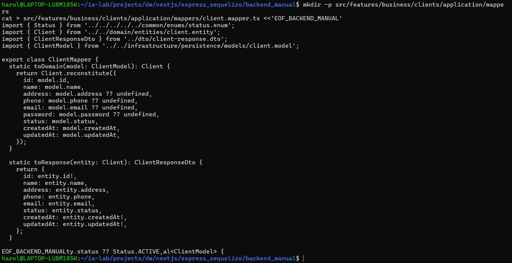

#### 7.16 — features/business/clients/application/use-cases/create-client.use-case.ts

Caso de uso (aplicación). Orquesta dominio + repositorio. El controller solo lo invoca.

**Archivo:** `src/features/business/clients/application/use-cases/create-client.use-case.ts`

```bash
mkdir -p src/features/business/clients/application/use-cases
cat > src/features/business/clients/application/use-cases/create-client.use-case.ts <<'EOF_BACKEND_MANUAL'
import { Inject, Injectable } from '@nestjs/common';
import {
  type IPasswordHasher,
  PASSWORD_HASHER,
} from '../../../../../infrastructure/security/hashing/password-hasher.interface';
import { ClientEmailAlreadyExistsException } from '../../domain/exceptions/client-email-already-exists.exception';
import { Client } from '../../domain/entities/client.entity';
import {
  CLIENT_REPOSITORY,
  type IClientRepository,
} from '../../domain/interfaces/client-repository.interface';
import { CreateClientDto } from '../dto/create-client.dto';
import { ClientMapper } from '../mappers/client.mapper';

@Injectable()
export class CreateClientUseCase {
  constructor(
    @Inject(CLIENT_REPOSITORY)
    private readonly clientRepository: IClientRepository,
    @Inject(PASSWORD_HASHER)
    private readonly passwordHasher: IPasswordHasher,
  ) {}

  async execute(dto: CreateClientDto) {
    if (dto.email) {
      const existing = await this.clientRepository.findByEmail(dto.email);
      if (existing) {
        throw new ClientEmailAlreadyExistsException(dto.email);
      }
    }

    let password = dto.password;
    if (password) {
      password = await this.passwordHasher.hash(password);
    }

    const client = Client.create({
      name: dto.name,
      address: dto.address,
      phone: dto.phone,
      email: dto.email,
      password,
    });

    const created = await this.clientRepository.create(client);
    return ClientMapper.toResponse(created);
  }
}
EOF_BACKEND_MANUAL
```
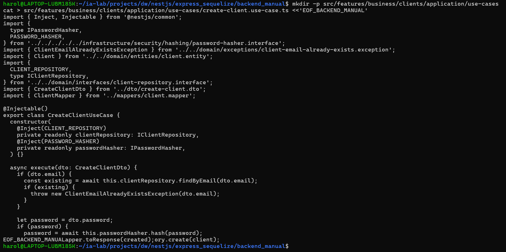

#### 7.17 — features/business/clients/application/use-cases/delete-client.use-case.ts

Caso de uso (aplicación). Orquesta dominio + repositorio. El controller solo lo invoca.

**Archivo:** `src/features/business/clients/application/use-cases/delete-client.use-case.ts`

```bash
mkdir -p src/features/business/clients/application/use-cases
cat > src/features/business/clients/application/use-cases/delete-client.use-case.ts <<'EOF_BACKEND_MANUAL'
import { Inject, Injectable } from '@nestjs/common';
import { ClientNotFoundException } from '../../domain/exceptions/client-not-found.exception';
import {
  CLIENT_REPOSITORY,
  type IClientRepository,
} from '../../domain/interfaces/client-repository.interface';

@Injectable()
export class DeleteClientUseCase {
  constructor(
    @Inject(CLIENT_REPOSITORY)
    private readonly clientRepository: IClientRepository,
  ) {}

  async execute(id: number): Promise<void> {
    const client = await this.clientRepository.findById(id);
    if (!client) {
      throw new ClientNotFoundException(id);
    }

    await this.clientRepository.delete(id);
  }
}
EOF_BACKEND_MANUAL
```
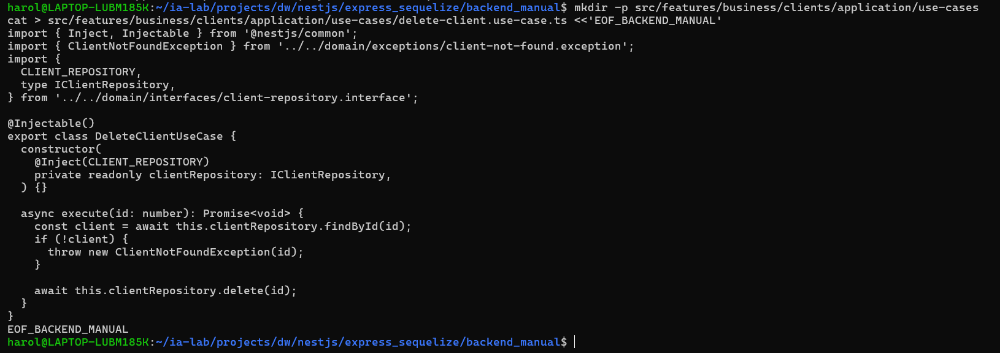

#### 7.18 — features/business/clients/application/use-cases/get-client.use-case.ts

Caso de uso (aplicación). Orquesta dominio + repositorio. El controller solo lo invoca.

**Archivo:** `src/features/business/clients/application/use-cases/get-client.use-case.ts`

```bash
mkdir -p src/features/business/clients/application/use-cases
cat > src/features/business/clients/application/use-cases/get-client.use-case.ts <<'EOF_BACKEND_MANUAL'
import { Inject, Injectable } from '@nestjs/common';
import { ClientNotFoundException } from '../../domain/exceptions/client-not-found.exception';
import {
  CLIENT_REPOSITORY,
  type IClientRepository,
} from '../../domain/interfaces/client-repository.interface';
import { ClientMapper } from '../mappers/client.mapper';

@Injectable()
export class GetClientUseCase {
  constructor(
    @Inject(CLIENT_REPOSITORY)
    private readonly clientRepository: IClientRepository,
  ) {}

  async execute(id: number) {
    const client = await this.clientRepository.findById(id);
    if (!client) {
      throw new ClientNotFoundException(id);
    }

    return ClientMapper.toResponse(client);
  }
}
EOF_BACKEND_MANUAL
```
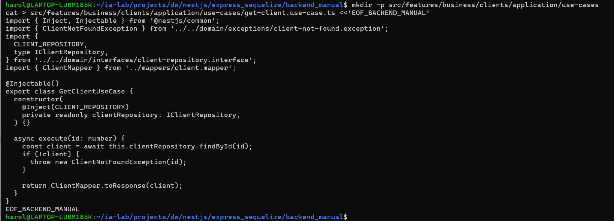

#### 7.19 — features/business/clients/application/use-cases/list-clients.use-case.ts

Caso de uso (aplicación). Orquesta dominio + repositorio. El controller solo lo invoca.

**Archivo:** `src/features/business/clients/application/use-cases/list-clients.use-case.ts`

```bash
mkdir -p src/features/business/clients/application/use-cases
cat > src/features/business/clients/application/use-cases/list-clients.use-case.ts <<'EOF_BACKEND_MANUAL'
import { Inject, Injectable } from '@nestjs/common';
import {
  CLIENT_REPOSITORY,
  type IClientRepository,
} from '../../domain/interfaces/client-repository.interface';
import { ClientFilterDto } from '../dto/client-filter.dto';
import { ClientMapper } from '../mappers/client.mapper';

@Injectable()
export class ListClientsUseCase {
  constructor(
    @Inject(CLIENT_REPOSITORY)
    private readonly clientRepository: IClientRepository,
  ) {}

  async execute(filter: ClientFilterDto) {
    const result = await this.clientRepository.findAll(filter);
    return {
      items: result.items.map((client) => ClientMapper.toResponse(client)),
      meta: result.meta,
    };
  }
}
EOF_BACKEND_MANUAL
```
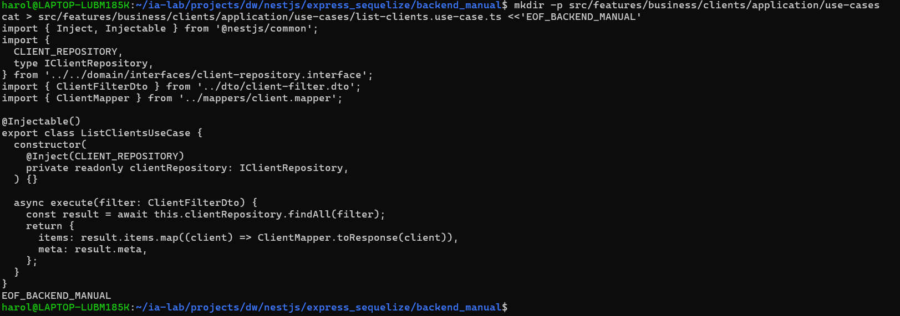

#### 7.20 — features/business/clients/application/use-cases/update-client.use-case.ts

Caso de uso (aplicación). Orquesta dominio + repositorio. El controller solo lo invoca.

**Archivo:** `src/features/business/clients/application/use-cases/update-client.use-case.ts`

```bash
mkdir -p src/features/business/clients/application/use-cases
cat > src/features/business/clients/application/use-cases/update-client.use-case.ts <<'EOF_BACKEND_MANUAL'
import { Inject, Injectable } from '@nestjs/common';
import {
  type IPasswordHasher,
  PASSWORD_HASHER,
} from '../../../../../infrastructure/security/hashing/password-hasher.interface';
import { ClientEmailAlreadyExistsException } from '../../domain/exceptions/client-email-already-exists.exception';
import { ClientNotFoundException } from '../../domain/exceptions/client-not-found.exception';
import {
  CLIENT_REPOSITORY,
  type IClientRepository,
} from '../../domain/interfaces/client-repository.interface';
import { UpdateClientDto } from '../dto/update-client.dto';
import { ClientMapper } from '../mappers/client.mapper';

@Injectable()
export class UpdateClientUseCase {
  constructor(
    @Inject(CLIENT_REPOSITORY)
    private readonly clientRepository: IClientRepository,
    @Inject(PASSWORD_HASHER)
    private readonly passwordHasher: IPasswordHasher,
  ) {}

  async execute(id: number, dto: UpdateClientDto) {
    const client = await this.clientRepository.findById(id);
    if (!client) {
      throw new ClientNotFoundException(id);
    }

    if (dto.email && dto.email !== client.email) {
      const existing = await this.clientRepository.findByEmail(dto.email);
      if (existing) {
        throw new ClientEmailAlreadyExistsException(dto.email);
      }
    }

    const updateData = { ...dto };
    if (dto.password) {
      updateData.password = await this.passwordHasher.hash(dto.password);
    }

    client.update(updateData);
    const updated = await this.clientRepository.update(client);
    return ClientMapper.toResponse(updated);
  }
}
EOF_BACKEND_MANUAL
```
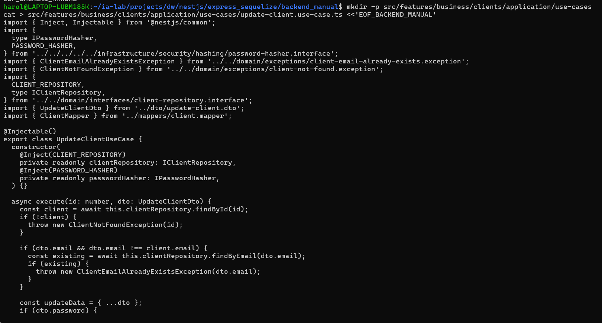

#### 7.21 — features/business/clients/presentation/http/serializers/client.serializer.ts

Serializer de presentación (forma estable de la respuesta HTTP).

**Archivo:** `src/features/business/clients/presentation/http/serializers/client.serializer.ts`

```bash
mkdir -p src/features/business/clients/presentation/http/serializers
cat > src/features/business/clients/presentation/http/serializers/client.serializer.ts <<'EOF_BACKEND_MANUAL'
import { Client } from '../../../domain/entities/client.entity';
import { ClientResponseDto } from '../../../application/dto/client-response.dto';
import { ClientMapper } from '../../../application/mappers/client.mapper';

export class ClientSerializer {
  static serialize(entity: Client): ClientResponseDto {
    return ClientMapper.toResponse(entity);
  }
}
EOF_BACKEND_MANUAL
```
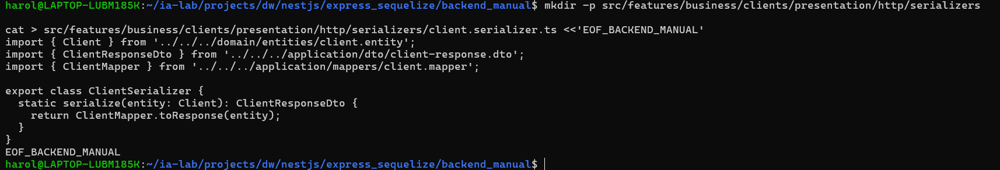

#### 7.22 — features/business/clients/presentation/http/controllers/clients.controller.ts

Controller delgado: valida DTO, llama use-case, devuelve respuesta.

**Archivo:** `src/features/business/clients/presentation/http/controllers/clients.controller.ts`

```bash
mkdir -p src/features/business/clients/presentation/http/controllers
cat > src/features/business/clients/presentation/http/controllers/clients.controller.ts <<'EOF_BACKEND_MANUAL'
import {
  Body,
  Controller,
  Delete,
  Get,
  HttpCode,
  HttpStatus,
  Param,
  Patch,
  Post,
  Query,
} from '@nestjs/common';
import {
  ApiCreatedResponse,
  ApiNoContentResponse,
  ApiOkResponse,
  ApiOperation,
  ApiTags,
} from '@nestjs/swagger';
import { ParsePositiveIntPipe } from '../../../../../../common/pipes/parse-positive-int.pipe';
import { CreateClientDto } from '../../../application/dto/create-client.dto';
import { UpdateClientDto } from '../../../application/dto/update-client.dto';
import { ClientFilterDto } from '../../../application/dto/client-filter.dto';
import { ClientResponseDto } from '../../../application/dto/client-response.dto';
import { CreateClientUseCase } from '../../../application/use-cases/create-client.use-case';
import { UpdateClientUseCase } from '../../../application/use-cases/update-client.use-case';
import { DeleteClientUseCase } from '../../../application/use-cases/delete-client.use-case';
import { GetClientUseCase } from '../../../application/use-cases/get-client.use-case';
import { ListClientsUseCase } from '../../../application/use-cases/list-clients.use-case';

@ApiTags('Clients')
@Controller('clients')
export class ClientsController {
  constructor(
    private readonly createClientUseCase: CreateClientUseCase,
    private readonly updateClientUseCase: UpdateClientUseCase,
    private readonly deleteClientUseCase: DeleteClientUseCase,
    private readonly getClientUseCase: GetClientUseCase,
    private readonly listClientsUseCase: ListClientsUseCase,
  ) {}

  @Post()
  @ApiOperation({ summary: 'Crear un cliente' })
  @ApiCreatedResponse({ type: ClientResponseDto })
  create(@Body() dto: CreateClientDto) {
    return this.createClientUseCase.execute(dto);
  }

  @Get()
  @ApiOperation({ summary: 'Listar clientes' })
  @ApiOkResponse({ type: [ClientResponseDto] })
  findAll(@Query() filter: ClientFilterDto) {
    return this.listClientsUseCase.execute(filter);
  }

  @Get(':id')
  @ApiOperation({ summary: 'Obtener un cliente por ID' })
  @ApiOkResponse({ type: ClientResponseDto })
  findOne(@Param('id', ParsePositiveIntPipe) id: number) {
    return this.getClientUseCase.execute(id);
  }

  @Patch(':id')
  @ApiOperation({ summary: 'Actualizar un cliente' })
  @ApiOkResponse({ type: ClientResponseDto })
  update(
    @Param('id', ParsePositiveIntPipe) id: number,
    @Body() dto: UpdateClientDto,
  ) {
    return this.updateClientUseCase.execute(id, dto);
  }

  @Delete(':id')
  @HttpCode(HttpStatus.NO_CONTENT)
  @ApiOperation({ summary: 'Eliminar un cliente' })
  @ApiNoContentResponse()
  remove(@Param('id', ParsePositiveIntPipe) id: number) {
    return this.deleteClientUseCase.execute(id);
  }
}
EOF_BACKEND_MANUAL
```
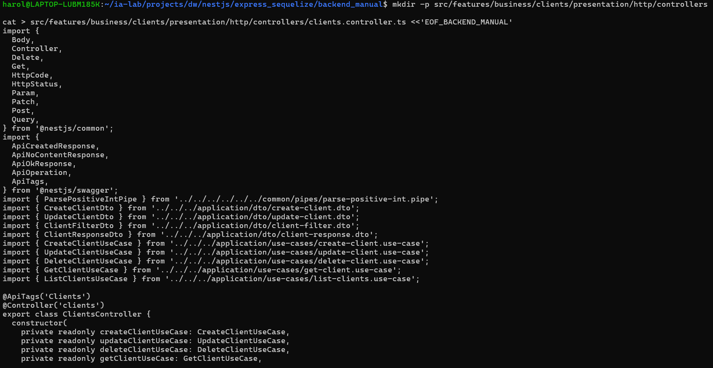

#### 7.23 — features/business/clients/index.ts

Barrel export del feature para imports limpios.

**Archivo:** `src/features/business/clients/index.ts`

```bash
mkdir -p src/features/business/clients
cat > src/features/business/clients/index.ts <<'EOF_BACKEND_MANUAL'
export { ClientsModule } from './clients.module';
EOF_BACKEND_MANUAL
```
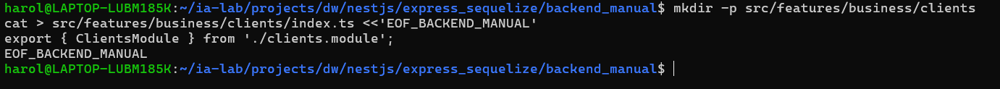

#### 7.24 — features/business/clients/clients.module.ts

Módulo Nest del feature: cablea providers, tokens DI y controller.

**Archivo:** `src/features/business/clients/clients.module.ts`

```bash
mkdir -p src/features/business/clients
cat > src/features/business/clients/clients.module.ts <<'EOF_BACKEND_MANUAL'
import { Module } from '@nestjs/common';
import { BcryptPasswordHasherService } from '../../../infrastructure/security/hashing/bcrypt-password-hasher.service';
import { PASSWORD_HASHER } from '../../../infrastructure/security/hashing/password-hasher.interface';
import { CLIENT_REPOSITORY } from './domain/interfaces/client-repository.interface';
import { ClientRepository } from './infrastructure/persistence/repositories/client.repository';
import { CreateClientUseCase } from './application/use-cases/create-client.use-case';
import { UpdateClientUseCase } from './application/use-cases/update-client.use-case';
import { DeleteClientUseCase } from './application/use-cases/delete-client.use-case';
import { GetClientUseCase } from './application/use-cases/get-client.use-case';
import { ListClientsUseCase } from './application/use-cases/list-clients.use-case';
import { ClientsController } from './presentation/http/controllers/clients.controller';

@Module({
  controllers: [ClientsController],
  providers: [
    ClientRepository,
    { provide: CLIENT_REPOSITORY, useExisting: ClientRepository },
    BcryptPasswordHasherService,
    { provide: PASSWORD_HASHER, useExisting: BcryptPasswordHasherService },
    CreateClientUseCase,
    UpdateClientUseCase,
    DeleteClientUseCase,
    GetClientUseCase,
    ListClientsUseCase,
  ],
  exports: [CLIENT_REPOSITORY],
})
export class ClientsModule {}
EOF_BACKEND_MANUAL
```
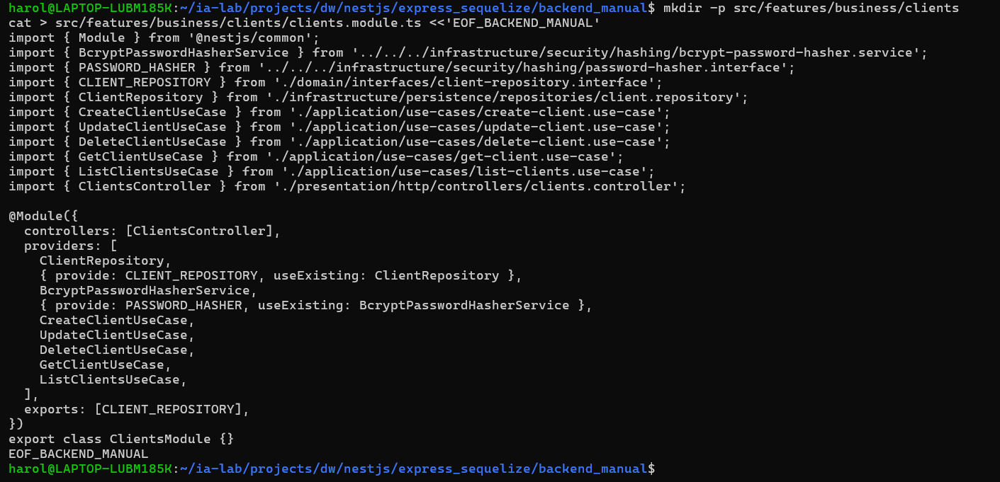

#### 7.25 — Actualizar sequelize.factory.ts (registrar modelos)

Registra en ALL_MODELS solo los modelos ya creados (orden de dependencias).

**Archivo:** `src/infrastructure/database/sequelize/sequelize.factory.ts`

```bash
mkdir -p src/infrastructure/database/sequelize
cat > src/infrastructure/database/sequelize/sequelize.factory.ts <<'EOF_BACKEND_MANUAL'
import { Sequelize } from 'sequelize-typescript';
import { DatabaseDialect } from '../../../config/environment/env.interface';
import { getSequelizeOptions } from './sequelize.options';

import { ClientModel } from '../../../features/business/clients/infrastructure/persistence/models/client.model';

export const ALL_MODELS = [
  ClientModel,
];

export async function createSequelizeInstance(
  dialect: DatabaseDialect,
): Promise<Sequelize> {
  const options = getSequelizeOptions(dialect);

  let dialectModule: any;

  switch (dialect) {
    case DatabaseDialect.MySQL:
      dialectModule = require('mysql2');
      break;
    case DatabaseDialect.Postgres:
      dialectModule = require('pg');
      break;
    case DatabaseDialect.MSSQL:
      dialectModule = require('tedious');
      break;
    case DatabaseDialect.Oracle:
      dialectModule = require('oracledb');
      break;
    default:
      throw new Error(`Dialecto no soportado: ${dialect}`);
  }

  const sequelize = new Sequelize({
    ...options,
    dialectModule,
    models: ALL_MODELS,
  } as any);

  try {
    await sequelize.authenticate();
    console.log(`✅ Conexión exitosa a ${dialect.toUpperCase()}`);
  } catch (error: any) {
    console.error(
      `❌ Error conectando a ${dialect.toUpperCase()}:`,
      error.message,
    );
    throw error;
  }

  if (process.env.NODE_ENV !== 'production') {
    await sequelize.sync({ alter: false });
    console.log('✅ Tablas sincronizadas');
  }

  return sequelize;
}
EOF_BACKEND_MANUAL
```
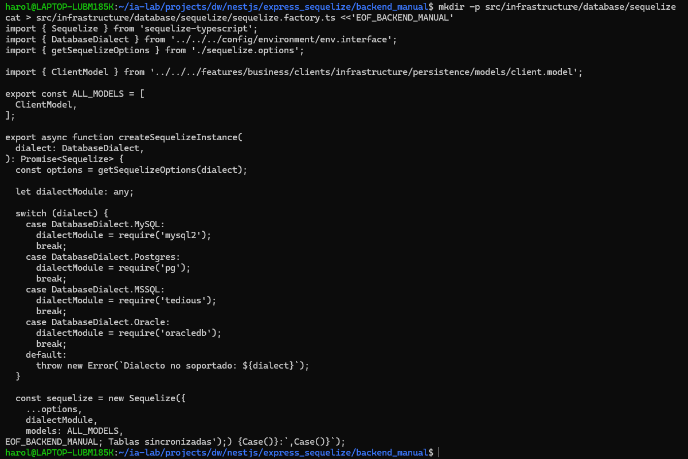

#### 7.26 — Actualizar business.module.ts

Agrega el feature module de negocio recién terminado.

**Archivo:** `src/features/business/business.module.ts`

```bash
mkdir -p src/features/business
cat > src/features/business/business.module.ts <<'EOF_BACKEND_MANUAL'
import { Module } from '@nestjs/common';
import { ClientsModule } from './clients/clients.module';

@Module({
  imports: [ClientsModule],
  exports: [ClientsModule],
})
export class BusinessModule {}
EOF_BACKEND_MANUAL
```
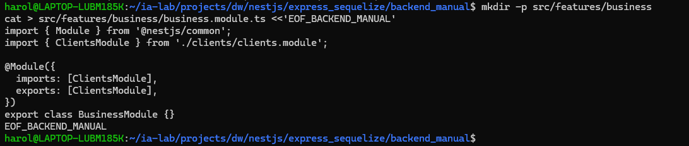

#### 7.27 — Actualizar database-seeder.service.ts

Ejecuta seeders en orden de dependencias al arrancar (dev).

**Archivo:** `src/infrastructure/database/seeders/database-seeder.service.ts`

```bash
mkdir -p src/infrastructure/database/seeders
cat > src/infrastructure/database/seeders/database-seeder.service.ts <<'EOF_BACKEND_MANUAL'
import { Injectable, Logger, OnModuleInit } from '@nestjs/common';
import { seedClients } from '../../../features/business/clients/infrastructure/persistence/seeders/clients.seeder';

/**
 * Ejecuta seeders en orden de dependencias.
 * Solo en entornos no productivos.
 */
@Injectable()
export class DatabaseSeederService implements OnModuleInit {
  private readonly logger = new Logger(DatabaseSeederService.name);

  async onModuleInit(): Promise<void> {
    if (process.env.NODE_ENV === 'production') {
      return;
    }

    try {
      await seedClients();
      this.logger.log('✅ Seeders ejecutados');
    } catch (error: any) {
      this.logger.error(`❌ Error en seeders: ${error.message}`, error.stack);
      throw error;
    }
  }
}
EOF_BACKEND_MANUAL
```
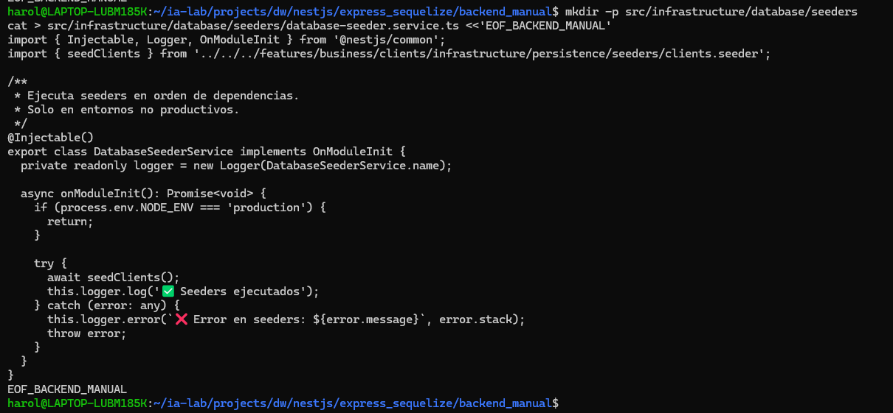

#### 7.28 — Actualizar app.module.ts

Importa BusinessModule y/o AuthModule según el avance. Los guards globales llegan en la fase RBAC.

**Archivo:** `src/app.module.ts`

```bash
mkdir -p src
cat > src/app.module.ts <<'EOF_BACKEND_MANUAL'
import { Module } from '@nestjs/common';
import { ConfigModule } from '@nestjs/config';
import { envConfig } from './config/environment/env.config';
import { appConfig } from './config/app/app.config';
import { jwtConfig } from './config/jwt/jwt.config';
import { LoggerModule } from './config/logger/logger.module';
import { SequelizeDatabaseModule } from './infrastructure/database/sequelize/sequelize.module';
import { SecurityModule } from './infrastructure/security/security.module';
import { BusinessModule } from './features/business/business.module';
import { AppController } from './app.controller';
import { AppService } from './app.service';

@Module({
  imports: [
    ConfigModule.forRoot({
      isGlobal: true,
      load: [envConfig, appConfig, jwtConfig],
      envFilePath: '.env',
    }),
    SequelizeDatabaseModule,
    SecurityModule,
    LoggerModule,
    BusinessModule,
  ],
  controllers: [AppController],
  providers: [
    AppService,
  ],
})
export class AppModule {}
EOF_BACKEND_MANUAL
```
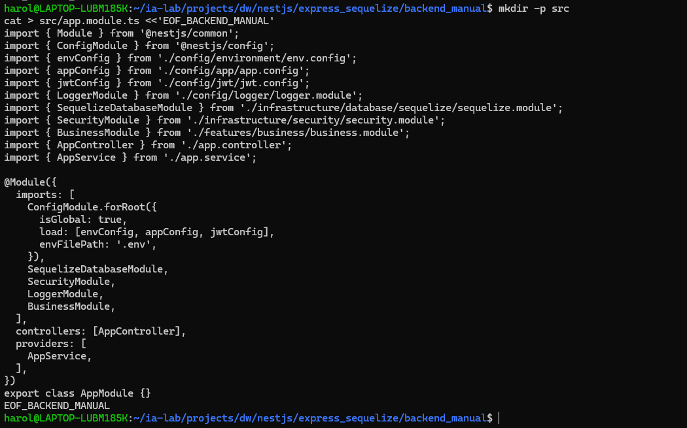

#### 7.29 — Verificar tabla física `clients` y API

Arranca la app. Debe crear/sync tabla `clients`, correr seeder y exponer `/api/clients`. Prueba list/create en Swagger o curl.

```bash
npm run start:dev
```
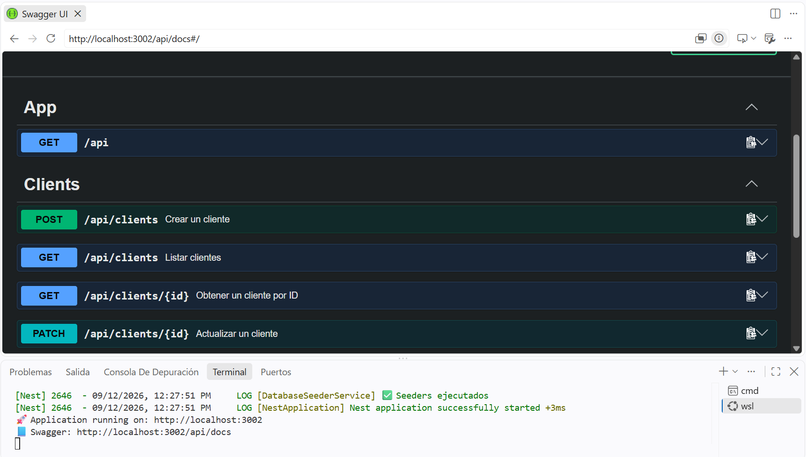

------------------------------------------------------------------------

## FASE 8 — `07_BUSINESS_

### Business — collections

> **Objetivo de la fase:** Catálogo de colecciones de TramaModa. Misma plantilla CA que Clients.

#### 8.1 - features/business/collections/domain/entities/collection.entity.ts

Entidad de dominio de Colección. Es TypeScript puro y no extiende el modelo de Sequelize.

**Archivo:** `src/features/business/collections/domain/entities/collection.entity.ts`

```bash
mkdir -p src/features/business/collections/domain/entities
cat > src/features/business/collections/domain/entities/collection.entity.ts <<'EOF_BACKEND_MANUAL'
export interface CollectionProps {
  id?: number;
  name: string;
  description?: string;
  isActive?: boolean;
  createdAt?: Date;
  updatedAt?: Date;
}

export class Collection {
  id?: number;
  name: string;
  description?: string;
  isActive: boolean;
  createdAt?: Date;
  updatedAt?: Date;

  private constructor(props: CollectionProps) {
    this.id = props.id;
    this.name = props.name;
    this.description = props.description;
    this.isActive = props.isActive ?? true;
    this.createdAt = props.createdAt;
    this.updatedAt = props.updatedAt;
  }

  static create(
    props: Omit<CollectionProps, 'id' | 'isActive' | 'createdAt' | 'updatedAt'>,
  ): Collection {
    if (!props.name?.trim()) {
      throw new Error('El nombre de la colección es requerido');
    }

    return new Collection(props);
  }

  static reconstitute(props: CollectionProps): Collection {
    return new Collection(props);
  }

  update(
    props: Partial<
      Omit<CollectionProps, 'id' | 'isActive' | 'createdAt' | 'updatedAt'>
    >,
  ): void {
    if (props.name !== undefined) {
      if (!props.name.trim()) {
        throw new Error('El nombre de la colección es requerido');
      }
      this.name = props.name;
    }

    if (props.description !== undefined) {
      this.description = props.description;
    }
  }

  deactivate(): void {
    this.isActive = false;
  }

  activate(): void {
    this.isActive = true;
  }
}
EOF_BACKEND_MANUAL
```
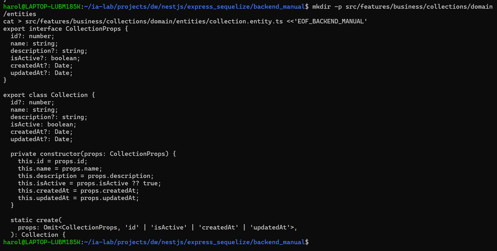

#### 8.2 - features/business/collections/domain/exceptions/collection-not-found.exception.ts

**Archivo:** `src/features/business/collections/domain/exceptions/collection-not-found.exception.ts`

```bash
mkdir -p src/features/business/collections/domain/exceptions
cat > src/features/business/collections/domain/exceptions/collection-not-found.exception.ts <<'EOF_BACKEND_MANUAL'
import { EntityNotFoundException } from '../../../../../common/exceptions/entity-not-found.exception';

export class CollectionNotFoundException extends EntityNotFoundException {
  constructor(id: number) {
    super('Colección', id);
  }
}
EOF_BACKEND_MANUAL
```
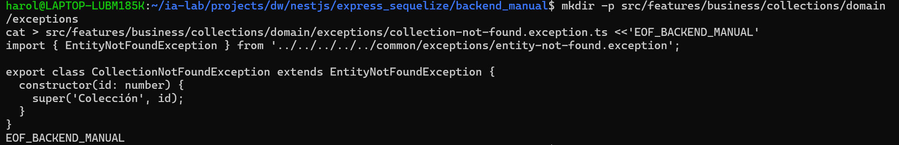

#### 8.3 features/business/collections/domain/interfaces/collection-repository.interface.ts

Puerto (contrato) del repositorio. La aplicación depende de esta interface, no de Sequelize.

**Archivo:** `src/features/business/collections/domain/interfaces/collection-repository.interface.ts`

```bash
mkdir -p src/features/business/collections/domain/interfaces
cat > src/features/business/collections/domain/interfaces/collection-repository.interface.ts <<'EOF_BACKEND_MANUAL'
import { PaginatedResult } from '../../../../../common/interfaces/pagination.interface';
import { Collection } from '../entities/collection.entity';

export const COLLECTION_REPOSITORY = 'COLLECTION_REPOSITORY';

export interface CollectionFindAllParams {
  page?: number;
  limit?: number;
  search?: string;
}

export interface ICollectionRepository {
  create(collection: Collection): Promise<Collection>;
  update(collection: Collection): Promise<Collection>;
  delete(id: number): Promise<void>;
  findById(id: number): Promise<Collection | null>;
  findAll(
    params: CollectionFindAllParams,
  ): Promise<PaginatedResult<Collection>>;
}
EOF_BACKEND_MANUAL
```
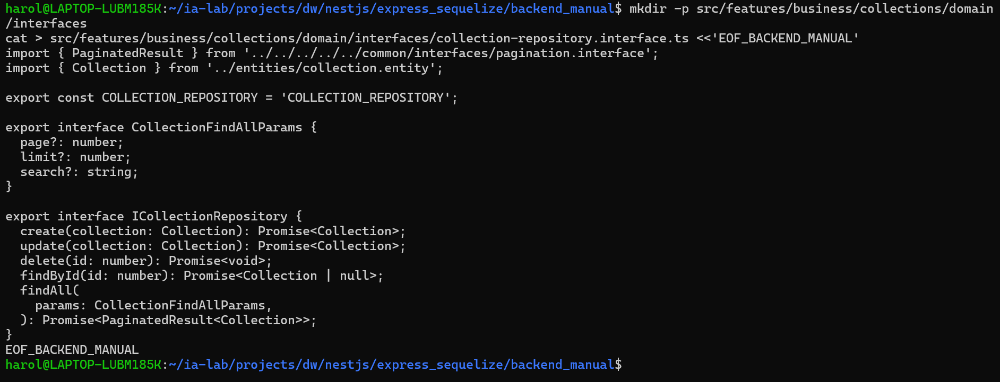

#### 8.4 — features/business/collections/infrastructure/persistence/models/collection.model.ts

Modelo Sequelize (`@Table`). Solo infraestructura: mapeo a tabla física.

**Archivo:** `src/features/business/collections/infrastructure/persistence/models/collection.model.ts`

```bash
mkdir -p src/features/business/collections/infrastructure/persistence/models
cat > src/features/business/collections/infrastructure/persistence/models/collection.model.ts <<'EOF_BACKEND_MANUAL'
import {
  AutoIncrement,
  Column,
  CreatedAt,
  DataType,
  HasMany,
  Model,
  PrimaryKey,
  Table,
  UpdatedAt,
} from 'sequelize-typescript';

@Table({ tableName: 'collections' })
export class CollectionModel extends Model {
  @PrimaryKey
  @AutoIncrement
  @Column(DataType.INTEGER)
  declare id: number;

  @Column({ type: DataType.STRING(100), allowNull: false })
  declare name: string;

  @Column({ type: DataType.TEXT, allowNull: true })
  declare description: string | null;

  @Column({
    type: DataType.BOOLEAN,
    allowNull: false,
    defaultValue: true,
  })
  declare isActive: boolean;

  @CreatedAt
  declare createdAt: Date;

  @UpdatedAt
  declare updatedAt: Date;

  @HasMany(
    () =>
      require('../../../../products/infrastructure/persistence/models/product.model')
        .ProductModel,
  )
  declare products: unknown[];
}
EOF_BACKEND_MANUAL
```
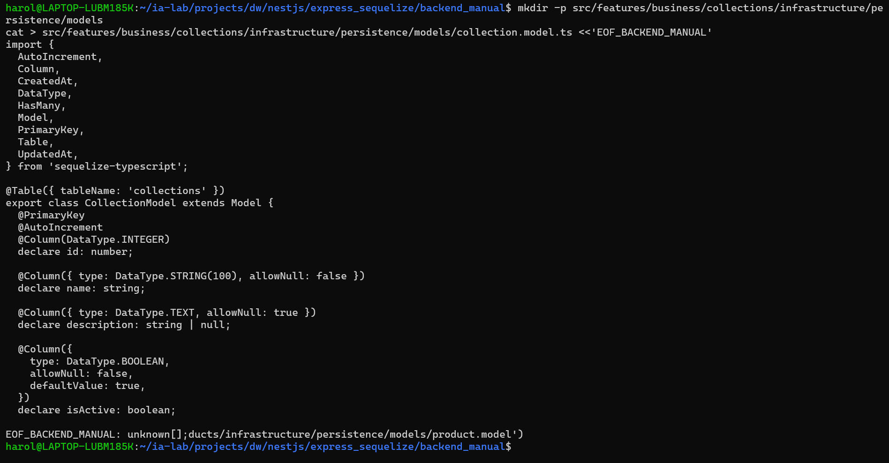

#### 8.5 — features/business/collections/infrastructure/persistence/repositories/collection.repository.ts

**Archivo** `src/features/business/collections/infrastructure/persistence/repositories/collection.repository.ts`

```bash
mkdir -p src/features/business/collections/infrastructure/persistence/repositories
cat > src/features/business/collections/infrastructure/persistence/repositories/collection.repository.ts <<'EOF_BACKEND_MANUAL'
import { Injectable } from '@nestjs/common';
import { Op } from 'sequelize';
import {
  buildPaginatedResult,
  normalizePagination,
} from '../../../../../../common/utils/pagination.util';
import { Collection } from '../../../domain/entities/collection.entity';
import {
  ICollectionRepository,
  CollectionFindAllParams,
} from '../../../domain/interfaces/collection-repository.interface';
import { CollectionMapper } from '../../../application/mappers/collection.mapper';
import { CollectionModel } from '../models/collection.model';

@Injectable()
export class CollectionRepository implements ICollectionRepository {
  async create(collection: Collection): Promise<Collection> {
    const model = await CollectionModel.create(
      CollectionMapper.toPersistence(collection),
    );
    return CollectionMapper.toDomain(model);
  }

  async update(collection: Collection): Promise<Collection> {
    await CollectionModel.update(
      CollectionMapper.toPersistence(collection),
      { where: { id: collection.id } },
    );

    const updated = await CollectionModel.findByPk(collection.id!);

    return CollectionMapper.toDomain(updated!);
  }

  async delete(id: number): Promise<void> {
    await CollectionModel.destroy({ where: { id } });
  }

  async findById(id: number): Promise<Collection | null> {
    const model = await CollectionModel.findByPk(id);

    return model ? CollectionMapper.toDomain(model) : null;
  }

  async findAll(params: CollectionFindAllParams) {
    const { page, limit, offset } = normalizePagination(
      params.page,
      params.limit,
    );

    const where = params.search
      ? {
          [Op.or]: [
            { name: { [Op.like]: `%${params.search}%` } },
            { description: { [Op.like]: `%${params.search}%` } },
          ],
        }
      : {};

    const { rows, count } = await CollectionModel.findAndCountAll({
      where,
      limit,
      offset,
      order: [['createdAt', 'DESC']],
    });

    return buildPaginatedResult(
      rows.map((row) => CollectionMapper.toDomain(row)),
      count,
      page,
      limit,
    );
  }
}
EOF_BACKEND_MANUAL
```

#### 8.6 features/business/collections/infrastructure/persistence/migrations/create-collections-table.migration.ts

Migración documental/auxiliar de la tabla. En dev el sync de Sequelize crea el esquema.

**Archivo** `src/features/business/collections/infrastructure/persistence/migrations/create-collections-table.migration.ts`

```bash 
mkdir -p src/features/business/collections/infrastructure/persistence/migrations
cat > src/features/business/collections/infrastructure/persistence/migrations/create-collections-table.migration.ts <<'EOF_BACKEND_MANUAL'
export const createCollectionsTableMigration = {
  name: 'create-collections-table',
  async up(): Promise<void> {
    // Sequelize sync handles table creation in development.
    // Production: CREATE TABLE collections (id, name, description, isActive, createdAt, updatedAt)
  },
  async down(): Promise<void> {
    // Production: DROP TABLE collections
  },
};
EOF_BACKEND_MANUAL
```
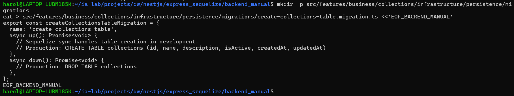

#### 8.7 - features/business/collections/infrastructure/persistence/seeders/collections.seeder.ts

Seeder de datos iniciales para desarrollo y verificación física en BD.

**Archivo** `src/features/business/collections/infrastructure/persistence/seeders/collections.seeder.ts`

```bash
mkdir -p src/features/business/collections/infrastructure/persistence/seeders
cat > src/features/business/collections/infrastructure/persistence/seeders/collections.seeder.ts <<'EOF_BACKEND_MANUAL'
import { CollectionModel } from '../models/collection.model';

export async function seedCollections(): Promise<void> {
  const count = await CollectionModel.count();
  if (count > 0) {
    return;
  }

  await CollectionModel.bulkCreate([
    {
      name: 'Primavera-Verano',
      description: 'Colección de temporada primavera-verano',
      isActive: true,
    },
    {
      name: 'Otoño-Invierno',
      description: 'Colección de temporada otoño-invierno',
      isActive: true,
    },
  ]);
}
EOF_BACKEND_MANUAL
```
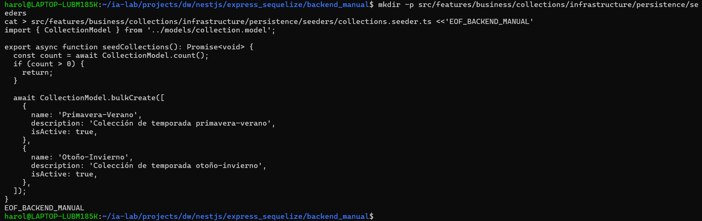

#### 8.8 — features/business/collections/application/dto/create-collection.dto.ts

DTO de entrada para crear colecciones vía HTTP.

**Archivo** `src/features/business/collections/application/dto/create-collection.dto.ts`

```bash
mkdir -p src/features/business/collections/application/dto
cat > src/features/business/collections/application/dto/create-collection.dto.ts <<'EOF_BACKEND_MANUAL'
import { ApiProperty, ApiPropertyOptional } from '@nestjs/swagger';
import { IsNotEmpty, IsOptional, IsString, MaxLength } from 'class-validator';

export class CreateCollectionDto {
  @ApiProperty({ example: 'Primavera-Verano' })
  @IsString()
  @IsNotEmpty()
  @MaxLength(100)
  name: string;

  @ApiPropertyOptional({ example: 'Colección de temporada primavera-verano' })
  @IsOptional()
  @IsString()
  description?: string;
}
EOF_BACKEND_MANUAL
```
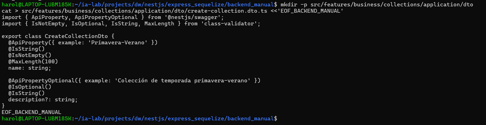

#### 8.9 — features/business/collections/application/dto/collection-filter.dto.ts

DTO para filtros de búsqueda y paginación.

**Archivo** `src/features/business/collections/application/dto/collection-filter.dto.ts`

```bash 
mkdir -p src/features/business/collections/application/dto
cat > src/features/business/collections/application/dto/collection-filter.dto.ts <<'EOF_BACKEND_MANUAL'
import { ApiPropertyOptional } from '@nestjs/swagger';
import { Type } from 'class-transformer';
import { IsInt, IsOptional, IsPositive, IsString, Min } from 'class-validator';

export class CollectionFilterDto {
  @ApiPropertyOptional({ example: 1, default: 1 })
  @IsOptional()
  @Type(() => Number)
  @IsInt()
  @Min(1)
  page?: number;

  @ApiPropertyOptional({ example: 10, default: 10 })
  @IsOptional()
  @Type(() => Number)
  @IsInt()
  @IsPositive()
  limit?: number;

  @ApiPropertyOptional({ example: 'primavera' })
  @IsOptional()
  @IsString()
  search?: string;
}
EOF_BACKEND_MANUAL
```
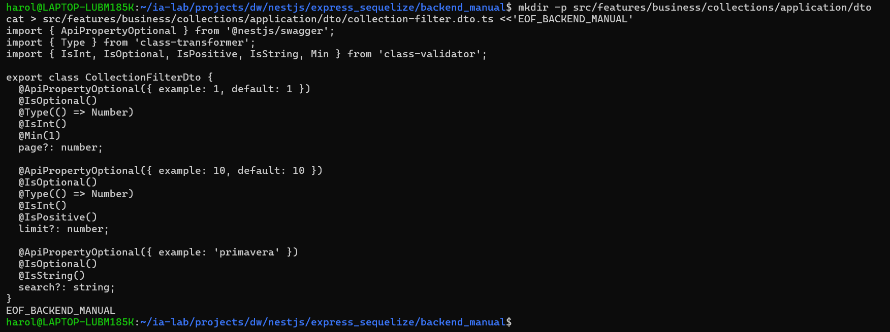

#### 8.10 — features/business/collections/application/dto/collection-response.dto.ts

DTO de salida para respuestas HTTP.

**Archivo** `src/features/business/collections/application/dto/collection-response.dto.ts`

```bash 
mkdir -p src/features/business/collections/application/dto
cat > src/features/business/collections/application/dto/collection-response.dto.ts <<'EOF_BACKEND_MANUAL'
import { ApiProperty, ApiPropertyOptional } from '@nestjs/swagger';

export class CollectionResponseDto {
  @ApiProperty({ example: 1 })
  id: number;

  @ApiProperty({ example: 'Primavera-Verano' })
  name: string;

  @ApiPropertyOptional({ example: 'Colección de temporada primavera-verano' })
  description?: string;

  @ApiProperty({ example: true })
  isActive: boolean;

  @ApiProperty()
  createdAt: Date;

  @ApiProperty()
  updatedAt: Date;
}
EOF_BACKEND_MANUAL
```
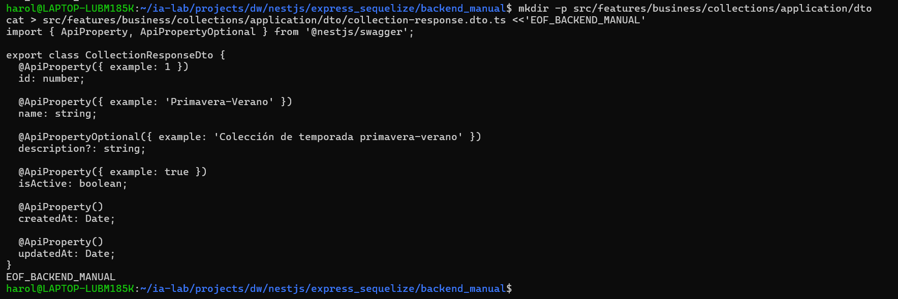

#### 8.11 — features/business/collections/application/dto/update-collection.dto.ts

DTO para actualizar colecciones.

**Archivo** `src/features/business/collections/application/dto/update-collection.dto.ts`

```bash 
mkdir -p src/features/business/collections/application/dto
cat > src/features/business/collections/application/dto/update-collection.dto.ts <<'EOF_BACKEND_MANUAL'
import { PartialType } from '@nestjs/mapped-types';
import { CreateCollectionDto } from './create-collection.dto';

export class UpdateCollectionDto extends PartialType(CreateCollectionDto) {}
EOF_BACKEND_MANUAL
```
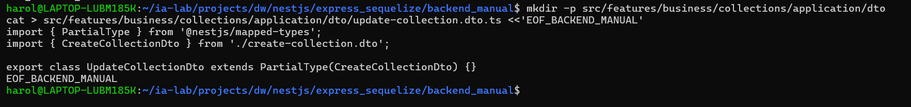

#### 8.12 — features/business/collections/application/mappers/collection.mapper.ts

Mapper entre entidad de dominio, modelo Sequelize y DTO de respuesta.

**Archivo** `src/features/business/collections/application/mappers/collection.mapper.ts`

```bash 
mkdir -p src/features/business/collections/application/mappers
cat > src/features/business/collections/application/mappers/collection.mapper.ts <<'EOF_BACKEND_MANUAL'
import { Collection } from '../../domain/entities/collection.entity';
import { CollectionResponseDto } from '../dto/collection-response.dto';
import { CollectionModel } from '../../infrastructure/persistence/models/collection.model';

export class CollectionMapper {
  static toDomain(model: CollectionModel): Collection {
    return Collection.reconstitute({
      id: model.id,
      name: model.name,
      description: model.description ?? undefined,
      isActive: model.isActive,
      createdAt: model.createdAt,
      updatedAt: model.updatedAt,
    });
  }

  static toResponse(entity: Collection): CollectionResponseDto {
    return {
      id: entity.id!,
      name: entity.name,
      description: entity.description,
      isActive: entity.isActive,
      createdAt: entity.createdAt!,
      updatedAt: entity.updatedAt!,
    };
  }

  static toPersistence(entity: Collection): Partial<CollectionModel> {
    return {
      id: entity.id,
      name: entity.name,
      description: entity.description ?? null,
      isActive: entity.isActive,
    };
  }
}
EOF_BACKEND_MANUAL
```
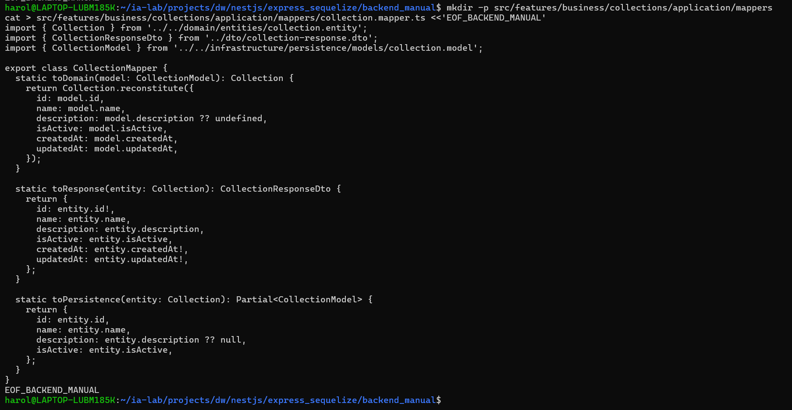

#### 8.13 — features/business/collections/application/use-cases/create-collection.use-case.ts

Caso de uso para crear colecciones.

**Archivo** `src/features/business/collections/application/use-cases/create-collection.use-case.ts`

```bash 
mkdir -p src/features/business/collections/application/use-cases
cat > src/features/business/collections/application/use-cases/create-collection.use-case.ts <<'EOF_BACKEND_MANUAL'
import { Inject, Injectable } from '@nestjs/common';
import { Collection } from '../../domain/entities/collection.entity';
import {
  type ICollectionRepository,
  COLLECTION_REPOSITORY,
} from '../../domain/interfaces/collection-repository.interface';
import { CreateCollectionDto } from '../dto/create-collection.dto';
import { CollectionMapper } from '../mappers/collection.mapper';

@Injectable()
export class CreateCollectionUseCase {
  constructor(
    @Inject(COLLECTION_REPOSITORY)
    private readonly collectionRepository: ICollectionRepository,
  ) {}

  async execute(dto: CreateCollectionDto) {
    const collection = Collection.create(dto);
    const created = await this.collectionRepository.create(collection);
    return CollectionMapper.toResponse(created);
  }
}
EOF_BACKEND_MANUAL
``` 
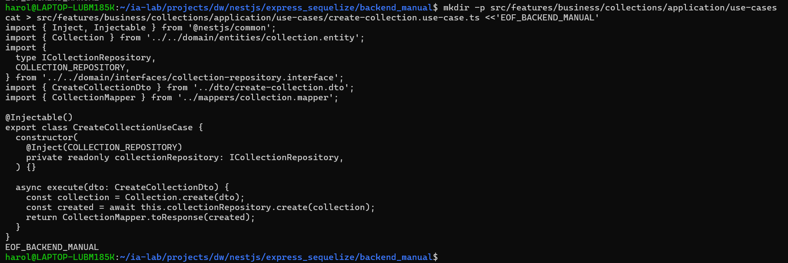

#### 8.14 — features/business/collections/application/use-cases/delete-collection.use-case.ts

Caso de uso para eliminar colecciones.

**Archivo** `src/features/business/collections/application/use-cases/delete-collection.use-case.ts`

```bash 
mkdir -p src/features/business/collections/application/use-cases
cat > src/features/business/collections/application/use-cases/delete-collection.use-case.ts <<'EOF_BACKEND_MANUAL'
import { Inject, Injectable } from '@nestjs/common';
import { CollectionNotFoundException } from '../../domain/exceptions/collection-not-found.exception';
import {
  type ICollectionRepository,
  COLLECTION_REPOSITORY,
} from '../../domain/interfaces/collection-repository.interface';

@Injectable()
export class DeleteCollectionUseCase {
  constructor(
    @Inject(COLLECTION_REPOSITORY)
    private readonly collectionRepository: ICollectionRepository,
  ) {}

  async execute(id: number): Promise<void> {
    const collection = await this.collectionRepository.findById(id);
    if (!collection) {
      throw new CollectionNotFoundException(id);
    }

    await this.collectionRepository.delete(id);
  }
}
EOF_BACKEND_MANUAL
```
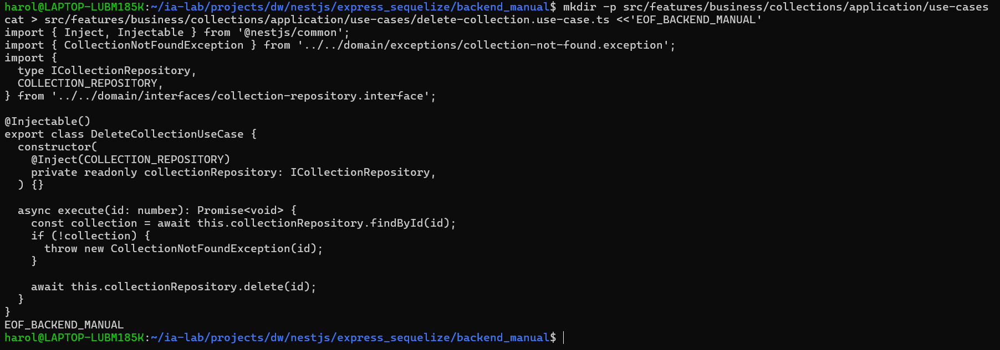

#### 8.15 — features/business/collections/application/use-cases/get-collection.use-case.ts

Caso de uso para obtener una colección por ID.

**Archivo** `src/features/business/collections/application/use-cases/get-collection.use-case.ts`

```bash
mkdir -p src/features/business/collections/application/use-cases
cat > src/features/business/collections/application/use-cases/get-collection.use-case.ts <<'EOF_BACKEND_MANUAL'
import { Inject, Injectable } from '@nestjs/common';
import { CollectionNotFoundException } from '../../domain/exceptions/collection-not-found.exception';
import {
  type ICollectionRepository,
  COLLECTION_REPOSITORY,
} from '../../domain/interfaces/collection-repository.interface';
import { CollectionMapper } from '../mappers/collection.mapper';

@Injectable()
export class GetCollectionUseCase {
  constructor(
    @Inject(COLLECTION_REPOSITORY)
    private readonly collectionRepository: ICollectionRepository,
  ) {}

  async execute(id: number) {
    const collection = await this.collectionRepository.findById(id);
    if (!collection) {
      throw new CollectionNotFoundException(id);
    }

    return CollectionMapper.toResponse(collection);
  }
}
EOF_BACKEND_MANUAL
``` 
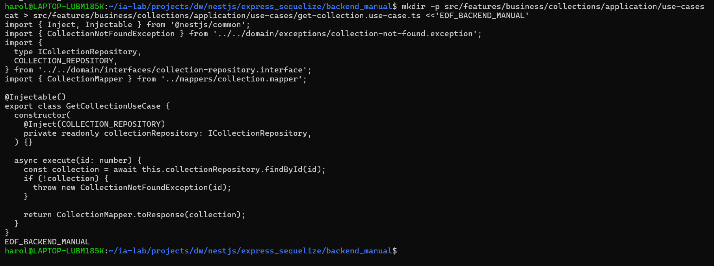

#### 8.16 — features/business/collections/application/use-cases/list-collections.use-case.ts
Caso de uso para listar colecciones con filtros.

**Archivo** `src/features/business/collections/application/use-cases/list-collections.use-case.ts`

```bash
mkdir -p src/features/business/collections/application/use-cases
cat > src/features/business/collections/application/use-cases/list-collections.use-case.ts <<'EOF_BACKEND_MANUAL'
import { Inject, Injectable } from '@nestjs/common';
import {
  type ICollectionRepository,
  COLLECTION_REPOSITORY,
} from '../../domain/interfaces/collection-repository.interface';
import { CollectionFilterDto } from '../dto/collection-filter.dto';
import { CollectionMapper } from '../mappers/collection.mapper';

@Injectable()
export class ListCollectionsUseCase {
  constructor(
    @Inject(COLLECTION_REPOSITORY)
    private readonly collectionRepository: ICollectionRepository,
  ) {}

  async execute(filter: CollectionFilterDto) {
    const result = await this.collectionRepository.findAll(filter);
    return {
      items: result.items.map((c) => CollectionMapper.toResponse(c)),
      meta: result.meta,
    };
  }
}
EOF_BACKEND_MANUAL
``` 
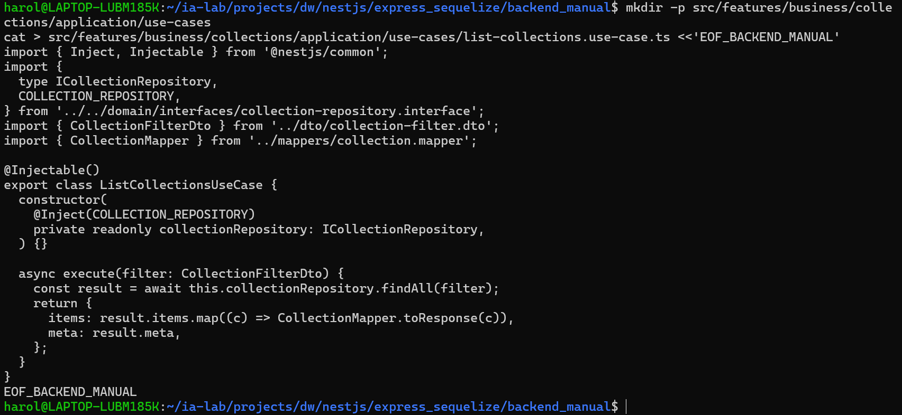

#### 8.17 — features/business/collections/application/use-cases/update-collection.use-case.ts

Caso de uso para actualizar colecciones.

**Archivo** `src/features/business/collections/application/use-cases/update-collection.use-case.ts`
```bash
mkdir -p src/features/business/collections/application/use-cases
cat > src/features/business/collections/application/use-cases/update-collection.use-case.ts <<'EOF_BACKEND_MANUAL'
import { Inject, Injectable } from '@nestjs/common';
import { CollectionNotFoundException } from '../../domain/exceptions/collection-not-found.exception';
import {
  type ICollectionRepository,
  COLLECTION_REPOSITORY,
} from '../../domain/interfaces/collection-repository.interface';
import { UpdateCollectionDto } from '../dto/update-collection.dto';
import { CollectionMapper } from '../mappers/collection.mapper';

@Injectable()
export class UpdateCollectionUseCase {
  constructor(
    @Inject(COLLECTION_REPOSITORY)
    private readonly collectionRepository: ICollectionRepository,
  ) {}

  async execute(id: number, dto: UpdateCollectionDto) {
    const collection = await this.collectionRepository.findById(id);
    if (!collection) {
      throw new CollectionNotFoundException(id);
    }

    collection.update(dto);
    const updated = await this.collectionRepository.update(collection);
    return CollectionMapper.toResponse(updated);
  }
}
EOF_BACKEND_MANUAL
```
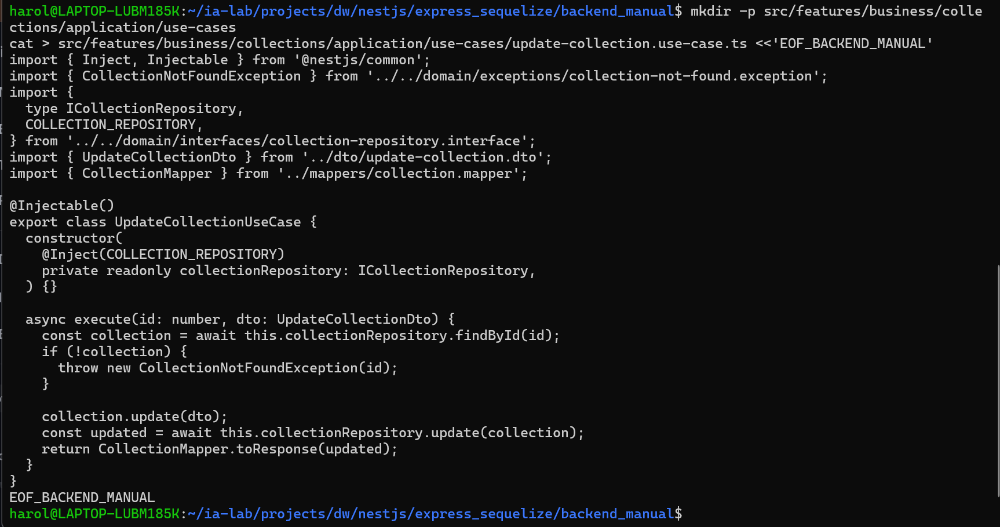

#### 8.18 — features/business/collections/presentation/http/serializers/collection.serializer.ts
Serializer de presentación para respuestas HTTP.

**Archivo** `src/features/business/collections/presentation/http/serializers/collection.serializer.ts`

```bash 
mkdir -p src/features/business/collections/presentation/http/serializers
cat > src/features/business/collections/presentation/http/serializers/collection.serializer.ts <<'EOF_BACKEND_MANUAL'
import { Collection } from '../../../domain/entities/collection.entity';
import { CollectionResponseDto } from '../../../application/dto/collection-response.dto';
import { CollectionMapper } from '../../../application/mappers/collection.mapper';

export class CollectionSerializer {
  static serialize(entity: Collection): CollectionResponseDto {
    return CollectionMapper.toResponse(entity);
  }
}
EOF_BACKEND_MANUAL
```
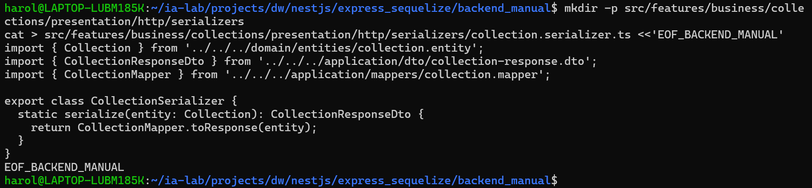

#### 8.19 — features/business/collections/presentation/http/controllers/collections.controller.ts
Controller delgado: valida DTO, llama use-case, devuelve respuesta.

**Archivo** `src/features/business/collections/presentation/http/controllers/collections.controller.ts`

```bash 
mkdir -p src/features/business/collections/presentation/http/controllers
cat > src/features/business/collections/presentation/http/controllers/collections.controller.ts <<'EOF_BACKEND_MANUAL'
import {
  Body,
  Controller,
  Delete,
  Get,
  HttpCode,
  HttpStatus,
  Param,
  Patch,
  Post,
  Query,
} from '@nestjs/common';
import {
  ApiCreatedResponse,
  ApiNoContentResponse,
  ApiOkResponse,
  ApiOperation,
  ApiTags,
} from '@nestjs/swagger';
import { ParsePositiveIntPipe } from '../../../../../../common/pipes/parse-positive-int.pipe';
import { CreateCollectionDto } from '../../../application/dto/create-collection.dto';
import { UpdateCollectionDto } from '../../../application/dto/update-collection.dto';
import { CollectionFilterDto } from '../../../application/dto/collection-filter.dto';
import { CollectionResponseDto } from '../../../application/dto/collection-response.dto';
import { CreateCollectionUseCase } from '../../../application/use-cases/create-collection.use-case';
import { UpdateCollectionUseCase } from '../../../application/use-cases/update-collection.use-case';
import { DeleteCollectionUseCase } from '../../../application/use-cases/delete-collection.use-case';
import { GetCollectionUseCase } from '../../../application/use-cases/get-collection.use-case';
import { ListCollectionsUseCase } from '../../../application/use-cases/list-collections.use-case';

@ApiTags('Collections')
@Controller('collections')
export class CollectionsController {
  constructor(
    private readonly createCollectionUseCase: CreateCollectionUseCase,
    private readonly updateCollectionUseCase: UpdateCollectionUseCase,
    private readonly deleteCollectionUseCase: DeleteCollectionUseCase,
    private readonly getCollectionUseCase: GetCollectionUseCase,
    private readonly listCollectionsUseCase: ListCollectionsUseCase,
  ) {}

  @Post()
  @ApiOperation({ summary: 'Crear una colección' })
  @ApiCreatedResponse({ type: CollectionResponseDto })
  create(@Body() dto: CreateCollectionDto) {
    return this.createCollectionUseCase.execute(dto);
  }

  @Get()
  @ApiOperation({ summary: 'Listar colecciones' })
  @ApiOkResponse({ type: [CollectionResponseDto] })
  findAll(@Query() filter: CollectionFilterDto) {
    return this.listCollectionsUseCase.execute(filter);
  }

  @Get(':id')
  @ApiOperation({ summary: 'Obtener una colección por ID' })
  @ApiOkResponse({ type: CollectionResponseDto })
  findOne(@Param('id', ParsePositiveIntPipe) id: number) {
    return this.getCollectionUseCase.execute(id);
  }

  @Patch(':id')
  @ApiOperation({ summary: 'Actualizar una colección' })
  @ApiOkResponse({ type: CollectionResponseDto })
  update(
    @Param('id', ParsePositiveIntPipe) id: number,
    @Body() dto: UpdateCollectionDto,
  ) {
    return this.updateCollectionUseCase.execute(id, dto);
  }

  @Delete(':id')
  @HttpCode(HttpStatus.NO_CONTENT)
  @ApiOperation({ summary: 'Eliminar una colección' })
  @ApiNoContentResponse()
  remove(@Param('id', ParsePositiveIntPipe) id: number) {
    return this.deleteCollectionUseCase.execute(id);
  }
}
EOF_BACKEND_MANUAL
```
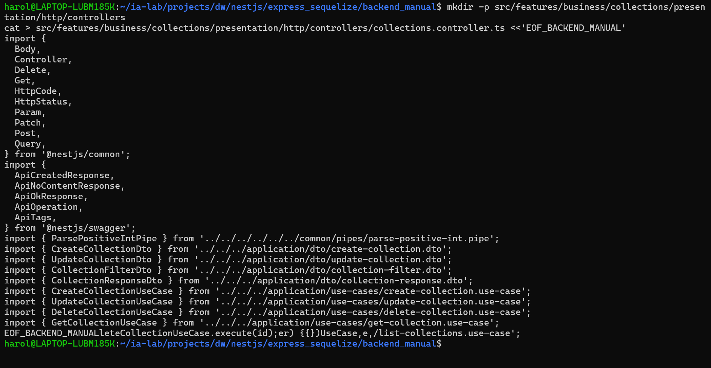

#### 8.20 — features/business/collections/index.ts
Barrel export del feature.

```bash
mkdir -p src/features/business/collections
cat > src/features/business/collections/index.ts <<'EOF_BACKEND_MANUAL'
export { CollectionsModule } from './collections.module';
EOF_BACKEND_MANUAL
```
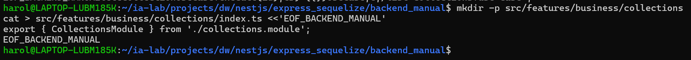

#### 8.21 — features/business/collections/collections.module.ts
Módulo Nest del feature.

```bash 
mkdir -p src/features/business/collections
cat > src/features/business/collections/collections.module.ts <<'EOF_BACKEND_MANUAL'
import { Module } from '@nestjs/common';
import { COLLECTION_REPOSITORY } from './domain/interfaces/collection-repository.interface';
import { CollectionRepository } from './infrastructure/persistence/repositories/collection.repository';
import { CreateCollectionUseCase } from './application/use-cases/create-collection.use-case';
import { UpdateCollectionUseCase } from './application/use-cases/update-collection.use-case';
import { DeleteCollectionUseCase } from './application/use-cases/delete-collection.use-case';
import { GetCollectionUseCase } from './application/use-cases/get-collection.use-case';
import { ListCollectionsUseCase } from './application/use-cases/list-collections.use-case';
import { CollectionsController } from './presentation/http/controllers/collections.controller';

@Module({
  controllers: [CollectionsController],
  providers: [
    CollectionRepository,
    { provide: COLLECTION_REPOSITORY, useExisting: CollectionRepository },
    CreateCollectionUseCase,
    UpdateCollectionUseCase,
    DeleteCollectionUseCase,
    GetCollectionUseCase,
    ListCollectionsUseCase,
  ],
  exports: [COLLECTION_REPOSITORY],
})
export class CollectionsModule {}
EOF_BACKEND_MANUAL
```
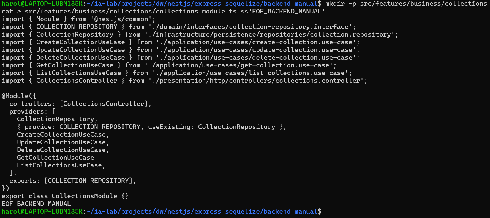

#### 8.22 — Actualizar sequelize.factory.ts
Registrar CollectionModel.

```bash 
import { Sequelize } from 'sequelize-typescript';
import { DatabaseDialect } from '../../../config/environment/env.interface';
import { getSequelizeOptions } from './sequelize.options';

import { ClientModel } from '../../../features/business/clients/infrastructure/persistence/models/client.model';
import { CollectionModel } from '../../../features/business/collections/infrastructure/persistence/models/collection.model';

export const ALL_MODELS = [
  ClientModel,
  CollectionModel,
];

export async function createSequelizeInstance(
  dialect: DatabaseDialect,
): Promise<Sequelize> {
  const options = getSequelizeOptions(dialect);

  let dialectModule: any;
  switch (dialect) {
    case DatabaseDialect.MySQL:
      dialectModule = require('mysql2');
      break;
    case DatabaseDialect.Postgres:
      dialectModule = require('pg');
      break;
    case DatabaseDialect.MSSQL:
      dialectModule = require('tedious');
      break;
    case DatabaseDialect.Oracle:
      dialectModule = require('oracledb');
      break;
    default:
      throw new Error(`Dialecto no soportado: ${dialect}`);
  }

  const sequelize = new Sequelize({
    ...options,
    dialectModule,
    models: ALL_MODELS,
  } as any);

  if (process.env.NODE_ENV !== 'production') {
    await sequelize.sync({ alter: false });
    console.log('✅ Tablas sincronizadas');
  }

  return sequelize;
}
```

#### 8.23 — Actualizar business.module.ts
Agregar CollectionsModule.

```bash
import { Module } from '@nestjs/common';
import { ClientsModule } from './clients/clients.module';
import { CollectionsModule } from './collections/collections.module';

@Module({
  imports: [ClientsModule, CollectionsModule],
  exports: [ClientsModule, CollectionsModule],
})
export class BusinessModule {}
```
#### 8.24 — Actualizar database-seeder.service.ts
Ejecutar seedCollections.

**Ruta** `src/infrastructure/database/seeders/database-seeder.service.ts`

```bash
import { Injectable, OnModuleInit } from '@nestjs/common';
import { seedClients } from '../../../features/business/clients/infrastructure/persistence/seeders/clients.seeder.js';
import { seedCollections } from '../../../features/business/collections/infrastructure/persistence/seeders/collections.seeder.js';

@Injectable()
export class DatabaseSeederService implements OnModuleInit {
  async onModuleInit(): Promise<void> {
    if (process.env.NODE_ENV === 'production') return;

    await seedClients();
    await seedCollections();
  }
}
```
#### 8.25 — Actualizar app.module.ts
Mantener BusinessModule con CollectionsModule.

```bash
import { Module } from '@nestjs/common';
import { ConfigModule } from '@nestjs/config';
import { envConfig } from './config/environment/env.config.js';
import { appConfig } from './config/app/app.config.js';
import { jwtConfig } from './config/jwt/jwt.config.js';
import { LoggerModule } from './config/logger/logger.module.js';
import { SequelizeDatabaseModule } from './infrastructure/database/sequelize/sequelize.module.js';
import { SecurityModule } from './infrastructure/security/security.module.js';
import { BusinessModule } from './features/business/business.module.js';
import { AppController } from './app.controller.js';
import { AppService } from './app.service.js';

@Module({
  imports: [
    ConfigModule.forRoot({
      isGlobal: true,
      load: [envConfig, appConfig, jwtConfig],
      envFilePath: '.env',
    }),
    SequelizeDatabaseModule,
    SecurityModule,
    LoggerModule,
    BusinessModule, 
  ],
  controllers: [AppController],
  providers: [AppService],
})
export class AppModule {}
``` 

#### 8.26 — Verificar tabla collections
Ejecuta:
```bash
npm run start:dev
``` 
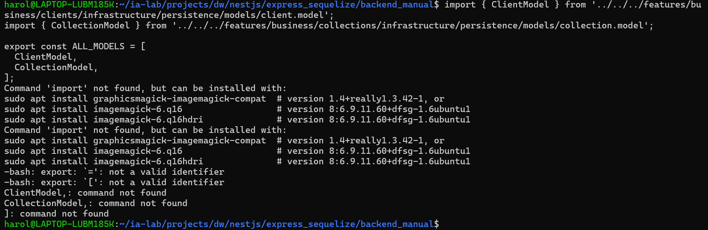


------------------------------------------------------------------------

## FASE 9 — `08_BUSINESS_PRODUCTS`

### Business — Products

**Archivo** `src/features/business/products/domain/entities/product.entity.ts`

Contiene las reglas de negocio: validaciones de nombre, marca, precio, stock.

**Métodos clave:** create, update, deactivate, reduceStock.

```bash
import { Status } from '../../../../../common/enums/status.enum';
import { InvalidProductPriceException } from '../exceptions/invalid-product-price.exception';
import { InvalidProductStockException } from '../exceptions/invalid-product-stock.exception';
import { isValidPrice } from '../validators/product-price.validator';
import { isValidStock } from '../validators/product-stock.validator';

export interface ProductProps {
  id?: number;
  name: string;
  brand: string;
  price: number;
  minStock: number;
  quantity: number;
  productTypeId: number;
  status?: Status;
  createdAt?: Date;
  updatedAt?: Date;
}

export class Product {
  id?: number;
  name: string;
  brand: string;
  price: number;
  minStock: number;
  quantity: number;
  productTypeId: number;
  status: Status;
  createdAt?: Date;
  updatedAt?: Date;

  private constructor(props: ProductProps) {
    this.id = props.id;
    this.name = props.name;
    this.brand = props.brand;
    this.price = props.price;
    this.minStock = props.minStock;
    this.quantity = props.quantity;
    this.productTypeId = props.productTypeId;
    this.status = props.status ?? Status.ACTIVE;
    this.createdAt = props.createdAt;
    this.updatedAt = props.updatedAt;
  }

  static create(props: Omit<ProductProps, 'id' | 'status' | 'createdAt' | 'updatedAt'>): Product {
    if (!props.name?.trim()) throw new Error('El nombre del producto es requerido');
    if (!props.brand?.trim()) throw new Error('La marca del producto es requerida');
    if (!isValidPrice(props.price)) throw new InvalidProductPriceException(props.price);
    if (!isValidStock(props.quantity)) throw new InvalidProductStockException(props.quantity);
    if (!isValidStock(props.minStock)) throw new InvalidProductStockException(props.minStock);

    return new Product(props);
  }

  static reconstitute(props: ProductProps): Product {
    return new Product(props);
  }

  update(props: Partial<Omit<ProductProps, 'id' | 'status' | 'createdAt' | 'updatedAt'>>): void {
    if (props.name !== undefined) {
      if (!props.name.trim()) throw new Error('El nombre del producto es requerido');
      this.name = props.name;
    }
    if (props.brand !== undefined) {
      if (!props.brand.trim()) throw new Error('La marca del producto es requerida');
      this.brand = props.brand;
    }
    if (props.price !== undefined) {
      if (!isValidPrice(props.price)) throw new InvalidProductPriceException(props.price);
      this.price = props.price;
    }
    if (props.minStock !== undefined) {
      if (!isValidStock(props.minStock)) throw new InvalidProductStockException(props.minStock);
      this.minStock = props.minStock;
    }
    if (props.quantity !== undefined) {
      if (!isValidStock(props.quantity)) throw new InvalidProductStockException(props.quantity);
      this.quantity = props.quantity;
    }
    if (props.productTypeId !== undefined) {
      this.productTypeId = props.productTypeId;
    }
  }

  deactivate(): void {
    this.status = Status.INACTIVE;
  }

  reduceStock(amount: number): void {
    const newQuantity = this.quantity - amount;
    if (!isValidStock(newQuantity)) throw new InvalidProductStockException(newQuantity);
    this.quantity = newQuantity;
  }
}
``` 
--- imagen aca

#### 9.2 src/features/business/products/domain/exceptions/invalid-product-price.exception.ts

Se lanza cuando el precio es menor o igual a 0.

**Archivo** `src/features/business/products/domain/exceptions/invalid-product-price.exception.ts`

```bash 
import { DomainException } from '../../../../../common/exceptions/domain.exception';

export class InvalidProductStockException extends DomainException.js {
  constructor(stock: number) {
    super(`El stock '${stock}' no puede ser negativo`);
  }
}
```
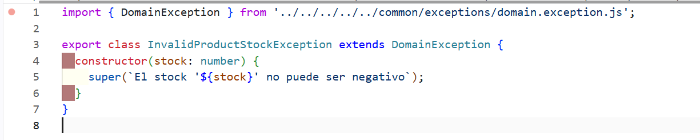

#### 9.3 src/features/business/products/domain/exceptions/invalid-product-stock.exception.ts

Se lanza cuando el stock es negativo.

**Archivo:** `src/features/business/products/domain/exceptions/invalid-product-stock.exception.ts`

```bash 
import { DomainException } from '../../../../../common/exceptions/domain.exception.js';

export class InvalidProductStockException extends DomainException {
  constructor(stock: number) {
    super(`El stock '${stock}' no puede ser negativo`);
  }
}
```
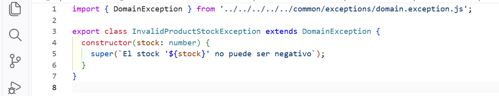


#### 9.4 src/features/business/products/domain/exceptions/product-not-found.exception.ts

Se lanza cuando no se encuentra un producto por ID.

**Archivo** `src/features/business/products/domain/exceptions/product-not-found.exception.ts`

```bash
import { EntityNotFoundException } from '../../../../../common/exceptions/entity-not-found.exception.js';

export class ProductNotFoundException extends EntityNotFoundException {
  constructor(id: number) {
    super('Producto', id);
  }
}
```
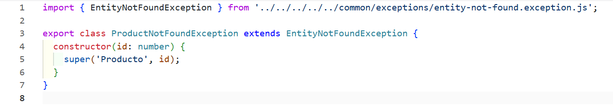

#### 9.5 src/features/business/products/domain/interfaces/product-repository.interface.ts

Define el contrato del repositorio (create, update, delete, findById, findAll).

La aplicación depende de esta interface, no directamente de Sequelize.

**Archivo** `src/features/business/products/domain/interfaces/product-repository.interface.ts`

```bash
import { PaginatedResult } from '../../../../../common/interfaces/pagination.interface.js';
import { Product } from '../entities/product.entity.js';

export const PRODUCT_REPOSITORY = 'PRODUCT_REPOSITORY';

export interface ProductFindAllParams {
  page?: number;
  limit?: number;
  search?: string;
  productTypeId?: number;
}

export interface IProductRepository {
  create(product: Product): Promise<Product>;
  update(product: Product): Promise<Product>;
  delete(id: number): Promise<void>;
  findById(id: number): Promise<Product | null>;
  findAll(params: ProductFindAllParams): Promise<PaginatedResult<Product>>;
}
```
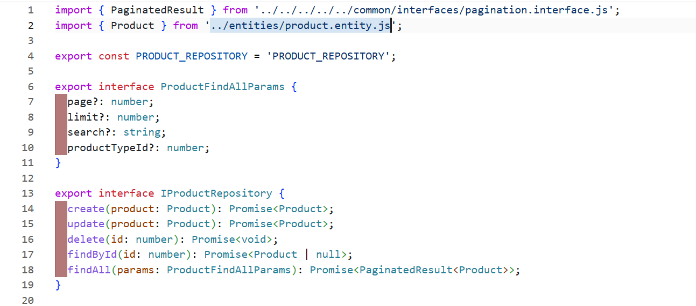

#### 9.6 src/features/business/products/domain/validators/product-price.validator.ts

Valida que el precio sea mayor a 0.

**ruta** `src/features/business/products/domain/validators/product-price.validator.ts`

```bash
export function isValidPrice(price: number): boolean {
  return price > 0;
}
``` 
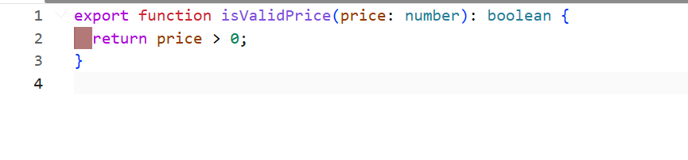

#### 9.7 src/features/business/products/domain/validators/product-stock.validator.ts

Valida que el stock no sea negativo.

**ruta** `src/features/business/products/domain/validators/product-stock.validator.ts`

```bash 
export function isValidStock(stock: number): boolean {
  return stock >= 0;
}
```
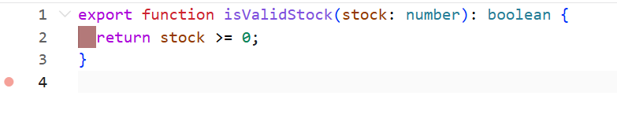

#### 9.8 src/features/business/products/infrastructure/persistence/models/product.model.ts

Define la tabla products.

**ruta** `src/features/business/products/infrastructure/persistence/models/product.model.ts`


```bash 
import {
  AutoIncrement,
  Column,
  CreatedAt,
  DataType,
  ForeignKey,
  Model,
  PrimaryKey,
  Table,
  UpdatedAt,
} from 'sequelize-typescript';
import { Status } from '../../../../../../common/enums/status.enum.js';

@Table({ tableName: 'products' })
export class ProductModel extends Model {
  @PrimaryKey
  @AutoIncrement
  @Column(DataType.INTEGER)
  declare id: number;

  @Column({ type: DataType.STRING(150), allowNull: false })
  declare name: string;

  @Column({ type: DataType.STRING(100), allowNull: false })
  declare brand: string;

  @Column({ type: DataType.BIGINT, allowNull: false })
  declare price: number;

  @Column({ type: DataType.INTEGER, allowNull: false, defaultValue: 0 })
  declare minStock: number;

  @Column({ type: DataType.INTEGER, allowNull: false, defaultValue: 0 })
  declare quantity: number;

  @ForeignKey(() => Number)
  @Column({ type: DataType.INTEGER, allowNull: false })
  declare productTypeId: number;

  @Column({
    type: DataType.ENUM(...Object.values(Status)),
    allowNull: false,
    defaultValue: Status.ACTIVE,
  })
  declare status: Status;

  @CreatedAt
  declare createdAt: Date;

  @UpdatedAt
  declare updatedAt: Date;
}
```
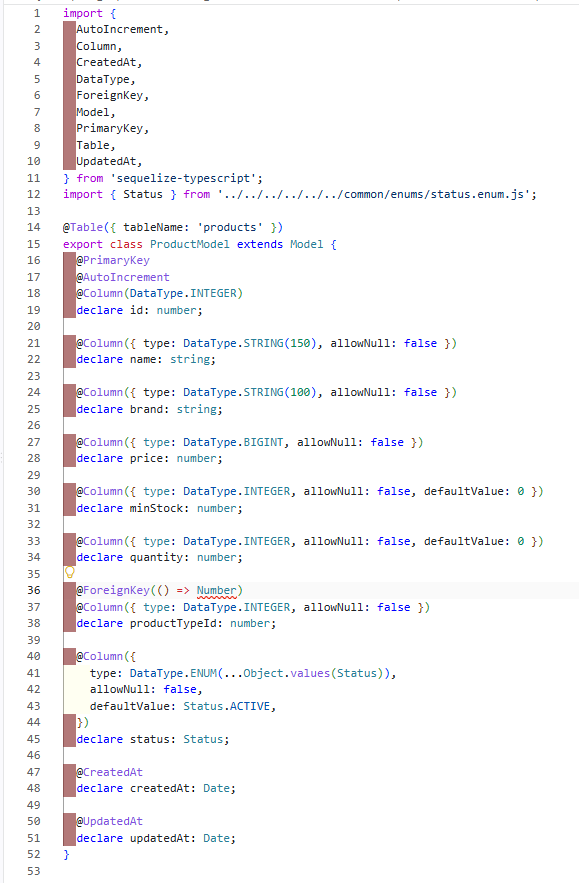

#### 9.9 src/features/business/products/infrastructure/persistence/repositories/product.repository.ts

Implementa el contrato IProductRepository usando Sequelize.

**ruta** `src/features/business/products/infrastructure/persistence/repositories/product.repository.ts`

```bash
import { Injectable } from '@nestjs/common';
import { Op, WhereOptions } from 'sequelize';
import {
  buildPaginatedResult,
  normalizePagination,
} from '../../../../../../common/utils/pagination.util';
import { Product } from '../../../domain/entities/product.entity';
import {
  IProductRepository,
  ProductFindAllParams,
} from '../../../domain/interfaces/product-repository.interface';
import { ProductMapper } from '../../../application/mappers/product.mapper';
import { ProductModel } from '../models/product.model';

@Injectable()
export class ProductRepository implements IProductRepository {
  async create(product: Product): Promise<Product> {
    const model = await ProductModel.create(ProductMapper.toPersistence(product));
    return ProductMapper.toDomain(model);
  }

  async update(product: Product): Promise<Product> {
    await ProductModel.update(ProductMapper.toPersistence(product), {
      where: { id: product.id },
    });
    const updated = await ProductModel.findByPk(product.id!);
    return ProductMapper.toDomain(updated!);
  }

  async delete(id: number): Promise<void> {
    await ProductModel.destroy({ where: { id } });
  }

  async findById(id: number): Promise<Product | null> {
    const model = await ProductModel.findByPk(id);
    return model ? ProductMapper.toDomain(model) : null;
  }

  async findAll(params: ProductFindAllParams) {
    const { page, limit, offset } = normalizePagination(params.page, params.limit);

    const where: WhereOptions = {};

    if (params.search) {
      Object.assign(where, {
        [Op.or]: [
          { name: { [Op.like]: `%${params.search}%` } },
          { brand: { [Op.like]: `%${params.search}%` } },
        ],
      });
    }

    if (params.productTypeId) {
      where.productTypeId = params.productTypeId;
    }

    const { rows, count } = await ProductModel.findAndCountAll({
      where,
      limit,
      offset,
      order: [['createdAt', 'DESC']],
    });

    return buildPaginatedResult(
      rows.map((row) => ProductMapper.toDomain(row)),
      count,
      page,
      limit,
    );
  }
}
```
--- imagen aca

#### 9.10 src/features/business/products/infrastructure/persistence/migrations/create-products-table.migration.ts

Documento auxiliar para la tabla products. En desarrollo, Sequelize sync crea la tabla automáticamente.

**ruta** `src/features/business/products/infrastructure/persistence/migrations/create-products-table.migration.ts`

```bash 
export const createProductsTableMigration = {
  name: 'create-products-table',
  async up(): Promise<void> {
    // Sequelize sync handles table creation in development.
    // Production: CREATE TABLE products (...)
  },
  async down(): Promise<void> {
    // Production: DROP TABLE products
  },
};
```
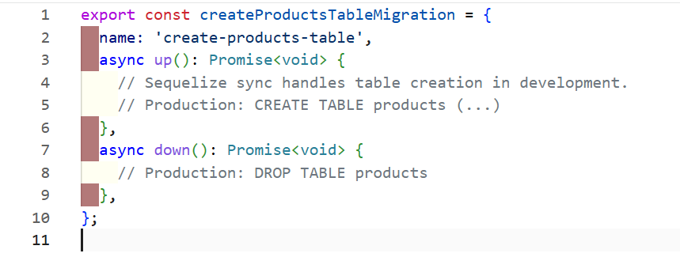

#### 9.11 src/features/business/products/infrastructure/persistence/seeders/products.seeder.ts

Carga datos iniciales de prueba en la tabla products.

**ruta** `src/features/business/products/infrastructure/persistence/seeders/products.seeder.ts`

```bash 
import { ProductModel } from '../models/product.model';
import { Status } from '../../../../../../common/enums/status.enum';

export async function seedProducts(): Promise<void> {
  const count = await ProductModel.count();
  if (count > 0) return;

  await ProductModel.bulkCreate([
    {
      name: 'Smartphone X',
      brand: 'TechBrand',
      price: 59999,
      minStock: 5,
      quantity: 50,
      productTypeId: 1,
      status: Status.ACTIVE,
    },
    {
      name: 'Wireless Headphones',
      brand: 'AudioPro',
      price: 12999,
      minStock: 10,
      quantity: 100,
      productTypeId: 1,
      status: Status.ACTIVE,
    },
  ]);
}
``` 
#### 9.12 src/features/business/products/application/dto/create-product.dto.ts

Define la estructura y validaciones para crear un producto vía HTTP.

**ruta** `src/features/business/products/application/dto/create-product.dto.ts`

```bash
mkdir -p src/features/business/products/application/dto
cat > src/features/business/products/application/dto/create-product.dto.ts <<'EOF_BACKEND_IA'
import { ApiProperty } from '@nestjs/swagger';
import {
  IsInt,
  IsNotEmpty,
  IsNumber,
  IsPositive,
  IsString,
  MaxLength,
  Min,
} from 'class-validator';

export class CreateProductDto {
  @ApiProperty({ example: 'Smartphone X' })
  @IsString()
  @IsNotEmpty()
  @MaxLength(150)
  name: string;

  @ApiProperty({ example: 'TechBrand' })
  @IsString()
  @IsNotEmpty()
  @MaxLength(100)
  brand: string;

  @ApiProperty({ example: 59999 })
  @IsNumber()
  @IsPositive()
  price: number;

  @ApiProperty({ example: 5 })
  @IsInt()
  @Min(0)
  minStock: number;

  @ApiProperty({ example: 50 })
  @IsInt()
  @Min(0)
  quantity: number;

  @ApiProperty({ example: 1 })
  @IsInt()
  @IsPositive()
  productTypeId: number;
}
EOF_BACKEND_IA
```
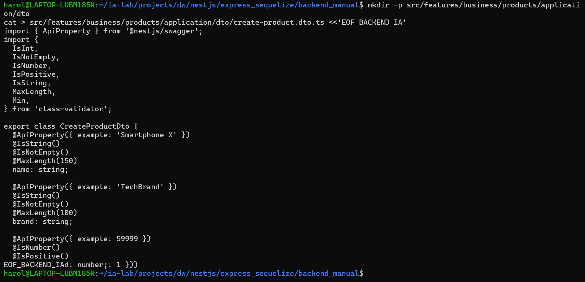

#### 9.13 src/features/business/products/application/dto/product-filter.dto.ts

Define filtros de búsqueda y paginación para listar productos.

**ruta** `src/features/business/products/application/dto/product-filter.dto.ts`

```bash 
cat > src/features/business/products/application/dto/product-filter.dto.ts <<'EOF_BACKEND_IA'
import { ApiPropertyOptional } from '@nestjs/swagger';
import { Type } from 'class-transformer';
import { IsInt, IsOptional, IsPositive, IsString, Min } from 'class-validator';

export class ProductFilterDto {
  @ApiPropertyOptional({ example: 1 })
  @IsOptional()
  @Type(() => Number)
  @IsInt()
  @Min(1)
  page?: number;

  @ApiPropertyOptional({ example: 10 })
  @IsOptional()
  @Type(() => Number)
  @IsInt()
  @IsPositive()
  limit?: number;

  @ApiPropertyOptional({ example: 'smartphone' })
  @IsOptional()
  @IsString()
  search?: string;

  @ApiPropertyOptional({ example: 1 })
  @IsOptional()
  @Type(() => Number)
  @IsInt()
  @IsPositive()
  productTypeId?: number;
}
EOF_BACKEND_IA
```
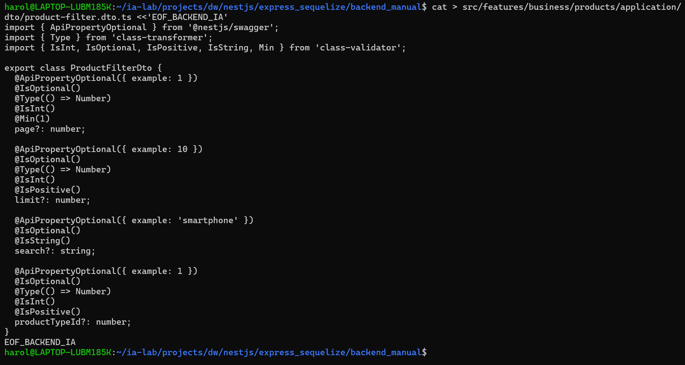

#### 9.14 src/features/business/products/application/dto/product-response.dto.ts

Define la estructura de salida al devolver un producto vía API.

**ruta** `src/features/business/products/application/dto/product-response.dto.ts`

```bash 
cat > src/features/business/products/application/dto/product-response.dto.ts <<'EOF_BACKEND_IA'
import { ApiProperty } from '@nestjs/swagger';
import { Status } from '../../../../../common/enums/status.enum';

export class ProductResponseDto {
  @ApiProperty({ example: 1 })
  id: number;

  @ApiProperty({ example: 'Smartphone X' })
  name: string;

  @ApiProperty({ example: 'TechBrand' })
  brand: string;

  @ApiProperty({ example: 59999 })
  price: number;

  @ApiProperty({ example: 5 })
  minStock: number;

  @ApiProperty({ example: 50 })
  quantity: number;

  @ApiProperty({ example: 1 })
  productTypeId: number;

  @ApiProperty({ enum: Status, example: Status.ACTIVE })
  status: Status;

  @ApiProperty()
  createdAt: Date;

  @ApiProperty()
  updatedAt: Date;
}
EOF_BACKEND_IA
```
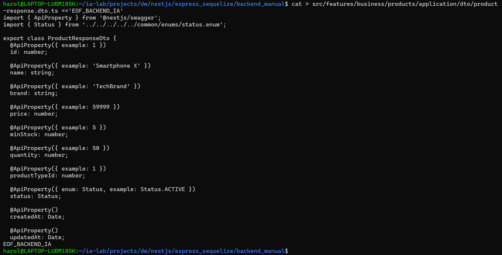

#### 9.15 src/features/business/products/application/dto/update-product.dto.ts

Extiende el DTO de creación, pero todos los campos son opcionales.

**ruta** `src/features/business/products/application/dto/update-product.dto.ts`

```bash
cat > src/features/business/products/application/dto/update-product.dto.ts <<'EOF_BACKEND_IA'
import { PartialType } from '@nestjs/mapped-types';
import { CreateProductDto } from './create-product.dto';

export class UpdateProductDto extends PartialType(CreateProductDto) {}
EOF_BACKEND_IA
``` 
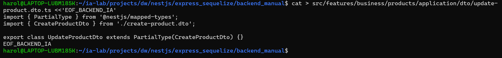

#### 9.16 src/features/business/products/application/mappers/product.mapper.ts

Convierte entre ProductModel ↔ Product ↔ ProductResponseDto.

**ruta** `src/features/business/products/application/mappers/product.mapper.ts`

```bash
mkdir -p src/features/business/products/application/mappers
cat > src/features/business/products/application/mappers/product.mapper.ts <<'EOF_BACKEND_IA'
import { Status } from '../../../../../common/enums/status.enum.js';
import { Product } from '../../domain/entities/product.entity.js';
import { ProductResponseDto } from '../dto/product-response.dto.js';
import { ProductModel } from '../../infrastructure/persistence/models/product.model.js';

export class ProductMapper {
  static toDomain(model: ProductModel): Product {
    return Product.reconstitute({
      id: model.id,
      name: model.name,
      brand: model.brand,
      price: Number(model.price),
      minStock: model.minStock,
      quantity: model.quantity,
      productTypeId: model.productTypeId,
      status: model.status,
      createdAt: model.createdAt,
      updatedAt: model.updatedAt,
    });
  }

  static toResponse(entity: Product): ProductResponseDto {
    return {
      id: entity.id!,
      name: entity.name,
      brand: entity.brand,
      price: entity.price,
      minStock: entity.minStock,
      quantity: entity.quantity,
      productTypeId: entity.productTypeId,
      status: entity.status,
      createdAt: entity.createdAt!,
      updatedAt: entity.updatedAt!,
    };
  }

  static toPersistence(entity: Product): Partial<ProductModel> {
    return {
      id: entity.id,
      name: entity.name,
      brand: entity.brand,
      price: entity.price,
      minStock: entity.minStock,
      quantity: entity.quantity,
      productTypeId: entity.productTypeId,
      status: entity.status ?? Status.ACTIVE,
    };
  }
}
EOF_BACKEND_IA
```
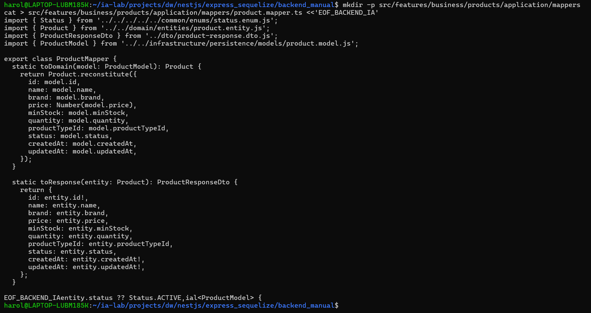

#### 9.17 src/features/business/products/application/use-cases/create-product.use-case.ts

Crea un producto validando que exista el tipo de producto.

**ruta** `src/features/business/products/application/use-cases/create-product.use-case.ts`

```bash
mkdir -p src/features/business/products/application/use-cases
cat > src/features/business/products/application/use-cases/create-product.use-case.ts <<'EOF_BACKEND_IA'
import { Inject, Injectable } from '@nestjs/common';
import { ProductTypeNotFoundException } from '../../../product-types/domain/exceptions/product-type-not-found.exception.js';
import {
  IProductTypeRepository,
  PRODUCT_TYPE_REPOSITORY,
} from '../../../product-types/domain/interfaces/product-type-repository.interface.js';
import { Product } from '../../domain/entities/product.entity.js';
import {
  IProductRepository,
  PRODUCT_REPOSITORY,
} from '../../domain/interfaces/product-repository.interface.js';
import { CreateProductDto } from '../dto/create-product.dto.js';
import { ProductMapper } from '../mappers/product.mapper.js';

@Injectable()
export class CreateProductUseCase {
  constructor(
    @Inject(PRODUCT_REPOSITORY)
    private readonly productRepository: IProductRepository,
    @Inject(PRODUCT_TYPE_REPOSITORY)
    private readonly productTypeRepository: IProductTypeRepository,
  ) {}

  async execute(dto: CreateProductDto) {
    const productType = await this.productTypeRepository.findById(dto.productTypeId);
    if (!productType) {
      throw new ProductTypeNotFoundException(dto.productTypeId);
    }

    const product = Product.create(dto);
    const created = await this.productRepository.create(product);
    return ProductMapper.toResponse(created);
  }
}
EOF_BACKEND_IA
```
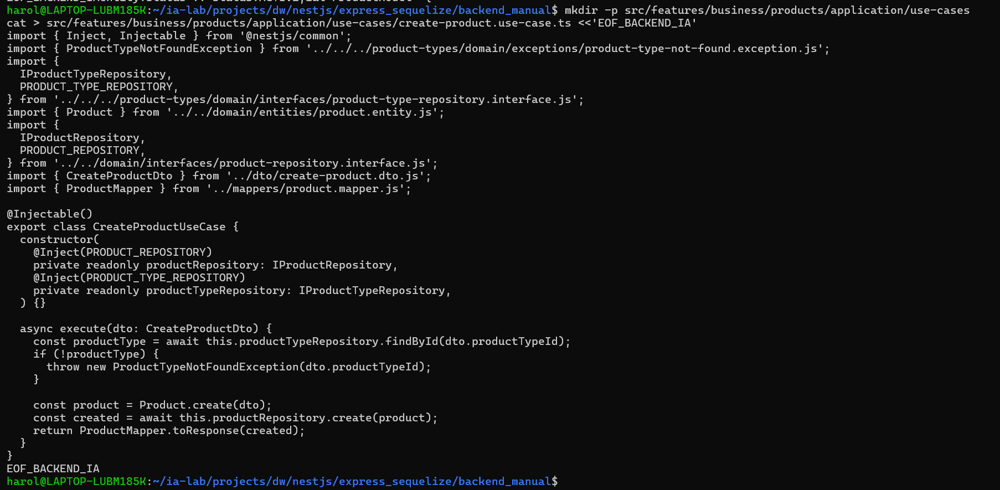

#### 9.18 src/features/business/products/application/use-cases/delete-product.use-case.ts

Elimina un producto validando que exista.

**ruta** `src/features/business/products/application/use-cases/delete-product.use-case.ts`

```bash
cat > src/features/business/products/application/use-cases/delete-product.use-case.ts <<'EOF_BACKEND_IA'
import { Inject, Injectable } from '@nestjs/common';
import { ProductNotFoundException } from '../../domain/exceptions/product-not-found.exception.js';
import {
  IProductRepository,
  PRODUCT_REPOSITORY,
} from '../../domain/interfaces/product-repository.interface.js';

@Injectable()
export class DeleteProductUseCase {
  constructor(
    @Inject(PRODUCT_REPOSITORY)
    private readonly productRepository: IProductRepository,
  ) {}

  async execute(id: number): Promise<void> {
    const product = await this.productRepository.findById(id);
    if (!product) {
      throw new ProductNotFoundException(id);
    }
    await this.productRepository.delete(id);
  }
}
EOF_BACKEND_IA
```
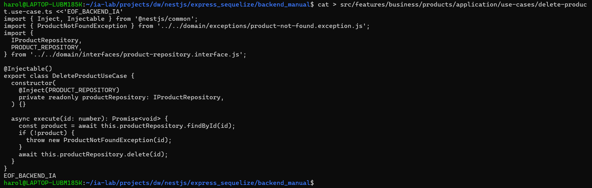

#### 9.19 src/features/business/products/application/use-cases/get-product.use-case.ts

Obtiene un producto por ID.

**ruta** `src/features/business/products/application/use-cases/get-product.use-case.ts`

```bash
cat > src/features/business/products/application/use-cases/get-product.use-case.ts <<'EOF_BACKEND_IA'
import { Inject, Injectable } from '@nestjs/common';
import { ProductNotFoundException } from '../../domain/exceptions/product-not-found.exception.js';
import {
  IProductRepository,
  PRODUCT_REPOSITORY,
} from '../../domain/interfaces/product-repository.interface.js';
import { ProductMapper } from '../mappers/product.mapper.js';

@Injectable()
export class GetProductUseCase {
  constructor(
    @Inject(PRODUCT_REPOSITORY)
    private readonly productRepository: IProductRepository,
  ) {}

  async execute(id: number) {
    const product = await this.productRepository.findById(id);
    if (!product) {
      throw new ProductNotFoundException(id);
    }
    return ProductMapper.toResponse(product);
  }
}
EOF_BACKEND_IA
```
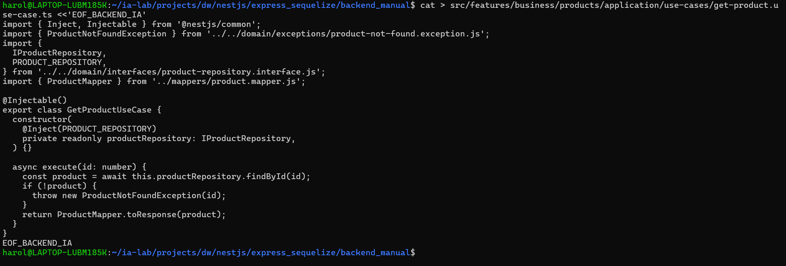

#### 9.20 src/features/business/products/application/use-cases/list-products.use-case.ts

Lista productos con filtros y paginación.

**ruta** `src/features/business/products/application/use-cases/list-products.use-case.ts`

```bash
cat > src/features/business/products/application/use-cases/list-products.use-case.ts <<'EOF_BACKEND_IA'
import { Inject, Injectable } from '@nestjs/common';
import {
  IProductRepository,
  PRODUCT_REPOSITORY,
} from '../../domain/interfaces/product-repository.interface.js';
import { ProductFilterDto } from '../dto/product-filter.dto.js';
import { ProductMapper } from '../mappers/product.mapper.js';

@Injectable()
export class ListProductsUseCase {
  constructor(
    @Inject(PRODUCT_REPOSITORY)
    private readonly productRepository: IProductRepository,
  ) {}

  async execute(filter: ProductFilterDto) {
    const result = await this.productRepository.findAll(filter);
    return {
      items: result.items.map((product) => ProductMapper.toResponse(product)),
      meta: result.meta,
    };
  }
}
EOF_BACKEND_IA
```
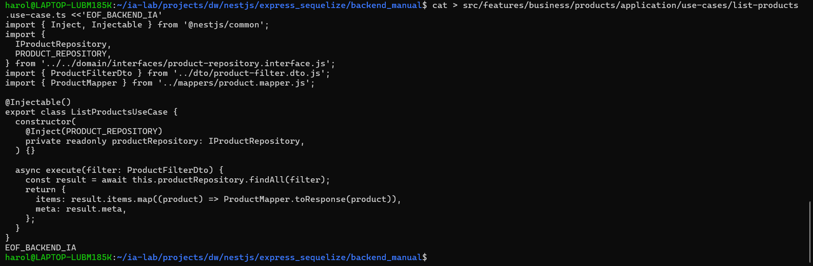

#### 9.21 src/features/business/products/application/use-cases/update-product.use-case.ts

Actualiza un producto validando que exista y aplicando las reglas de negocio.

**ruta** `src/features/business/products/application/use-cases/update-product.use-case.ts`

```bash
mkdir -p src/features/business/products/application/use-cases
cat > src/features/business/products/application/use-cases/update-product.use-case.ts <<'EOF_BACKEND_IA'
import { Inject, Injectable } from '@nestjs/common';
import { ProductNotFoundException } from '../../domain/exceptions/product-not-found.exception.js';
import {
  IProductRepository,
  PRODUCT_REPOSITORY,
} from '../../domain/interfaces/product-repository.interface.js';
import { UpdateProductDto } from '../dto/update-product.dto.js';
import { ProductMapper } from '../mappers/product.mapper.js';

@Injectable()
export class UpdateProductUseCase {
  constructor(
    @Inject(PRODUCT_REPOSITORY)
    private readonly productRepository: IProductRepository,
  ) {}

  async execute(id: number, dto: UpdateProductDto) {
    const product = await this.productRepository.findById(id);
    if (!product) {
      throw new ProductNotFoundException(id);
    }

    product.update(dto);
    const updated = await this.productRepository.update(product);
    return ProductMapper.toResponse(updated);
  }
}
EOF_BACKEND_IA
```
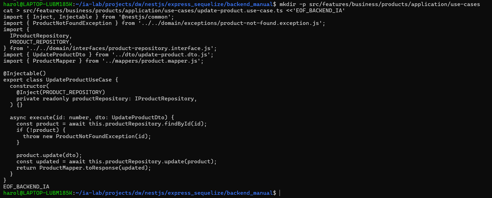

#### 9.22 src/features/business/products/infrastructure/controllers/products.controller.ts

Define los endpoints REST para el CRUD de productos.

**ruta** `src/features/business/products/infrastructure/controllers/products.controller.ts`

```bash
mkdir -p src/features/business/products/infrastructure/controllers
cat > src/features/business/products/infrastructure/controllers/products.controller.ts <<'EOF_BACKEND_IA'
import {
  Body,
  Controller,
  Delete,
  Get,
  Param,
  Patch,
  Post,
  Query,
} from '@nestjs/common';
import { ApiTags } from '@nestjs/swagger';
import { CreateProductDto } from '../../application/dto/create-product.dto.js';
import { UpdateProductDto } from '../../application/dto/update-product.dto.js';
import { ProductFilterDto } from '../../application/dto/product-filter.dto.js';
import { CreateProductUseCase } from '../../application/use-cases/create-product.use-case.js';
import { GetProductUseCase } from '../../application/use-cases/get-product.use-case.js';
import { ListProductsUseCase } from '../../application/use-cases/list-products.use-case.js';
import { UpdateProductUseCase } from '../../application/use-cases/update-product.use-case.js';
import { DeleteProductUseCase } from '../../application/use-cases/delete-product.use-case.js';

@ApiTags('Products')
@Controller('api/products')
export class ProductsController {
  constructor(
    private readonly createProduct: CreateProductUseCase,
    private readonly getProduct: GetProductUseCase,
    private readonly listProducts: ListProductsUseCase,
    private readonly updateProduct: UpdateProductUseCase,
    private readonly deleteProduct: DeleteProductUseCase,
  ) {}

  @Post()
  async create(@Body() dto: CreateProductDto) {
    return this.createProduct.execute(dto);
  }

  @Get()
  async list(@Query() filter: ProductFilterDto) {
    return this.listProducts.execute(filter);
  }

  @Get(':id')
  async get(@Param('id') id: number) {
    return this.getProduct.execute(id);
  }

  @Patch(':id')
  async update(@Param('id') id: number, @Body() dto: UpdateProductDto) {
    return this.updateProduct.execute(id, dto);
  }

  @Delete(':id')
  async delete(@Param('id') id: number) {
    return this.deleteProduct.execute(id);
  }
}
EOF_BACKEND_IA
```
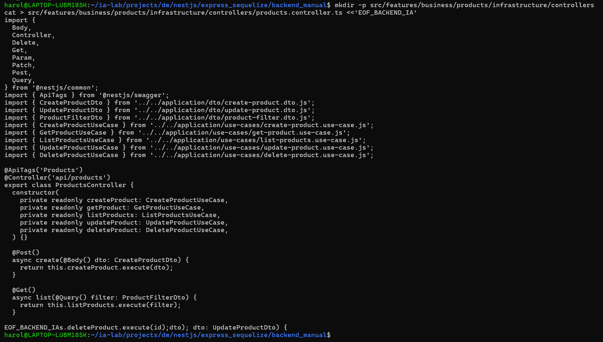

#### 9.23 src/features/business/products/products.module.ts

Agrupa repositorio, casos de uso y controller de productos.

**ruta** `src/features/business/products/products.module.ts`
```bash
mkdir -p src/features/business/products
cat > src/features/business/products/products.module.ts <<'EOF_BACKEND_IA'
import { Module } from '@nestjs/common';
import { ProductsController } from './infrastructure/controllers/products.controller.js';
import { ProductRepository } from './infrastructure/persistence/repositories/product.repository.js';
import { PRODUCT_REPOSITORY } from './domain/interfaces/product-repository.interface.js';
import { CreateProductUseCase } from './application/use-cases/create-product.use-case.js';
import { GetProductUseCase } from './application/use-cases/get-product.use-case.js';
import { ListProductsUseCase } from './application/use-cases/list-products.use-case.js';
import { UpdateProductUseCase } from './application/use-cases/update-product.use-case.js';
import { DeleteProductUseCase } from './application/use-cases/delete-product.use-case.js';

@Module({
  controllers: [ProductsController],
  providers: [
    { provide: PRODUCT_REPOSITORY, useClass: ProductRepository },
    CreateProductUseCase,
    GetProductUseCase,
    ListProductsUseCase,
    UpdateProductUseCase,
    DeleteProductUseCase,
  ],
  exports: [],
})
export class ProductsModule {}
EOF_BACKEND_IA
```
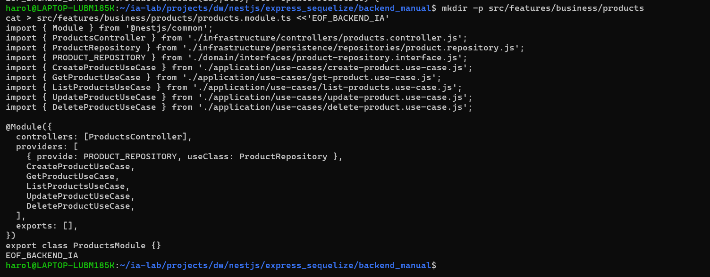

#### 9.24 src/features/business/business.module.ts

Importa el ProductsModule junto con ClientsModule y CollectionsModule.

**ruta** `src/features/business/business.module.ts`

```bash
# Abre el archivo y añade:
import { ProductsModule } from './products/products.module.js';

@Module({
  imports: [
    ClientsModule,
    CollectionsModule,
    ProductsModule, 
  ],
})
export class BusinessModule {}
```
#### 9.25 src/infrastructure/database/sequelize/seeders/index.ts

Ejecuta el seeder de productos junto con los demás.

```bash
mkdir -p src/features/business
cat > src/features/business/business.module.ts <<'EOF_BACKEND_IA'
import { Module } from '@nestjs/common';
import { ClientsModule } from './clients/clients.module.js';
import { CollectionsModule } from './collections/collections.module.js';
import { ProductsModule } from './products/products.module.js';

@Module({
  imports: [
    ClientsModule,
    CollectionsModule,
    ProductsModule,
  ],
})
export class BusinessModule {}
EOF_BACKEND_IA

```
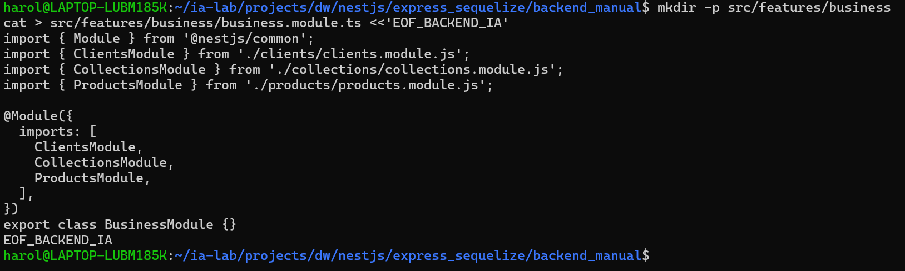

#### 9.26 src/infrastructure/database/sequelize/seeders/index.ts
 
Ejecuta el seeder de productos junto con los demás.

**ruta** `src/infrastructure/database/sequelize/seeders/index.ts`

```bash
mkdir -p src/infrastructure/database/sequelize/seeders
cat > src/infrastructure/database/sequelize/seeders/index.ts <<'EOF_BACKEND_IA'
import { seedClients } from '../../../../features/business/clients/infrastructure/persistence/seeders/clients.seeder.js';
import { seedCollections } from '../../../../features/business/collections/infrastructure/persistence/seeders/collections.seeder.js';
import { seedProducts } from '../../../../features/business/products/infrastructure/persistence/seeders/products.seeder.js';

export async function runSeeders() {
  await seedClients();
  await seedCollections();
  await seedProducts(); // ✅ nuevo
}
EOF_BACKEND_IA
```
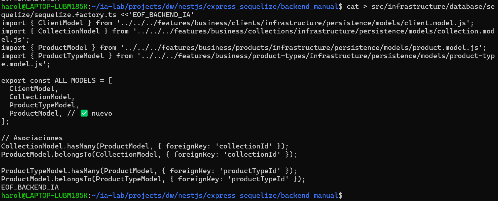

#### 9.27 src/main.ts

```bash
cat > src/main.ts <<'EOF_BACKEND_IA'
import { NestFactory } from '@nestjs/core';
import { AppModule } from './app.module.js';
import { DocumentBuilder, SwaggerModule } from '@nestjs/swagger';

async function bootstrap() {
  const app = await NestFactory.create(AppModule);

  const config = new DocumentBuilder()
    .setTitle('API')
    .setDescription('Documentación de la API')
    .setVersion('1.0')
    .build();

  const document = SwaggerModule.createDocument(app, config);
  SwaggerModule.setup('api', app, document);

  await app.listen(3000);
}
bootstrap();
EOF_BACKEND_IA
```
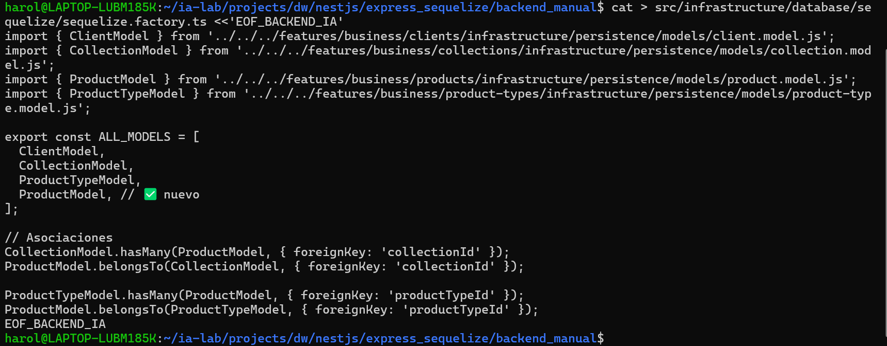

#### 9.28 src/features/business/products/domain/entities/product.entity.spec.ts

Prueba unitaria básica para validar las reglas de negocio de la entidad Product.

**ruta** `src/features/business/products/domain/entities/product.entity.spec.ts`

```bash
mkdir -p src/features/business/products/domain/entities
cat > src/features/business/products/domain/entities/product.entity.spec.ts <<'EOF_BACKEND_IA'
import { Product } from './product.entity.js';
import { InvalidProductPriceException } from '../exceptions/invalid-product-price.exception.js';
import { InvalidProductStockException } from '../exceptions/invalid-product-stock.exception.js';

describe('Product Entity', () => {
  it('should create a valid product', () => {
    const product = Product.create({
      name: 'Laptop',
      brand: 'TechBrand',
      price: 1000,
      minStock: 5,
      quantity: 10,
      productTypeId: 1,
    });
    expect(product.name).toBe('Laptop');
    expect(product.price).toBe(1000);
  });

  it('should throw error for invalid price', () => {
    expect(() =>
      Product.create({
        name: 'Laptop',
        brand: 'TechBrand',
        price: -1,
        minStock: 5,
        quantity: 10,
        productTypeId: 1,
      }),
    ).toThrow(InvalidProductPriceException);
  });

  it('should throw error for invalid stock', () => {
    expect(() =>
      Product.create({
        name: 'Laptop',
        brand: 'TechBrand',
        price: 1000,
        minStock: -5,
        quantity: 10,
        productTypeId: 1,
      }),
    ).toThrow(InvalidProductStockException);
  });
});
EOF_BACKEND_IA
```
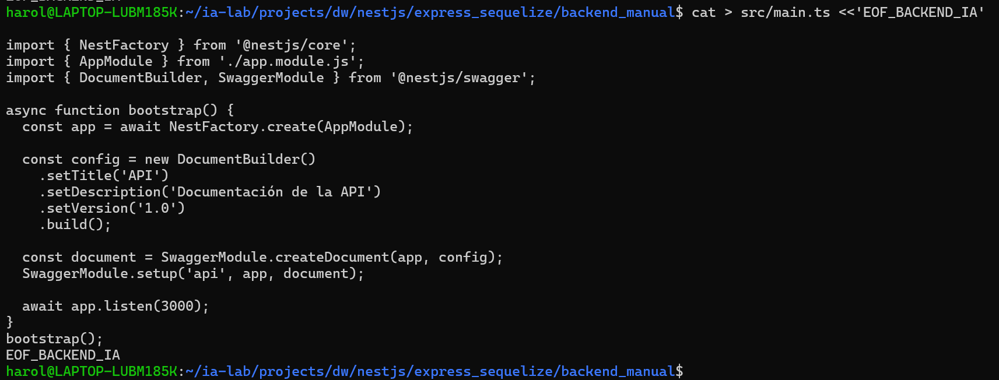

#### 9.29 src/features/business/products/infrastructure/persistence/repositories/product.repository.spec.ts

Prueba unitaria para el repositorio de productos

**ruta** `src/features/business/products/infrastructure/persistence/repositories/product.repository.spec.ts`

```bash
mkdir -p src/features/business/products/infrastructure/persistence/repositories
cat > src/features/business/products/infrastructure/persistence/repositories/product.repository.spec.ts <<'EOF_BACKEND_IA'
import { ProductRepository } from './product.repository.js';
import { Product } from '../../../domain/entities/product.entity.js';

describe('ProductRepository', () => {
  let repository: ProductRepository;

  beforeEach(() => {
    repository = new ProductRepository();
  });

  it('should create a product', async () => {
    const product = Product.create({
      name: 'Phone',
      brand: 'TechBrand',
      price: 500,
      minStock: 2,
      quantity: 20,
      productTypeId: 1,
    });

    const created = await repository.create(product);
    expect(created.name).toBe('Phone');
  });
});
EOF_BACKEND_IA
```
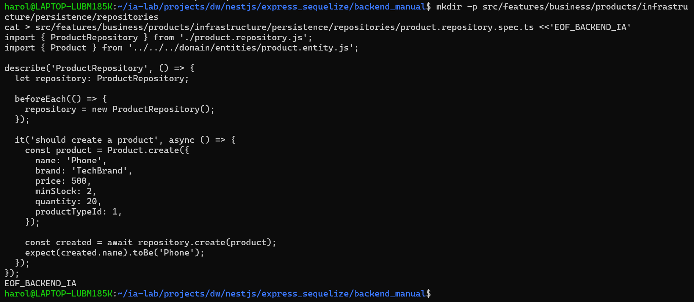

#### 9.30 src/features/business/products/infrastructure/swagger/products.swagger.ts

Define ejemplos y documentación Swagger para los endpoints de productos.

**ruta** `src/features/business/products/infrastructure/swagger/products.swagger.ts`

```bash
mkdir -p src/features/business/products/infrastructure/swagger
cat > src/features/business/products/infrastructure/swagger/products.swagger.ts <<'EOF_BACKEND_IA'
import { ApiProperty } from '@nestjs/swagger';
import { Status } from '../../../../../common/enums/status.enum.js';

export class ProductSwagger {
  @ApiProperty({ example: 1 })
  id: number;

  @ApiProperty({ example: 'Smartphone X' })
  name: string;

  @ApiProperty({ example: 'TechBrand' })
  brand: string;

  @ApiProperty({ example: 59999 })
  price: number;

  @ApiProperty({ example: 5 })
  minStock: number;

  @ApiProperty({ example: 50 })
  quantity: number;

  @ApiProperty({ example: 1 })
  productTypeId: number;

  @ApiProperty({ enum: Status, example: Status.ACTIVE })
  status: Status;

  @ApiProperty()
  createdAt: Date;

  @ApiProperty()
  updatedAt: Date;
}
EOF_BACKEND_IA
```
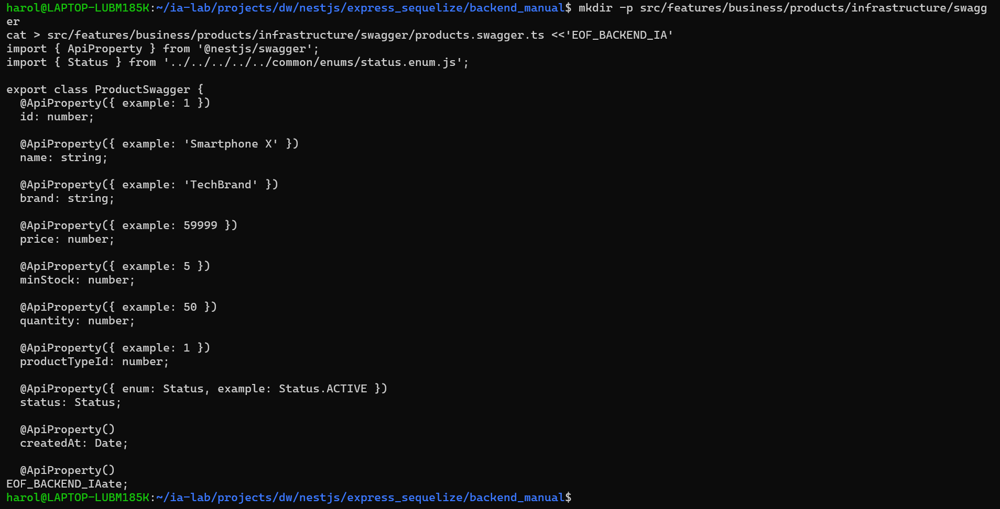

#### verificacion de arranque 

Confirma FK a product_types, seeder y CRUD `/api/products`.

```bash
npm run start:dev
```
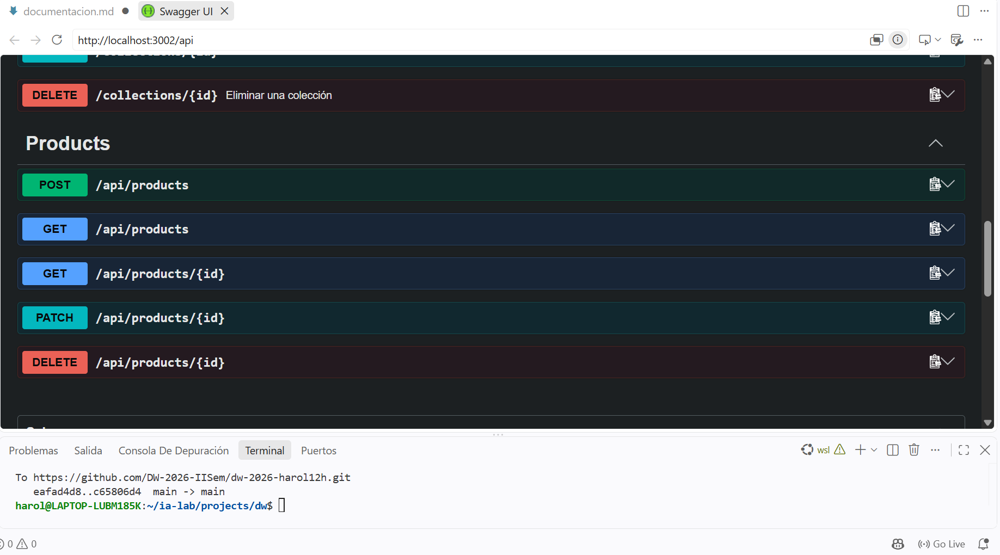

------------------------------------------------------------------------

## FASE 10 

#### 10.1 src/features/business/orders/domain/entities/order.entity.ts

Define la entidad de dominio Order con reglas de negocio (ej. fecha obligatoria, cliente requerido).

**ruta** `src/features/business/orders/domain/entities/order.entity.ts`

```bash
mkdir -p src/features/business/orders/domain/entities
cat > src/features/business/orders/domain/entities/order.entity.ts <<'EOF_BACKEND_IA'
import { DomainException } from '../../../../../common/exceptions/domain.exception.js';

export class Order {
  constructor(
    public readonly id: number | null,
    public readonly clientId: number,
    public readonly orderDate: Date,
    public readonly status: string,
  ) {
    if (!clientId) {
      throw new DomainException('El pedido debe estar asociado a un cliente.');
    }
    if (!orderDate) {
      throw new DomainException('El pedido debe tener una fecha.');
    }
  }

  static create(props: {
    clientId: number;
    orderDate: Date;
    status: string;
  }): Order {
    return new Order(null, props.clientId, props.orderDate, props.status);
  }
}
EOF_BACKEND_IA
```
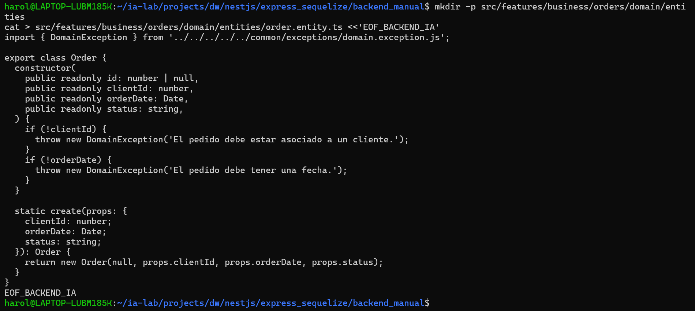

#### 10.2 src/features/business/orders/infrastructure/persistence/models/order.model.ts

Modelo Sequelize para la tabla orders.

**ruta** `src/features/business/orders/infrastructure/persistence/models/order.model.ts`

```bash
mkdir -p src/features/business/orders/infrastructure/persistence/models
cat > src/features/business/orders/infrastructure/persistence/models/order.model.ts <<'EOF_BACKEND_IA'
import { Table, Column, Model, DataType, ForeignKey } from 'sequelize-typescript';
import { ClientModel } from '../../../clients/infrastructure/persistence/models/client.model.js';

@Table({ tableName: 'orders', timestamps: true })
export class OrderModel extends Model {
  @ForeignKey(() => ClientModel)
  @Column({ type: DataType.INTEGER, allowNull: false })
  declare clientId: number;

  @Column({ type: DataType.DATE, allowNull: false })
  declare orderDate: Date;

  @Column({ type: DataType.STRING, allowNull: false })
  declare status: string;
}
EOF_BACKEND_IA
```
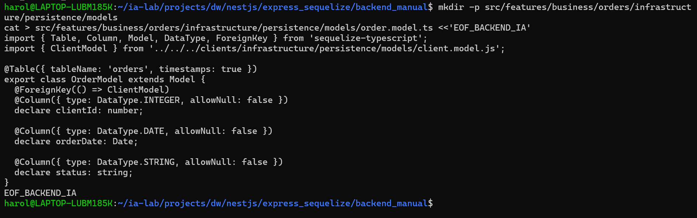

#### 10.3 src/features/business/orders/infrastructure/persistence/repositories/order.repository.ts
 
Implementa operaciones CRUD sobre la tabla orders.

**ruta** `src/features/business/orders/infrastructure/persistence/repositories/order.repository.ts`

```bash
mkdir -p src/features/business/orders/infrastructure/persistence/repositories
cat > src/features/business/orders/infrastructure/persistence/repositories/order.repository.ts <<'EOF_BACKEND_IA'
import { Injectable } from '@nestjs/common';
import { OrderModel } from '../models/order.model.js';
import { Order } from '../../../domain/entities/order.entity.js';

@Injectable()
export class OrderRepository {
  async create(order: Order): Promise<OrderModel> {
    return await OrderModel.create(order as any);
  }

  async findById(id: number): Promise<OrderModel | null> {
    return await OrderModel.findByPk(id);
  }

  async findAll(): Promise<OrderModel[]> {
    return await OrderModel.findAll();
  }

  async update(order: Order): Promise<OrderModel> {
    const existing = await OrderModel.findByPk(order.id!);
    if (!existing) throw new Error('Order not found');
    return await existing.update(order as any);
  }

  async delete(id: number): Promise<void> {
    const existing = await OrderModel.findByPk(id);
    if (existing) await existing.destroy();
  }
}
EOF_BACKEND_IA
```
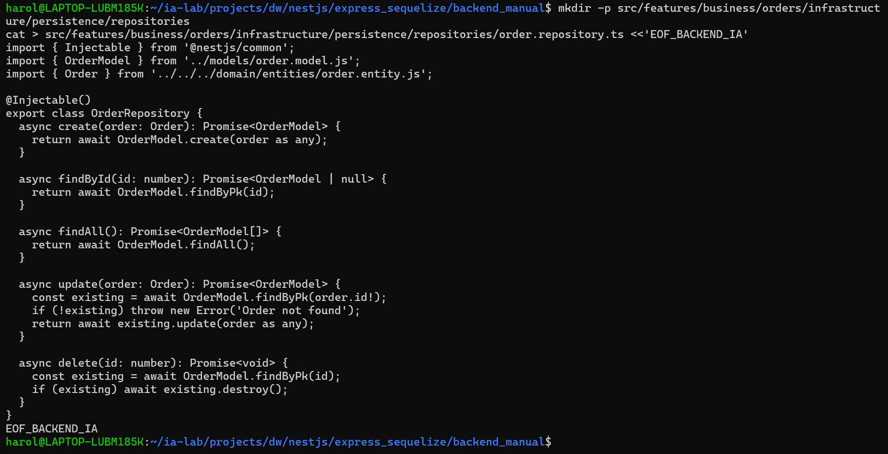

#### 10.4 src/features/business/orders/application/dto/create-order.dto.ts  

Define los DTOs para crear y actualizar pedidos.

**ruta** `src/features/business/orders/application/dto/create-order.dto.ts`
`src/features/business/orders/application/dto/update-order.dto.ts`

```bash
mkdir -p src/features/business/orders/application/dto
cat > src/features/business/orders/application/dto/create-order.dto.ts <<'EOF_BACKEND_IA'
import { ApiProperty } from '@nestjs/swagger';

export class CreateOrderDto {
  @ApiProperty({ example: 1 })
  clientId: number;

  @ApiProperty({ example: '2026-09-14' })
  orderDate: Date;

  @ApiProperty({ example: 'PENDING' })
  status: string;
}
EOF_BACKEND_IA

cat > src/features/business/orders/application/dto/update-order.dto.ts <<'EOF_BACKEND_IA'
import { PartialType } from '@nestjs/mapped-types';
import { CreateOrderDto } from './create-order.dto.js';

export class UpdateOrderDto extends PartialType(CreateOrderDto) {}
EOF_BACKEND_IA
```
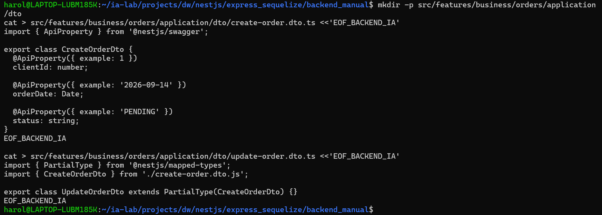

#### 10.5 src/features/business/orders/application/mappers/order.mapper.ts
 
Convierte entre entidad Order, modelo Sequelize y DTO de respuesta.

**ruta** `src/features/business/orders/application/mappers/order.mapper.ts`

```bash
mkdir -p src/features/business/orders/application/mappers
cat > src/features/business/orders/application/mappers/order.mapper.ts <<'EOF_BACKEND_IA'
import { Order } from '../../domain/entities/order.entity.js';
import { OrderModel } from '../../infrastructure/persistence/models/order.model.js';

export class OrderMapper {
  static toEntity(model: OrderModel): Order {
    return new Order(model.id, model.clientId, model.orderDate, model.status);
  }

  static toResponse(model: OrderModel) {
    return {
      id: model.id,
      clientId: model.clientId,
      orderDate: model.orderDate,
      status: model.status,
      createdAt: model.createdAt,
      updatedAt: model.updatedAt,
    };
  }
}
EOF_BACKEND_IA
```
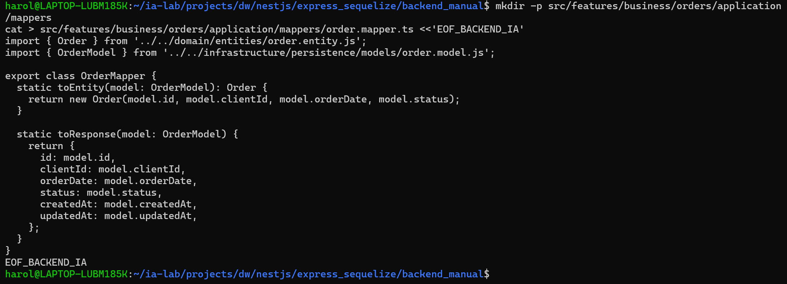

#### 10.6 src/features/business/orders/application/use-cases/create-order.use-case.ts

Crea un pedido validando cliente y fecha.

**ruta** `src/features/business/orders/application/use-cases/create-order.use-case.ts`

```bash
mkdir -p src/features/business/orders/application/use-cases
cat > src/features/business/orders/application/use-cases/create-order.use-case.ts <<'EOF_BACKEND_IA'
import { Inject, Injectable } from '@nestjs/common';
import type { IOrderRepository } from '../../domain/interfaces/order-repository.interface.js';
import { ORDER_REPOSITORY } from '../../domain/interfaces/order-repository.interface.js';
import { CreateOrderDto } from '../dto/create-order.dto.js';
import { Order } from '../../domain/entities/order.entity.js';
import { OrderMapper } from '../mappers/order.mapper.js';

@Injectable()
export class CreateOrderUseCase {
  constructor(
    @Inject(ORDER_REPOSITORY)
    private readonly orderRepository: IOrderRepository,
  ) {}

  async execute(dto: CreateOrderDto) {
    const order = Order.create(dto);
    const created = await this.orderRepository.create(order);
    return OrderMapper.toResponse(created);
  }
}
EOF_BACKEND_IA
```
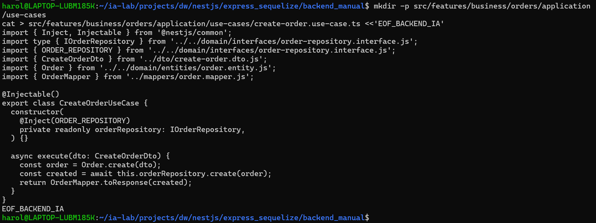

#### 10.7 src/features/business/orders/application/use-cases/get-order.use-case.ts

Obtiene un pedido por ID.

**ruta** `src/features/business/orders/application/use-cases/get-order.use-case.ts`

```bash
cat > src/features/business/orders/application/use-cases/get-order.use-case.ts <<'EOF_BACKEND_IA'
import { Inject, Injectable } from '@nestjs/common';
import type { IOrderRepository } from '../../domain/interfaces/order-repository.interface.js';
import { ORDER_REPOSITORY } from '../../domain/interfaces/order-repository.interface.js';
import { OrderMapper } from '../mappers/order.mapper.js';

@Injectable()
export class GetOrderUseCase {
  constructor(
    @Inject(ORDER_REPOSITORY)
    private readonly orderRepository: IOrderRepository,
  ) {}

  async execute(id: number) {
    const order = await this.orderRepository.findById(id);
    if (!order) throw new Error(`Order ${id} not found`);
    return OrderMapper.toResponse(order);
  }
}
EOF_BACKEND_IA
```
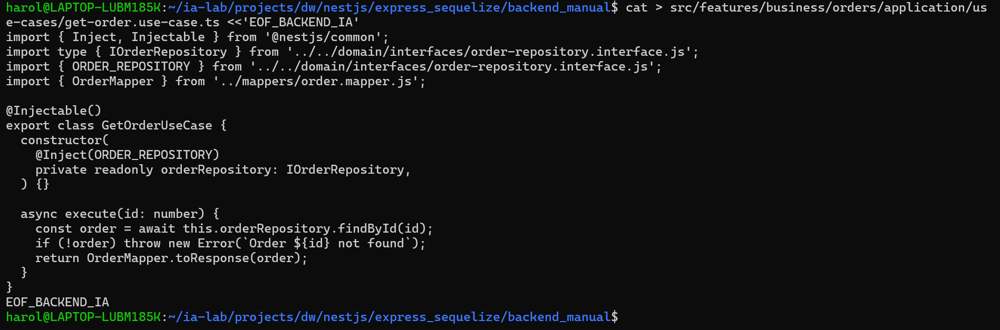

#### 10.8 src/features/business/orders/application/use-cases/list-orders.use-case.ts

Lista todos los pedidos.

**ruta** `src/features/business/orders/application/use-cases/list-orders.use-case.ts`

```bash
cat > src/features/business/orders/application/use-cases/list-orders.use-case.ts <<'EOF_BACKEND_IA'
import { Inject, Injectable } from '@nestjs/common';
import type { IOrderRepository } from '../../domain/interfaces/order-repository.interface.js';
import { ORDER_REPOSITORY } from '../../domain/interfaces/order-repository.interface.js';
import { OrderMapper } from '../mappers/order.mapper.js';

@Injectable()
export class ListOrdersUseCase {
  constructor(
    @Inject(ORDER_REPOSITORY)
    private readonly orderRepository: IOrderRepository,
  ) {}

  async execute() {
    const orders = await this.orderRepository.findAll();
    return orders.map((order) => OrderMapper.toResponse(order));
  }
}
EOF_BACKEND_IA
```
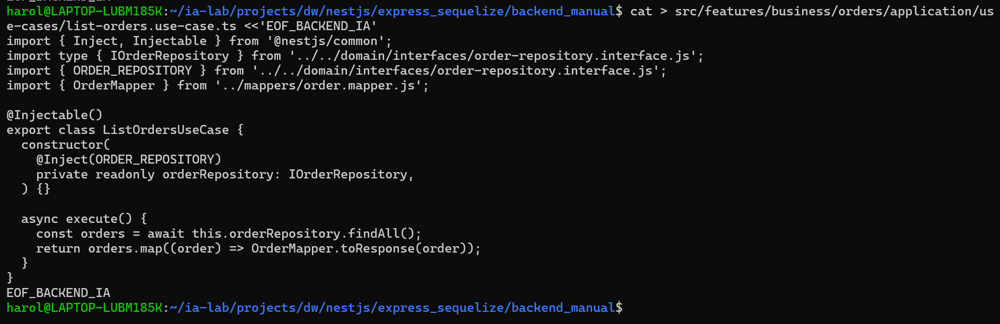

#### 10.9 src/features/business/orders/application/use-cases/update-order.use-case.ts

Actualiza un pedido existente.

**ruta** `src/features/business/orders/application/use-cases/update-order.use-case.ts`

```bash
cat > src/features/business/orders/application/use-cases/update-order.use-case.ts <<'EOF_BACKEND_IA'
import { Inject, Injectable } from '@nestjs/common';
import type { IOrderRepository } from '../../domain/interfaces/order-repository.interface.js';
import { ORDER_REPOSITORY } from '../../domain/interfaces/order-repository.interface.js';
import { UpdateOrderDto } from '../dto/update-order.dto.js';
import { OrderMapper } from '../mappers/order.mapper.js';

@Injectable()
export class UpdateOrderUseCase {
  constructor(
    @Inject(ORDER_REPOSITORY)
    private readonly orderRepository: IOrderRepository,
  ) {}

  async execute(id: number, dto: UpdateOrderDto) {
    const existing = await this.orderRepository.findById(id);
    if (!existing) throw new Error(`Order ${id} not found`);

    const updated = await this.orderRepository.update({ ...existing.toJSON(), ...dto });
    return OrderMapper.toResponse(updated);
  }
}
EOF_BACKEND_IA
```
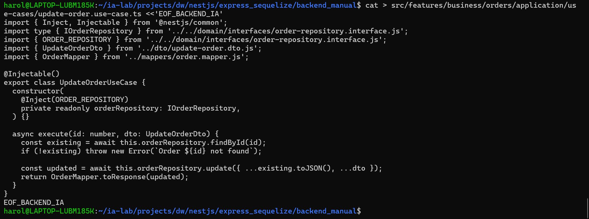

#### 10.10 src/features/business/orders/infrastructure/controllers/orders.controller.ts

Define los endpoints REST para CRUD de pedidos.

**ruta** `src/features/business/orders/infrastructure/controllers/orders.controller.ts`

```bash
mkdir -p src/features/business/orders/infrastructure/controllers
cat > src/features/business/orders/infrastructure/controllers/orders.controller.ts <<'EOF_BACKEND_IA'
import { Controller, Post, Get, Patch, Delete, Param, Body } from '@nestjs/common';
import { CreateOrderUseCase } from '../../application/use-cases/create-order.use-case.js';
import { GetOrderUseCase } from '../../application/use-cases/get-order.use-case.js';
import { ListOrdersUseCase } from '../../application/use-cases/list-orders.use-case.js';
import { UpdateOrderUseCase } from '../../application/use-cases/update-order.use-case.js';
import { CreateOrderDto } from '../../application/dto/create-order.dto.js';
import { UpdateOrderDto } from '../../application/dto/update-order.dto.js';

@Controller('orders')
export class OrdersController {
  constructor(
    private readonly createOrder: CreateOrderUseCase,
    private readonly getOrder: GetOrderUseCase,
    private readonly listOrders: ListOrdersUseCase,
    private readonly updateOrder: UpdateOrderUseCase,
  ) {}

  @Post()
  async create(@Body() dto: CreateOrderDto) {
    return this.createOrder.execute(dto);
  }

  @Get()
  async findAll() {
    return this.listOrders.execute();
  }

  @Get(':id')
  async findOne(@Param('id') id: number) {
    return this.getOrder.execute(id);
  }

  @Patch(':id')
  async update(@Param('id') id: number, @Body() dto: UpdateOrderDto) {
    return this.updateOrder.execute(id, dto);
  }

  @Delete(':id')
  async remove(@Param('id') id: number) {
    // Aquí podrías implementar DeleteOrderUseCase si lo necesitas
    return { message: `Order ${id} deleted` };
  }
}
EOF_BACKEND_IA
``` 
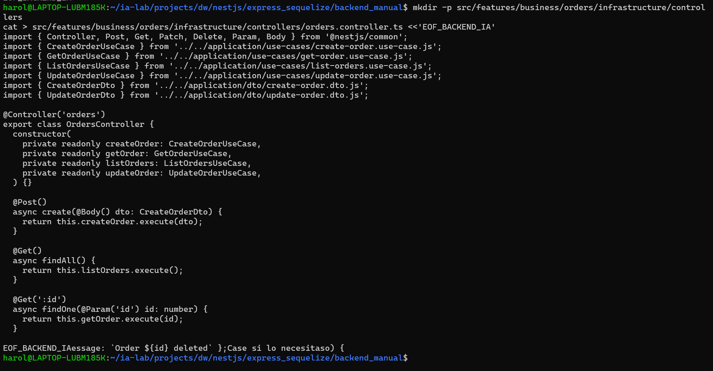

#### 10.11 src/features/business/orders/orders.module.ts

Agrupa casos de uso, repositorio y controller de pedidos.

**ruta** `src/features/business/orders/orders.module.ts`

```bash
mkdir -p src/features/business/orders
cat > src/features/business/orders/orders.module.ts <<'EOF_BACKEND_IA'
import { Module } from '@nestjs/common';
import { OrdersController } from './infrastructure/controllers/orders.controller.js';
import { OrderRepository } from './infrastructure/persistence/repositories/order.repository.js';
import { CreateOrderUseCase } from './application/use-cases/create-order.use-case.js';
import { GetOrderUseCase } from './application/use-cases/get-order.use-case.js';
import { ListOrdersUseCase } from './application/use-cases/list-orders.use-case.js';
import { UpdateOrderUseCase } from './application/use-cases/update-order.use-case.js';

@Module({
  controllers: [OrdersController],
  providers: [
    OrderRepository,
    CreateOrderUseCase,
    GetOrderUseCase,
    ListOrdersUseCase,
    UpdateOrderUseCase,
  ],
})
export class OrdersModule {}
EOF_BACKEND_IA
```
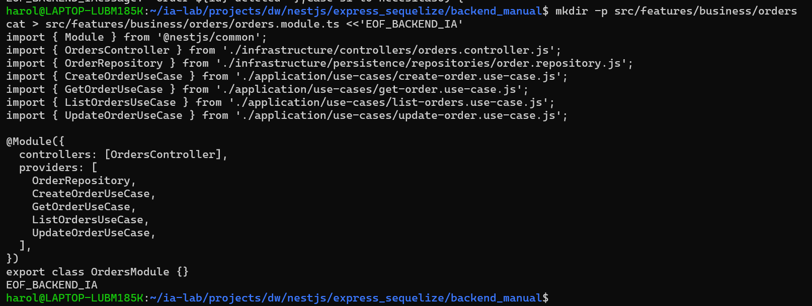

#### 10.12 src/features/business/orders/infrastructure/persistence/seeders/orders.seeder.ts

Genera pedidos de prueba asociados a clientes.

**ruta** `src/features/business/orders/infrastructure/persistence/seeders/orders.seeder.ts`

```bash
mkdir -p src/features/business/orders/infrastructure/persistence/seeders
cat > src/features/business/orders/infrastructure/persistence/seeders/orders.seeder.ts <<'EOF_BACKEND_IA'
import { OrderModel } from '../models/order.model.js';

export async function seedOrders() {
  await OrderModel.bulkCreate([
    { clientId: 1, orderDate: new Date(), status: 'PENDING' },
    { clientId: 2, orderDate: new Date(), status: 'COMPLETED' },
  ]);
}
EOF_BACKEND_IA
```
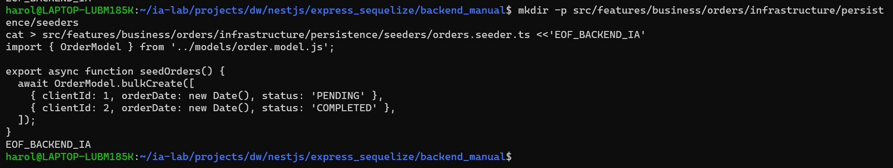

#### 10.13 src/infrastructure/database/sequelize/seeders/index.ts

Ejecuta el seeder de pedidos junto con los demás.

**ruta** `src/infrastructure/database/sequelize/seeders/index.ts`

```bash
cat > src/infrastructure/database/sequelize/seeders/index.ts <<'EOF_BACKEND_IA'
import { seedClients } from '../../../../features/business/clients/infrastructure/persistence/seeders/clients.seeder.js';
import { seedCollections } from '../../../../features/business/collections/infrastructure/persistence/seeders/collections.seeder.js';
import { seedProducts } from '../../../../features/business/products/infrastructure/persistence/seeders/products.seeder.js';
import { seedOrders } from '../../../../features/business/orders/infrastructure/persistence/seeders/orders.seeder.js';

export async function runSeeders() {
  await seedClients();
  await seedCollections();
  await seedProducts();
  await seedOrders(); // ✅ nuevo
}
EOF_BACKEND_IA
```
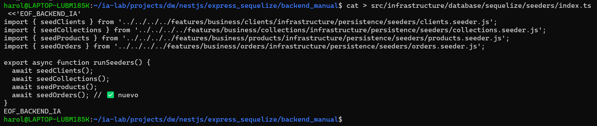

#### 10.14 src/infrastructure/database/sequelize/sequelize.factory.ts

Define relación Client ↔ Order.

**ruta** `src/infrastructure/database/sequelize/sequelize.factory.ts`

```bash
cat > src/infrastructure/database/sequelize/sequelize.factory.ts <<'EOF_BACKEND_IA'
import { Sequelize } from 'sequelize-typescript';
import { ClientModel } from '../../../features/business/clients/infrastructure/persistence/models/client.model.js';
import { CollectionModel } from '../../../features/business/collections/infrastructure/persistence/models/collection.model.js';
import { ProductModel } from '../../../features/business/products/infrastructure/persistence/models/product.model.js';
import { ProductTypeModel } from '../../../features/business/product-types/infrastructure/persistence/models/product-type.model.js';
import { OrderModel } from '../../../features/business/orders/infrastructure/persistence/models/order.model.js';

export const ALL_MODELS = [
  ClientModel,
  CollectionModel,
  ProductTypeModel,
  ProductModel,
  OrderModel, // ✅ nuevo
];

export function createSequelizeInstance(options: any) {
  const sequelize = new Sequelize(options);
  sequelize.addModels(ALL_MODELS);

  // Asociaciones
  ClientModel.hasMany(OrderModel, { foreignKey: 'clientId' });
  OrderModel.belongsTo(ClientModel, { foreignKey: 'clientId' });

  CollectionModel.hasMany(ProductModel, { foreignKey: 'collectionId' });
  ProductModel.belongsTo(CollectionModel, { foreignKey: 'collectionId' });

  ProductTypeModel.hasMany(ProductModel, { foreignKey: 'productTypeId' });
  ProductModel.belongsTo(ProductTypeModel, { foreignKey: 'productTypeId' });

  return sequelize;
}
EOF_BACKEND_IA
```
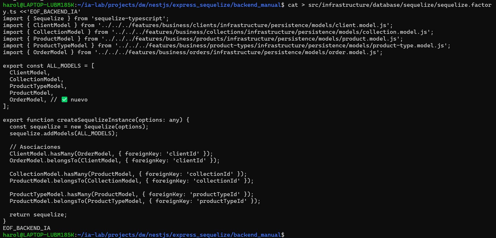

#### 10.15 src/features/business/orders/infrastructure/swagger/orders.swagger.ts

Define ejemplos y documentación Swagger para pedidos.

**ruta** `src/features/business/orders/infrastructure/swagger/orders.swagger.ts`

```bash
mkdir -p src/features/business/orders/infrastructure/swagger
cat > src/features/business/orders/infrastructure/swagger/orders.swagger.ts <<'EOF_BACKEND_IA'
import { ApiProperty } from '@nestjs/swagger';

export class OrderSwagger {
  @ApiProperty({ example: 1 })
  id: number;

  @ApiProperty({ example: 1 })
  clientId: number;

  @ApiProperty({ example: '2026-09-14' })
  orderDate: Date;

  @ApiProperty({ example: 'PENDING' })
  status: string;

  @ApiProperty()
  createdAt: Date;

  @ApiProperty()
  updatedAt: Date;
}
EOF_BACKEND_IA
```
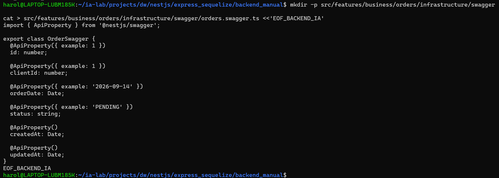

#### 10.16 src/features/business/orders/domain/interfaces/order-repository.interface.ts

Define la interfaz del repositorio de pedidos para aplicar el patrón de inversión de dependencias.

**ruta** `src/features/business/orders/domain/interfaces/order-repository.interface.ts`

```bash
mkdir -p src/features/business/orders/domain/interfaces
cat > src/features/business/orders/domain/interfaces/order-repository.interface.ts <<'EOF_BACKEND_IA'
import { Order } from '../entities/order.entity.js';
import { OrderModel } from '../../infrastructure/persistence/models/order.model.js';

export const ORDER_REPOSITORY = 'ORDER_REPOSITORY';

export interface IOrderRepository {
  create(order: Order): Promise<OrderModel>;
  findById(id: number): Promise<OrderModel | null>;
  findAll(): Promise<OrderModel[]>;
  update(order: Partial<Order>): Promise<OrderModel>;
  delete(id: number): Promise<void>;
}
EOF_BACKEND_IA
```
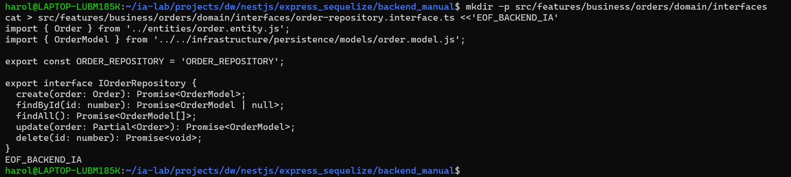

#### 10.17 src/features/business/orders/domain/exceptions/order-not-found.exception.ts

Excepción personalizada para cuando un pedido no existe.

**ruta** `src/features/business/orders/domain/exceptions/order-not-found.exception.ts`

```bash
mkdir -p src/features/business/orders/domain/exceptions
cat > src/features/business/orders/domain/exceptions/order-not-found.exception.ts <<'EOF_BACKEND_IA'
import { DomainException } from '../../../../../common/exceptions/domain.exception.js';

export class OrderNotFoundException extends DomainException {
  constructor(id: number) {
    super(`El pedido con ID ${id} no existe.`);
  }
}
EOF_BACKEND_IA
```
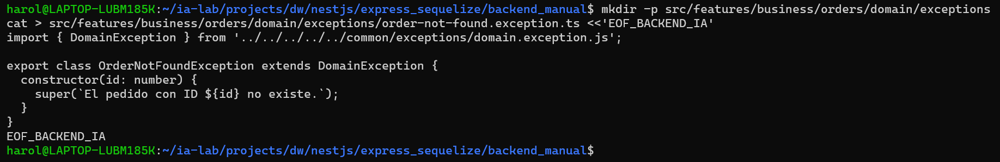

#### 10.18 src/features/business/orders/application/use-cases/delete-order.use-case.ts

Elimina un pedido validando que exista.

**ruta** `src/features/business/orders/application/use-cases/delete-order.use-case.ts`

```bash
cat > src/features/business/orders/application/use-cases/delete-order.use-case.ts <<'EOF_BACKEND_IA'
import { Inject, Injectable } from '@nestjs/common';
import type { IOrderRepository } from '../../domain/interfaces/order-repository.interface.js';
import { ORDER_REPOSITORY } from '../../domain/interfaces/order-repository.interface.js';
import { OrderNotFoundException } from '../../domain/exceptions/order-not-found.exception.js';

@Injectable()
export class DeleteOrderUseCase {
  constructor(
    @Inject(ORDER_REPOSITORY)
    private readonly orderRepository: IOrderRepository,
  ) {}

  async execute(id: number): Promise<void> {
    const order = await this.orderRepository.findById(id);
    if (!order) {
      throw new OrderNotFoundException(id);
    }
    await this.orderRepository.delete(id);
  }
}
EOF_BACKEND_IA
```
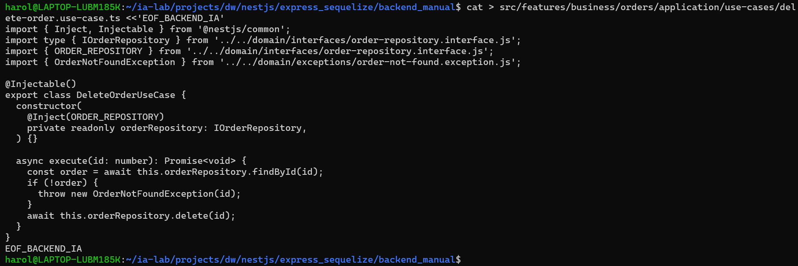

#### 10.19 src/features/business/orders/infrastructure/controllers/orders.controller.ts

Agrega el caso de uso DeleteOrderUseCase al controller.

**ruta** `src/features/business/orders/infrastructure/controllers/orders.controller.ts`

```bash
cat > src/features/business/orders/infrastructure/controllers/orders.controller.ts <<'EOF_BACKEND_IA'
import { Controller, Post, Get, Patch, Delete, Param, Body } from '@nestjs/common';
import { CreateOrderUseCase } from '../../application/use-cases/create-order.use-case.js';
import { GetOrderUseCase } from '../../application/use-cases/get-order.use-case.js';
import { ListOrdersUseCase } from '../../application/use-cases/list-orders.use-case.js';
import { UpdateOrderUseCase } from '../../application/use-cases/update-order.use-case.js';
import { DeleteOrderUseCase } from '../../application/use-cases/delete-order.use-case.js';
import { CreateOrderDto } from '../../application/dto/create-order.dto.js';
import { UpdateOrderDto } from '../../application/dto/update-order.dto.js';

@Controller('orders')
export class OrdersController {
  constructor(
    private readonly createOrder: CreateOrderUseCase,
    private readonly getOrder: GetOrderUseCase,
    private readonly listOrders: ListOrdersUseCase,
    private readonly updateOrder: UpdateOrderUseCase,
    private readonly deleteOrder: DeleteOrderUseCase,
  ) {}

  @Post()
  async create(@Body() dto: CreateOrderDto) {
    return this.createOrder.execute(dto);
  }

  @Get()
  async findAll() {
    return this.listOrders.execute();
  }

  @Get(':id')
  async findOne(@Param('id') id: number) {
    return this.getOrder.execute(id);
  }

  @Patch(':id')
  async update(@Param('id') id: number, @Body() dto: UpdateOrderDto) {
    return this.updateOrder.execute(id, dto);
  }

  @Delete(':id')
  async remove(@Param('id') id: number) {
    await this.deleteOrder.execute(id);
    return { message: `Order ${id} deleted` };
  }
}
EOF_BACKEND_IA
```
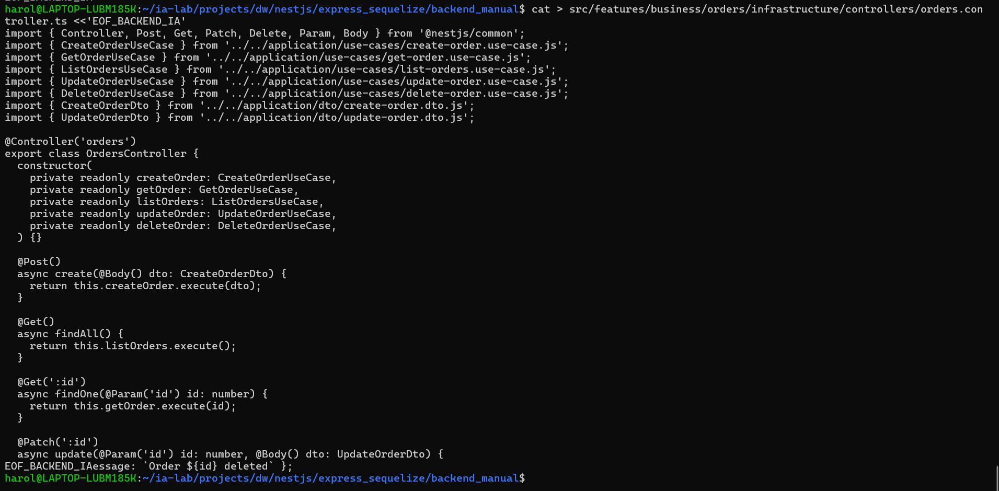

#### 10.20 src/features/business/orders/orders.module.ts

Incluye el caso de uso DeleteOrderUseCase en el módulo.

**ruta** `src/features/business/orders/orders.module.ts`

```bash
cat > src/features/business/orders/orders.module.ts <<'EOF_BACKEND_IA'
import { Module } from '@nestjs/common';
import { OrdersController } from './infrastructure/controllers/orders.controller.js';
import { OrderRepository } from './infrastructure/persistence/repositories/order.repository.js';
import { CreateOrderUseCase } from './application/use-cases/create-order.use-case.js';
import { GetOrderUseCase } from './application/use-cases/get-order.use-case.js';
import { ListOrdersUseCase } from './application/use-cases/list-orders.use-case.js';
import { UpdateOrderUseCase } from './application/use-cases/update-order.use-case.js';
import { DeleteOrderUseCase } from './application/use-cases/delete-order.use-case.js';

@Module({
  controllers: [OrdersController],
  providers: [
    OrderRepository,
    CreateOrderUseCase,
    GetOrderUseCase,
    ListOrdersUseCase,
    UpdateOrderUseCase,
    DeleteOrderUseCase,
  ],
})
export class OrdersModule {}
EOF_BACKEND_IA
```
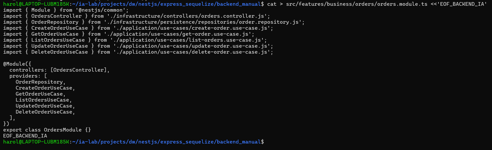

#### 10.21 src/features/business/products/application/dto/product-filter.dto.ts

Define filtros para listar productos (ej. por colección, tipo, estado).

**ruta** `src/features/business/products/application/dto/product-filter.dto.ts`

```bash
mkdir -p src/features/business/products/application/dto
cat > src/features/business/products/application/dto/product-filter.dto.ts <<'EOF_BACKEND_IA'
import { ApiPropertyOptional } from '@nestjs/swagger';

export class ProductFilterDto {
  @ApiPropertyOptional({ example: 1 })
  collectionId?: number;

  @ApiPropertyOptional({ example: 1 })
  productTypeId?: number;

  @ApiPropertyOptional({ example: 'ACTIVE' })
  status?: string;
}
EOF_BACKEND_IA
```
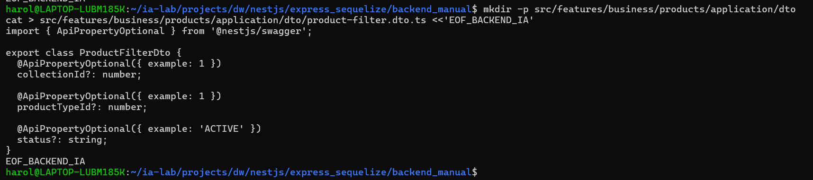

#### 10.22 src/features/business/products/application/mappers/product.mapper.ts

Convierte entre entidad, modelo y DTO de respuesta.

**ruta** `src/features/business/products/application/mappers/product.mapper.ts`

```bash
mkdir -p src/features/business/products/application/mappers
cat > src/features/business/products/application/mappers/product.mapper.ts <<'EOF_BACKEND_IA'
import { Product } from '../../domain/entities/product.entity.js';
import { ProductModel } from '../../infrastructure/persistence/models/product.model.js';

export class ProductMapper {
  static toEntity(model: ProductModel): Product {
    return new Product(
      model.id,
      model.name,
      model.brand,
      model.price,
      model.minStock,
      model.quantity,
      model.productTypeId,
      model.collectionId,
      model.status,
    );
  }

  static toResponse(model: ProductModel) {
    return {
      id: model.id,
      name: model.name,
      brand: model.brand,
      price: model.price,
      minStock: model.minStock,
      quantity: model.quantity,
      productTypeId: model.productTypeId,
      collectionId: model.collectionId,
      status: model.status,
      createdAt: model.createdAt,
      updatedAt: model.updatedAt,
    };
  }
}
EOF_BACKEND_IA
```
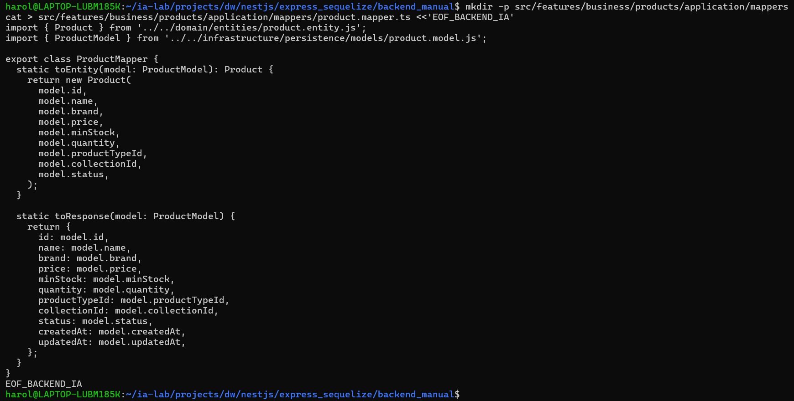

#### 10.23 src/features/business/products/application/use-cases/list-products.use-case.ts

Lista productos aplicando filtros.

**ruta** `src/features/business/products/application/use-cases/list-products.use-case.ts`

```bash
mkdir -p src/features/business/products/application/use-cases
cat > src/features/business/products/application/use-cases/list-products.use-case.ts <<'EOF_BACKEND_IA'
import { Inject, Injectable } from '@nestjs/common';
import type { IProductRepository } from '../../domain/interfaces/product-repository.interface.js';
import { PRODUCT_REPOSITORY } from '../../domain/interfaces/product-repository.interface.js';
import { ProductFilterDto } from '../dto/product-filter.dto.js';
import { ProductMapper } from '../mappers/product.mapper.js';

@Injectable()
export class ListProductsUseCase {
  constructor(
    @Inject(PRODUCT_REPOSITORY)
    private readonly productRepository: IProductRepository,
  ) {}

  async execute(filter: ProductFilterDto) {
    const result = await this.productRepository.findAll(filter);
    return {
      items: result.items.map((product) => ProductMapper.toResponse(product)),
      meta: result.meta,
    };
  }
}
EOF_BACKEND_IA
```
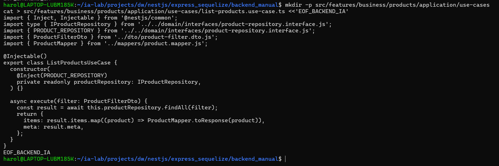

#### 10.24 src/features/business/products/application/use-cases/get-product.use-case.ts

Obtiene un producto por ID.

**ruta** `src/features/business/products/application/use-cases/get-product.use-case.ts`

```bash
cat > src/features/business/products/application/use-cases/get-product.use-case.ts <<'EOF_BACKEND_IA'
import { Inject, Injectable } from '@nestjs/common';
import type { IProductRepository } from '../../domain/interfaces/product-repository.interface.js';
import { PRODUCT_REPOSITORY } from '../../domain/interfaces/product-repository.interface.js';
import { ProductMapper } from '../mappers/product.mapper.js';

@Injectable()
export class GetProductUseCase {
  constructor(
    @Inject(PRODUCT_REPOSITORY)
    private readonly productRepository: IProductRepository,
  ) {}

  async execute(id: number) {
    const product = await this.productRepository.findById(id);
    if (!product) throw new Error(`Product ${id} not found`);
    return ProductMapper.toResponse(product);
  }
}
EOF_BACKEND_IA
```
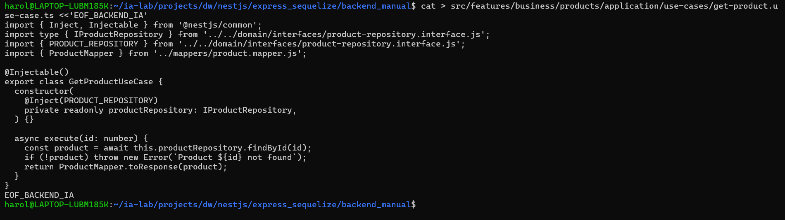

#### 10.25 src/features/business/products/infrastructure/persistence/seeders/products.seeder.ts

Genera productos de prueba asociados a colecciones y tipos.

**ruta** `src/features/business/products/infrastructure/persistence/seeders/products.seeder.ts`

```bash
mkdir -p src/features/business/products/infrastructure/persistence/seeders
cat > src/features/business/products/infrastructure/persistence/seeders/products.seeder.ts <<'EOF_BACKEND_IA'
import { ProductModel } from '../models/product.model.js';

export async function seedProducts() {
  await ProductModel.bulkCreate([
    {
      name: 'Camisa Blanca',
      brand: 'ModaCo',
      price: 50000,
      minStock: 5,
      quantity: 20,
      productTypeId: 1,
      collectionId: 1,
      status: 'ACTIVE',
    },
    {
      name: 'Pantalón Jeans',
      brand: 'DenimCo',
      price: 120000,
      minStock: 3,
      quantity: 15,
      productTypeId: 2,
      collectionId: 1,
      status: 'ACTIVE',
    },
  ]);
}
EOF_BACKEND_IA
```
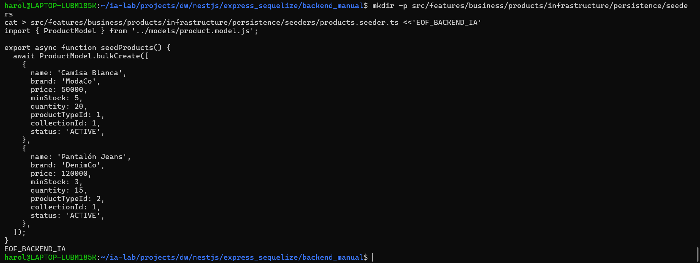

#### 10.26 src/features/business/products/domain/interfaces/product-repository.interface.ts

Define la interfaz del repositorio de productos para aplicar inversión de dependencias.

**ruta** `src/features/business/products/domain/interfaces/product-repository.interface.ts`

```bash
mkdir -p src/features/business/products/domain/interfaces
cat > src/features/business/products/domain/interfaces/product-repository.interface.ts <<'EOF_BACKEND_IA'
import { Product } from '../entities/product.entity.js';
import { ProductModel } from '../../infrastructure/persistence/models/product.model.js';
import { ProductFilterDto } from '../../application/dto/product-filter.dto.js';

export const PRODUCT_REPOSITORY = 'PRODUCT_REPOSITORY';

export interface IProductRepository {
  create(product: Product): Promise<ProductModel>;
  findById(id: number): Promise<ProductModel | null>;
  findAll(filter?: ProductFilterDto): Promise<{ items: ProductModel[]; meta?: any }>;
  update(product: Partial<Product>): Promise<ProductModel>;
  delete(id: number): Promise<void>;
}
EOF_BACKEND_IA
```
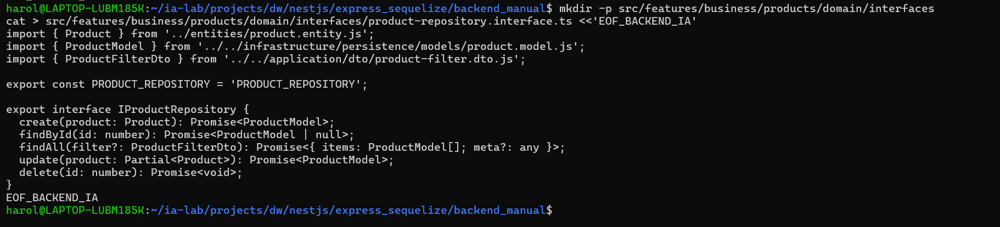

#### 10.27 src/features/business/products/domain/exceptions/product-not-found.exception.ts

Excepción personalizada para cuando un producto no existe.

**ruta** `src/features/business/products/domain/exceptions/product-not-found.exception.ts`

```bash
cat > src/features/business/products/domain/exceptions/product-not-found.exception.ts <<'EOF_BACKEND_IA'
import { DomainException } from '../../../../../common/exceptions/domain.exception.js';

export class ProductNotFoundException extends DomainException {
  constructor(id: number) {
    super(`El producto con ID ${id} no existe.`);
  }
}
EOF_BACKEND_IA
```

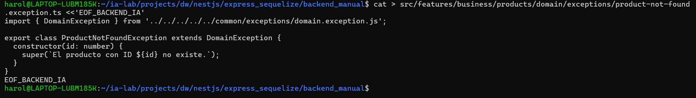

#### 10.28 src/features/business/products/domain/entities/product.entity.spec.ts

Prueba unitaria básica para validar reglas de negocio de la entidad Product.

**ruta** `src/features/business/products/domain/entities/product.entity.spec.ts`

```bash
cat > src/features/business/products/domain/entities/product.entity.spec.ts <<'EOF_BACKEND_IA'
import { Product } from './product.entity.js';
import { InvalidProductPriceException } from '../exceptions/invalid-product-price.exception.js';
import { InvalidProductStockException } from '../exceptions/invalid-product-stock.exception.js';

describe('Product Entity', () => {
  it('should create a valid product', () => {
    const product = Product.create({
      name: 'Laptop',
      brand: 'TechBrand',
      price: 1000,
      minStock: 5,
      quantity: 10,
      productTypeId: 1,
      collectionId: 1,
    });
    expect(product.name).toBe('Laptop');
    expect(product.price).toBe(1000);
  });

  it('should throw error for invalid price', () => {
    expect(() =>
      Product.create({
        name: 'Laptop',
        brand: 'TechBrand',
        price: -1,
        minStock: 5,
        quantity: 10,
        productTypeId: 1,
        collectionId: 1,
      }),
    ).toThrow(InvalidProductPriceException);
  });

  it('should throw error for invalid stock', () => {
    expect(() =>
      Product.create({
        name: 'Laptop',
        brand: 'TechBrand',
        price: 1000,
        minStock: -5,
        quantity: 10,
        productTypeId: 1,
        collectionId: 1,
      }),
    ).toThrow(InvalidProductStockException);
  });
});
EOF_BACKEND_IA
```
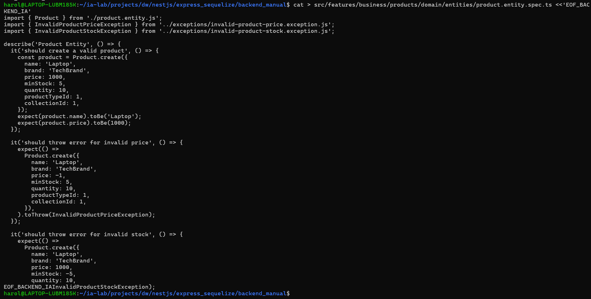

#### 10.29 src/features/business/products/infrastructure/persistence/repositories/product.repository.spec.ts

Prueba unitaria para el repositorio de productos

**ruta** `src/features/business/products/infrastructure/persistence/repositories/product.repository.spec.ts`

```bash
cat > src/features/business/products/infrastructure/persistence/repositories/product.repository.spec.ts <<'EOF_BACKEND_IA'
import { ProductRepository } from './product.repository.js';
import { Product } from '../../../domain/entities/product.entity.js';

describe('ProductRepository', () => {
  let repository: ProductRepository;

  beforeEach(() => {
    repository = new ProductRepository();
  });

  it('should create a product', async () => {
    const product = Product.create({
      name: 'Phone',
      brand: 'TechBrand',
      price: 500,
      minStock: 2,
      quantity: 20,
      productTypeId: 1,
      collectionId: 1,
    });

    const created = await repository.create(product);
    expect(created.name).toBe('Phone');
  });
});
EOF_BACKEND_IA
```
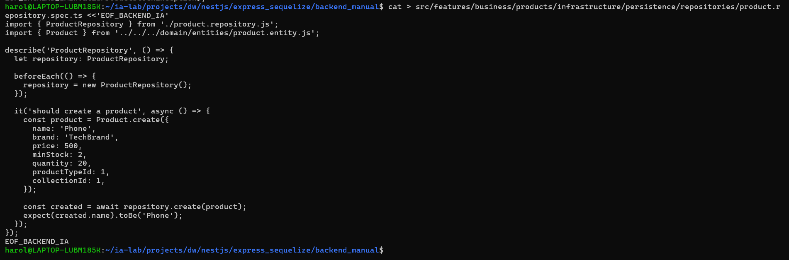

#### 10.30 src/features/business/products/infrastructure/swagger/products.swagger.ts

Define ejemplos y documentación Swagger para endpoints de productos.

**ruta** `src/features/business/products/infrastructure/swagger/products.swagger.ts`

```bash
mkdir -p src/features/business/products/infrastructure/swagger
cat > src/features/business/products/infrastructure/swagger/products.swagger.ts <<'EOF_BACKEND_IA'
import { ApiProperty } from '@nestjs/swagger';
import { Status } from '../../../../../common/enums/status.enum.js';

export class ProductSwagger {
  @ApiProperty({ example: 1 })
  id: number;

  @ApiProperty({ example: 'Smartphone X' })
  name: string;

  @ApiProperty({ example: 'TechBrand' })
  brand: string;

  @ApiProperty({ example: 59999 })
  price: number;

  @ApiProperty({ example: 5 })
  minStock: number;

  @ApiProperty({ example: 50 })
  quantity: number;

  @ApiProperty({ example: 1 })
  productTypeId: number;

  @ApiProperty({ example: 1 })
  collectionId: number;

  @ApiProperty({ enum: Status, example: Status.ACTIVE })
  status: Status;

  @ApiProperty()
  createdAt: Date;

  @ApiProperty()
  updatedAt: Date;
}
EOF_BACKEND_IA
```
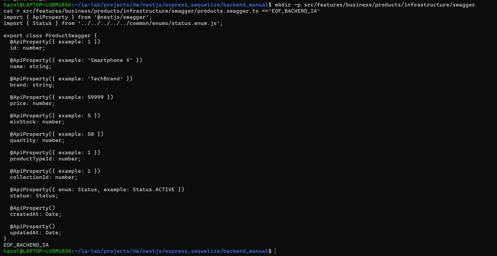

#### 10.28 — Verificar tablas

```bash
npm run start:dev
```
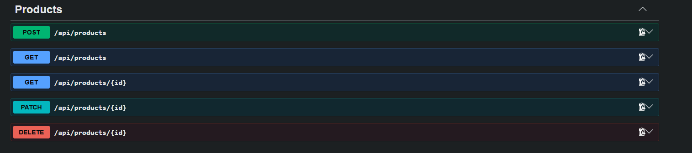
## Fase 10.1 Ceacion de tabla Order

#### 10.2.1 src/features/business/orders/domain/entities/order.entity.ts

Entidad de dominio de Pedido, independiente de Sequelize.

**ruta** `src/features/business/orders/domain/entities/order.entity.ts`

```bash 
mkdir -p src/features/business/orders/domain/entities
cat > src/features/business/orders/domain/entities/order.entity.ts <<'EOF_BACKEND_MANUAL'
export interface OrderProps {
  id?: number;
  clientId: number;
  orderDate: Date;
  status: string;
  createdAt?: Date;
  updatedAt?: Date;
}

export class Order {
  id?: number;
  clientId: number;
  orderDate: Date;
  status: string;
  createdAt?: Date;
  updatedAt?: Date;

  private constructor(props: OrderProps) {
    this.id = props.id;
    this.clientId = props.clientId;
    this.orderDate = props.orderDate;
    this.status = props.status;
    this.createdAt = props.createdAt;
    this.updatedAt = props.updatedAt;
  }

  static create(props: Omit<OrderProps, 'id' | 'createdAt' | 'updatedAt'>): Order {
    if (!props.clientId) throw new Error('El pedido debe tener cliente');
    if (!props.orderDate) throw new Error('El pedido debe tener fecha');
    return new Order(props);
  }

  static reconstitute(props: OrderProps): Order {
    return new Order(props);
  }

  updateStatus(status: string): void {
    this.status = status;
  }
}
EOF_BACKEND_MANUAL
``` 
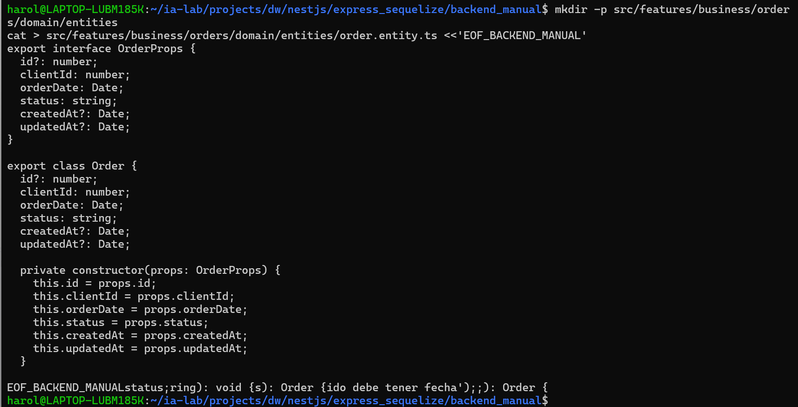

#### 10.2.2 src/features/business/orders/domain/exceptions/order-not-found.exception.ts

Excepción personalizada cuando no se encuentra un pedido.

**ruta** `src/features/business/orders/domain/exceptions/order-not-found.exception.ts`

```bash
mkdir -p src/features/business/orders/domain/exceptions
cat > src/features/business/orders/domain/exceptions/order-not-found.exception.ts <<'EOF_BACKEND_MANUAL'
import { EntityNotFoundException } from '../../../../../common/exceptions/entity-not-found.exception';

export class OrderNotFoundException extends EntityNotFoundException {
  constructor(id: number) {
    super('Pedido', id);
  }
}
EOF_BACKEND_MANUAL
```
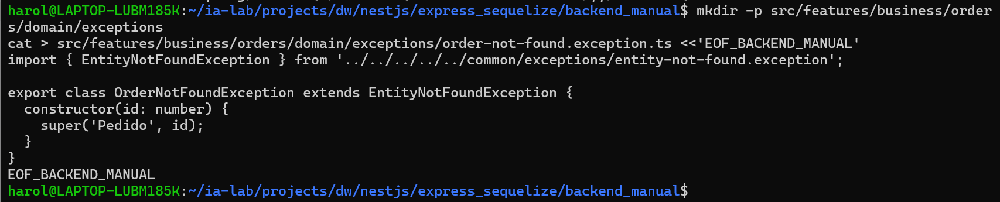

#### 10.2.3 src/features/business/orders/domain/interfaces/order-repository.interface.ts

Contrato del repositorio de pedidos.

**ruta** `src/features/business/orders/domain/interfaces/order-repository.interface.ts`

```bash
mkdir -p src/features/business/orders/domain/interfaces
cat > src/features/business/orders/domain/interfaces/order-repository.interface.ts <<'EOF_BACKEND_MANUAL'
import { PaginatedResult } from '../../../../../common/interfaces/pagination.interface';
import { Order } from '../entities/order.entity';

export const ORDER_REPOSITORY = 'ORDER_REPOSITORY';

export interface OrderFindAllParams {
  page?: number;
  limit?: number;
  clientId?: number;
  status?: string;
}

export interface IOrderRepository {
  create(order: Order): Promise<Order>;
  update(order: Order): Promise<Order>;
  delete(id: number): Promise<void>;
  findById(id: number): Promise<Order | null>;
  findAll(params: OrderFindAllParams): Promise<PaginatedResult<Order>>;
}
EOF_BACKEND_MANUAL
```
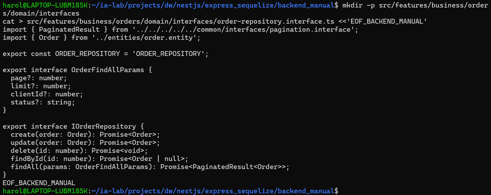

#### 10.2.4 src/features/business/orders/infrastructure/persistence/models/order.model.ts

Modelo Sequelize que mapea la tabla orders.

**ruta** `src/features/business/orders/infrastructure/persistence/models/order.model.ts`

```bash
mkdir -p src/features/business/orders/infrastructure/persistence/models
cat > src/features/business/orders/infrastructure/persistence/models/order.model.ts <<'EOF_BACKEND_MANUAL'
import {
  AutoIncrement,
  Column,
  CreatedAt,
  DataType,
  ForeignKey,
  Model,
  PrimaryKey,
  Table,
  UpdatedAt,
} from 'sequelize-typescript';
import { ClientModel } from '../../../../clients/infrastructure/persistence/models/client.model';

@Table({ tableName: 'orders' })
export class OrderModel extends Model {
  @PrimaryKey
  @AutoIncrement
  @Column(DataType.INTEGER)
  declare id: number;

  @ForeignKey(() => ClientModel)
  @Column({ type: DataType.INTEGER, allowNull: false })
  declare clientId: number;

  @Column({ type: DataType.DATE, allowNull: false })
  declare orderDate: Date;

  @Column({ type: DataType.STRING, allowNull: false })
  declare status: string;

  @CreatedAt
  declare createdAt: Date;

  @UpdatedAt
  declare updatedAt: Date;
}
EOF_BACKEND_MANUAL
```
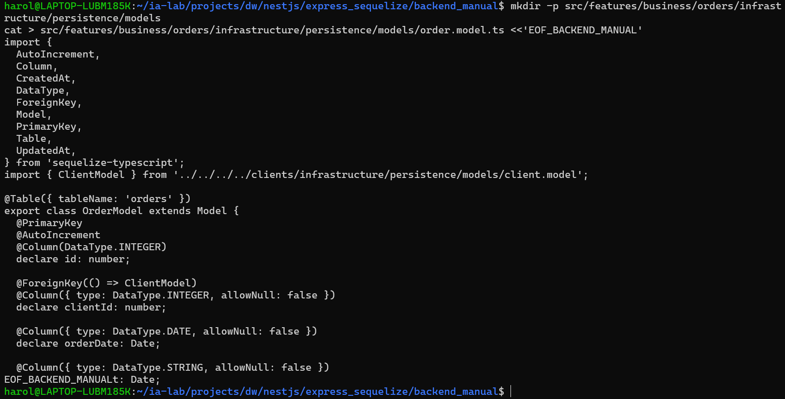

#### 10.2.5 src/features/business/orders/infrastructure/persistence/repositories/order.repository.ts

Implementación Sequelize del repositorio de pedidos.

**ruta** `src/features/business/orders/infrastructure/persistence/repositories/order.repository.ts`

```bash
mkdir -p src/features/business/orders/infrastructure/persistence/repositories
cat > src/features/business/orders/infrastructure/persistence/repositories/order.repository.ts <<'EOF_BACKEND_MANUAL'
import { Injectable } from '@nestjs/common';
import { Op } from 'sequelize';
import {
  buildPaginatedResult,
  normalizePagination,
} from '../../../../../../common/utils/pagination.util';
import { Order } from '../../../domain/entities/order.entity';
import {
  IOrderRepository,
  OrderFindAllParams,
} from '../../../domain/interfaces/order-repository.interface';
import { OrderMapper } from '../../../application/mappers/order.mapper';
import { OrderModel } from '../models/order.model';

@Injectable()
export class OrderRepository implements IOrderRepository {
  async create(order: Order): Promise<Order> {
    const model = await OrderModel.create(OrderMapper.toPersistence(order));
    return OrderMapper.toDomain(model);
  }

  async update(order: Order): Promise<Order> {
    await OrderModel.update(OrderMapper.toPersistence(order), {
      where: { id: order.id },
    });
    const updated = await OrderModel.findByPk(order.id!);
    return OrderMapper.toDomain(updated!);
  }

  async delete(id: number): Promise<void> {
    await OrderModel.destroy({ where: { id } });
  }

  async findById(id: number): Promise<Order | null> {
    const model = await OrderModel.findByPk(id);
    return model ? OrderMapper.toDomain(model) : null;
  }

  async findAll(params: OrderFindAllParams) {
    const { page, limit, offset } = normalizePagination(params.page, params.limit);

    const where: any = {};
    if (params.clientId) where.clientId = params.clientId;
    if (params.status) where.status = params.status;

    const { rows, count } = await OrderModel.findAndCountAll({
      where,
      limit,
      offset,
      order: [['createdAt', 'DESC']],
    });

    return buildPaginatedResult(
      rows.map((row) => OrderMapper.toDomain(row)),
      count,
      page,
      limit,
    );
  }
}
EOF_BACKEND_MANUAL
```
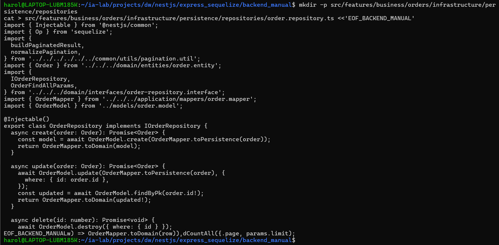

#### 10.2.6 src/features/business/orders/infrastructure/persistence/migrations/create-orders-table.migration.ts

Migración documental de la tabla orders.

**ruta** `src/features/business/orders/infrastructure/persistence/migrations/create-orders-table.migration.ts`

```bash
mkdir -p src/features/business/orders/infrastructure/persistence/migrations
cat > src/features/business/orders/infrastructure/persistence/migrations/create-orders-table.migration.ts <<'EOF_BACKEND_MANUAL'
export const createOrdersTableMigration = {
  name: 'create-orders-table',
  async up(): Promise<void> {
    // Sequelize sync handles table creation in development.
    // Production: CREATE TABLE orders (id, clientId, orderDate, status, createdAt, updatedAt)
  },
  async down(): Promise<void> {
    // Production: DROP TABLE orders
  },
};
EOF_BACKEND_MANUAL
```
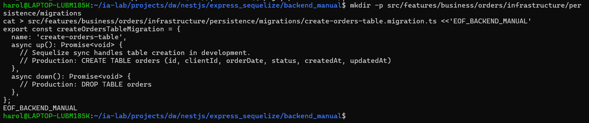

#### 10.2.7 src/features/business/orders/infrastructure/persistence/seeders/orders.seeder.ts

Seeder inicial para pedidos de prueba.

**ruta** `src/features/business/orders/infrastructure/persistence/seeders/orders.seeder.ts`

```bash
mkdir -p src/features/business/orders/infrastructure/persistence/seeders
cat > src/features/business/orders/infrastructure/persistence/seeders/orders.seeder.ts <<'EOF_BACKEND_MANUAL'
import { OrderModel } from '../models/order.model';

export async function seedOrders(): Promise<void> {
  const count = await OrderModel.count();
  if (count > 0) return;

  await OrderModel.bulkCreate([
    {
      clientId: 1,
      orderDate: new Date(),
      status: 'PENDING',
    },
    {
      clientId: 2,
      orderDate: new Date(),
      status: 'COMPLETED',
    },
  ]);
}
EOF_BACKEND_MANUAL
```
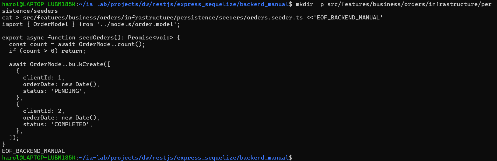

#### 10.2.8 src/features/business/orders/application/dto/create-order.dto.ts

DTO de entrada para crear pedidos vía HTTP.

**ruta** `src/features/business/orders/application/dto/create-order.dto.ts`

```bash
mkdir -p src/features/business/orders/application/dto
cat > src/features/business/orders/application/dto/create-order.dto.ts <<'EOF_BACKEND_MANUAL'
import { ApiProperty } from '@nestjs/swagger';
import { IsDateString, IsInt, IsNotEmpty, IsString } from 'class-validator';

export class CreateOrderDto {
  @ApiProperty({ example: 1 })
  @IsInt()
  clientId: number;

  @ApiProperty({ example: '2026-09-15' })
  @IsDateString()
  orderDate: Date;

  @ApiProperty({ example: 'PENDING' })
  @IsString()
  @IsNotEmpty()
  status: string;
}
EOF_BACKEND_MANUAL
```
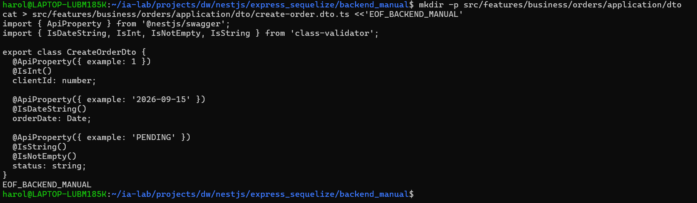

#### 10.2.9 src/features/business/orders/application/dto/update-order.dto.ts

DTO para actualizar estado de pedidos. 

**ruta** `src/features/business/orders/application/dto/update-order.dto.ts`

```bash
cat > src/features/business/orders/application/dto/update-order.dto.ts <<'EOF_BACKEND_MANUAL'
import { ApiPropertyOptional } from '@nestjs/swagger';
import { IsOptional, IsString } from 'class-validator';

export class UpdateOrderDto {
  @ApiPropertyOptional({ example: 'COMPLETED' })
  @IsOptional()
  @IsString()
  status?: string;
}
EOF_BACKEND_MANUAL
```
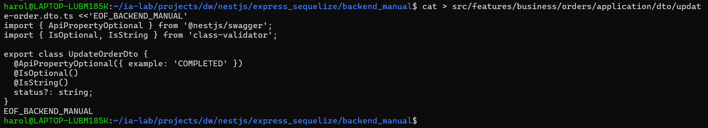

#### 10.2.10 src/features/business/orders/application/dto/order-filter.dto.ts

DTO para filtros de búsqueda y paginación de pedidos.

**ruta** `src/features/business/orders/application/dto/order-filter.dto.ts`

```bash
cat > src/features/business/orders/application/dto/order-filter.dto.ts <<'EOF_BACKEND_MANUAL'
import { ApiPropertyOptional } from '@nestjs/swagger';
import { Type } from 'class-transformer';
import { IsInt, IsOptional, IsString, Min } from 'class-validator';

export class OrderFilterDto {
  @ApiPropertyOptional({ example: 1 })
  @IsOptional()
  @Type(() => Number)
  @IsInt()
  @Min(1)
  page?: number;

  @ApiPropertyOptional({ example: 10 })
  @IsOptional()
  @Type(() => Number)
  @IsInt()
  limit?: number;

  @ApiPropertyOptional({ example: 1 })
  @IsOptional()
  @Type(() => Number)
  @IsInt()
  clientId?: number;

  @ApiPropertyOptional({ example: 'PENDING' })
  @IsOptional()
  @IsString()
  status?: string;
}
EOF_BACKEND_MANUAL
```
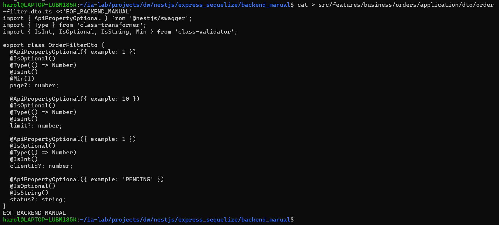

#### 10.2.11 src/features/business/orders/application/dto/order-response.dto.ts

DTO de salida para respuestas HTTP de pedidos.

**ruta** `src/features/business/orders/application/dto/order-response.dto.ts`

```bash
cat > src/features/business/orders/application/dto/order-response.dto.ts <<'EOF_BACKEND_MANUAL'
import { ApiProperty } from '@nestjs/swagger';

export class OrderResponseDto {
  @ApiProperty({ example: 1 })
  id: number;

  @ApiProperty({ example: 1 })
  clientId: number;

  @ApiProperty({ example: '2026-09-15' })
  orderDate: Date;

  @ApiProperty({ example: 'PENDING' })
  status: string;

  @ApiProperty()
  createdAt: Date;

  @ApiProperty()
  updatedAt: Date;
}
EOF_BACKEND_MANUAL
```
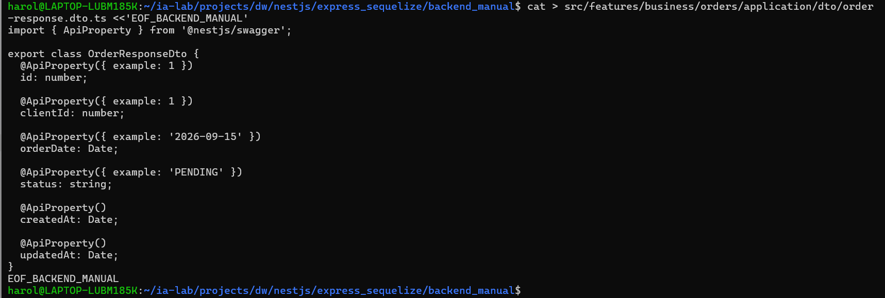

#### 10.2.12 src/features/business/orders/application/mappers/order.mapper.ts

Mapper entre entidad de dominio, modelo Sequelize y DTO.

**ruta** `src/features/business/orders/application/mappers/order.mapper.ts`

```bash
mkdir -p src/features/business/orders/application/mappers
cat > src/features/business/orders/application/mappers/order.mapper.ts <<'EOF_BACKEND_MANUAL'
import { Order } from '../../domain/entities/order.entity';
import { OrderResponseDto } from '../dto/order-response.dto';
import { OrderModel } from '../../infrastructure/persistence/models/order.model';

export class OrderMapper {
  static toDomain(model: OrderModel): Order {
    return Order.reconstitute({
      id: model.id,
      clientId: model.clientId,
      orderDate: model.orderDate,
      status: model.status,
      createdAt: model.createdAt,
      updatedAt: model.updatedAt,
    });
  }

  static toResponse(entity: Order): OrderResponseDto {
    return {
      id: entity.id!,
      clientId: entity.clientId,
      orderDate: entity.orderDate,
      status: entity.status,
      createdAt: entity.createdAt!,
      updatedAt: entity.updatedAt!,
    };
  }

  static toPersistence(entity: Order): Partial<OrderModel> {
    return {
      id: entity.id,
      clientId: entity.clientId,
      orderDate: entity.orderDate,
      status: entity.status,
    };
  }
}
EOF_BACKEND_MANUAL
```

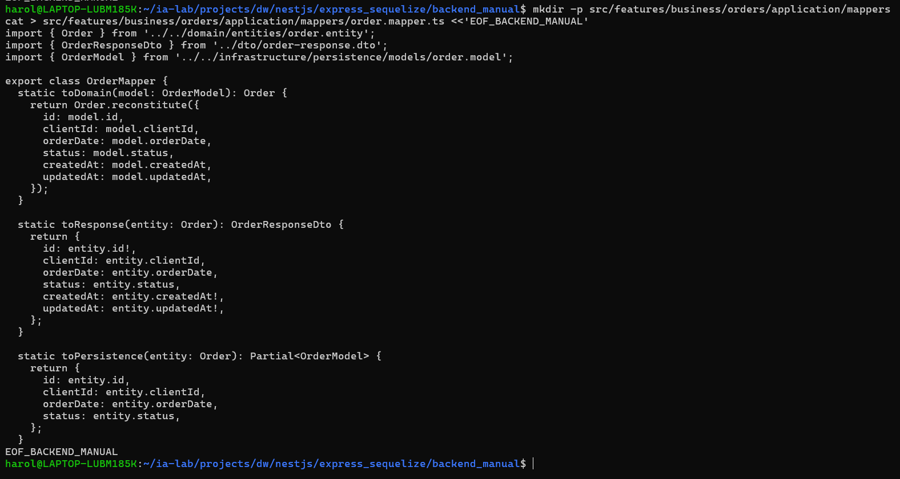

#### 10.2.13 src/features/business/orders/application/use-cases/create-order.use-case.ts

Caso de uso para crear pedidos.

**ruta** `src/features/business/orders/application/use-cases/create-order.use-case.ts`

```bash
mkdir -p src/features/business/orders/application/use-cases
cat > src/features/business/orders/application/use-cases/create-order.use-case.ts <<'EOF_BACKEND_MANUAL'
import { Inject, Injectable } from '@nestjs/common';
import { Order } from '../../domain/entities/order.entity';
import {
  IOrderRepository,
  ORDER_REPOSITORY,
} from '../../domain/interfaces/order-repository.interface';
import { CreateOrderDto } from '../dto/create-order.dto';
import { OrderMapper } from '../mappers/order.mapper';

@Injectable()
export class CreateOrderUseCase {
  constructor(
    @Inject(ORDER_REPOSITORY)
    private readonly orderRepository: IOrderRepository,
  ) {}

  async execute(dto: CreateOrderDto) {
    const order = Order.create(dto);
    const created = await this.orderRepository.create(order);
    return OrderMapper.toResponse(created);
  }
}
EOF_BACKEND_MANUAL
```
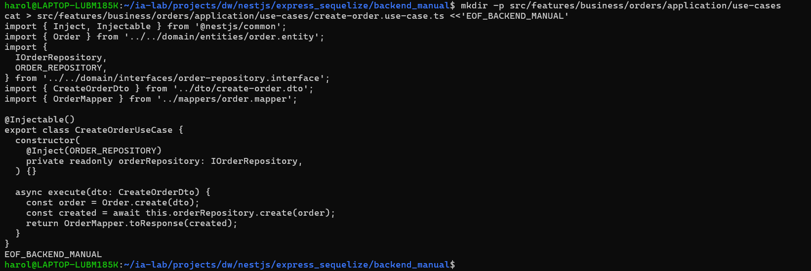

#### 10.2.14 src/features/business/orders/application/use-cases/delete-order.use-case.ts

Caso de uso para eliminar pedidos.

**ruta** `src/features/business/orders/application/use-cases/delete-order.use-case.ts`

```bash
cat > src/features/business/orders/application/use-cases/delete-order.use-case.ts <<'EOF_BACKEND_MANUAL'
import { Inject, Injectable } from '@nestjs/common';
import { OrderNotFoundException } from '../../domain/exceptions/order-not-found.exception';
import {
  IOrderRepository,
  ORDER_REPOSITORY,
} from '../../domain/interfaces/order-repository.interface';

@Injectable()
export class DeleteOrderUseCase {
  constructor(
    @Inject(ORDER_REPOSITORY)
    private readonly orderRepository: IOrderRepository,
  ) {}

  async execute(id: number): Promise<void> {
    const order = await this.orderRepository.findById(id);
    if (!order) {
      throw new OrderNotFoundException(id);
    }
    await this.orderRepository.delete(id);
  }
}
EOF_BACKEND_MANUAL
``` 
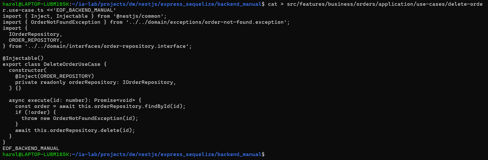

#### 10.2.15 src/features/business/orders/application/use-cases/get-order.use-case.ts

Obtener un pedido por ID.

**ruta** `src/features/business/orders/application/use-cases/get-order.use-case.ts`

```bash
cat > src/features/business/orders/application/use-cases/get-order.use-case.ts <<'EOF_BACKEND_MANUAL'
import { Inject, Injectable } from '@nestjs/common';
import { OrderNotFoundException } from '../../domain/exceptions/order-not-found.exception';
import {
  IOrderRepository,
  ORDER_REPOSITORY,
} from '../../domain/interfaces/order-repository.interface';
import { OrderMapper } from '../mappers/order.mapper';

@Injectable()
export class GetOrderUseCase {
  constructor(
    @Inject(ORDER_REPOSITORY)
    private readonly orderRepository: IOrderRepository,
  ) {}

  async execute(id: number) {
    const order = await this.orderRepository.findById(id);
    if (!order) throw new OrderNotFoundException(id);
    return OrderMapper.toResponse(order);
  }
}
EOF_BACKEND_MANUAL
```
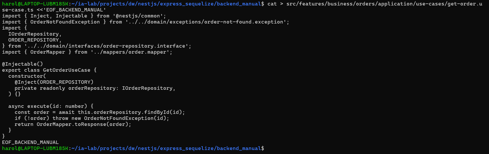

#### 10.2.16 src/features/business/orders/application/use-cases/list-orders.use-case.ts

Listar pedidos con filtros y paginación.

**ruta** `src/features/business/orders/application/use-cases/list-orders.use-case.ts`

```bash
cat > src/features/business/orders/application/use-cases/list-orders.use-case.ts <<'EOF_BACKEND_MANUAL'
import { Inject, Injectable } from '@nestjs/common';
import {
  IOrderRepository,
  ORDER_REPOSITORY,
} from '../../domain/interfaces/order-repository.interface';
import { OrderFilterDto } from '../dto/order-filter.dto';
import { OrderMapper } from '../mappers/order.mapper';

@Injectable()
export class ListOrdersUseCase {
  constructor(
    @Inject(ORDER_REPOSITORY)
    private readonly orderRepository: IOrderRepository,
  ) {}

  async execute(filter: OrderFilterDto) {
    const result = await this.orderRepository.findAll(filter);
    return {
      items: result.items.map((o) => OrderMapper.toResponse(o)),
      meta: result.meta,
    };
  }
}
EOF_BACKEND_MANUAL
```
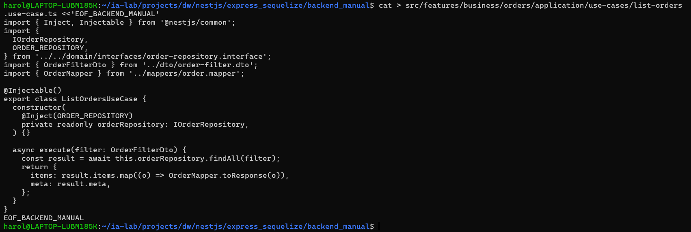

#### 10.2.17 src/features/business/orders/application/use-cases/update-order.use-case.ts

Actualizar estado de un pedido.

**ruta** `src/features/business/orders/application/use-cases/update-order.use-case.ts`

```bash 
cat > src/features/business/orders/application/use-cases/update-order.use-case.ts <<'EOF_BACKEND_MANUAL'
import { Inject, Injectable } from '@nestjs/common';
import { OrderNotFoundException } from '../../domain/exceptions/order-not-found.exception';
import {
  IOrderRepository,
  ORDER_REPOSITORY,
} from '../../domain/interfaces/order-repository.interface';
import { UpdateOrderDto } from '../dto/update-order.dto';
import { OrderMapper } from '../mappers/order.mapper';

@Injectable()
export class UpdateOrderUseCase {
  constructor(
    @Inject(ORDER_REPOSITORY)
    private readonly orderRepository: IOrderRepository,
  ) {}

  async execute(id: number, dto: UpdateOrderDto) {
    const order = await this.orderRepository.findById(id);
    if (!order) throw new OrderNotFoundException(id);

    if (dto.status) order.updateStatus(dto.status);
    const updated = await this.orderRepository.update(order);
    return OrderMapper.toResponse(updated);
  }
}
EOF_BACKEND_MANUAL
```
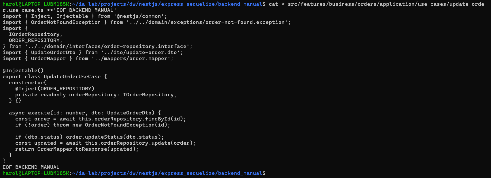

#### 10.2.18 src/features/business/orders/presentation/http/serializers/order.serializer.ts

Serializer para respuestas HTTP de pedidos.

**ruta** `src/features/business/orders/presentation/http/serializers/order.serializer.ts`

```bash
mkdir -p src/features/business/orders/presentation/http/serializers
cat > src/features/business/orders/presentation/http/serializers/order.serializer.ts <<'EOF_BACKEND_MANUAL'
import { Order } from '../../../domain/entities/order.entity';
import { OrderResponseDto } from '../../../application/dto/order-response.dto';
import { OrderMapper } from '../../../application/mappers/order.mapper';

export class OrderSerializer {
  static serialize(entity: Order): OrderResponseDto {
    return OrderMapper.toResponse(entity);
  }
}
EOF_BACKEND_MANUAL
```
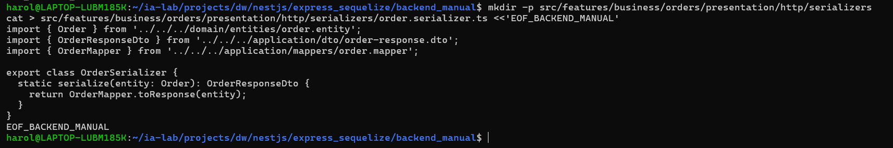

#### 10.2.19 src/features/business/orders/presentation/http/controllers/orders.controller.ts

Controller NestJS para pedidos.

**ruta** `src/features/business/orders/presentation/http/controllers/orders.controller.ts`

```bash
mkdir -p src/features/business/orders/presentation/http/controllers
cat > src/features/business/orders/presentation/http/controllers/orders.controller.ts <<'EOF_BACKEND_MANUAL'
import {
  Body,
  Controller,
  Delete,
  Get,
  HttpCode,
  HttpStatus,
  Param,
  Patch,
  Post,
  Query,
} from '@nestjs/common';
import {
  ApiCreatedResponse,
  ApiNoContentResponse,
  ApiOkResponse,
  ApiOperation,
  ApiTags,
} from '@nestjs/swagger';
import { ParsePositiveIntPipe } from '../../../../../../common/pipes/parse-positive-int.pipe';
import { CreateOrderDto } from '../../../application/dto/create-order.dto';
import { UpdateOrderDto } from '../../../application/dto/update-order.dto';
import { OrderFilterDto } from '../../../application/dto/order-filter.dto';
import { OrderResponseDto } from '../../../application/dto/order-response.dto';
import { CreateOrderUseCase } from '../../../application/use-cases/create-order.use-case';
import { UpdateOrderUseCase } from '../../../application/use-cases/update-order.use-case';
import { DeleteOrderUseCase } from '../../../application/use-cases/delete-order.use-case';
import { GetOrderUseCase } from '../../../application/use-cases/get-order.use-case';
import { ListOrdersUseCase } from '../../../application/use-cases/list-orders.use-case';

@ApiTags('Orders')
@Controller('orders')
export class OrdersController {
  constructor(
    private readonly createOrderUseCase: CreateOrderUseCase,
    private readonly updateOrderUseCase: UpdateOrderUseCase,
    private readonly deleteOrderUseCase: DeleteOrderUseCase,
    private readonly getOrderUseCase: GetOrderUseCase,
    private readonly listOrdersUseCase: ListOrdersUseCase,
  ) {}

  @Post()
  @ApiOperation({ summary: 'Crear un pedido' })
  @ApiCreatedResponse({ type: OrderResponseDto })
  create(@Body() dto: CreateOrderDto) {
    return this.createOrderUseCase.execute(dto);
  }

  @Get()
  @ApiOperation({ summary: 'Listar pedidos' })
  @ApiOkResponse({ type: [OrderResponseDto] })
  findAll(@Query() filter: OrderFilterDto) {
    return this.listOrdersUseCase.execute(filter);
  }

  @Get(':id')
  @ApiOperation({ summary: 'Obtener un pedido por ID' })
  @ApiOkResponse({ type: OrderResponseDto })
  findOne(@Param('id', ParsePositiveIntPipe) id: number) {
    return this.getOrderUseCase.execute(id);
  }

  @Patch(':id')
  @ApiOperation({ summary: 'Actualizar un pedido' })
  @ApiOkResponse({ type: OrderResponseDto })
  update(
    @Param('id', ParsePositiveIntPipe) id: number,
    @Body() dto: UpdateOrderDto,
  ) {
    return this.updateOrderUseCase.execute(id, dto);
  }

  @Delete(':id')
  @HttpCode(HttpStatus.NO_CONTENT)
  @ApiOperation({ summary: 'Eliminar un pedido' })
  @ApiNoContentResponse()
  remove(@Param('id', ParsePositiveIntPipe) id: number) {
    return this.deleteOrderUseCase.execute(id);
  }
}
EOF_BACKEND_MANUAL
```
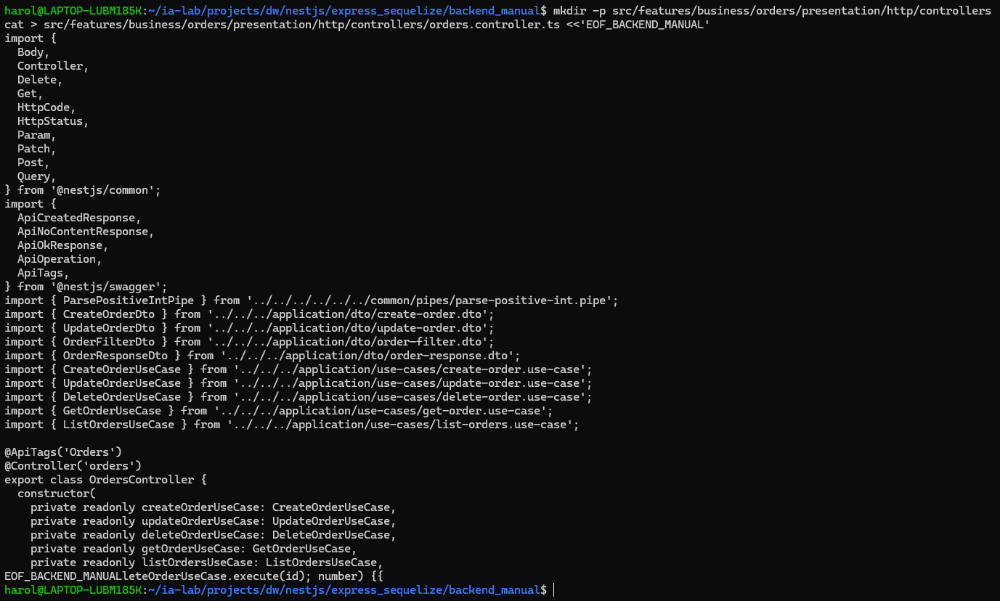

#### 10.2.20 src/features/business/orders/index.ts

Exportar módulo Orders.

**ruta** `src/features/business/orders/index.ts`

```bash
mkdir -p src/features/business/orders
cat > src/features/business/orders/index.ts <<'EOF_BACKEND_MANUAL'
export { OrdersModule } from './orders.module';
EOF_BACKEND_MANUAL
```
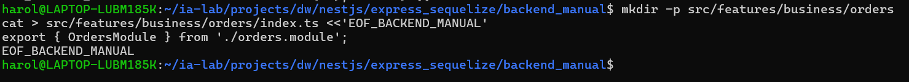

#### 10.2.21 src/features/business/orders/orders.module.ts

Módulo NestJS del feature Orders.

**ruta** `src/features/business/orders/orders.module.ts`

```bash
cat > src/features/business/orders/orders.module.ts <<'EOF_BACKEND_MANUAL'
import { Module } from '@nestjs/common';
import { ORDER_REPOSITORY } from './domain/interfaces/order-repository.interface';
import { OrderRepository } from './infrastructure/persistence/repositories/order.repository';
import { CreateOrderUseCase } from './application/use-cases/create-order.use-case';
import { UpdateOrderUseCase } from './application/use-cases/update-order.use-case';
import { DeleteOrderUseCase } from './application/use-cases/delete-order.use-case';
import { GetOrderUseCase } from './application/use-cases/get-order.use-case';
import { ListOrdersUseCase } from './application/use-cases/list-orders.use-case';
import { OrdersController } from './presentation/http/controllers/orders.controller';

@Module({
  controllers: [OrdersController],
  providers: [
    OrderRepository,
    { provide: ORDER_REPOSITORY, useExisting: OrderRepository },
    CreateOrderUseCase,
    UpdateOrderUseCase,
    DeleteOrderUseCase,
    GetOrderUseCase,
    ListOrdersUseCase,
  ],
  exports: [ORDER_REPOSITORY],
})
export class OrdersModule {}
EOF_BACKEND_MANUAL
```
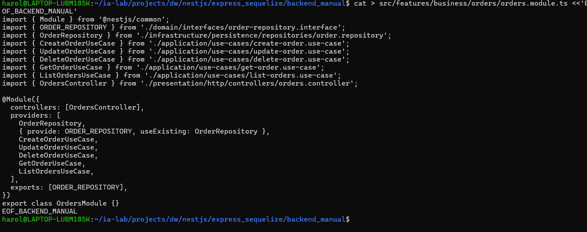

#### 10.2.22 src/infrastructure/database/sequelize/sequelize.factory.ts
 
Registrar OrderModel en la lista de modelos.

**ruta** `src/infrastructure/database/sequelize/sequelize.factory.ts`

```bash
cat > src/infrastructure/database/sequelize/sequelize.factory.ts <<'EOF_BACKEND_MANUAL'
import { Sequelize } from 'sequelize-typescript';
import { ClientModel } from '../../../features/business/clients/infrastructure/persistence/models/client.model';
import { CollectionModel } from '../../../features/business/collections/infrastructure/persistence/models/collection.model';
import { ProductModel } from '../../../features/business/products/infrastructure/persistence/models/product.model';
import { OrderModel } from '../../../features/business/orders/infrastructure/persistence/models/order.model';

export const ALL_MODELS = [
  ClientModel,
  CollectionModel,
  ProductModel,
  OrderModel,
];

export async function createSequelizeInstance(options: any): Promise<Sequelize> {
  const sequelize = new Sequelize(options);
  sequelize.addModels(ALL_MODELS);

  ClientModel.hasMany(OrderModel, { foreignKey: 'clientId' });
  OrderModel.belongsTo(ClientModel, { foreignKey: 'clientId' });

  CollectionModel.hasMany(ProductModel, { foreignKey: 'collectionId' });
  ProductModel.belongsTo(CollectionModel, { foreignKey: 'collectionId' });

  return sequelize;
}
EOF_BACKEND_MANUAL
```
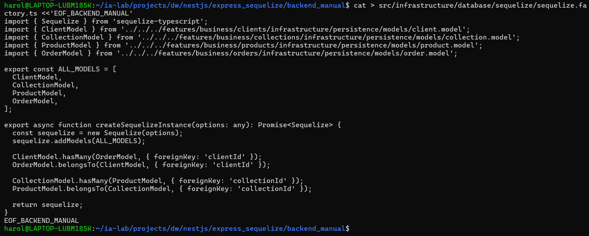

#### 10.2.23 src/features/business/business.module.ts

Agregar OrdersModule.

**ruta** `src/features/business/business.module.ts`

```bash
cat > src/features/business/business.module.ts <<'EOF_BACKEND_MANUAL'
import { Module } from '@nestjs/common';
import { ClientsModule } from './clients/clients.module';
import { CollectionsModule } from './collections/collections.module';
import { ProductsModule } from './products/products.module';
import { OrdersModule } from './orders/orders.module';

@Module({
  imports: [ClientsModule, CollectionsModule, ProductsModule, OrdersModule],
  exports: [ClientsModule, CollectionsModule, ProductsModule, OrdersModule],
})
export class BusinessModule {}
EOF_BACKEND_MANUAL
```
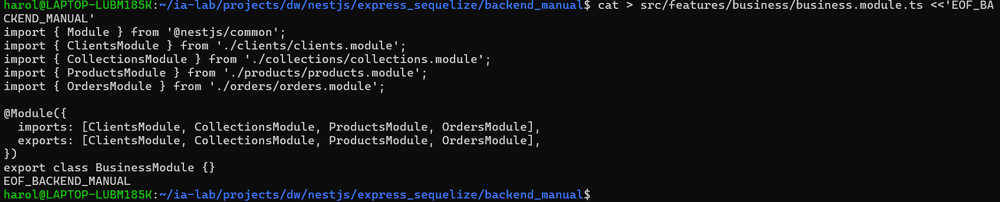

#### 10.2.24 src/infrastructure/database/seeders/database-seeder.service.ts

Ejecutar seedOrders.

**ruta** `src/infrastructure/database/seeders/database-seeder.service.ts`

```bash
cat > src/infrastructure/database/seeders/database-seeder.service.ts <<'EOF_BACKEND_MANUAL'
import { Injectable } from '@nestjs/common';
import { seedClients } from '../../../features/business/clients/infrastructure/persistence/seeders/clients.seeder';
import { seedCollections } from '../../../features/business/collections/infrastructure/persistence/seeders/collections.seeder';
import { seedProducts } from '../../../features/business/products/infrastructure/persistence/seeders/products.seeder';
import { seedOrders } from '../../../features/business/orders/infrastructure/persistence/seeders/orders.seeder';

@Injectable()
export class DatabaseSeederService {
  async runAllSeeders(): Promise<void> {
    await seedClients();
    await seedCollections();
    await seedProducts();
    await seedOrders();
  }
}
EOF_BACKEND_MANUAL
```
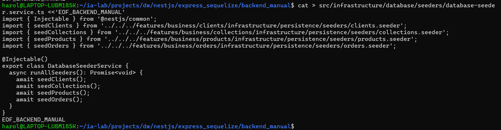

#### 10.2.25 src/features/business/orders/domain/entities/order.entity.spec.ts

Prueba unitaria de la entidad Order.

**ruta** `src/features/business/orders/domain/entities/order.entity.spec.ts`

```bash
mkdir -p src/features/business/orders/domain/entities
cat > src/features/business/orders/domain/entities/order.entity.spec.ts <<'EOF_BACKEND_MANUAL'
import { Order } from './order.entity';

describe('Order Entity', () => {
  it('should create a valid order', () => {
    const order = Order.create({
      clientId: 1,
      orderDate: new Date(),
      status: 'PENDING',
    });
    expect(order.clientId).toBe(1);
    expect(order.status).toBe('PENDING');
  });

  it('should update status', () => {
    const order = Order.create({
      clientId: 1,
      orderDate: new Date(),
      status: 'PENDING',
    });
    order.updateStatus('COMPLETED');
    expect(order.status).toBe('COMPLETED');
  });
});
EOF_BACKEND_MANUAL
```
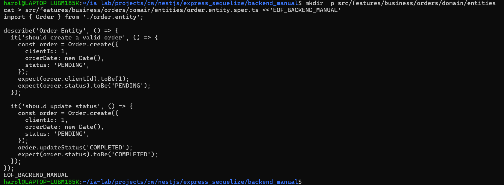

#### 10.2.26 res/business/orders/infrastructure/persistence/repositories/order.repository.spec.ts

Prueba unitaria del repositorio de Orders.

**ruta** `res/business/orders/infrastructure/persistence/repositories/order.repository.spec.ts`

```bash
mkdir -p src/features/business/orders/infrastructure/persistence/repositories
cat > src/features/business/orders/infrastructure/persistence/repositories/order.repository.spec.ts <<'EOF_BACKEND_MANUAL'
import { OrderRepository } from './order.repository';
import { Order } from '../../../domain/entities/order.entity';

describe('OrderRepository', () => {
  let repository: OrderRepository;

  beforeEach(() => {
    repository = new OrderRepository();
  });

  it('should create an order', async () => {
    const order = Order.create({
      clientId: 1,
      orderDate: new Date(),
      status: 'PENDING',
    });
    const created = await repository.create(order);
    expect(created.clientId).toBe(1);
  });
});
EOF_BACKEND_MANUAL
```
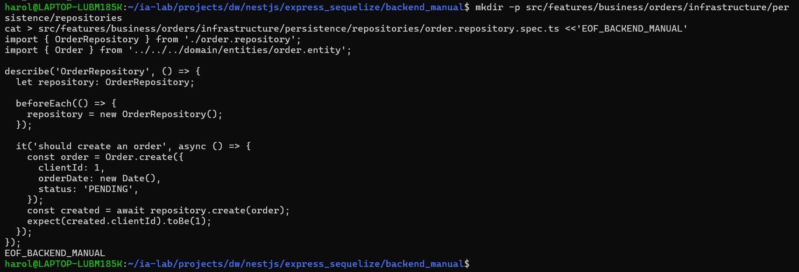

#### 10.2.27 src/features/business/orders/application/use-cases/create-order.use-case.spec.ts

Prueba unitaria del caso de uso CreateOrderUseCase.

**ruta** `src/features/business/orders/application/use-cases/create-order.use-case.spec.ts`

```bash
mkdir -p src/features/business/orders/application/use-cases
cat > src/features/business/orders/application/use-cases/create-order.use-case.spec.ts <<'EOF_BACKEND_MANUAL'
import { CreateOrderUseCase } from './create-order.use-case';
import { IOrderRepository } from '../../domain/interfaces/order-repository.interface';
import { Order } from '../../domain/entities/order.entity';

class MockOrderRepository implements IOrderRepository {
  async create(order: Order): Promise<Order> { return order; }
  async update(order: Order): Promise<Order> { return order; }
  async delete(id: number): Promise<void> {}
  async findById(id: number): Promise<Order | null> { return null; }
  async findAll(): Promise<any> { return { items: [], meta: {} }; }
}

describe('CreateOrderUseCase', () => {
  it('should create an order', async () => {
    const repo = new MockOrderRepository();
    const useCase = new CreateOrderUseCase(repo as any);
    const result = await useCase.execute({
      clientId: 1,
      orderDate: new Date(),
      status: 'PENDING',
    });
    expect(result.clientId).toBe(1);
  });
});
EOF_BACKEND_MANUAL
```
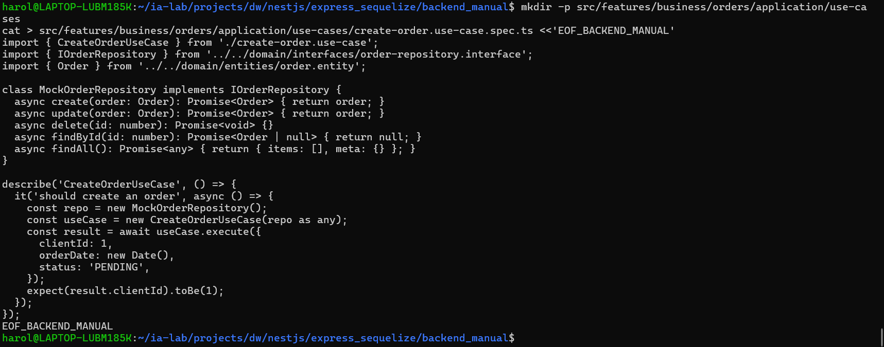

#### 10.2.28 src/features/business/orders/presentation/http/controllers/orders.controller.spec.ts

Prueba unitaria del controller de Orders.

**ruta** `src/features/business/orders/presentation/http/controllers/orders.controller.spec.ts`
 
```bash
mkdir -p src/features/business/orders/presentation/http/controllers
cat > src/features/business/orders/presentation/http/controllers/orders.controller.spec.ts <<'EOF_BACKEND_MANUAL'
import { OrdersController } from './orders.controller';
import { CreateOrderUseCase } from '../../../application/use-cases/create-order.use-case';

describe('OrdersController', () => {
  it('should call create use case', async () => {
    const mockUseCase = { execute: jest.fn().mockResolvedValue({ id: 1 }) };
    const controller = new OrdersController(
      mockUseCase as any,
      {} as any,
      {} as any,
      {} as any,
      {} as any,
    );
    const result = await controller.create({
      clientId: 1,
      orderDate: new Date(),
      status: 'PENDING',
    });
    expect(result.id).toBe(1);
  });
});
EOF_BACKEND_MANUAL
```
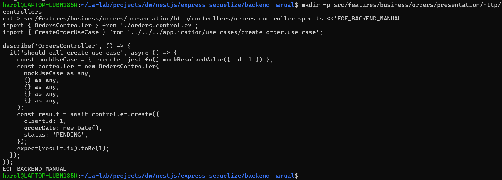

#### 10.2.29 Verificar tablas Order

```bash
npm run start:dev
```
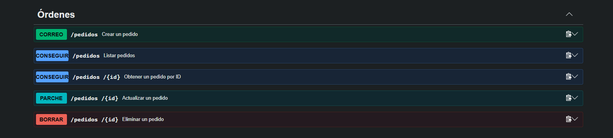

### 10.3.01 src/features/business/variants/domain/entities/variant.entity.ts

Entidad de dominio para variantes de producto (ej. talla, color).

**ruta** `src/features/business/variants/domain/entities/variant.entity.ts`

```bash 
mkdir -p src/features/business/variants/domain/entities
cat > src/features/business/variants/domain/entities/variant.entity.ts <<'EOF_BACKEND_MANUAL'
export interface VariantProps {
  id?: number;
  productId: number;
  name: string;
  description?: string;
  isActive?: boolean;
  createdAt?: Date;
  updatedAt?: Date;
}

export class Variant {
  id?: number;
  productId: number;
  name: string;
  description?: string;
  isActive: boolean;
  createdAt?: Date;
  updatedAt?: Date;

  private constructor(props: VariantProps) {
    this.id = props.id;
    this.productId = props.productId;
    this.name = props.name;
    this.description = props.description;
    this.isActive = props.isActive ?? true;
    this.createdAt = props.createdAt;
    this.updatedAt = props.updatedAt;
  }

  static create(props: Omit<VariantProps, 'id' | 'createdAt' | 'updatedAt'>): Variant {
    if (!props.name?.trim()) throw new Error('El nombre de la variante es requerido');
    return new Variant(props);
  }

  static reconstitute(props: VariantProps): Variant {
    return new Variant(props);
  }

  update(props: Partial<Omit<VariantProps, 'id' | 'createdAt' | 'updatedAt'>>): void {
    if (props.name !== undefined) {
      if (!props.name.trim()) throw new Error('El nombre de la variante es requerido');
      this.name = props.name;
    }
    if (props.description !== undefined) this.description = props.description;
    if (props.isActive !== undefined) this.isActive = props.isActive;
  }
}
EOF_BACKEND_MANUAL
```
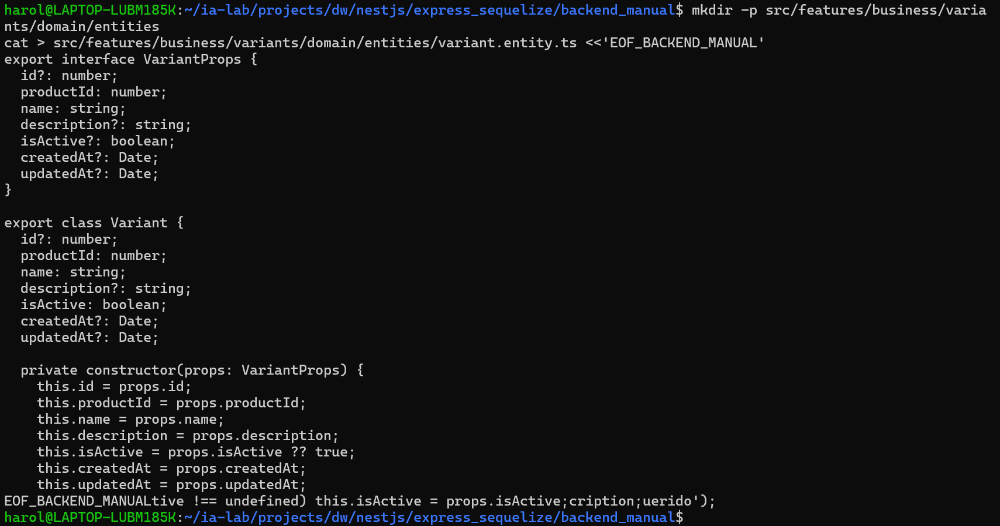


#### 10.3.02 src/features/business/variants/domain/exceptions/variant-not-found.exception.ts

Excepción personalizada cuando no se encuentra una variante.

```bash
mkdir -p src/features/business/variants/domain/exceptions
cat > src/features/business/variants/domain/exceptions/variant-not-found.exception.ts <<'EOF_BACKEND_MANUAL'
import { EntityNotFoundException } from '../../../../../common/exceptions/entity-not-found.exception.js';

export class VariantNotFoundException extends EntityNotFoundException {
  constructor(id: number) {
    super('Variante', id);
  }
}
EOF_BACKEND_MANUAL
```
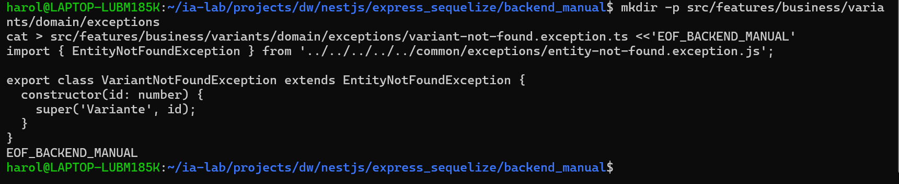

#### 10.3.03 src/features/business/variants/domain/interfaces/variant-repository.interface.ts

Contrato del repositorio de variantes.

**ruta** `src/features/business/variants/domain/interfaces/variant-repository.interface.ts`

```bash
mkdir -p src/features/business/variants/domain/interfaces
cat > src/features/business/variants/domain/interfaces/variant-repository.interface.ts <<'EOF_BACKEND_MANUAL'
import { PaginatedResult } from '../../../../../common/interfaces/pagination.interface.js';
import { Variant } from '../entities/variant.entity.js';

export const VARIANT_REPOSITORY = 'VARIANT_REPOSITORY';

export interface VariantFindAllParams {
  page?: number;
  limit?: number;
  productId?: number;
  search?: string;
}

export interface IVariantRepository {
  create(variant: Variant): Promise<Variant>;
  update(variant: Variant): Promise<Variant>;
  delete(id: number): Promise<void>;
  findById(id: number): Promise<Variant | null>;
  findAll(params: VariantFindAllParams): Promise<PaginatedResult<Variant>>;
}
EOF_BACKEND_MANUAL
```
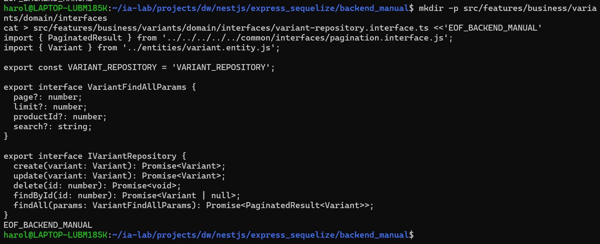

#### 10.0.04 src/features/business/variants/infrastructure/persistence/models/variant.model.ts

Modelo Sequelize que mapea la tabla variants.

**ruta** `src/features/business/variants/infrastructure/persistence/models/variant.model.ts`

```bash
mkdir -p src/features/business/variants/infrastructure/persistence/models
cat > src/features/business/variants/infrastructure/persistence/models/variant.model.ts <<'EOF_BACKEND_MANUAL'
import {
  AutoIncrement,
  Column,
  CreatedAt,
  DataType,
  ForeignKey,
  Model,
  PrimaryKey,
  Table,
  UpdatedAt,
} from 'sequelize-typescript';
import { ProductModel } from '../../../../products/infrastructure/persistence/models/product.model.js';

@Table({ tableName: 'variants' })
export class VariantModel extends Model {
  @PrimaryKey
  @AutoIncrement
  @Column(DataType.INTEGER)
  declare id: number;

  @ForeignKey(() => ProductModel)
  @Column({ type: DataType.INTEGER, allowNull: false })
  declare productId: number;

  @Column({ type: DataType.STRING(100), allowNull: false })
  declare name: string;

  @Column({ type: DataType.TEXT, allowNull: true })
  declare description: string | null;

  @Column({ type: DataType.BOOLEAN, allowNull: false, defaultValue: true })
  declare isActive: boolean;

  @CreatedAt
  declare createdAt: Date;

  @UpdatedAt
  declare updatedAt: Date;
}
EOF_BACKEND_MANUAL
```
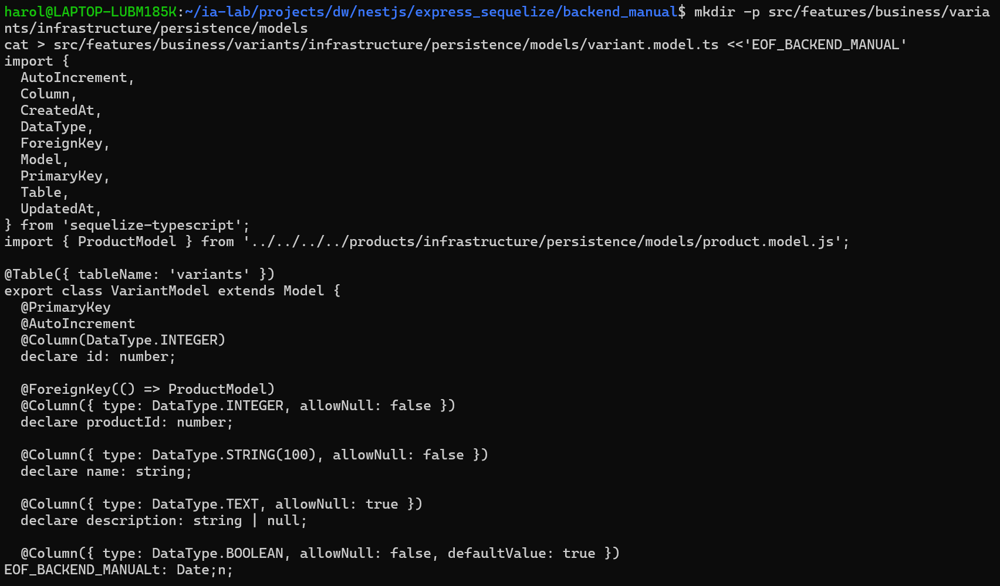

#### 10.3.05 src/features/business/variants/infrastructure/persistence/repositories/variant.repository.ts

Implementación Sequelize del repositorio de variantes.

**ruta** `src/features/business/variants/infrastructure/persistence/repositories/variant.repository.ts`

```bash
mkdir -p src/features/business/variants/infrastructure/persistence/repositories
cat > src/features/business/variants/infrastructure/persistence/repositories/variant.repository.ts <<'EOF_BACKEND_MANUAL'
import { Injectable } from '@nestjs/common';
import { Op } from 'sequelize';
import {
  buildPaginatedResult,
  normalizePagination,
} from '../../../../../../common/utils/pagination.util.js';
import { Variant } from '../../../domain/entities/variant.entity.js';
import type { IVariantRepository, VariantFindAllParams } from '../../../domain/interfaces/variant-repository.interface.js';
import { VariantMapper } from '../../../application/mappers/variant.mapper.js';
import { VariantModel } from '../models/variant.model.js';

@Injectable()
export class VariantRepository implements IVariantRepository {
  async create(variant: Variant): Promise<Variant> {
    const model = await VariantModel.create(VariantMapper.toPersistence(variant));
    return VariantMapper.toDomain(model);
  }

  async update(variant: Variant): Promise<Variant> {
    await VariantModel.update(VariantMapper.toPersistence(variant), { where: { id: variant.id } });
    const updated = await VariantModel.findByPk(variant.id!);
    return VariantMapper.toDomain(updated!);
  }

  async delete(id: number): Promise<void> {
    await VariantModel.destroy({ where: { id } });
  }

  async findById(id: number): Promise<Variant | null> {
    const model = await VariantModel.findByPk(id);
    return model ? VariantMapper.toDomain(model) : null;
  }

  async findAll(params: VariantFindAllParams) {
    const { page, limit, offset } = normalizePagination(params.page, params.limit);

    const where: any = {};
    if (params.productId) where.productId = params.productId;
    if (params.search) {
      where[Op.or] = [
        { name: { [Op.like]: `%${params.search}%` } },
        { description: { [Op.like]: `%${params.search}%` } },
      ];
    }

    const { rows, count } = await VariantModel.findAndCountAll({
      where,
      limit,
      offset,
      order: [['createdAt', 'DESC']],
    });

    return buildPaginatedResult(
      rows.map((row: VariantModel) => VariantMapper.toDomain(row)),
      count,
      page,
      limit,
    );
  }
}
EOF_BACKEND_MANUAL
```
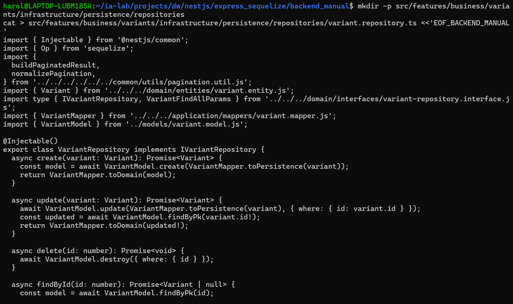

#### 10.3.06 src/features/business/variants/infrastructure/persistence/migrations/create-variants-table.migration.ts

Migración documental de la tabla variants.

**ruta** `src/features/business/variants/infrastructure/persistence/migrations/create-variants-table.migration.ts`

```bash
mkdir -p src/features/business/variants/infrastructure/persistence/migrations
cat > src/features/business/variants/infrastructure/persistence/migrations/create-variants-table.migration.ts <<'EOF_BACKEND_MANUAL'
export const createVariantsTableMigration = {
  name: 'create-variants-table',
  async up(): Promise<void> {
    // Sequelize sync handles table creation in development.
    // Production: CREATE TABLE variants (id, productId, name, description, isActive, createdAt, updatedAt)
  },
  async down(): Promise<void> {
    // Production: DROP TABLE variants
  },
};
EOF_BACKEND_MANUAL
```
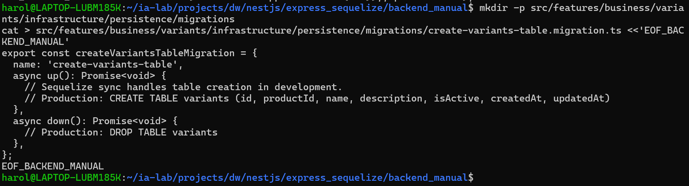

#### 10.3.07 src/features/business/variants/infrastructure/persistence/seeders/variants.seeder.ts
 
Seeder inicial para variantes de producto.

```bash
mkdir -p
```
#### 10.3.08 src/features/business/variants/application/dto/create-variant.dto.ts

DTO de entrada para crear variantes vía HTTP.

```bash
mkdir -p src/features/business/variants/application/dto
cat > src/features/business/variants/application/dto/create-variant.dto.ts <<'EOF_BACKEND_MANUAL'
import { ApiProperty, ApiPropertyOptional } from '@nestjs/swagger';
import { IsInt, IsNotEmpty, IsOptional, IsString, MaxLength } from 'class-validator';

export class CreateVariantDto {
  @ApiProperty({ example: 1 })
  @IsInt()
  productId: number;

  @ApiProperty({ example: 'Talla M' })
  @IsString()
  @IsNotEmpty()
  @MaxLength(100)
  name: string;

  @ApiPropertyOptional({ example: 'Variante de talla mediana' })
  @IsOptional()
  @IsString()
  description?: string;
}
EOF_BACKEND_MANUAL
```
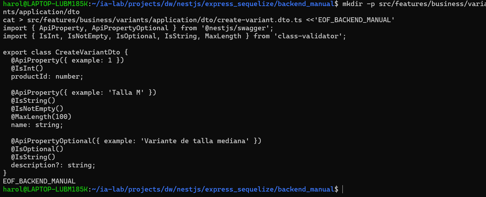

#### 10.3.09 src/features/business/variants/application/dto/update-variant.dto.ts
DTO para actualizar variantes.

```bash
cat > src/features/business/variants/application/dto/update-variant.dto.ts <<'EOF_BACKEND_MANUAL'
import { PartialType } from '@nestjs/mapped-types';
import { CreateVariantDto } from './create-variant.dto.js';

export class UpdateVariantDto extends PartialType(CreateVariantDto) {}
EOF_BACKEND_MANUAL
```
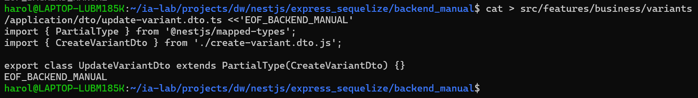

#### 10.3.10 src/features/business/variants/application/dto/variant-filter.dto.ts
DTO para filtros de búsqueda y paginación de variantes.

```bash
cat > src/features/business/variants/application/dto/variant-filter.dto.ts <<'EOF_BACKEND_MANUAL'
import { ApiPropertyOptional } from '@nestjs/swagger';
import { Type } from 'class-transformer';
import { IsInt, IsOptional, IsString, Min } from 'class-validator';

export class VariantFilterDto {
  @ApiPropertyOptional({ example: 1 })
  @IsOptional()
  @Type(() => Number)
  @IsInt()
  @Min(1)
  page?: number;

  @ApiPropertyOptional({ example: 10 })
  @IsOptional()
  @Type(() => Number)
  @IsInt()
  limit?: number;

  @ApiPropertyOptional({ example: 1 })
  @IsOptional()
  @Type(() => Number)
  @IsInt()
  productId?: number;

  @ApiPropertyOptional({ example: 'Talla' })
  @IsOptional()
  @IsString()
  search?: string;
}
EOF_BACKEND_MANUAL
```
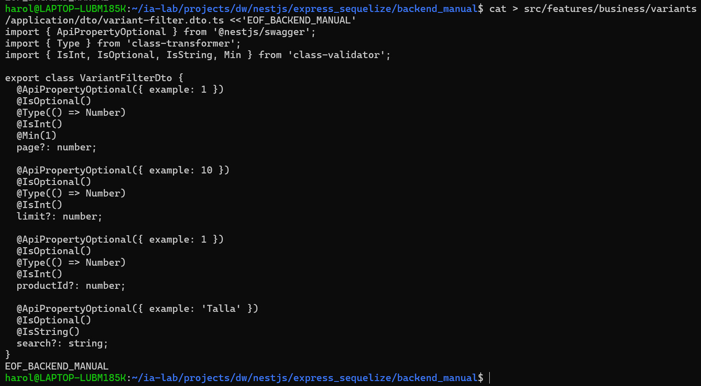

#### 10.3.11 src/features/business/variants/application/dto/variant-response.dto.ts
DTO de salida para respuestas HTTP de variantes.

```bash
cat > src/features/business/variants/application/dto/variant-response.dto.ts <<'EOF_BACKEND_MANUAL'
import { ApiProperty, ApiPropertyOptional } from '@nestjs/swagger';

export class VariantResponseDto {
  @ApiProperty({ example: 1 })
  id: number;

  @ApiProperty({ example: 1 })
  productId: number;

  @ApiProperty({ example: 'Talla M' })
  name: string;

  @ApiPropertyOptional({ example: 'Variante de talla mediana' })
  description?: string;

  @ApiProperty({ example: true })
  isActive: boolean;

  @ApiProperty()
  createdAt: Date;

  @ApiProperty()
  updatedAt: Date;
}
EOF_BACKEND_MANUAL
```
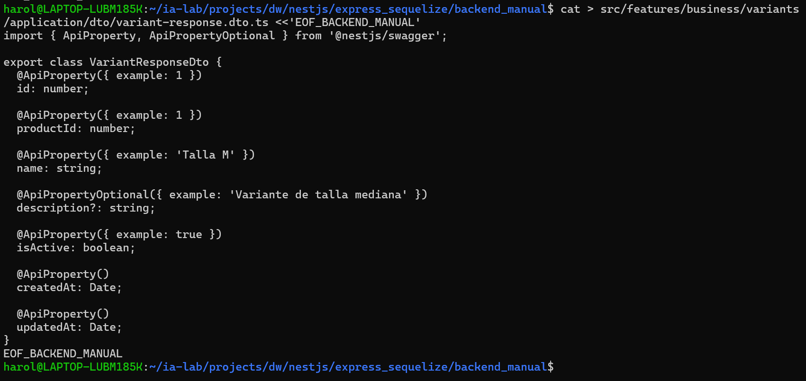

#### 10.3.12 src/features/business/variants/application/mappers/variant.mapper.ts
Mapper entre entidad de dominio, modelo Sequelize y DTO de respuesta.

```bash
mkdir -p src/features/business/variants/application/mappers
cat > src/features/business/variants/application/mappers/variant.mapper.ts <<'EOF_BACKEND_MANUAL'
import { Variant } from '../../domain/entities/variant.entity.js';
import { VariantResponseDto } from '../dto/variant-response.dto.js';
import { VariantModel } from '../../infrastructure/persistence/models/variant.model.js';

export class VariantMapper {
  static toDomain(model: VariantModel): Variant {
    return Variant.reconstitute({
      id: model.id,
      productId: model.productId,
      name: model.name,
      description: model.description ?? undefined,
      isActive: model.isActive,
      createdAt: model.createdAt,
      updatedAt: model.updatedAt,
    });
  }

  static toResponse(entity: Variant): VariantResponseDto {
    return {
      id: entity.id!,
      productId: entity.productId,
      name: entity.name,
      description: entity.description,
      isActive: entity.isActive,
      createdAt: entity.createdAt!,
      updatedAt: entity.updatedAt!,
    };
  }

  static toPersistence(entity: Variant): Partial<VariantModel> {
    return {
      id: entity.id,
      productId: entity.productId,
      name: entity.name,
      description: entity.description ?? null,
      isActive: entity.isActive,
    };
  }
}
EOF_BACKEND_MANUAL
```
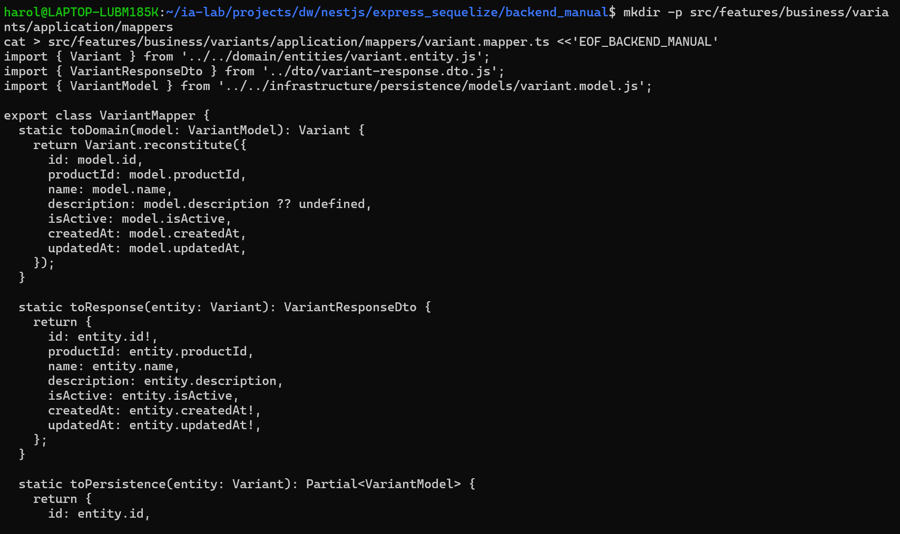

#### 10.3.13 src/features/business/variants/application/use-cases/create-variant.use-case.ts
Caso de uso para crear variantes.

```bash
mkdir -p src/features/business/variants/application/use-cases
cat > src/features/business/variants/application/use-cases/create-variant.use-case.ts <<'EOF_BACKEND_MANUAL'
import { Inject, Injectable } from '@nestjs/common';
import { Variant } from '../../domain/entities/variant.entity.js';
import type { IVariantRepository } from '../../domain/interfaces/variant-repository.interface.js';
import { VARIANT_REPOSITORY } from '../../domain/interfaces/variant-repository.interface.js';
import { CreateVariantDto } from '../dto/create-variant.dto.js';
import { VariantMapper } from '../mappers/variant.mapper.js';

@Injectable()
export class CreateVariantUseCase {
  constructor(
    @Inject(VARIANT_REPOSITORY)
    private readonly variantRepository: IVariantRepository,
  ) {}

  async execute(dto: CreateVariantDto) {
    const variant = Variant.create(dto);
    const created = await this.variantRepository.create(variant);
    return VariantMapper.toResponse(created);
  }
}
EOF_BACKEND_MANUAL
```
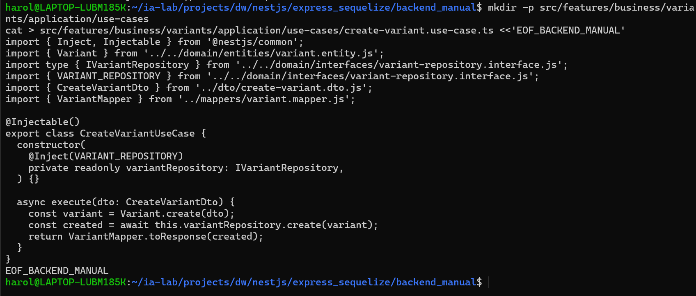

#### 10.3.14 src/features/business/variants/application/use-cases/delete-variant.use-case.ts
Caso de uso para eliminar variantes.

```bash
cat > src/features/business/variants/application/use-cases/delete-variant.use-case.ts <<'EOF_BACKEND_MANUAL'
import { Inject, Injectable } from '@nestjs/common';
import { VariantNotFoundException } from '../../domain/exceptions/variant-not-found.exception.js';
import type { IVariantRepository } from '../../domain/interfaces/variant-repository.interface.js';
import { VARIANT_REPOSITORY } from '../../domain/interfaces/variant-repository.interface.js';

@Injectable()
export class DeleteVariantUseCase {
  constructor(
    @Inject(VARIANT_REPOSITORY)
    private readonly variantRepository: IVariantRepository,
  ) {}

  async execute(id: number): Promise<void> {
    const variant = await this.variantRepository.findById(id);
    if (!variant) throw new VariantNotFoundException(id);
    await this.variantRepository.delete(id);
  }
}
EOF_BACKEND_MANUAL
```
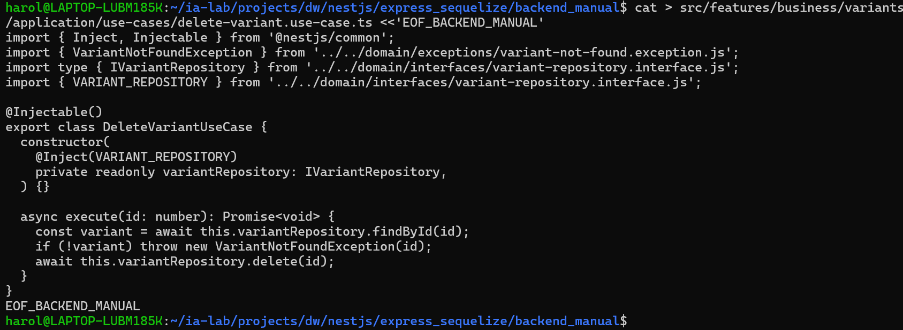

#### 10.3.15 src/features/business/variants/application/use-cases/get-variant.use-case.ts
Caso de uso para obtener una variante por ID.

```bash
cat > src/features/business/variants/application/use-cases/get-variant.use-case.ts <<'EOF_BACKEND_MANUAL'
import { Inject, Injectable } from '@nestjs/common';
import { VariantNotFoundException } from '../../domain/exceptions/variant-not-found.exception.js';
import type { IVariantRepository } from '../../domain/interfaces/variant-repository.interface.js';
import { VARIANT_REPOSITORY } from '../../domain/interfaces/variant-repository.interface.js';
import { VariantMapper } from '../mappers/variant.mapper.js';

@Injectable()
export class GetVariantUseCase {
  constructor(
    @Inject(VARIANT_REPOSITORY)
    private readonly variantRepository: IVariantRepository,
  ) {}

  async execute(id: number) {
    const variant = await this.variantRepository.findById(id);
    if (!variant) throw new VariantNotFoundException(id);
    return VariantMapper.toResponse(variant);
  }
}
EOF_BACKEND_MANUAL
```
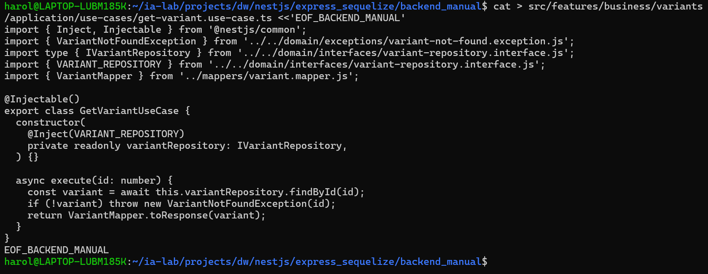

#### 10.3.16 src/features/business/variants/application/use-cases/list-variants.use-case.ts
Caso de uso para listar variantes con filtros y paginación.

```bash
cat > src/features/business/variants/application/use-cases/list-variants.use-case.ts <<'EOF_BACKEND_MANUAL'
import { Inject, Injectable } from '@nestjs/common';
import type { IVariantRepository } from '../../domain/interfaces/variant-repository.interface.js';
import { VARIANT_REPOSITORY } from '../../domain/interfaces/variant-repository.interface.js';
import { VariantFilterDto } from '../dto/variant-filter.dto.js';
import { VariantMapper } from '../mappers/variant.mapper.js';
import { Variant } from '../../domain/entities/variant.entity.js';

@Injectable()
export class ListVariantsUseCase {
  constructor(
    @Inject(VARIANT_REPOSITORY)
    private readonly variantRepository: IVariantRepository,
  ) {}

  async execute(filter: VariantFilterDto) {
    const result = await this.variantRepository.findAll(filter);
    return {
      items: result.items.map((v: Variant) => VariantMapper.toResponse(v)),
      meta: result.meta,
    };
  }
}
EOF_BACKEND_MANUAL
```
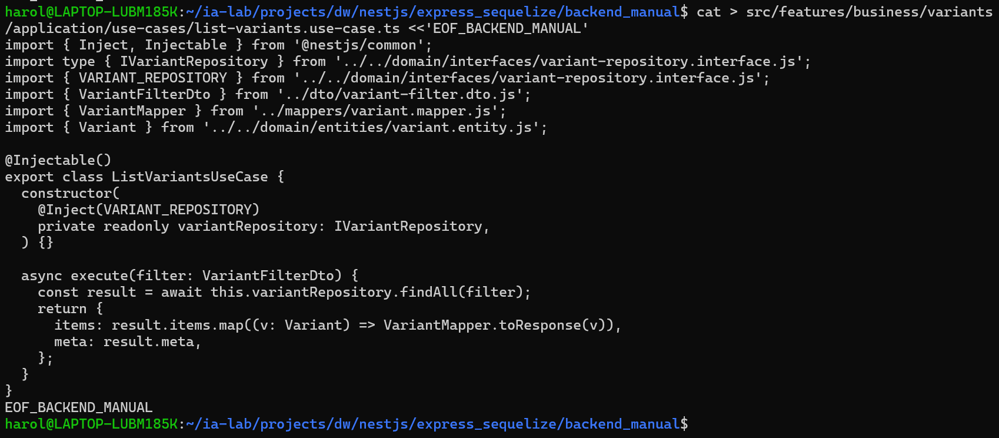
#### 10.3.17 src/features/business/variants/application/use-cases/update-variant.use-case.ts
Caso de uso para actualizar una variante.

```bash
cat > src/features/business/variants/application/use-cases/update-variant.use-case.ts <<'EOF_BACKEND_MANUAL'
import { Inject, Injectable } from '@nestjs/common';
import { VariantNotFoundException } from '../../domain/exceptions/variant-not-found.exception.js';
import type { IVariantRepository } from '../../domain/interfaces/variant-repository.interface.js';
import { VARIANT_REPOSITORY } from '../../domain/interfaces/variant-repository.interface.js';
import { UpdateVariantDto } from '../dto/update-variant.dto.js';
import { VariantMapper } from '../mappers/variant.mapper.js';

@Injectable()
export class UpdateVariantUseCase {
  constructor(
    @Inject(VARIANT_REPOSITORY)
    private readonly variantRepository: IVariantRepository,
  ) {}

  async execute(id: number, dto: UpdateVariantDto) {
    const variant = await this.variantRepository.findById(id);
    if (!variant) throw new VariantNotFoundException(id);

    variant.update(dto);
    const updated = await this.variantRepository.update(variant);
    return VariantMapper.toResponse(updated);
  }
}
EOF_BACKEND_MANUAL
```
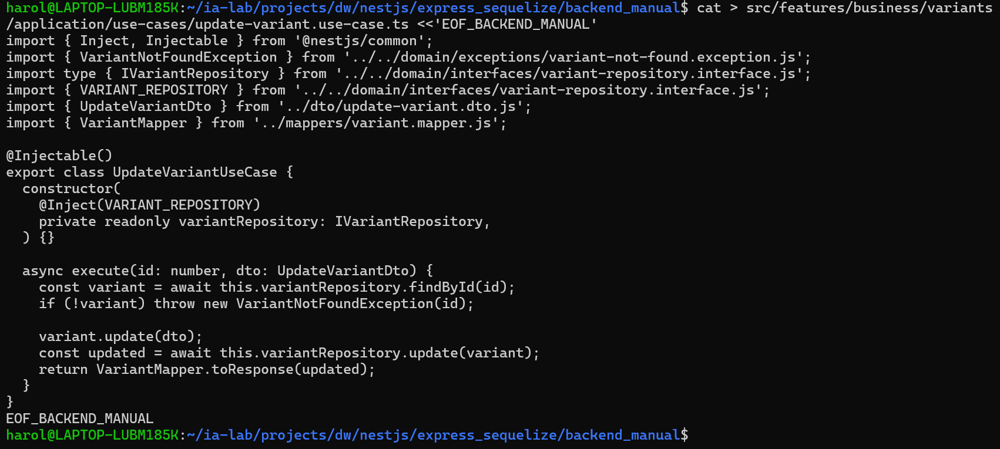

#### 10.3.18 src/features/business/variants/presentation/http/serializers/variant.serializer.ts
Serializer para respuestas HTTP de variantes.

```bash
mkdir -p src/features/business/variants/presentation/http/serializers
cat > src/features/business/variants/presentation/http/serializers/variant.serializer.ts <<'EOF_BACKEND_MANUAL'
import { Variant } from '../../../domain/entities/variant.entity.js';
import { VariantResponseDto } from '../../../application/dto/variant-response.dto.js';
import { VariantMapper } from '../../../application/mappers/variant.mapper.js';

export class VariantSerializer {
  static serialize(entity: Variant): VariantResponseDto {
    return VariantMapper.toResponse(entity);
  }
}
EOF_BACKEND_MANUAL
```
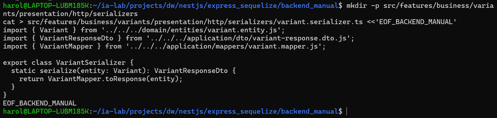

#### 10.3.19 src/features/business/variants/presentation/http/controllers/variants.controller.ts
Controller NestJS para variantes.

```bash
mkdir -p src/features/business/variants/presentation/http/controllers
cat > src/features/business/variants/presentation/http/controllers/variants.controller.ts <<'EOF_BACKEND_MANUAL'
import {
  Body,
  Controller,
  Delete,
  Get,
  HttpCode,
  HttpStatus,
  Param,
  Patch,
  Post,
  Query,
} from '@nestjs/common';
import {
  ApiCreatedResponse,
  ApiNoContentResponse,
  ApiOkResponse,
  ApiOperation,
  ApiTags,
} from '@nestjs/swagger';
import { ParsePositiveIntPipe } from '../../../../../../common/pipes/parse-positive-int.pipe.js';
import { CreateVariantDto } from '../../../application/dto/create-variant.dto.js';
import { UpdateVariantDto } from '../../../application/dto/update-variant.dto.js';
import { VariantFilterDto } from '../../../application/dto/variant-filter.dto.js';
import { VariantResponseDto } from '../../../application/dto/variant-response.dto.js';
import { CreateVariantUseCase } from '../../../application/use-cases/create-variant.use-case.js';
import { UpdateVariantUseCase } from '../../../application/use-cases/update-variant.use-case.js';
import { DeleteVariantUseCase } from '../../../application/use-cases/delete-variant.use-case.js';
import { GetVariantUseCase } from '../../../application/use-cases/get-variant.use-case.js';
import { ListVariantsUseCase } from '../../../application/use-cases/list-variants.use-case.js';

@ApiTags('Variants')
@Controller('variants')
export class VariantsController {
  constructor(
    private readonly createVariantUseCase: CreateVariantUseCase,
    private readonly updateVariantUseCase: UpdateVariantUseCase,
    private readonly deleteVariantUseCase: DeleteVariantUseCase,
    private readonly getVariantUseCase: GetVariantUseCase,
    private readonly listVariantsUseCase: ListVariantsUseCase,
  ) {}

  @Post()
  @ApiOperation({ summary: 'Crear una variante' })
  @ApiCreatedResponse({ type: VariantResponseDto })
  create(@Body() dto: CreateVariantDto) {
    return this.createVariantUseCase.execute(dto);
  }

  @Get()
  @ApiOperation({ summary: 'Listar variantes' })
  @ApiOkResponse({ type: [VariantResponseDto] })
  findAll(@Query() filter: VariantFilterDto) {
    return this.listVariantsUseCase.execute(filter);
  }

  @Get(':id')
  @ApiOperation({ summary: 'Obtener una variante por ID' })
  @ApiOkResponse({ type: VariantResponseDto })
  findOne(@Param('id', ParsePositiveIntPipe) id: number) {
    return this.getVariantUseCase.execute(id);
  }

  @Patch(':id')
  @ApiOperation({ summary: 'Actualizar una variante' })
  @ApiOkResponse({ type: VariantResponseDto })
  update(
    @Param('id', ParsePositiveIntPipe) id: number,
    @Body() dto: UpdateVariantDto,
  ) {
    return this.updateVariantUseCase.execute(id, dto);
  }

  @Delete(':id')
  @HttpCode(HttpStatus.NO_CONTENT)
  @ApiOperation({ summary: 'Eliminar una variante' })
  @ApiNoContentResponse()
  remove(@Param('id', ParsePositiveIntPipe) id: number) {
    return this.deleteVariantUseCase.execute(id);
  }
}
EOF_BACKEND_MANUAL
```
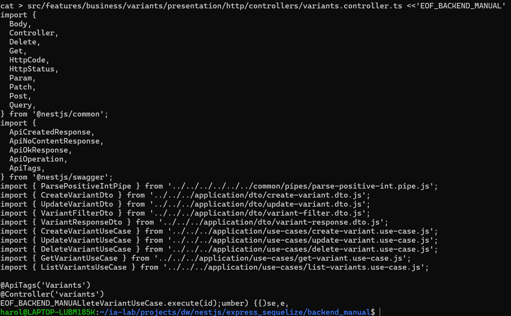

#### 10.3.20 src/features/business/variants/index.ts
Barrel export del módulo Variants.

```bash
mkdir -p src/features/business/variants
cat > src/features/business/variants/index.ts <<'EOF_BACKEND_MANUAL'
export { VariantsModule } from './variants.module.js';
EOF_BACKEND_MANUAL
```
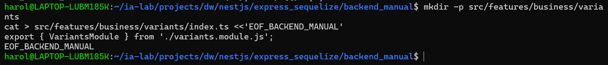

#### 10.3.21 src/features/business/variants/variants.module.ts
Módulo NestJS del feature Variants.

```bash
mkdir -p src/features/business/variants
cat > src/features/business/variants/variants.module.ts <<'EOF_BACKEND_MANUAL'
import { Module } from '@nestjs/common';
import { VARIANT_REPOSITORY } from './domain/interfaces/variant-repository.interface.js';
import { VariantRepository } from './infrastructure/persistence/repositories/variant.repository.js';
import { CreateVariantUseCase } from './application/use-cases/create-variant.use-case.js';
import { UpdateVariantUseCase } from './application/use-cases/update-variant.use-case.js';
import { DeleteVariantUseCase } from './application/use-cases/delete-variant.use-case.js';
import { GetVariantUseCase } from './application/use-cases/get-variant.use-case.js';
import { ListVariantsUseCase } from './application/use-cases/list-variants.use-case.js';
import { VariantsController } from './presentation/http/controllers/variants.controller.js';

@Module({
  controllers: [VariantsController],
  providers: [
    VariantRepository,
    { provide: VARIANT_REPOSITORY, useExisting: VariantRepository },
    CreateVariantUseCase,
    UpdateVariantUseCase,
    DeleteVariantUseCase,
    GetVariantUseCase,
    ListVariantsUseCase,
  ],
  exports: [VARIANT_REPOSITORY],
})
export class VariantsModule {}
EOF_BACKEND_MANUAL
```
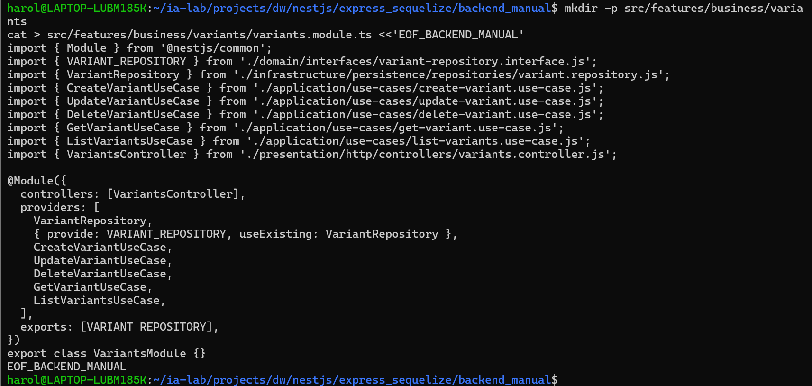

#### 10.3.22 src/infrastructure/database/sequelize/sequelize.factory.ts
Registrar VariantModel en la lista de modelos y relaciones.

```bash
cat > src/infrastructure/database/sequelize/sequelize.factory.ts <<'EOF_BACKEND_MANUAL'
import { Sequelize } from 'sequelize-typescript';
import { ClientModel } from '../../../features/business/clients/infrastructure/persistence/models/client.model.js';
import { CollectionModel } from '../../../features/business/collections/infrastructure/persistence/models/collection.model.js';
import { ProductModel } from '../../../features/business/products/infrastructure/persistence/models/product.model.js';
import { OrderModel } from '../../../features/business/orders/infrastructure/persistence/models/order.model.js';
import { OrderDetailModel } from '../../../features/business/order-details/infrastructure/persistence/models/order-detail.model.js';
import { VariantModel } from '../../../features/business/variants/infrastructure/persistence/models/variant.model.js';

export const ALL_MODELS = [
  ClientModel,
  CollectionModel,
  ProductModel,
  OrderModel,
  OrderDetailModel,
  VariantModel,
];

export async function createSequelizeInstance(options: any): Promise<Sequelize> {
  const sequelize = new Sequelize(options);
  sequelize.addModels(ALL_MODELS);

  ClientModel.hasMany(OrderModel, { foreignKey: 'clientId' });
  OrderModel.belongsTo(ClientModel, { foreignKey: 'clientId' });

  CollectionModel.hasMany(ProductModel, { foreignKey: 'collectionId' });
  ProductModel.belongsTo(CollectionModel, { foreignKey: 'collectionId' });

  ProductModel.hasMany(VariantModel, { foreignKey: 'productId' });
  VariantModel.belongsTo(ProductModel, { foreignKey: 'productId' });

  OrderModel.hasMany(OrderDetailModel, { foreignKey: 'orderId' });
  OrderDetailModel.belongsTo(OrderModel, { foreignKey: 'orderId' });

  ProductModel.hasMany(OrderDetailModel, { foreignKey: 'productId' });
  OrderDetailModel.belongsTo(ProductModel, { foreignKey: 'productId' });

  return sequelize;
}
EOF_BACKEND_MANUAL
```
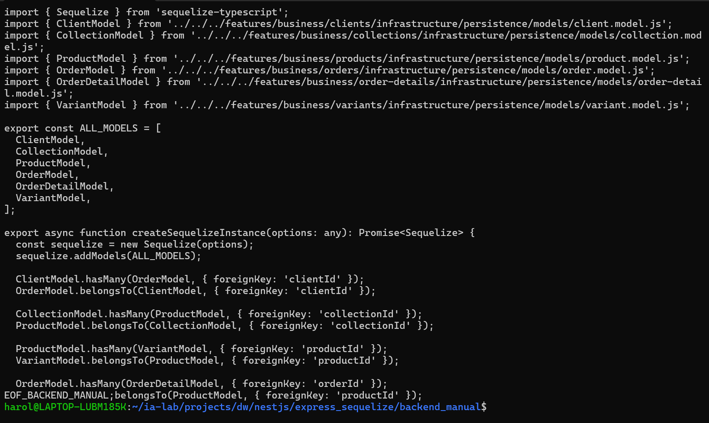

#### 10.3.23 src/features/business/business.module.ts
Agregar VariantsModule al módulo de negocio.

```bash
cat > src/features/business/business.module.ts <<'EOF_BACKEND_MANUAL'
import { Module } from '@nestjs/common';
import { ClientsModule } from './clients/clients.module.js';
import { CollectionsModule } from './collections/collections.module.js';
import { ProductsModule } from './products/products.module.js';
import { OrdersModule } from './orders/orders.module.js';
import { OrderDetailsModule } from './order-details/order-details.module.js';
import { VariantsModule } from './variants/variants.module.js';

@Module({
  imports: [
    ClientsModule,
    CollectionsModule,
    ProductsModule,
    OrdersModule,
    OrderDetailsModule,
    VariantsModule,
  ],
  exports: [
    ClientsModule,
    CollectionsModule,
    ProductsModule,
    OrdersModule,
    OrderDetailsModule,
    VariantsModule,
  ],
})
export class BusinessModule {}
EOF_BACKEND_MANUAL
```
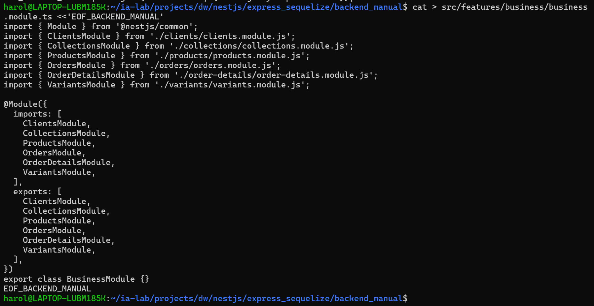

#### 10.3.24 src/infrastructure/database/seeders/database-seeder.service.ts
Ejecutar seedVariants.

```bash
cat > src/infrastructure/database/seeders/database-seeder.service.ts <<'EOF_BACKEND_MANUAL'
import { Injectable } from '@nestjs/common';
import { seedClients } from '../../../features/business/clients/infrastructure/persistence/seeders/clients.seeder.js';
import { seedCollections } from '../../../features/business/collections/infrastructure/persistence/seeders/collections.seeder.js';
import { seedProducts } from '../../../features/business/products/infrastructure/persistence/seeders/products.seeder.js';
import { seedOrders } from '../../../features/business/orders/infrastructure/persistence/seeders/orders.seeder.js';
import { seedOrderDetails } from '../../../features/business/order-details/infrastructure/persistence/seeders/order-details.seeder.js';
import { seedVariants } from '../../../features/business/variants/infrastructure/persistence/seeders/variants.seeder.js';

@Injectable()
export class DatabaseSeederService {
  async runAllSeeders(): Promise<void> {
    await seedClients();
    await seedCollections();
    await seedProducts();
    await seedOrders();
    await seedOrderDetails();
    await seedVariants();
  }
}
EOF_BACKEND_MANUAL
```
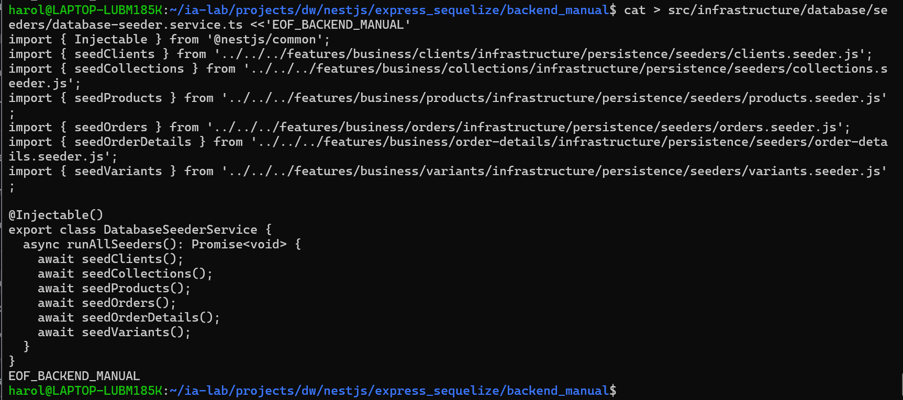

#### 10.3.25 src/features/business/variants/domain/entities/variant.entity.spec.ts
Prueba unitaria de la entidad Variant.

```bash
mkdir -p src/features/business/variants/domain/entities
cat > src/features/business/variants/domain/entities/variant.entity.spec.ts <<'EOF_BACKEND_MANUAL'
import { Variant } from './variant.entity.js';

describe('Variant Entity', () => {
  it('should create a valid variant', () => {
    const variant = Variant.create({
      productId: 1,
      name: 'Talla M',
      description: 'Variante mediana',
    });
    expect(variant.name).toBe('Talla M');
    expect(variant.isActive).toBe(true);
  });

  it('should update variant', () => {
    const variant = Variant.create({
      productId: 1,
      name: 'Talla M',
    });
    variant.update({ name: 'Talla L', isActive: false });
    expect(variant.name).toBe('Talla L');
    expect(variant.isActive).toBe(false);
  });
});
EOF_BACKEND_MANUAL
```
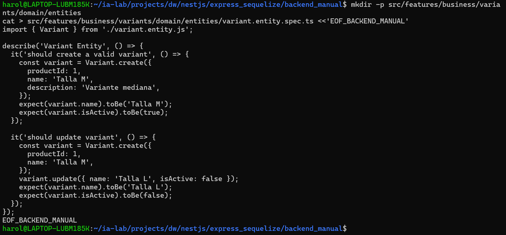

#### 10.3.26 src/features/business/variants/infrastructure/persistence/repositories/variant.repository.spec.ts
Prueba unitaria del repositorio de Variants.

```bash
mkdir -p src/features/business/variants/infrastructure/persistence/repositories
cat > src/features/business/variants/infrastructure/persistence/repositories/variant.repository.spec.ts <<'EOF_BACKEND_MANUAL'
import { VariantRepository } from './variant.repository.js';
import { Variant } from '../../../domain/entities/variant.entity.js';

describe('VariantRepository', () => {
  let repository: VariantRepository;

  beforeEach(() => {
    repository = new VariantRepository();
  });

  it('should create a variant', async () => {
    const variant = Variant.create({
      productId: 1,
      name: 'Talla M',
    });
    const created = await repository.create(variant);
    expect(created.productId).toBe(1);
    expect(created.name).toBe('Talla M');
  });
});
EOF_BACKEND_MANUAL
```


#### 10.3.27 src/features/business/variants/application/use-cases/create-variant.use-case.spec.ts
Prueba unitaria del caso de uso CreateVariantUseCase.

```bash
mkdir -p src/features/business/variants/application/use-cases
cat > src/features/business/variants/application/use-cases/create-variant.use-case.spec.ts <<'EOF_BACKEND_MANUAL'
import { CreateVariantUseCase } from './create-variant.use-case.js';
import { Variant } from '../../domain/entities/variant.entity.js';
import type { IVariantRepository } from '../../domain/interfaces/variant-repository.interface.js';

class MockVariantRepository implements IVariantRepository {
  async create(variant: Variant): Promise<Variant> { return variant; }
  async update(variant: Variant): Promise<Variant> { return variant; }
  async delete(id: number): Promise<void> {}
  async findById(id: number): Promise<Variant | null> { return null; }
  async findAll(): Promise<any> { return { items: [], meta: {} }; }
}

describe('CreateVariantUseCase', () => {
  it('should create a variant', async () => {
    const repo = new MockVariantRepository();
    const useCase = new CreateVariantUseCase(repo as any);
    const result = await useCase.execute({
      productId: 1,
      name: 'Talla M',
    });
    expect(result.productId).toBe(1);
    expect(result.name).toBe('Talla M');
  });
});
EOF_BACKEND_MANUAL
```
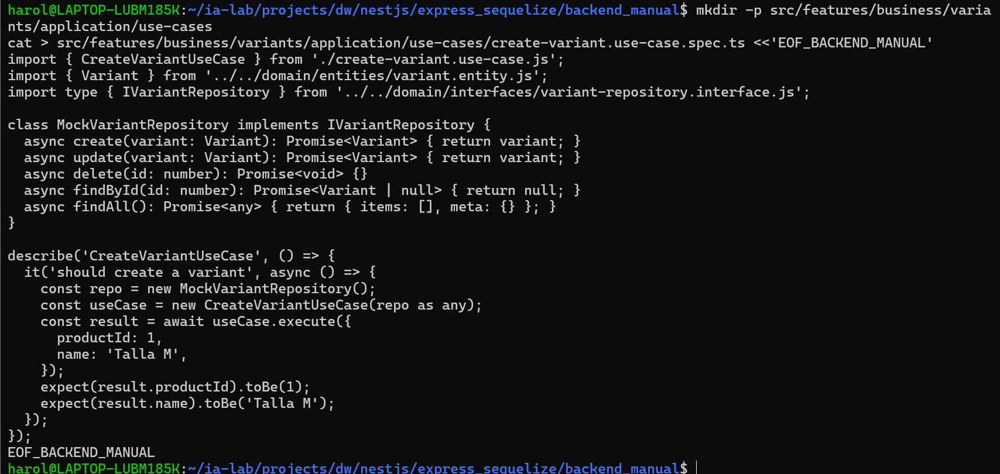

#### 10.3.28 src/features/business/variants/presentation/http/controllers/variants.controller.spec.ts
Prueba unitaria del controller de Variants.

```bash
mkdir -p src/features/business/variants/presentation/http/controllers
cat > src/features/business/variants/presentation/http/controllers/variants.controller.spec.ts <<'EOF_BACKEND_MANUAL'
import { VariantsController } from './variants.controller.js';
import { CreateVariantUseCase } from '../../../application/use-cases/create-variant.use-case.js';

describe('VariantsController', () => {
  it('should call create use case', async () => {
    const mockUseCase = { execute: jest.fn().mockResolvedValue({ id: 1, name: 'Talla M' }) };
    const controller = new VariantsController(
      mockUseCase as any,
      {} as any,
      {} as any,
      {} as any,
      {} as any,
    );
    const result = await controller.create({ productId: 1, name: 'Talla M' });
    expect(result.id).toBe(1);
    expect(result.name).toBe('Talla M');
  });
});
EOF_BACKEND_MANUAL
```
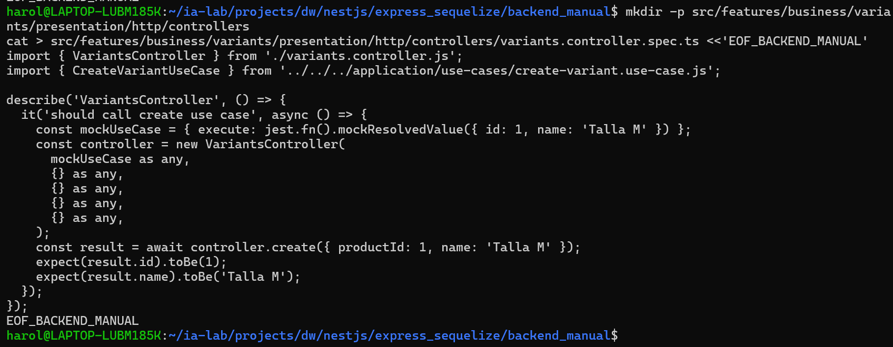

#### 10.3.29 Verificacion de taba 

```bash
npm run start:dev
```
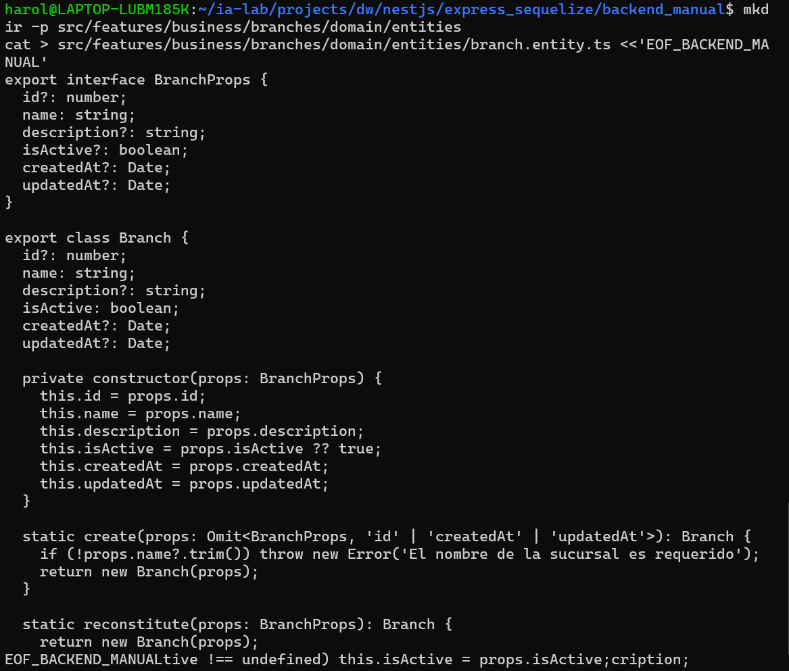

### 10.4.01 src/features/business/branches/domain/entities/branch.entity.ts
Entidad de dominio para sucursales.

```bash
mkdir -p src/features/business/branches/domain/entities
cat > src/features/business/branches/domain/entities/branch.entity.ts <<'EOF_BACKEND_MANUAL'
export interface BranchProps {
  id?: number;
  name: string;
  description?: string;
  isActive?: boolean;
  createdAt?: Date;
  updatedAt?: Date;
}

export class Branch {
  id?: number;
  name: string;
  description?: string;
  isActive: boolean;
  createdAt?: Date;
  updatedAt?: Date;

  private constructor(props: BranchProps) {
    this.id = props.id;
    this.name = props.name;
    this.description = props.description;
    this.isActive = props.isActive ?? true;
    this.createdAt = props.createdAt;
    this.updatedAt = props.updatedAt;
  }

  static create(props: Omit<BranchProps, 'id' | 'createdAt' | 'updatedAt'>): Branch {
    if (!props.name?.trim()) throw new Error('El nombre de la sucursal es requerido');
    return new Branch(props);
  }

  static reconstitute(props: BranchProps): Branch {
    return new Branch(props);
  }

  update(props: Partial<Omit<BranchProps, 'id'>>): void {
    if (props.name !== undefined) this.name = props.name;
    if (props.description !== undefined) this.description = props.description;
    if (props.isActive !== undefined) this.isActive = props.isActive;
  }
}
EOF_BACKEND_MANUAL
```


#### 11.2 src/features/business/branches/domain/exceptions/branch-not-found.exception.ts
Excepción personalizada para sucursales no encontradas.

```bash
mkdir -p src/features/business/branches/domain/exceptions
cat > src/features/business/branches/domain/exceptions/branch-not-found.exception.ts <<'EOF_BACKEND_MANUAL'
import { EntityNotFoundException } from '../../../../../common/exceptions/entity-not-found.exception.js';

export class BranchNotFoundException extends EntityNotFoundException {
  constructor(id: number) {
    super('Sucursal', id);
  }
}
EOF_BACKEND_MANUAL
```
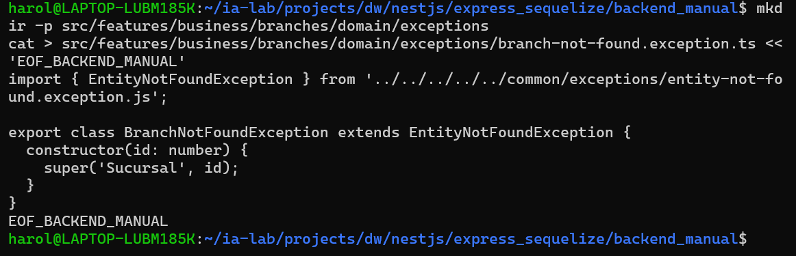

#### 11.3 src/features/business/branches/domain/interfaces/branch-repository.interface.ts
Interfaz del repositorio de sucursales.

```bash
mkdir -p src/features/business/branches/domain/interfaces
cat > src/features/business/branches/domain/interfaces/branch-repository.interface.ts <<'EOF_BACKEND_MANUAL'
import { PaginatedResult } from '../../../../../common/interfaces/pagination.interface.js';
import { Branch } from '../entities/branch.entity.js';

export const BRANCH_REPOSITORY = 'BRANCH_REPOSITORY';

export interface BranchFindAllParams {
  page?: number;
  limit?: number;
  search?: string;
}

export interface IBranchRepository {
  create(branch: Branch): Promise<Branch>;
  update(branch: Branch): Promise<Branch>;
  delete(id: number): Promise<void>;
  findById(id: number): Promise<Branch | null>;
  findAll(params: BranchFindAllParams): Promise<PaginatedResult<Branch>>;
}
EOF_BACKEND_MANUAL
```
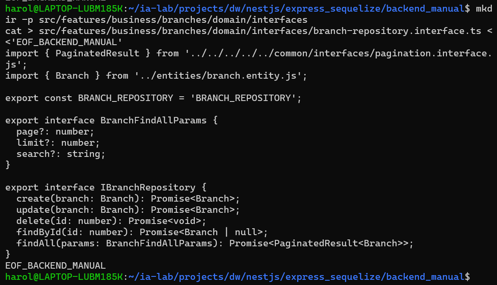

#### src/features/business/branches/infrastructure/persistence/models/branch.model.ts
Modelo Sequelize para la tabla branches.

```bash
mkdir -p src/features/business/branches/infrastructure/persistence/models
cat > src/features/business/branches/infrastructure/persistence/models/branch.model.ts <<'EOF_BACKEND_MANUAL'
import {
  AutoIncrement,
  Column,
  CreatedAt,
  DataType,
  Model,
  PrimaryKey,
  Table,
  UpdatedAt,
} from 'sequelize-typescript';

@Table({ tableName: 'branches' })
export class BranchModel extends Model {
  @PrimaryKey
  @AutoIncrement
  @Column(DataType.INTEGER)
  declare id: number;

  @Column({ type: DataType.STRING(100), allowNull: false })
  declare name: string;

  @Column({ type: DataType.TEXT, allowNull: true })
  declare description: string | null;

  @Column({ type: DataType.BOOLEAN, allowNull: false, defaultValue: true })
  declare isActive: boolean;

  @CreatedAt
  declare createdAt: Date;

  @UpdatedAt
  declare updatedAt: Date;
}
EOF_BACKEND_MANUAL
```
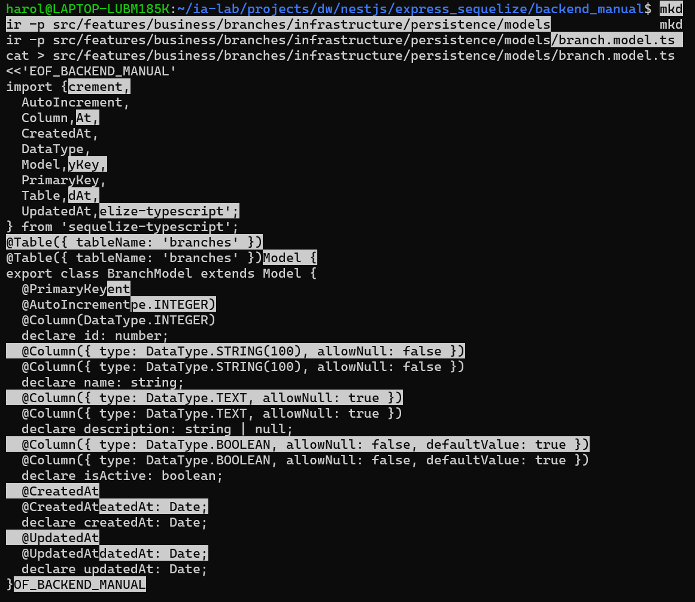

#### src/features/business/branches/infrastructure/persistence/repositories/branch.repository.ts
Repositorio Sequelize para sucursales.

```bash
mkdir -p src/features/business/branches/infrastructure/persistence/repositories
cat > src/features/business/branches/infrastructure/persistence/repositories/branch.repository.ts <<'EOF_BACKEND_MANUAL'
import { Injectable } from '@nestjs/common';
import { Op } from 'sequelize';
import {
  buildPaginatedResult,
  normalizePagination,
} from '../../../../../../common/utils/pagination.util.js';
import { Branch } from '../../../domain/entities/branch.entity.js';
import type { IBranchRepository, BranchFindAllParams } from '../../../domain/interfaces/branch-repository.interface.js';
import { BranchMapper } from '../../../application/mappers/branch.mapper.js';
import { BranchModel } from '../models/branch.model.js';

@Injectable()
export class BranchRepository implements IBranchRepository {
  async create(branch: Branch): Promise<Branch> {
    const model = await BranchModel.create(BranchMapper.toPersistence(branch));
    return BranchMapper.toDomain(model);
  }

  async update(branch: Branch): Promise<Branch> {
    await BranchModel.update(BranchMapper.toPersistence(branch), { where: { id: branch.id } });
    const updated = await BranchModel.findByPk(branch.id!);
    return BranchMapper.toDomain(updated!);
  }

  async delete(id: number): Promise<void> {
    await BranchModel.destroy({ where: { id } });
  }

  async findById(id: number): Promise<Branch | null> {
    const model = await BranchModel.findByPk(id);
    return model ? BranchMapper.toDomain(model) : null;
  }

  async findAll(params: BranchFindAllParams) {
    const { page, limit, offset } = normalizePagination(params.page, params.limit);
    const where: any = {};
    if (params.search) {
      where[Op.or] = [
        { name: { [Op.like]: `%${params.search}%` } },
        { description: { [Op.like]: `%${params.search}%` } },
      ];
    }

    const { rows, count } = await BranchModel.findAndCountAll({
      where,
      limit,
      offset,
      order: [['createdAt', 'DESC']],
    });

    return buildPaginatedResult(
      rows.map((row: BranchModel) => BranchMapper.toDomain(row)),
      count,
      page,
      limit,
    );
  }
}
EOF_BACKEND_MANUAL
```
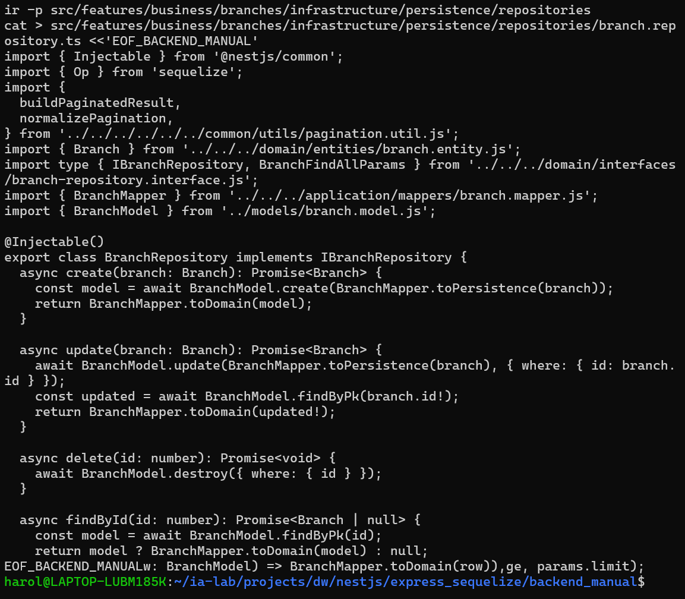

#### src/features/business/branches/infrastructure/persistence/migrations/create-branches-table.migration.ts
Migración documental de la tabla branches.

```bash
mkdir -p src/features/business/branches/infrastructure/persistence/migrations
cat > src/features/business/branches/infrastructure/persistence/migrations/create-branches-table.migration.ts <<'EOF_BACKEND_MANUAL'
export const createBranchesTableMigration = {
  name: 'create-branches-table',
  async up(): Promise<void> {
    // Sequelize sync handles table creation in development.
    // Production: CREATE TABLE branches (id, name, description, isActive, createdAt, updatedAt)
  },
  async down(): Promise<void> {
    // Production: DROP TABLE branches
  },
};
EOF_BACKEND_MANUAL
```
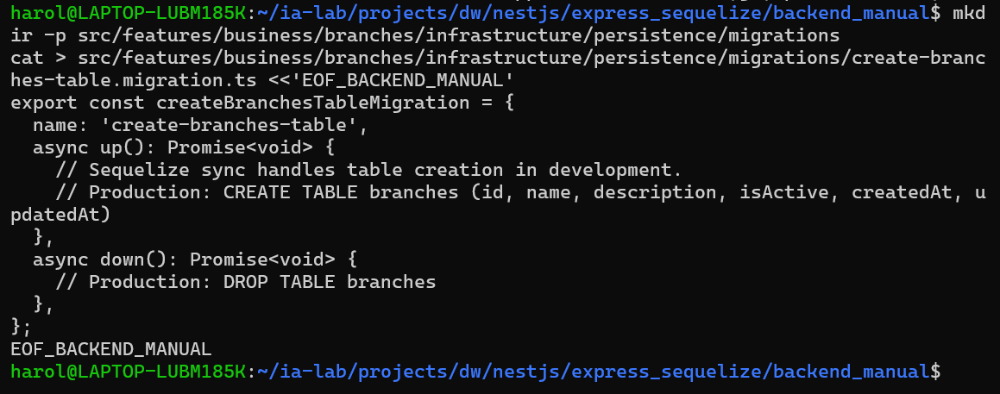

#### src/features/business/branches/infrastructure/persistence/seeders/branches.seeder.ts
Seeder inicial para sucursales.

```bash
mkdir -p src/features/business/branches/infrastructure/persistence/seeders
cat > src/features/business/branches/infrastructure/persistence/seeders/branches.seeder.ts <<'EOF_BACKEND_MANUAL'
import { BranchModel } from '../models/branch.model.js';

export async function seedBranches(): Promise<void> {
  await BranchModel.bulkCreate([
    { name: 'Sucursal Principal', description: 'Sucursal central', isActive: true },
    { name: 'Sucursal Norte', description: 'Sucursal ubicada al norte', isActive: true },
  ]);
}
EOF_BACKEND_MANUAL
```
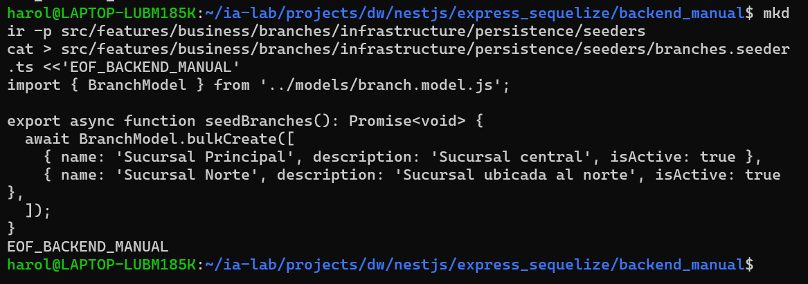

#### src/features/business/branches/application/dto/create-branch.dto.ts
DTO para crear sucursales.

```bash
mkdir -p src/features/business/branches/application/dto
cat > src/features/business/branches/application/dto/create-branch.dto.ts <<'EOF_BACKEND_MANUAL'
import { ApiProperty, ApiPropertyOptional } from '@nestjs/swagger';
import { IsNotEmpty, IsOptional, IsString, MaxLength } from 'class-validator';

export class CreateBranchDto {
  @ApiProperty({ example: 'Sucursal Principal' })
  @IsString()
  @IsNotEmpty()
  @MaxLength(100)
  name: string;

  @ApiPropertyOptional({ example: 'Sucursal central de la empresa' })
  @IsOptional()
  @IsString()
  description?: string;
}
EOF_BACKEND_MANUAL
```
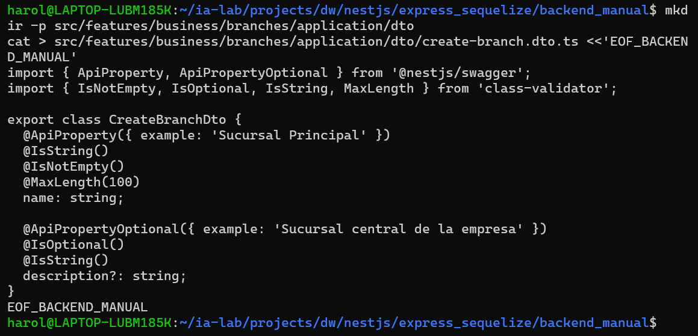

#### src/features/business/branches/application/dto/update-branch.dto.ts
DTO para actualizar sucursales.

```bash
cat > src/features/business/branches/application/dto/update-branch.dto.ts <<'EOF_BACKEND_MANUAL'
import { PartialType } from '@nestjs/mapped-types';
import { CreateBranchDto } from './create-branch.dto.js';

export class UpdateBranchDto extends PartialType(CreateBranchDto) {}
EOF_BACKEND_MANUAL
```
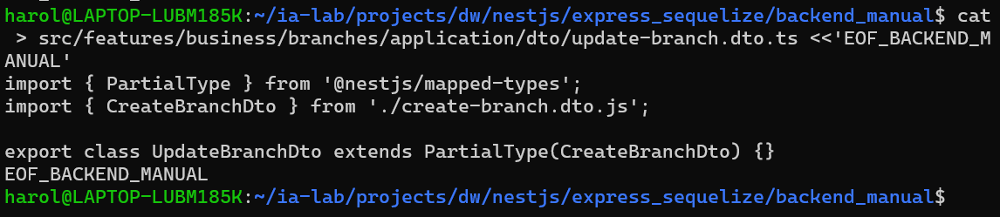

#### src/features/business/branches/application/dto/branch-filter.dto.ts
DTO para filtros de búsqueda y paginación de sucursales.

```bash
cat > src/features/business/branches/application/dto/branch-filter.dto.ts <<'EOF_BACKEND_MANUAL'
import { ApiPropertyOptional } from '@nestjs/swagger';
import { Type } from 'class-transformer';
import { IsInt, IsOptional, IsString, Min } from 'class-validator';

export class BranchFilterDto {
  @ApiPropertyOptional({ example: 1 })
  @IsOptional()
  @Type(() => Number)
  @IsInt()
  @Min(1)
  page?: number;

  @ApiPropertyOptional({ example: 10 })
  @IsOptional()
  @Type(() => Number)
  @IsInt()
  limit?: number;

  @ApiPropertyOptional({ example: 'Sucursal' })
  @IsOptional()
  @IsString()
  search?: string;
}
EOF_BACKEND_MANUAL
```
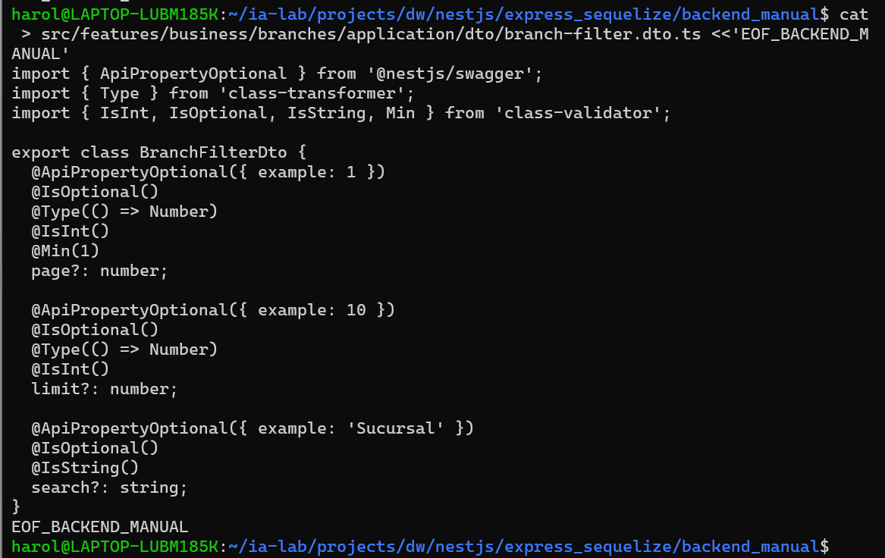

#### src/features/business/branches/application/dto/branch-response.dto.ts
DTO de salida para respuestas HTTP de sucursales.

```bash
cat > src/features/business/branches/application/dto/branch-response.dto.ts <<'EOF_BACKEND_MANUAL'
import { ApiProperty, ApiPropertyOptional } from '@nestjs/swagger';

export class BranchResponseDto {
  @ApiProperty({ example: 1 })
  id: number;

  @ApiProperty({ example: 'Sucursal Principal' })
  name: string;

  @ApiPropertyOptional({ example: 'Sucursal central de la empresa' })
  description?: string;

  @ApiProperty({ example: true })
  isActive: boolean;

  @ApiProperty()
  createdAt: Date;

  @ApiProperty()
  updatedAt: Date;
}
EOF_BACKEND_MANUAL
```

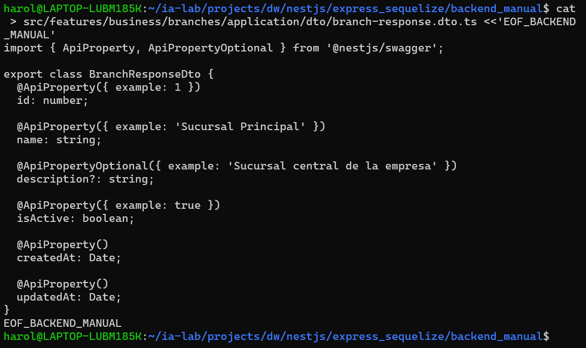

#### src/features/business/branches/application/mappers/branch.mapper.ts
Mapper entre entidad, modelo Sequelize y DTO de respuesta.

```bash
mkdir -p src/features/business/branches/application/mappers
cat > src/features/business/branches/application/mappers/branch.mapper.ts <<'EOF_BACKEND_MANUAL'
import { Branch } from '../../domain/entities/branch.entity.js';
import { BranchResponseDto } from '../dto/branch-response.dto.js';
import { BranchModel } from '../../infrastructure/persistence/models/branch.model.js';

export class BranchMapper {
  static toDomain(model: BranchModel): Branch {
    return Branch.reconstitute({
      id: model.id,
      name: model.name,
      description: model.description ?? undefined,
      isActive: model.isActive,
      createdAt: model.createdAt,
      updatedAt: model.updatedAt,
    });
  }

  static toResponse(entity: Branch): BranchResponseDto {
    return {
      id: entity.id!,
      name: entity.name,
      description: entity.description,
      isActive: entity.isActive,
      createdAt: entity.createdAt!,
      updatedAt: entity.updatedAt!,
    };
  }

  static toPersistence(entity: Branch): Partial<BranchModel> {
    return {
      id: entity.id,
      name: entity.name,
      description: entity.description ?? null,
      isActive: entity.isActive,
    };
  }
}
EOF_BACKEND_MANUAL
```
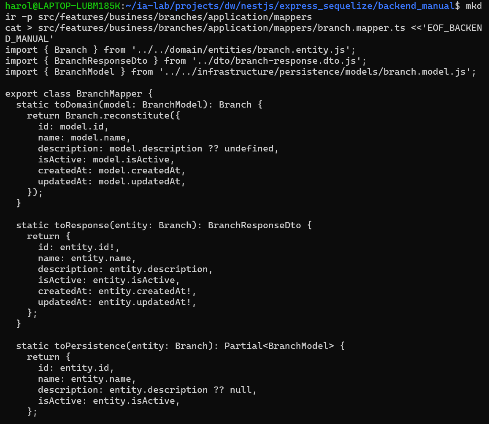

#### src/features/business/branches/application/use-cases/create-branch.use-case.ts
Caso de uso para crear sucursales.

```bash
mkdir -p src/features/business/branches/application/use-cases
cat > src/features/business/branches/application/use-cases/create-branch.use-case.ts <<'EOF_BACKEND_MANUAL'
import { Inject, Injectable } from '@nestjs/common';
import { Branch } from '../../domain/entities/branch.entity.js';
import type { IBranchRepository } from '../../domain/interfaces/branch-repository.interface.js';
import { BRANCH_REPOSITORY } from '../../domain/interfaces/branch-repository.interface.js';
import { CreateBranchDto } from '../dto/create-branch.dto.js';
import { BranchMapper } from '../mappers/branch.mapper.js';

@Injectable()
export class CreateBranchUseCase {
  constructor(
    @Inject(BRANCH_REPOSITORY)
    private readonly branchRepository: IBranchRepository,
  ) {}

  async execute(dto: CreateBranchDto) {
    const branch = Branch.create(dto);
    const created = await this.branchRepository.create(branch);
    return BranchMapper.toResponse(created);
  }
}
EOF_BACKEND_MANUAL
```
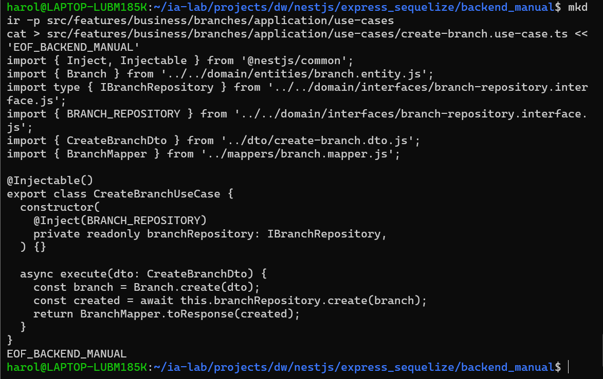

#### src/features/business/branches/application/use-cases/update-branch.use-case.ts
Caso de uso para actualizar sucursales.

```bash
cat > src/features/business/branches/application/use-cases/update-branch.use-case.ts <<'EOF_BACKEND_MANUAL'
import { Inject, Injectable } from '@nestjs/common';
import { BranchNotFoundException } from '../../domain/exceptions/branch-not-found.exception.js';
import type { IBranchRepository } from '../../domain/interfaces/branch-repository.interface.js';
import { BRANCH_REPOSITORY } from '../../domain/interfaces/branch-repository.interface.js';
import { UpdateBranchDto } from '../dto/update-branch.dto.js';
import { BranchMapper } from '../mappers/branch.mapper.js';

@Injectable()
export class UpdateBranchUseCase {
  constructor(
    @Inject(BRANCH_REPOSITORY)
    private readonly branchRepository: IBranchRepository,
  ) {}

  async execute(id: number, dto: UpdateBranchDto) {
    const branch = await this.branchRepository.findById(id);
    if (!branch) throw new BranchNotFoundException(id);

    branch.update(dto);
    const updated = await this.branchRepository.update(branch);
    return BranchMapper.toResponse(updated);
  }
}
EOF_BACKEND_MANUAL
```
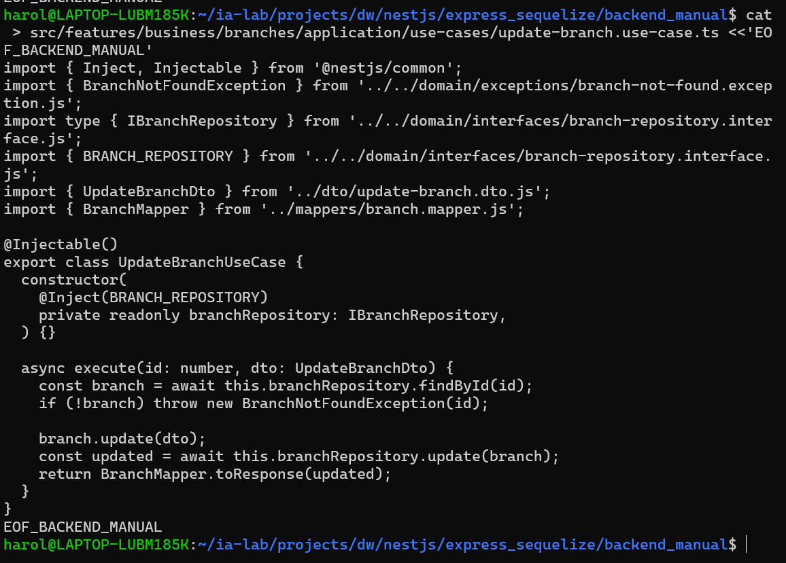

#### src/features/business/branches/application/use-cases/delete-branch.use-case.ts
Caso de uso para eliminar sucursales.

```bash
cat > src/features/business/branches/application/use-cases/delete-branch.use-case.ts <<'EOF_BACKEND_MANUAL'
import { Inject, Injectable } from '@nestjs/common';
import { BranchNotFoundException } from '../../domain/exceptions/branch-not-found.exception.js';
import type { IBranchRepository } from '../../domain/interfaces/branch-repository.interface.js';
import { BRANCH_REPOSITORY } from '../../domain/interfaces/branch-repository.interface.js';

@Injectable()
export class DeleteBranchUseCase {
  constructor(
    @Inject(BRANCH_REPOSITORY)
    private readonly branchRepository: IBranchRepository,
  ) {}

  async execute(id: number): Promise<void> {
    const branch = await this.branchRepository.findById(id);
    if (!branch) throw new BranchNotFoundException(id);
    await this.branchRepository.delete(id);
  }
}
EOF_BACKEND_MANUAL
```
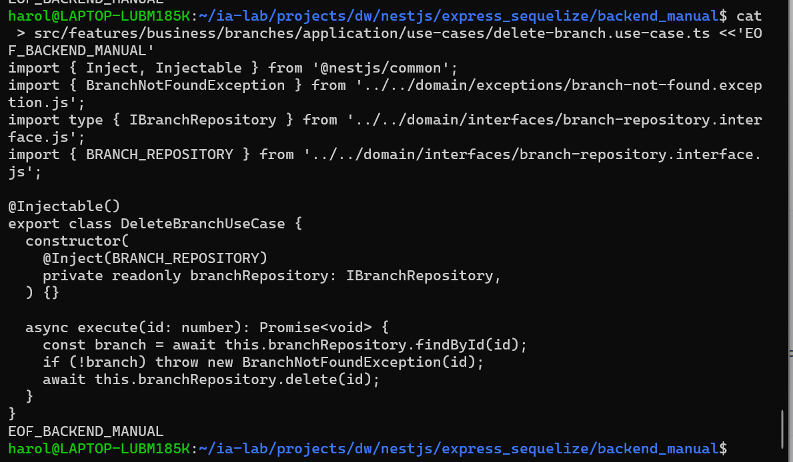

#### src/features/business/branches/application/use-cases/get-branch.use-case.ts
Caso de uso para obtener una sucursal por ID.

```bash
cat > src/features/business/branches/application/use-cases/get-branch.use-case.ts <<'EOF_BACKEND_MANUAL'
import { Inject, Injectable } from '@nestjs/common';
import { BranchNotFoundException } from '../../domain/exceptions/branch-not-found.exception.js';
import type { IBranchRepository } from '../../domain/interfaces/branch-repository.interface.js';
import { BRANCH_REPOSITORY } from '../../domain/interfaces/branch-repository.interface.js';
import { BranchMapper } from '../mappers/branch.mapper.js';

@Injectable()
export class GetBranchUseCase {
  constructor(
    @Inject(BRANCH_REPOSITORY)
    private readonly branchRepository: IBranchRepository,
  ) {}

  async execute(id: number) {
    const branch = await this.branchRepository.findById(id);
    if (!branch) throw new BranchNotFoundException(id);
    return BranchMapper.toResponse(branch);
  }
}
EOF_BACKEND_MANUAL
```
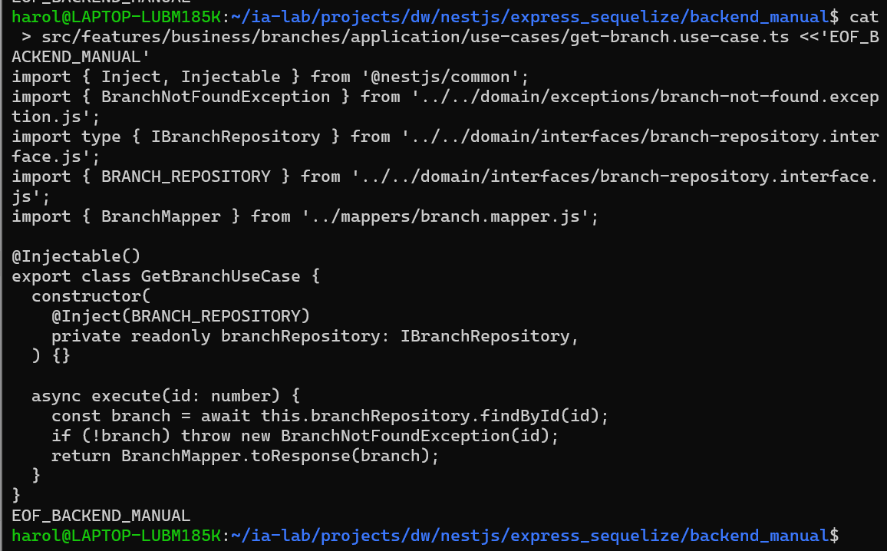

#### 11.17 src/features/business/branches/application/use-cases/list-branches.use-case.ts
Caso de uso para listar sucursales con filtros y paginación.

```bash
cat > src/features/business/branches/application/use-cases/list-branches.use-case.ts <<'EOF_BACKEND_MANUAL'
import { Inject, Injectable } from '@nestjs/common';
import type { IBranchRepository } from '../../domain/interfaces/branch-repository.interface.js';
import { BRANCH_REPOSITORY } from '../../domain/interfaces/branch-repository.interface.js';
import { BranchFilterDto } from '../dto/branch-filter.dto.js';
import { BranchMapper } from '../mappers/branch.mapper.js';
import { Branch } from '../../domain/entities/branch.entity.js';

@Injectable()
export class ListBranchesUseCase {
  constructor(
    @Inject(BRANCH_REPOSITORY)
    private readonly branchRepository: IBranchRepository,
  ) {}

  async execute(filter: BranchFilterDto) {
    const result = await this.branchRepository.findAll(filter);
    return {
      items: result.items.map((b: Branch) => BranchMapper.toResponse(b)),
      meta: result.meta,
    };
  }
}
EOF_BACKEND_MANUAL
```
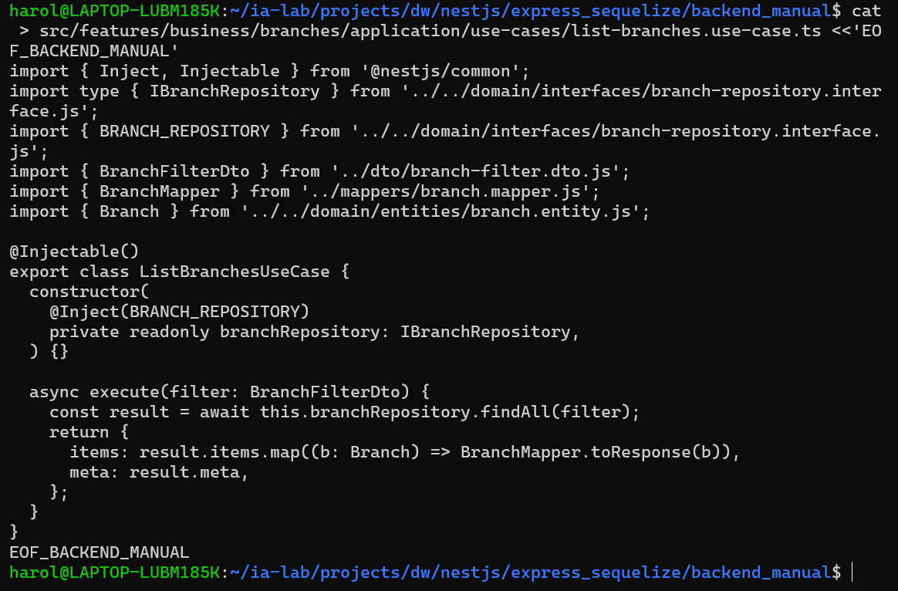

#### src/features/business/branches/presentation/http/serializers/branch.serializer.ts
Serializer para respuestas HTTP de sucursales.

```bash
mkdir -p src/features/business/branches/presentation/http/serializers
cat > src/features/business/branches/presentation/http/serializers/branch.serializer.ts <<'EOF_BACKEND_MANUAL'
import { Branch } from '../../../domain/entities/branch.entity.js';
import { BranchResponseDto } from '../../../application/dto/branch-response.dto.js';
import { BranchMapper } from '../../../application/mappers/branch.mapper.js';

export class BranchSerializer {
  static serialize(entity: Branch): BranchResponseDto {
    return BranchMapper.toResponse(entity);
  }
}
EOF_BACKEND_MANUAL
``` 
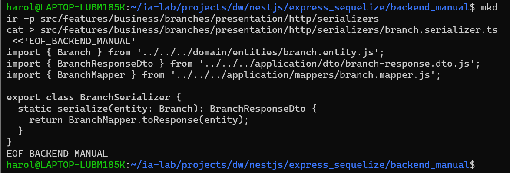

#### src/features/business/branches/presentation/http/controllers/branches.controller.ts
Controller NestJS para sucursales.

```bash
mkdir -p src/features/business/branches/presentation/http/controllers
cat > src/features/business/branches/presentation/http/controllers/branches.controller.ts <<'EOF_BACKEND_MANUAL'
import {
  Body,
  Controller,
  Delete,
  Get,
  HttpCode,
  HttpStatus,
  Param,
  Patch,
  Post,
  Query,
} from '@nestjs/common';
import {
  ApiCreatedResponse,
  ApiNoContentResponse,
  ApiOkResponse,
  ApiOperation,
  ApiTags,
} from '@nestjs/swagger';
import { ParsePositiveIntPipe } from '../../../../../../common/pipes/parse-positive-int.pipe.js';
import { CreateBranchDto } from '../../../application/dto/create-branch.dto.js';
import { UpdateBranchDto } from '../../../application/dto/update-branch.dto.js';
import { BranchFilterDto } from '../../../application/dto/branch-filter.dto.js';
import { BranchResponseDto } from '../../../application/dto/branch-response.dto.js';
import { CreateBranchUseCase } from '../../../application/use-cases/create-branch.use-case.js';
import { UpdateBranchUseCase } from '../../../application/use-cases/update-branch.use-case.js';
import { DeleteBranchUseCase } from '../../../application/use-cases/delete-branch.use-case.js';
import { GetBranchUseCase } from '../../../application/use-cases/get-branch.use-case.js';
import { ListBranchesUseCase } from '../../../application/use-cases/list-branches.use-case.js';

@ApiTags('Branches')
@Controller('branches')
export class BranchesController {
  constructor(
    private readonly createBranchUseCase: CreateBranchUseCase,
    private readonly updateBranchUseCase: UpdateBranchUseCase,
    private readonly deleteBranchUseCase: DeleteBranchUseCase,
    private readonly getBranchUseCase: GetBranchUseCase,
    private readonly listBranchesUseCase: ListBranchesUseCase,
  ) {}

  @Post()
  @ApiOperation({ summary: 'Crear una sucursal' })
  @ApiCreatedResponse({ type: BranchResponseDto })
  create(@Body() dto: CreateBranchDto) {
    return this.createBranchUseCase.execute(dto);
  }

  @Get()
  @ApiOperation({ summary: 'Listar sucursales' })
  @ApiOkResponse({ type: [BranchResponseDto] })
  findAll(@Query() filter: BranchFilterDto) {
    return this.listBranchesUseCase.execute(filter);
  }

  @Get(':id')
  @ApiOperation({ summary: 'Obtener una sucursal por ID' })
  @ApiOkResponse({ type: BranchResponseDto })
  findOne(@Param('id', ParsePositiveIntPipe) id: number) {
    return this.getBranchUseCase.execute(id);
  }

  @Patch(':id')
  @ApiOperation({ summary: 'Actualizar una sucursal' })
  @ApiOkResponse({ type: BranchResponseDto })
  update(
    @Param('id', ParsePositiveIntPipe) id: number,
    @Body() dto: UpdateBranchDto,
  ) {
    return this.updateBranchUseCase.execute(id, dto);
  }

  @Delete(':id')
  @HttpCode(HttpStatus.NO_CONTENT)
  @ApiOperation({ summary: 'Eliminar una sucursal' })
  @ApiNoContentResponse()
  remove(@Param('id', ParsePositiveIntPipe) id: number) {
    return this.deleteBranchUseCase.execute(id);
  }
}
EOF_BACKEND_MANUAL
```
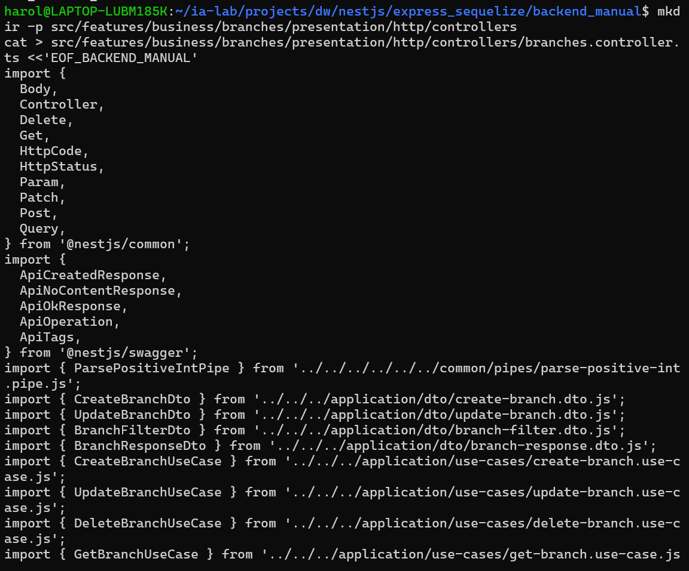

#### src/features/business/branches/index.ts
Barrel export del módulo Branches.

```bash
mkdir -p src/features/business/branches
cat > src/features/business/branches/index.ts <<'EOF_BACKEND_MANUAL'
export { BranchesModule } from './branches.module.js';
EOF_BACKEND_MANUA
```

#### src/features/business/branches/index.ts
Barrel export del módulo Branches.

```bash
mkdir -p src/features/business/branches
cat > src/features/business/branches/index.ts <<'EOF_BACKEND_MANUAL'
export { BranchesModule } from './branches.module.js';
EOF_BACKEND_MANUAL
```
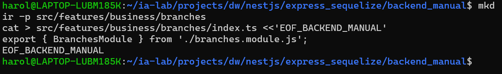

#### 11.21 src/features/business/branches/branches.module.ts
Módulo NestJS del feature Branches.

```bash
cat > src/features/business/branches/branches.module.ts <<'EOF_BACKEND_MANUAL'
import { Module } from '@nestjs/common';
import { BRA`NCH_REPOSITORY } from './domain/interfaces/branch-repository.interface.js';
import { BranchRepository } from './infrastructure/persistence/repositories/branch.repository.js';
import { CreateBranchUseCase } from './application/use-cases/create-branch.use-case.js';
import { UpdateBranchUseCase } from './application/use-cases/update-branch.use-case.js';
import { DeleteBranchUseCase } from './application/use-cases/delete-branch.use-case.js';
import { GetBranchUseCase } from './application/use-cases/get-branch.use-case.js';
import { ListBranchesUseCase } from './application/use-cases/list-branches.use-case.js';
import { BranchesController } from './presentation/http/controllers/branches.controller.js';

@Module({
  controllers: [BranchesController],
  providers: [
    BranchRepository,
    { provide: BRANCH_REPOSITORY, useExisting: BranchRepository },
    CreateBranchUseCase,
    UpdateBranchUseCase,
    DeleteBranchUseCase,
    GetBranchUseCase,
    ListBranchesUseCase,
  ],
  exports: [BRANCH_REPOSITORY],
})
export class BranchesModule {}
EOF_BACKEND_MANUAL
```
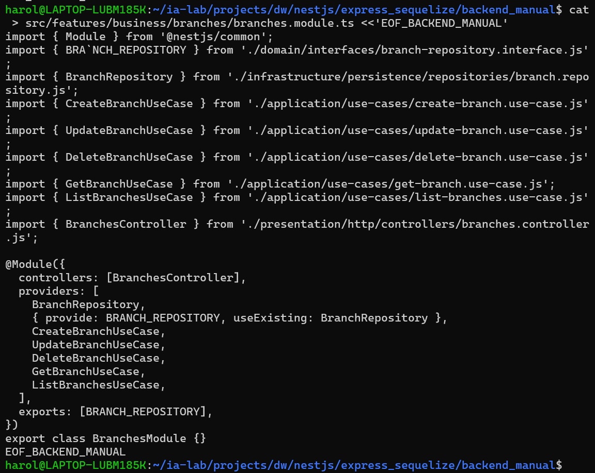

#### src/infrastructure/database/seeders/database-seeder.service.ts
Ejecutar seedBranches.

```baash 
import { Module } from '@nestjs/common';
import { ClientsModule } from './clients/clients.module.js';
import { CollectionsModule } from './collections/collections.module.js';
import { ProductsModule } from './products/products.module.js';
import { OrdersModule } from './orders/orders.module.js';
import { OrderDetailsModule } from './order-details/order-details.module.js';
import { VariantsModule } from './variants/variants.module.js';

@Module({
  imports: [
    ClientsModule,
    CollectionsModule,
    ProductsModule,
    OrdersModule,
    OrderDetailsModule,
    VariantsModule,
  ],
  exports: [
    ClientsModule,
    CollectionsModule,
    ProductsModule,
    OrdersModule,
    OrderDetailsModule,
    VariantsModule,
  ],
})
export class BusinessModule {} 
```

#### src/features/business/branches/domain/entities/branch.entity.spec.ts
Prueba unitaria de la entidad Branch.

```bash
mkdir -p src/features/business/branches/domain/entities
cat > src/features/business/branches/domain/entities/branch.entity.spec.ts <<'EOF_BACKEND_MANUAL'
import { Branch } from './branch.entity.js';

describe('Branch Entity', () => {
  it('should create a valid branch', () => {
    const branch = Branch.create({ name: 'Sucursal Principal' });
    expect(branch.name).toBe('Sucursal Principal');
    expect(branch.isActive).toBe(true);
  });

  it('should update branch', () => {
    const branch = Branch.create({ name: 'Sucursal Principal' });
    branch.update({ name: 'Sucursal Norte', isActive: false });
    expect(branch.name).toBe('Sucursal Norte');
    expect(branch.isActive).toBe(false);
  });
});
EOF_BACKEND_MANUAL
```
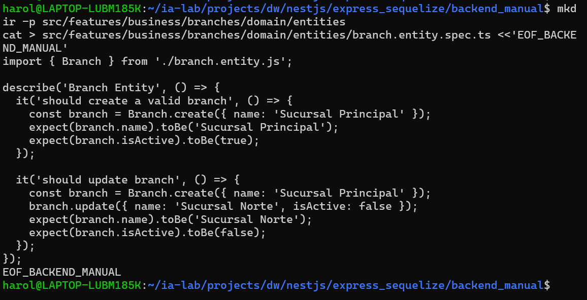

#### src/features/business/branches/infrastructure/persistence/repositories/branch.repository.spec.ts
Prueba unitaria del repositorio Branches.

```bash
mkdir -p src/features/business/branches/infrastructure/persistence/repositories
cat > src/features/business/branches/infrastructure/persistence/repositories/branch.repository.spec.ts <<'EOF_BACKEND_MANUAL'
import { BranchRepository } from './branch.repository.js';
import { Branch } from '../../../domain/entities/branch.entity.js';

describe('BranchRepository', () => {
  let repository: BranchRepository;

  beforeEach(() => {
    repository = new BranchRepository();
  });

  it('should create a branch', async () => {
    const branch = Branch.create({ name: 'Sucursal Principal' });
    const created = await repository.create(branch);
    expect(created.name).toBe('Sucursal Principal');
  });
});
EOF_BACKEND_MANUAL
```
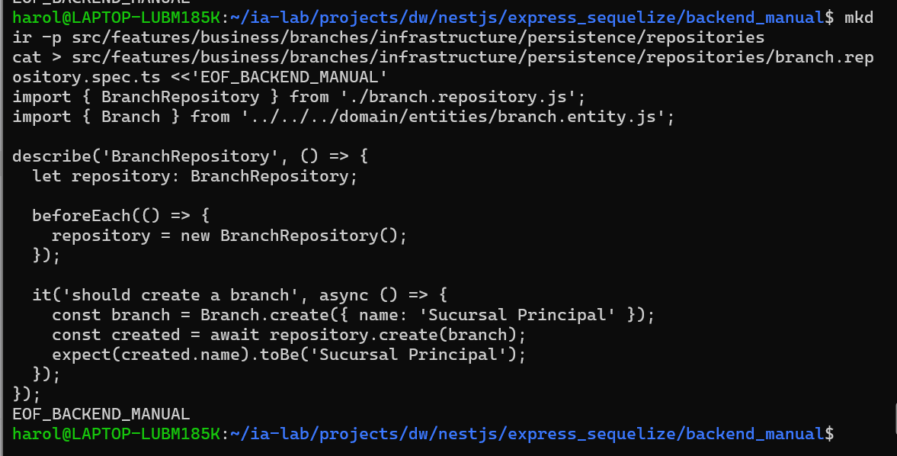

#### src/features/business/branches/application/use-cases/create-branch.use-case.spec.ts
Prueba unitaria del caso de uso CreateBranchUseCase.

```bash
mkdir -p src/features/business/branches/application/use-cases
cat > src/features/business/branches/application/use-cases/create-branch.use-case.spec.ts <<'EOF_BACKEND_MANUAL'
import { CreateBranchUseCase } from './create-branch.use-case.js';
import { Branch } from '../../domain/entities/branch.entity.js';
import type { IBranchRepository } from '../../domain/interfaces/branch-repository.interface.js';

class MockBranchRepository implements IBranchRepository {
  async create(branch: Branch): Promise<Branch> { return branch; }
  async update(branch: Branch): Promise<Branch> { return branch; }
  async delete(id: number): Promise<void> {}
  async findById(id: number): Promise<Branch | null> { return null; }
  async findAll(): Promise<any> { return { items: [], meta: {} }; }
}

describe('CreateBranchUseCase', () => {
  it('should create a branch', async () => {
    const repo = new MockBranchRepository();
    const useCase = new CreateBranchUseCase(repo as any);
    const result = await useCase.execute({ name: 'Sucursal Principal' });
    expect(result.name).toBe('Sucursal Principal');
  });
});
EOF_BACKEND_MANUAL
```
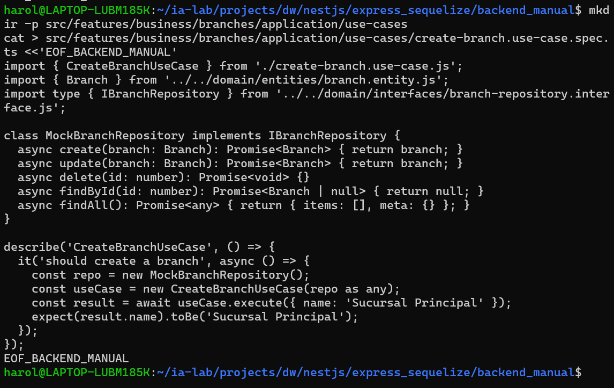