# documentacion actividad parcial

## FASE 1 — `00_BASE_INIT_NESTJS`

#### 1.1 — Crear carpetas padre y permisos

Prepara la ruta de trabajo en WSL. Los permisos evitan fallos de escritura del CLI.

```bash
mkdir -p /home/portatiljq/apps/dlloweb/nestjs/express_sequelize
chmod -R 755 /home/portatiljq/apps/dlloweb/nestjs/express_sequelize
```


#### 1.2 — Instalar Nest CLI (si no existe)

El CLI genera `main.ts`, `app.module.ts`, `tsconfig`, scripts npm, etc.

```bash
npm install -g @nestjs/cli
nest --version
```

#### 1.3 — Crear proyecto NestJS

Usamos el nombre `backend_ia` (workspace didáctico). Responde las preguntas del CLI (package manager: npm).

```bash
cd /home/portatiljq/apps/dlloweb/nestjs/express_sequelize
nest new backend_ia
cd backend_ia
```


#### 1.4 — Crear `.env` mínimo (puerto)

El puerto `3002` evita choques con el 3000. Más adelante el `.env` crecerá con BD y JWT.

```bash
cat > .env <<'EOF_BACKEND_IA'
PORT=3002
NODE_ENV=development
EOF_BACKEND_IA
```


#### 1.5 — Commit inicial del esqueleto

Congela el punto de partida reproducible.

```bash
git init
git add .
git commit -m "chore: inicialización del proyecto NestJS"
```

------------------------------------------------------------------------

## FASE 2 — `01_BASE_DEPS_Y_PUERTO`

### Dependencias + manejo de puerto (EADDRINUSE)

> **Objetivo de la fase:** Instalar el stack profesional y evitar que un `start:dev` colgado bloquee el puerto.

#### 2.1 — Dependencias de producción

Config, Swagger, JWT/Passport, Sequelize + drivers de 4 motores, validación, bcrypt y utilidades HTTP.

```bash
 yarn add @nestjs/config @nestjs/swagger @nestjs/jwt @nestjs/passport @nestjs/mapped-types \
  passport passport-jwt sequelize sequelize-typescript mysql2 pg tedious oracledb \
  class-validator class-transformer bcrypt reflect-metadata express compression helmet
```


#### 2.2 — Dependencias de desarrollo

Tipados y sequelize-cli para herramientas de BD.

```bash
yarn add -D @types/bcrypt @types/passport-jwt sequelize-cli
```


#### 2.3 — Script para liberar puerto (evita EADDRINUSE)

Si reinicias Nest sin matar el proceso anterior, Node lanza `listen EADDRINUSE`. Este script lee `PORT` del `.env` y libera el puerto en Linux/WSL.

```bash
mkdir -p scripts
cat > scripts/free-port.js <<'EOF_BACKEND_IA'
/**
 * Libera el puerto configurado en .env (PORT) antes de arrancar Nest.
 * Evita EADDRINUSE cuando queda una instancia previa de start:dev.
 */
const { execSync } = require('child_process');
const fs = require('fs');
const path = require('path');

function readPortFromEnv() {
  const envPath = path.join(__dirname, '..', '.env');
  let port = 3002;

  if (fs.existsSync(envPath)) {
    const content = fs.readFileSync(envPath, 'utf8');
    const match = content.match(/^\s*PORT\s*=\s*(\d+)\s*$/m);
    if (match) {
      port = parseInt(match[1], 10);
    }
  }

  if (process.env.PORT) {
    port = parseInt(process.env.PORT, 10) || port;
  }

  return port;
}

function freePort(port) {
  try {
    // Linux/WSL: mata el proceso que escucha en el puerto
    execSync(`fuser -k ${port}/tcp`, { stdio: 'ignore' });
    console.log(`✅ Puerto ${port} liberado`);
  } catch {
    // No había proceso escuchando: ok
    console.log(`ℹ️  Puerto ${port} disponible`);
  }
}

const port = readPortFromEnv();
freePort(port);
EOF_BACKEND_IA
```


#### 2.4 — Actualizar scripts npm en package.json

Integra `free:port` en `start:dev` / `start:debug`. Aplica el cambio con Node para no editar JSON a mano.

```bash
node <<'EOF_BACKEND_IA'
const fs = require('fs');
const pkg = JSON.parse(fs.readFileSync('package.json', 'utf8'));
pkg.scripts = {
  ...pkg.scripts,
  'free:port': 'node scripts/free-port.js',
  'start:dev': 'npm run free:port && nest start --watch',
  'start:debug': 'npm run free:port && nest start --debug --watch',
};
fs.writeFileSync('package.json', JSON.stringify(pkg, null, 2) + '\n');
console.log('✅ package.json scripts actualizados');
EOF_BACKEND_IA
```


#### 2.5 — Verificar arranque base

Debe levantar el Hello World de Nest en el puerto del `.env`.

```bash
npm run start:dev
# Ctrl+C cuando veas el log de arranque
curl -s http://localhost:3002 || true
```
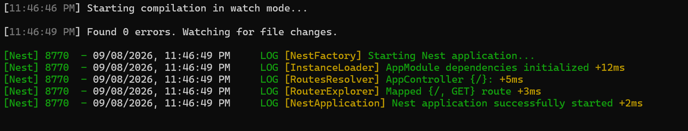

## FASE 3 — `02_BASE_ESTRUCTURA_CA`

### Estructura de carpetas Clean Architecture

> **Objetivo de la fase:** Crear el mapa mental: config / common / infrastructure / features (business + auth).

#### 3.1 — Crear árbol base de carpetas

Aún no hay código de dominio. Solo directorios y módulos vacíos de features para anclar imports futuros.

```bash
mkdir -p src/config/{app,database,environment,jwt,logger,swagger}
mkdir -p src/common/{constants,decorators,enums,exceptions,filters,guards,interceptors,interfaces,pipes,types,utils,validators}
mkdir -p src/infrastructure/database/{sequelize,migrations,seeders}
mkdir -p src/infrastructure/{logging,security/hashing,security/tokens}
mkdir -p src/features/business/{clients,product-types,products,sales}/{application/{dto,mappers,use-cases},domain/{entities,enums,exceptions,interfaces,services,validators},infrastructure/persistence/{models,repositories,migrations,seeders},presentation/http/{controllers,decorators,serializers,swagger},tests}
mkdir -p src/features/auth/{users,roles,role-users,resources,resource-roles,refresh-tokens}/{application/{dto,mappers,use-cases},domain/{entities,enums,exceptions,interfaces,services,validators},infrastructure/persistence/{models,repositories,migrations,seeders},presentation/http/{controllers,decorators,serializers,swagger},tests}
mkdir -p src/features/auth/authentication/{application/{dto,mappers,use-cases},domain/{entities,enums,exceptions,interfaces,services,validators},infrastructure/{jwt,password},presentation/http/{controllers,decorators,serializers,swagger},tests}
mkdir -p src/features/auth/infrastructure/database
cat > src/features/business/business.module.ts <<'EOF_BACKEND_IA'
import { Module } from '@nestjs/common';

@Module({
  imports: [],
  exports: [],
})
export class BusinessModule {}
EOF_BACKEND_IA
cat > src/features/auth/auth.module.ts <<'EOF_BACKEND_IA'
import { Module } from '@nestjs/common';

@Module({
  imports: [],
  exports: [],
})
export class AuthModule {}
EOF_BACKEND_IA
```

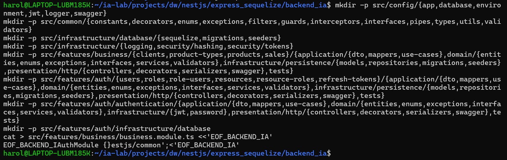

#### 3.2 — Recordatorio de responsabilidades

| Carpeta | Responsabilidad |
|---------|------------------|
| `config/` | Cómo se configura la app (env, jwt, swagger) |
| `common/` | Piezas transversales reutilizables |
| `infrastructure/` | Detalles técnicos (Sequelize, bcrypt, JWT) |
| `features/*` | Dominios (business/auth) con CA interna |

**Error típico:** poner `@Table` de Sequelize dentro de `domain/entities`.

## FASE 4 — `03_BASE_ENTORNO_ENV`

### Configuración del entorno tipado (multi-base)

> **Objetivo de la fase:** Centralizar variables en `.env`: selector `DB_DIALECT` y un bloque de credenciales por motor (MySQL, PostgreSQL, SQL Server, Oracle). Validar antes del boot.

#### 4.1 — Crear `.env.example` y actualizar `.env` completo

El `.env` real NO se sube a Git. Usa BD dedicada `tecnogua_ia`.

**Contrato multi-base (igual que `docs/Prompt.md`):**
- `DB_DIALECT` = `mysql` | `postgres` | `mssql` | `oracle` (elige qué motor corre).
- MySQL: `DB_MYSQL_HOST`, `DB_MYSQL_PORT`, `DB_MYSQL_USERNAME`, `DB_MYSQL_PASSWORD`, `DB_MYSQL_NAME`.
- PostgreSQL: `DB_POSTGRES_*` (puerto lab 5432).
- SQL Server: `DB_MSSQL_*` (puerto lab 1433, usuario `sa`).
- Oracle: `DB_ORACLE_*` + `DB_ORACLE_CONNECT_STRING` (puerto lab 1521).
- Para cambiar de motor, cambia **solo** `DB_DIALECT`. No uses `DB_HOST` / `DB_USERNAME` genéricos.

```bash
cat > .env.example <<'EOF_BACKEND_IA'
# ==========================================
# APP
# ==========================================
PORT=3002
NODE_ENV=development

# ==========================================
# DATABASE
# ==========================================
# Selector del motor en ejecución (un solo valor):
# mysql | postgres | mssql | oracle
DB_DIALECT=mysql

# --- MYSQL ---
DB_MYSQL_HOST=localhost
DB_MYSQL_PORT=3306
DB_MYSQL_USERNAME=root
DB_MYSQL_PASSWORD=root
DB_MYSQL_NAME=tecnogua_ia

# --- POSTGRES ---
DB_POSTGRES_HOST=localhost
DB_POSTGRES_PORT=5432
DB_POSTGRES_USERNAME=postgres
DB_POSTGRES_PASSWORD=postgres
DB_POSTGRES_NAME=tecnogua_ia

# --- MSSQL (SQL Server) ---
DB_MSSQL_HOST=localhost
DB_MSSQL_PORT=1433
DB_MSSQL_USERNAME=sa
DB_MSSQL_PASSWORD=YourStrong@Passw0rd
DB_MSSQL_NAME=tecnogua_ia

# --- ORACLE ---
DB_ORACLE_HOST=localhost
DB_ORACLE_PORT=1521
DB_ORACLE_USERNAME=system
DB_ORACLE_PASSWORD=oracle
DB_ORACLE_NAME=tecnogua_ia
DB_ORACLE_CONNECT_STRING=localhost:1521/XEPDB1

# ==========================================
# JWT (pista completa; el guion simple no implementa login)
# ==========================================
JWT_SECRET=lab-jwt-secret-tecnogua-ia
JWT_EXPIRES_IN=1d
JWT_REFRESH_SECRET=lab-jwt-refresh-tecnogua-ia
JWT_REFRESH_EXPIRES_IN=7d
EOF_BACKEND_IA
```

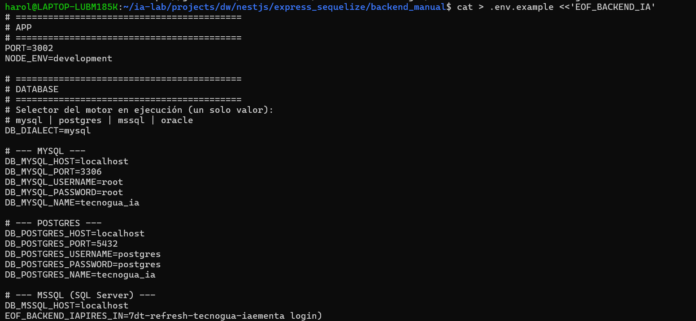

```bash
cp .env.example .env
# Laboratorio: DB_DIALECT + un bloque por motor (MYSQL/POSTGRES/MSSQL/ORACLE).
# Cambia solo el bloque del motor que uses. Mantén DB_*_NAME=tecnogua_ia
```

#### 4.2 — Interface de entorno

Tipos TypeScript de las variables de entorno (APP, DB, JWT) y enum de dialectos.

**Archivo:** `src/config/environment/env.interface.ts`

```bash
mkdir -p src/config/environment
cat > src/config/environment/env.interface.ts <<'EOF_BACKEND_MANUAL'
export enum Environment {
  Development = 'development',
  Production = 'production',
  Test = 'test',
}

export enum DatabaseDialect {
  MySQL = 'mysql',
  Postgres = 'postgres',
  MSSQL = 'mssql',
  Oracle = 'oracle',
}

export interface AppConfig {
  port: number;
  nodeEnv: Environment;
}

export interface DatabaseConfig {
  dialect: DatabaseDialect;
  host: string;
  port: number;
  username: string;
  password: string;
  database: string;
  connectString?: string;
}

export interface JwtConfig {
  secret: string;
  expiresIn: string;
  refreshSecret: string;
  refreshExpiresIn: string;
}

export interface EnvironmentConfig {
  app: AppConfig;
  database: DatabaseConfig;
  jwt: JwtConfig;
}
EOF_BACKEND_IA
```
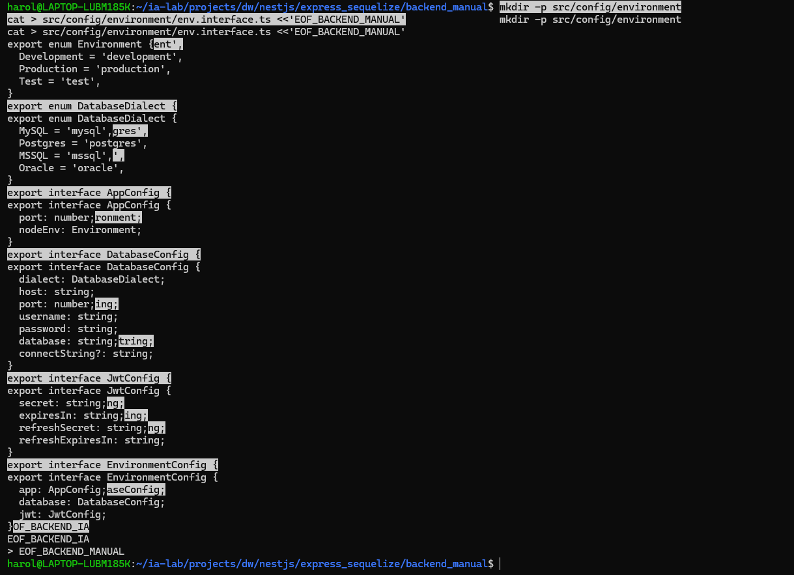

#### 4.3 — Validación de entorno con class-validator

Si falta JWT_SECRET o DB_DIALECT es inválido, o el bloque del motor activo está vacío, el boot falla con mensaje claro.

**Archivo:** `src/config/environment/env.validation.ts`

```bash
mkdir -p src/config/environment
cat > src/config/environment/env.validation.ts <<'EOF_BACKEND_MANUAL'
import { plainToInstance } from 'class-transformer';
import {
  IsEnum,
  IsNumber,
  IsOptional,
  IsString,
  Max,
  Min,
  validateSync,
} from 'class-validator';
import {
  assertActiveDialectCredentials,
  resolveDialectCredentials,
} from './db-env';
import { DatabaseDialect, Environment } from './env.interface';

export class EnvironmentVariables {
  @IsEnum(Environment)
  @IsOptional()
  NODE_ENV: Environment = Environment.Development;

  @IsNumber()
  @Min(0)
  @Max(65535)
  @IsOptional()
  PORT: number = 3002;

  @IsEnum(DatabaseDialect)
  DB_DIALECT: DatabaseDialect;

  @IsString()
  @IsOptional()
  DB_MYSQL_HOST?: string;

  @IsNumber()
  @IsOptional()
  DB_MYSQL_PORT?: number;

  @IsString()
  @IsOptional()
  DB_MYSQL_USERNAME?: string;

  @IsString()
  @IsOptional()
  DB_MYSQL_PASSWORD?: string;

  @IsString()
  @IsOptional()
  DB_MYSQL_NAME?: string;

  @IsString()
  @IsOptional()
  DB_POSTGRES_HOST?: string;

  @IsNumber()
  @IsOptional()
  DB_POSTGRES_PORT?: number;

  @IsString()
  @IsOptional()
  DB_POSTGRES_USERNAME?: string;

  @IsString()
  @IsOptional()
  DB_POSTGRES_PASSWORD?: string;

  @IsString()
  @IsOptional()
  DB_POSTGRES_NAME?: string;

  @IsString()
  @IsOptional()
  DB_MSSQL_HOST?: string;

  @IsNumber()
  @IsOptional()
  DB_MSSQL_PORT?: number;

  @IsString()
  @IsOptional()
  DB_MSSQL_USERNAME?: string;

  @IsString()
  @IsOptional()
  DB_MSSQL_PASSWORD?: string;

  @IsString()
  @IsOptional()
  DB_MSSQL_NAME?: string;

  @IsString()
  @IsOptional()
  DB_ORACLE_HOST?: string;

  @IsNumber()
  @IsOptional()
  DB_ORACLE_PORT?: number;

  @IsString()
  @IsOptional()
  DB_ORACLE_USERNAME?: string;

  @IsString()
  @IsOptional()
  DB_ORACLE_PASSWORD?: string;

  @IsString()
  @IsOptional()
  DB_ORACLE_NAME?: string;

  @IsString()
  @IsOptional()
  DB_ORACLE_CONNECT_STRING?: string;

  @IsString()
  JWT_SECRET: string;

  @IsString()
  @IsOptional()
  JWT_EXPIRES_IN: string = '1d';

  @IsString()
  JWT_REFRESH_SECRET: string;

  @IsString()
  @IsOptional()
  JWT_REFRESH_EXPIRES_IN: string = '7d';
}

function formatValidationErrors(
  errors: ReturnType<typeof validateSync>,
): string {
  return errors
    .map((error) => {
      const constraints = error.constraints
        ? Object.values(error.constraints).join(', ')
        : 'valor inválido';
      return `${error.property}: ${constraints}`;
    })
    .join('; ');
}

export function validate(config: Record<string, unknown>): EnvironmentVariables {
  const validatedConfig = plainToInstance(EnvironmentVariables, config, {
    enableImplicitConversion: true,
    exposeDefaultValues: true,
  });

  const errors = validateSync(validatedConfig, {
    skipMissingProperties: false,
  });

  if (errors.length > 0) {
    throw new Error(
      `Error de configuración: variable(s) crítica(s) inválida(s) o ausente(s). ${formatValidationErrors(errors)}. Copia .env.example a .env y completa el bloque del motor elegido (DB_DIALECT).`,
    );
  }

  assertActiveDialectCredentials(resolveDialectCredentials(validatedConfig));

  return validatedConfig;
}
EOF_BACKEND_IA
```

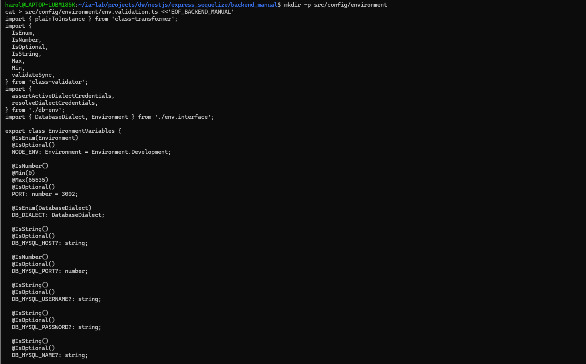

#### 4.4 — Resolver de credenciales por motor

Lee el bloque DB_MYSQL_* / DB_POSTGRES_* / DB_MSSQL_* / DB_ORACLE_* según DB_DIALECT.

**Archivo:** `src/config/environment/db-env.ts`

```bash
mkdir -p src/config/environment
cat > src/config/environment/db-env.ts <<'EOF_BACKEND_MANUAL'
import { DatabaseConfig, DatabaseDialect } from './env.interface';

export const DEFAULT_DB_PORTS: Record<DatabaseDialect, number> = {
  [DatabaseDialect.MySQL]: 3306,
  [DatabaseDialect.Postgres]: 5432,
  [DatabaseDialect.MSSQL]: 1433,
  [DatabaseDialect.Oracle]: 1521,
};

export type DialectEnvSource = {
  DB_DIALECT: DatabaseDialect;
  DB_MYSQL_HOST?: string;
  DB_MYSQL_PORT?: string | number;
  DB_MYSQL_USERNAME?: string;
  DB_MYSQL_PASSWORD?: string;
  DB_MYSQL_NAME?: string;
  DB_POSTGRES_HOST?: string;
  DB_POSTGRES_PORT?: string | number;
  DB_POSTGRES_USERNAME?: string;
  DB_POSTGRES_PASSWORD?: string;
  DB_POSTGRES_NAME?: string;
  DB_MSSQL_HOST?: string;
  DB_MSSQL_PORT?: string | number;
  DB_MSSQL_USERNAME?: string;
  DB_MSSQL_PASSWORD?: string;
  DB_MSSQL_NAME?: string;
  DB_ORACLE_HOST?: string;
  DB_ORACLE_PORT?: string | number;
  DB_ORACLE_USERNAME?: string;
  DB_ORACLE_PASSWORD?: string;
  DB_ORACLE_NAME?: string;
  DB_ORACLE_CONNECT_STRING?: string;
};

function toPort(value: string | number | undefined, fallback: number): number {
  if (typeof value === 'number' && Number.isFinite(value)) {
    return value;
  }
  if (typeof value === 'string' && value.trim() !== '') {
    const parsed = parseInt(value, 10);
    if (Number.isFinite(parsed)) {
      return parsed;
    }
  }
  return fallback;
}

function text(value: string | undefined): string {
  return value?.trim() ?? '';
}

export function resolveDialectCredentials(
  env: DialectEnvSource,
): DatabaseConfig {
  const dialect = env.DB_DIALECT;
  const port = DEFAULT_DB_PORTS[dialect];

  switch (dialect) {
    case DatabaseDialect.MySQL:
      return {
        dialect,
        host: text(env.DB_MYSQL_HOST),
        port: toPort(env.DB_MYSQL_PORT, port),
        username: text(env.DB_MYSQL_USERNAME),
        password: text(env.DB_MYSQL_PASSWORD),
        database: text(env.DB_MYSQL_NAME),
      };
    case DatabaseDialect.Postgres:
      return {
        dialect,
        host: text(env.DB_POSTGRES_HOST),
        port: toPort(env.DB_POSTGRES_PORT, port),
        username: text(env.DB_POSTGRES_USERNAME),
        password: text(env.DB_POSTGRES_PASSWORD),
        database: text(env.DB_POSTGRES_NAME),
      };
    case DatabaseDialect.MSSQL:
      return {
        dialect,
        host: text(env.DB_MSSQL_HOST),
        port: toPort(env.DB_MSSQL_PORT, port),
        username: text(env.DB_MSSQL_USERNAME),
        password: text(env.DB_MSSQL_PASSWORD),
        database: text(env.DB_MSSQL_NAME),
      };
    case DatabaseDialect.Oracle:
      return {
        dialect,
        host: text(env.DB_ORACLE_HOST),
        port: toPort(env.DB_ORACLE_PORT, port),
        username: text(env.DB_ORACLE_USERNAME),
        password: text(env.DB_ORACLE_PASSWORD),
        database: text(env.DB_ORACLE_NAME),
        connectString: text(env.DB_ORACLE_CONNECT_STRING) || undefined,
      };
    default:
      throw new Error(
        `Error de configuración: DB_DIALECT inválido. Use mysql, postgres, mssql u oracle.`,
      );
  }
}

export function assertActiveDialectCredentials(config: DatabaseConfig): void {
  const prefix: Record<DatabaseDialect, string> = {
    [DatabaseDialect.MySQL]: 'DB_MYSQL',
    [DatabaseDialect.Postgres]: 'DB_POSTGRES',
    [DatabaseDialect.MSSQL]: 'DB_MSSQL',
    [DatabaseDialect.Oracle]: 'DB_ORACLE',
  };
  const tag = prefix[config.dialect];
  const missing: string[] = [];

  if (!config.host) missing.push(`${tag}_HOST`);
  if (!config.username) missing.push(`${tag}_USERNAME`);
  if (!config.database) missing.push(`${tag}_NAME`);
  if (config.dialect === DatabaseDialect.Oracle && !config.connectString) {
    missing.push('DB_ORACLE_CONNECT_STRING');
  }

  if (missing.length > 0) {
    throw new Error(
      `Error de configuración: variable(s) crítica(s) inválida(s) o ausente(s) para ${config.dialect}: ${missing.join(', ')}. Completa el bloque de ese motor en .env (no commitees secretos).`,
    );
  }
}
EOF_BACKEND_MANUAL
```
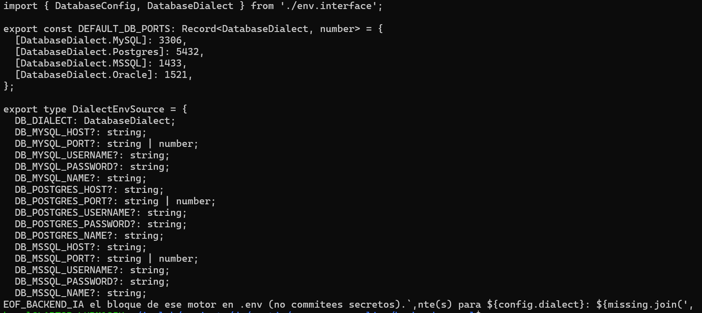

#### 4.5 — Factory registerAs de entorno

Expone `environment.*` vía ConfigService (`registerAs`).

**Archivo:** `src/config/environment/env.config.ts`

```bash
mkdir -p src/config/environment
cat > src/config/environment/env.config.ts <<'EOF_BACKEND_MANUAL'
import { registerAs } from '@nestjs/config';
import { resolveDialectCredentials } from './db-env';
import { Environment } from './env.interface';
import { validate } from './env.validation';

export const ENV_CONFIG_NAME = 'environment';

export const envConfig = registerAs(ENV_CONFIG_NAME, () => {
  const validated = validate(process.env);

  return {
    app: {
      port: validated.PORT,
      nodeEnv: validated.NODE_ENV ?? Environment.Development,
    },
    database: resolveDialectCredentials(validated),
    jwt: {
      secret: validated.JWT_SECRET,
      expiresIn: validated.JWT_EXPIRES_IN,
      refreshSecret: validated.JWT_REFRESH_SECRET,
      refreshExpiresIn: validated.JWT_REFRESH_EXPIRES_IN,
    },
  };
});
EOF_BACKEND_MANUAL
```
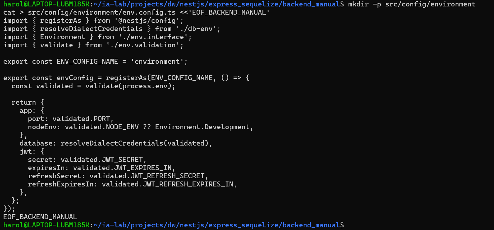

------------------------------------------------------------------------

## FASE 5 — `04_BASE_DATABASE_SEQUELIZE`

### Base de datos multi-dialecto (Sequelize)

> **Objetivo de la fase:** Conectar Sequelize al motor de `DB_DIALECT` usando el bloque `DB_MYSQL_*` / `DB_POSTGRES_*` / `DB_MSSQL_*` / `DB_ORACLE_*`. Aún sin features (ALL_MODELS vacío).

#### 5.1 — Constante SEQUELIZE_TOKEN

Token DI para inyectar la instancia Sequelize en repositorios.

**Archivo:** `src/common/constants/database.constants.ts`

```bash
mkdir -p src/common/constants
cat > src/common/constants/database.constants.ts <<'EOF_BACKEND_MANUAL'
export const SEQUELIZE_TOKEN = 'SEQUELIZE';
EOF_BACKEND_MANUAL
```
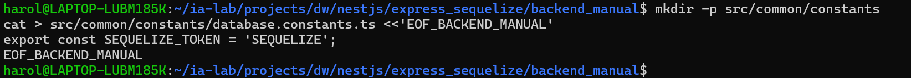

#### 5.2 — Tipos auxiliares de database config

Tipos auxiliares del bloque config/database (legado/compat).

**Archivo:** `src/config/database/database.types.ts`

```bash
mkdir -p src/config/database
cat > src/config/database/database.types.ts <<'EOF_BACKEND_MANUAL'
import { Options as SequelizeOptions } from 'sequelize';

export type DialectOptions =
  | { dialect: 'mysql'; options?: SequelizeOptions }
  | { dialect: 'postgres'; options?: SequelizeOptions }
  | { dialect: 'mssql'; options?: SequelizeOptions }
  | { dialect: 'oracle'; options?: SequelizeOptions };
EOF_BACKEND_MANUAL
```
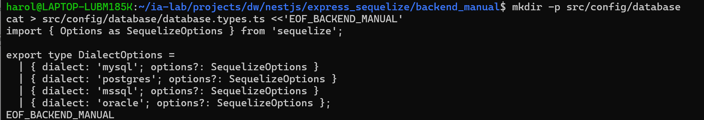

#### 5.3 — database.config.ts

Factory registerAs opcional para namespace `database` (complementa environment).

**Archivo:** `src/config/database/database.config.ts`

```bash
mkdir -p src/config/database
cat > src/config/database/database.config.ts <<'EOF_BACKEND_MANUAL'
import { registerAs } from '@nestjs/config';
import { resolveDialectCredentials } from '../environment/db-env';
import { DatabaseDialect } from '../environment/env.interface';

export const DATABASE_CONFIG_NAME = 'database';

const dialectModuleMap: Record<DatabaseDialect, string> = {
  [DatabaseDialect.MySQL]: 'mysql2',
  [DatabaseDialect.Postgres]: 'pg',
  [DatabaseDialect.MSSQL]: 'tedious',
  [DatabaseDialect.Oracle]: 'oracledb',
};

export const databaseConfig = registerAs(DATABASE_CONFIG_NAME, () => {
  const dialect =
    (process.env.DB_DIALECT as DatabaseDialect) || DatabaseDialect.MySQL;
  const credentials = resolveDialectCredentials({
    DB_DIALECT: dialect,
    ...process.env,
  });

  return {
    ...credentials,
    dialectModulePath: dialectModuleMap[dialect],
    autoLoadModels: true,
    synchronize: process.env.NODE_ENV !== 'production',
    logging: process.env.NODE_ENV === 'development' ? console.log : false,
  };
});
EOF_BACKEND_MANUAL
```
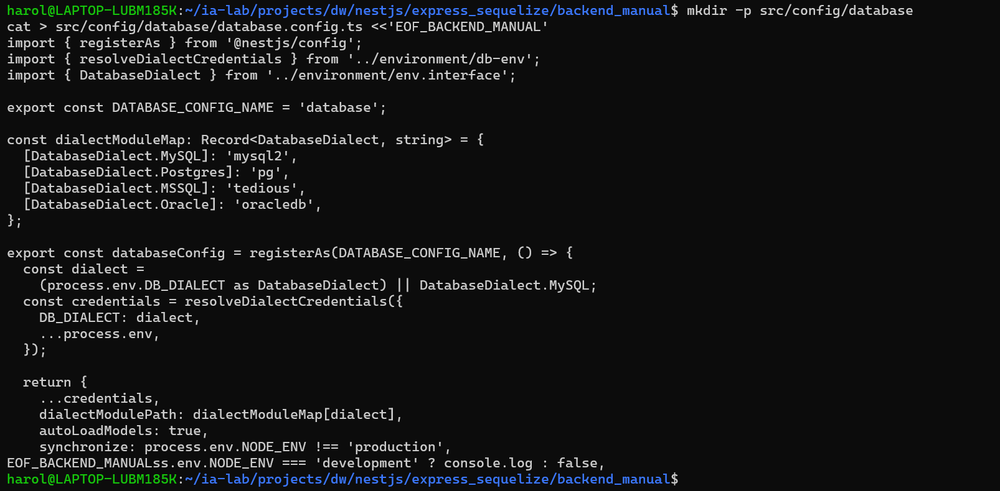

#### 5.4 — database.module.ts / providers

Módulo de configuración de BD (forFeature). Los providers quedan vacíos a propósito.

**Archivo:** `src/config/database/database.module.ts`

```bash
mkdir -p src/config/database
cat > src/config/database/database.module.ts <<'EOF_BACKEND_MANUAL'
import { Module } from '@nestjs/common';
import { ConfigModule } from '@nestjs/config';
import { databaseConfig } from './database.config';

@Module({
  imports: [ConfigModule.forFeature(databaseConfig)],
  exports: [ConfigModule],
})
export class DatabaseConfigModule {}
EOF_BACKEND_MANUAL
```
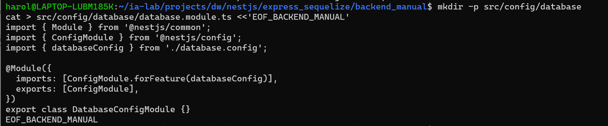

#### 5.5 — database.providers.ts

Placeholder de providers de config/database.

**Archivo:** `src/config/database/database.providers.ts`

```bash
mkdir -p src/config/database
cat > src/config/database/database.providers.ts <<'EOF_BACKEND_MANUAL'
export const DATABASE_PROVIDERS = [];
EOF_BACKEND_MANUAL
```
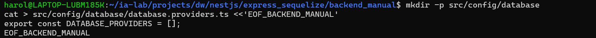

#### 5.6 — Opciones Sequelize por dialecto

Arma host/port/user/password/logging con el bloque del motor seleccionado por DB_DIALECT.

**Archivo:** `src/infrastructure/database/sequelize/sequelize.options.ts`

```bash
mkdir -p src/infrastructure/database/sequelize
cat > src/infrastructure/database/sequelize/sequelize.options.ts <<'EOF_BACKEND_MANUAL'
import { SequelizeOptions } from 'sequelize-typescript';
import { resolveDialectCredentials } from '../../../config/environment/db-env';
import { DatabaseDialect } from '../../../config/environment/env.interface';

export function getSequelizeOptions(
  dialect: DatabaseDialect,
): Partial<SequelizeOptions> {
  const credentials = resolveDialectCredentials({
    DB_DIALECT: dialect,
    ...process.env,
  });

  const base: SequelizeOptions = {
    dialect: dialect as SequelizeOptions['dialect'],
    host: credentials.host,
    port: credentials.port,
    username: credentials.username,
    password: credentials.password,
    database: credentials.database,
    logging: process.env.NODE_ENV === 'development' ? console.log : false,
    define: {
      underscored: false,
      freezeTableName: true,
    },
  };

  switch (dialect) {
    case DatabaseDialect.MSSQL:
      return {
        ...base,
        dialectOptions: {
          options: {
            encrypt: true,
            trustServerCertificate: true,
          },
        },
      };
    case DatabaseDialect.Oracle:
      return {
        ...base,
        dialectOptions: {
          connectString: credentials.connectString,
        },
      };
    default:
      return base;
  }
}
EOF_BACKEND_MANUAL
```
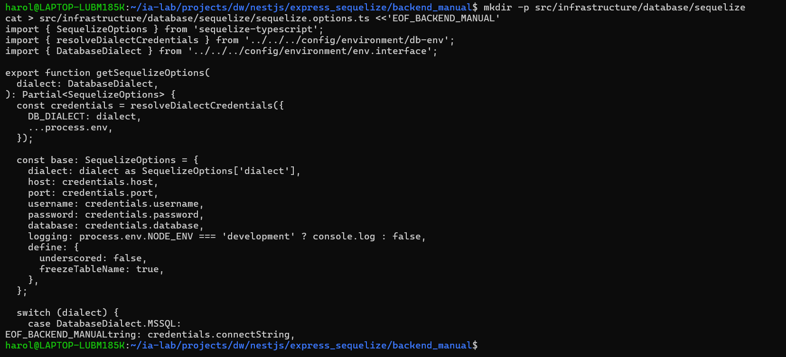

#### 5.7 — Factory Sequelize (sin modelos aún)

Crea la instancia Sequelize. `ALL_MODELS` empieza vacío: se llena al crear cada entidad.

**Archivo:** `src/infrastructure/database/sequelize/sequelize.factory.ts`

```bash
mkdir -p src/infrastructure/database/sequelize
cat > src/infrastructure/database/sequelize/sequelize.factory.ts <<'EOF_BACKEND_MANUAL'
import { Sequelize } from 'sequelize-typescript';
import { DatabaseDialect } from '../../../config/environment/env.interface';
import { getSequelizeOptions } from './sequelize.options';


export const ALL_MODELS = [
  // (aún sin modelos — se agregan por feature)
];

export async function createSequelizeInstance(
  dialect: DatabaseDialect,
): Promise<Sequelize> {
  const options = getSequelizeOptions(dialect);

  let dialectModule: any;

  switch (dialect) {
    case DatabaseDialect.MySQL:
      dialectModule = require('mysql2');
      break;
    case DatabaseDialect.Postgres:
      dialectModule = require('pg');
      break;
    case DatabaseDialect.MSSQL:
      dialectModule = require('tedious');
      break;
    case DatabaseDialect.Oracle:
      dialectModule = require('oracledb');
      break;
    default:
      throw new Error(`Dialecto no soportado: ${dialect}`);
  }

  const sequelize = new Sequelize({
    ...options,
    dialectModule,
    models: ALL_MODELS,
  } as any);

  try {
    await sequelize.authenticate();
    console.log(`✅ Conexión exitosa a ${dialect.toUpperCase()}`);
  } catch (error: any) {
    console.error(
      `❌ Error conectando a ${dialect.toUpperCase()}:`,
      error.message,
    );
    throw error;
  }

  if (process.env.NODE_ENV !== 'production') {
    await sequelize.sync({ alter: false });
    console.log('✅ Tablas sincronizadas');
  }

  return sequelize;
}
EOF_BACKEND_MANUAL
```
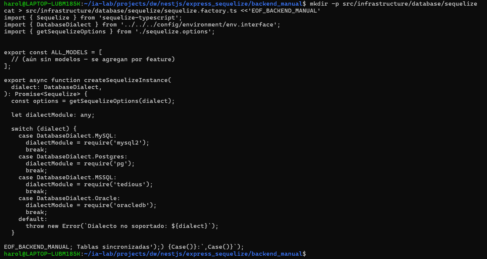

#### 5.8 — DatabaseSeederService (sin seeders aún)

Hook OnModuleInit para seeders. Todavía no llama a ningún seeder de feature.

**Archivo:** `src/infrastructure/database/seeders/database-seeder.service.ts`

```bash
mkdir -p src/infrastructure/database/seeders
cat > src/infrastructure/database/seeders/database-seeder.service.ts <<'EOF_BACKEND_MANUAL'
import { Injectable, Logger, OnModuleInit } from '@nestjs/common';


/**
 * Ejecuta seeders en orden de dependencias.
 * Solo en entornos no productivos.
 */
@Injectable()
export class DatabaseSeederService implements OnModuleInit {
  private readonly logger = new Logger(DatabaseSeederService.name);

  async onModuleInit(): Promise<void> {
    if (process.env.NODE_ENV === 'production') {
      return;
    }

    try {
      // sin seeders aún
      this.logger.log('✅ Seeders ejecutados');
    } catch (error: any) {
      this.logger.error(`❌ Error en seeders: ${error.message}`, error.stack);
      throw error;
    }
  }
}
EOF_BACKEND_MANUAL
```
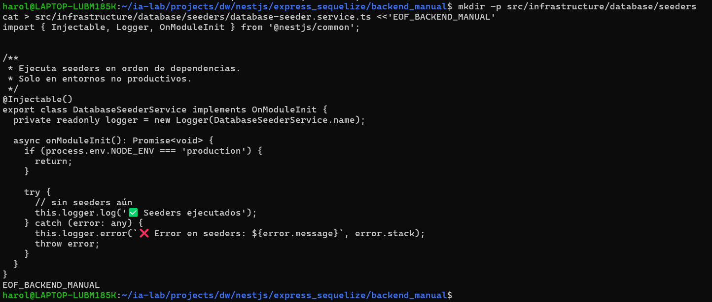

#### 5.9 — Módulo global Sequelize

Módulo `@Global()` que provee `SEQUELIZE_TOKEN` + ejecuta seeders.

**Archivo:** `src/infrastructure/database/sequelize/sequelize.module.ts`

```bash
mkdir -p src/infrastructure/database/sequelize
cat > src/infrastructure/database/sequelize/sequelize.module.ts <<'EOF_BACKEND_MANUAL'
import { Module, Global } from '@nestjs/common';
import { ConfigService } from '@nestjs/config';
import { Sequelize } from 'sequelize-typescript';
import { DatabaseDialect } from '../../../config/environment/env.interface';
import { SEQUELIZE_TOKEN } from '../../../common/constants/database.constants';
import { createSequelizeInstance } from './sequelize.factory';
import { DatabaseSeederService } from '../seeders/database-seeder.service';

@Global()
@Module({
  providers: [
    {
      provide: SEQUELIZE_TOKEN,
      useFactory: async (configService: ConfigService): Promise<Sequelize> => {
        const dialect = configService.get<DatabaseDialect>(
          'environment.database.dialect',
          DatabaseDialect.MySQL,
        );
        return createSequelizeInstance(dialect);
      },
      inject: [ConfigService],
    },
    DatabaseSeederService,
  ],
  exports: [SEQUELIZE_TOKEN],
})
export class SequelizeDatabaseModule {}
EOF_BACKEND_MANUAL
```
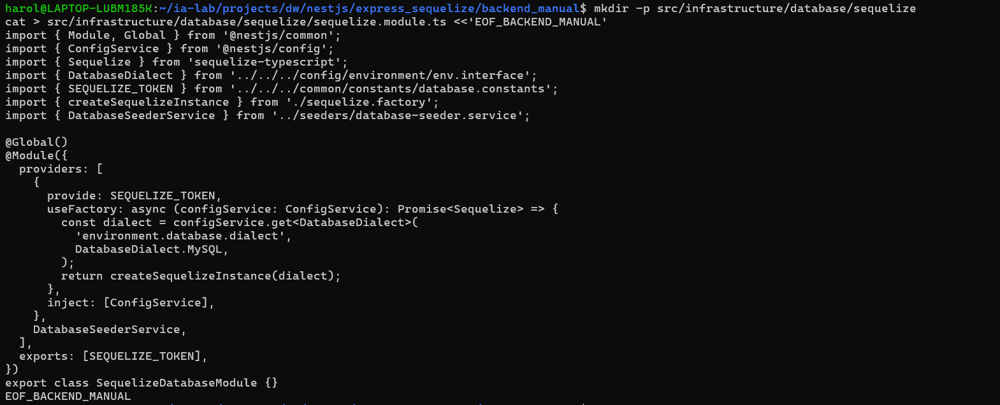

#### 5.10 — Verificar conexión a BD

Crea la BD vacía `tienda_moda` en el motor que indica `DB_DIALECT`. Aún no hay tablas de negocio. Si falla el authenticate, corrige el **bloque de ese motor** en `.env` (no el de otro).

```bash
# mysql:
# mysql -u root -p -e "CREATE DATABASE IF NOT EXISTS tienda_moda;"
# postgres:
# createdb tienda_moda
# mssql (sqlcmd):
# sqlcmd -S localhost -U sa -Q "CREATE DATABASE tienda_moda;"
# oracle: crea el schema/PDB que apunte DB_ORACLE_CONNECT_STRING
npm run start:dev
# Busca: ✅ Conexión exitosa a MYSQL (o POSTGRES / MSSQL / ORACLE según DB_DIALECT)
# Ctrl+C
```
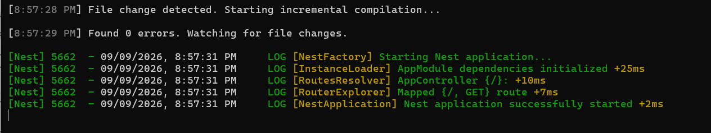

------------------------------------------------------------------------

## FASE 6 — `05_BASE_APP_COMMON_SECURITY`

### App config + Logger + Common + Security + bootstrap

> **Objetivo de la fase:** Dejar la infraestructura transversal lista antes de la primera entidad de negocio. Aún sin Business/Auth en AppModule y sin guards globales.

#### 6.1 — config/app/app.constants.ts

Archivo del feature en Clean Architecture.

**Archivo:** `src/config/app/app.constants.ts`

```bash
mkdir -p src/config/app
cat > src/config/app/app.constants.ts <<'EOF_BACKEND_MANUAL'
export const APP_CONFIG_NAME = 'app';

export const APP_DEFAULTS = {
  PORT: 3002,
  NODE_ENV: 'development',
};
EOF_BACKEND_MANUAL
```
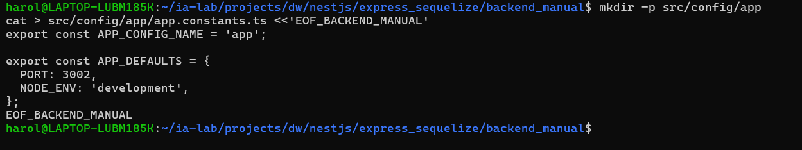

#### 6.2 — config/app/app.config.ts

Archivo del feature en Clean Architecture.

**Archivo:** `src/config/app/app.config.ts`

```bash
mkdir -p src/config/app
cat > src/config/app/app.config.ts <<'EOF_BACKEND_MANUAL'
import { registerAs } from '@nestjs/config';
import { APP_CONFIG_NAME, APP_DEFAULTS } from './app.constants';
import { Environment } from '../environment/env.interface';

export const appConfig = registerAs(APP_CONFIG_NAME, () => ({
  port: parseInt(process.env.PORT || String(APP_DEFAULTS.PORT), 10),
  nodeEnv: (process.env.NODE_ENV as Environment) || APP_DEFAULTS.NODE_ENV,
}));
EOF_BACKEND_MANUAL
```
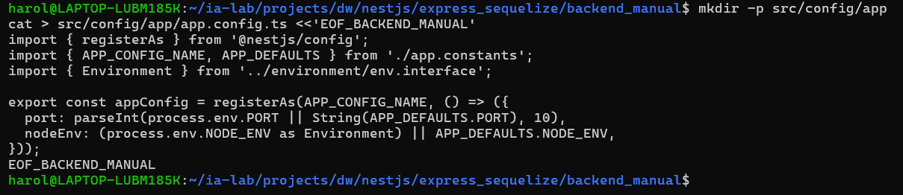

#### 6.3 — config/logger/logger.config.ts

Archivo del feature en Clean Architecture.

**Archivo:** `src/config/logger/logger.config.ts`

```bash
mkdir -p src/config/logger
cat > src/config/logger/logger.config.ts <<'EOF_BACKEND_MANUAL'
import { LogLevel } from '@nestjs/common';

export function getLoggerConfig(): { logLevels: LogLevel[] } {
  const isDev = process.env.NODE_ENV === 'development';

  return {
    logLevels: isDev
      ? ['log', 'error', 'warn', 'debug', 'verbose', 'fatal']
      : ['log', 'error', 'warn'],
  };
}
EOF_BACKEND_MANUAL
```
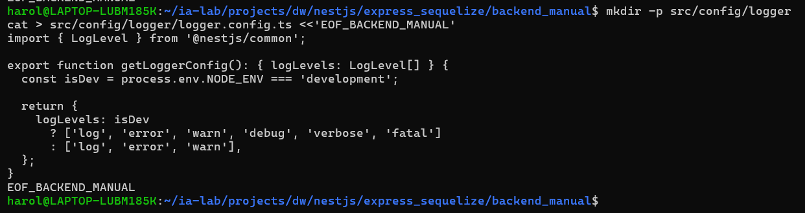
#### 6.4 — config/logger/logger.module.ts

Módulo Nest del feature: cablea providers, tokens DI y controller.

**Archivo:** `src/config/logger/logger.module.ts`

```bash
mkdir -p src/config/logger
cat > src/config/logger/logger.module.ts <<'EOF_BACKEND_MANUAL'
import { Module, Global, Logger } from '@nestjs/common';

@Global()
@Module({
  providers: [Logger],
  exports: [Logger],
})
export class LoggerModule {}
EOF_BACKEND_MANUAL
```
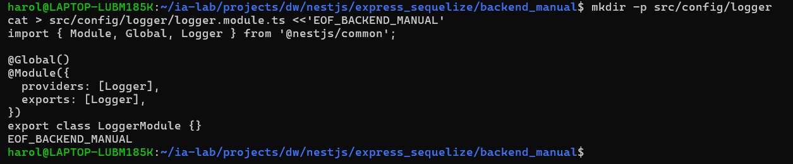

#### 6.5 — config/jwt/jwt.constants.ts

Archivo del feature en Clean Architecture.

**Archivo:** `src/config/jwt/jwt.constants.ts`

```bash
mkdir -p src/config/jwt
cat > src/config/jwt/jwt.constants.ts <<'EOF_BACKEND_MANUAL'
export const JWT_CONFIG_NAME = 'jwt';

export const JWT_DEFAULTS = {
  EXPIRES_IN: '1d',
  REFRESH_EXPIRES_IN: '7d',
};
EOF_BACKEND_MANUAL
```
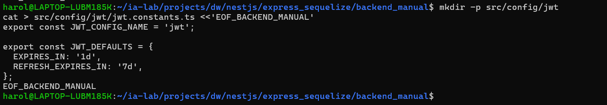

#### 6.6 — config/jwt/jwt.config.ts

Archivo del feature en Clean Architecture.

**Archivo:** `src/config/jwt/jwt.config.ts`

```bash
mkdir -p src/config/jwt
cat > src/config/jwt/jwt.config.ts <<'EOF_BACKEND_MANUAL'
import { registerAs } from '@nestjs/config';
import { JWT_CONFIG_NAME, JWT_DEFAULTS } from './jwt.constants';

export const jwtConfig = registerAs(JWT_CONFIG_NAME, () => ({
  secret: process.env.JWT_SECRET || '',
  expiresIn: process.env.JWT_EXPIRES_IN || JWT_DEFAULTS.EXPIRES_IN,
  refreshSecret: process.env.JWT_REFRESH_SECRET || '',
  refreshExpiresIn:
    process.env.JWT_REFRESH_EXPIRES_IN || JWT_DEFAULTS.REFRESH_EXPIRES_IN,
}));
EOF_BACKEND_MANUAL
```
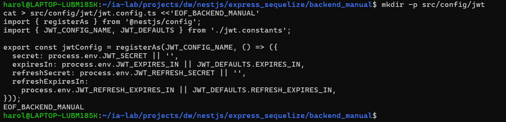

#### 6.7 — config/swagger/swagger.constants.ts

Archivo del feature en Clean Architecture.

**Archivo:** `src/config/swagger/swagger.constants.ts`

```bash
mkdir -p src/config/swagger
cat > src/config/swagger/swagger.constants.ts <<'EOF_BACKEND_MANUAL'
export const SWAGGER_TITLE = 'Backend NestJS + Sequelize API';
export const SWAGGER_DESCRIPTION =
  'API profesional con Clean Architecture / DDD, JWT y RBAC';
export const SWAGGER_VERSION = '1.0';
export const SWAGGER_PATH = 'api/docs';
EOF_BACKEND_MANUAL
```
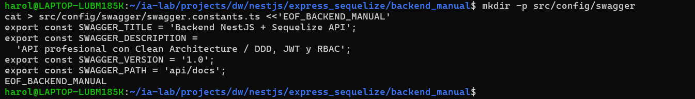

#### 6.8 — config/swagger/swagger.config.ts

Archivo del feature en Clean Architecture.

**Archivo:** `src/config/swagger/swagger.config.ts`

```bash
mkdir -p src/config/swagger
cat > src/config/swagger/swagger.config.ts <<'EOF_BACKEND_MANUAL'
import { INestApplication } from '@nestjs/common';
import { DocumentBuilder, SwaggerModule } from '@nestjs/swagger';
import {
  SWAGGER_DESCRIPTION,
  SWAGGER_PATH,
  SWAGGER_TITLE,
  SWAGGER_VERSION,
} from './swagger.constants';

export function setupSwagger(app: INestApplication): void {
  const config = new DocumentBuilder()
    .setTitle(SWAGGER_TITLE)
    .setDescription(SWAGGER_DESCRIPTION)
    .setVersion(SWAGGER_VERSION)
    .addBearerAuth(
      {
        type: 'http',
        scheme: 'bearer',
        bearerFormat: 'JWT',
        name: 'Authorization',
        in: 'header',
      },
      'access-token',
    )
    .build();

  const document = SwaggerModule.createDocument(app, config);
  SwaggerModule.setup(SWAGGER_PATH, app, document);
}
EOF_BACKEND_MANUAL
```
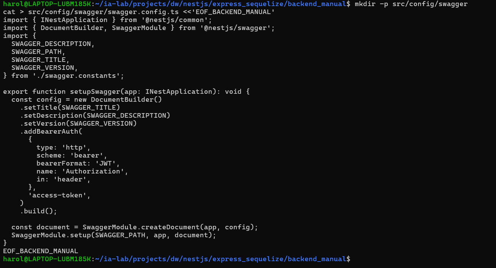

#### 6.9 — common/enums/status.enum.ts

Archivo del feature en Clean Architecture.

**Archivo:** `src/common/enums/status.enum.ts`

```bash
mkdir -p src/common/enums
cat > src/common/enums/status.enum.ts <<'EOF_BACKEND_MANUAL'
export enum Status {
  ACTIVE = 'ACTIVE',
  INACTIVE = 'INACTIVE',
}
EOF_BACKEND_MANUAL
```
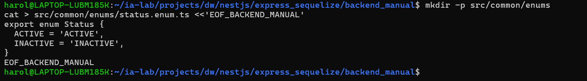

#### 6.10 — common/enums/http-method.enum.ts

Archivo del feature en Clean Architecture.

**Archivo:** `src/common/enums/http-method.enum.ts`

```bash
mkdir -p src/common/enums
cat > src/common/enums/http-method.enum.ts <<'EOF_BACKEND_MANUAL'
export enum HttpMethod {
  GET = 'GET',
  POST = 'POST',
  PUT = 'PUT',
  PATCH = 'PATCH',
  DELETE = 'DELETE',
}
EOF_BACKEND_MANUAL
```
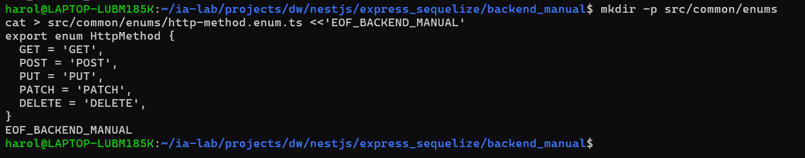

#### 6.11 — common/enums/sort-order.enum.ts

Archivo del feature en Clean Architecture.

**Archivo:** `src/common/enums/sort-order.enum.ts`

```bash
mkdir -p src/common/enums
cat > src/common/enums/sort-order.enum.ts <<'EOF_BACKEND_MANUAL'
export enum SortOrder {
  ASC = 'ASC',
  DESC = 'DESC',
}
EOF_BACKEND_MANUAL
```
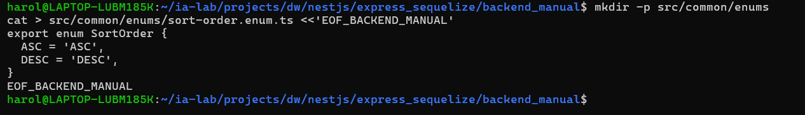

#### 6.12 — common/constants/app.constants.ts

Archivo del feature en Clean Architecture.

**Archivo:** `src/common/constants/app.constants.ts`

```bash
mkdir -p src/common/constants
cat > src/common/constants/app.constants.ts <<'EOF_BACKEND_MANUAL'
export const APP_NAME = 'tienda_moda';
export const GLOBAL_PREFIX = 'api';
EOF_BACKEND_MANUAL
```
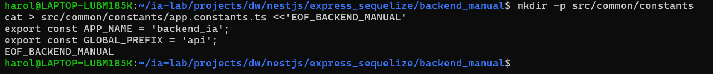

#### 6.13 — common/constants/pagination.constants.ts

Archivo del feature en Clean Architecture.

**Archivo:** `src/common/constants/pagination.constants.ts`

```bash
mkdir -p src/common/constants
cat > src/common/constants/pagination.constants.ts <<'EOF_BACKEND_MANUAL'
export const DEFAULT_PAGE = 1;
export const DEFAULT_LIMIT = 10;
export const MAX_LIMIT = 100;
EOF_BACKEND_MANUAL
```
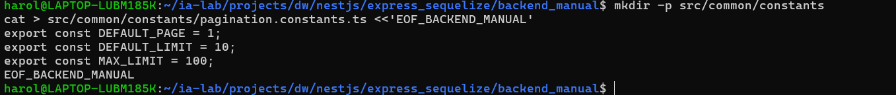

#### 6.14 — common/exceptions/application.exception.ts

Archivo del feature en Clean Architecture.

**Archivo:** `src/common/exceptions/application.exception.ts`

```bash
mkdir -p src/common/exceptions
cat > src/common/exceptions/application.exception.ts <<'EOF_BACKEND_MANUAL'
export class ApplicationException extends Error {
  public readonly timestamp: string;

  constructor(
    public readonly message: string,
    public readonly statusCode: number = 500,
  ) {
    super(message);
    this.timestamp = new Date().toISOString();
    Error.captureStackTrace(this, this.constructor);
  }
}
EOF_BACKEND_MANUAL
```
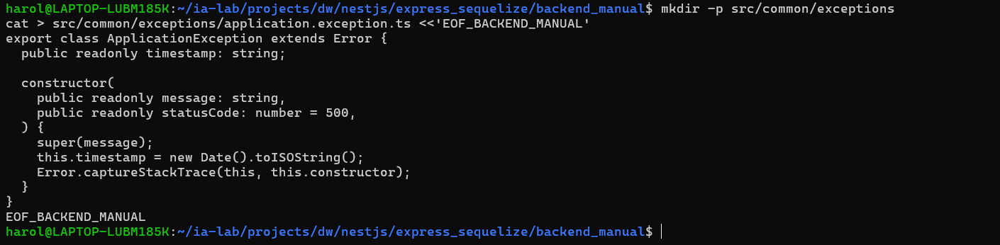

#### 6.15 — common/exceptions/domain.exception.ts

Archivo del feature en Clean Architecture.

**Archivo:** `src/common/exceptions/domain.exception.ts`

```bash
mkdir -p src/common/exceptions
cat > src/common/exceptions/domain.exception.ts <<'EOF_BACKEND_MANUAL'
import { ApplicationException } from './application.exception';

export class DomainException extends ApplicationException {
  constructor(message: string) {
    super(message, 400);
  }
}
EOF_BACKEND_MANUAL
```
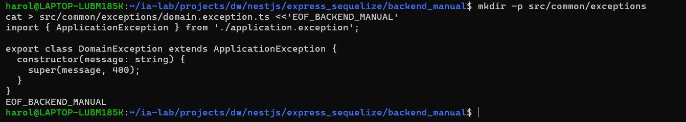

#### 6.16 — common/exceptions/entity-not-found.exception.ts

Archivo del feature en Clean Architecture.

**Archivo:** `src/common/exceptions/entity-not-found.exception.ts`

```bash
mkdir -p src/common/exceptions
cat > src/common/exceptions/entity-not-found.exception.ts <<'EOF_BACKEND_MANUAL'
import { ApplicationException } from './application.exception';

export class EntityNotFoundException extends ApplicationException {
  constructor(entityName: string, identifier: string | number) {
    super(`${entityName} con ID ${identifier} no encontrado`, 404);
  }
}
EOF_BACKEND_MANUAL
```
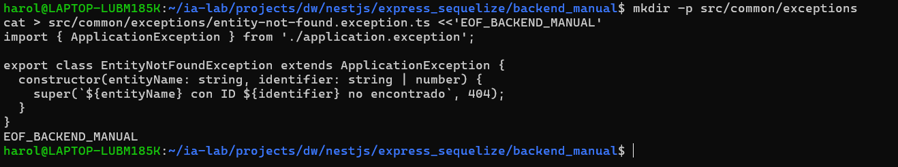

#### 6.17 — common/exceptions/validation.exception.ts

Archivo del feature en Clean Architecture.

**Archivo:** `src/common/exceptions/validation.exception.ts`

```bash
mkdir -p src/common/exceptions
cat > src/common/exceptions/validation.exception.ts <<'EOF_BACKEND_MANUAL'
import { ApplicationException } from './application.exception';

export class ValidationException extends ApplicationException {
  constructor(message: string = 'Error de validación') {
    super(message, 422);
  }
}
EOF_BACKEND_MANUAL
```
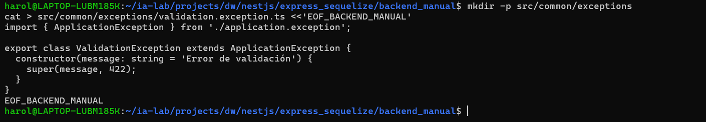

#### 6.18 — common/filters/global-exception.filter.ts

Archivo del feature en Clean Architecture.

**Archivo:** `src/common/filters/global-exception.filter.ts`

```bash
mkdir -p src/common/filters
cat > src/common/filters/global-exception.filter.ts <<'EOF_BACKEND_MANUAL'
import {
  ExceptionFilter,
  Catch,
  ArgumentsHost,
  HttpException,
  HttpStatus,
} from '@nestjs/common';
import { Request, Response } from 'express';
import { ApplicationException } from '../exceptions/application.exception';

@Catch()
export class GlobalExceptionFilter implements ExceptionFilter {
  catch(exception: unknown, host: ArgumentsHost): void {
    const ctx = host.switchToHttp();
    const response = ctx.getResponse<Response>();
    const request = ctx.getRequest<Request>();

    let status = HttpStatus.INTERNAL_SERVER_ERROR;
    let message: string | string[] = 'Error interno del servidor';

    if (exception instanceof ApplicationException) {
      status = exception.statusCode;
      message = exception.message;
    } else if (exception instanceof HttpException) {
      status = exception.getStatus();
      const res = exception.getResponse();
      message = typeof res === 'string' ? res : (res as any).message;
    }

    response.status(status).json({
      statusCode: status,
      message,
      timestamp: new Date().toISOString(),
      path: request.url,
    });
  }
}
EOF_BACKEND_MANUAL
```
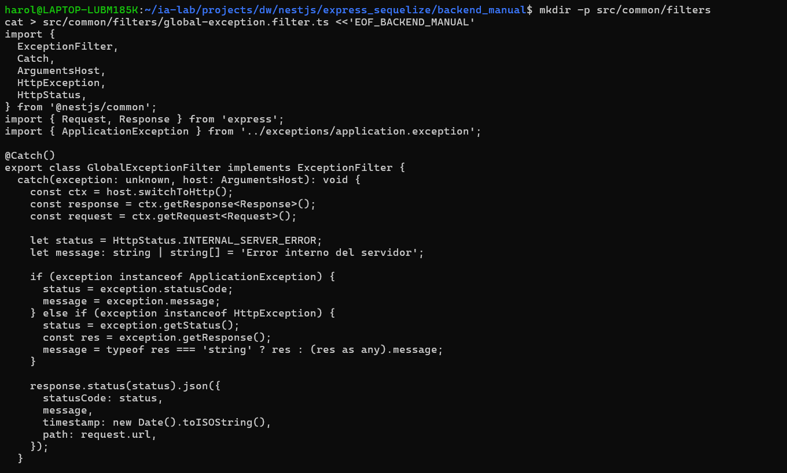

#### 6.19 — common/filters/sequelize-exception.filter.ts

Archivo del feature en Clean Architecture.

**Archivo:** `src/common/filters/sequelize-exception.filter.ts`

```bash
mkdir -p src/common/filters
cat > src/common/filters/sequelize-exception.filter.ts <<'EOF_BACKEND_MANUAL'
import { ExceptionFilter, Catch, ArgumentsHost } from '@nestjs/common';
import { Response } from 'express';

@Catch()
export class SequelizeExceptionFilter implements ExceptionFilter {
  catch(exception: any, host: ArgumentsHost): void {
    const ctx = host.switchToHttp();
    const response = ctx.getResponse<Response>();

    const sequelizeErrors = [
      'SequelizeUniqueConstraintError',
      'SequelizeForeignKeyConstraintError',
      'SequelizeConnectionError',
      'SequelizeValidationError',
      'SequelizeDatabaseError',
    ];

    if (!exception?.name || !sequelizeErrors.includes(exception.name)) {
      throw exception;
    }

    let status = 500;
    let message = 'Error de base de datos';

    if (exception.name === 'SequelizeUniqueConstraintError') {
      status = 409;
      message = 'El recurso ya existe (violación de unicidad)';
    } else if (exception.name === 'SequelizeForeignKeyConstraintError') {
      status = 400;
      message = 'Violación de clave foránea';
    } else if (exception.name === 'SequelizeConnectionError') {
      status = 503;
      message = 'No se pudo conectar a la base de datos';
    } else if (exception.name === 'SequelizeValidationError') {
      status = 422;
      message = exception.message || 'Error de validación en base de datos';
    }

    response.status(status).json({
      statusCode: status,
      message,
      timestamp: new Date().toISOString(),
    });
  }
}
EOF_BACKEND_MANUAL
```
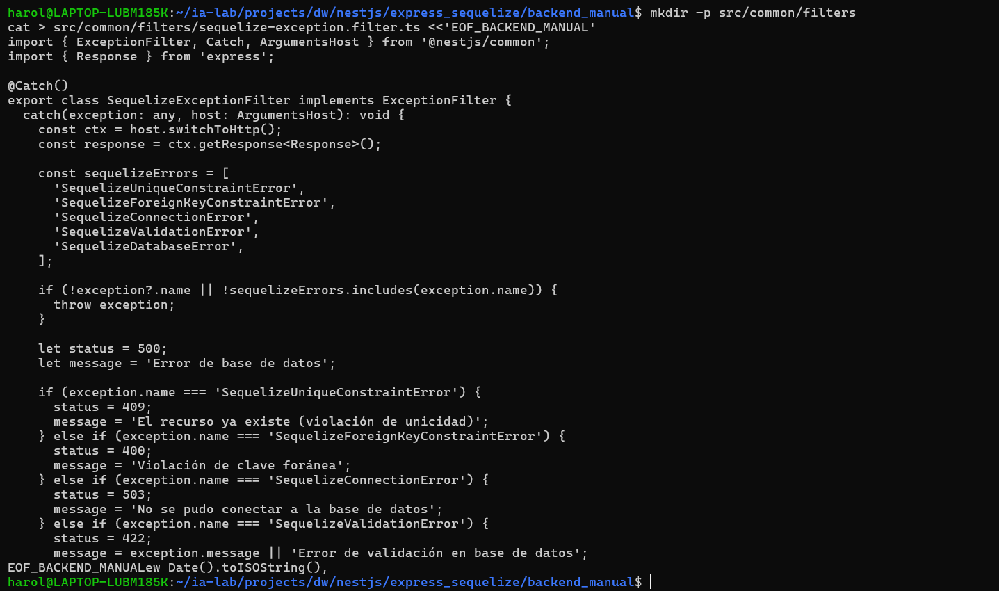

#### 6.20 — common/interceptors/response.interceptor.ts

Archivo del feature en Clean Architecture.

**Archivo:** `src/common/interceptors/response.interceptor.ts`

```bash
mkdir -p src/common/interceptors
cat > src/common/interceptors/response.interceptor.ts <<'EOF_BACKEND_MANUAL'
import {
  Injectable,
  NestInterceptor,
  ExecutionContext,
  CallHandler,
} from '@nestjs/common';
import { Observable } from 'rxjs';
import { map } from 'rxjs/operators';

export interface ApiResponse<T> {
  statusCode: number;
  message: string;
  data: T;
  timestamp: string;
}

@Injectable()
export class ResponseInterceptor<T>
  implements NestInterceptor<T, ApiResponse<T>>
{
  intercept(
    context: ExecutionContext,
    next: CallHandler,
  ): Observable<ApiResponse<T>> {
    const response = context.switchToHttp().getResponse();
    const statusCode = response.statusCode;

    return next.handle().pipe(
      map((data) => ({
        statusCode,
        message: 'Operación exitosa',
        data,
        timestamp: new Date().toISOString(),
      })),
    );
  }
}
EOF_BACKEND_MANUAL
```
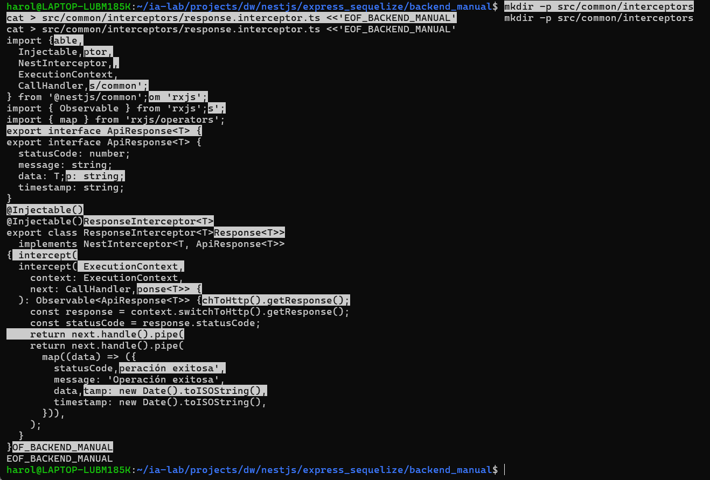

#### 6.21 — common/interceptors/logging.interceptor.ts

Archivo del feature en Clean Architecture.

**Archivo:** `src/common/interceptors/logging.interceptor.ts`

```bash
mkdir -p src/common/interceptors
cat > src/common/interceptors/logging.interceptor.ts <<'EOF_BACKEND_MANUAL'
import {
  Injectable,
  NestInterceptor,
  ExecutionContext,
  CallHandler,
  Logger,
} from '@nestjs/common';
import { Observable } from 'rxjs';
import { tap } from 'rxjs/operators';

@Injectable()
export class LoggingInterceptor implements NestInterceptor {
  private readonly logger = new Logger('HTTP');

  intercept(context: ExecutionContext, next: CallHandler): Observable<any> {
    const req = context.switchToHttp().getRequest();
    const { method, url } = req;
    const now = Date.now();

    return next.handle().pipe(
      tap(() => {
        const res = context.switchToHttp().getResponse();
        const delay = Date.now() - now;
        this.logger.log(`${method} ${url} ${res.statusCode} - ${delay}ms`);
      }),
    );
  }
}
EOF_BACKEND_MANUAL
```
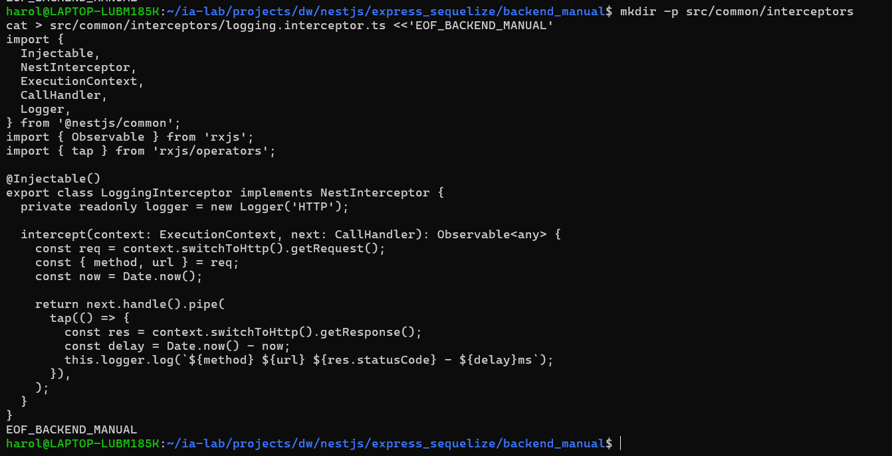

#### 6.22 — common/interceptors/timeout.interceptor.ts

Archivo del feature en Clean Architecture.

**Archivo:** `src/common/interceptors/timeout.interceptor.ts`

```bash
mkdir -p src/common/interceptors
cat > src/common/interceptors/timeout.interceptor.ts <<'EOF_BACKEND_MANUAL'
import {
  Injectable,
  NestInterceptor,
  ExecutionContext,
  CallHandler,
  RequestTimeoutException,
} from '@nestjs/common';
import { Observable, throwError, TimeoutError } from 'rxjs';
import { catchError, timeout } from 'rxjs/operators';

@Injectable()
export class TimeoutInterceptor implements NestInterceptor {
  intercept(context: ExecutionContext, next: CallHandler): Observable<any> {
    return next.handle().pipe(
      timeout(30000),
      catchError((err) => {
        if (err instanceof TimeoutError) {
          return throwError(() => new RequestTimeoutException());
        }
        return throwError(() => err);
      }),
    );
  }
}
EOF_BACKEND_MANUAL
```
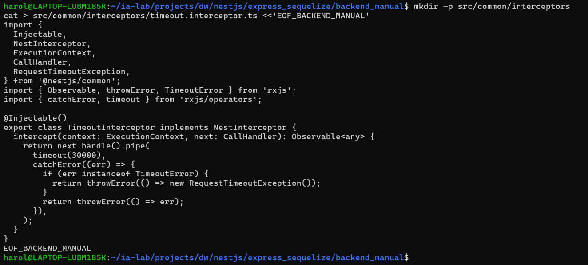

#### 6.23 — common/pipes/validation.pipe.ts

Archivo del feature en Clean Architecture.

**Archivo:** `src/common/pipes/validation.pipe.ts`

```bash
mkdir -p src/common/pipes
cat > src/common/pipes/validation.pipe.ts <<'EOF_BACKEND_MANUAL'
import {
  PipeTransform,
  Injectable,
  ArgumentMetadata,
  BadRequestException,
} from '@nestjs/common';
import { validate } from 'class-validator';
import { plainToInstance } from 'class-transformer';

@Injectable()
export class CustomValidationPipe implements PipeTransform<any> {
  async transform(value: any, { metatype }: ArgumentMetadata) {
    if (!metatype || !this.toValidate(metatype)) {
      return value;
    }

    const object = plainToInstance(metatype, value);
    const errors = await validate(object);

    if (errors.length > 0) {
      const messages = errors.map(
        (err) =>
          `${err.property}: ${Object.values(err.constraints || {}).join(', ')}`,
      );
      throw new BadRequestException(messages);
    }

    return object;
  }

  private toValidate(metatype: any): boolean {
    const types = [String, Boolean, Number, Array, Object];
    return !types.includes(metatype);
  }
}
EOF_BACKEND_MANUAL
```
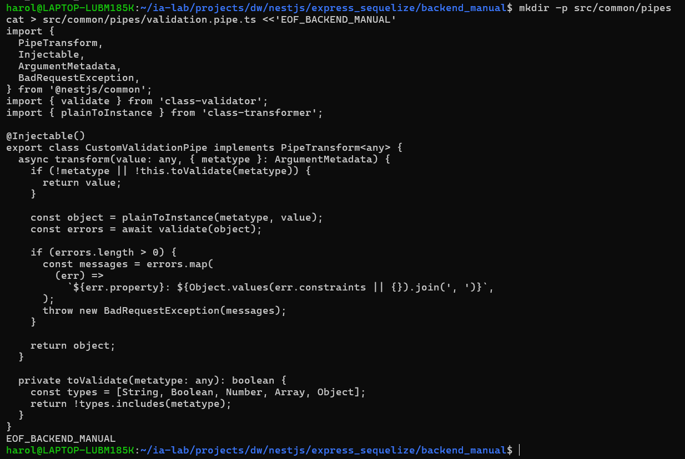

#### 6.24 — common/pipes/parse-positive-int.pipe.ts

Archivo del feature en Clean Architecture.

**Archivo:** `src/common/pipes/parse-positive-int.pipe.ts`

```bash
mkdir -p src/common/pipes
cat > src/common/pipes/parse-positive-int.pipe.ts <<'EOF_BACKEND_MANUAL'
import {
  PipeTransform,
  Injectable,
  BadRequestException,
} from '@nestjs/common';

@Injectable()
export class ParsePositiveIntPipe implements PipeTransform<string, number> {
  transform(value: string): number {
    const parsed = parseInt(value, 10);

    if (isNaN(parsed) || parsed <= 0) {
      throw new BadRequestException(
        `El valor '${value}' no es un entero positivo`,
      );
    }

    return parsed;
  }
}
EOF_BACKEND_MANUAL
```
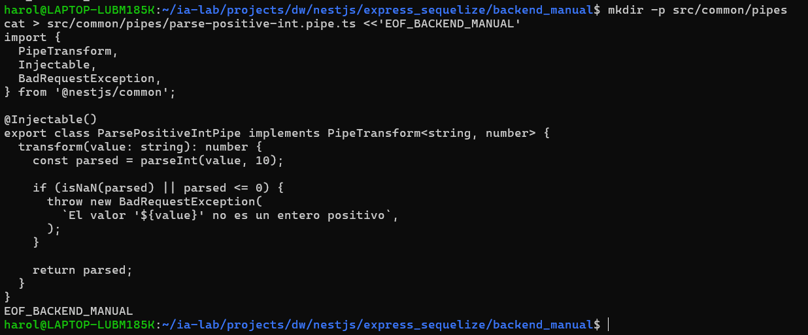

#### 6.25 — common/decorators/public.decorator.ts

Archivo del feature en Clean Architecture.

**Archivo:** `src/common/decorators/public.decorator.ts`

```bash
mkdir -p src/common/decorators
cat > src/common/decorators/public.decorator.ts <<'EOF_BACKEND_MANUAL'
import { SetMetadata } from '@nestjs/common';

export const IS_PUBLIC_KEY = 'isPublic';
export const Public = () => SetMetadata(IS_PUBLIC_KEY, true);
EOF_BACKEND_MANUAL
```
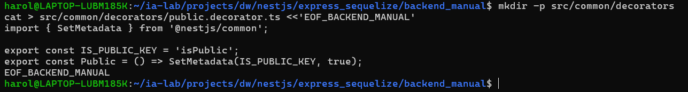

#### 6.26 — common/decorators/roles.decorator.ts

Archivo del feature en Clean Architecture.

**Archivo:** `src/common/decorators/roles.decorator.ts`

```bash
mkdir -p src/common/decorators
cat > src/common/decorators/roles.decorator.ts <<'EOF_BACKEND_MANUAL'
import { SetMetadata } from '@nestjs/common';

export const ROLES_KEY = 'roles';
export const Roles = (...roles: string[]) => SetMetadata(ROLES_KEY, roles);
EOF_BACKEND_MANUAL
```
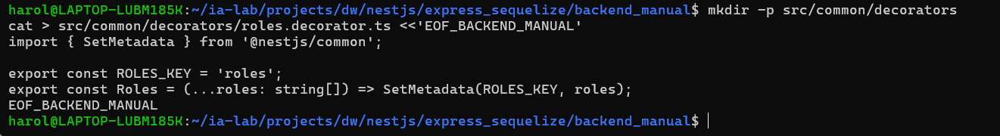

#### 6.27 — common/decorators/current-user.decorator.ts

Archivo del feature en Clean Architecture.

**Archivo:** `src/common/decorators/current-user.decorator.ts`

```bash
mkdir -p src/common/decorators
cat > src/common/decorators/current-user.decorator.ts <<'EOF_BACKEND_MANUAL'
import { createParamDecorator, ExecutionContext } from '@nestjs/common';

export const CurrentUser = createParamDecorator(
  (data: string | undefined, ctx: ExecutionContext) => {
    const request = ctx.switchToHttp().getRequest();
    const user = request.user;
    return data ? user?.[data] : user;
  },
);
EOF_BACKEND_MANUAL
```
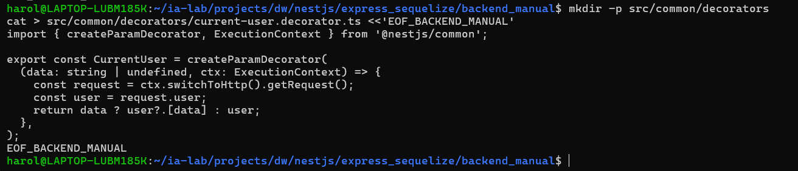

#### 6.28 — common/decorators/resource.decorator.ts

Archivo del feature en Clean Architecture.

**Archivo:** `src/common/decorators/resource.decorator.ts`

```bash
mkdir -p src/common/decorators
cat > src/common/decorators/resource.decorator.ts <<'EOF_BACKEND_MANUAL'
import { SetMetadata } from '@nestjs/common';

export const RESOURCE_KEY = 'resource';
export const ResourceMeta = (path: string, method: string) =>
  SetMetadata(RESOURCE_KEY, { path, method });
EOF_BACKEND_MANUAL
```
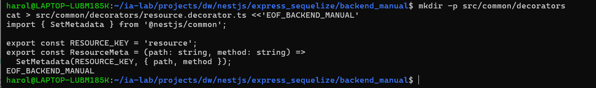

#### 6.29 — common/interfaces/authenticated-user.interface.ts

Archivo del feature en Clean Architecture.

**Archivo:** `src/common/interfaces/authenticated-user.interface.ts`

```bash
mkdir -p src/common/interfaces
cat > src/common/interfaces/authenticated-user.interface.ts <<'EOF_BACKEND_MANUAL'
export interface AuthenticatedUser {
  id: number;
  email: string;
  username: string;
  roles: string[];
}
EOF_BACKEND_MANUAL
```
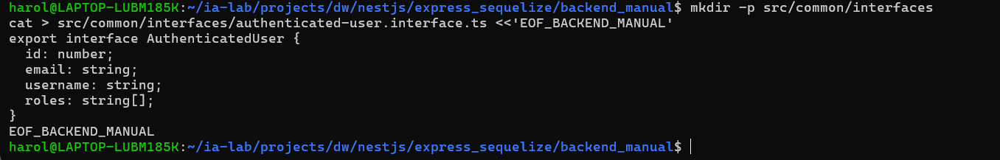

#### 6.30 — common/interfaces/pagination.interface.ts

Archivo del feature en Clean Architecture.

**Archivo:** `src/common/interfaces/pagination.interface.ts`

```bash
mkdir -p src/common/interfaces
cat > src/common/interfaces/pagination.interface.ts <<'EOF_BACKEND_MANUAL'
export interface PaginationMeta {
  page: number;
  limit: number;
  total: number;
  totalPages: number;
}

export interface PaginatedResult<T> {
  items: T[];
  meta: PaginationMeta;
}
EOF_BACKEND_MANUAL
```
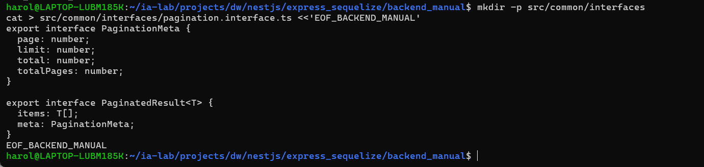

#### 6.31 — common/interfaces/api-response.interface.ts

Archivo del feature en Clean Architecture.

**Archivo:** `src/common/interfaces/api-response.interface.ts`

```bash
mkdir -p src/common/interfaces
cat > src/common/interfaces/api-response.interface.ts <<'EOF_BACKEND_MANUAL'
export interface ApiResponseBody<T> {
  statusCode: number;
  message: string;
  data: T;
  timestamp: string;
}
EOF_BACKEND_MANUAL
```
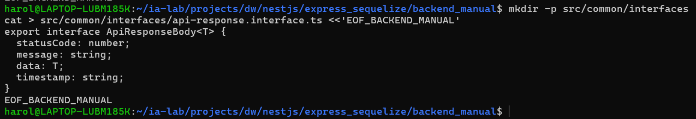

#### 6.32 — common/types/nullable.type.ts

Archivo del feature en Clean Architecture.

**Archivo:** `src/common/types/nullable.type.ts`

```bash
mkdir -p src/common/types
cat > src/common/types/nullable.type.ts <<'EOF_BACKEND_MANUAL'
export type Nullable<T> = T | null;
EOF_BACKEND_MANUAL
```
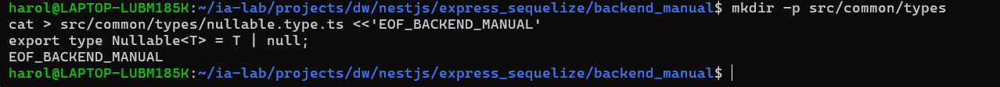

#### 6.33 — common/types/optional.type.ts

Archivo del feature en Clean Architecture.

**Archivo:** `src/common/types/optional.type.ts`

```bash
mkdir -p src/common/types
cat > src/common/types/optional.type.ts <<'EOF_BACKEND_MANUAL'
export type Optional<T> = T | undefined;
EOF_BACKEND_MANUAL
```
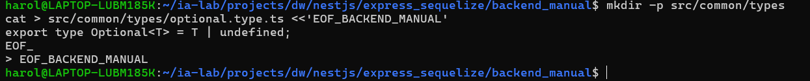

#### 6.34 — common/utils/pagination.util.ts

Archivo del feature en Clean Architecture.

**Archivo:** `src/common/utils/pagination.util.ts`

```bash
mkdir -p src/common/utils
cat > src/common/utils/pagination.util.ts <<'EOF_BACKEND_MANUAL'
import {
  DEFAULT_LIMIT,
  DEFAULT_PAGE,
  MAX_LIMIT,
} from '../constants/pagination.constants';
import { PaginatedResult } from '../interfaces/pagination.interface';

export function normalizePagination(page?: number, limit?: number) {
  const safePage = !page || page < 1 ? DEFAULT_PAGE : page;
  const safeLimit = !limit || limit < 1 ? DEFAULT_LIMIT : Math.min(limit, MAX_LIMIT);
  const offset = (safePage - 1) * safeLimit;
  return { page: safePage, limit: safeLimit, offset };
}

export function buildPaginatedResult<T>(
  items: T[],
  total: number,
  page: number,
  limit: number,
): PaginatedResult<T> {
  return {
    items,
    meta: {
      page,
      limit,
      total,
      totalPages: Math.ceil(total / limit) || 0,
    },
  };
}
EOF_BACKEND_MANUAL
```
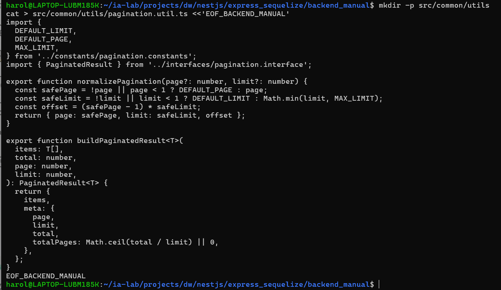

#### 6.35 — common/utils/date.util.ts

Archivo del feature en Clean Architecture.

**Archivo:** `src/common/utils/date.util.ts`

```bash
mkdir -p src/common/utils
cat > src/common/utils/date.util.ts <<'EOF_BACKEND_MANUAL'
export function addDays(date: Date, days: number): Date {
  const result = new Date(date);
  result.setDate(result.getDate() + days);
  return result;
}

export function parseDurationToMs(duration: string): number {
  const match = /^(\d+)([smhd])$/.exec(duration);
  if (!match) {
    return 24 * 60 * 60 * 1000;
  }

  const value = parseInt(match[1], 10);
  const unit = match[2];

  switch (unit) {
    case 's':
      return value * 1000;
    case 'm':
      return value * 60 * 1000;
    case 'h':
      return value * 60 * 60 * 1000;
    case 'd':
      return value * 24 * 60 * 60 * 1000;
    default:
      return 24 * 60 * 60 * 1000;
  }
}
EOF_BACKEND_MANUAL
```
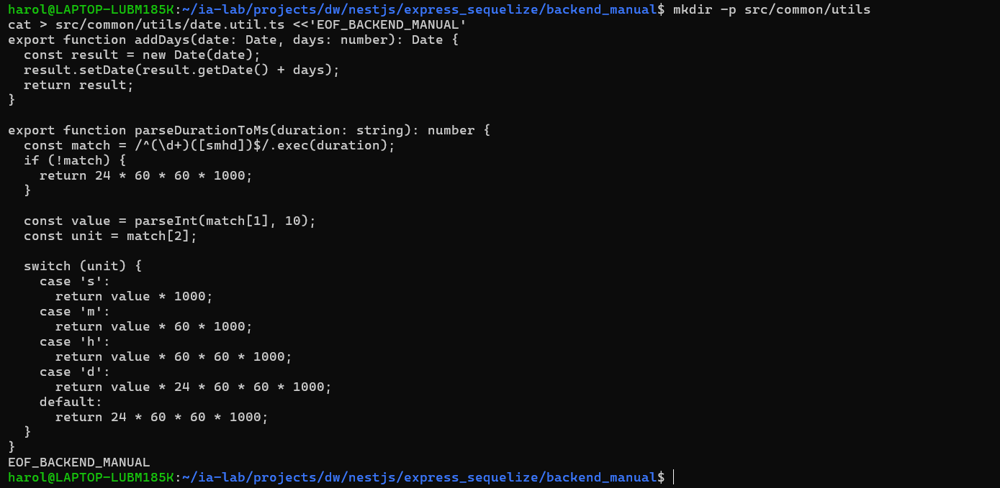

#### 6.36 — common/utils/string.util.ts

Archivo del feature en Clean Architecture.

**Archivo:** `src/common/utils/string.util.ts`

```bash
mkdir -p src/common/utils
cat > src/common/utils/string.util.ts <<'EOF_BACKEND_MANUAL'
export function normalizeEmail(email: string): string {
  return email.trim().toLowerCase();
}

export function isBlank(value?: string | null): boolean {
  return !value || value.trim().length === 0;
}
EOF_BACKEND_MANUAL
```
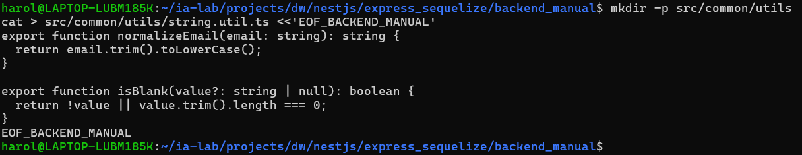

#### 6.37 — infrastructure/security/hashing/password-hasher.interface.ts

Archivo del feature en Clean Architecture.

**Archivo:** `src/infrastructure/security/hashing/password-hasher.interface.ts`

```bash
mkdir -p src/infrastructure/security/hashing
cat > src/infrastructure/security/hashing/password-hasher.interface.ts <<'EOF_BACKEND_MANUAL'
export const PASSWORD_HASHER = 'PASSWORD_HASHER';

export interface IPasswordHasher {
  hash(plain: string): Promise<string>;
  compare(plain: string, hashed: string): Promise<boolean>;
}
EOF_BACKEND_MANUAL
```
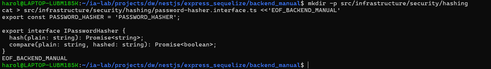

#### 6.38 — infrastructure/security/hashing/bcrypt-password-hasher.service.ts

Archivo del feature en Clean Architecture.

**Archivo:** `src/infrastructure/security/hashing/bcrypt-password-hasher.service.ts`

```bash
mkdir -p src/infrastructure/security/hashing
cat > src/infrastructure/security/hashing/bcrypt-password-hasher.service.ts <<'EOF_BACKEND_MANUAL'
import { Injectable } from '@nestjs/common';
import * as bcrypt from 'bcrypt';
import { IPasswordHasher } from './password-hasher.interface';

@Injectable()
export class BcryptPasswordHasherService implements IPasswordHasher {
  private readonly rounds = 10;

  async hash(plain: string): Promise<string> {
    return bcrypt.hash(plain, this.rounds);
  }

  async compare(plain: string, hashed: string): Promise<boolean> {
    return bcrypt.compare(plain, hashed);
  }
}
EOF_BACKEND_MANUAL
```
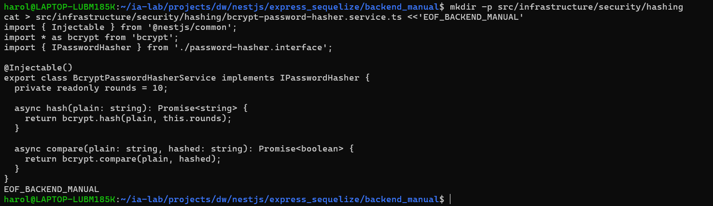

#### 6.39 — infrastructure/security/tokens/token.interface.ts

Archivo del feature en Clean Architecture.

**Archivo:** `src/infrastructure/security/tokens/token.interface.ts`

```bash
mkdir -p src/infrastructure/security/tokens
cat > src/infrastructure/security/tokens/token.interface.ts <<'EOF_BACKEND_MANUAL'
export const TOKEN_SERVICE = 'TOKEN_SERVICE';

export interface TokenPayload {
  sub: number;
  email: string;
  username: string;
  roles: string[];
}

export interface IssuedTokens {
  accessToken: string;
  refreshToken: string;
  expiresIn: string;
}

export interface ITokenService {
  signAccessToken(payload: TokenPayload): Promise<string>;
  signRefreshToken(payload: TokenPayload): Promise<string>;
  verifyAccessToken(token: string): Promise<TokenPayload>;
  verifyRefreshToken(token: string): Promise<TokenPayload>;
  issueTokens(payload: TokenPayload): Promise<IssuedTokens>;
}
EOF_BACKEND_MANUAL
```
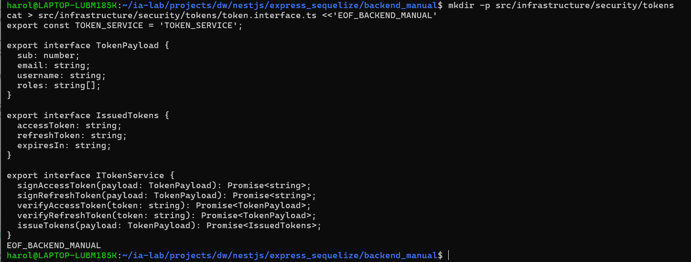

#### 6.40 — infrastructure/security/tokens/token.service.ts

Archivo del feature en Clean Architecture.

**Archivo:** `src/infrastructure/security/tokens/token.service.ts`

```bash
mkdir -p src/infrastructure/security/tokens
cat > src/infrastructure/security/tokens/token.service.ts <<'EOF_BACKEND_MANUAL'
import { Injectable } from '@nestjs/common';
import { ConfigService } from '@nestjs/config';
import { JwtService } from '@nestjs/jwt';
import {
  ITokenService,
  IssuedTokens,
  TokenPayload,
} from './token.interface';

@Injectable()
export class TokenService implements ITokenService {
  constructor(
    private readonly jwtService: JwtService,
    private readonly configService: ConfigService,
  ) {}

  async signAccessToken(payload: TokenPayload): Promise<string> {
    return this.jwtService.signAsync(payload, {
      secret: this.configService.get<string>('environment.jwt.secret'),
      expiresIn: this.configService.get<string>('environment.jwt.expiresIn') as any,
    });
  }

  async signRefreshToken(payload: TokenPayload): Promise<string> {
    return this.jwtService.signAsync(payload, {
      secret: this.configService.get<string>('environment.jwt.refreshSecret'),
      expiresIn: this.configService.get<string>(
        'environment.jwt.refreshExpiresIn',
      ) as any,
    });
  }

  async verifyAccessToken(token: string): Promise<TokenPayload> {
    return this.jwtService.verifyAsync<TokenPayload>(token, {
      secret: this.configService.get<string>('environment.jwt.secret'),
    });
  }

  async verifyRefreshToken(token: string): Promise<TokenPayload> {
    return this.jwtService.verifyAsync<TokenPayload>(token, {
      secret: this.configService.get<string>('environment.jwt.refreshSecret'),
    });
  }

  async issueTokens(payload: TokenPayload): Promise<IssuedTokens> {
    const [accessToken, refreshToken] = await Promise.all([
      this.signAccessToken(payload),
      this.signRefreshToken(payload),
    ]);

    return {
      accessToken,
      refreshToken,
      expiresIn:
        this.configService.get<string>('environment.jwt.expiresIn') || '1d',
    };
  }
}
EOF_BACKEND_MANUAL
```
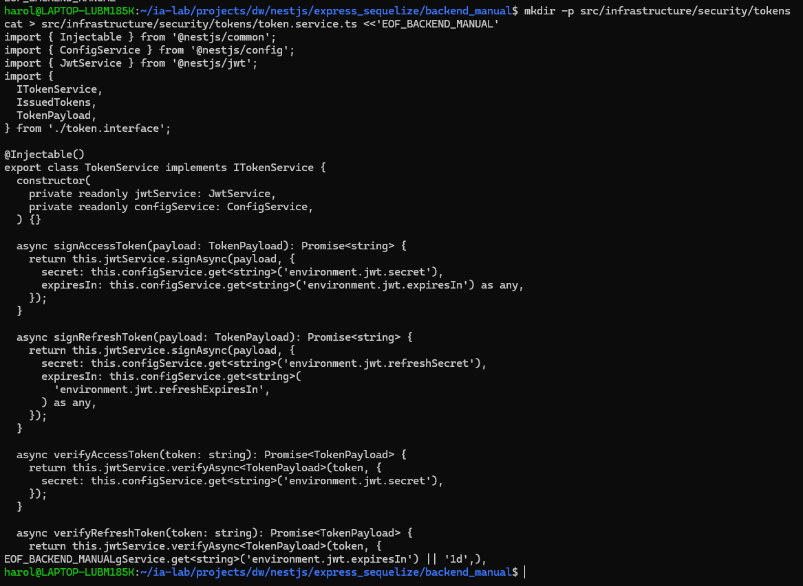

#### 6.41 — infrastructure/security/security.module.ts

Módulo Nest del feature: cablea providers, tokens DI y controller.

**Archivo:** `src/infrastructure/security/security.module.ts`

```bash
mkdir -p src/infrastructure/security
cat > src/infrastructure/security/security.module.ts <<'EOF_BACKEND_MANUAL'
import { Global, Module } from '@nestjs/common';
import { ConfigModule, ConfigService } from '@nestjs/config';
import { JwtModule } from '@nestjs/jwt';
import { PASSWORD_HASHER } from './hashing/password-hasher.interface';
import { BcryptPasswordHasherService } from './hashing/bcrypt-password-hasher.service';
import { TOKEN_SERVICE } from './tokens/token.interface';
import { TokenService } from './tokens/token.service';

@Global()
@Module({
  imports: [
    JwtModule.registerAsync({
      imports: [ConfigModule],
      inject: [ConfigService],
      useFactory: (configService: ConfigService) => ({
        secret: configService.get<string>('environment.jwt.secret') ?? '',
        signOptions: {
          expiresIn: (configService.get<string>('environment.jwt.expiresIn') ??
            '1d') as any,
        },
      }),
    }),
  ],
  providers: [
    BcryptPasswordHasherService,
    {
      provide: PASSWORD_HASHER,
      useExisting: BcryptPasswordHasherService,
    },
    TokenService,
    {
      provide: TOKEN_SERVICE,
      useExisting: TokenService,
    },
  ],
  exports: [
    JwtModule,
    BcryptPasswordHasherService,
    PASSWORD_HASHER,
    TokenService,
    TOKEN_SERVICE,
  ],
})
export class SecurityModule {}
EOF_BACKEND_MANUAL
```
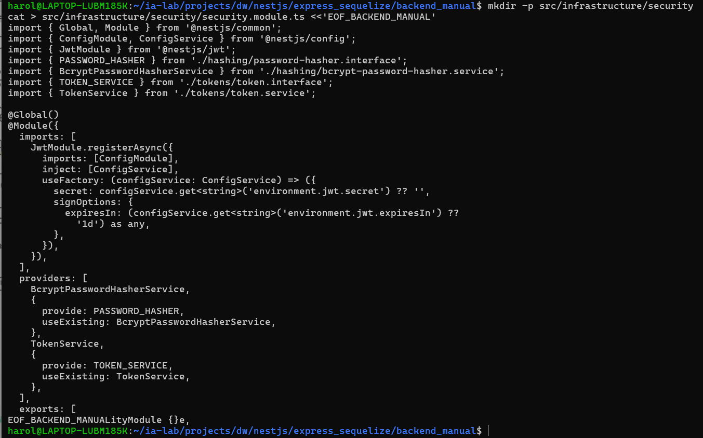

#### 6.42 — Actualizar main.ts (bootstrap completo)

Prefix global, filters, interceptors, pipes, Swagger y manejo amigable de EADDRINUSE.

**Archivo:** `src/main.ts`

```bash
mkdir -p src
cat > src/main.ts <<'EOF_BACKEND_MANUAL'
import { NestFactory } from '@nestjs/core';
import { ConfigService } from '@nestjs/config';
import { AppModule } from './app.module';
import { getLoggerConfig } from './config/logger/logger.config';
import { GlobalExceptionFilter } from './common/filters/global-exception.filter';
import { ResponseInterceptor } from './common/interceptors/response.interceptor';
import { LoggingInterceptor } from './common/interceptors/logging.interceptor';
import { TimeoutInterceptor } from './common/interceptors/timeout.interceptor';
import { CustomValidationPipe } from './common/pipes/validation.pipe';
import { setupSwagger } from './config/swagger/swagger.config';
import { GLOBAL_PREFIX } from './common/constants/app.constants';

async function bootstrap() {
  const app = await NestFactory.create(AppModule, {
    logger: getLoggerConfig().logLevels,
  });

  const configService = app.get(ConfigService);
  const port = configService.get<number>('app.port', 3002);

  app.setGlobalPrefix(GLOBAL_PREFIX);

  app.useGlobalFilters(new GlobalExceptionFilter());

  app.useGlobalInterceptors(
    new ResponseInterceptor(),
    new LoggingInterceptor(),
    new TimeoutInterceptor(),
  );

  app.useGlobalPipes(new CustomValidationPipe());

  setupSwagger(app);

  try {
    await app.listen(port);
    console.log(`🚀 Application running on: http://localhost:${port}`);
    console.log(`📘 Swagger: http://localhost:${port}/api/docs`);
  } catch (error: any) {
    if (error?.code === 'EADDRINUSE') {
      console.error(
        `❌ El puerto ${port} ya está en uso (EADDRINUSE).\n` +
          `   Solución rápida:\n` +
          `   1) npm run free:port\n` +
          `   2) npm run start:dev\n` +
          `   O cambia PORT en el archivo .env`,
      );
      await app.close();
      process.exit(1);
    }
    throw error;
  }
}
bootstrap();
EOF_BACKEND_MANUAL
```
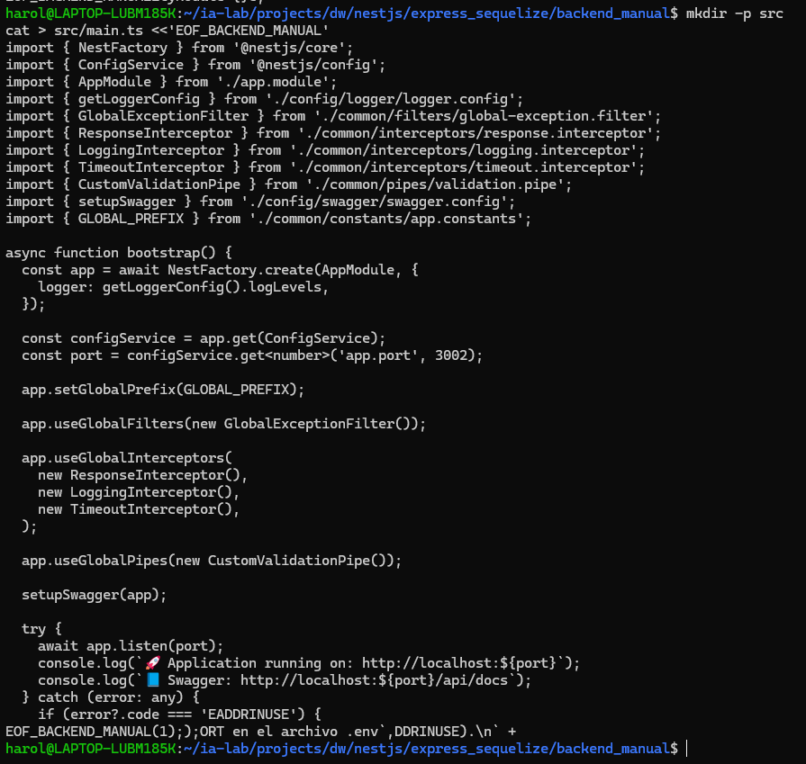
#### 6.43 — Actualizar app.module.ts (base sin features ni guards)

Cablea Config + Sequelize + Security + Logger. Business/Auth y guards llegan en fases posteriores.

**Archivo:** `src/app.module.ts`

```bash
mkdir -p src
cat > src/app.module.ts <<'EOF_BACKEND_MANUAL'
import { Module } from '@nestjs/common';
import { ConfigModule } from '@nestjs/config';
import { envConfig } from './config/environment/env.config';
import { appConfig } from './config/app/app.config';
import { jwtConfig } from './config/jwt/jwt.config';
import { LoggerModule } from './config/logger/logger.module';
import { SequelizeDatabaseModule } from './infrastructure/database/sequelize/sequelize.module';
import { SecurityModule } from './infrastructure/security/security.module';
import { AppController } from './app.controller';
import { AppService } from './app.service';

@Module({
  imports: [
    ConfigModule.forRoot({
      isGlobal: true,
      load: [envConfig, appConfig, jwtConfig],
      envFilePath: '.env',
    }),
    SequelizeDatabaseModule,
    SecurityModule,
    LoggerModule,
  ],
  controllers: [AppController],
  providers: [
    AppService,
  ],
})
export class AppModule {}
EOF_BACKEND_MANUAL
```
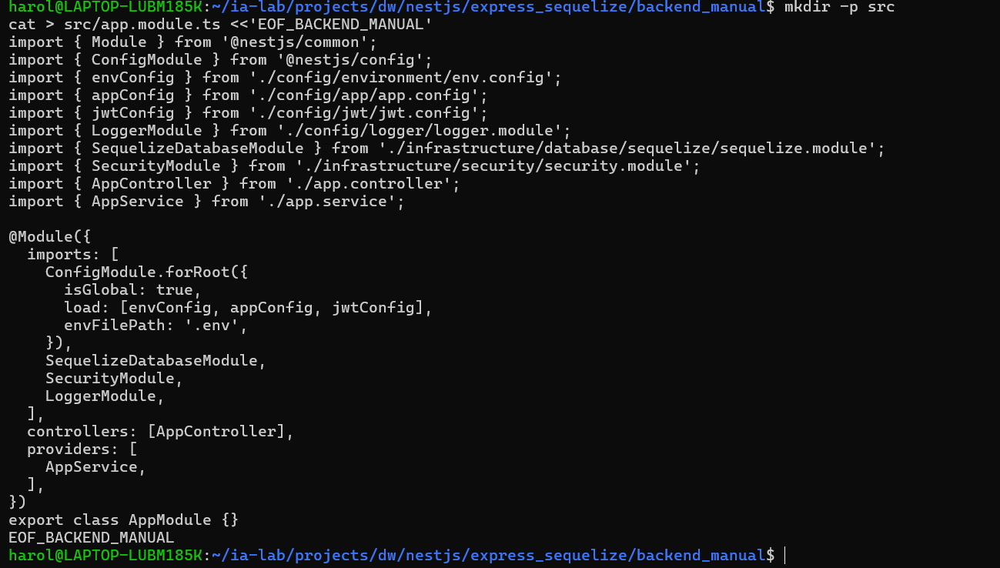

#### 6.44 — Verificar bootstrap transversal

La app debe arrancar, mostrar Swagger en `/api/docs` y conectar a BD. Todavía no hay endpoints de negocio.

```bash
npm run start:dev
# Abre http://localhost:3002/api/docs
# Ctrl+C
```
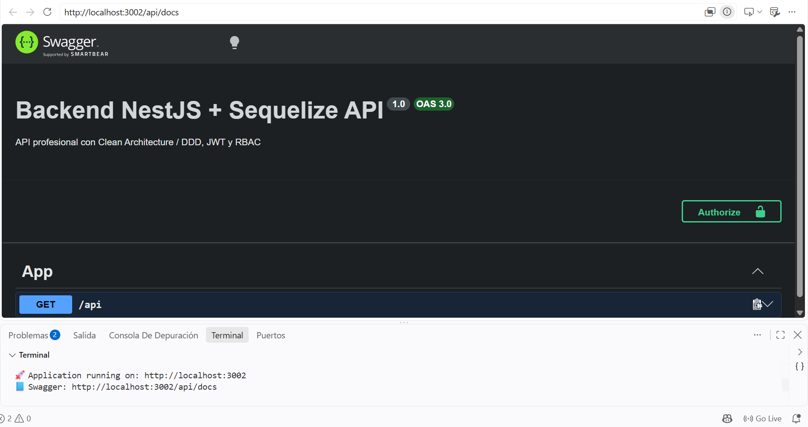
------------------------------------------------------------------------

## FASE 7 — `06_BUSINESS_CLIENTS`

### Business — Clients (patrón completo CA)

> **Objetivo de la fase:** Primera entidad de negocio. Orden lógico: dominio → infraestructura → aplicación → presentación → módulo → cableado → verificación.

#### 7.1 — features/business/clients/domain/entities/client.entity.ts

Entidad de dominio (TypeScript puro). No extiende Sequelize `Model`. Aquí viven las reglas del negocio.

**Archivo:** `src/features/business/clients/domain/entities/client.entity.ts`

```bash
mkdir -p src/features/business/clients/domain/entities
cat > src/features/business/clients/domain/entities/client.entity.ts <<'EOF_BACKEND_MANUAL'
import { Status } from '../../../../../common/enums/status.enum';
import { isValidEmail } from '../validators/client-email.validator';
import { isValidPhone } from '../validators/client-phone.validator';

export interface ClientProps {
  id?: number;
  name: string;
  address?: string;
  phone?: string;
  email?: string;
  password?: string;
  status?: Status;
  createdAt?: Date;
  updatedAt?: Date;
}

export class Client {
  id?: number;
  name: string;
  address?: string;
  phone?: string;
  email?: string;
  password?: string;
  status: Status;
  createdAt?: Date;
  updatedAt?: Date;

  private constructor(props: ClientProps) {
    this.id = props.id;
    this.name = props.name;
    this.address = props.address;
    this.phone = props.phone;
    this.email = props.email;
    this.password = props.password;
    this.status = props.status ?? Status.ACTIVE;
    this.createdAt = props.createdAt;
    this.updatedAt = props.updatedAt;
  }

  static create(
    props: Omit<ClientProps, 'id' | 'status' | 'createdAt' | 'updatedAt'>,
  ): Client {
    if (!props.name?.trim()) {
      throw new Error('El nombre del cliente es requerido');
    }

    if (props.email && !isValidEmail(props.email)) {
      throw new Error('El email del cliente no es válido');
    }

    if (props.phone && !isValidPhone(props.phone)) {
      throw new Error('El teléfono del cliente no es válido');
    }

    return new Client(props);
  }

  static reconstitute(props: ClientProps): Client {
    return new Client(props);
  }

  update(
    props: Partial<
      Omit<ClientProps, 'id' | 'status' | 'createdAt' | 'updatedAt'>
    >,
  ): void {
    if (props.name !== undefined) {
      if (!props.name.trim()) {
        throw new Error('El nombre del cliente es requerido');
      }
      this.name = props.name;
    }

    if (props.address !== undefined) {
      this.address = props.address;
    }

    if (props.phone !== undefined) {
      if (props.phone && !isValidPhone(props.phone)) {
        throw new Error('El teléfono del cliente no es válido');
      }
      this.phone = props.phone;
    }

    if (props.email !== undefined) {
      if (props.email && !isValidEmail(props.email)) {
        throw new Error('El email del cliente no es válido');
      }
      this.email = props.email;
    }

    if (props.password !== undefined) {
      this.password = props.password;
    }
  }

  deactivate(): void {
    this.status = Status.INACTIVE;
  }
}
EOF_BACKEND_MANUAL
```
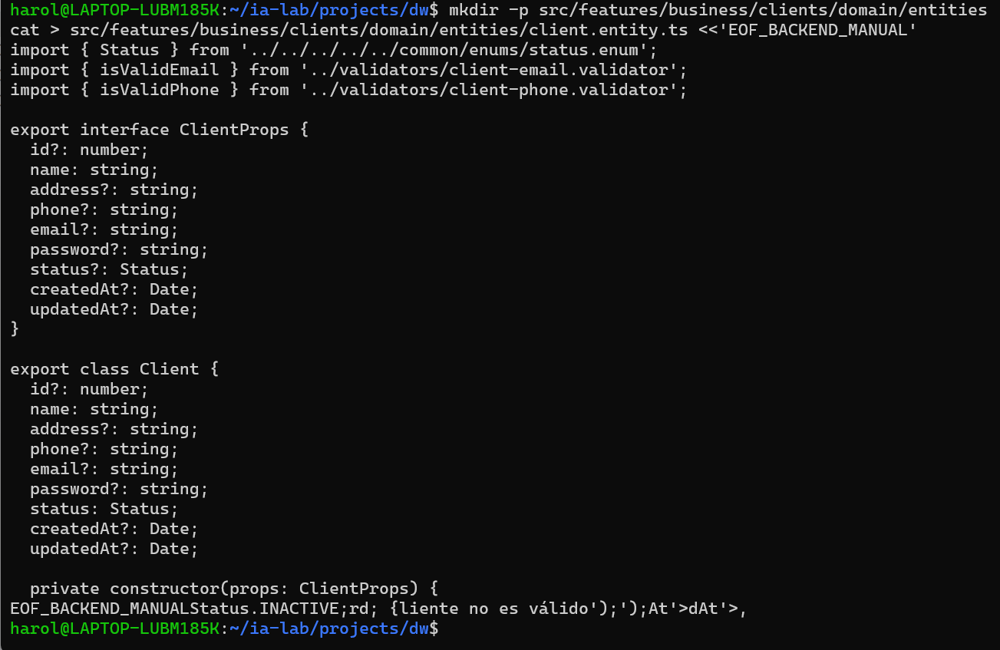

#### 7.2 — features/business/clients/domain/exceptions/client-email-already-exists.exception.ts

Excepción de dominio. El caso de uso la lanza; el filter HTTP la traduce a status code.

**Archivo:** `src/features/business/clients/domain/exceptions/client-email-already-exists.exception.ts`

```bash
mkdir -p src/features/business/clients/domain/exceptions
cat > src/features/business/clients/domain/exceptions/client-email-already-exists.exception.ts <<'EOF_BACKEND_MANUAL'
import { DomainException } from '../../../../../common/exceptions/domain.exception';

export class ClientEmailAlreadyExistsException extends DomainException {
  constructor(email: string) {
    super(`El email '${email}' ya está registrado`);
  }
}
EOF_BACKEND_MANUAL
```
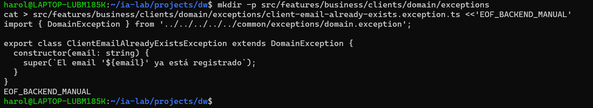

#### 7.3 — features/business/clients/domain/exceptions/client-not-found.exception.ts

Excepción de dominio. El caso de uso la lanza; el filter HTTP la traduce a status code.

**Archivo:** `src/features/business/clients/domain/exceptions/client-not-found.exception.ts`

```bash
mkdir -p src/features/business/clients/domain/exceptions
cat > src/features/business/clients/domain/exceptions/client-not-found.exception.ts <<'EOF_BACKEND_MANUAL'
import { EntityNotFoundException } from '../../../../../common/exceptions/entity-not-found.exception';

export class ClientNotFoundException extends EntityNotFoundException {
  constructor(id: number) {
    super('Cliente', id);
  }
}
EOF_BACKEND_MANUAL
```
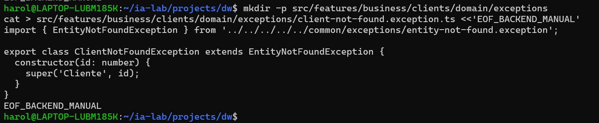

#### 7.4 — features/business/clients/domain/interfaces/client-repository.interface.ts

Puerto (contrato) del repositorio. La aplicación depende de esta interface, no de Sequelize.

**Archivo:** `src/features/business/clients/domain/interfaces/client-repository.interface.ts`

```bash
mkdir -p src/features/business/clients/domain/interfaces
cat > src/features/business/clients/domain/interfaces/client-repository.interface.ts <<'EOF_BACKEND_MANUAL'
import { PaginatedResult } from '../../../../../common/interfaces/pagination.interface';
import { Client } from '../entities/client.entity';

export const CLIENT_REPOSITORY = 'CLIENT_REPOSITORY';

export interface ClientFindAllParams {
  page?: number;
  limit?: number;
  search?: string;
}

export interface IClientRepository {
  create(client: Client): Promise<Client>;
  update(client: Client): Promise<Client>;
  delete(id: number): Promise<void>;
  findById(id: number): Promise<Client | null>;
  findByEmail(email: string): Promise<Client | null>;
  findAll(params: ClientFindAllParams): Promise<PaginatedResult<Client>>;
}
EOF_BACKEND_MANUAL
```
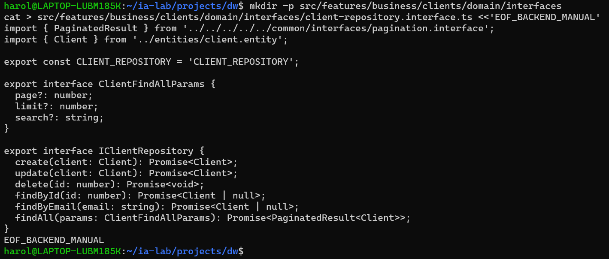

#### 7.5 — features/business/clients/domain/validators/client-email.validator.ts

Validador de dominio reutilizable (reglas independientes del framework HTTP).

**Archivo:** `src/features/business/clients/domain/validators/client-email.validator.ts`

```bash
mkdir -p src/features/business/clients/domain/validators
cat > src/features/business/clients/domain/validators/client-email.validator.ts <<'EOF_BACKEND_MANUAL'
export function isValidEmail(email: string): boolean {
  const emailRegex = /^[^\s@]+@[^\s@]+\.[^\s@]+$/;
  return emailRegex.test(email);
}
EOF_BACKEND_MANUAL
```
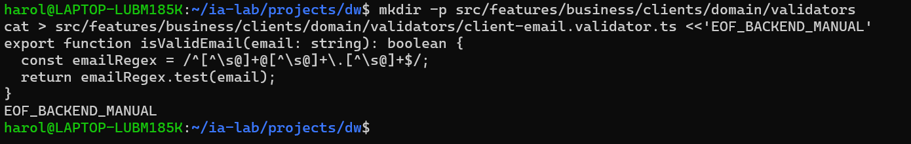


#### 7.6 — features/business/clients/domain/validators/client-phone.validator.ts

Validador de dominio reutilizable (reglas independientes del framework HTTP).

**Archivo:** `src/features/business/clients/domain/validators/client-phone.validator.ts`

```bash
mkdir -p src/features/business/clients/domain/validators
cat > src/features/business/clients/domain/validators/client-phone.validator.ts <<'EOF_BACKEND_MANUAL'
export function isValidPhone(phone: string): boolean {
  const phoneRegex = /^[+]?[\d\s()-]{7,20}$/;
  return phoneRegex.test(phone);
}
EOF_BACKEND_MANUAL
```
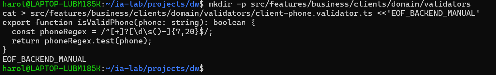

#### 7.7 — features/business/clients/infrastructure/persistence/models/client.model.ts

Modelo Sequelize (`@Table`). Solo infraestructura: mapeo a tabla física.

**Archivo:** `src/features/business/clients/infrastructure/persistence/models/client.model.ts`

```bash
mkdir -p src/features/business/clients/infrastructure/persistence/models
cat > src/features/business/clients/infrastructure/persistence/models/client.model.ts <<'EOF_BACKEND_MANUAL'
import {
  AutoIncrement,
  Column,
  CreatedAt,
  DataType,
  HasMany,
  Model,
  PrimaryKey,
  Table,
  UpdatedAt,
} from 'sequelize-typescript';
import { Status } from '../../../../../../common/enums/status.enum';

@Table({ tableName: 'clients' })
export class ClientModel extends Model {
  @PrimaryKey
  @AutoIncrement
  @Column(DataType.INTEGER)
  declare id: number;

  @Column({ type: DataType.STRING(150), allowNull: false })
  declare name: string;

  @Column({ type: DataType.STRING(255), allowNull: true })
  declare address: string | null;

  @Column({ type: DataType.STRING(30), allowNull: true })
  declare phone: string | null;

  @Column({ type: DataType.STRING(150), allowNull: true, unique: true })
  declare email: string | null;

  @Column({ type: DataType.STRING(255), allowNull: true })
  declare password: string | null;

  @Column({
    type: DataType.ENUM(...Object.values(Status)),
    allowNull: false,
    defaultValue: Status.ACTIVE,
  })
  declare status: Status;

  @CreatedAt
  declare createdAt: Date;

  @UpdatedAt
  declare updatedAt: Date;

  @HasMany(() => require('../../../../sales/infrastructure/persistence/models/sale.model').SaleModel)
  declare sales: unknown[];
}
EOF_BACKEND_MANUAL
```
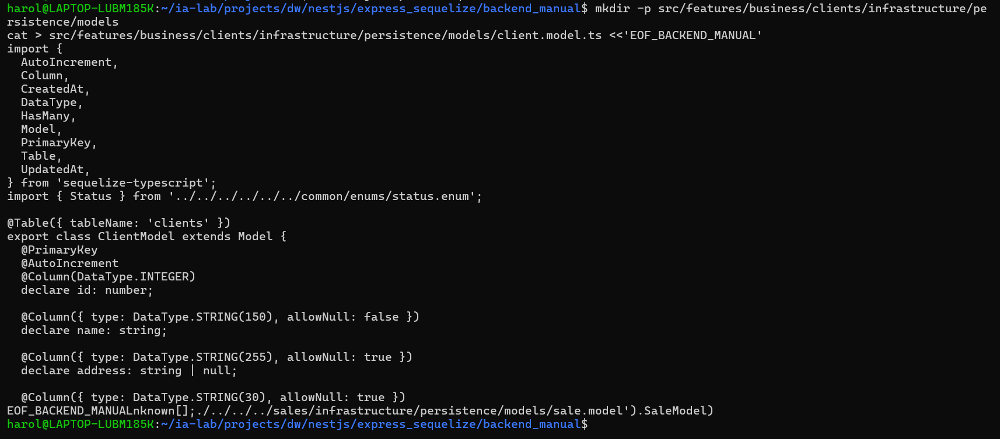

#### 7.8 — features/business/clients/infrastructure/persistence/repositories/client.repository.ts

Adaptador del repositorio: implementa el puerto de dominio con Sequelize.

**Archivo:** `src/features/business/clients/infrastructure/persistence/repositories/client.repository.ts`

```bash
mkdir -p src/features/business/clients/infrastructure/persistence/repositories
cat > src/features/business/clients/infrastructure/persistence/repositories/client.repository.ts <<'EOF_BACKEND_MANUAL'
import { Injectable } from '@nestjs/common';
import { Op } from 'sequelize';
import {
  buildPaginatedResult,
  normalizePagination,
} from '../../../../../../common/utils/pagination.util';
import { Client } from '../../../domain/entities/client.entity';
import {
  ClientFindAllParams,
  IClientRepository,
} from '../../../domain/interfaces/client-repository.interface';
import { ClientMapper } from '../../../application/mappers/client.mapper';
import { ClientModel } from '../models/client.model';

@Injectable()
export class ClientRepository implements IClientRepository {
  async create(client: Client): Promise<Client> {
    const model = await ClientModel.create(ClientMapper.toPersistence(client));
    return ClientMapper.toDomain(model);
  }

  async update(client: Client): Promise<Client> {
    await ClientModel.update(ClientMapper.toPersistence(client), {
      where: { id: client.id },
    });
    const updated = await ClientModel.findByPk(client.id!);
    return ClientMapper.toDomain(updated!);
  }

  async delete(id: number): Promise<void> {
    await ClientModel.destroy({ where: { id } });
  }

  async findById(id: number): Promise<Client | null> {
    const model = await ClientModel.findByPk(id);
    return model ? ClientMapper.toDomain(model) : null;
  }

  async findByEmail(email: string): Promise<Client | null> {
    const model = await ClientModel.findOne({ where: { email } });
    return model ? ClientMapper.toDomain(model) : null;
  }

  async findAll(params: ClientFindAllParams) {
    const { page, limit, offset } = normalizePagination(
      params.page,
      params.limit,
    );

    const where = params.search
      ? {
          [Op.or]: [
            { name: { [Op.like]: `%${params.search}%` } },
            { email: { [Op.like]: `%${params.search}%` } },
          ],
        }
      : {};

    const { rows, count } = await ClientModel.findAndCountAll({
      where,
      limit,
      offset,
      order: [['createdAt', 'DESC']],
    });

    return buildPaginatedResult(
      rows.map((row) => ClientMapper.toDomain(row)),
      count,
      page,
      limit,
    );
  }
}
EOF_BACKEND_MANUAL
```
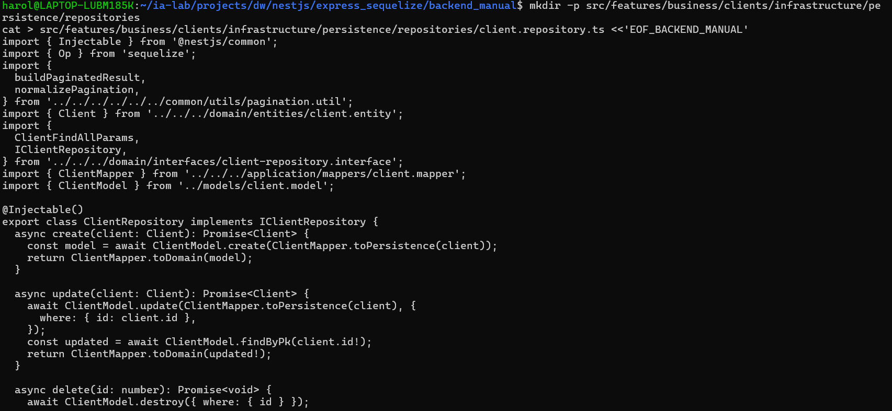

#### 7.9 — features/business/clients/infrastructure/persistence/migrations/create-clients-table.migration.ts

Migración documental/auxiliar de la tabla. En dev el sync de Sequelize crea el esquema.

**Archivo:** `src/features/business/clients/infrastructure/persistence/migrations/create-clients-table.migration.ts`

```bash
mkdir -p src/features/business/clients/infrastructure/persistence/migrations
cat > src/features/business/clients/infrastructure/persistence/migrations/create-clients-table.migration.ts <<'EOF_BACKEND_MANUAL'
export const createClientsTableMigration = {
  name: 'create-clients-table',
  async up(): Promise<void> {
    // Sequelize sync handles table creation in development.
    // Production: CREATE TABLE clients (id, name, address, phone, email, password, status, createdAt, updatedAt)
  },
  async down(): Promise<void> {
    // Production: DROP TABLE clients
  },
};
EOF_BACKEND_MANUAL
```
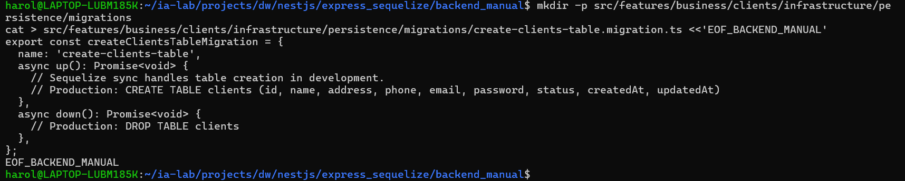

#### 7.10 — features/business/clients/infrastructure/persistence/seeders/clients.seeder.ts

Seeder de datos iniciales para desarrollo y verificación física en BD.

**Archivo:** `src/features/business/clients/infrastructure/persistence/seeders/clients.seeder.ts`

```bash
mkdir -p src/features/business/clients/infrastructure/persistence/seeders
cat > src/features/business/clients/infrastructure/persistence/seeders/clients.seeder.ts <<'EOF_BACKEND_MANUAL'
import { ClientModel } from '../models/client.model';
import { BcryptPasswordHasherService } from '../../../../../../infrastructure/security/hashing/bcrypt-password-hasher.service';
import { Status } from '../../../../../../common/enums/status.enum';

export async function seedClients(): Promise<void> {
  const count = await ClientModel.count();
  if (count > 0) {
    return;
  }

  const hasher = new BcryptPasswordHasherService();

  await ClientModel.bulkCreate([
    {
      name: 'Juan Pérez',
      address: 'Calle Principal 123',
      phone: '+57 300 1234567',
      email: 'juan.perez@example.com',
      password: await hasher.hash('password123'),
      status: Status.ACTIVE,
    },
    {
      name: 'María García',
      address: 'Av. Central 456',
      phone: '+57 310 9876543',
      email: 'maria.garcia@example.com',
      password: await hasher.hash('password123'),
      status: Status.ACTIVE,
    },
  ]);
}
EOF_BACKEND_MANUAL
```
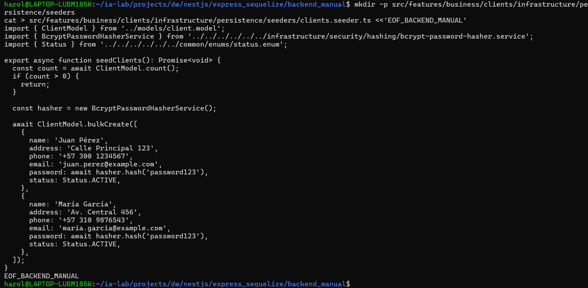


#### 7.11 — features/business/clients/application/dto/client-filter.dto.ts

DTO de entrada/salida HTTP con `class-validator` / Swagger.

**Archivo:** `src/features/business/clients/application/dto/client-filter.dto.ts`

```bash
mkdir -p src/features/business/clients/application/dto
cat > src/features/business/clients/application/dto/client-filter.dto.ts <<'EOF_BACKEND_MANUAL'
import { ApiPropertyOptional } from '@nestjs/swagger';
import { Type } from 'class-transformer';
import { IsInt, IsOptional, IsPositive, IsString, Min } from 'class-validator';

export class ClientFilterDto {
  @ApiPropertyOptional({ example: 1, default: 1 })
  @IsOptional()
  @Type(() => Number)
  @IsInt()
  @Min(1)
  page?: number;

  @ApiPropertyOptional({ example: 10, default: 10 })
  @IsOptional()
  @Type(() => Number)
  @IsInt()
  @IsPositive()
  limit?: number;

  @ApiPropertyOptional({ example: 'juan' })
  @IsOptional()
  @IsString()
  search?: string;
}
EOF_BACKEND_MANUAL
```
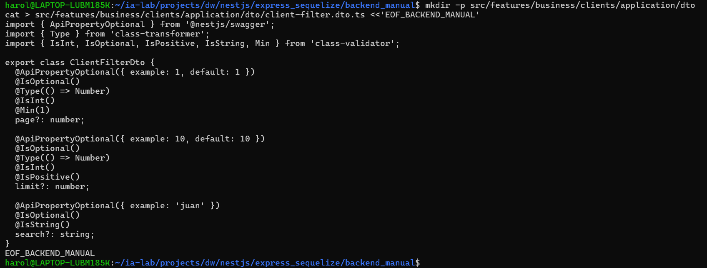

#### 7.12 — features/business/clients/application/dto/client-response.dto.ts

DTO de entrada/salida HTTP con `class-validator` / Swagger.

**Archivo:** `src/features/business/clients/application/dto/client-response.dto.ts`

```bash
mkdir -p src/features/business/clients/application/dto
cat > src/features/business/clients/application/dto/client-response.dto.ts <<'EOF_BACKEND_MANUAL'
import { ApiProperty, ApiPropertyOptional } from '@nestjs/swagger';
import { Status } from '../../../../../common/enums/status.enum';

export class ClientResponseDto {
  @ApiProperty({ example: 1 })
  id: number;

  @ApiProperty({ example: 'Juan Pérez' })
  name: string;

  @ApiPropertyOptional({ example: 'Calle Principal 123' })
  address?: string;

  @ApiPropertyOptional({ example: '+57 300 1234567' })
  phone?: string;

  @ApiPropertyOptional({ example: 'juan.perez@example.com' })
  email?: string;

  @ApiProperty({ enum: Status, example: Status.ACTIVE })
  status: Status;

  @ApiProperty()
  createdAt: Date;

  @ApiProperty()
  updatedAt: Date;
}
EOF_BACKEND_MANUAL
```
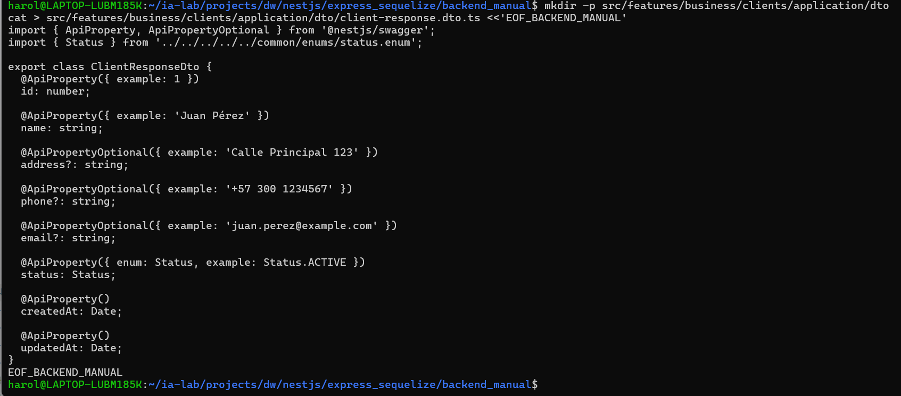

#### 7.13 — features/business/clients/application/dto/create-client.dto.ts

DTO de entrada/salida HTTP con `class-validator` / Swagger.

**Archivo:** `src/features/business/clients/application/dto/create-client.dto.ts`

```bash
mkdir -p src/features/business/clients/application/dto
cat > src/features/business/clients/application/dto/create-client.dto.ts <<'EOF_BACKEND_MANUAL'
import { ApiProperty, ApiPropertyOptional } from '@nestjs/swagger';
import {
  IsEmail,
  IsNotEmpty,
  IsOptional,
  IsString,
  MaxLength,
  MinLength,
} from 'class-validator';

export class CreateClientDto {
  @ApiProperty({ example: 'Juan Pérez' })
  @IsString()
  @IsNotEmpty()
  @MaxLength(150)
  name: string;

  @ApiPropertyOptional({ example: 'Calle Principal 123' })
  @IsOptional()
  @IsString()
  @MaxLength(255)
  address?: string;

  @ApiPropertyOptional({ example: '+57 300 1234567' })
  @IsOptional()
  @IsString()
  @MaxLength(30)
  phone?: string;

  @ApiPropertyOptional({ example: 'juan.perez@example.com' })
  @IsOptional()
  @IsEmail()
  @MaxLength(150)
  email?: string;

  @ApiPropertyOptional({ example: 'password123' })
  @IsOptional()
  @IsString()
  @MinLength(6)
  @MaxLength(255)
  password?: string;
}
EOF_BACKEND_MANUAL
```
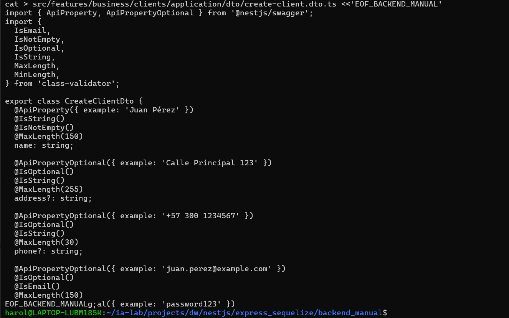

#### 7.14 — features/business/clients/application/dto/update-client.dto.ts

DTO de entrada/salida HTTP con `class-validator` / Swagger.

**Archivo:** `src/features/business/clients/application/dto/update-client.dto.ts`

```bash
mkdir -p src/features/business/clients/application/dto
cat > src/features/business/clients/application/dto/update-client.dto.ts <<'EOF_BACKEND_MANUAL'
import { PartialType } from '@nestjs/mapped-types';
import { CreateClientDto } from './create-client.dto';

export class UpdateClientDto extends PartialType(CreateClientDto) {}
EOF_BACKEND_MANUAL
```
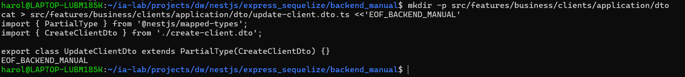