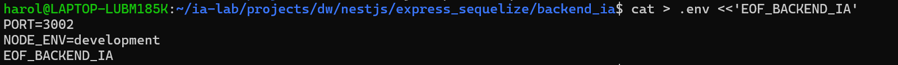
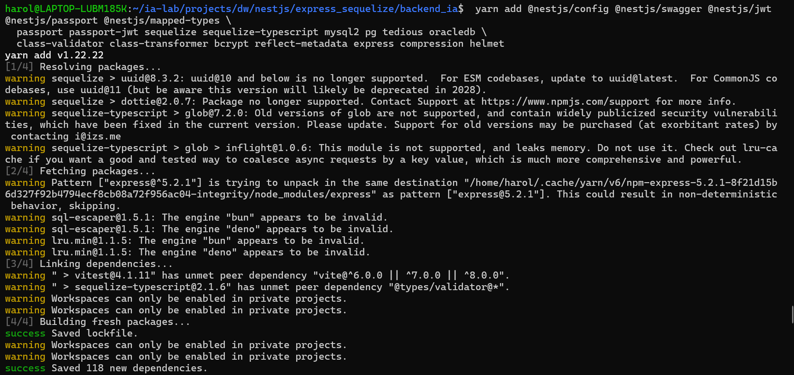
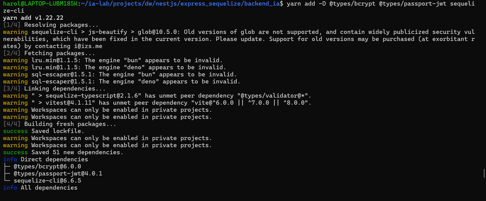
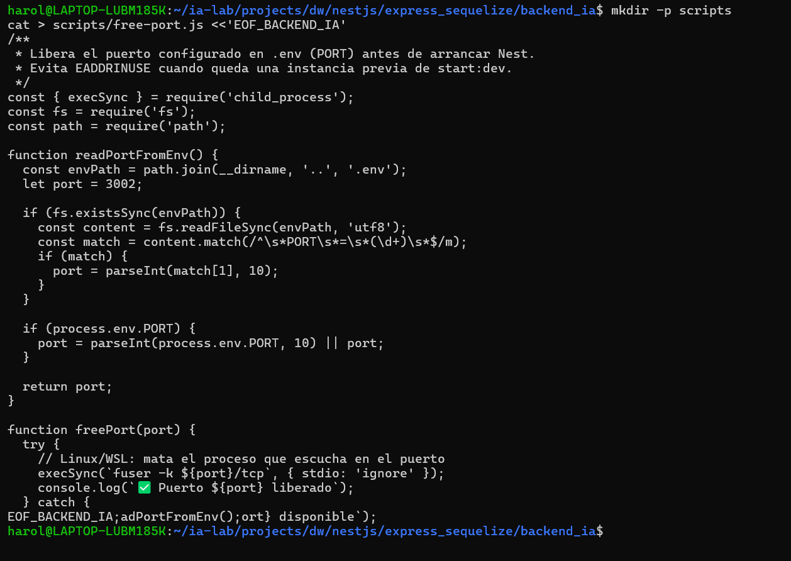
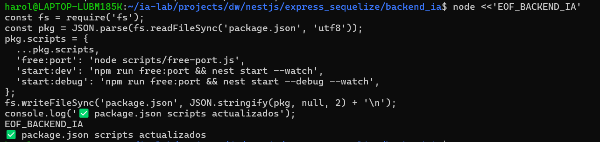

# documentacion actividad parcial

## FASE 1 — `00_BASE_INIT_NESTJS`

#### 1.1 — Crear carpetas padre y permisos

Prepara la ruta de trabajo en WSL. Los permisos evitan fallos de escritura del CLI.

```bash
mkdir -p /home/portatiljq/apps/dlloweb/nestjs/express_sequelize
chmod -R 755 /home/portatiljq/apps/dlloweb/nestjs/express_sequelize
```


#### 1.2 — Instalar Nest CLI (si no existe)

El CLI genera `main.ts`, `app.module.ts`, `tsconfig`, scripts npm, etc.

```bash
npm install -g @nestjs/cli
nest --version
```

#### 1.3 — Crear proyecto NestJS

Usamos el nombre `backend_ia` (workspace didáctico). Responde las preguntas del CLI (package manager: npm).

```bash
cd /home/portatiljq/apps/dlloweb/nestjs/express_sequelize
nest new backend_ia
cd backend_ia
```


#### 1.4 — Crear `.env` mínimo (puerto)

El puerto `3002` evita choques con el 3000. Más adelante el `.env` crecerá con BD y JWT.

```bash
cat > .env <<'EOF_BACKEND_IA'
PORT=3002
NODE_ENV=development
EOF_BACKEND_IA
```


#### 1.5 — Commit inicial del esqueleto

Congela el punto de partida reproducible.

```bash
git init
git add .
git commit -m "chore: inicialización del proyecto NestJS"
```

------------------------------------------------------------------------

## FASE 2 — `01_BASE_DEPS_Y_PUERTO`

### Dependencias + manejo de puerto (EADDRINUSE)

> **Objetivo de la fase:** Instalar el stack profesional y evitar que un `start:dev` colgado bloquee el puerto.

#### 2.1 — Dependencias de producción

Config, Swagger, JWT/Passport, Sequelize + drivers de 4 motores, validación, bcrypt y utilidades HTTP.

```bash
 yarn add @nestjs/config @nestjs/swagger @nestjs/jwt @nestjs/passport @nestjs/mapped-types \
  passport passport-jwt sequelize sequelize-typescript mysql2 pg tedious oracledb \
  class-validator class-transformer bcrypt reflect-metadata express compression helmet
```


#### 2.2 — Dependencias de desarrollo

Tipados y sequelize-cli para herramientas de BD.

```bash
yarn add -D @types/bcrypt @types/passport-jwt sequelize-cli
```


#### 2.3 — Script para liberar puerto (evita EADDRINUSE)

Si reinicias Nest sin matar el proceso anterior, Node lanza `listen EADDRINUSE`. Este script lee `PORT` del `.env` y libera el puerto en Linux/WSL.

```bash
mkdir -p scripts
cat > scripts/free-port.js <<'EOF_BACKEND_IA'
/**
 * Libera el puerto configurado en .env (PORT) antes de arrancar Nest.
 * Evita EADDRINUSE cuando queda una instancia previa de start:dev.
 */
const { execSync } = require('child_process');
const fs = require('fs');
const path = require('path');

function readPortFromEnv() {
  const envPath = path.join(__dirname, '..', '.env');
  let port = 3002;

  if (fs.existsSync(envPath)) {
    const content = fs.readFileSync(envPath, 'utf8');
    const match = content.match(/^\s*PORT\s*=\s*(\d+)\s*$/m);
    if (match) {
      port = parseInt(match[1], 10);
    }
  }

  if (process.env.PORT) {
    port = parseInt(process.env.PORT, 10) || port;
  }

  return port;
}

function freePort(port) {
  try {
    // Linux/WSL: mata el proceso que escucha en el puerto
    execSync(`fuser -k ${port}/tcp`, { stdio: 'ignore' });
    console.log(`✅ Puerto ${port} liberado`);
  } catch {
    // No había proceso escuchando: ok
    console.log(`ℹ️  Puerto ${port} disponible`);
  }
}

const port = readPortFromEnv();
freePort(port);
EOF_BACKEND_IA
```


#### 2.4 — Actualizar scripts npm en package.json

Integra `free:port` en `start:dev` / `start:debug`. Aplica el cambio con Node para no editar JSON a mano.

```bash
node <<'EOF_BACKEND_IA'
const fs = require('fs');
const pkg = JSON.parse(fs.readFileSync('package.json', 'utf8'));
pkg.scripts = {
  ...pkg.scripts,
  'free:port': 'node scripts/free-port.js',
  'start:dev': 'npm run free:port && nest start --watch',
  'start:debug': 'npm run free:port && nest start --debug --watch',
};
fs.writeFileSync('package.json', JSON.stringify(pkg, null, 2) + '\n');
console.log('✅ package.json scripts actualizados');
EOF_BACKEND_IA
```
