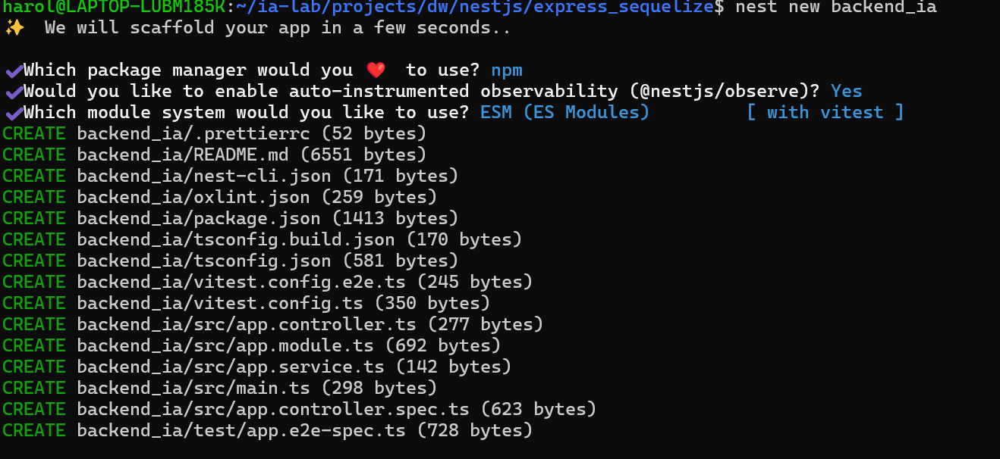

# documentacion actividad parcial

## FASE 1 — `00_BASE_INIT_NESTJS`

#### 1.1 — Crear carpetas padre y permisos

Prepara la ruta de trabajo en WSL. Los permisos evitan fallos de escritura del CLI.

```bash
mkdir -p /home/portatiljq/apps/dlloweb/nestjs/express_sequelize
chmod -R 755 /home/portatiljq/apps/dlloweb/nestjs/express_sequelize
```


#### 1.2 — Instalar Nest CLI (si no existe)

El CLI genera `main.ts`, `app.module.ts`, `tsconfig`, scripts npm, etc.

```bash
npm install -g @nestjs/cli
nest --version
```

#### 1.3 — Crear proyecto NestJS

Usamos el nombre `backend_ia` (workspace didáctico). Responde las preguntas del CLI (package manager: npm).

```bash
cd /home/portatiljq/apps/dlloweb/nestjs/express_sequelize
nest new backend_ia
cd backend_ia
```
