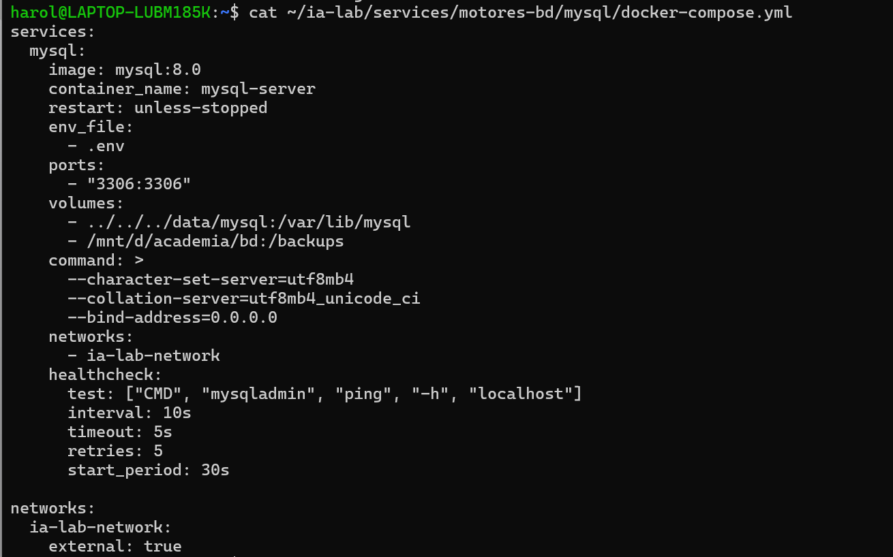
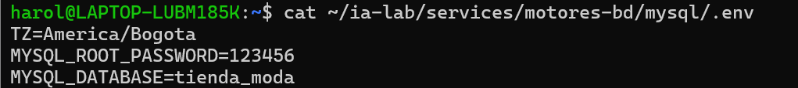
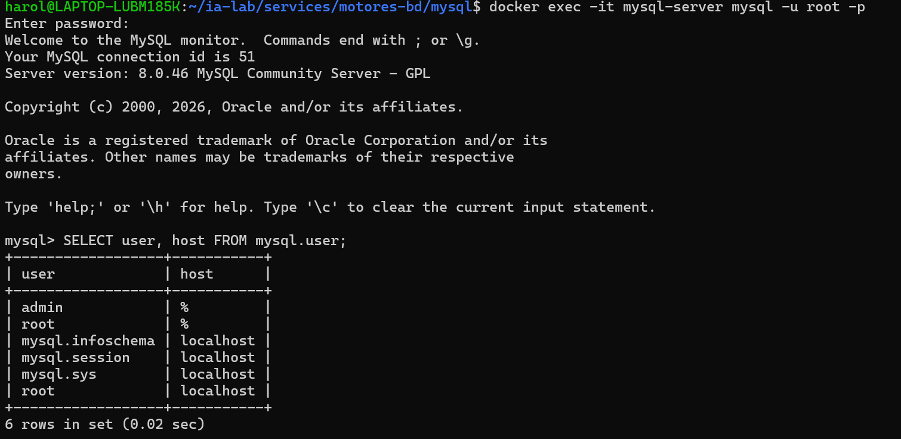
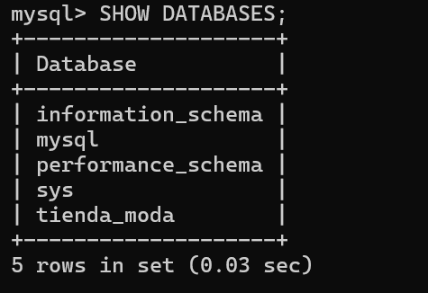
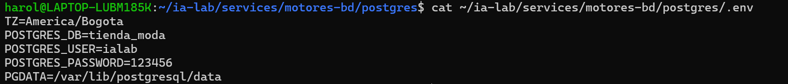
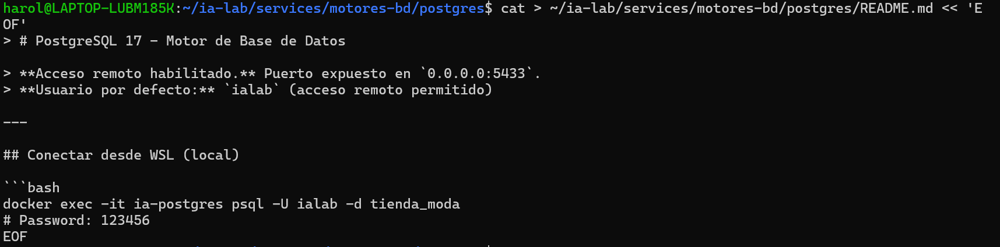
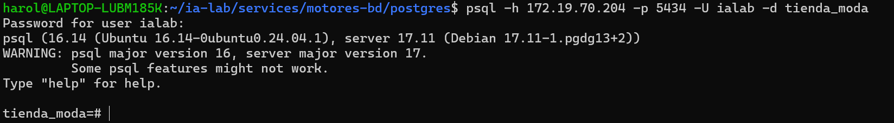
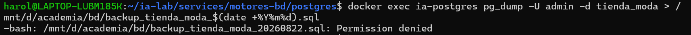
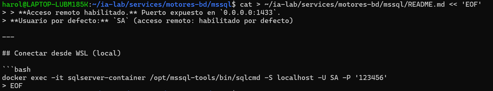

# documentacion desarrollo web

## 1. Requisitos previos 
- WSL2 instalado y funcionando
- Docker funcionando dentro de WSL
- Acceso a terminal bash en WSL

Instalar Docker y Compose

``` bash
sudo apt update
# Add Docker's official GPG key:
sudo apt-get update
sudo apt-get install ca-certificates curl
sudo install -m 0755 -d /etc/apt/keyrings
sudo curl -fsSL https://download.docker.com/linux/ubuntu/gpg -o /etc/apt/keyrings/docker.asc
sudo chmod a+r /etc/apt/keyrings/docker.asc

# Add the repository to Apt sources:
echo \
  "deb [arch=$(dpkg --print-architecture) signed-by=/etc/apt/keyrings/docker.asc] https://download.docker.com/linux/ubuntu \
  $(. /etc/os-release && echo "${UBUNTU_CODENAME:-$VERSION_CODENAME}") stable" | \
  sudo tee /etc/apt/sources.list.d/docker.list > /dev/null
sudo apt-get update
```

``` bash
sudo systemctl stop unattended-upgrades
sudo apt install docker-compose-plugin
```

Verifica Docker:

``` bash
sudo docker --version
sudo docker compose version
```

## 2. Crear Carpetas

Abre tu terminal WSL y ejecuta:

``` bash
mkdir -p ~/ia-lab/services/motores-bd/{mysql,postgres,mssql,oracle}
mkdir -p ~/ia-lab/data/{mysql,postgres,mssql,oracle}
```

Verifica la estructura:

``` bash
tree ~/ia-lab/
```

Debería verse así, teniendo en cuenta que ya se realizo mysql:
```
/home/harol/ia-lab/
├── data
│   ├── mssql
│   ├── mysql
│   │   ├── #ib_16384_0.dblwr
│   │   ├── #ib_16384_1.dblwr
│   │   ├── #innodb_redo  [error opening dir]
│   │   ├── #innodb_temp  [error opening dir]
│   │   ├── auto.cnf
│   │   ├── binlog.000001
│   │   ├── binlog.000002
│   │   ├── binlog.000003
│   │   ├── binlog.000004
│   │   ├── binlog.000005
│   │   ├── binlog.index
│   │   ├── ca-key.pem
│   │   ├── ca.pem
│   │   ├── client-cert.pem
│   │   ├── client-key.pem
│   │   ├── ib_buffer_pool
│   │   ├── ibdata1
│   │   ├── mysql  [error opening dir]
│   │   ├── mysql.ibd
│   │   ├── mysql.sock -> /var/run/mysqld/mysqld.sock
│   │   ├── performance_schema  [error opening dir]
│   │   ├── private_key.pem
│   │   ├── public_key.pem
│   │   ├── server-cert.pem
│   │   ├── server-key.pem
│   │   ├── sys  [error opening dir]
│   │   ├── tienda_moda  [error opening dir]
│   │   ├── undo_001
│   │   └── undo_002
│   ├── oracle
│   └── postgres
└── services
    └── motores-bd
        ├── mssql
        ├── mysql
        │   └── docker-compose.yml
        ├── oracle
        └── postgres
```
## 3. Crear la Red Docker Compartida
Todos los contenedores compartirán una misma red Docker para comunicarse entre sí:

``` bash
docker network inspect ia-lab-network >/dev/null 2>&1 || docker network create ia-lab-network
```

Verifica que se creó:

``` bash
docker network ls | grep ia-lab
```

Debe salir algo como esto:

``` bash
17a82dc0da39   ia-lab-network   bridge    local
```
## My sql
## 4.1 En mysql Crear el archivo docker-compose.yml
``` bash
cat > ~/ia-lab/services/motores-bd/mysql/docker-compose.yml << 'EOF'
services:
  mysql:
    image: mysql:8.0
    container_name: mysql-server
    restart: unless-stopped
    env_file:
      - .env
    ports:
      - "3306:3306"
    volumes:
      - ../../../data/mysql:/var/lib/mysql
      - /mnt/d/academia/bd:/backups
    command: >
      --character-set-server=utf8mb4
      --collation-server=utf8mb4_unicode_ci
      --bind-address=0.0.0.0
    networks:
      - ia-lab-network
    healthcheck:
      test: ["CMD", "mysqladmin", "ping", "-h", "localhost"]
      interval: 10s
      timeout: 5s
      retries: 5
      start_period: 30s

networks:
  ia-lab-network:
    external: true
EOF
```
verificamos con:
``` bash
cat ~/ia-lab/services/motores-bd/mysql/docker-compose.yml
```


## 4.2 Crear el archivo .env
``` bash
cat > ~/ia-lab/services/motores-bd/mysql/.env << 'EOF'
TZ=America/Bogota
MYSQL_ROOT_PASSWORD=123456
MYSQL_DATABASE=ienda_moda
EOF
```
verificamos con:
``` bash
cat ~/ia-lab/services/motores-bd/mysql/.env
```

## 4.3 Crear README.md

``` bash
cat > ~/ia-lab/services/motores-bd/mysql/README.md << 'EOF'
# MySQL 8.0 - Motor de Base de Datos

> **Acceso remoto habilitado.** Puerto expuesto en `0.0.0.0:3306`.
> **Usuario por defecto:** `root` (acceso remoto: `%`)

---

## Conectar desde WSL (local)

```bash
docker exec -it mysql-server mysql -u root -p
# Password: 123456
```
verificar con:
```bash
cat ~/ia-lab/services/motores-bd/mysql/README.md
```
## Conectar remotamente desde cualquier equipo
Reemplaza `IP_SERVIDOR` por la IP de la maquina WSL:

``` bash
mysql -h 172.18.0.1 -P 3306 -u root -p
```

O con cliente grafico (MySQL Workbench, DBeaver, HeidiSQL): - **Host:** `IP_SERVIDOR` - **Port:** `3306` - **User:** `root` - **Password:** `MiNiCo57**`

## Crear un usuario PROPIO con ACCESO REMOTO

Conectate primero como root, luego ejecuta:

``` sql
-- Crear la base de datos
CREATE DATABASE tienda_moda CHARACTER SET utf8mb4 COLLATE utf8mb4_unicode_ci;

-- Crear usuario propio con acceso desde CUALQUIER equipo (%)
CREATE USER 'admin'@'%' IDENTIFIED BY 'MiNuevaPasswordFuerte123';

-- Dar permisos sobre la base de datos
GRANT ALL PRIVILEGES ON *.* TO 'admin'@'%';
GRANT ALL PRIVILEGES ON mi_nueva_bd.* TO 'admin'@'%';
FLUSH PRIVILEGES;
```
Entramos a nuestro mysql con:
```bash
docker exec -it mysql-server mysql -u root -p
```
Verificamos la creacion del usuario dentro de mysql:



Verificamos la creacion de nuestra base de datos:



## 2. Paso2: PostgreSQL

### 2.1 Crear .env

``` bash
cat > ~/ia-lab/services/motores-bd/postgres/.env << 'EOF'
TZ=America/Bogota
POSTGRES_DB=tienda_moda
POSTGRES_USER=ialab
POSTGRES_PASSWORD=123456
PGDATA=/var/lib/postgresql/data
EOF
```
verificacion:



### 2.2 Crear docker-compose.yml

``` bash
 cat > ~/ia-lab/services/motores-bd/postgres/docker-compose.yml << 'EOF'
> services:
  postgres:
    image: postgres:17
    container_name: ia-postgres
    restart: unless-stopped
    env_file:
      - .env
    ports:
      - "5433:5432"
    volumes:
      - ../../../data/postgres:/var/lib/postgresql/data
    networks:
      - ia-lab-network
    healthcheck:
      test: ["CMD-SHELL", "pg_isready -U $$POSTGRES_USER -d $$POSTGRES_DB"]
      interval: 10s
      timeout: 5s
      retries: 5
      start_period: 20s

networks:
  ia-lab-network:
    external: true
EOF
```
verificacion con:

``` bash
cat ~/ia-lab/services/motores-bd/postgres/docker-compose.yml

``` 
Debe aparecer asi:

``` bash
services:
  postgres:
    image: postgres:17
    container_name: ia-postgres
    restart: unless-stopped
    env_file:
      - .env
    ports:
      - "5433:5432"
    volumes:
      - ../../../data/postgres:/var/lib/postgresql/data
    networks:
      - ia-lab-network
    healthcheck:
      test: ["CMD-SHELL", "pg_isready -U $$POSTGRES_USER -d $$POSTGRES_DB"]
      interval: 10s
      timeout: 5s
      retries: 5
      start_period: 20s

networks:
  ia-lab-network:
    external: true
```

### 2.3 Crear README.md

``` bash
cat > ~/ia-lab/services/motores-bd/postgres/README.md << 'EOF'
# PostgreSQL 17 - Motor de Base de Datos

> **Acceso remoto habilitado.** Puerto expuesto en `0.0.0.0:5433`.
> **Usuario por defecto:** `ialab` (acceso remoto: sin restriccion de host)

---

## Conectar desde WSL (local)

```bash
docker exec -it ia-postgres psql -U ialab -d ialab
# Password: 123456
```
Verificacion:



## Conectar remotamente desde cualquier equipo

``` bash
psql -h 172.19.70.204 -p 5434 -U ialab -d tienda_moda
```
O con cliente grafico (pgAdmin, DBeaver): - **Host:** `IP_SERVIDOR` - **Port:** `5433` - **User:** `ialab` - **Password:** `MiNiCo57**` - **Database:** `ialab`

Verificacion:



## Crear un usuario PROPIO con ACCESO REMOTO

``` sql
-- Crear la base de datos
CREATE DATABASE tienda_moda;

-- Crear usuario propio (por defecto puede conectarse desde cualquier host)
CREATE USER admin WITH PASSWORD '123456';

-- Dar permisos sobre la base de datos tienda_moda
GRANT ALL PRIVILEGES ON DATABASE tienda_moda TO admin;
ALTER DATABASE tienda_moda OWNER TO admin;
```
Verificacion:


## Backup de una base de datos
```bash
docker exec ia-postgres pg_dump -U admin -d tienda_moda > /mnt/d/academia/bd/backup_tienda_moda_$(date +%Y%m%d).sql
```
verificacion:


## Variables clave del .env

| Variable            | Descripción                              |
|---------------------|------------------------------------------|
| `POSTGRES_USER`     | Usuario administrador (ialab)            |
| `POSTGRES_PASSWORD` | Password del administrador (123456)      |
| `POSTGRES_DB`       | Base de datos inicial creada al arrancar (tienda_moda) |

## 2.4 levantar PostgresSql
```bash
cd ~/ia-lab/services/motores-bd/postgres
docker compose up -d
```
### verificacion


## conexion en dbeaver
- Abrir DBeaver → menú Database → New Database Connection.

- Selecciona PostgreSQL. 

- Host: 172.19.70.204

- Port: 5434

- Database: tienda_moda

- Username: ialab (o admin si ya lo creaste)

- Password: 123456

- Clic en Test Connection → guarda con Finish.

### verificacion


## Conexion en pgadmin
- PgAdmin → menú Add New Server.

En la pestaña General:

- Name: Desarrollo web

En la pestaña Connection:

- Host name/address: 172.19.70.204

- Port: 5434

- Maintenance database: tienda_moda

- Username: ialab (o admin)

- Password: 123456

### Verificacion 


## 3. SQL server
### 3.1 Crear docker-compose.yml

``` bash
cat > ~/ia-lab/services/motores-bd/mssql/docker-compose.yml << 'EOF'
services:
  mssql:
    image: mcr.microsoft.com/mssql/server:2022-latest
    container_name: sqlserver-container
    restart: unless-stopped
    user: root
    env_file:
      - .env
    ports:
      - "1433:1433"
    volumes:
      - ../../../data/mssql:/var/opt/mssql
    networks:
      - ia-lab-network

networks:
  ia-lab-network:
    external: true
EOF
```
Verificamos con:

``` bash
cat docker-compose.yml
```


### 6.2 Crear .env

``` bash
cat > ~/ia-lab/services/motores-bd/mssql/.env << 'EOF'
ACCEPT_EULA=Y
MSSQL_SA_PASSWORD=Harol12+
MSSQL_PID=Developer
EOF
```
Verificacion:


### 6.3 Crear README.md

``` bash
cat > ~/ia-lab/services/motores-bd/mssql/README.md << 'EOF'
# SQL Server 2022 - Motor de Base de Datos

> **Acceso remoto habilitado.** Puerto expuesto en `0.0.0.0:1433`.
> **Usuario por defecto:** `SA` (acceso remoto: habilitado por defecto)

---

## Conectar desde WSL (local)

```bash
docker exec -it sqlserver-container /opt/mssql-tools/bin/sqlcmd -S 172.19.70.204 -U SA -P 'Harol12+'
```
Verificacion: 



## Conectar remotamente desde cualquier equipo
**Nota:** para hacer este paso hay que encender el contenedor antes

``` bash
sqlcmd -S 172.19.70.204,1433 -U SA -P 'Harol12+'
```

O con cliente grafico (Azure Data Studio, DBeaver, SSMS): - **Host:** `172.19.70.204` - **Port:** `1433` - **User:** `SA` - **Password:** `Harol12+`

Verificacion:


## Crear un usuario PROPIO con ACCESO REMOTO

``` sql
-- Crear la base de datos
CREATE DATABASE tienda_moda;
GO

-- Crear login (autenticacion a nivel servidor, acceso remoto por defecto)
CREATE LOGIN admi WITH PASSWORD = 'Harol12+';
GO

-- Crear usuario dentro de la base de datos
USE tienda_moda;
GO
CREATE USER admi FOR LOGIN admi;
GO

-- Dar permisos de dueno de la base de datos
ALTER ROLE db_owner ADD admi;
GO
```
Verificacion de cada una:


## Backup de una base de datos
``` bash
/opt/mssql-tools/bin/sqlcmd -S 172.19.70.204,1433 -U SA -P 'Harol12+' -Q "BACKUP DATABASE [tienda_moda] TO DISK = N'/var/opt/mssql/backup_tienda_moda.bak'"
```

## Variables clave del .env
| Variable            | Descripcion                             |
|---------------------|-----------------------------------------|
| `MSSQL_SA_PASSWORD` | Password del usuario SA (administrador) |
| `MSSQL_PID`         | Edicion de SQL Server (Developer)       |

``` bash
cd ~/ia-lab/services/motores-bd/mssql
docker compose up -d
```
## Conexion en dbeaver 
Configura los parámetros:

- Host/IP: 172.19.70.204 

- Port: 1433

- Database: tienda_moda

- User: admi

- Password: Harol12+

- Haz clic en Test Connection → debe mostrar Connected.

- Guarda y abre la conexión.


## conexion con SQL server management studio 22

configura los parametros:

- Abrir SSMS.

- En conexión:

- Server name: 172.19.70.204,1433

- Authentication: SQL Server Authentication

- Login: admi

- Password: Harol12+

- Haz clic en Connectar.


## 4. Oracle XE
### 4.1 Crear docker-compose.yml

``` bash
cat > ~/ia-lab/services/motores-bd/oracle/docker-compose.yml << 'EOF'
services:
  oracle:
    image: gvenzl/oracle-xe
    container_name: oracle-xe
    restart: unless-stopped
    user: root
    env_file:
      - .env
    ports:
      - "1521:1521"
      - "8080:8080"
    volumes:
      - ../../../data/oracle:/opt/oracle/oradata
    networks:
      - ia-lab-network


networks:
  ia-lab-network:
    external: true
EOF
```
Verificamos con: 
```bash
cat docker-compose.yml
```


### 4.2 Crear .env

``` bash
cat > ~/ia-lab/services/motores-bd/oracle/.env << 'EOF'
ORACLE_PASSWORD=Harol12+
ORACLE_DATABASE=XE
EOF
```
Verificacion:


### 4.3 Crear README.md

``` bash
cat > ~/ia-lab/services/motores-bd/oracle/README.md << 'EOF'
# Oracle XE - Motor de Base de Datos

> **Acceso remoto habilitado.** Puerto expuesto en `0.0.0.0:1521`.
> **Usuario por defecto:** `SYSTEM` (acceso remoto: habilitado via listener)
>
> **⚠️ Estado actual:** Este contenedor puede tener problemas de inicializacion en WSL.
> La imagen `gvenzl/oracle-xe` requiere configuracion adicional.

---

## Conectar desde WSL (local)

```bash
docker exec -it oracle-xe sqlplus system/Harol12+
```
Verificar con:
```bash
cat README.md
```

## Conectar remotamente desde cualquier equipo

``` bash
docker exec -it oracle-xe sqlplus system/Harol12+@//localhost:1521/XE
```

O con cliente grafico (SQL Developer, DBeaver): - **Host:** `IP_SERVIDOR` - **Port:** `1521` - **Service Name:** `XE` - **User:** `SYSTEM` - **Password:** `Harol12+`

Verificacion:


## Crear un usuario PROPIO con ACCESO REMOTO

``` sql
-- Crear tablespace para el usuario
CREATE TABLESPACE harol_ts 
DATAFILE '/opt/oracle/oradata/XE/harol_ts.dbf' 
SIZE 100M AUTOEXTEND ON;

-- Crear usuario propio (puede conectarse desde cualquier host via listener)
CREATE USER harol IDENTIFIED BY Harol12 
DEFAULT TABLESPACE harol_ts 
QUOTA UNLIMITED ON harol_ts;

-- Dar permisos basicos
GRANT CREATE SESSION, CREATE TABLE, CREATE VIEW, CREATE SEQUENCE, CREATE TRIGGER TO harol;

-- Opcional: dar permisos de DBA
GRANT DBA TO harol;
```
Verificar:


## Variables clave del .env
```
| Variable          | Descripcion                 |
|-------------------|-----------------------------|
| `ORACLE_PASSWORD` | Password del usuario SYSTEM |
| `ORACLE_DATABASE` | Nombre de la instancia (XE) |

EOF
```      
### 4.4 Levantar Oracle

```bash
cd ~/ia-lab/services/motores-bd/oracle
docker compose up -d
```

## conexion a dbeaver

