### ## 2.1 Inicializar npm y scripts

**Criterios de este sub-ítem**

- [ ] `package.json` creado
- [ ] Scripts `build` y `dev` definidos

```bash
mkdir app-storelab-express
cd app-storelab-express
npm init -y
mkdir -p docs
```

**PARCHE** — `package.json` **ya existe** (lo creó `npm init -y`).

- **Dentro de** `"scripts"`: deja solo (o añade) `build` y `dev` como abajo.
- **Debajo de** `"license"` (o al mismo nivel que `"scripts"`): asegúrate de `"type": "commonjs"`.

Estado esperado de esas claves:

```json
{
  "scripts": {
    "build": "tsc",
    "dev": "nodemon --watch src --ext ts --exec ts-node -- src/server.ts"
  },
  "type": "commonjs"
}
```

```bash
node -e "const p=require('./package.json'); console.log(p.scripts)"
```

---

## 2.2 Estructura de carpetas (features)

**Criterios de este sub-ítem**

- [ ] Carpetas de infra y features creadas según el árbol

```bash
mkdir -p \
  src/config \
  src/database/seeders \
  src/routes \
  src/features/business/client
```


```text
src/
├── config/
├── database/
│   └── seeders/          # solo carpeta (ISS-02 §3.3); runner en ISS-04
├── routes/
├── features/
│   └── business/
│       └── client/       # más features en ISS-06…08
└── server.ts             # §2.5
```

| Carpeta | Uso |
|---------|-----|
| `features/business/<entidad>/` | model + controller + routes (+ seeder, swagger, http, associations) |
| `database/seeders/` | counts + SeedersRunner (`npm run db:seed`) |
| `routes/index.ts` | Agregador de features |
| `config/` · `database/` | Arranque e infraestructura |

**Seeders (patrón del lab)**

| Pieza | Dónde |
|-------|-------|
| Por entidad | `src/features/business/<entidad>/<entidad>.seeder.ts` |
| Runner + counts | `src/database/seeders/{index,counts}.ts` → `npm run db:seed` |
| Datos falsos | `@faker-js/faker` |

```bash
find src -type d | sort
```
---

## 2.3 Dependencias base (Express + TypeScript)

**Criterios de este sub-ítem**

- [ ] `express`, `cors`, `dotenv`, `morgan` instalados
- [ ] `typescript`, `ts-node`, `nodemon`, `@types/*` instalados

```bash
npm install express@^5.2.1 cors@^2.8.6 dotenv@^17.4.2 morgan@^1.12.1

npm install -D typescript@~5.9.2 ts-node@^10.9.2 nodemon@^3.1.14 \
  @types/node@^22.20.3 @types/express@^5.0.6 \
  @types/cors@^2.8.19 @types/morgan@^1.9.10
```


> TypeScript en **5.9.x** por compatibilidad con `ts-node`.

```bash
npm ls --depth=0
```

---

## 2.4 TypeScript (`tsconfig.json`)

**Criterios de este sub-ítem**

- [ ] `tsconfig.json` con `rootDir: ./src`, `outDir: ./dist`, `strict: true`

```bash
: > tsconfig.json
cat >> tsconfig.json << 'EOF'
{
  "compilerOptions": {
    "rootDir": "./src",
    "outDir": "./dist",
    "module": "commonjs",
    "target": "ES2020",
    "lib": ["ES2020"],
    "types": ["node"],
    "esModuleInterop": true,
    "resolveJsonModule": true,
    "sourceMap": true,
    "strict": true,
    "skipLibCheck": true,
    "moduleDetection": "force",
    "isolatedModules": true,
    "forceConsistentCasingInFileNames": true
  },
  "include": ["src/**/*"],
  "exclude": ["node_modules", "dist"]
}
EOF
```

```bash
test -f tsconfig.json && npx tsc --showConfig | head -20
```

---

## 2.5 Servidor y App (esqueleto HTTP)

**Criterios de este sub-ítem**

- [ ] Existen `src/server.ts` y `src/config/index.ts`
- [ ] `App` define `settings`, `middlewares`, `routes`, `dbConnection`, `listen` (placeholders OK)
### 2.5.1 `src/server.ts`

```bash
: > src/server.ts
cat >> src/server.ts << 'EOF'
import { App } from './config/index';

async function main() {
    const app = new App();
    await app.listen();
}

main();
EOF
```


### 2.5.2 `src/config/index.ts` (esqueleto)

> En ISS-01 el App es **esqueleto**. Los imports de modelos, associations, Routes,
> Swagger y el `sync` completo se añaden con **PARCHE** en ISS-02…08.
> El archivo **final** consolidado aparece al cierre de ISS-08.

```bash
: > src/config/index.ts
cat >> src/config/index.ts << 'EOF'
import dotenv from "dotenv";
import express, { Application } from "express";
import morgan from "morgan";
var cors = require("cors");

dotenv.config();

export class App {
  public app: Application;

  constructor(private port?: number | string) {
    this.app = express();
    this.settings();
    this.middlewares();
    this.routes();
    this.dbConnection();
  }

  private settings(): void {
    this.app.set('port', this.port || process.env.PORT || 4000);
  }

  private middlewares(): void {
    this.app.use(morgan('dev'));
    this.app.use(cors());
    this.app.use(express.json());
    this.app.use(express.urlencoded({ extended: false }));
  }

  private routes(): void {
    // ISS-03 §4.3
  }

  private async dbConnection(): Promise<void> {
    // ISS-02 / ISS-03
  }

  async listen() {
    await this.app.listen(this.app.get('port'));
    console.log(`🚀 Servidor ejecutándose en puerto ${this.app.get('port')}`);
  }
}
EOF
```
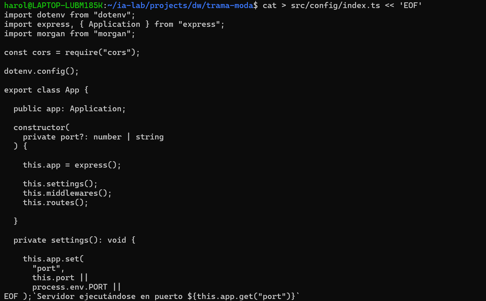

### Verificación del ISS-01

```bash
npx tsc --noEmit
find src -type f | sort
```

### Cierre del ISS

```bash
npm run dev
```
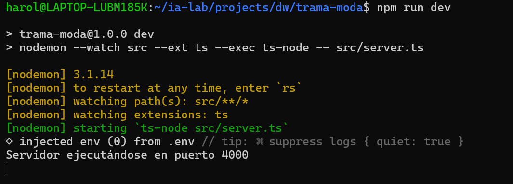
---

# 3. ISS-02 — Infraestructura de base de datos

**Objetivo:** drivers + `.env` + módulo Sequelize + carpeta `seeders/`.  
**Bloqueado por:** ISS-01.

### Criterios de aceptación (ISS-02) — consolidados

- [ ] **3.1** Paquetes Sequelize/drivers instalados; existe `.env` con `DB_ENGINE` y bloques de motores
- [ ] **3.2** Existe `src/database/db.ts` exportando `sequelize`, `getDatabaseInfo`, `testConnection`
- [ ] **3.3** Existe carpeta `src/database/seeders/` **sin** lógica implementada aún
- [ ] `npx tsc --noEmit` OK

---

## 3.1 Drivers Sequelize y `.env`

**Criterios de este sub-ítem**

- [ ] `sequelize`, `mysql2`, `pg`, `pg-hstore`, `tedious`, `oracledb` instalados
- [ ] `.env` con `PORT`, `DB_ENGINE`, MySQL/Postgres/MSSQL/Oracle

```bash
npm install sequelize@^6.37.8 mysql2@^3.24.4 pg@^8.23.0 pg-hstore@^2.3.4 \
  tedious@^20.0.0 oracledb@^7.0.1
npm install -D @types/sequelize@^6.12.0
```
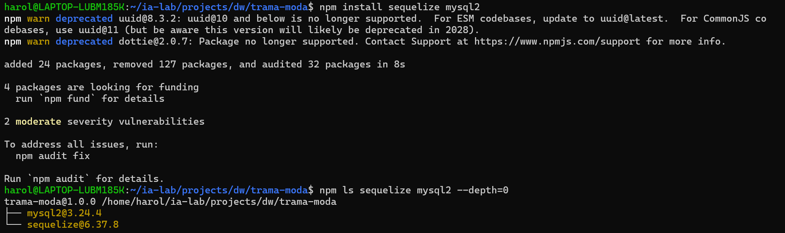

```bash
: > .env
cat >> .env << 'EOF'
PORT=4000

# Variable para seleccionar el motor de base de datos
DB_ENGINE=mysql

# Configuración para MySQL
MYSQL_HOST=localhost
MYSQL_PORT=3306
MYSQL_USER=root
MYSQL_PASSWORD=root
MYSQL_NAME=trama_moda


# Configuración para PostgreSQL
POSTGRES_HOST=localhost
POSTGRES_USER=postgres
POSTGRES_PASSWORD=password
POSTGRES_NAME=almacen_2025_iisem_node
POSTGRES_PORT=5432

# Configuración para SQL Server
MSSQL_HOST=localhost
MSSQL_USER=sa
MSSQL_PASSWORD=password
MSSQL_NAME=almacen_2025_iisem_node
MSSQL_PORT=1433

# Configuración para Oracle
ORACLE_HOST=localhost
ORACLE_USER=ALMACENDB_ADMIN
ORACLE_PASSWORD=password
ORACLE_NAME=xe
ORACLE_PORT=1521

EOF
```
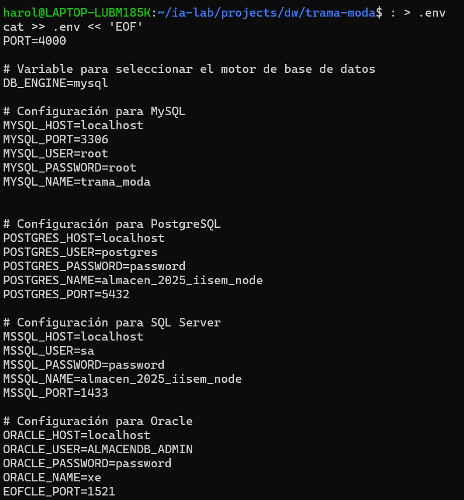

```bash
test -f .env && grep DB_ENGINE .env
npm ls sequelize mysql2 --depth=0
```
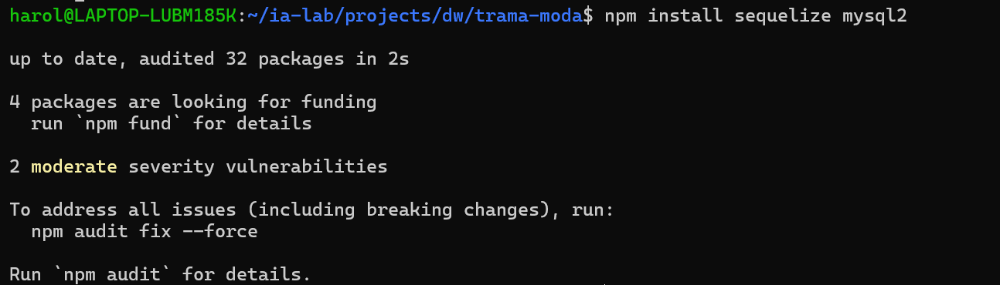

---

## 3.2 Configuración Sequelize (`database/db.ts`)

**Criterios de este sub-ítem**

- [ ] Archivo `src/database/db.ts` creado
- [ ] Exporta `sequelize`, `getDatabaseInfo`, `testConnection`

```bash
: > src/database/db.ts
cat >> src/database/db.ts << 'EOF'
import { Sequelize } from "sequelize";
import dotenv from "dotenv";

dotenv.config();

interface DatabaseConfig {
  dialect: string;
  host: string;
  username: string;
  password: string;
  database: string;
  port: number;
}

const dbConfigurations: Record<string, DatabaseConfig> = {
  mysql: {
    dialect: "mysql",
    host: process.env.MYSQL_HOST || "localhost",
    username: process.env.MYSQL_USER || "root",
    password: process.env.MYSQL_PASSWORD || "",
    database: process.env.MYSQL_NAME || "test",
    port: parseInt(process.env.MYSQL_PORT || "3306")
  },
  postgres: {
    dialect: "postgres",
    host: process.env.POSTGRES_HOST || "localhost",
    username: process.env.POSTGRES_USER || "postgres",
    password: process.env.POSTGRES_PASSWORD || "",
    database: process.env.POSTGRES_NAME || "test",
    port: parseInt(process.env.POSTGRES_PORT || "5432")
  }
};

const selectedEngine = process.env.DB_ENGINE || "mysql";
const selectedConfig = dbConfigurations[selectedEngine];

if (!selectedConfig) {
  throw new Error(`Motor de base de datos no soportado: ${selectedEngine}`);
}

console.log(`🔌 Conectando a base de datos: ${selectedEngine.toUpperCase()}`);

export const sequelize = new Sequelize(
  selectedConfig.database,
  selectedConfig.username,
  selectedConfig.password,
  {
    host: selectedConfig.host,
    port: selectedConfig.port,
    dialect: selectedConfig.dialect as any,
    logging: process.env.NODE_ENV === 'development' ? console.log : false,
    pool: {
      max: 5,
      min: 0,
      acquire: 30000,
      idle: 10000
    }
  }
);

export const getDatabaseInfo = () => {
  return {
    engine: selectedEngine,
    config: selectedConfig,
    connectionString: `${selectedConfig.dialect}://${selectedConfig.username}@${selectedConfig.host}:${selectedConfig.port}/${selectedConfig.database}`
  };
};

export const testConnection = async (): Promise<boolean> => {
  try {
    await sequelize.authenticate();
    console.log(`✅ Conexión exitosa a ${selectedEngine.toUpperCase()}`);
    return true;
  } catch (error) {
    console.error(`❌ Error de conexión a ${selectedEngine.toUpperCase()}:`, error);
    return false;
  }
};
EOF
```
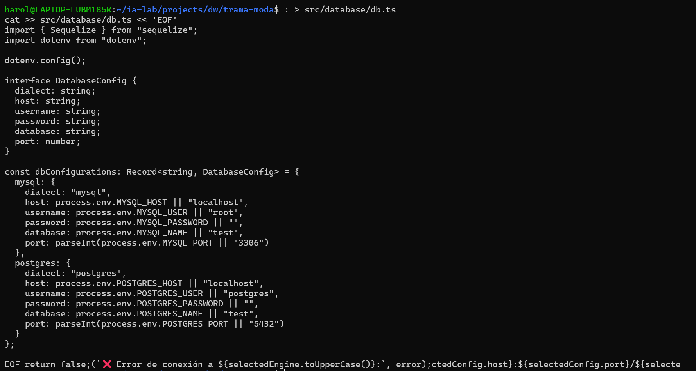

```bash
test -f src/database/db.ts && npx tsc --noEmit
```
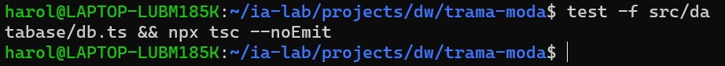
---

## 3.3 Carpeta seeders (reservada)

**Criterios de este sub-ítem**

- [ ] `src/database/seeders/` existe (la lógica llega en ISS-04)
- [ ] `src/database/seeders/` existe **sin** `*.seeder.ts` ni runner

```bash
mkdir -p src/database/seeders
# opcional: touch src/database/seeders/.gitkeep
```

```bash
test -d src/database/seeders && echo OK
```
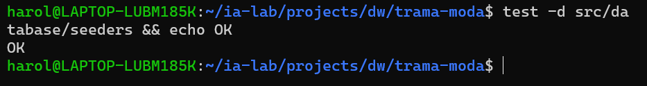

### Verificación del ISS-02

```bash
npx tsc --noEmit
test -f src/database/db.ts && test -f .env && test -d src/database/seeders
```
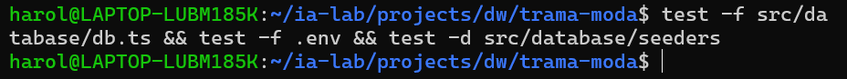

### Cierre del ISS

```bash
npm run dev
```
> El servidor debe arrancar sin error. Detenerlo con Ctrl+C antes de continuar.
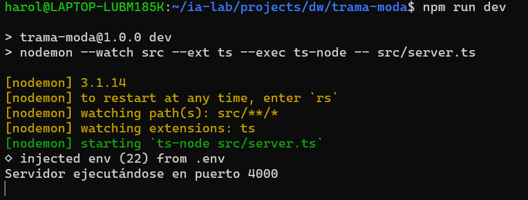
---
# 4. ISS-03-A — Feature Client — fundación (modelo, esqueleto, HTTP, cableado)

**Nombre recomendado:** *Feature Client — fundación*  
**Objetivo:** dejar el feature listo para CRUD: modelo con columnas obligatorias, esqueleto controller/routes, carpeta `http/`, agregador y sync.  
**Bloqueado por:** ISS-02.

### Criterios de aceptación (ISS-03-A)

- [ ] **4.1** Modelo `client.model.ts` con `status` + `timestamps: true` + bcrypt
- [ ] **4.2** Controller/routes esqueleto (sin CRUD aún en este sub-ítem pedagógico; el repo ya puede tener CRUD de ISS-03-B…E)
- [ ] **4.3** Carpeta `features/business/client/http/` creada
- [ ] **4.4** `routes/index.ts` + `config` importan modelo, conectan BD y hacen `sync`
- [ ] Con BD: `npm run dev` → conexión OK + sync OK + tabla `clients`

---

## 4.1 Modelo Client

**Criterios**

- [ ] `src/features/business/client/client.model.ts`
- [ ] Enum `active`/`inactive`, default `inactive`; `timestamps: true`

```bash
npm install bcryptjs@^3.0.3
npm install -D @types/bcryptjs@^3.0.0
```
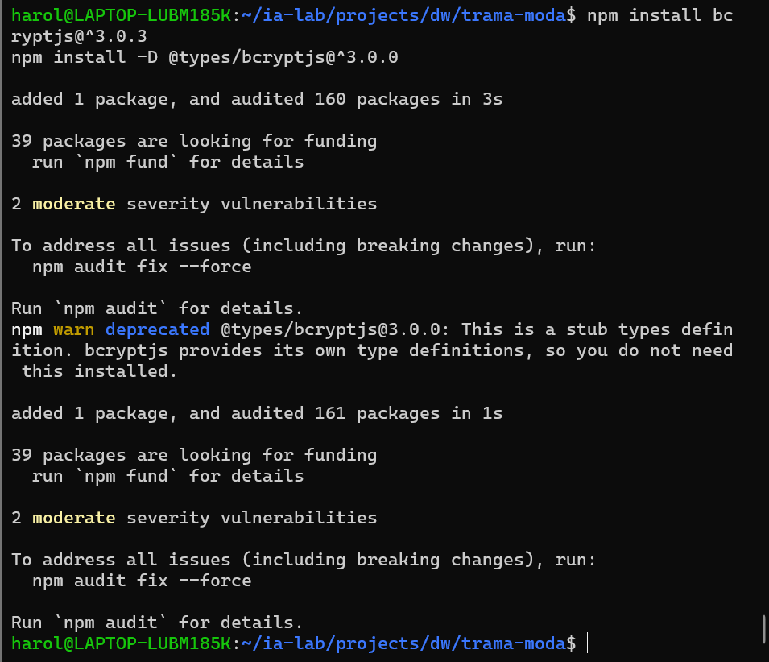

## 4.1 Modelo Client

```bash
: > src/features/business/client/client.model.ts
cat >> src/features/business/client/client.model.ts << 'EOF'
Client.init(
{
  tipo_documento: {
    type: DataTypes.STRING,
    allowNull:false
  },

  numero_documento:{
    type: DataTypes.STRING,
    allowNull:false,
    unique:true
  },

  nombre:{
    type: DataTypes.STRING,
    allowNull:false
  },

  telefono:{
    type: DataTypes.STRING
  },

  email:{
    type: DataTypes.STRING,
    unique:true
  },

  status:{
    type: DataTypes.ENUM(
      "active",
      "inactive"
    ),
    defaultValue:"active"
  }
},
{
  sequelize,
  tableName:"clients",
  timestamps:true
}
);
EOF
```
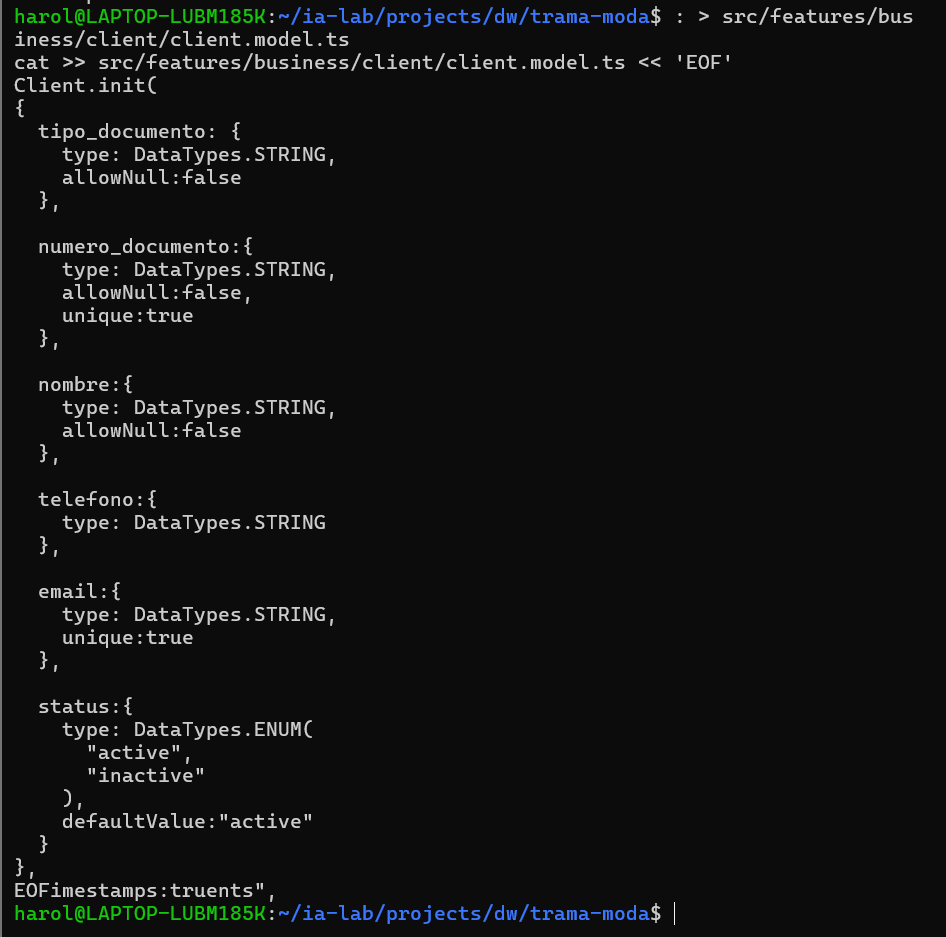

## 4.2 Esqueleto controller / routes + carpeta HTTP

**Criterios**

- [ ] Archivos `client.controller.ts` y `client.routes.ts` existen (esqueleto)
- [ ] Carpeta `src/features/business/client/http/` existe

```bash
mkdir -p src/features/business/client/http
```
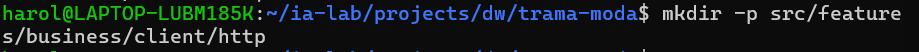


> El CRUD se completa en ISS-03-B…E. Aquí se reserva la carpeta `http/` para archivos `.http` (REST Client) con leyenda **SIN AUTH**.

```bash
: > src/features/business/client/client.controller.ts
cat >> src/features/business/client/client.controller.ts << 'EOF'
import { Request, Response } from "express";
import { Client, ClientI } from "./client.model";

function paramId(req: Request): number {
  const raw = req.params.id;
  const value = Array.isArray(raw) ? raw[0] : raw;
  return Number(value);
}

export class ClientController {
  // ================== READ ==================
  public async getAll(req: Request, res: Response) {
    try {
      const clients = await Client.findAll({
        where: { status: "active" }
      });
      res.status(200).json({ clients });
    } catch (error) {
      res.status(500).json({ error: "Error fetching clients", detail: String(error) });
    }
  }

  public async getOne(req: Request, res: Response) {
    try {
      const id = paramId(req);
      const client = await Client.findByPk(id);
      if (!client) {
        res.status(404).json({ error: "Client not found" });
        return;
      }
      res.status(200).json({ client });
    } catch (error) {
      res.status(500).json({ error: "Error fetching client", detail: String(error) });
    }
  }

  // ================== CREATE ==================
  public async create(req: Request, res: Response) {
    try {
      const body = req.body as ClientI;
      const client = await Client.create({
        tipo_documento: body.tipo_documento,
        numero_documento: body.numero_documento,
        nombre: body.nombre,
        telefono: body.telefono,
        email: body.email,
        status: body.status ?? "active"
      });
      res.status(201).json({ client });
    } catch (error) {
      res.status(500).json({ error: "Error creating client", detail: String(error) });
    }
  }

  // ================== UPDATE ==================
  public async updatePut(req: Request, res: Response) {
    try {
      const id = paramId(req);
      const body = req.body as ClientI;
      const client = await Client.findByPk(id);
      if (!client) {
        res.status(404).json({ error: "Client not found" });
        return;
      }

      await client.update({
        tipo_documento: body.tipo_documento,
        numero_documento: body.numero_documento,
        nombre: body.nombre,
        telefono: body.telefono,
        email: body.email,
        status: body.status ?? client.status
      });

      res.status(200).json({ client });
    } catch (error) {
      res.status(500).json({ error: "Error updating client (PUT)", detail: String(error) });
    }
  }

  public async updatePatch(req: Request, res: Response) {
    try {
      const id = paramId(req);
      const body = req.body as Partial<ClientI>;
      const client = await Client.findByPk(id);
      if (!client) {
        res.status(404).json({ error: "Client not found" });
        return;
      }

      await client.update(body);
      res.status(200).json({ client });
    } catch (error) {
      res.status(500).json({ error: "Error updating client (PATCH)", detail: String(error) });
    }
  }

  // ================== DELETE ==================
  /** Eliminación física */
  public async deletePhysical(req: Request, res: Response) {
    try {
      const id = paramId(req);
      const client = await Client.findByPk(id);
      if (!client) {
        res.status(404).json({ error: "Client not found" });
        return;
      }
      await client.destroy();
      res.status(200).json({ message: "Client permanently deleted", id });
    } catch (error) {
      res.status(500).json({ error: "Error deleting client", detail: String(error) });
    }
  }

  /** Eliminación lógica → status = inactive */
  public async deleteLogical(req: Request, res: Response) {
    try {
      const id = paramId(req);
      const client = await Client.findByPk(id);
      if (!client) {
        res.status(404).json({ error: "Client not found" });
        return;
      }
      await client.update({ status: "inactive" });
      res.status(200).json({ message: "Client deactivated (logical delete)", client });
    } catch (error) {
      res.status(500).json({ error: "Error deactivating client", detail: String(error) });
    }
  }
}
EOF
```
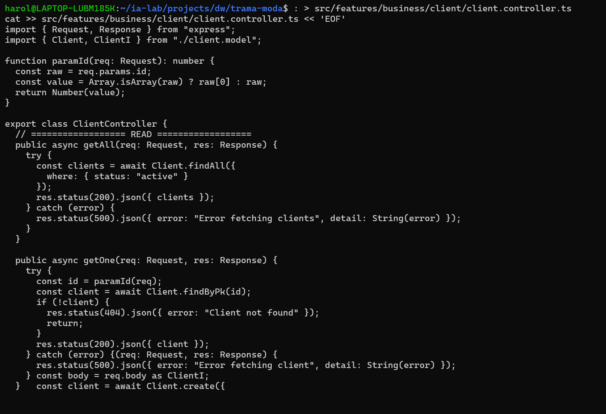

### Crear Rutas de Cliente

```bash
: > src/features/business/client/client.routes.ts
cat >> src/features/business/client/client.routes.ts << 'EOF'
import { Application } from "express";
import { ClientController } from "./client.controller";

export class ClientRoutes {
  public clientController: ClientController = new ClientController();

  public routes(app: Application): void {
    // ================== RUTAS SIN AUTENTICACIÓN ==================

    // getAll & create
    app
      .route("/api/clientes")
      .get(this.clientController.getAll.bind(this.clientController))
      .post(this.clientController.create.bind(this.clientController));

    // getOne, update (PUT/PATCH) & delete físico
    app
      .route("/api/clientes/:id")
      .get(this.clientController.getOne.bind(this.clientController))
      .put(this.clientController.updatePut.bind(this.clientController))
      .patch(this.clientController.updatePatch.bind(this.clientController))
      .delete(this.clientController.deletePhysical.bind(this.clientController));

    // delete lógico
    app
      .route("/api/clientes/:id/deactivate")
      .patch(this.clientController.deleteLogical.bind(this.clientController));
  }
}
EOF
```
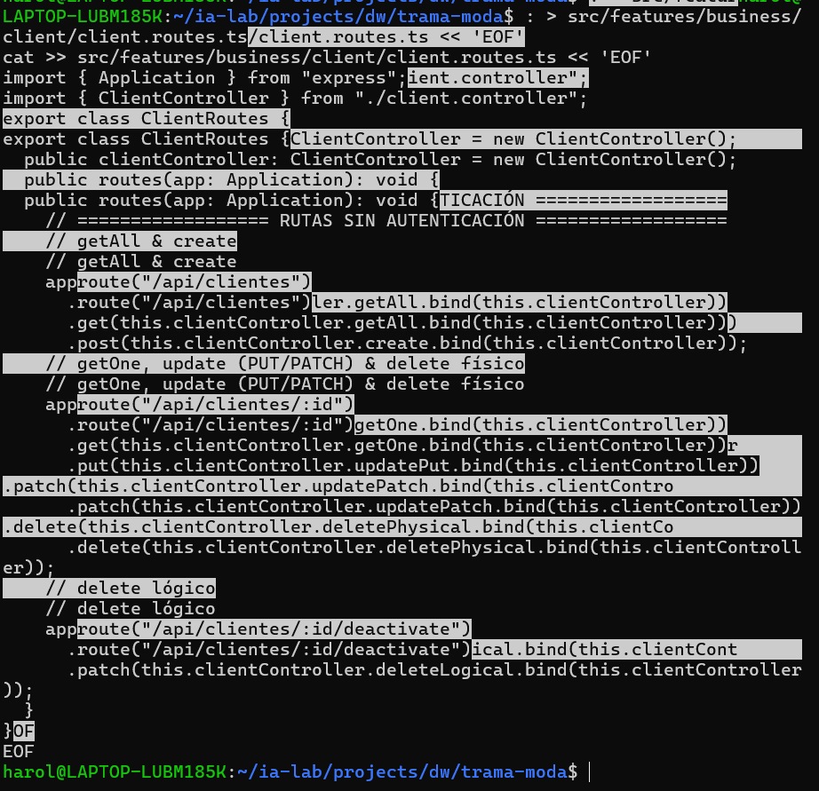

### Crear Archivos de Pruebas HTTP
```bash
: > src/features/business/client/http/clients.get.http
cat >> src/features/business/client/http/clients.get.http << 'EOF'
### Feature Client — GET ALL / GET ONE
### Leyenda: SIN AUTH
@baseUrl = http://localhost:4000
@id = 1

# @name getAllClients
GET {{baseUrl}}/api/clientes

###

# @name getOneClient
GET {{baseUrl}}/api/clientes/{{id}}
EOF
```
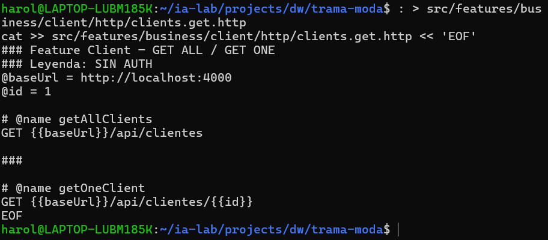

```bash
: > src/features/business/client/http/clients.create.http
cat >> src/features/business/client/http/clients.create.http << 'EOF'
### Feature Client — CREATE
### Leyenda: SIN AUTH
@baseUrl = http://localhost:4000

# @name createClient
POST {{baseUrl}}/api/clientes
Content-Type: application/json

{
  "tipo_documento": "CC",
  "numero_documento": "1098765432",
  "nombre": "Carlos Mendoza",
  "telefono": "3001234567",
  "email": "carlos.mendoza@example.com",
  "status": "active"
}
EOF
```

```bash
: > src/features/business/client/http/clients.update.http
cat >> src/features/business/client/http/clients.update.http << 'EOF'
### Feature Client — UPDATE (PUT / PATCH)
### Leyenda: SIN AUTH
@baseUrl = http://localhost:4000
@id = 1

# @name updateClientPut
PUT {{baseUrl}}/api/clientes/{{id}}
Content-Type: application/json

{
  "tipo_documento": "CC",
  "numero_documento": "1098765432",
  "nombre": "Carlos Mendoza Actualizado",
  "telefono": "3009876543",
  "email": "carlos.mendoza@example.com",
  "status": "active"
}

###

# @name updateClientPatch
PATCH {{baseUrl}}/api/clientes/{{id}}
Content-Type: application/json

{
  "telefono": "3011112233"
}
EOF
```

```bash
: > src/features/business/client/http/clients.delete.http
cat >> src/features/business/client/http/clients.delete.http << 'EOF'
### Feature Client — DELETE físico / DELETE lógico
### Leyenda: SIN AUTH
@baseUrl = http://localhost:4000
@id = 1

# @name deleteClientLogical
PATCH {{baseUrl}}/api/clientes/{{id}}/deactivate

###

# @name deleteClientPhysical
DELETE {{baseUrl}}/api/clientes/{{id}}
EOF
```

```bash
: > src/routes/index.ts
cat >> src/routes/index.ts << 'EOF'
import { ClientRoutes } from "../features/business/client/client.routes";

export class Routes {
  public clientRoutes: ClientRoutes = new ClientRoutes();
}
EOF
```
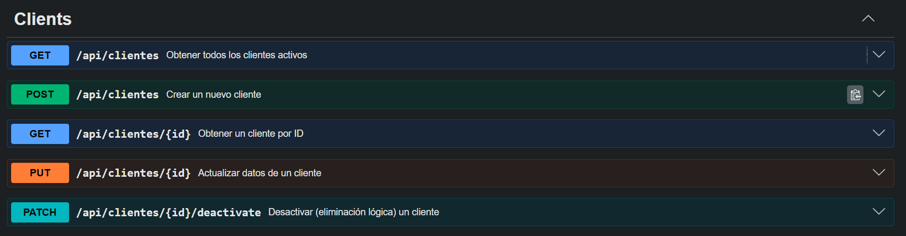
-------------------------------------------------------------------

# 5. ISS-03-B — product — GetAll y GetOne

### Crear el Modelo de Producto

```bash
: > src/features/business/product/product.model.ts
cat >> src/features/business/product/product.model.ts << 'EOF'
import { DataTypes, Model } from "sequelize";
import { sequelize } from "../../../database/db";

export interface ProductI {
  id?: number;
  nombre: string;
  precio: number;
  stock: number;
  status?: "active" | "inactive";
  createdAt?: Date;
  updatedAt?: Date;
}

export class Product extends Model {
  public id!: number;
  public nombre!: string;
  public precio!: number;
  public stock!: number;
  public status!: "active" | "inactive";
  public readonly createdAt!: Date;
  public readonly updatedAt!: Date;
}

Product.init(
  {
    nombre: {
      type: DataTypes.STRING,
      allowNull: false
    },
    precio: {
      type: DataTypes.DECIMAL(10, 2),
      allowNull: false
    },
    stock: {
      type: DataTypes.INTEGER,
      allowNull: false,
      defaultValue: 0
    },
    status: {
      type: DataTypes.ENUM("active", "inactive"),
      defaultValue: "active"
    }
  },
  {
    sequelize,
    tableName: "products",
    timestamps: true
  }
);
EOF
```
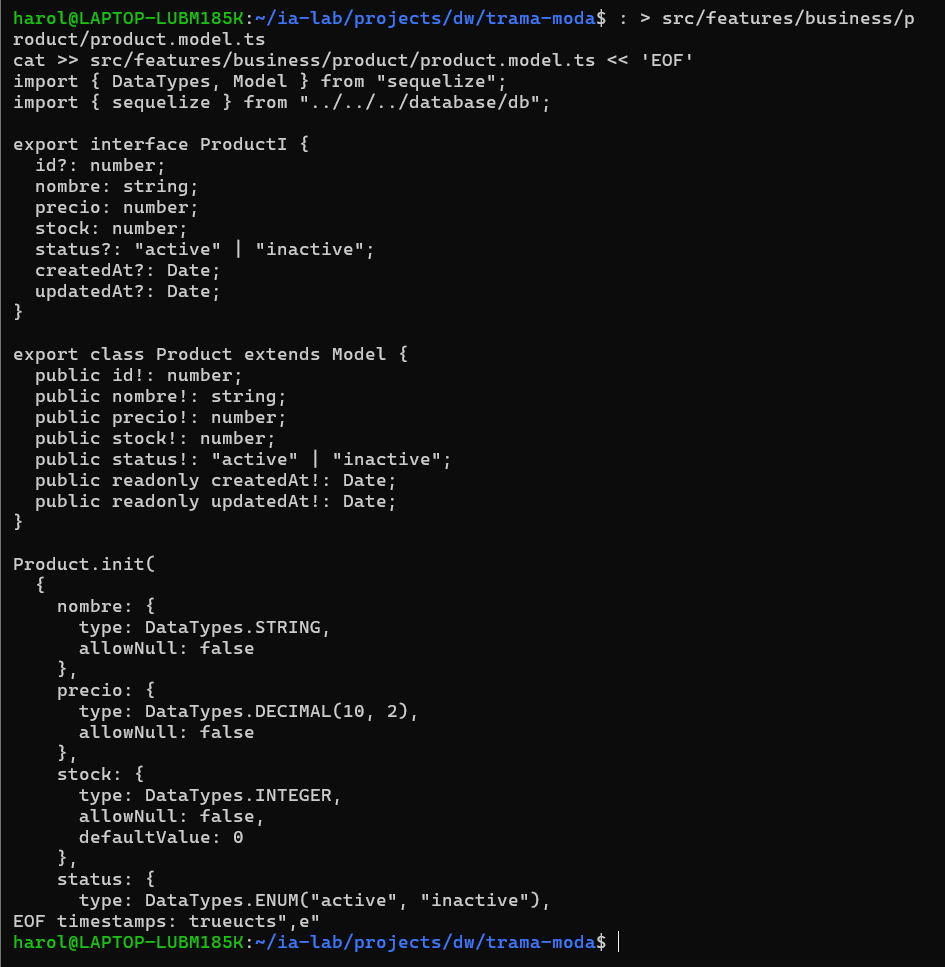

### Crear Controlador

```bash
: > src/features/business/product/product.controller.ts
cat >> src/features/business/product/product.controller.ts << 'EOF'
import { Request, Response } from "express";
import { Product, ProductI } from "./product.model";

function paramId(req: Request): number {
  const raw = req.params.id;
  const value = Array.isArray(raw) ? raw[0] : raw;
  return Number(value);
}

export class ProductController {
  // ================== READ ==================
  public async getAll(req: Request, res: Response) {
    try {
      const products = await Product.findAll({
        where: { status: "active" }
      });
      res.status(200).json({ products });
    } catch (error) {
      res.status(500).json({ error: "Error fetching products", detail: String(error) });
    }
  }

  public async getOne(req: Request, res: Response) {
    try {
      const id = paramId(req);
      const product = await Product.findByPk(id);
      if (!product) {
        res.status(404).json({ error: "Product not found" });
        return;
      }
      res.status(200).json({ product });
    } catch (error) {
      res.status(500).json({ error: "Error fetching product", detail: String(error) });
    }
  }

  // ================== CREATE ==================
  public async create(req: Request, res: Response) {
    try {
      const body = req.body as ProductI;
      const product = await Product.create({
        nombre: body.nombre,
        precio: body.precio,
        stock: body.stock,
        status: body.status ?? "active"
      });
      res.status(201).json({ product });
    } catch (error) {
      res.status(500).json({ error: "Error creating product", detail: String(error) });
    }
  }

  // ================== UPDATE ==================
  public async updatePut(req: Request, res: Response) {
    try {
      const id = paramId(req);
      const body = req.body as ProductI;
      const product = await Product.findByPk(id);
      if (!product) {
        res.status(404).json({ error: "Product not found" });
        return;
      }

      await product.update({
        nombre: body.nombre,
        precio: body.precio,
        stock: body.stock,
        status: body.status ?? product.status
      });

      res.status(200).json({ product });
    } catch (error) {
      res.status(500).json({ error: "Error updating product (PUT)", detail: String(error) });
    }
  }

  public async updatePatch(req: Request, res: Response) {
    try {
      const id = paramId(req);
      const body = req.body as Partial<ProductI>;
      const product = await Product.findByPk(id);
      if (!product) {
        res.status(404).json({ error: "Product not found" });
        return;
      }

      await product.update(body);
      res.status(200).json({ product });
    } catch (error) {
      res.status(500).json({ error: "Error updating product (PATCH)", detail: String(error) });
    }
  }

  // ================== DELETE ==================
  public async deletePhysical(req: Request, res: Response) {
    try {
      const id = paramId(req);
      const product = await Product.findByPk(id);
      if (!product) {
        res.status(404).json({ error: "Product not found" });
        return;
      }
      await product.destroy();
      res.status(200).json({ message: "Product permanently deleted", id });
    } catch (error) {
      res.status(500).json({ error: "Error deleting product", detail: String(error) });
    }
  }

  public async deleteLogical(req: Request, res: Response) {
    try {
      const id = paramId(req);
      const product = await Product.findByPk(id);
      if (!product) {
        res.status(404).json({ error: "Product not found" });
        return;
      }
      await product.update({ status: "inactive" });
      res.status(200).json({ message: "Product deactivated (logical delete)", product });
    } catch (error) {
      res.status(500).json({ error: "Error deactivating product", detail: String(error) });
    }
  }
}
EOF
```
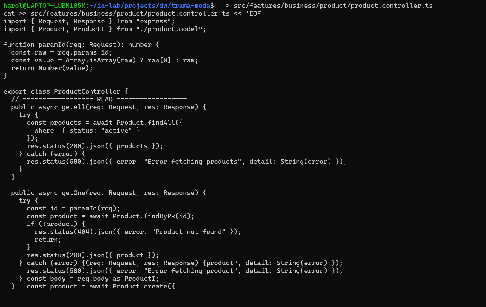

### Crear Rutas (product.routes.ts)

```bash
: > src/features/business/product/product.routes.ts
cat >> src/features/business/product/product.routes.ts << 'EOF'
import { Application } from "express";
import { ProductController } from "./product.controller";

export class ProductRoutes {
  public productController: ProductController = new ProductController();

  public routes(app: Application): void {
    app
      .route("/api/productos")
      .get(this.productController.getAll.bind(this.productController))
      .post(this.productController.create.bind(this.productController));

    app
      .route("/api/productos/:id")
      .get(this.productController.getOne.bind(this.productController))
      .put(this.productController.updatePut.bind(this.productController))
      .patch(this.productController.updatePatch.bind(this.productController))
      .delete(this.productController.deletePhysical.bind(this.productController));

    app
      .route("/api/productos/:id/deactivate")
      .patch(this.productController.deleteLogical.bind(this.productController));
  }
}
EOF
```
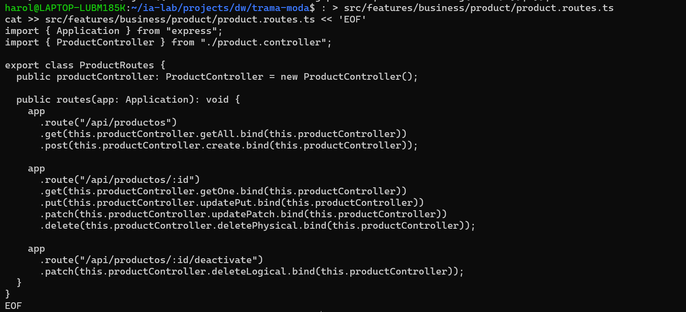

### HTTP — archivo nuevo
#### Obtener Productos

```bash
: > src/features/business/product/http/products.get.http
cat >> src/features/business/product/http/products.get.http << 'EOF'
### Feature Product — GET ALL / GET ONE
### Leyenda: SIN AUTH
@baseUrl = http://localhost:4000
@id = 1

# @name getAllProducts
GET {{baseUrl}}/api/productos

###

# @name getOneProduct
GET {{baseUrl}}/api/productos/{{id}}
EOF
```
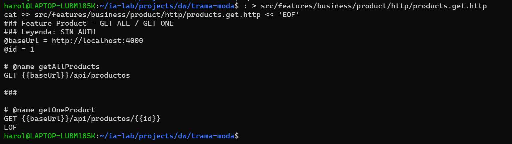

#### Crear productos
```bash
: > src/features/business/product/http/products.create.http
cat >> src/features/business/product/http/products.create.http << 'EOF'
### Feature Product — CREATE
### Leyenda: SIN AUTH
@baseUrl = http://localhost:4000

# @name createProduct
POST {{baseUrl}}/api/productos
Content-Type: application/json

{
  "nombre": "Camiseta Algodón Talla M",
  "precio": 45000.00,
  "stock": 20,
  "status": "active"
}
EOF
```
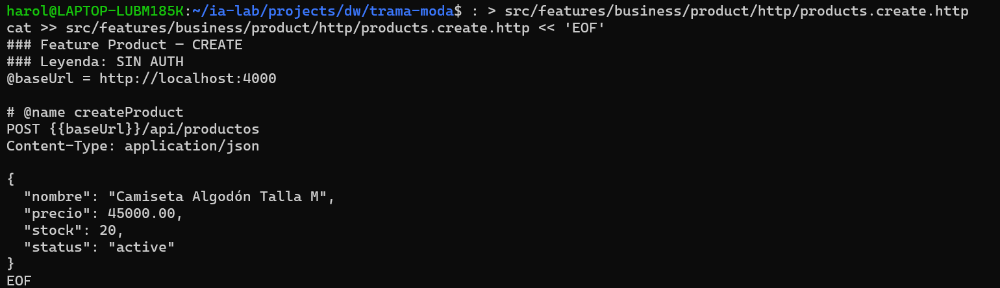

#### Actualizar Producto

```bash
: > src/features/business/product/http/products.update.http
cat >> src/features/business/product/http/products.update.http << 'EOF'
### Feature Product — UPDATE (PUT / PATCH)
### Leyenda: SIN AUTH
@baseUrl = http://localhost:4000
@id = 1

# @name updateProductPut
PUT {{baseUrl}}/api/productos/{{id}}
Content-Type: application/json

{
  "nombre": "Camiseta Algodón Talla L",
  "precio": 48000.00,
  "stock": 15,
  "status": "active"
}

###

# @name updateProductPatch
PATCH {{baseUrl}}/api/productos/{{id}}
Content-Type: application/json

{
  "precio": 50000.00,
  "stock": 30
}
EOF
```
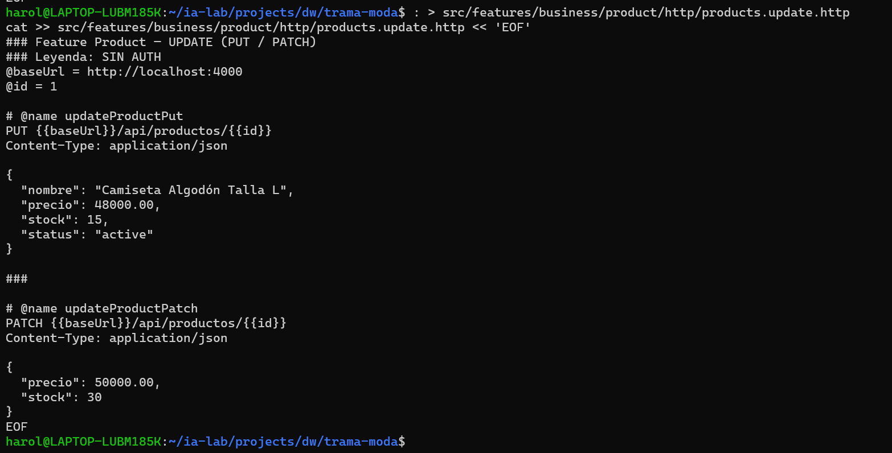

#### Eliminar Producto
```bash
: > src/features/business/product/http/products.delete.http
cat >> src/features/business/product/http/products.delete.http << 'EOF'
### Feature Product — DELETE físico / DELETE lógico
### Leyenda: SIN AUTH
@baseUrl = http://localhost:4000
@id = 1

# @name deleteProductLogical
PATCH {{baseUrl}}/api/productos/{{id}}/deactivate

###

# @name deleteProductPhysical
DELETE {{baseUrl}}/api/productos/{{id}}
EOF
```
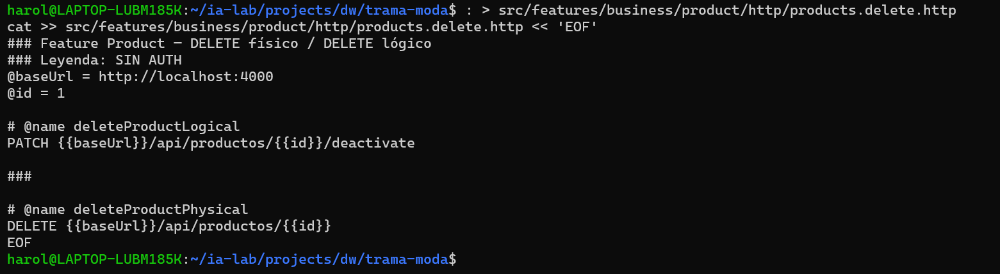

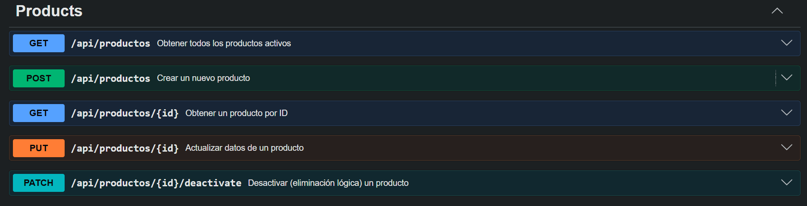

-------------------------------------------------------------
# 6. ISS-03-c — sales — GetAll y GetOne

### Creacion de modelos `sale.model.ts`

```bash
: > src/features/business/sale/sale.model.ts
cat >> src/features/business/sale/sale.model.ts << 'EOF'
import { DataTypes, Model } from "sequelize";
import { sequelize } from "../../../database/db";
import { Client } from "../client/client.model";

export interface SaleI {
  id?: number;
  client_id: number;
  fecha?: Date;
  monto_total: number;
  status?: "active" | "inactive";
  createdAt?: Date;
  updatedAt?: Date;
}

export class Sale extends Model {
  public id!: number;
  public client_id!: number;
  public fecha!: Date;
  public monto_total!: number;
  public status!: "active" | "inactive";
  public readonly createdAt!: Date;
  public readonly updatedAt!: Date;
}

Sale.init(
  {
    client_id: {
      type: DataTypes.INTEGER,
      allowNull: false,
      references: {
        model: "clients",
        key: "id"
      }
    },
    fecha: {
      type: DataTypes.DATE,
      defaultValue: DataTypes.NOW
    },
    monto_total: {
      type: DataTypes.DECIMAL(10, 2),
      allowNull: false,
      defaultValue: 0.0
    },
    status: {
      type: DataTypes.ENUM("active", "inactive"),
      defaultValue: "active"
    }
  },
  {
    sequelize,
    tableName: "sales",
    timestamps: true
  }
);

// Relación entre Venta y Cliente
Client.hasMany(Sale, { foreignKey: "client_id", as: "sales" });
Sale.belongsTo(Client, { foreignKey: "client_id", as: "client" });
EOF
```
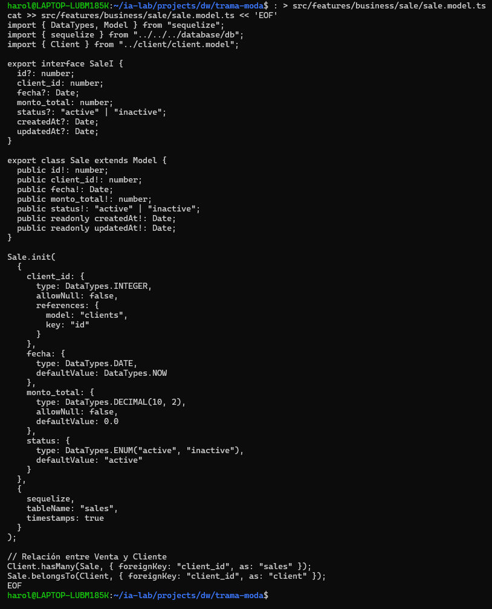

### src/database/db.ts

```bash
: > src/database/db.ts
cat >> src/database/db.ts << 'EOF'
import { Sequelize } from "sequelize";
import dotenv from "dotenv";

dotenv.config();

interface DatabaseConfig {
  dialect: string;
  host: string;
  username: string;
  password: string;
  database: string;
  port: number;
}

const dbConfigurations: Record<string, DatabaseConfig> = {
  mysql: {
    dialect: "mysql",
    host: process.env.MYSQL_HOST || process.env.DB_HOST || "localhost",
    username: process.env.MYSQL_USER || process.env.DB_USER || "root",
    password: process.env.MYSQL_PASSWORD || process.env.DB_PASSWORD || "",
    database: process.env.MYSQL_NAME || process.env.DB_NAME || "trama-moda",
    port: parseInt(process.env.MYSQL_PORT || process.env.DB_PORT || "3306")
  }
};

const selectedEngine = process.env.DB_ENGINE || "mysql";
const selectedConfig = dbConfigurations[selectedEngine];

if (!selectedConfig) {
  throw new Error(`Motor de base de datos no soportado: ${selectedEngine}`);
}

export const sequelize = new Sequelize(
  selectedConfig.database,
  selectedConfig.username,
  selectedConfig.password,
  {
    host: selectedConfig.host,
    port: selectedConfig.port,
    dialect: selectedConfig.dialect as any,
    logging: process.env.NODE_ENV === 'development' ? console.log : false,
    pool: { max: 5, min: 0, acquire: 30000, idle: 10000 }
  }
);

export const testConnection = async (): Promise<boolean> => {
  try {
    await sequelize.authenticate();
    console.log(`✅ Conexión exitosa a ${selectedEngine.toUpperCase()}`);
    return true;
  } catch (error) {
    console.error(`❌ Error de conexión:`, error);
    return false;
  }
};

export const syncDatabase = async (): Promise<void> => {
  try {
    require("../features/business/client/client.model");
    require("../features/business/product/product.model");
    require("../features/business/sale/sale.model");

    await sequelize.sync({ alter: true });
    console.log("✅ Tablas sincronizadas correctamente en MySQL");
  } catch (error) {
    console.error("❌ Error al sincronizar las tablas:", error);
  }
};
EOF
```
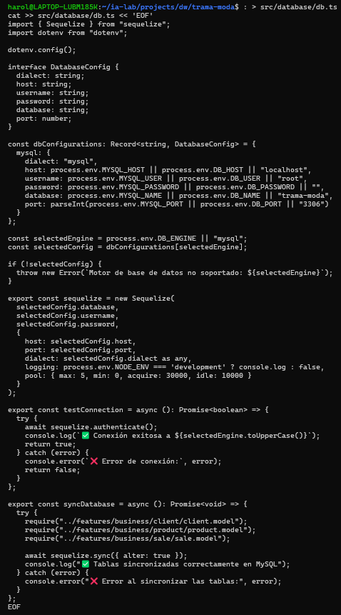

### sale controller.ts

```bash
: > src/features/business/sale/sale.controller.ts
cat >> src/features/business/sale/sale.controller.ts << 'EOF'
import { Request, Response } from "express";
import { Sale } from "./sale.model";
import { Client } from "../client/client.model";

function paramId(req: Request): number {
  const raw = req.params.id;
  const value = Array.isArray(raw) ? raw[0] : raw;
  return Number(value);
}

export class SaleController {
  // GET ALL
  public async getAll(req: Request, res: Response) {
    try {
      const sales = await Sale.findAll({
        where: { status: "active" },
        include: [{ model: Client, as: "client", attributes: ["id", "nombre", "numero_documento"] }]
      });
      res.status(200).json({ sales });
    } catch (error) {
      res.status(500).json({ error: "Error fetching sales", detail: String(error) });
    }
  }

  // GET ONE
  public async getOne(req: Request, res: Response) {
    try {
      const id = paramId(req);
      const sale = await Sale.findByPk(id, {
        include: [{ model: Client, as: "client" }]
      });

      if (!sale) {
        res.status(404).json({ error: "Sale not found" });
        return;
      }
      res.status(200).json({ sale });
    } catch (error) {
      res.status(500).json({ error: "Error fetching sale", detail: String(error) });
    }
  }

  // CREATE SALE (MAESTRO)
  public async create(req: Request, res: Response) {
    try {
      const { client_id, monto_total } = req.body;

      if (!client_id) {
        res.status(400).json({ error: "client_id is required" });
        return;
      }

      const client = await Client.findByPk(client_id);
      if (!client) {
        res.status(404).json({ error: "Client not found" });
        return;
      }

      const sale = await Sale.create({
        client_id,
        monto_total: monto_total || 0,
        fecha: new Date(),
        status: "active"
      });

      res.status(201).json({ sale });
    } catch (error) {
      res.status(500).json({ error: "Error creating sale", detail: String(error) });
    }
  }

  // DELETE LOGICAL
  public async deleteLogical(req: Request, res: Response) {
    try {
      const id = paramId(req);
      const sale = await Sale.findByPk(id);
      if (!sale) {
        res.status(404).json({ error: "Sale not found" });
        return;
      }
      await sale.update({ status: "inactive" });
      res.status(200).json({ message: "Sale deactivated", sale });
    } catch (error) {
      res.status(500).json({ error: "Error deactivating sale", detail: String(error) });
    }
  }
}
EOF
```
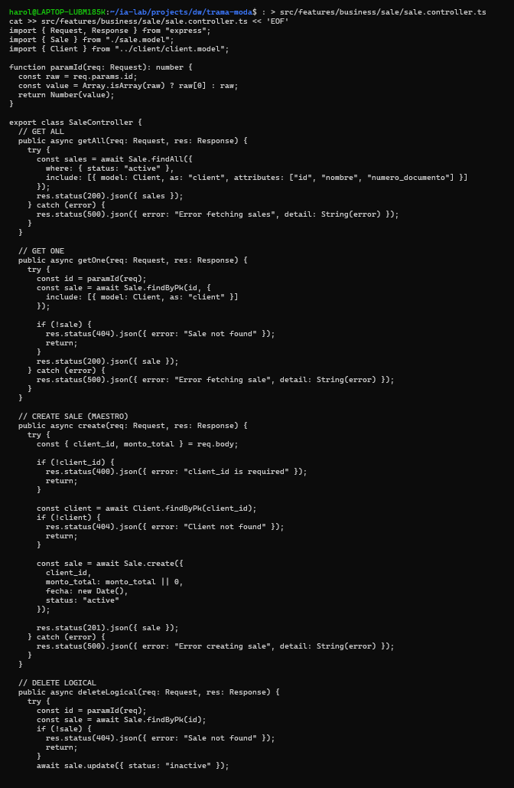

### sale.routes.ts

```bash
: > src/features/business/sale/sale.routes.ts
cat >> src/features/business/sale/sale.routes.ts << 'EOF'
import { Application } from "express";
import { SaleController } from "./sale.controller";

export class SaleRoutes {
  public saleController: SaleController = new SaleController();

  public routes(app: Application): void {
    app
      .route("/api/ventas")
      .get(this.saleController.getAll.bind(this.saleController))
      .post(this.saleController.create.bind(this.saleController));

    app
      .route("/api/ventas/:id")
      .get(this.saleController.getOne.bind(this.saleController));

    app
      .route("/api/ventas/:id/deactivate")
      .patch(this.saleController.deleteLogical.bind(this.saleController));
  }
}
EOF
```
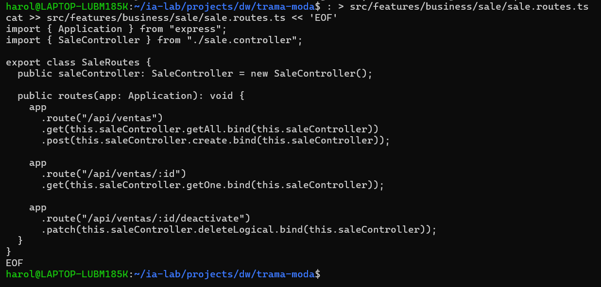

### Registrar en src/routes/index.ts

```
: > src/routes/index.ts
cat >> src/routes/index.ts << 'EOF'
import { ClientRoutes } from "../features/business/client/client.routes";
import { ProductRoutes } from "../features/business/product/product.routes";
import { SaleRoutes } from "../features/business/sale/sale.routes";

export class Routes {
  public clientRoutes: ClientRoutes = new ClientRoutes();
  public productRoutes: ProductRoutes = new ProductRoutes();
  public saleRoutes: SaleRoutes = new SaleRoutes();
}
EOF
```
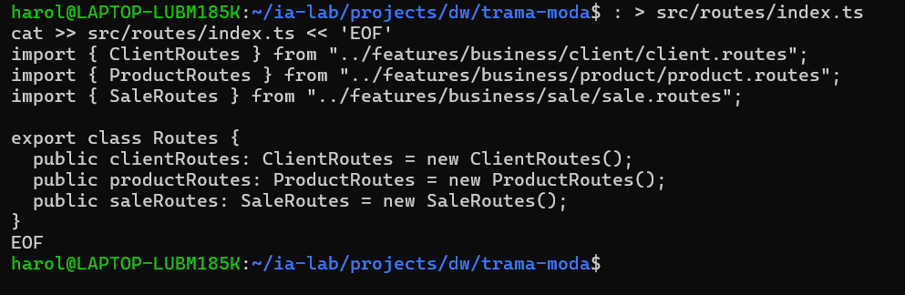

### Registrar en src/config/index.ts
```bash
: > src/config/index.ts
cat >> src/config/index.ts << 'EOF'
import express, { Application, Request, Response } from "express";
import cors from "cors";
import swaggerUi from "swagger-ui-express";
import { swaggerSpec } from "./swagger";
import { Routes } from "../routes";

export class App {
  public app: Application;
  public routePrv: Routes = new Routes();

  constructor(private port?: number | string) {
    this.app = express();
    this.settings();
    this.middlewares();
    this.routes();
  }

  private settings(): void {
    this.app.set("port", this.port || process.env.PORT || 4000);
  }

  private middlewares(): void {
    this.app.use(cors());
    this.app.use(express.json());
    this.app.use(express.urlencoded({ extended: false }));
  }

  private routes(): void {
    this.app.get("/", (req: Request, res: Response) => {
      res.json({ project: "TramaModa", status: "running" });
    });

    // Ruta interactiva para la documentación Swagger Web UI
    this.app.use("/api-docs", swaggerUi.serve, swaggerUi.setup(swaggerSpec));

    this.routePrv.clientRoutes.routes(this.app);
    this.routePrv.productRoutes.routes(this.app);
    this.routePrv.saleRoutes.routes(this.app);
  }

  public async listen(): Promise<void> {
    const port = this.app.get("port");
    this.app.listen(port, () => {
      console.log(`🚀 Servidor ejecutándose en puerto ${port}`);
      console.log(`📑 Documentación Swagger disponible en: http://localhost:${port}/api-docs`);
    });
  }
}
EOF
```
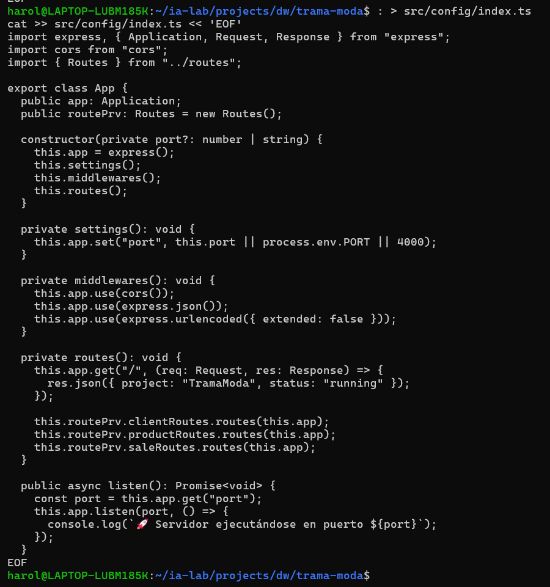

### Archivos http de purebas 
#### 1. CREATE SALE

```bash
> src/features/business/sale/http/sales.get.http
cat >> src/features/business/sale/http/sales.get.http << 'EOF'
### Feature Sale — GET ALL
@baseUrl = http://localhost:4000

GET {{baseUrl}}/api/ventas
EOF
```
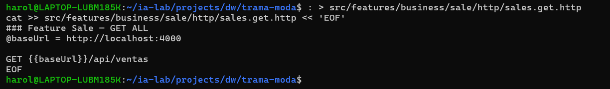

#### 2. GET ONE SALE
```bash
: > src/features/business/sale/http/sales.get-one.http
cat >> src/features/business/sale/http/sales.get-one.http << 'EOF'
### Feature Sale — GET ONE BY ID
@baseUrl = http://localhost:4000
@id = 1

GET {{baseUrl}}/api/ventas/{{id}}
EOF
```
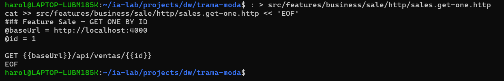

#### 3. DEACTIVATE (LOGICAL DELETE) SALE
```bash
: > src/features/business/sale/http/sales.delete.http
cat >> src/features/business/sale/http/sales.delete.http << 'EOF'
### Feature Sale — DEACTIVATE (LOGICAL DELETE)
@baseUrl = http://localhost:4000
@id = 1

PATCH {{baseUrl}}/api/ventas/{{id}}/deactivate
EOF
```
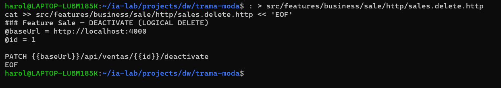

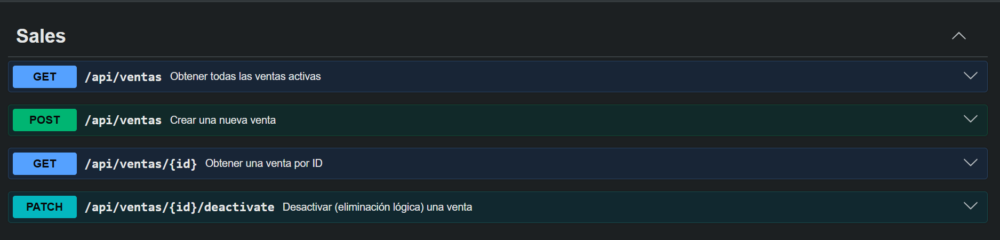

-------------------------------------------

# crear modelo sale-detali `sale-detali.model`
Este modelo define la tabla sale_details y sus relaciones con sales y products.

```bash 
: > src/features/business/sale/sale-detail.model.ts
cat >> src/features/business/sale/sale-detail.model.ts << 'EOF'
import { DataTypes, Model } from "sequelize";
import { sequelize } from "../../../database/db";
import { Sale } from "./sale.model";
import { Product } from "../product/product.model";

export interface SaleDetailI {
  id?: number;
  sale_id: number;
  product_id: number;
  cantidad: number;
  precio_unitario: number;
  subtotal: number;
  createdAt?: Date;
  updatedAt?: Date;
}

export class SaleDetail extends Model {
  public id!: number;
  public sale_id!: number;
  public product_id!: number;
  public cantidad!: number;
  public precio_unitario!: number;
  public subtotal!: number;
  public readonly createdAt!: Date;
  public readonly updatedAt!: Date;
}

SaleDetail.init(
  {
    sale_id: {
      type: DataTypes.INTEGER,
      allowNull: false,
      references: {
        model: "sales",
        key: "id"
      }
    },
    product_id: {
      type: DataTypes.INTEGER,
      allowNull: false,
      references: {
        model: "products",
        key: "id"
      }
    },
    cantidad: {
      type: DataTypes.INTEGER,
      allowNull: false
    },
    precio_unitario: {
      type: DataTypes.DECIMAL(10, 2),
      allowNull: false
    },
    subtotal: {
      type: DataTypes.DECIMAL(10, 2),
      allowNull: false
    }
  },
  {
    sequelize,
    tableName: "sale_details",
    timestamps: true
  }
);

// Definición de Relaciones
Sale.hasMany(SaleDetail, { foreignKey: "sale_id", as: "details" });
SaleDetail.belongsTo(Sale, { foreignKey: "sale_id", as: "sale" });

Product.hasMany(SaleDetail, { foreignKey: "product_id", as: "sale_details" });
SaleDetail.belongsTo(Product, { foreignKey: "product_id", as: "product" });
EOF
```
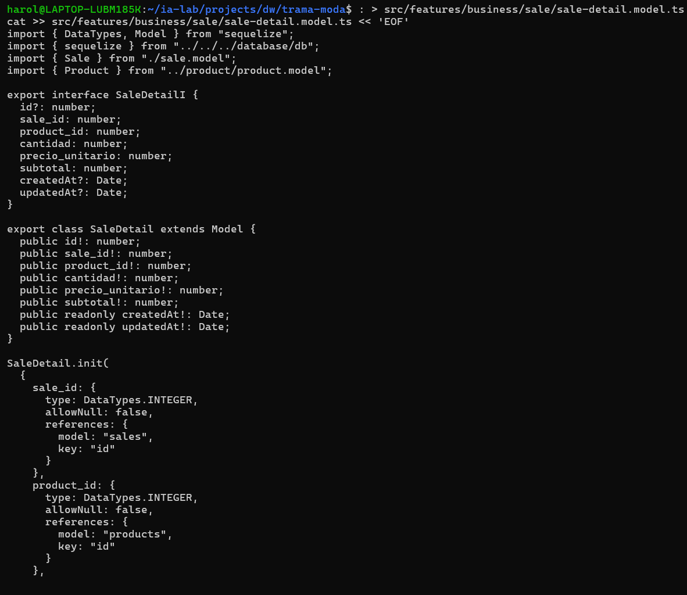

### database/db.ts
```bash
: > src/database/db.ts
cat >> src/database/db.ts << 'EOF'
import { Sequelize } from "sequelize";
import dotenv from "dotenv";

dotenv.config();

interface DatabaseConfig {
  dialect: string;
  host: string;
  username: string;
  password: string;
  database: string;
  port: number;
}

const dbConfigurations: Record<string, DatabaseConfig> = {
  mysql: {
    dialect: "mysql",
    host: process.env.MYSQL_HOST || process.env.DB_HOST || "localhost",
    username: process.env.MYSQL_USER || process.env.DB_USER || "root",
    password: process.env.MYSQL_PASSWORD || process.env.DB_PASSWORD || "",
    database: process.env.MYSQL_NAME || process.env.DB_NAME || "trama-moda",
    port: parseInt(process.env.MYSQL_PORT || process.env.DB_PORT || "3306")
  }
};

const selectedEngine = process.env.DB_ENGINE || "mysql";
const selectedConfig = dbConfigurations[selectedEngine];

if (!selectedConfig) {
  throw new Error(`Motor de base de datos no soportado: ${selectedEngine}`);
}

export const sequelize = new Sequelize(
  selectedConfig.database,
  selectedConfig.username,
  selectedConfig.password,
  {
    host: selectedConfig.host,
    port: selectedConfig.port,
    dialect: selectedConfig.dialect as any,
    logging: process.env.NODE_ENV === 'development' ? console.log : false,
    pool: { max: 5, min: 0, acquire: 30000, idle: 10000 }
  }
);

export const testConnection = async (): Promise<boolean> => {
  try {
    await sequelize.authenticate();
    console.log(`✅ Conexión exitosa a ${selectedEngine.toUpperCase()}`);
    return true;
  } catch (error) {
    console.error(`❌ Error de conexión:`, error);
    return false;
  }
};

export const syncDatabase = async (): Promise<void> => {
  try {
    require("../features/business/client/client.model");
    require("../features/business/product/product.model");
    require("../features/business/sale/sale.model");
    require("../features/business/sale/sale-detail.model");

    await sequelize.sync({ alter: true });
    console.log("✅ Tablas y relaciones sincronizadas correctamente en MySQL");
  } catch (error) {
    console.error("❌ Error al sincronizar las tablas:", error);
  }
};
EOF
```
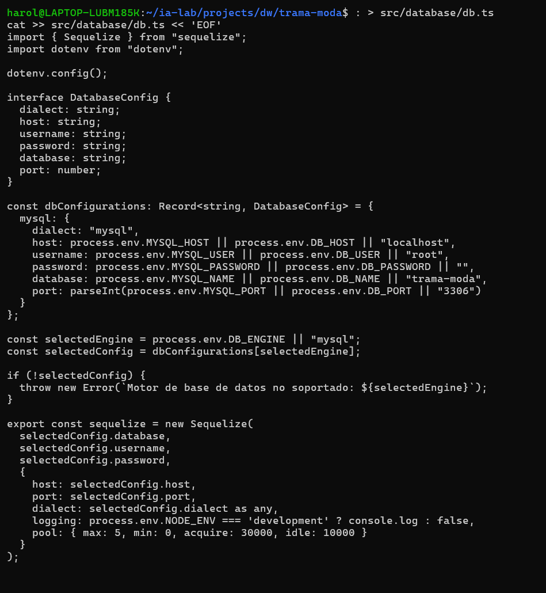

### sale-detail.controller.ts

Este controlador permite consultar detalles de venta y registrar nuevos ítems con transacción SQL y descuento automático de stock en la tabla de productos:

```bash
: > src/features/business/sale/sale-detail.controller.ts
cat >> src/features/business/sale/sale-detail.controller.ts << 'EOF'
import { Request, Response } from "express";
import { sequelize } from "../../../database/db";
import { SaleDetail } from "./sale-detail.model";
import { Sale } from "./sale.model";
import { Product } from "../product/product.model";

function paramId(req: Request): number {
  const raw = req.params.id;
  const value = Array.isArray(raw) ? raw[0] : raw;
  return Number(value);
}

export class SaleDetailController {
  // GET ALL DETAILS
  public async getAll(req: Request, res: Response) {
    try {
      const details = await SaleDetail.findAll({
        include: [
          { model: Sale, as: "sale" },
          { model: Product, as: "product", attributes: ["id", "nombre", "precio"] }
        ]
      });
      res.status(200).json({ details });
    } catch (error) {
      res.status(500).json({ error: "Error fetching sale details", detail: String(error) });
    }
  }

  // GET ONE DETAIL BY ID
  public async getOne(req: Request, res: Response) {
    try {
      const id = paramId(req);
      const detail = await SaleDetail.findByPk(id, {
        include: [
          { model: Sale, as: "sale" },
          { model: Product, as: "product" }
        ]
      });
      if (!detail) {
        res.status(404).json({ error: "Sale detail not found" });
        return;
      }
      res.status(200).json({ detail });
    } catch (error) {
      res.status(500).json({ error: "Error fetching sale detail", detail: String(error) });
    }
  }

  // CREATE SALE DETAIL WITH TRANSACTION & STOCK DISCOUNT
  public async create(req: Request, res: Response) {
    const transaction = await sequelize.transaction();
    try {
      const { sale_id, product_id, cantidad } = req.body;

      if (!sale_id || !product_id || !cantidad) {
        res.status(400).json({ error: "sale_id, product_id, and cantidad are required" });
        await transaction.rollback();
        return;
      }

      // Validar Venta
      const sale = await Sale.findByPk(sale_id, { transaction });
      if (!sale) {
        res.status(404).json({ error: "Sale not found" });
        await transaction.rollback();
        return;
      }

      // Validar Producto y Stock
      const product = await Product.findByPk(product_id, { transaction });
      if (!product) {
        res.status(404).json({ error: "Product not found" });
        await transaction.rollback();
        return;
      }

      if (product.stock < cantidad) {
        res.status(400).json({
          error: `Stock insuficiente. Disponible: ${product.stock}, solicitado: ${cantidad}`
        });
        await transaction.rollback();
        return;
      }

      const precio_unitario = Number(product.precio);
      const subtotal = precio_unitario * cantidad;

      // Crear Detalle
      const detail = await SaleDetail.create(
        {
          sale_id,
          product_id,
          cantidad,
          precio_unitario,
          subtotal
        },
        { transaction }
      );

      // Descontar Stock del Producto
      await product.update({ stock: product.stock - cantidad }, { transaction });

      // Actualizar Monto Total de la Venta Maestra
      const nuevoMontoTotal = Number(sale.monto_total) + subtotal;
      await sale.update({ monto_total: nuevoMontoTotal }, { transaction });

      await transaction.commit();

      res.status(201).json({ detail });
    } catch (error) {
      await transaction.rollback();
      res.status(500).json({ error: "Error creating sale detail", detail: String(error) });
    }
  }
}
EOF
```
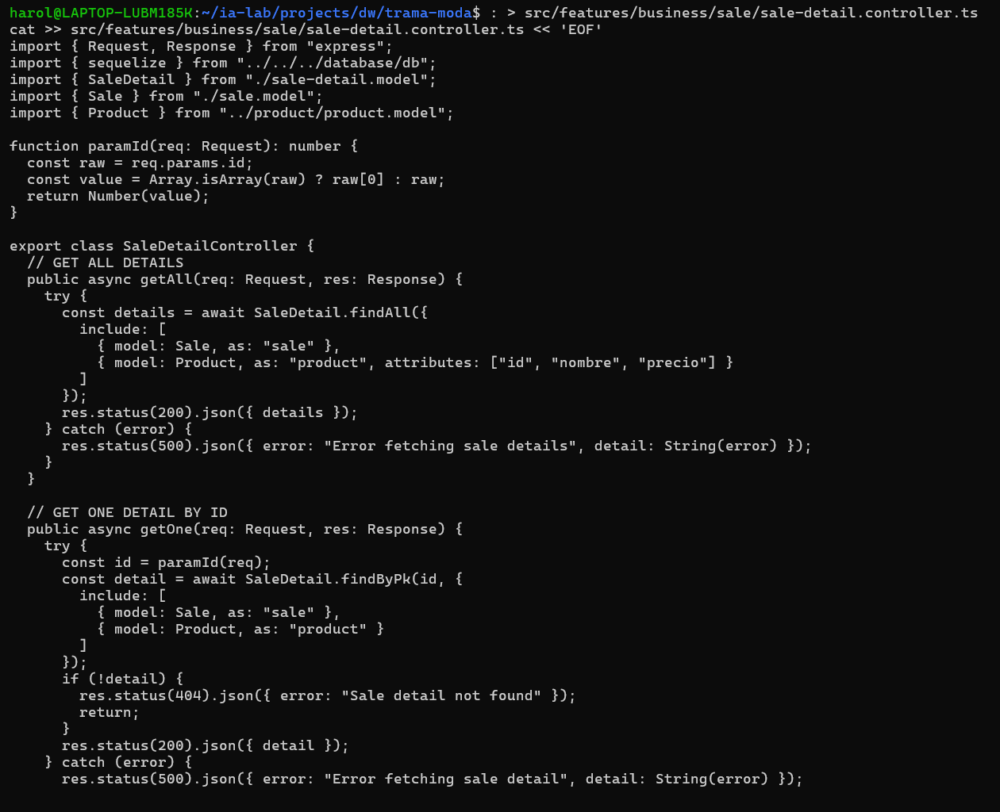

### sale-detail.routes.ts
Rutas y Anotaciones Swagger para SaleDetail

```bash
: > src/features/business/sale/sale-detail.routes.ts
cat >> src/features/business/sale/sale-detail.routes.ts << 'EOF'
import { Application } from "express";
import { SaleDetailController } from "./sale-detail.controller";

/**
 * @openapi
 * components:
 *   schemas:
 *     SaleDetail:
 *       type: object
 *       properties:
 *         id:
 *           type: integer
 *           example: 1
 *         sale_id:
 *           type: integer
 *           example: 1
 *         product_id:
 *           type: integer
 *           example: 1
 *         cantidad:
 *           type: integer
 *           example: 2
 *         precio_unitario:
 *           type: number
 *           example: 45000.00
 *         subtotal:
 *           type: number
 *           example: 90000.00
 *     SaleDetailInput:
 *       type: object
 *       required:
 *         - sale_id
 *         - product_id
 *         - cantidad
 *       properties:
 *         sale_id:
 *           type: integer
 *           example: 1
 *         product_id:
 *           type: integer
 *           example: 1
 *         cantidad:
 *           type: integer
 *           example: 2
 */

export class SaleDetailRoutes {
  public saleDetailController: SaleDetailController = new SaleDetailController();

  public routes(app: Application): void {
    /**
     * @openapi
     * /api/detalles-venta:
     *   get:
     *     summary: Obtener todos los detalles de venta
     *     tags: [SaleDetails]
     *     responses:
     *       200:
     *         description: Lista de detalles obtenida con éxito
     *   post:
     *     summary: Crear un nuevo detalle de venta (Descuenta stock)
     *     tags: [SaleDetails]
     *     requestBody:
     *       required: true
     *       content:
     *         application/json:
     *           schema:
     *             $ref: '#/components/schemas/SaleDetailInput'
     *     responses:
     *       201:
     *         description: Detalle creado y stock descontado exitosamente
     */
    app
      .route("/api/detalles-venta")
      .get(this.saleDetailController.getAll.bind(this.saleDetailController))
      .post(this.saleDetailController.create.bind(this.saleDetailController));

    /**
     * @openapi
     * /api/detalles-venta/{id}:
     *   get:
     *     summary: Obtener un detalle de venta por ID
     *     tags: [SaleDetails]
     *     parameters:
     *       - in: path
     *         name: id
     *         required: true
     *         schema:
     *           type: integer
     *     responses:
     *       200:
     *         description: Detalle encontrado
     *       404:
     *         description: Detalle no encontrado
     */
    app
      .route("/api/detalles-venta/:id")
      .get(this.saleDetailController.getOne.bind(this.saleDetailController));
  }
}
EOF
```
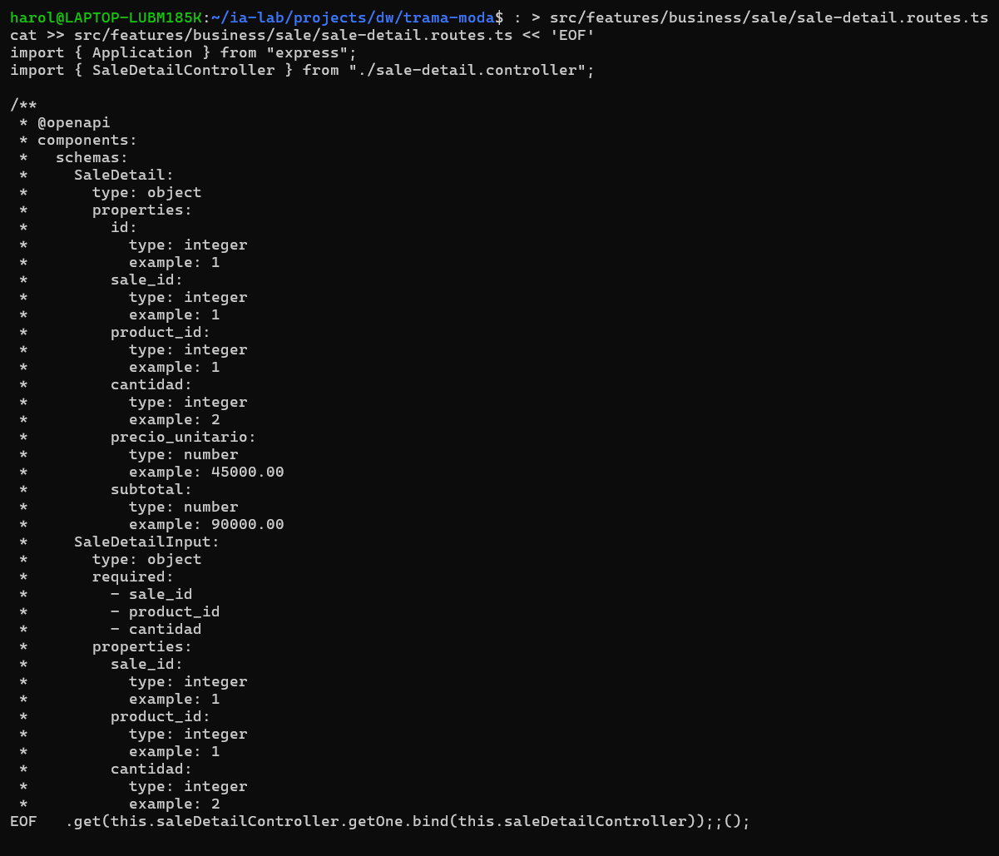

### src/routes/index.ts
Registrar las nuevas rutas en `src/routes/index.ts`

```bash
: > src/routes/index.ts
cat >> src/routes/index.ts << 'EOF'
import { ClientRoutes } from "../features/business/client/client.routes";
import { ProductRoutes } from "../features/business/product/product.routes";
import { SaleRoutes } from "../features/business/sale/sale.routes";
import { SaleDetailRoutes } from "../features/business/sale/sale-detail.routes";

export class Routes {
  public clientRoutes: ClientRoutes = new ClientRoutes();
  public productRoutes: ProductRoutes = new ProductRoutes();
  public saleRoutes: SaleRoutes = new SaleRoutes();
  public saleDetailRoutes: SaleDetailRoutes = new SaleDetailRoutes();
}
EOF
```
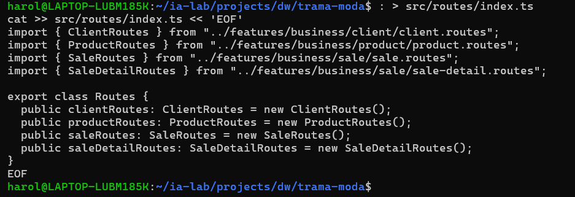

### Actualizar src/config/index.ts
```bash
: > src/config/index.ts
cat >> src/config/index.ts << 'EOF'
import express, { Application, Request, Response } from "express";
import cors from "cors";
import swaggerUi from "swagger-ui-express";
import { swaggerSpec } from "./swagger";
import { Routes } from "../routes";

export class App {
  public app: Application;
  public routePrv: Routes = new Routes();

  constructor(private port?: number | string) {
    this.app = express();
    this.settings();
    this.middlewares();
    this.routes();
  }

  private settings(): void {
    this.app.set("port", this.port || process.env.PORT || 4000);
  }

  private middlewares(): void {
    this.app.use(cors());
    this.app.use(express.json());
    this.app.use(express.urlencoded({ extended: false }));
  }

  private routes(): void {
    this.app.get("/", (req: Request, res: Response) => {
      res.json({ project: "TramaModa", status: "running" });
    });

    this.app.use("/api-docs", swaggerUi.serve, swaggerUi.setup(swaggerSpec));

    this.routePrv.clientRoutes.routes(this.app);
    this.routePrv.productRoutes.routes(this.app);
    this.routePrv.saleRoutes.routes(this.app);
    this.routePrv.saleDetailRoutes.routes(this.app);
  }

  public async listen(): Promise<void> {
    const port = this.app.get("port");
    this.app.listen(port, () => {
      console.log(`🚀 Servidor ejecutándose en puerto ${port}`);
      console.log(`📑 Documentación Swagger disponible en: http://localhost:${port}/api-docs`);
    });
  }
}
EOF
```
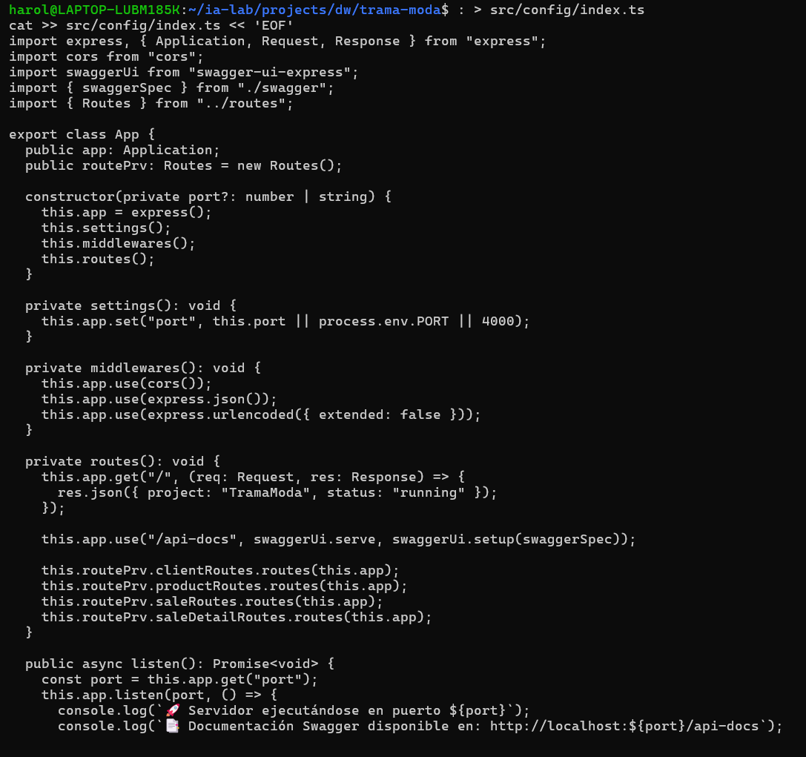
### Verificcion
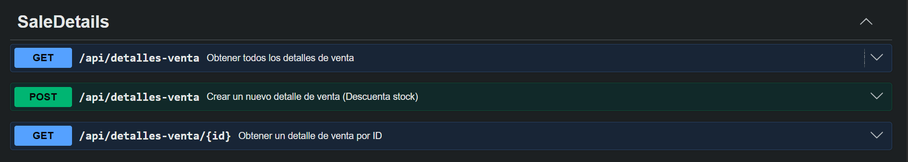

-----------------------------------------------

# collecction

### creacion de modelo `src/features/business/catalog/collection.model.ts` 

```bash
mkdir -p src/features/business/catalog
: > src/features/business/catalog/collection.model.ts
cat >> src/features/business/catalog/collection.model.ts << 'EOF'
import { DataTypes, Model } from "sequelize";
import { sequelize } from "../../../database/db";

export interface CollectionI {
  id?: number;
  nombre: string;
  descripcion?: string;
  is_active: boolean;
  createdAt?: Date;
  updatedAt?: Date;
}

export class Collection extends Model implements CollectionI {
  public id!: number;
  public nombre!: string;
  public descripcion!: string;
  public is_active!: boolean;
  public readonly createdAt!: Date;
  public readonly updatedAt!: Date;
}

Collection.init(
  {
    nombre: {
      type: DataTypes.STRING,
      allowNull: false
    },
    descripcion: {
      type: DataTypes.TEXT,
      allowNull: true
    },
    is_active: {
      type: DataTypes.BOOLEAN,
      defaultValue: true
    }
  },
  {
    sequelize,
    tableName: "collections",
    timestamps: true
  }
);
EOF
```
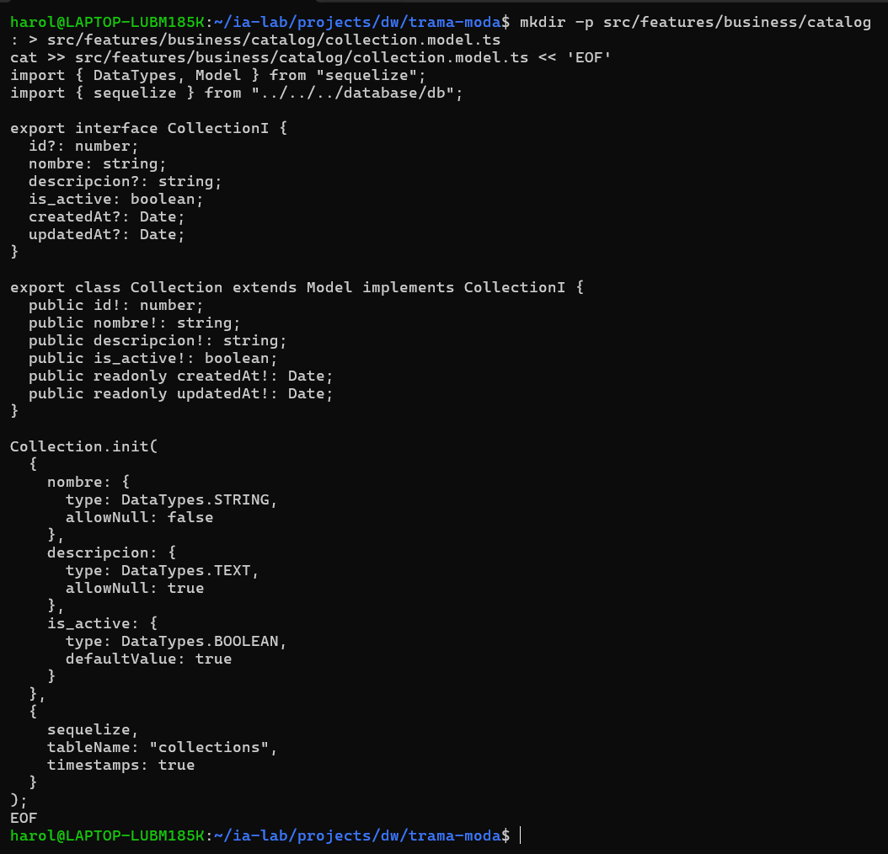

### catalog/collection.controller.ts
```bash
: > src/features/business/catalog/collection.controller.ts
cat >> src/features/business/catalog/collection.controller.ts << 'EOF'
import { Request, Response } from "express";
import { Collection } from "./collection.model";

function paramId(req: Request): number {
  const raw = req.params.id;
  const value = Array.isArray(raw) ? raw[0] : raw;
  return Number(value);
}

export class CollectionController {
  public async getAll(req: Request, res: Response) {
    try {
      const collections = await Collection.findAll({ where: { is_active: true } });
      res.status(200).json({ collections });
    } catch (error) {
      res.status(500).json({ error: "Error fetching collections", detail: String(error) });
    }
  }

  public async getOne(req: Request, res: Response) {
    try {
      const id = paramId(req);
      const collection = await Collection.findByPk(id);
      if (!collection) {
        res.status(404).json({ error: "Collection not found" });
        return;
      }
      res.status(200).json({ collection });
    } catch (error) {
      res.status(500).json({ error: "Error fetching collection", detail: String(error) });
    }
  }

  public async create(req: Request, res: Response) {
    try {
      const { nombre, descripcion } = req.body;
      const collection = await Collection.create({
        nombre,
        descripcion,
        is_active: true
      });
      res.status(201).json({ collection });
    } catch (error) {
      res.status(500).json({ error: "Error creating collection", detail: String(error) });
    }
  }

  public async update(req: Request, res: Response) {
    try {
      const id = paramId(req);
      const collection = await Collection.findByPk(id);
      if (!collection) {
        res.status(404).json({ error: "Collection not found" });
        return;
      }
      await collection.update(req.body);
      res.status(200).json({ message: "Collection updated successfully", collection });
    } catch (error) {
      res.status(500).json({ error: "Error updating collection", detail: String(error) });
    }
  }

  public async deleteLogical(req: Request, res: Response) {
    try {
      const id = paramId(req);
      const collection = await Collection.findByPk(id);
      if (!collection) {
        res.status(404).json({ error: "Collection not found" });
        return;
      }
      await collection.update({ is_active: false });
      res.status(200).json({ message: "Collection deactivated", collection });
    } catch (error) {
      res.status(500).json({ error: "Error deactivating collection", detail: String(error) });
    }
  }
}
EOF
```
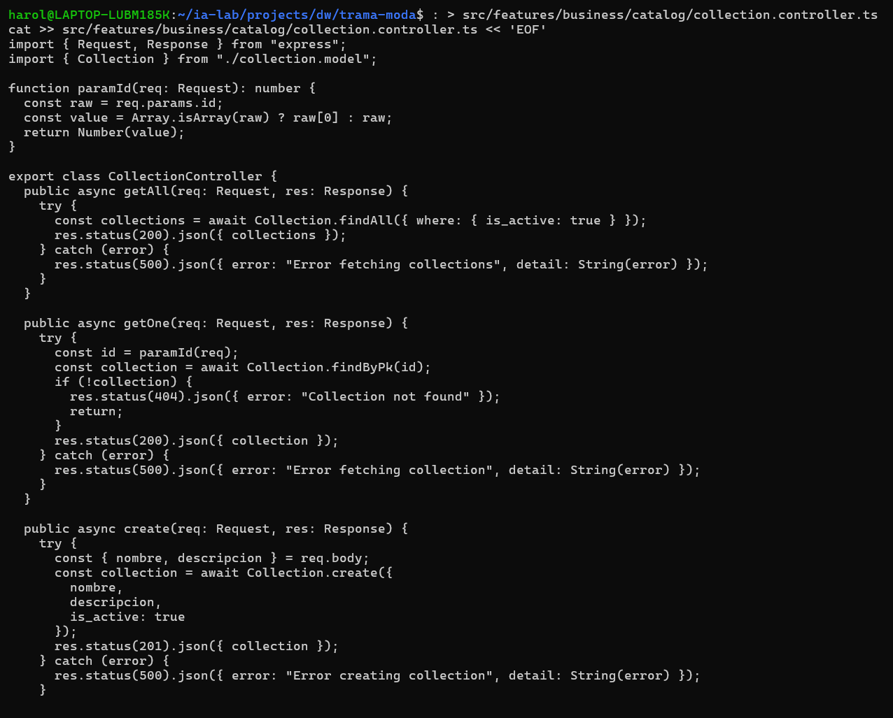

### Rutas y Swagger UI (src/features/business/catalog/collection.routes.ts)
```Bash
: > src/features/business/catalog/collection.routes.ts
cat >> src/features/business/catalog/collection.routes.ts << 'EOF'
import { Application } from "express";
import { CollectionController } from "./collection.controller";

/**
 * @openapi
 * components:
 *   schemas:
 *     Collection:
 *       type: object
 *       properties:
 *         id:
 *           type: integer
 *           example: 1
 *         nombre:
 *           type: string
 *           example: "Colección Primavera - Verano"
 *         descripcion:
 *           type: string
 *           example: "Ropa ligera y colores pasteles"
 *         is_active:
 *           type: boolean
 *           example: true
 *     CollectionInput:
 *       type: object
 *       required:
 *         - nombre
 *       properties:
 *         nombre:
 *           type: string
 *           example: "Colección Primavera - Verano"
 *         descripcion:
 *           type: string
 *           example: "Ropa ligera y colores pasteles"
 */

export class CollectionRoutes {
  public collectionController: CollectionController = new CollectionController();

  public routes(app: Application): void {
    /**
     * @openapi
     * /api/colecciones:
     *   get:
     *     summary: Obtener todas las colecciones activas
     *     tags: [Collections]
     *     responses:
     *       200:
     *         description: Lista de colecciones
     *   post:
     *     summary: Crear una nueva colección
     *     tags: [Collections]
     *     requestBody:
     *       required: true
     *       content:
     *         application/json:
     *           schema:
     *             $ref: '#/components/schemas/CollectionInput'
     *     responses:
     *       201:
     *         description: Colección creada exitosamente
     */
    app
      .route("/api/colecciones")
      .get(this.collectionController.getAll.bind(this.collectionController))
      .post(this.collectionController.create.bind(this.collectionController));

    /**
     * @openapi
     * /api/colecciones/{id}:
     *   get:
     *     summary: Obtener colección por ID
     *     tags: [Collections]
     *     parameters:
     *       - in: path
     *         name: id
     *         required: true
     *         schema:
     *           type: integer
     *     responses:
     *       200:
     *         description: Colección encontrada
     *       404:
     *         description: Colección no encontrada
     *   put:
     *     summary: Actualizar colección por ID
     *     tags: [Collections]
     *     parameters:
     *       - in: path
     *         name: id
     *         required: true
     *         schema:
     *           type: integer
     *     requestBody:
     *       required: true
     *       content:
     *         application/json:
     *           schema:
     *             $ref: '#/components/schemas/CollectionInput'
     *     responses:
     *       200:
     *         description: Colección actualizada
     */
    app
      .route("/api/colecciones/:id")
      .get(this.collectionController.getOne.bind(this.collectionController))
      .put(this.collectionController.update.bind(this.collectionController));

    /**
     * @openapi
     * /api/colecciones/{id}/deactivate:
     *   patch:
     *     summary: Desactivar colección (borrado lógico)
     *     tags: [Collections]
     *     parameters:
     *       - in: path
     *         name: id
     *         required: true
     *         schema:
     *           type: integer
     *     responses:
     *       200:
     *         description: Colección desactivada
     */
    app
      .route("/api/colecciones/:id/deactivate")
      .patch(this.collectionController.deleteLogical.bind(this.collectionController));
  }
}
EOF
```
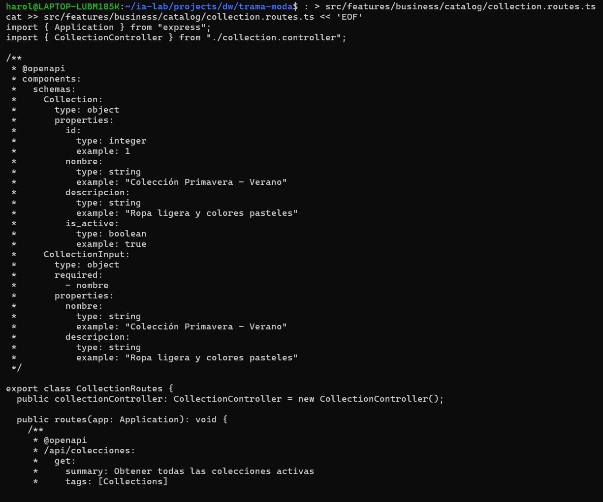

### Actualizar db.ts
```bash
 : > src/database/db.ts
cat >> src/database/db.ts << 'EOF'
import { Sequelize } from "sequelize";
import dotenv from "dotenv";

dotenv.config();

interface DatabaseConfig {
  dialect: string;
  host: string;
  username: string;
  password: string;
  database: string;
  port: number;
}

const dbConfigurations: Record<string, DatabaseConfig> = {
  mysql: {
    dialect: "mysql",
    host: process.env.MYSQL_HOST || process.env.DB_HOST || "localhost",
    username: process.env.MYSQL_USER || process.env.DB_USER || "root",
    password: process.env.MYSQL_PASSWORD || process.env.DB_PASSWORD || "",
    database: process.env.MYSQL_NAME || process.env.DB_NAME || "trama-moda",
    port: parseInt(process.env.MYSQL_PORT || process.env.DB_PORT || "3306")
  }
};

const selectedEngine = process.env.DB_ENGINE || "mysql";
const selectedConfig = dbConfigurations[selectedEngine];

if (!selectedConfig) {
  throw new Error(`Motor de base de datos no soportado: ${selectedEngine}`);
}

export const sequelize = new Sequelize(
  selectedConfig.database,
  selectedConfig.username,
  selectedConfig.password,
  {
    host: selectedConfig.host,
    port: selectedConfig.port,
    dialect: selectedConfig.dialect as any,
    logging: process.env.NODE_ENV === 'development' ? console.log : false,
    pool: { max: 5, min: 0, acquire: 30000, idle: 10000 }
  }
);

export const testConnection = async (): Promise<boolean> => {
  try {
    await sequelize.authenticate();
    console.log(`✅ Conexión exitosa a ${selectedEngine.toUpperCase()}`);
    return true;
  }
EOF
```
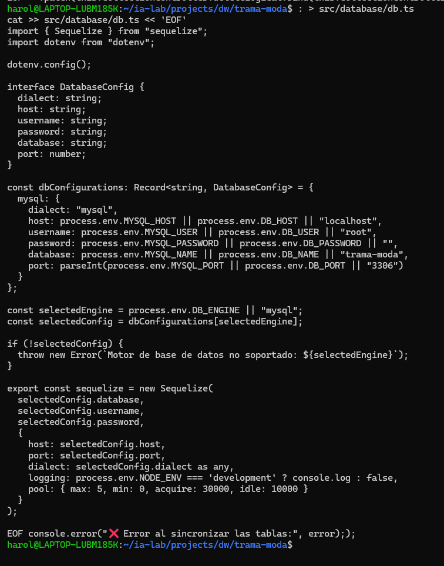

### Actualizar routes/index.ts
```bash
: > src/routes/index.ts
cat >> src/routes/index.ts << 'EOF'
import { ClientRoutes } from "../features/business/client/client.routes";
import { ProductRoutes } from "../features/business/product/product.routes";
import { SaleRoutes } from "../features/business/sale/sale.routes";
import { SaleDetailRoutes } from "../features/business/sale/sale-detail.routes";
import { CollectionRoutes } from "../features/business/catalog/collection.routes";

export class Routes {
  public clientRoutes: ClientRoutes = new ClientRoutes();
  public productRoutes: ProductRoutes = new ProductRoutes();
  public saleRoutes: SaleRoutes = new SaleRoutes();
  public saleDetailRoutes: SaleDetailRoutes = new SaleDetailRoutes();
  public collectionRoutes: CollectionRoutes = new CollectionRoutes();
}
EOF
```
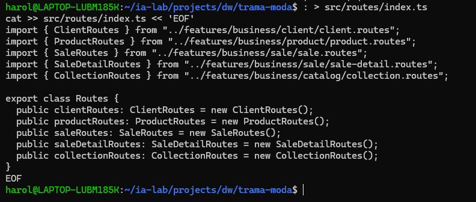

### Actualizar config/index.ts
```bash
: > src/config/index.ts
cat >> src/config/index.ts << 'EOF'
import express, { Application, Request, Response } from "express";
import cors from "cors";
import swaggerUi from "swagger-ui-express";
import { swaggerSpec } from "./swagger";
import { Routes } from "../routes";

export class App {
  public app: Application;
  public routePrv: Routes = new Routes();

  constructor(private port?: number | string) {
    this.app = express();
    this.settings();
    this.middlewares();
    this.routes();
  }

  private settings(): void {
    this.app.set("port", this.port || process.env.PORT || 4000);
  }

  private middlewares(): void {
    this.app.use(cors());
    this.app.use(express.json());
    this.app.use(express.urlencoded({ extended: false }));
  }

  private routes(): void {
    this.app.get("/", (req: Request, res: Response) => {
      res.json({ project: "TramaModa", status: "running" });
    });

    this.app.use("/api-docs", swaggerUi.serve, swaggerUi.setup(swaggerSpec));

    this.routePrv.clientRoutes.routes(this.app);
    this.routePrv.productRoutes.routes(this.app);
    this.routePrv.saleRoutes.routes(this.app);
    this.routePrv.saleDetailRoutes.routes(this.app);
    this.routePrv.collectionRoutes.routes(this.app);
  }

  public async listen(): Promise<void> {
    const port = this.app.get("port");
    this.app.listen(port, () => {
      console.log(`🚀 Servidor ejecutándose en puerto ${port}`);
      console.log(`📑 Documentación Swagger disponible en: http://localhost:${port}/api-docs`);
    });
  }
}
EOF
```
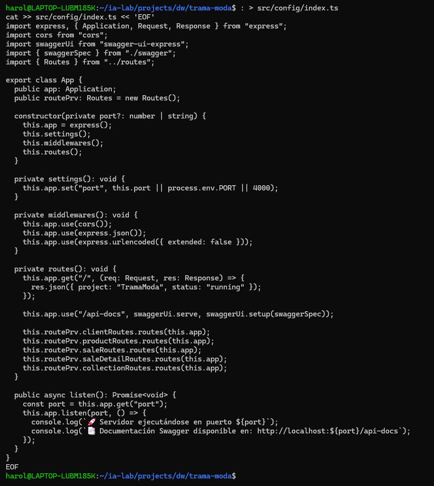

### Creacion de los http de prubeas
#### http/collections.create.http
```bash
: > http/collections.create.http
cat >> http/collections.create.http << 'EOF'
### Feature Collection — CREATE
### Leyenda: SIN AUTH
@baseUrl = http://localhost:4000

# @name createCollection
POST {{baseUrl}}/api/colecciones
Content-Type: application/json

{
  "nombre": "Primavera - Verano 2026",
  "descripcion": "Colección de prendas ligeras, linos y tonos pasteles"
}
EOF
```
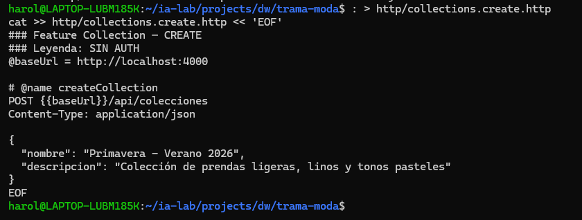

#### http/collections.get.http
```bash
: > http/collections.get.http
cat >> http/collections.get.http << 'EOF'
### Feature Collection — READ ALL
### Leyenda: SIN AUTH
@baseUrl = http://localhost:4000

# @name getAllCollections
GET {{baseUrl}}/api/colecciones
Content-Type: application/json

###

### Feature Collection — READ ONE
### Leyenda: SIN AUTH

# @name getOneCollection
GET {{baseUrl}}/api/colecciones/1
Content-Type: application/json
EOF
```
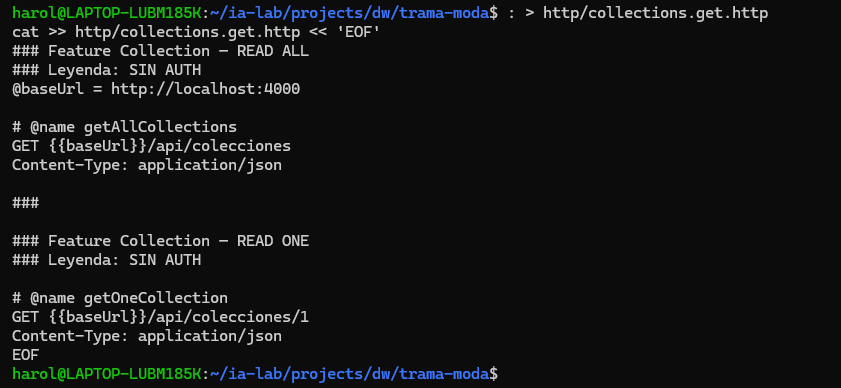

#### http/collections.update.http
```bash
: > http/collections.update.http
cat >> http/collections.update.http << 'EOF'
### Feature Collection — UPDATE
### Leyenda: SIN AUTH
@baseUrl = http://localhost:4000

# @name updateCollection
PUT {{baseUrl}}/api/colecciones/1
Content-Type: application/json

{
  "nombre": "Primavera - Verano 2026 (Edición Limitada)",
  "descripcion": "Colección renovada con telas sostenibles y linos importados"
}
EOF
```
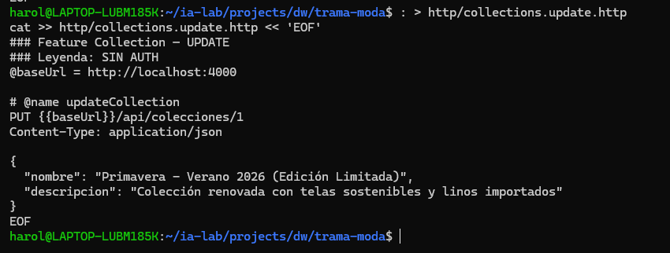

#### http/collections.delete.http
```bash
: > http/collections.delete.http
cat >> http/collections.delete.http << 'EOF'
### Feature Collection — DELETE LOGICAL (Desactivar)
### Leyenda: SIN AUTH
@baseUrl = http://localhost:4000

# @name deactivateCollection
PATCH {{baseUrl}}/api/colecciones/1/deactivate
Content-Type: application/json
EOF
```
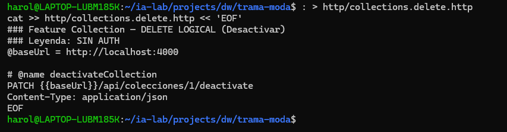

### Verificacion 
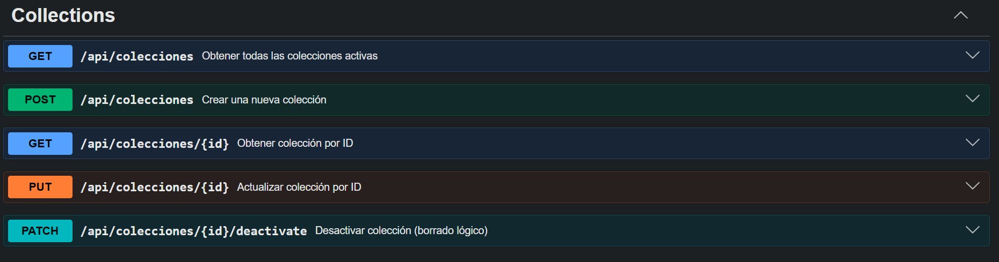
----------------------------------------------------------------------------------

# varients 
### Variant.model.ts
```bash
mkdir -p src/features/business/variants
: > src/features/business/variants/variant.model.ts
cat >> src/features/business/variants/variant.model.ts << 'EOF'
import { DataTypes, Model } from "sequelize";
import { sequelize } from "../../../database/db";

export interface VariantI {
  id?: number;
  nombre: string;
  descripcion?: string;
  is_active: boolean;
  createdAt?: Date;
  updatedAt?: Date;
}

export class Variant extends Model implements VariantI {
  public id!: number;
  public nombre!: string;
  public descripcion!: string;
  public is_active!: boolean;
  public readonly createdAt!: Date;
  public readonly updatedAt!: Date;
}

Variant.init(
  {
    nombre: {
      type: DataTypes.STRING,
      allowNull: false
    },
    descripcion: {
      type: DataTypes.TEXT,
      allowNull: true
    },
    is_active: {
      type: DataTypes.BOOLEAN,
      defaultValue: true
    }
  },
  {
    sequelize,
    tableName: "variants",
    timestamps: true
  }
);
EOF
```
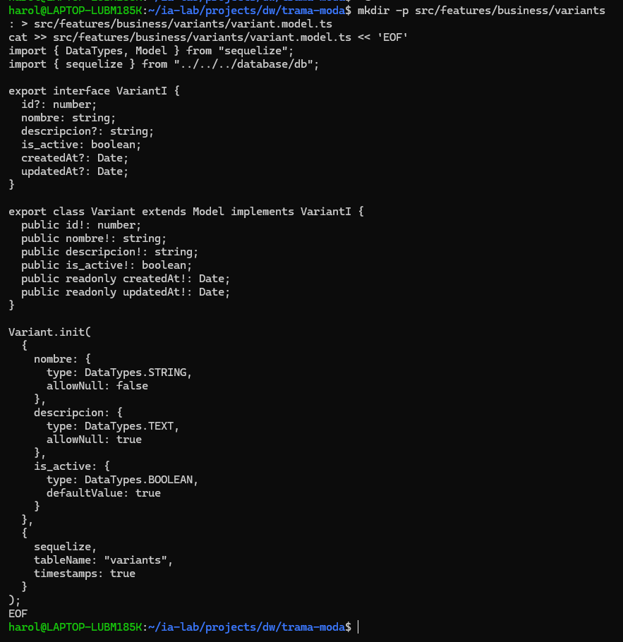

### variants/variant.controller.ts
```bash
: > src/features/business/variants/variant.controller.ts
cat >> src/features/business/variants/variant.controller.ts << 'EOF'
import { Request, Response } from "express";
import { Variant } from "./variant.model";

function paramId(req: Request): number {
  const raw = req.params.id;
  const value = Array.isArray(raw) ? raw[0] : raw;
  return Number(value);
}

export class VariantController {
  public async getAll(req: Request, res: Response) {
    try {
      const variants = await Variant.findAll({ where: { is_active: true } });
      res.status(200).json({ variants });
    } catch (error) {
      res.status(500).json({ error: "Error fetching variants", detail: String(error) });
    }
  }

  public async getOne(req: Request, res: Response) {
    try {
      const id = paramId(req);
      const variant = await Variant.findByPk(id);
      if (!variant) {
        res.status(404).json({ error: "Variant not found" });
        return;
      }
      res.status(200).json({ variant });
    } catch (error) {
      res.status(500).json({ error: "Error fetching variant", detail: String(error) });
    }
  }

  public async create(req: Request, res: Response) {
    try {
      const { nombre, descripcion } = req.body;
      const variant = await Variant.create({
        nombre,
        descripcion,
        is_active: true
      });
      res.status(201).json({ variant });
    } catch (error) {
      res.status(500).json({ error: "Error creating variant", detail: String(error) });
    }
  }

  public async update(req: Request, res: Response) {
    try {
      const id = paramId(req);
      const variant = await Variant.findByPk(id);
      if (!variant) {
        res.status(404).json({ error: "Variant not found" });
        return;
      }
      await variant.update(req.body);
      res.status(200).json({ message: "Variant updated successfully", variant });
    } catch (error) {
      res.status(500).json({ error: "Error updating variant", detail: String(error) });
    }
  }

  public async deleteLogical(req: Request, res: Response) {
    try {
      const id = paramId(req);
      const variant = await Variant.findByPk(id);
      if (!variant) {
        res.status(404).json({ error: "Variant not found" });
        return;
      }
      await variant.update({ is_active: false });
      res.status(200).json({ message: "Variant deactivated", variant });
    } catch (error) {
      res.status(500).json({ error: "Error deactivating variant", detail: String(error) });
    }
  }
}
EOF
```
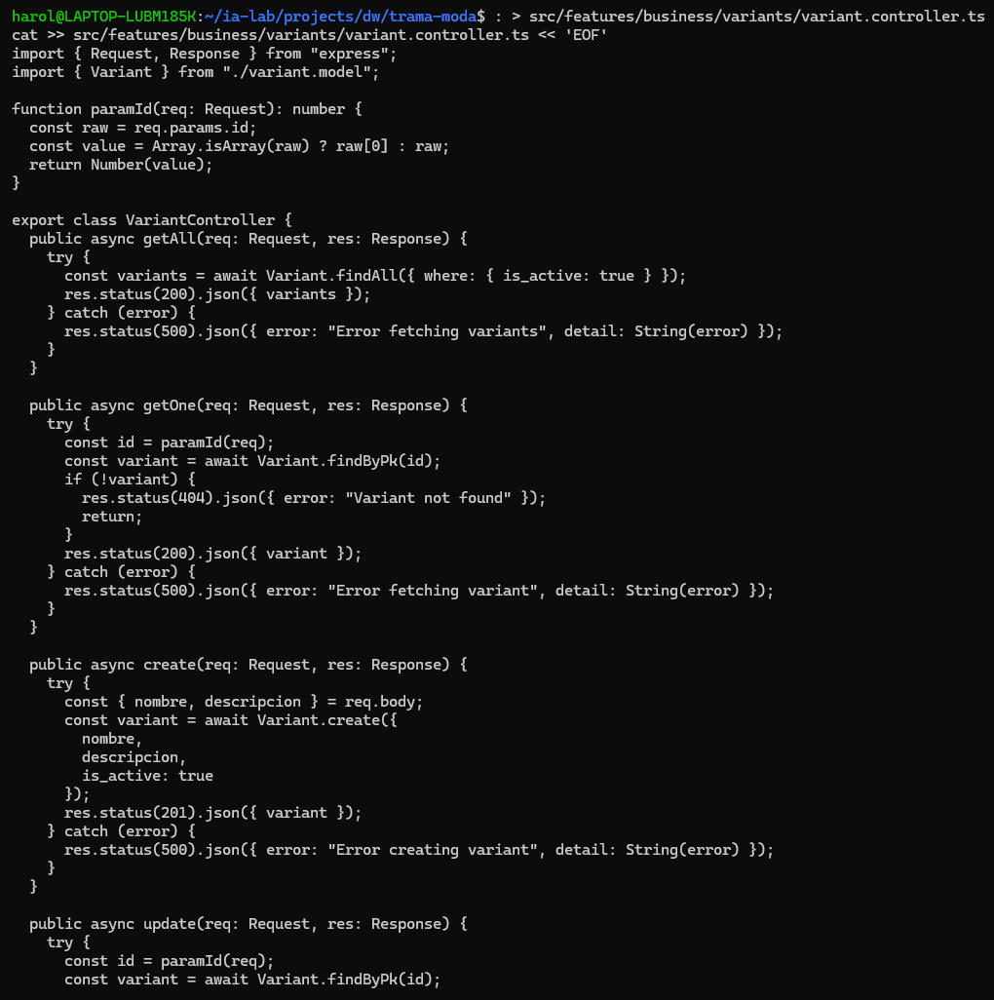

### variants/variant.routes.ts
```bash
: > src/features/business/variants/variant.routes.ts
cat >> src/features/business/variants/variant.routes.ts << 'EOF'
import { Application } from "express";
import { VariantController } from "./variant.controller";

/**
 * @openapi
 * components:
 *   schemas:
 *     Variant:
 *       type: object
 *       properties:
 *         id:
 *           type: integer
 *           example: 1
 *         nombre:
 *           type: string
 *           example: "Talla M - Color Azul Marino"
 *         descripcion:
 *           type: string
 *           example: "Variante física de prenda talla M en tono azul"
 *         is_active:
 *           type: boolean
 *           example: true
 *     VariantInput:
 *       type: object
 *       required:
 *         - nombre
 *       properties:
 *         nombre:
 *           type: string
 *           example: "Talla M - Color Azul Marino"
 *         descripcion:
 *           type: string
 *           example: "Variante física de prenda talla M en tono azul"
 */

export class VariantRoutes {
  public variantController: VariantController = new VariantController();

  public routes(app: Application): void {
    /**
     * @openapi
     * /api/variantes:
     *   get:
     *     summary: Obtener todas las variantes activas
     *     tags: [Variants]
     *     responses:
     *       200:
     *         description: Lista de variantes
     *   post:
     *     summary: Crear una nueva variante
     *     tags: [Variants]
     *     requestBody:
     *       required: true
     *       content:
     *         application/json:
     *           schema:
     *             $ref: '#/components/schemas/VariantInput'
     *     responses:
     *       201:
     *         description: Variante creada exitosamente
     */
    app
      .route("/api/variantes")
      .get(this.variantController.getAll.bind(this.variantController))
      .post(this.variantController.create.bind(this.variantController));

    /**
     * @openapi
     * /api/variantes/{id}:
     *   get:
     *     summary: Obtener variante por ID
     *     tags: [Variants]
     *     parameters:
     *       - in: path
     *         name: id
     *         required: true
     *         schema:
     *           type: integer
     *     responses:
     *       200:
     *         description: Variante encontrada
     *       404:
     *         description: Variante no encontrada
     *   put:
     *     summary: Actualizar variante por ID
     *     tags: [Variants]
     *     parameters:
     *       - in: path
     *         name: id
     *         required: true
     *         schema:
     *           type: integer
     *     requestBody:
     *       required: true
     *       content:
     *         application/json:
     *           schema:
     *             $ref: '#/components/schemas/VariantInput'
     *     responses:
     *       200:
     *         description: Variante actualizada
     */
    app
      .route("/api/variantes/:id")
      .get(this.variantController.getOne.bind(this.variantController))
      .put(this.variantController.update.bind(this.variantController));

    /**
     * @openapi
     * /api/variantes/{id}/deactivate:
     *   patch:
     *     summary: Desactivar variante (borrado lógico)
     *     tags: [Variants]
     *     parameters:
     *       - in: path
     *         name: id
     *         required: true
     *         schema:
     *           type: integer
     *     responses:
     *       200:
     *         description: Variante desactivada
     */
    app
      .route("/api/variantes/:id/deactivate")
      .patch(this.variantController.deleteLogical.bind(this.variantController));
  }
}
EOF
```
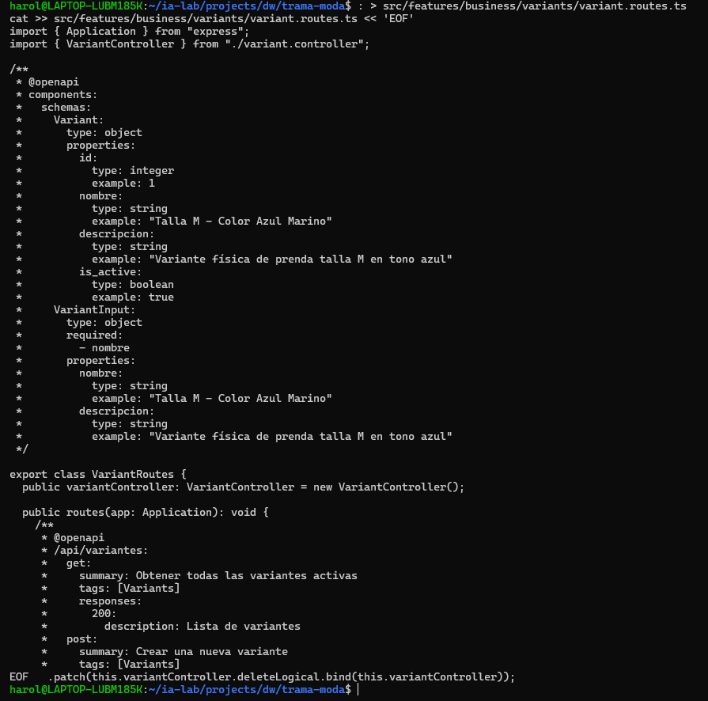

### http de prueba con crud
#### : > src/features/business/variants/variants.create.http
cat >> src/features/business/variants/variants.create.http << 'EOF'
### Feature Variant — CREATE
### variants/variants.create.http
```bash
Leyenda: SIN AUTH
@baseUrl = http://localhost:4000

# @name createVariant
POST {{baseUrl}}/api/variantes
Content-Type: application/json

{
  "nombre": "Talla M - Color Azul Marino",
  "descripcion": "Variante física de prenda talla M en tono azul"
}
EOF
```
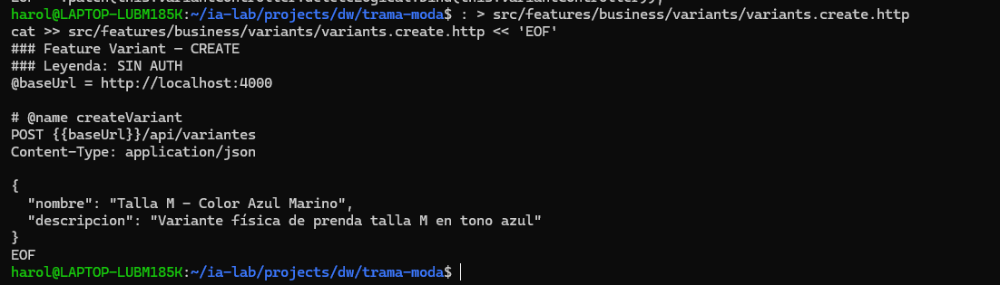

#### variants/variants.get.http
```bash 
: > src/features/business/variants/variants.get.http
cat >> src/features/business/variants/variants.get.http << 'EOF'
### Feature Variant — READ ALL
### Leyenda: SIN AUTH
@baseUrl = http://localhost:4000

# @name getAllVariants
GET {{baseUrl}}/api/variantes
Content-Type: application/json

###

### Feature Variant — READ ONE
### Leyenda: SIN AUTH

# @name getOneVariant
GET {{baseUrl}}/api/variantes/1
Content-Type: application/json
EOF
```
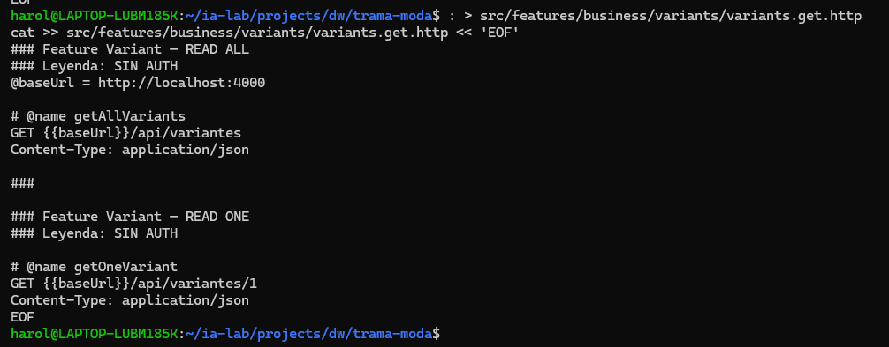

#### variants/variants.update.http
```bash
: > src/features/business/variants/variants.update.http
cat >> src/features/business/variants/variants.update.http << 'EOF'
### Feature Variant — UPDATE
### Leyenda: SIN AUTH
@baseUrl = http://localhost:4000

# @name updateVariant
PUT {{baseUrl}}/api/variantes/1
Content-Type: application/json

{
  "nombre": "Talla L - Color Azul Marino",
  "descripcion": "Variante física actualizada a Talla L"
}
EOF
```
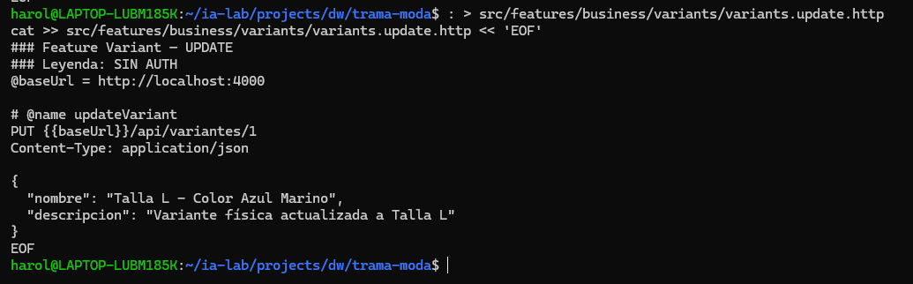

#### variants/variants.delete.http
```bash 
: > src/features/business/variants/variants.delete.http
cat >> src/features/business/variants/variants.delete.http << 'EOF'
### Feature Variant — DELETE LOGICAL (Desactivar)
### Leyenda: SIN AUTH
@baseUrl = http://localhost:4000

# @name deactivateVariant
PATCH {{baseUrl}}/api/variantes/1/deactivate
Content-Type: application/json
EOF
```
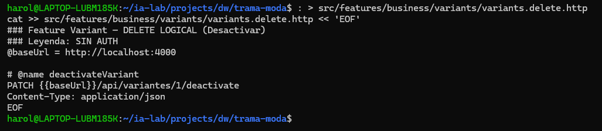

### Registrar variant.model en db.ts
```bash
: > src/database/db.ts
cat >> src/database/db.ts << 'EOF'
import { Sequelize } from "sequelize";
import dotenv from "dotenv";

dotenv.config();

interface DatabaseConfig {
  dialect: string;
  host: string;
  username: string;
  password: string;
  database: string;
  port: number;
}

const dbConfigurations: Record<string, DatabaseConfig> = {
  mysql: {
    dialect: "mysql",
    host: process.env.MYSQL_HOST || process.env.DB_HOST || "localhost",
    username: process.env.MYSQL_USER || process.env.DB_USER || "root",
    password: process.env.MYSQL_PASSWORD || process.env.DB_PASSWORD || "",
    database: process.env.MYSQL_NAME || process.env.DB_NAME || "trama-moda",
    port: parseInt(process.env.MYSQL_PORT || process.env.DB_PORT || "3306")
  }
};

const selectedEngine = process.env.DB_ENGINE || "mysql";
const selectedConfig = dbConfigurations[selectedEngine];

if (!selectedConfig) {
  throw new Error(`Motor de base de datos no soportado: ${selectedEngine}`);
}

export const sequelize = new Sequelize(
  selectedConfig.database,
  selectedConfig.username,
  selectedConfig.password,
  {
    host: selectedConfig.host,
    port: selectedConfig.port,
    dialect: selectedConfig.dialect as any,
    logging: process.env.NODE_ENV === 'development' ? console.log : false,
    pool: { max: 5, min: 0, acquire: 30000, idle: 10000 }
  }
);

export const testConnection = async (): Promise<boolean> => {
  try {
    await sequelize.authenticate();
    console.log(`✅ Conexión exitosa a ${selectedEngine.toUpperCase()}`);
    return true;
  } catch (error) {
    console.error(`❌ Error de conexión:`, error);
    return false;
  }
};

export const syncDatabase = async (): Promise<void> => {
  try {
    require("../features/business/client/client.model");
    require("../features/business/product/product.model");
    require("../features/business/sale/sale.model");
    require("../features/business/sale/sale-detail.model");
    require("../features/business/catalog/collection.model");
    require("../features/business/variants/variant.model");

    await sequelize.sync({ alter: true });
    console.log("✅ Tablas sincronizadas correctamente en MySQL");
  } catch (error) {
    console.error("❌ Error al sincronizar las tablas:", error);
  }
};
EOF
```
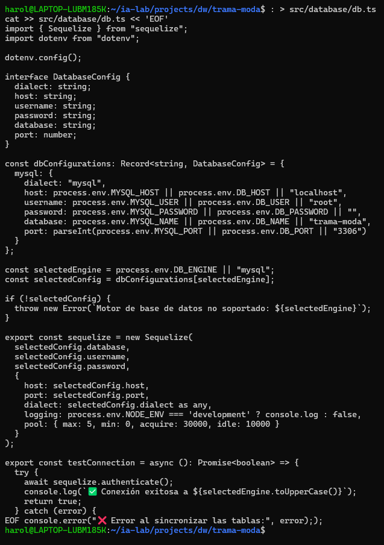

### Registrar variantRoutes en routes/index.ts
```bash
: > src/routes/index.ts
cat >> src/routes/index.ts << 'EOF'
import { ClientRoutes } from "../features/business/client/client.routes";
import { ProductRoutes } from "../features/business/product/product.routes";
import { SaleRoutes } from "../features/business/sale/sale.routes";
import { SaleDetailRoutes } from "../features/business/sale/sale-detail.routes";
import { CollectionRoutes } from "../features/business/catalog/collection.routes";
import { VariantRoutes } from "../features/business/variants/variant.routes";

export class Routes {
  public clientRoutes: ClientRoutes = new ClientRoutes();
  public productRoutes: ProductRoutes = new ProductRoutes();
  public saleRoutes: SaleRoutes = new SaleRoutes();
  public saleDetailRoutes: SaleDetailRoutes = new SaleDetailRoutes();
  public collectionRoutes: CollectionRoutes = new CollectionRoutes();
  public variantRoutes: VariantRoutes = new VariantRoutes();
}
EOF
```
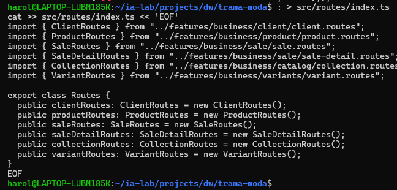

### Registrar variantRoutes en config/index.ts
```bash
: > src/config/index.ts
cat >> src/config/index.ts << 'EOF'
import express, { Application, Request, Response } from "express";
import cors from "cors";
import swaggerUi from "swagger-ui-express";
import { swaggerSpec } from "./swagger";
import { Routes } from "../routes";

export class App {
  public app: Application;
  public routePrv: Routes = new Routes();

  constructor(private port?: number | string) {
    this.app = express();
    this.settings();
    this.middlewares();
    this.routes();
  }

  private settings(): void {
    this.app.set("port", this.port || process.env.PORT || 4000);
  }

  private middlewares(): void {
    this.app.use(cors());
    this.app.use(express.json());
    this.app.use(express.urlencoded({ extended: false }));
  }

  private routes(): void {
    this.app.get("/", (req: Request, res: Response) => {
      res.json({ project: "TramaModa", status: "running" });
    });

    this.app.use("/api-docs", swaggerUi.serve, swaggerUi.setup(swaggerSpec));

    this.routePrv.clientRoutes.routes(this.app);
    this.routePrv.productRoutes.routes(this.app);
    this.routePrv.saleRoutes.routes(this.app);
    this.routePrv.saleDetailRoutes.routes(this.app);
    this.routePrv.collectionRoutes.routes(this.app);
    this.routePrv.variantRoutes.routes(this.app);
  }

  public async listen(): Promise<void> {
    const port = this.app.get("port");
    this.app.listen(port, () => {
      console.log(`🚀 Servidor ejecutándose en puerto ${port}`);
      console.log(`📑 Documentación Swagger disponible en: http://localhost:${port}/api-docs`);
    });
  }
}
EOF
```
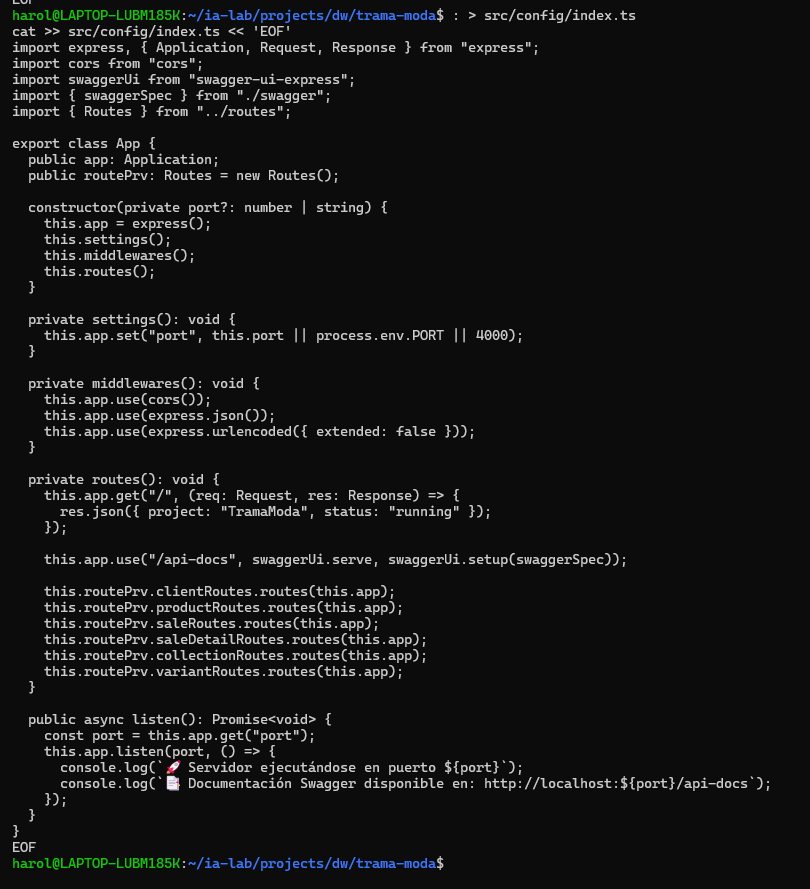

### Verificacion 
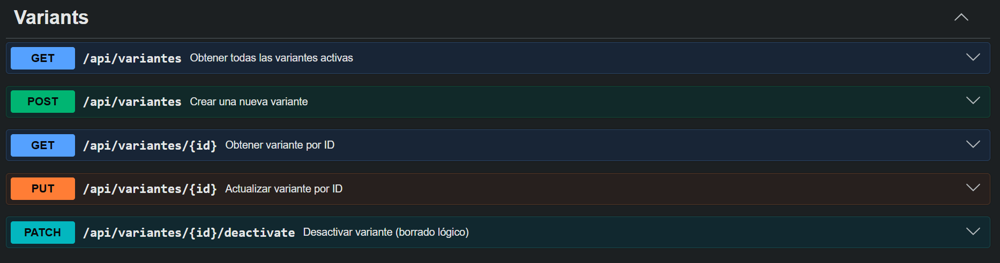

# Branch
### branch.model.ts
```bash
mkdir -p src/features/business/branch
: > src/features/business/branch/branch.model.ts
cat >> src/features/business/branch/branch.model.ts << 'EOF'
import { DataTypes, Model } from "sequelize";
import { sequelize } from "../../../database/db";

export interface BranchI {
  id?: number;
  nombre: string;
  direccion?: string;
  telefono?: string;
  is_active: boolean;
  createdAt?: Date;
  updatedAt?: Date;
}

export class Branch extends Model implements BranchI {
  public id!: number;
  public nombre!: string;
  public direccion!: string;
  public telefono!: string;
  public is_active!: boolean;
  public readonly createdAt!: Date;
  public readonly updatedAt!: Date;
}

Branch.init(
  {
    nombre: {
      type: DataTypes.STRING,
      allowNull: false
    },
    direccion: {
      type: DataTypes.STRING,
      allowNull: true
    },
    telefono: {
      type: DataTypes.STRING,
      allowNull: true
    },
    is_active: {
      type: DataTypes.BOOLEAN,
      defaultValue: true
    }
  },
  {
    sequelize,
    tableName: "branches",
    timestamps: true
  }
);
EOF
```
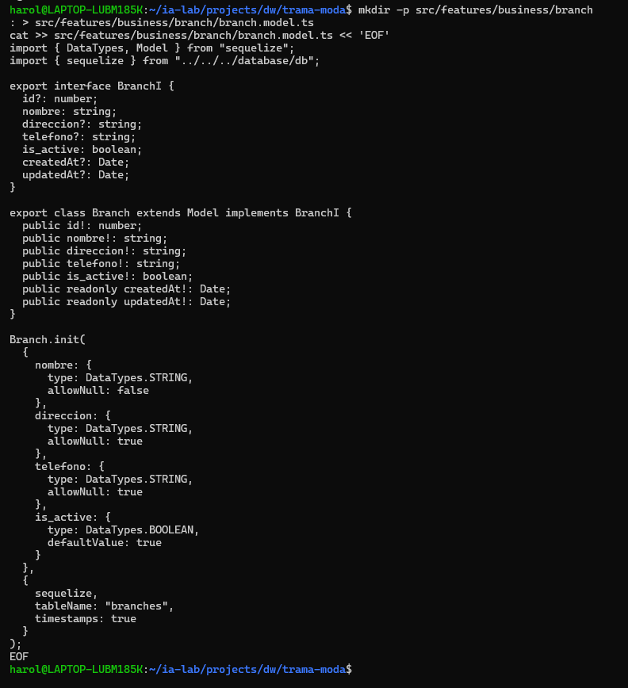

### branch.controller.ts
```bash
: > src/features/business/branch/branch.controller.ts
cat >> src/features/business/branch/branch.controller.ts << 'EOF'
import { Request, Response } from "express";
import { Branch } from "./branch.model";

function paramId(req: Request): number {
  const raw = req.params.id;
  const value = Array.isArray(raw) ? raw[0] : raw;
  return Number(value);
}

export class BranchController {
  public async getAll(req: Request, res: Response) {
    try {
      const branches = await Branch.findAll({ where: { is_active: true } });
      res.status(200).json({ branches });
    } catch (error) {
      res.status(500).json({ error: "Error fetching branches", detail: String(error) });
    }
  }

  public async getOne(req: Request, res: Response) {
    try {
      const id = paramId(req);
      const branch = await Branch.findByPk(id);
      if (!branch) {
        res.status(404).json({ error: "Branch not found" });
        return;
      }
      res.status(200).json({ branch });
    } catch (error) {
      res.status(500).json({ error: "Error fetching branch", detail: String(error) });
    }
  }

  public async create(req: Request, res: Response) {
    try {
      const { nombre, direccion, telefono } = req.body;
      const branch = await Branch.create({
        nombre,
        direccion,
        telefono,
        is_active: true
      });
      res.status(201).json({ branch });
    } catch (error) {
      res.status(500).json({ error: "Error creating branch", detail: String(error) });
    }
  }

  public async update(req: Request, res: Response) {
    try {
      const id = paramId(req);
      const branch = await Branch.findByPk(id);
      if (!branch) {
        res.status(404).json({ error: "Branch not found" });
        return;
      }
      await branch.update(req.body);
      res.status(200).json({ message: "Branch updated successfully", branch });
    } catch (error) {
      res.status(500).json({ error: "Error updating branch", detail: String(error) });
    }
  }

  public async deleteLogical(req: Request, res: Response) {
    try {
      const id = paramId(req);
      const branch = await Branch.findByPk(id);
      if (!branch) {
        res.status(404).json({ error: "Branch not found" });
        return;
      }
      await branch.update({ is_active: false });
      res.status(200).json({ message: "Branch deactivated", branch });
    } catch (error) {
      res.status(500).json({ error: "Error deactivating branch", detail: String(error) });
    }
  }
}
EOF
```
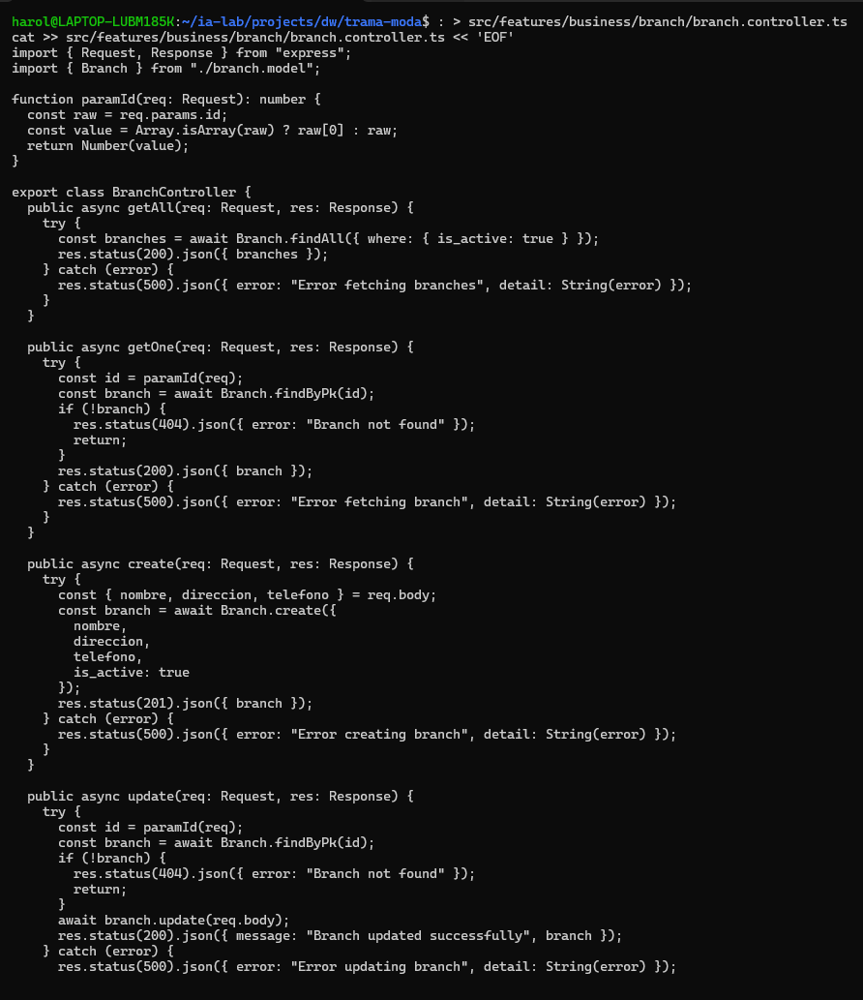

### branch/branch.routes.ts
```bash
: > src/features/business/branch/branch.routes.ts
cat >> src/features/business/branch/branch.routes.ts << 'EOF'
import { Application } from "express";
import { BranchController } from "./branch.controller";

/**
 * @openapi
 * components:
 *   schemas:
 *     Branch:
 *       type: object
 *       properties:
 *         id:
 *           type: integer
 *           example: 1
 *         nombre:
 *           type: string
 *           example: "Sucursal Centro Principal"
 *         direccion:
 *           type: string
 *           example: "Calle Principal # 45 - 12"
 *         telefono:
 *           type: string
 *           example: "3001234567"
 *         is_active:
 *           type: boolean
 *           example: true
 *     BranchInput:
 *       type: object
 *       required:
 *         - nombre
 *       properties:
 *         nombre:
 *           type: string
 *           example: "Sucursal Centro Principal"
 *         direccion:
 *           type: string
 *           example: "Calle Principal # 45 - 12"
 *         telefono:
 *           type: string
 *           example: "3001234567"
 */

export class BranchRoutes {
  public branchController: BranchController = new BranchController();

  public routes(app: Application): void {
    /**
     * @openapi
     * /api/sucursales:
     *   get:
     *     summary: Obtener todas las sucursales activas
     *     tags: [Branches]
     *     responses:
     *       200:
     *         description: Lista de sucursales
     *   post:
     *     summary: Crear una nueva sucursal
     *     tags: [Branches]
     *     requestBody:
     *       required: true
     *       content:
     *         application/json:
     *           schema:
     *             $ref: '#/components/schemas/BranchInput'
     *     responses:
     *       201:
     *         description: Sucursal creada exitosamente
     */
    app
      .route("/api/sucursales")
      .get(this.branchController.getAll.bind(this.branchController))
      .post(this.branchController.create.bind(this.branchController));

    /**
     * @openapi
     * /api/sucursales/{id}:
     *   get:
     *     summary: Obtener sucursal por ID
     *     tags: [Branches]
     *     parameters:
     *       - in: path
     *         name: id
     *         required: true
     *         schema:
     *           type: integer
     *     responses:
     *       200:
     *         description: Sucursal encontrada
     *       404:
     *         description: Sucursal no encontrada
     *   put:
     *     summary: Actualizar sucursal por ID
     *     tags: [Branches]
     *     parameters:
     *       - in: path
     *         name: id
     *         required: true
     *         schema:
     *           type: integer
     *     requestBody:
     *       required: true
     *       content:
     *         application/json:
     *           schema:
     *             $ref: '#/components/schemas/BranchInput'
     *     responses:
     *       200:
     *         description: Sucursal actualizada
     */
    app
      .route("/api/sucursales/:id")
      .get(this.branchController.getOne.bind(this.branchController))
      .put(this.branchController.update.bind(this.branchController));

    /**
     * @openapi
     * /api/sucursales/{id}/deactivate:
     *   patch:
     *     summary: Desactivar sucursal (borrado lógico)
     *     tags: [Branches]
     *     parameters:
     *       - in: path
     *         name: id
     *         required: true
     *         schema:
     *           type: integer
     *     responses:
     *       200:
     *         description: Sucursal desactivada
     */
    app
      .route("/api/sucursales/:id/deactivate")
      .patch(this.branchController.deleteLogical.bind(this.branchController));
  }
}
EOF
```
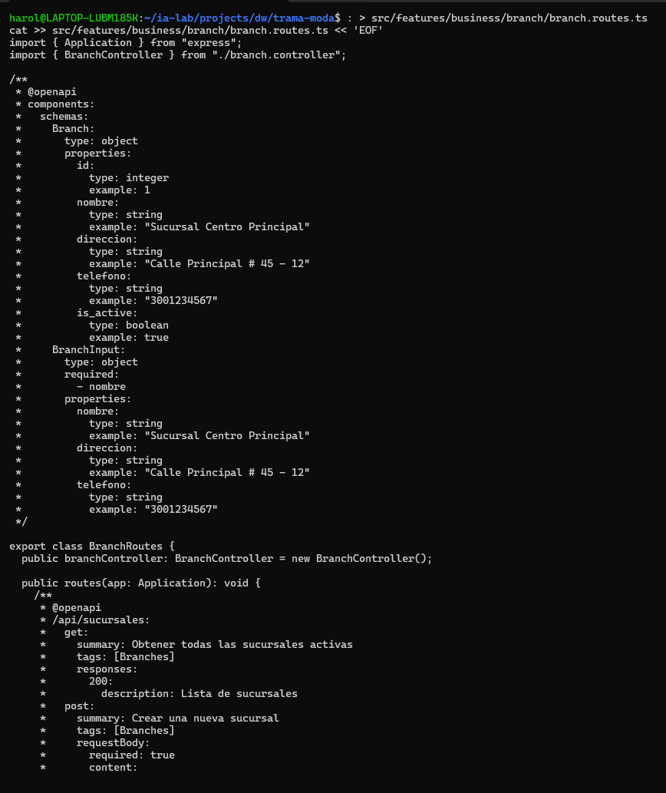

### creacion de los http de pruebas 
#### branch/branch.create.http
``` bash
: > src/features/business/branch/branch.create.http
cat >> src/features/business/branch/branch.create.http << 'EOF'
### Feature Branch — CREATE
### Leyenda: SIN AUTH
@baseUrl = http://localhost:4000

# @name createBranch
POST {{baseUrl}}/api/sucursales
Content-Type: application/json

{
  "nombre": "Sucursal Centro Principal",
  "direccion": "Calle Principal # 45 - 12",
  "telefono": "3001234567"
}
EOF`
```
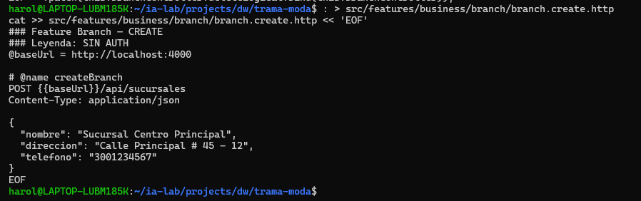


#### branch/branch.get.http
```bash
: > src/features/business/branch/branch.get.http
cat >> src/features/business/branch/branch.get.http << 'EOF'
### Feature Branch — READ ALL
### Leyenda: SIN AUTH
@baseUrl = http://localhost:4000

# @name getAllBranches
GET {{baseUrl}}/api/sucursales
Content-Type: application/json

###

### Feature Branch — READ ONE
### Leyenda: SIN AUTH

# @name getOneBranch
GET {{baseUrl}}/api/sucursales/1
Content-Type: application/json
EOF
```
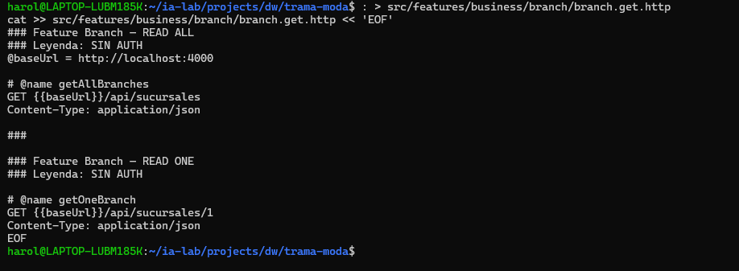

#### branch/branch.update.http
```bash
: > src/features/business/branch/branch.update.http
cat >> src/features/business/branch/branch.update.http << 'EOF'
### Feature Branch — UPDATE
### Leyenda: SIN AUTH
@baseUrl = http://localhost:4000

# @name updateBranch
PUT {{baseUrl}}/api/sucursales/1
Content-Type: application/json

{
  "nombre": "Sucursal Centro - Flagship Store",
  "direccion": "Calle Principal # 45 - 12, Local 101",
  "telefono": "3009876543"
}
EOF
```
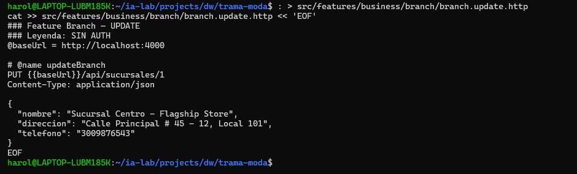

#### branch/branch.delete.http
```bash
: > src/features/business/branch/branch.delete.http
cat >> src/features/business/branch/branch.delete.http << 'EOF'
### Feature Branch — DELETE LOGICAL (Desactivar)
### Leyenda: SIN AUTH
@baseUrl = http://localhost:4000

# @name deactivateBranch
PATCH {{baseUrl}}/api/sucursales/1/deactivate
Content-Type: application/json
EOF
```
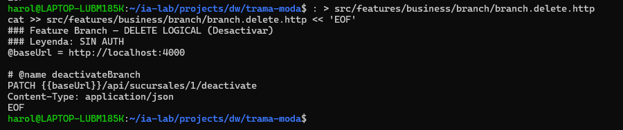

### Actualizar db.ts
```bash
: > src/database/db.ts
cat >> src/database/db.ts << 'EOF'
import { Sequelize } from "sequelize";
import dotenv from "dotenv";

dotenv.config();

interface DatabaseConfig {
  dialect: string;
  host: string;
  username: string;
  password: string;
  database: string;
  port: number;
}

const dbConfigurations: Record<string, DatabaseConfig> = {
  mysql: {
    dialect: "mysql",
    host: process.env.MYSQL_HOST || process.env.DB_HOST || "localhost",
    username: process.env.MYSQL_USER || process.env.DB_USER || "root",
    password: process.env.MYSQL_PASSWORD || process.env.DB_PASSWORD || "",
    database: process.env.MYSQL_NAME || process.env.DB_NAME || "trama-moda",
    port: parseInt(process.env.MYSQL_PORT || process.env.DB_PORT || "3306")
  }
};

const selectedEngine = process.env.DB_ENGINE || "mysql";
const selectedConfig = dbConfigurations[selectedEngine];

if (!selectedConfig) {
  throw new Error(`Motor de base de datos no soportado: ${selectedEngine}`);
}

export const sequelize = new Sequelize(
  selectedConfig.database,
  selectedConfig.username,
  selectedConfig.password,
  {
    host: selectedConfig.host,
    port: selectedConfig.port,
    dialect: selectedConfig.dialect as any,
    logging: process.env.NODE_ENV === 'development' ? console.log : false,
    pool: { max: 5, min: 0, acquire: 30000, idle: 10000 }
  }
);

export const testConnection = async (): Promise<boolean> => {
  try {
    await sequelize.authenticate();
    console.log(`✅ Conexión exitosa a ${selectedEngine.toUpperCase()}`);
    return true;
  } catch (error) {
    console.error(`❌ Error de conexión:`, error);
    return false;
  }
};

export const syncDatabase = async (): Promise<void> => {
  try {
    require("../features/business/client/client.model");
    require("../features/business/product/product.model");
    require("../features/business/sale/sale.model");
    require("../features/business/sale/sale-detail.model");
    require("../features/business/catalog/collection.model");
    require("../features/business/variants/variant.model");
    require("../features/business/branch/branch.model");

    await sequelize.sync({ alter: true });
    console.log("✅ Tablas sincronizadas correctamente en MySQL");
  } catch (error) {
    console.error("❌ Error al sincronizar las tablas:", error);
  }
};
EOF
```
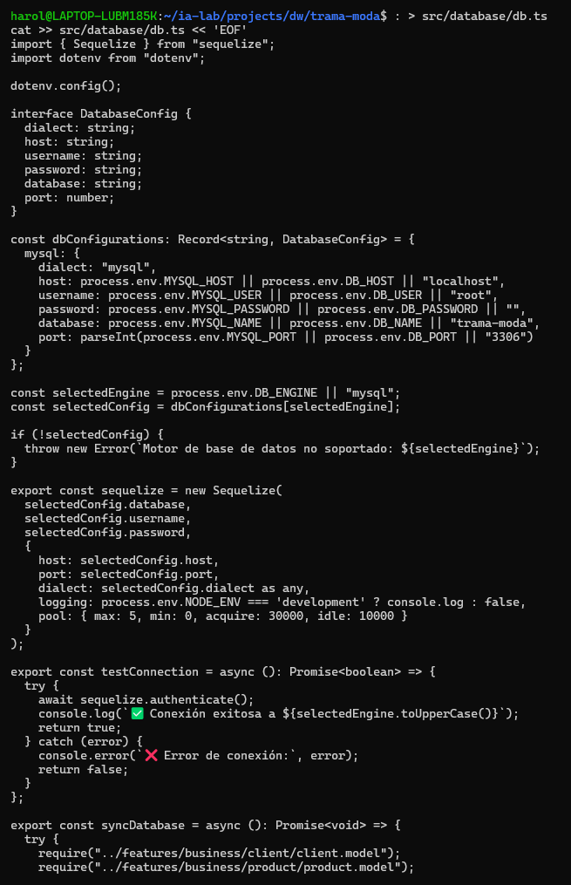

### Actualizar routes/index.ts
```bash
: > src/routes/index.ts
cat >> src/routes/index.ts << 'EOF'
import { ClientRoutes } from "../features/business/client/client.routes";
import { ProductRoutes } from "../features/business/product/product.routes";
import { SaleRoutes } from "../features/business/sale/sale.routes";
import { SaleDetailRoutes } from "../features/business/sale/sale-detail.routes";
import { CollectionRoutes } from "../features/business/catalog/collection.routes";
import { VariantRoutes } from "../features/business/variants/variant.routes";
import { BranchRoutes } from "../features/business/branch/branch.routes";

export class Routes {
  public clientRoutes: ClientRoutes = new ClientRoutes();
  public productRoutes: ProductRoutes = new ProductRoutes();
  public saleRoutes: SaleRoutes = new SaleRoutes();
  public saleDetailRoutes: SaleDetailRoutes = new SaleDetailRoutes();
  public collectionRoutes: CollectionRoutes = new CollectionRoutes();
  public variantRoutes: VariantRoutes = new VariantRoutes();
  public branchRoutes: BranchRoutes = new BranchRoutes();
}
EOF
```
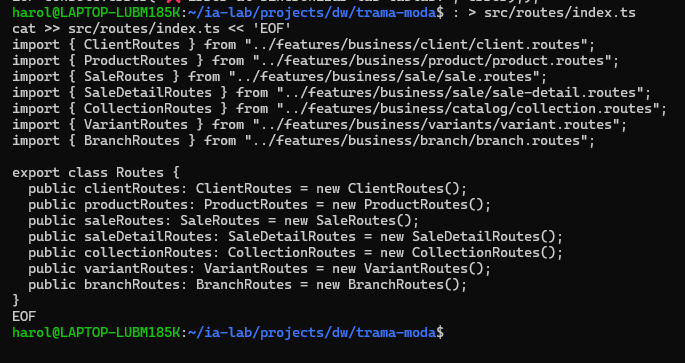

### Actualizar config/index.ts
```bash
: > src/config/index.ts
cat >> src/config/index.ts << 'EOF'
import express, { Application, Request, Response } from "express";
import cors from "cors";
import swaggerUi from "swagger-ui-express";
import { swaggerSpec } from "./swagger";
import { Routes } from "../routes";

export class App {
  public app: Application;
  public routePrv: Routes = new Routes();

  constructor(private port?: number | string) {
    this.app = express();
    this.settings();
    this.middlewares();
    this.routes();
  }

  private settings(): void {
    this.app.set("port", this.port || process.env.PORT || 4000);
  }

  private middlewares(): void {
    this.app.use(cors());
    this.app.use(express.json());
    this.app.use(express.urlencoded({ extended: false }));
  }

  private routes(): void {
    this.app.get("/", (req: Request, res: Response) => {
      res.json({ project: "TramaModa", status: "running" });
    });

    this.app.use("/api-docs", swaggerUi.serve, swaggerUi.setup(swaggerSpec));

    this.routePrv.clientRoutes.routes(this.app);
    this.routePrv.productRoutes.routes(this.app);
    this.routePrv.saleRoutes.routes(this.app);
    this.routePrv.saleDetailRoutes.routes(this.app);
    this.routePrv.collectionRoutes.routes(this.app);
    this.routePrv.variantRoutes.routes(this.app);
    this.routePrv.branchRoutes.routes(this.app);
  }

  public async listen(): Promise<void> {
    const port = this.app.get("port");
    this.app.listen(port, () => {
      console.log(`🚀 Servidor ejecutándose en puerto ${port}`);
      console.log(`📑 Documentación Swagger disponible en: http://localhost:${port}/api-docs`);
    });
  }
}
EOF
```
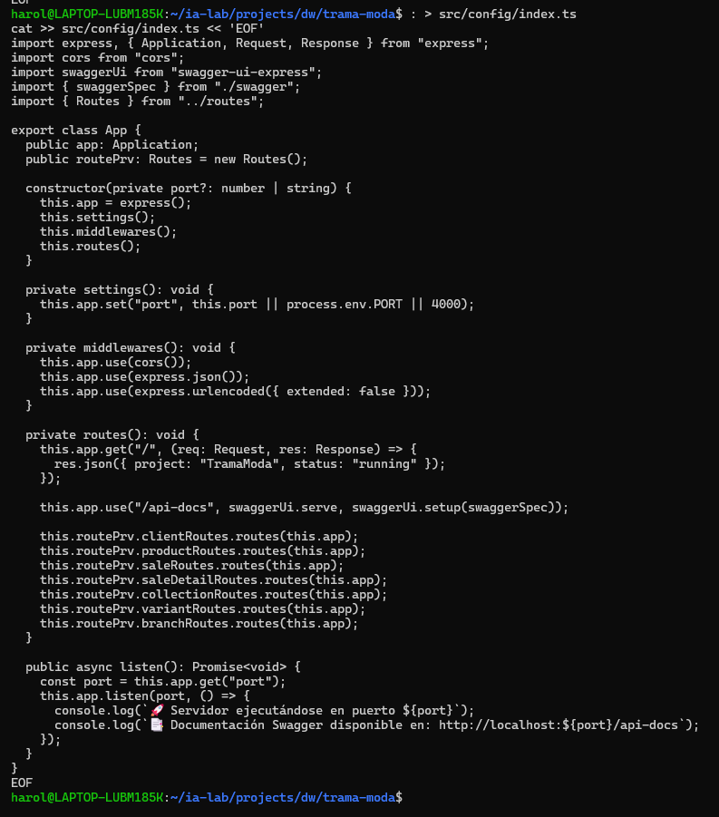
### Verificacion
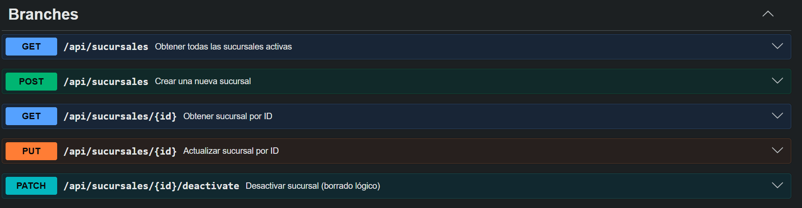

-------------------------------------------------------------------------
# Inventory
### inventory/inventory.model.ts
```bash
mkdir -p src/features/business/inventory
: > src/features/business/inventory/inventory.model.ts
cat >> src/features/business/inventory/inventory.model.ts << 'EOF'
import { DataTypes, Model } from "sequelize";
import { sequelize } from "../../../database/db";

export interface InventoryI {
  id?: number;
  branchId: number;
  variantId: number;
  stock: number;
  is_active: boolean;
  createdAt?: Date;
  updatedAt?: Date;
}

export class Inventory extends Model implements InventoryI {
  public id!: number;
  public branchId!: number;
  public variantId!: number;
  public stock!: number;
  public is_active!: boolean;
  public readonly createdAt!: Date;
  public readonly updatedAt!: Date;
}

Inventory.init(
  {
    branchId: {
      type: DataTypes.INTEGER,
      allowNull: false
    },
    variantId: {
      type: DataTypes.INTEGER,
      allowNull: false
    },
    stock: {
      type: DataTypes.INTEGER,
      allowNull: false,
      defaultValue: 0
    },
    is_active: {
      type: DataTypes.BOOLEAN,
      defaultValue: true
    }
  },
  {
    sequelize,
    tableName: "inventories",
    timestamps: true
  }
);
EOF
```
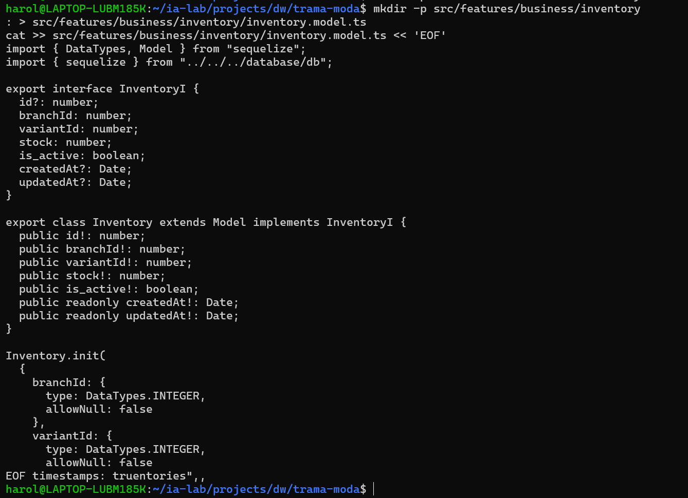

### inventory/inventory.controller.ts
```bash
: > src/features/business/inventory/inventory.controller.ts
cat >> src/features/business/inventory/inventory.controller.ts << 'EOF'
import { Request, Response } from "express";
import { Inventory } from "./inventory.model";

function paramId(req: Request): number {
  const raw = req.params.id;
  const value = Array.isArray(raw) ? raw[0] : raw;
  return Number(value);
}

export class InventoryController {
  public async getAll(req: Request, res: Response) {
    try {
      const inventories = await Inventory.findAll({ where: { is_active: true } });
      res.status(200).json({ inventories });
    } catch (error) {
      res.status(500).json({ error: "Error fetching inventories", detail: String(error) });
    }
  }

  public async getOne(req: Request, res: Response) {
    try {
      const id = paramId(req);
      const inventory = await Inventory.findByPk(id);
      if (!inventory) {
        res.status(404).json({ error: "Inventory record not found" });
        return;
      }
      res.status(200).json({ inventory });
    } catch (error) {
      res.status(500).json({ error: "Error fetching inventory record", detail: String(error) });
    }
  }

  public async create(req: Request, res: Response) {
    try {
      const { branchId, variantId, stock } = req.body;
      const inventory = await Inventory.create({
        branchId,
        variantId,
        stock,
        is_active: true
      });
      res.status(201).json({ inventory });
    } catch (error) {
      res.status(500).json({ error: "Error creating inventory record", detail: String(error) });
    }
  }

  public async update(req: Request, res: Response) {
    try {
      const id = paramId(req);
      const inventory = await Inventory.findByPk(id);
      if (!inventory) {
        res.status(404).json({ error: "Inventory record not found" });
        return;
      }
      await inventory.update(req.body);
      res.status(200).json({ message: "Inventory updated successfully", inventory });
    } catch (error) {
      res.status(500).json({ error: "Error updating inventory", detail: String(error) });
    }
  }

  public async deleteLogical(req: Request, res: Response) {
    try {
      const id = paramId(req);
      const inventory = await Inventory.findByPk(id);
      if (!inventory) {
        res.status(404).json({ error: "Inventory record not found" });
        return;
      }
      await inventory.update({ is_active: false });
      res.status(200).json({ message: "Inventory record deactivated", inventory });
    } catch (error) {
      res.status(500).json({ error: "Error deactivating inventory record", detail: String(error) });
    }
  }
}
EOF
```
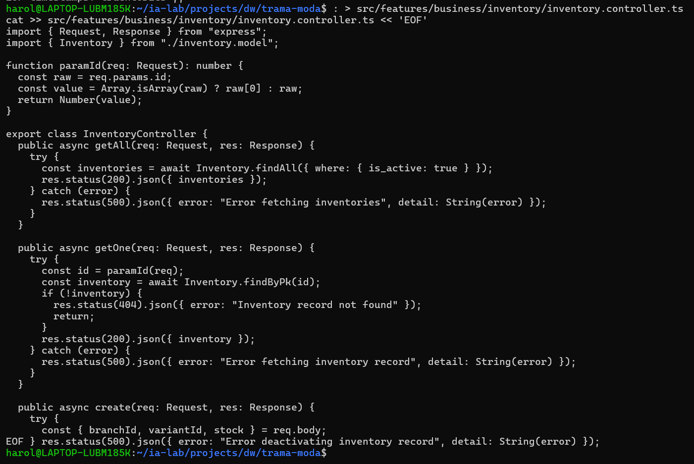

### inventory/inventory.routes.ts
```bash
: > src/features/business/inventory/inventory.routes.ts
cat >> src/features/business/inventory/inventory.routes.ts << 'EOF'
import { Application } from "express";
import { InventoryController } from "./inventory.controller";

/**
 * @openapi
 * components:
 *   schemas:
 *     Inventory:
 *       type: object
 *       properties:
 *         id:
 *           type: integer
 *           example: 1
 *         branchId:
 *           type: integer
 *           example: 1
 *         variantId:
 *           type: integer
 *           example: 1
 *         stock:
 *           type: integer
 *           example: 50
 *         is_active:
 *           type: boolean
 *           example: true
 *     InventoryInput:
 *       type: object
 *       required:
 *         - branchId
 *         - variantId
 *         - stock
 *       properties:
 *         branchId:
 *           type: integer
 *           example: 1
 *         variantId:
 *           type: integer
 *           example: 1
 *         stock:
 *           type: integer
 *           example: 50
 */

export class InventoryRoutes {
  public inventoryController: InventoryController = new InventoryController();

  public routes(app: Application): void {
    /**
     * @openapi
     * /api/inventarios:
     *   get:
     *     summary: Obtener todo el inventario activo
     *     tags: [Inventories]
     *     responses:
     *       200:
     *         description: Lista de inventarios
     *   post:
     *     summary: Registrar stock en una sucursal para una variante
     *     tags: [Inventories]
     *     requestBody:
     *       required: true
     *       content:
     *         application/json:
     *           schema:
     *             $ref: '#/components/schemas/InventoryInput'
     *     responses:
     *       201:
     *         description: Registro de inventario creado
     */
    app
      .route("/api/inventarios")
      .get(this.inventoryController.getAll.bind(this.inventoryController))
      .post(this.inventoryController.create.bind(this.inventoryController));

    /**
     * @openapi
     * /api/inventarios/{id}:
     *   get:
     *     summary: Obtener registro de inventario por ID
     *     tags: [Inventories]
     *     parameters:
     *       - in: path
     *         name: id
     *         required: true
     *         schema:
     *           type: integer
     *     responses:
     *       200:
     *         description: Registro de inventario encontrado
     *       404:
     *         description: No encontrado
     *   put:
     *     summary: Actualizar stock/información de inventario
     *     tags: [Inventories]
     *     parameters:
     *       - in: path
     *         name: id
     *         required: true
     *         schema:
     *           type: integer
     *     requestBody:
     *       required: true
     *       content:
     *         application/json:
     *           schema:
     *             $ref: '#/components/schemas/InventoryInput'
     *     responses:
     *       200:
     *         description: Inventario actualizado
     */
    app
      .route("/api/inventarios/:id")
      .get(this.inventoryController.getOne.bind(this.inventoryController))
      .put(this.inventoryController.update.bind(this.inventoryController));

    /**
     * @openapi
     * /api/inventarios/{id}/deactivate:
     *   patch:
     *     summary: Desactivar registro de inventario (borrado lógico)
     *     tags: [Inventories]
     *     parameters:
     *       - in: path
     *         name: id
     *         required: true
     *         schema:
     *           type: integer
     *     responses:
     *       200:
     *         description: Registro desactivado
     */
    app
      .route("/api/inventarios/:id/deactivate")
      .patch(this.inventoryController.deleteLogical.bind(this.inventoryController));
  }
}
EOF
```
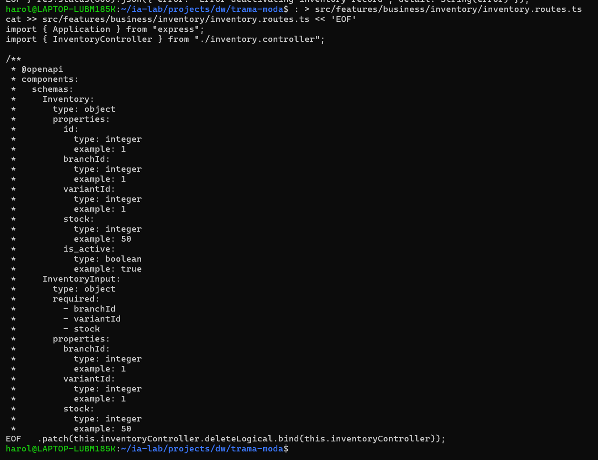

### Archivos HTTP por cada operación CRUD
#### inventory.create.http
```bash
: > src/features/business/inventory/inventory.create.http
cat >> src/features/business/inventory/inventory.create.http << 'EOF'
### Feature Inventory — CREATE
### Leyenda: SIN AUTH
@baseUrl = http://localhost:4000

# @name createInventory
POST {{baseUrl}}/api/inventarios
Content-Type: application/json

{
  "branchId": 1,
  "variantId": 1,
  "stock": 50
}
EOF
```
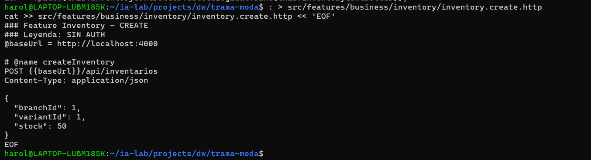

#### inventory.get.http
```bash
: > src/features/business/inventory/inventory.get.http
cat >> src/features/business/inventory/inventory.get.http << 'EOF'
### Feature Inventory — READ ALL
### Leyenda: SIN AUTH
@baseUrl = http://localhost:4000

# @name getAllInventories
GET {{baseUrl}}/api/inventarios
Content-Type: application/json

###

### Feature Inventory — READ ONE
### Leyenda: SIN AUTH

# @name getOneInventory
GET {{baseUrl}}/api/inventarios/1
Content-Type: application/json
EOF
```
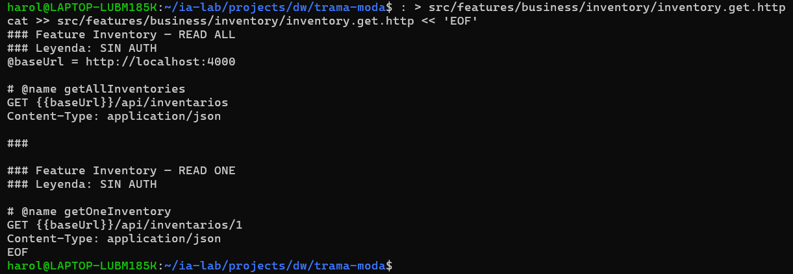

#### inventory/inventory.update.http
```bash
: > src/features/business/inventory/inventory.update.http
cat >> src/features/business/inventory/inventory.update.http << 'EOF'
### Feature Inventory — UPDATE
### Leyenda: SIN AUTH
@baseUrl = http://localhost:4000

# @name updateInventory
PUT {{baseUrl}}/api/inventarios/1
Content-Type: application/json

{
  "branchId": 1,
  "variantId": 1,
  "stock": 75
}
EOF
```
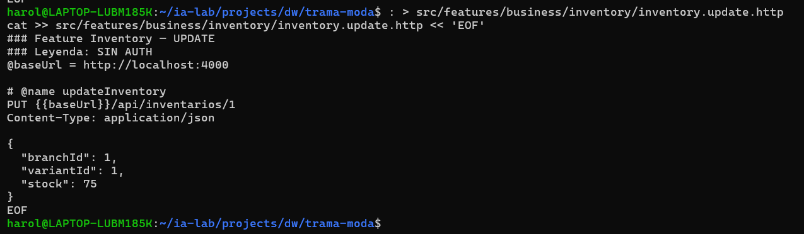

#### inventory/inventory.delete.http
```bash
: > src/features/business/inventory/inventory.delete.http
cat >> src/features/business/inventory/inventory.delete.http << 'EOF'
### Feature Inventory — DELETE LOGICAL (Desactivar)
### Leyenda: SIN AUTH
@baseUrl = http://localhost:4000

# @name deactivateInventory
PATCH {{baseUrl}}/api/inventarios/1/deactivate
Content-Type: application/json
EOF
```
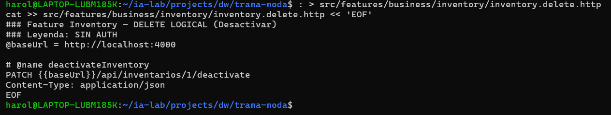

### Actualizar db.ts
```bash
: > src/database/db.ts
cat >> src/database/db.ts << 'EOF'
import { Sequelize } from "sequelize";
import dotenv from "dotenv";

dotenv.config();

interface DatabaseConfig {
  dialect: string;
  host: string;
  username: string;
  password: string;
  database: string;
  port: number;
}

const dbConfigurations: Record<string, DatabaseConfig> = {
  mysql: {
    dialect: "mysql",
    host: process.env.MYSQL_HOST || process.env.DB_HOST || "localhost",
    username: process.env.MYSQL_USER || process.env.DB_USER || "root",
    password: process.env.MYSQL_PASSWORD || process.env.DB_PASSWORD || "",
    database: process.env.MYSQL_NAME || process.env.DB_NAME || "trama-moda",
    port: parseInt(process.env.MYSQL_PORT || process.env.DB_PORT || "3306")
  }
};

const selectedEngine = process.env.DB_ENGINE || "mysql";
const selectedConfig = dbConfigurations[selectedEngine];

if (!selectedConfig) {
  throw new Error(`Motor de base de datos no soportado: ${selectedEngine}`);
}

export const sequelize = new Sequelize(
  selectedConfig.database,
  selectedConfig.username,
  selectedConfig.password,
  {
    host: selectedConfig.host,
    port: selectedConfig.port,
    dialect: selectedConfig.dialect as any,
    logging: process.env.NODE_ENV === 'development' ? console.log : false,
    pool: { max: 5, min: 0, acquire: 30000, idle: 10000 }
  }
);

export const testConnection = async (): Promise<boolean> => {
  try {
    await sequelize.authenticate();
    console.log(`✅ Conexión exitosa a ${selectedEngine.toUpperCase()}`);
    return true;
  } catch (error) {
    console.error(`❌ Error de conexión:`, error);
    return false;
  }
};

export const syncDatabase = async (): Promise<void> => {
  try {
    require("../features/business/client/client.model");
    require("../features/business/product/product.model");
    require("../features/business/sale/sale.model");
    require("../features/business/sale/sale-detail.model");
    require("../features/business/catalog/collection.model");
    require("../features/business/variants/variant.model");
    require("../features/business/branch/branch.model");
    require("../features/business/inventory/inventory.model");

    await sequelize.sync({ alter: true });
    console.log("✅ Tablas sincronizadas correctamente en MySQL");
  } catch (error) {
    console.error("❌ Error al sincronizar las tablas:", error);
  }
};
EOF
```
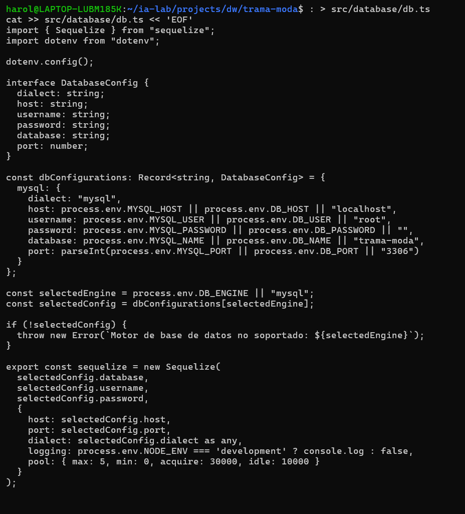

### Actualizar routes/index.ts
```bash
: > src/routes/index.ts
cat >> src/routes/index.ts << 'EOF'
import { ClientRoutes } from "../features/business/client/client.routes";
import { ProductRoutes } from "../features/business/product/product.routes";
import { SaleRoutes } from "../features/business/sale/sale.routes";
import { SaleDetailRoutes } from "../features/business/sale/sale-detail.routes";
import { CollectionRoutes } from "../features/business/catalog/collection.routes";
import { VariantRoutes } from "../features/business/variants/variant.routes";
import { BranchRoutes } from "../features/business/branch/branch.routes";
import { InventoryRoutes } from "../features/business/inventory/inventory.routes";

export class Routes {
  public clientRoutes: ClientRoutes = new ClientRoutes();
  public productRoutes: ProductRoutes = new ProductRoutes();
  public saleRoutes: SaleRoutes = new SaleRoutes();
  public saleDetailRoutes: SaleDetailRoutes = new SaleDetailRoutes();
  public collectionRoutes: CollectionRoutes = new CollectionRoutes();
  public variantRoutes: VariantRoutes = new VariantRoutes();
  public branchRoutes: BranchRoutes = new BranchRoutes();
  public inventoryRoutes: InventoryRoutes = new InventoryRoutes();
}
EOF
```
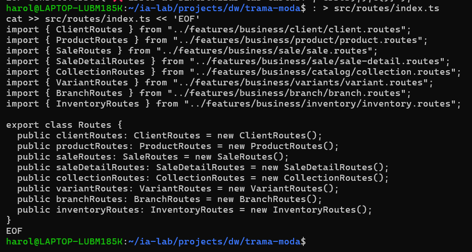

### Actualizar config/index.ts
```bash
: > src/config/index.ts
cat >> src/config/index.ts << 'EOF'
import express, { Application, Request, Response } from "express";
import cors from "cors";
import swaggerUi from "swagger-ui-express";
import { swaggerSpec } from "./swagger";
import { Routes } from "../routes";

export class App {
  public app: Application;
  public routePrv: Routes = new Routes();

  constructor(private port?: number | string) {
    this.app = express();
    this.settings();
    this.middlewares();
    this.routes();
  }

  private settings(): void {
    this.app.set("port", this.port || process.env.PORT || 4000);
  }

  private middlewares(): void {
    this.app.use(cors());
    this.app.use(express.json());
    this.app.use(express.urlencoded({ extended: false }));
  }

  private routes(): void {
    this.app.get("/", (req: Request, res: Response) => {
      res.json({ project: "TramaModa", status: "running" });
    });

    this.app.use("/api-docs", swaggerUi.serve, swaggerUi.setup(swaggerSpec));

    this.routePrv.clientRoutes.routes(this.app);
    this.routePrv.productRoutes.routes(this.app);
    this.routePrv.saleRoutes.routes(this.app);
    this.routePrv.saleDetailRoutes.routes(this.app);
    this.routePrv.collectionRoutes.routes(this.app);
    this.routePrv.variantRoutes.routes(this.app);
    this.routePrv.branchRoutes.routes(this.app);
    this.routePrv.inventoryRoutes.routes(this.app);
  }

  public async listen(): Promise<void> {
    const port = this.app.get("port");
    this.app.listen(port, () => {
      console.log(`🚀 Servidor ejecutándose en puerto ${port}`);
      console.log(`📑 Documentación Swagger disponible en: http://localhost:${port}/api-docs`);
    });
  }
}
EOF
```
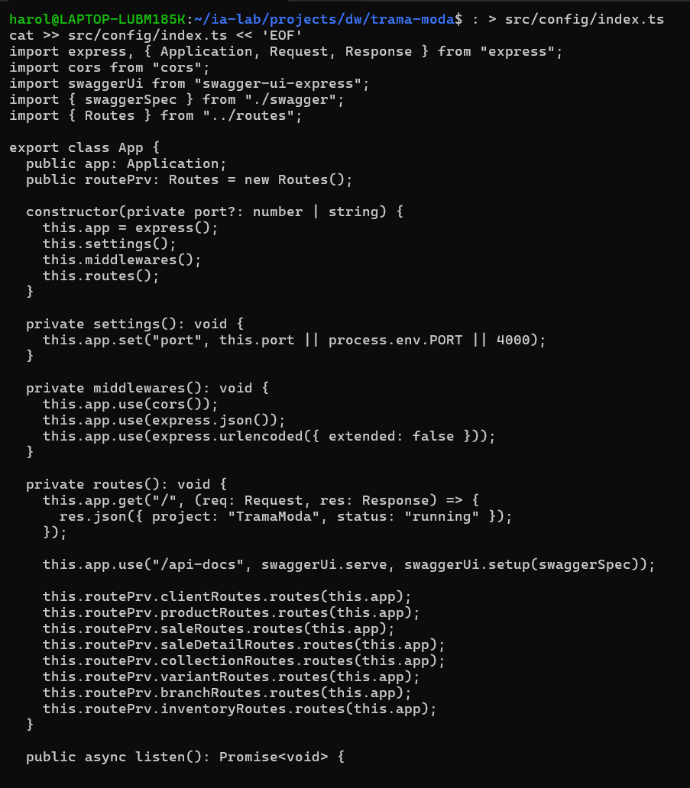

### Verificacion
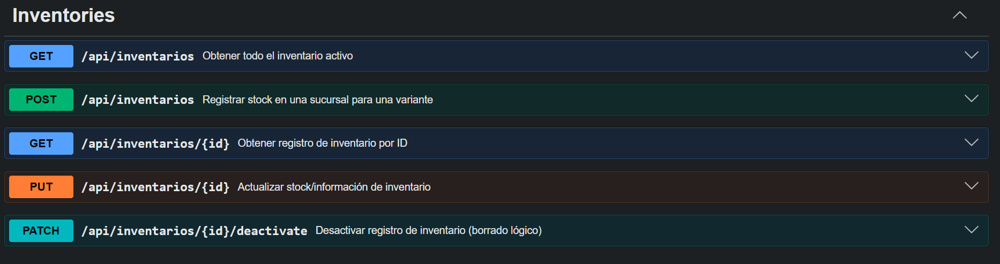

---------------------------------------------------------------------------------------------
# Category
### category/category.model.ts
```bash
mkdir -p src/features/business/category
: > src/features/business/category/category.model.ts
cat >> src/features/business/category/category.model.ts << 'EOF'
import { DataTypes, Model } from "sequelize";
import { sequelize } from "../../../database/db";

export interface CategoryI {
  id?: number;
  name: string;
  description?: string;
  is_active: boolean;
  createdAt?: Date;
  updatedAt?: Date;
}

export class Category extends Model implements CategoryI {
  public id!: number;
  public name!: string;
  public description!: string;
  public is_active!: boolean;
  public readonly createdAt!: Date;
  public readonly updatedAt!: Date;
}

Category.init(
  {
    name: {
      type: DataTypes.STRING,
      allowNull: false
    },
    description: {
      type: DataTypes.STRING,
      allowNull: true
    },
    is_active: {
      type: DataTypes.BOOLEAN,
      defaultValue: true
    }
  },
  {
    sequelize,
    tableName: "categories",
    timestamps: true
  }
);
EOF
```
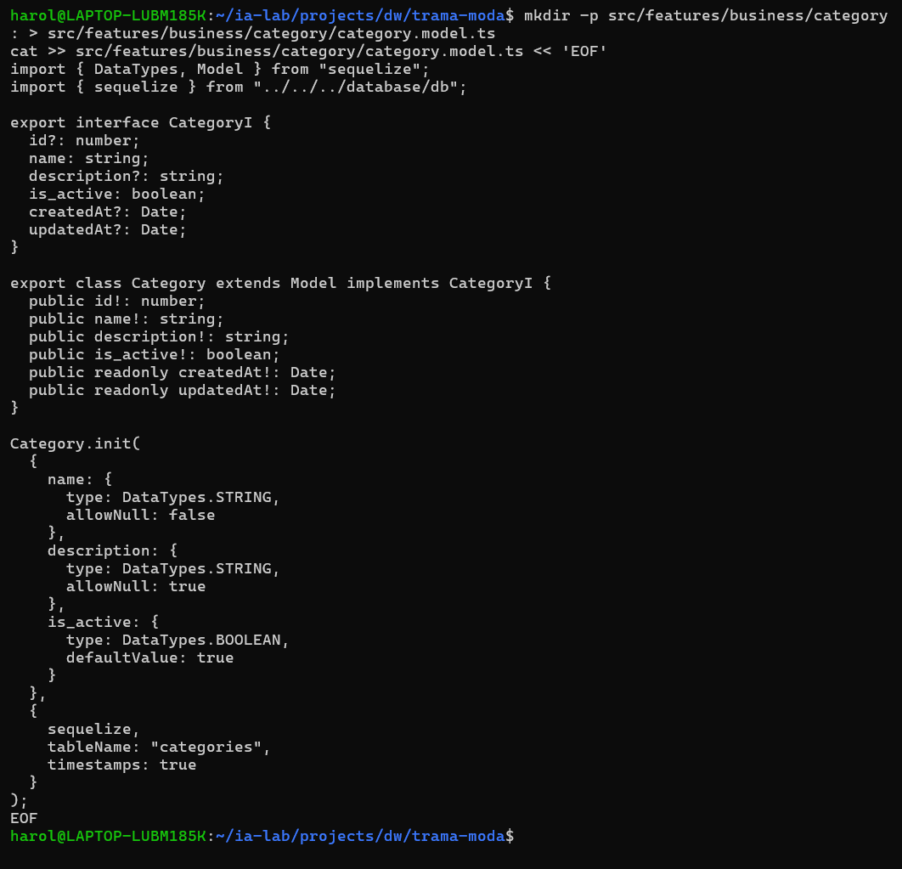

### category/category.controller.ts
```bash
: > src/features/business/category/category.controller.ts
cat >> src/features/business/category/category.controller.ts << 'EOF'
import { Request, Response } from "express";
import { Category } from "./category.model";

function paramId(req: Request): number {
  const raw = req.params.id;
  const value = Array.isArray(raw) ? raw[0] : raw;
  return Number(value);
}

export class CategoryController {
  public async getAll(req: Request, res: Response) {
    try {
      const categories = await Category.findAll({ where: { is_active: true } });
      res.status(200).json({ categories });
    } catch (error) {
      res.status(500).json({ error: "Error fetching categories", detail: String(error) });
    }
  }

  public async getOne(req: Request, res: Response) {
    try {
      const id = paramId(req);
      const category = await Category.findByPk(id);
      if (!category) {
        res.status(404).json({ error: "Category record not found" });
        return;
      }
      res.status(200).json({ category });
    } catch (error) {
      res.status(500).json({ error: "Error fetching category record", detail: String(error) });
    }
  }

  public async create(req: Request, res: Response) {
    try {
      const { name, description } = req.body;
      const category = await Category.create({
        name,
        description,
        is_active: true
      });
      res.status(201).json({ category });
    } catch (error) {
      res.status(500).json({ error: "Error creating category record", detail: String(error) });
    }
  }

  public async update(req: Request, res: Response) {
    try {
      const id = paramId(req);
      const category = await Category.findByPk(id);
      if (!category) {
        res.status(404).json({ error: "Category record not found" });
        return;
      }
      await category.update(req.body);
      res.status(200).json({ message: "Category updated successfully", category });
    } catch (error) {
      res.status(500).json({ error: "Error updating category", detail: String(error) });
    }
  }

  public async deleteLogical(req: Request, res: Response) {
    try {
      const id = paramId(req);
      const category = await Category.findByPk(id);
      if (!category) {
        res.status(404).json({ error: "Category record not found" });
        return;
      }
      await category.update({ is_active: false });
      res.status(200).json({ message: "Category record deactivated", category });
    } catch (error) {
      res.status(500).json({ error: "Error deactivating category record", detail: String(error) });
    }
  }
}
EOF
```
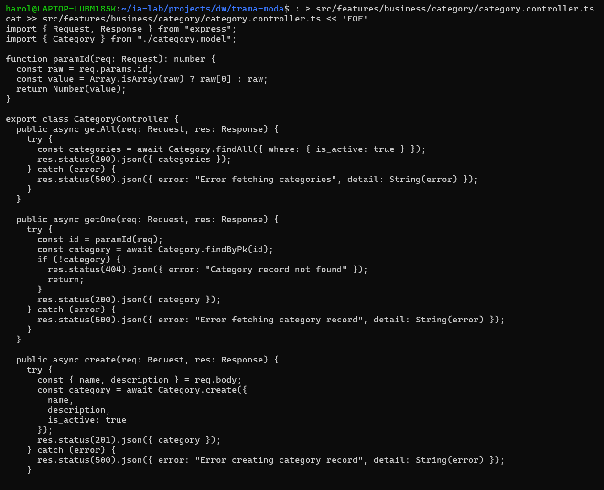

### category/category.routes.ts
```bash
: > src/features/business/category/category.routes.ts
cat >> src/features/business/category/category.routes.ts << 'EOF'
import { Application } from "express";
import { CategoryController } from "./category.controller";

/**
 * @openapi
 * components:
 *   schemas:
 *     Category:
 *       type: object
 *       properties:
 *         id:
 *           type: integer
 *           example: 1
 *         name:
 *           type: string
 *           example: "Ropa Formal"
 *         description:
 *           type: string
 *           example: "Trajes, blazers y prendas de gala"
 *         is_active:
 *           type: boolean
 *           example: true
 *     CategoryInput:
 *       type: object
 *       required:
 *         - name
 *       properties:
 *         name:
 *           type: string
 *           example: "Ropa Formal"
 *         description:
 *           type: string
 *           example: "Trajes, blazers y prendas de gala"
 */
export class CategoryRoutes {
  public categoryController: CategoryController = new CategoryController();

  public routes(app: Application): void {
    /**
     * @openapi
     * /api/categorias:
     *   get:
     *     summary: Obtener todas las categorías activas
     *     tags: [Categories]
     *     responses:
     *       200:
     *         description: Lista de categorías
     *   post:
     *     summary: Registrar una nueva categoría
     *     tags: [Categories]
     *     requestBody:
     *       required: true
     *       content:
     *         application/json:
     *           schema:
     *             $ref: '#/components/schemas/CategoryInput'
     *     responses:
     *       201:
     *         description: Categoría creada exitosamente
     */
    app
      .route("/api/categorias")
      .get(this.categoryController.getAll.bind(this.categoryController))
      .post(this.categoryController.create.bind(this.categoryController));

    /**
     * @openapi
     * /api/categorias/{id}:
     *   get:
     *     summary: Obtener categoría por ID
     *     tags: [Categories]
     *     parameters:
     *       - in: path
     *         name: id
     *         required: true
     *         schema:
     *           type: integer
     *     responses:
     *       200:
     *         description: Categoría encontrada
     *       404:
     *         description: No encontrada
     *   put:
     *     summary: Actualizar información de una categoría
     *     tags: [Categories]
     *     parameters:
     *       - in: path
     *         name: id
     *         required: true
     *         schema:
     *           type: integer
     *     requestBody:
     *       required: true
     *       content:
     *         application/json:
     *           schema:
     *             $ref: '#/components/schemas/CategoryInput'
     *     responses:
     *       200:
     *         description: Categoría actualizada
     */
    app
      .route("/api/categorias/:id")
      .get(this.categoryController.getOne.bind(this.categoryController))
      .put(this.categoryController.update.bind(this.categoryController));

    /**
     * @openapi
     * /api/categorias/{id}/deactivate:
     *   patch:
     *     summary: Desactivar categoría (borrado lógico)
     *     tags: [Categories]
     *     parameters:
     *       - in: path
     *         name: id
     *         required: true
     *         schema:
     *           type: integer
     *     responses:
     *       200:
     *         description: Categoría desactivada
     */
    app
      .route("/api/categorias/:id/deactivate")
      .patch(this.categoryController.deleteLogical.bind(this.categoryController));
  }
}
EOF
```
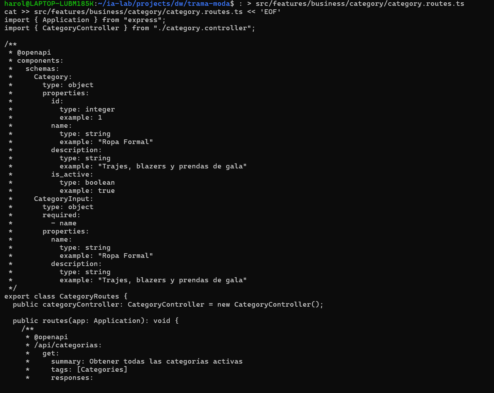

### Archivos de http para CRUD
#### category/category.create.http
```bash
: > src/features/business/category/category.create.http
cat >> src/features/business/category/category.create.http << 'EOF'
### Feature Category — CREATE
### Leyenda: SIN AUTH
@baseUrl = http://localhost:4000

# @name createCategory
POST {{baseUrl}}/api/categorias
Content-Type: application/json

{
  "name": "Ropa Formal",
  "description": "Trajes, blazers y vestidos de gala"
}
EOF
```
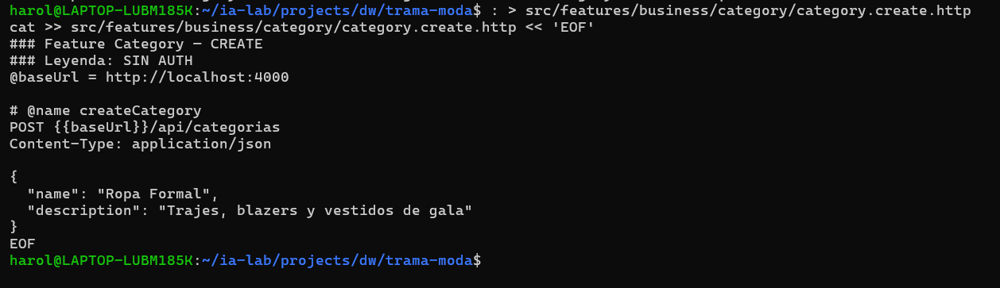

#### category/category.get.http
```bash
: > src/features/business/category/category.get.http
cat >> src/features/business/category/category.get.http << 'EOF'
### Feature Category — READ ALL
### Leyenda: SIN AUTH
@baseUrl = http://localhost:4000

# @name getAllCategories
GET {{baseUrl}}/api/categorias
Content-Type: application/json

###

### Feature Category — READ ONE
### Leyenda: SIN AUTH

# @name getOneCategory
GET {{baseUrl}}/api/categorias/1
Content-Type: application/json
EOF
```
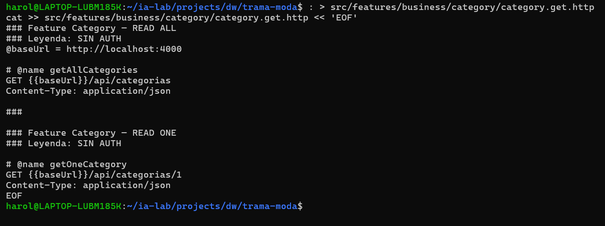

#### category/category.update.http
```bash
: > src/features/business/category/category.update.http
cat >> src/features/business/category/category.update.http << 'EOF'
### Feature Category — UPDATE
### Leyenda: SIN AUTH
@baseUrl = http://localhost:4000

# @name updateCategory
PUT {{baseUrl}}/api/categorias/1
Content-Type: application/json

{
  "name": "Ropa Formal y Elegante",
  "description": "Colección renovada para eventos especiales"
}
EOF
```
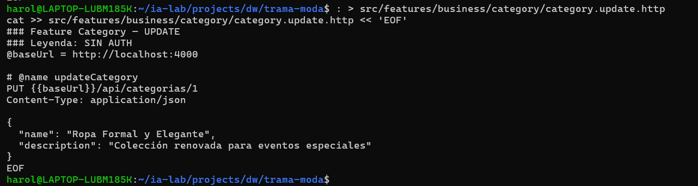

#### category/category.delete.http
```bash
: > src/features/business/category/category.delete.http
cat >> src/features/business/category/category.delete.http << 'EOF'
### Feature Category — DELETE LOGICAL (Desactivar)
### Leyenda: SIN AUTH
@baseUrl = http://localhost:4000

# @name deactivateCategory
PATCH {{baseUrl}}/api/categorias/1/deactivate
Content-Type: application/json
EOF
```
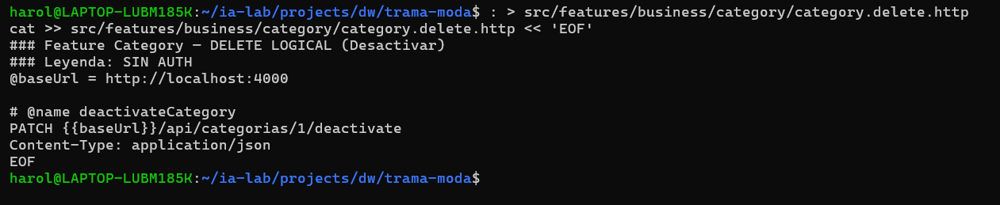

### Actualizar db.ts
```bash
: > src/database/db.ts
cat >> src/database/db.ts << 'EOF'
import { Sequelize } from "sequelize";
import dotenv from "dotenv";

dotenv.config();

interface DatabaseConfig {
  dialect: string;
  host: string;
  username: string;
  password: string;
  database: string;
  port: number;
}

const dbConfigurations: Record<string, DatabaseConfig> = {
  mysql: {
    dialect: "mysql",
    host: process.env.MYSQL_HOST || process.env.DB_HOST || "localhost",
    username: process.env.MYSQL_USER || process.env.DB_USER || "root",
    password: process.env.MYSQL_PASSWORD || process.env.DB_PASSWORD || "",
    database: process.env.MYSQL_NAME || process.env.DB_NAME || "trama-moda",
    port: parseInt(process.env.MYSQL_PORT || process.env.DB_PORT || "3306")
  }
};

const selectedEngine = process.env.DB_ENGINE || "mysql";
const selectedConfig = dbConfigurations[selectedEngine];

if (!selectedConfig) {
  throw new Error(`Motor de base de datos no soportado: ${selectedEngine}`);
}

export const sequelize = new Sequelize(
  selectedConfig.database,
  selectedConfig.username,
  selectedConfig.password,
  {
    host: selectedConfig.host,
    port: selectedConfig.port,
    dialect: selectedConfig.dialect as any,
    logging: process.env.NODE_ENV === 'development' ? console.log : false,
    pool: { max: 5, min: 0, acquire: 30000, idle: 10000 }
  }
);

export const testConnection = async (): Promise<boolean> => {
  try {
    await sequelize.authenticate();
    console.log(`✅ Conexión exitosa a ${selectedEngine.toUpperCase()}`);
    return true;
  } catch (error) {
    console.error(`❌ Error de conexión:`, error);
    return false;
  }
};

export const syncDatabase = async (): Promise<void> => {
  try {
    require("../features/business/client/client.model");
    require("../features/business/product/product.model");
    require("../features/business/sale/sale.model");
    require("../features/business/sale/sale-detail.model");
    require("../features/business/catalog/collection.model");
    require("../features/business/variants/variant.model");
    require("../features/business/branch/branch.model");
    require("../features/business/inventory/inventory.model");
    require("../features/business/category/category.model");

    await sequelize.sync({ alter: true });
    console.log("✅ Tablas sincronizadas correctamente en MySQL");
  } catch (error) {
    console.error("❌ Error al sincronizar las tablas:", error);
  }
};
EOF
```
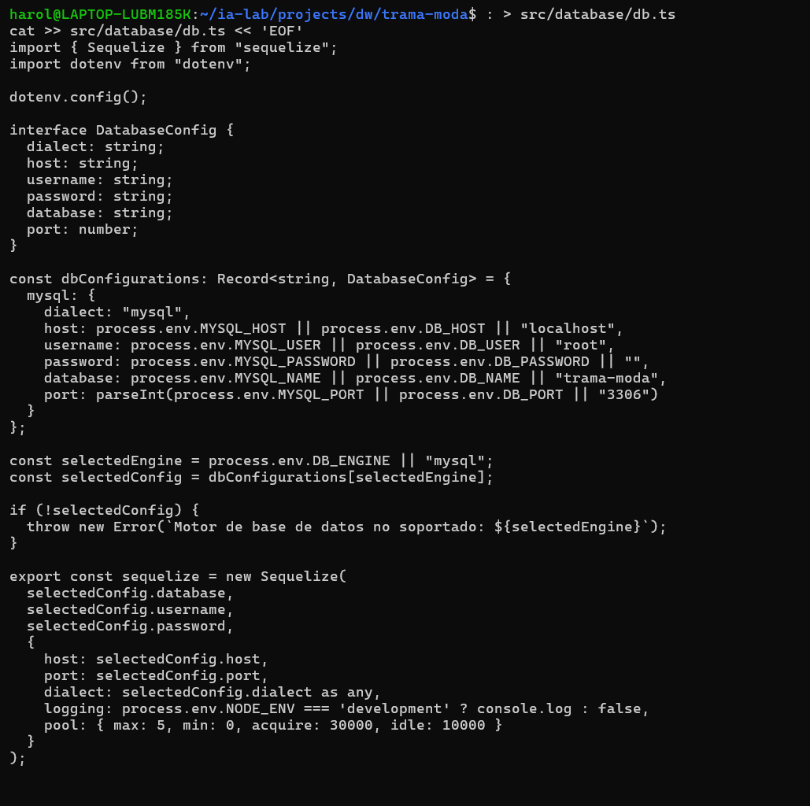

### Actualizar routes/index.ts
```bash
: > src/routes/index.ts
cat >> src/routes/index.ts << 'EOF'
import { ClientRoutes } from "../features/business/client/client.routes";
import { ProductRoutes } from "../features/business/product/product.routes";
import { SaleRoutes } from "../features/business/sale/sale.routes";
import { SaleDetailRoutes } from "../features/business/sale/sale-detail.routes";
import { CollectionRoutes } from "../features/business/catalog/collection.routes";
import { VariantRoutes } from "../features/business/variants/variant.routes";
import { BranchRoutes } from "../features/business/branch/branch.routes";
import { InventoryRoutes } from "../features/business/inventory/inventory.routes";
import { CategoryRoutes } from "../features/business/category/category.routes";

export class Routes {
  public clientRoutes: ClientRoutes = new ClientRoutes();
  public productRoutes: ProductRoutes = new ProductRoutes();
  public saleRoutes: SaleRoutes = new SaleRoutes();
  public saleDetailRoutes: SaleDetailRoutes = new SaleDetailRoutes();
  public collectionRoutes: CollectionRoutes = new CollectionRoutes();
  public variantRoutes: VariantRoutes = new VariantRoutes();
  public branchRoutes: BranchRoutes = new BranchRoutes();
  public inventoryRoutes: InventoryRoutes = new InventoryRoutes();
  public categoryRoutes: CategoryRoutes = new CategoryRoutes();
}
EOF
```
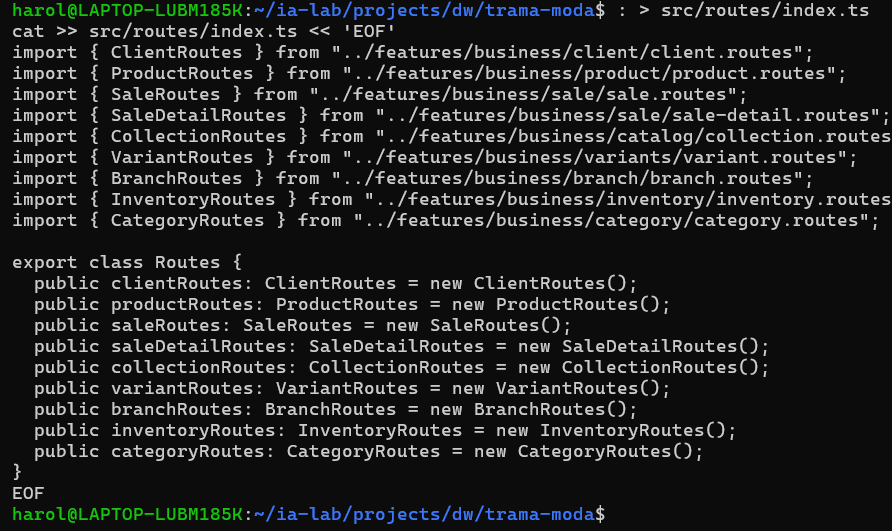

### Actualizar config/index.ts
```bash
: > src/config/index.ts
cat >> src/config/index.ts << 'EOF'
import express, { Application, Request, Response } from "express";
import cors from "cors";
import swaggerUi from "swagger-ui-express";
import { swaggerSpec } from "./swagger";
import { Routes } from "../routes";

export class App {
  public app: Application;
  public routePrv: Routes = new Routes();

  constructor(private port?: number | string) {
    this.app = express();
    this.settings();
    this.middlewares();
    this.routes();
  }

  private settings(): void {
    this.app.set("port", this.port || process.env.PORT || 4000);
  }

  private middlewares(): void {
    this.app.use(cors());
    this.app.use(express.json());
    this.app.use(express.urlencoded({ extended: false }));
  }

  private routes(): void {
    this.app.get("/", (req: Request, res: Response) => {
      res.json({ project: "TramaModa", status: "running" });
    });

    this.app.use("/api-docs", swaggerUi.serve, swaggerUi.setup(swaggerSpec));

    this.routePrv.clientRoutes.routes(this.app);
    this.routePrv.productRoutes.routes(this.app);
    this.routePrv.saleRoutes.routes(this.app);
    this.routePrv.saleDetailRoutes.routes(this.app);
    this.routePrv.collectionRoutes.routes(this.app);
    this.routePrv.variantRoutes.routes(this.app);
    this.routePrv.branchRoutes.routes(this.app);
    this.routePrv.inventoryRoutes.routes(this.app);
    this.routePrv.categoryRoutes.routes(this.app);
  }

  public async listen(): Promise<void> {
    const port = this.app.get("port");
    this.app.listen(port, () => {
      console.log(`🚀 Servidor ejecutándose en puerto ${port}`);
      console.log(`📑 Documentación Swagger disponible en: http://localhost:${port}/api-docs`);
    });
  }
}
EOF
```
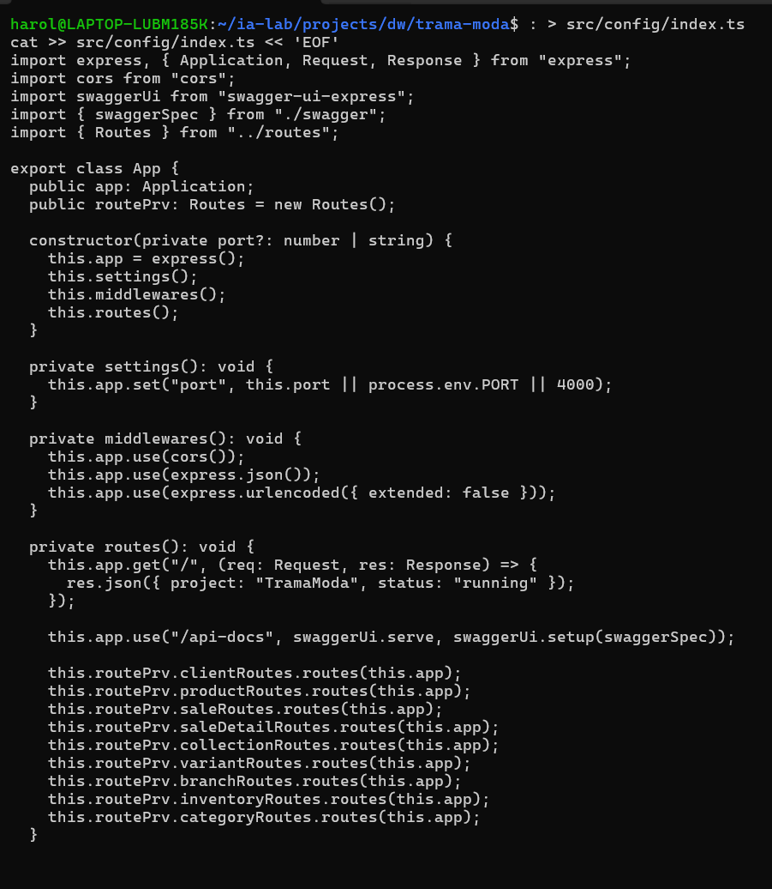

### Verificacion 
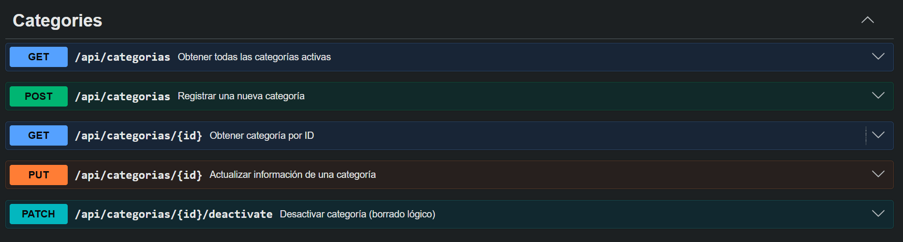


---------------------------------------------------------------------------------------------------------
# supplier
### supplier.model.ts
```bash
mkdir -p src/features/business/supplier
: > src/features/business/supplier/supplier.model.ts
cat >> src/features/business/supplier/supplier.model.ts << 'EOF'
import { DataTypes, Model } from "sequelize";
import { sequelize } from "../../../database/db";

export interface SupplierI {
  id?: number;
  name: string;
  contact_name?: string;
  email?: string;
  phone?: string;
  address?: string;
  is_active: boolean;
  createdAt?: Date;
  updatedAt?: Date;
}

export class Supplier extends Model implements SupplierI {
  public id!: number;
  public name!: string;
  public contact_name!: string;
  public email!: string;
  public phone!: string;
  public address!: string;
  public is_active!: boolean;
  public readonly createdAt!: Date;
  public readonly updatedAt!: Date;
}

Supplier.init(
  {
    name: {
      type: DataTypes.STRING,
      allowNull: false
    },
    contact_name: {
      type: DataTypes.STRING,
      allowNull: true
    },
    email: {
      type: DataTypes.STRING,
      allowNull: true
    },
    phone: {
      type: DataTypes.STRING,
      allowNull: true
    },
    address: {
      type: DataTypes.STRING,
      allowNull: true
    },
    is_active: {
      type: DataTypes.BOOLEAN,
      defaultValue: true
    }
  },
  {
    sequelize,
    tableName: "suppliers",
    timestamps: true
  }
);
EOF
```
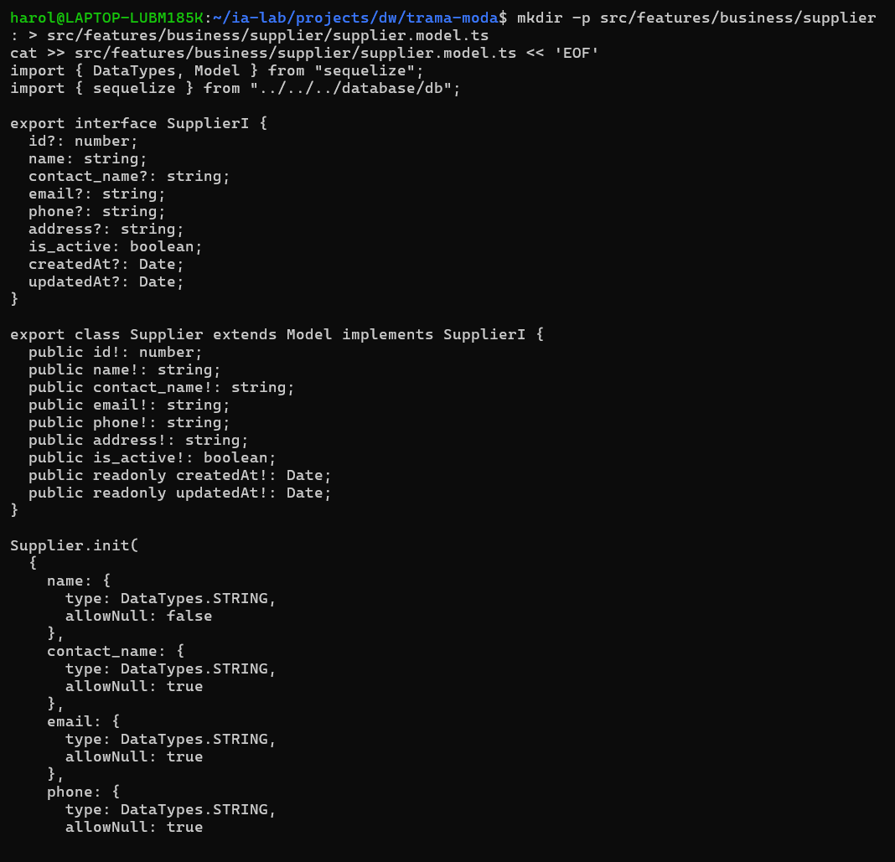

### supplier/supplier.controller.ts
```bash
: > src/features/business/supplier/supplier.controller.ts
cat >> src/features/business/supplier/supplier.controller.ts << 'EOF'
import { Request, Response } from "express";
import { Supplier } from "./supplier.model";

function paramId(req: Request): number {
  const raw = req.params.id;
  const value = Array.isArray(raw) ? raw[0] : raw;
  return Number(value);
}

export class SupplierController {
  public async getAll(req: Request, res: Response) {
    try {
      const suppliers = await Supplier.findAll({ where: { is_active: true } });
      res.status(200).json({ suppliers });
    } catch (error) {
      res.status(500).json({ error: "Error fetching suppliers", detail: String(error) });
    }
  }

  public async getOne(req: Request, res: Response) {
    try {
      const id = paramId(req);
      const supplier = await Supplier.findByPk(id);
      if (!supplier) {
        res.status(404).json({ error: "Supplier record not found" });
        return;
      }
      res.status(200).json({ supplier });
    } catch (error) {
      res.status(500).json({ error: "Error fetching supplier record", detail: String(error) });
    }
  }

  public async create(req: Request, res: Response) {
    try {
      const { name, contact_name, email, phone, address } = req.body;
      const supplier = await Supplier.create({
        name,
        contact_name,
        email,
        phone,
        address,
        is_active: true
      });
      res.status(201).json({ supplier });
    } catch (error) {
      res.status(500).json({ error: "Error creating supplier record", detail: String(error) });
    }
  }

  public async update(req: Request, res: Response) {
    try {
      const id = paramId(req);
      const supplier = await Supplier.findByPk(id);
      if (!supplier) {
        res.status(404).json({ error: "Supplier record not found" });
        return;
      }
      await supplier.update(req.body);
      res.status(200).json({ message: "Supplier updated successfully", supplier });
    } catch (error) {
      res.status(500).json({ error: "Error updating supplier", detail: String(error) });
    }
  }

  public async deleteLogical(req: Request, res: Response) {
    try {
      const id = paramId(req);
      const supplier = await Supplier.findByPk(id);
      if (!supplier) {
        res.status(404).json({ error: "Supplier record not found" });
        return;
      }
      await supplier.update({ is_active: false });
      res.status(200).json({ message: "Supplier record deactivated", supplier });
    } catch (error) {
      res.status(500).json({ error: "Error deactivating supplier record", detail: String(error) });
    }
  }
}
EOF
```
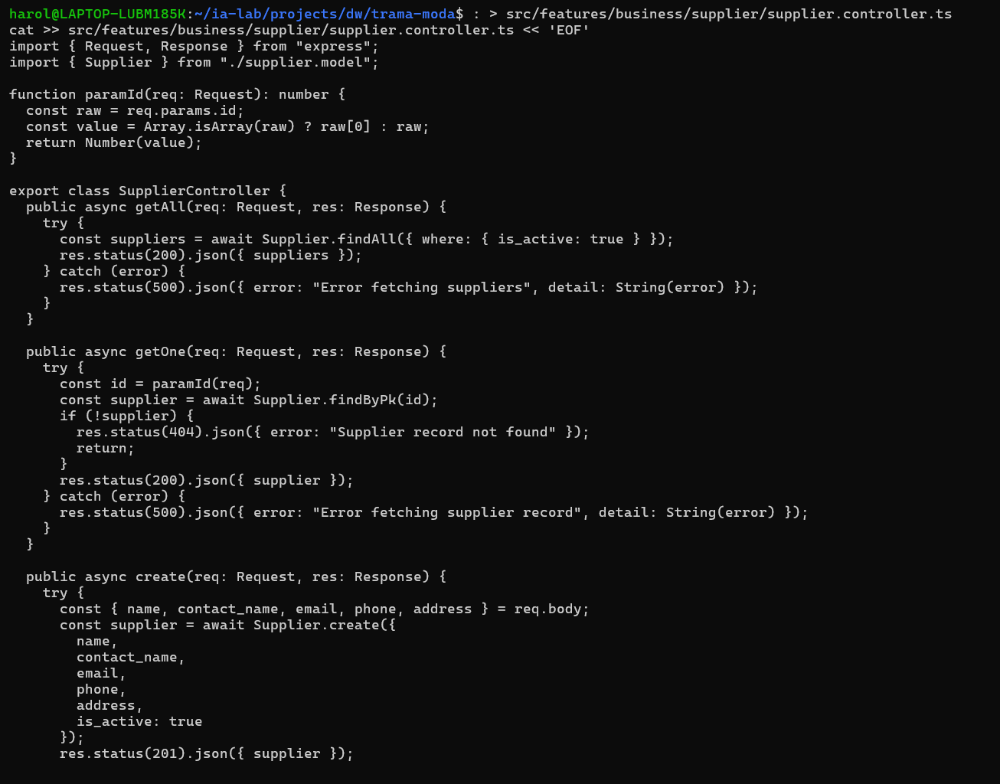

### supplier/supplier.routes.ts
```bash
: > src/features/business/supplier/supplier.routes.ts
cat >> src/features/business/supplier/supplier.routes.ts << 'EOF'
import { Application } from "express";
import { SupplierController } from "./supplier.controller";

/**
 * @openapi
 * components:
 *   schemas:
 *     Supplier:
 *       type: object
 *       properties:
 *         id:
 *           type: integer
 *           example: 1
 *         name:
 *           type: string
 *           example: "Textiles del Norte S.A."
 *         contact_name:
 *           type: string
 *           example: "Carlos Gómez"
 *         email:
 *           type: string
 *           example: "contacto@textilesnorte.com"
 *         phone:
 *           type: string
 *           example: "+573001234567"
 *         address:
 *           type: string
 *           example: "Calle 45 # 12-34, Medellín"
 *         is_active:
 *           type: boolean
 *           example: true
 *     SupplierInput:
 *       type: object
 *       required:
 *         - name
 *       properties:
 *         name:
 *           type: string
 *           example: "Textiles del Norte S.A."
 *         contact_name:
 *           type: string
 *           example: "Carlos Gómez"
 *         email:
 *           type: string
 *           example: "contacto@textilesnorte.com"
 *         phone:
 *           type: string
 *           example: "+573001234567"
 *         address:
 *           type: string
 *           example: "Calle 45 # 12-34, Medellín"
 */
export class SupplierRoutes {
  public supplierController: SupplierController = new SupplierController();

  public routes(app: Application): void {
    /**
     * @openapi
     * /api/proveedores:
     *   get:
     *     summary: Obtener todos los proveedores activos
     *     tags: [Suppliers]
     *     responses:
     *       200:
     *         description: Lista de proveedores
     *   post:
     *     summary: Registrar un nuevo proveedor
     *     tags: [Suppliers]
     *     requestBody:
     *       required: true
     *       content:
     *         application/json:
     *           schema:
     *             $ref: '#/components/schemas/SupplierInput'
     *     responses:
     *       201:
     *         description: Proveedor registrado exitosamente
     */
    app
      .route("/api/proveedores")
      .get(this.supplierController.getAll.bind(this.supplierController))
      .post(this.supplierController.create.bind(this.supplierController));

    /**
     * @openapi
     * /api/proveedores/{id}:
     *   get:
     *     summary: Obtener proveedor por ID
     *     tags: [Suppliers]
     *     parameters:
     *       - in: path
     *         name: id
     *         required: true
     *         schema:
     *           type: integer
     *     responses:
     *       200:
     *         description: Proveedor encontrado
     *       404:
     *         description: No encontrado
     *   put:
     *     summary: Actualizar información de un proveedor
     *     tags: [Suppliers]
     *     parameters:
     *       - in: path
     *         name: id
     *         required: true
     *         schema:
     *           type: integer
     *     requestBody:
     *       required: true
     *       content:
     *         application/json:
     *           schema:
     *             $ref: '#/components/schemas/SupplierInput'
     *     responses:
     *       200:
     *         description: Proveedor actualizado
     */
    app
      .route("/api/proveedores/:id")
      .get(this.supplierController.getOne.bind(this.supplierController))
      .put(this.supplierController.update.bind(this.supplierController));

    /**
     * @openapi
     * /api/proveedores/{id}/deactivate:
     *   patch:
     *     summary: Desactivar proveedor (borrado lógico)
     *     tags: [Suppliers]
     *     parameters:
     *       - in: path
     *         name: id
     *         required: true
     *         schema:
     *           type: integer
     *     responses:
     *       200:
     *         description: Proveedor desactivado
     */
    app
      .route("/api/proveedores/:id/deactivate")
      .patch(this.supplierController.deleteLogical.bind(this.supplierController));
  }
}
EOF
```
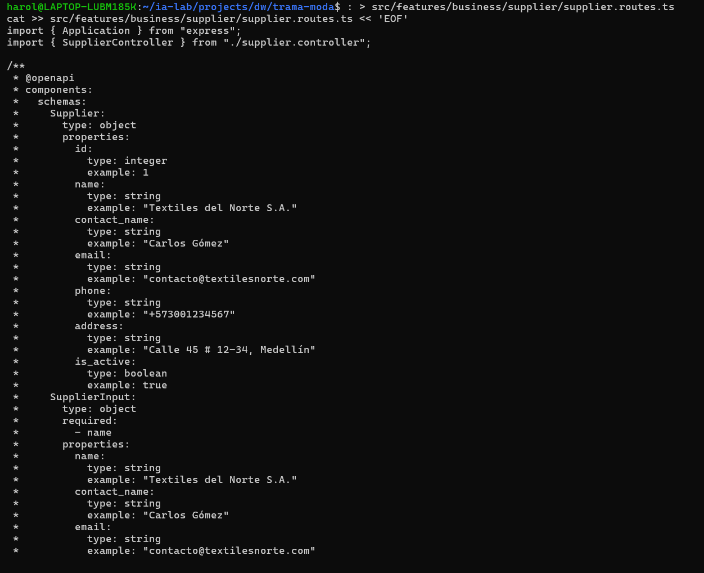

### Archivos HTTP por cada operación CRUD
#### supplier/supplier.create.http
```bash
: > src/features/business/supplier/supplier.create.http
cat >> src/features/business/supplier/supplier.create.http << 'EOF'
### Feature Supplier — CREATE
### Leyenda: SIN AUTH
@baseUrl = http://localhost:4000

# @name createSupplier
POST {{baseUrl}}/api/proveedores
Content-Type: application/json

{
  "name": "Textiles del Norte S.A.",
  "contact_name": "Carlos Gómez",
  "email": "contacto@textilesnorte.com",
  "phone": "+573001234567",
  "address": "Calle 45 # 12-34, Medellín"
}
EOF
```
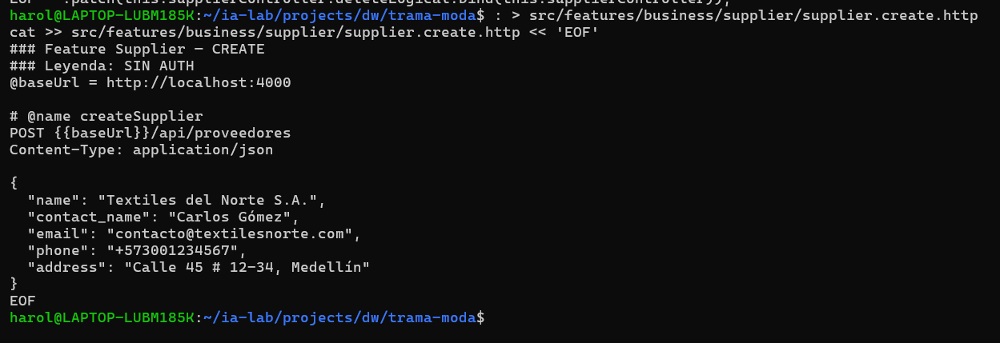

#### supplier/supplier.get.http
```bash
: > src/features/business/supplier/supplier.get.http
cat >> src/features/business/supplier/supplier.get.http << 'EOF'
### Feature Supplier — READ ALL
### Leyenda: SIN AUTH
@baseUrl = http://localhost:4000

# @name getAllSuppliers
GET {{baseUrl}}/api/proveedores
Content-Type: application/json

###

### Feature Supplier — READ ONE
### Leyenda: SIN AUTH

# @name getOneSupplier
GET {{baseUrl}}/api/proveedores/1
Content-Type: application/json
EOF
``` 
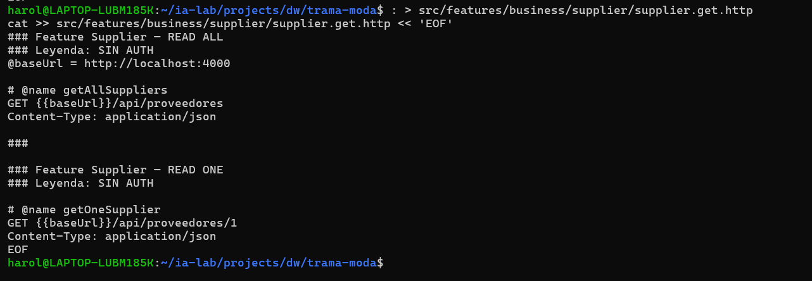

#### supplier/supplier.update.http
```bash
: > src/features/business/supplier/supplier.update.http
cat >> src/features/business/supplier/supplier.update.http << 'EOF'
### Feature Supplier — UPDATE
### Leyenda: SIN AUTH
@baseUrl = http://localhost:4000

# @name updateSupplier
PUT {{baseUrl}}/api/proveedores/1
Content-Type: application/json

{
  "name": "Textiles del Norte SAS",
  "contact_name": "Carlos Gómez R.",
  "email": "ventas@textilesnorte.com",
  "phone": "+573001234567",
  "address": "Calle 45 # 12-34 Int 201, Medellín"
}
EOF
```
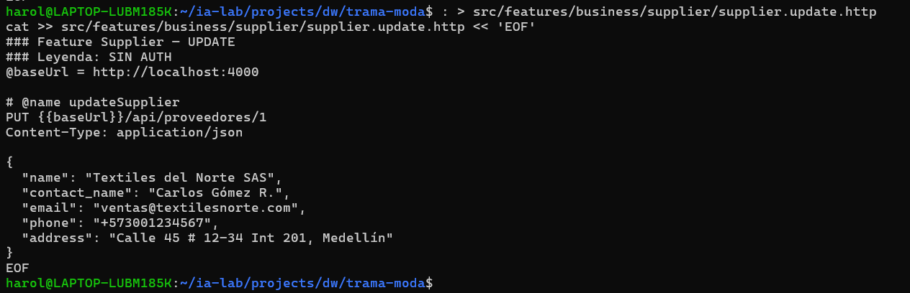

#### supplier/supplier.delete.http
```bash
: > src/features/business/supplier/supplier.delete.http
cat >> src/features/business/supplier/supplier.delete.http << 'EOF'
### Feature Supplier — DELETE LOGICAL (Desactivar)
### Leyenda: SIN AUTH
@baseUrl = http://localhost:4000

# @name deactivateSupplier
PATCH {{baseUrl}}/api/proveedores/1/deactivate
Content-Type: application/json
EOF
```
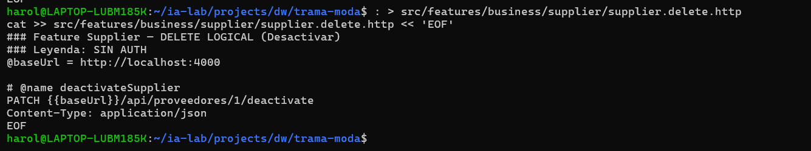

### Actualizar db.ts
```bash
: > src/database/db.ts
cat >> src/database/db.ts << 'EOF'
import { Sequelize } from "sequelize";
import dotenv from "dotenv";

dotenv.config();

interface DatabaseConfig {
  dialect: string;
  host: string;
  username: string;
  password: string;
  database: string;
  port: number;
}

const dbConfigurations: Record<string, DatabaseConfig> = {
  mysql: {
    dialect: "mysql",
    host: process.env.MYSQL_HOST || process.env.DB_HOST || "localhost",
    username: process.env.MYSQL_USER || process.env.DB_USER || "root",
    password: process.env.MYSQL_PASSWORD || process.env.DB_PASSWORD || "",
    database: process.env.MYSQL_NAME || process.env.DB_NAME || "trama-moda",
    port: parseInt(process.env.MYSQL_PORT || process.env.DB_PORT || "3306")
  }
};

const selectedEngine = process.env.DB_ENGINE || "mysql";
const selectedConfig = dbConfigurations[selectedEngine];

if (!selectedConfig) {
  throw new Error(`Motor de base de datos no soportado: ${selectedEngine}`);
}

export const sequelize = new Sequelize(
  selectedConfig.database,
  selectedConfig.username,
  selectedConfig.password,
  {
    host: selectedConfig.host,
    port: selectedConfig.port,
    dialect: selectedConfig.dialect as any,
    logging: process.env.NODE_ENV === 'development' ? console.log : false,
    pool: { max: 5, min: 0, acquire: 30000, idle: 10000 }
  }
);

export const testConnection = async (): Promise<boolean> => {
  try {
    await sequelize.authenticate();
    console.log(`✅ Conexión exitosa a ${selectedEngine.toUpperCase()}`);
    return true;
  } catch (error) {
    console.error(`❌ Error de conexión:`, error);
    return false;
  }
};

export const syncDatabase = async (): Promise<void> => {
  try {
    require("../features/business/client/client.model");
    require("../features/business/product/product.model");
    require("../features/business/sale/sale.model");
    require("../features/business/sale/sale-detail.model");
    require("../features/business/catalog/collection.model");
    require("../features/business/variants/variant.model");
    require("../features/business/branch/branch.model");
    require("../features/business/inventory/inventory.model");
    require("../features/business/category/category.model");
    require("../features/business/supplier/supplier.model");

    await sequelize.sync({ alter: true });
    console.log("✅ Tablas sincronizadas correctamente en MySQL");
  } catch (error) {
    console.error("❌ Error al sincronizar las tablas:", error);
  }
};
EOF
```
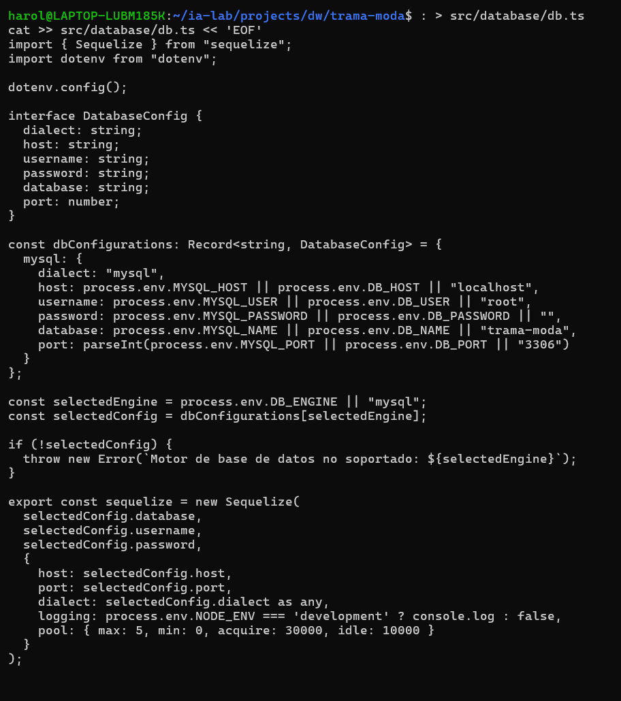

### Actualizar routes/index.ts
```bash
: > src/routes/index.ts
cat >> src/routes/index.ts << 'EOF'
import { ClientRoutes } from "../features/business/client/client.routes";
import { ProductRoutes } from "../features/business/product/product.routes";
import { SaleRoutes } from "../features/business/sale/sale.routes";
import { SaleDetailRoutes } from "../features/business/sale/sale-detail.routes";
import { CollectionRoutes } from "../features/business/catalog/collection.routes";
import { VariantRoutes } from "../features/business/variants/variant.routes";
import { BranchRoutes } from "../features/business/branch/branch.routes";
import { InventoryRoutes } from "../features/business/inventory/inventory.routes";
import { CategoryRoutes } from "../features/business/category/category.routes";
import { SupplierRoutes } from "../features/business/supplier/supplier.routes";

export class Routes {
  public clientRoutes: ClientRoutes = new ClientRoutes();
  public productRoutes: ProductRoutes = new ProductRoutes();
  public saleRoutes: SaleRoutes = new SaleRoutes();
  public saleDetailRoutes: SaleDetailRoutes = new SaleDetailRoutes();
  public collectionRoutes: CollectionRoutes = new CollectionRoutes();
  public variantRoutes: VariantRoutes = new VariantRoutes();
  public branchRoutes: BranchRoutes = new BranchRoutes();
  public inventoryRoutes: InventoryRoutes = new InventoryRoutes();
  public categoryRoutes: CategoryRoutes = new CategoryRoutes();
  public supplierRoutes: SupplierRoutes = new SupplierRoutes();
}
EOF
```
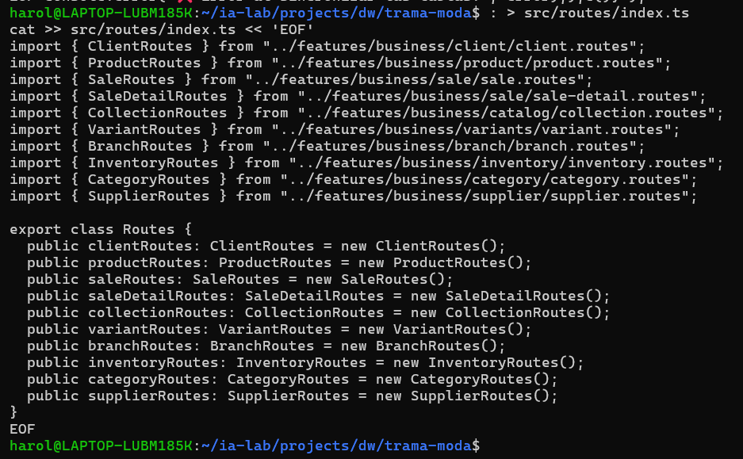

### Actualizar config/index.ts
```bash
: > src/config/index.ts
cat >> src/config/index.ts << 'EOF'
import express, { Application, Request, Response } from "express";
import cors from "cors";
import swaggerUi from "swagger-ui-express";
import { swaggerSpec } from "./swagger";
import { Routes } from "../routes";

export class App {
  public app: Application;
  public routePrv: Routes = new Routes();

  constructor(private port?: number | string) {
    this.app = express();
    this.settings();
    this.middlewares();
    this.routes();
  }

  private settings(): void {
    this.app.set("port", this.port || process.env.PORT || 4000);
  }

  private middlewares(): void {
    this.app.use(cors());
    this.app.use(express.json());
    this.app.use(express.urlencoded({ extended: false }));
  }

  private routes(): void {
    this.app.get("/", (req: Request, res: Response) => {
      res.json({ project: "TramaModa", status: "running" });
    });

    this.app.use("/api-docs", swaggerUi.serve, swaggerUi.setup(swaggerSpec));

    this.routePrv.clientRoutes.routes(this.app);
    this.routePrv.productRoutes.routes(this.app);
    this.routePrv.saleRoutes.routes(this.app);
    this.routePrv.saleDetailRoutes.routes(this.app);
    this.routePrv.collectionRoutes.routes(this.app);
    this.routePrv.variantRoutes.routes(this.app);
    this.routePrv.branchRoutes.routes(this.app);
    this.routePrv.inventoryRoutes.routes(this.app);
    this.routePrv.categoryRoutes.routes(this.app);
    this.routePrv.supplierRoutes.routes(this.app);
  }

  public async listen(): Promise<void> {
    const port = this.app.get("port");
    this.app.listen(port, () => {
      console.log(`🚀 Servidor ejecutándose en puerto ${port}`);
      console.log(`📑 Documentación Swagger disponible en: http://localhost:${port}/api-docs`);
    });
  }
}
EOF
```
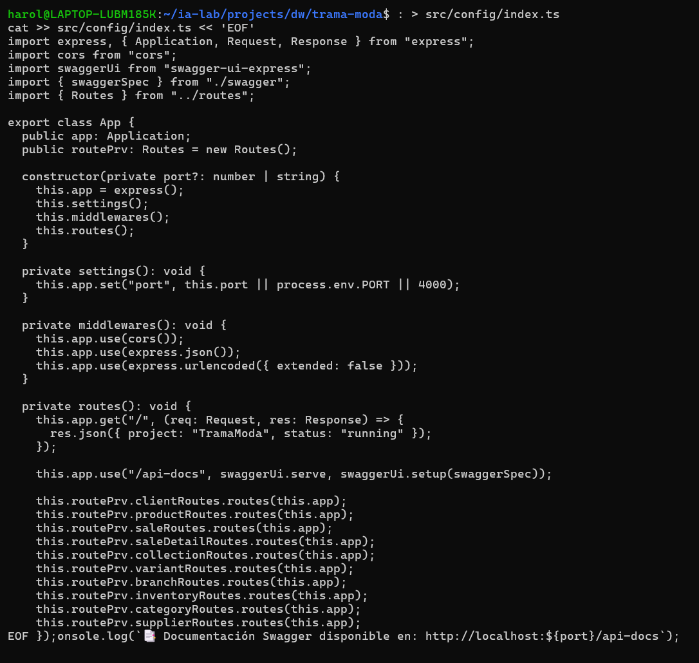

### Verificacion
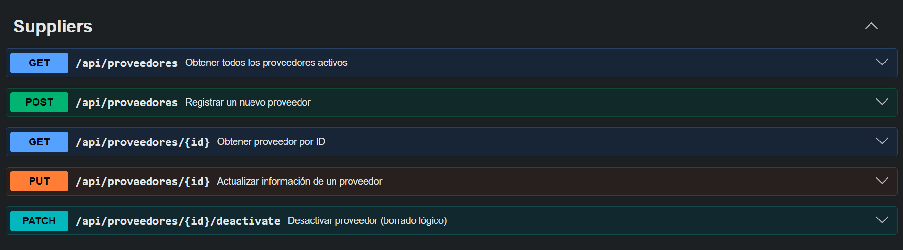