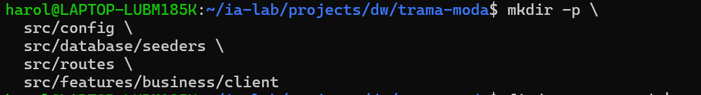
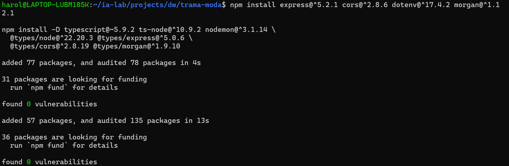
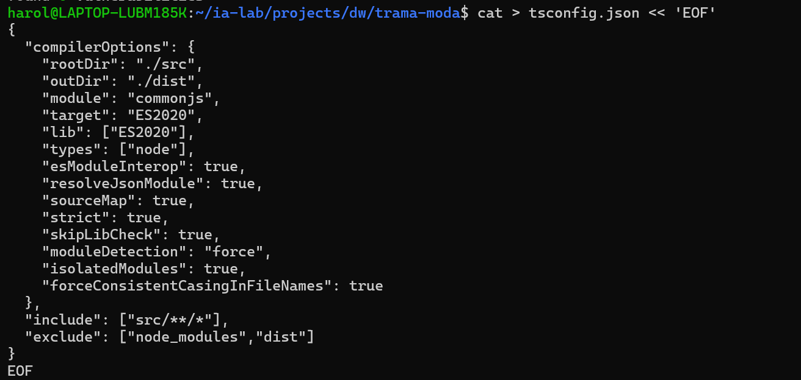
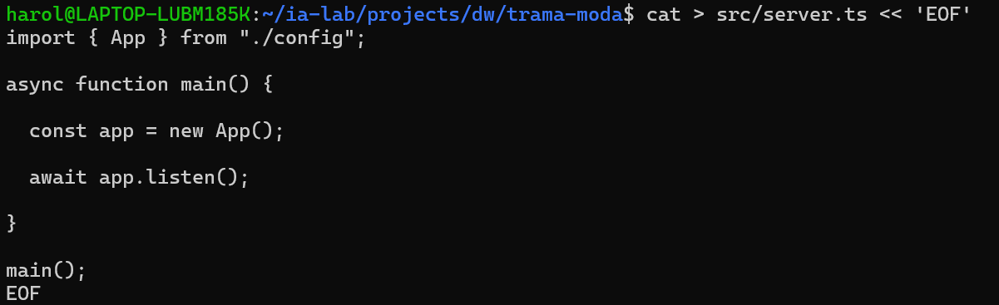

### ## 2.1 Inicializar npm y scripts

**Criterios de este sub-ítem**

- [ ] `package.json` creado
- [ ] Scripts `build` y `dev` definidos

```bash
mkdir app-storelab-express
cd app-storelab-express
npm init -y
mkdir -p docs
```

**PARCHE** — `package.json` **ya existe** (lo creó `npm init -y`).

- **Dentro de** `"scripts"`: deja solo (o añade) `build` y `dev` como abajo.
- **Debajo de** `"license"` (o al mismo nivel que `"scripts"`): asegúrate de `"type": "commonjs"`.

Estado esperado de esas claves:

```json
{
  "scripts": {
    "build": "tsc",
    "dev": "nodemon --watch src --ext ts --exec ts-node -- src/server.ts"
  },
  "type": "commonjs"
}
```

```bash
node -e "const p=require('./package.json'); console.log(p.scripts)"
```

---

## 2.2 Estructura de carpetas (features)

**Criterios de este sub-ítem**

- [ ] Carpetas de infra y features creadas según el árbol

```bash
mkdir -p \
  src/config \
  src/database/seeders \
  src/routes \
  src/features/business/client
```


```text
src/
├── config/
├── database/
│   └── seeders/          # solo carpeta (ISS-02 §3.3); runner en ISS-04
├── routes/
├── features/
│   └── business/
│       └── client/       # más features en ISS-06…08
└── server.ts             # §2.5
```

| Carpeta | Uso |
|---------|-----|
| `features/business/<entidad>/` | model + controller + routes (+ seeder, swagger, http, associations) |
| `database/seeders/` | counts + SeedersRunner (`npm run db:seed`) |
| `routes/index.ts` | Agregador de features |
| `config/` · `database/` | Arranque e infraestructura |

**Seeders (patrón del lab)**

| Pieza | Dónde |
|-------|-------|
| Por entidad | `src/features/business/<entidad>/<entidad>.seeder.ts` |
| Runner + counts | `src/database/seeders/{index,counts}.ts` → `npm run db:seed` |
| Datos falsos | `@faker-js/faker` |

```bash
find src -type d | sort
```
---

## 2.3 Dependencias base (Express + TypeScript)

**Criterios de este sub-ítem**

- [ ] `express`, `cors`, `dotenv`, `morgan` instalados
- [ ] `typescript`, `ts-node`, `nodemon`, `@types/*` instalados

```bash
npm install express@^5.2.1 cors@^2.8.6 dotenv@^17.4.2 morgan@^1.12.1

npm install -D typescript@~5.9.2 ts-node@^10.9.2 nodemon@^3.1.14 \
  @types/node@^22.20.3 @types/express@^5.0.6 \
  @types/cors@^2.8.19 @types/morgan@^1.9.10
```


> TypeScript en **5.9.x** por compatibilidad con `ts-node`.

```bash
npm ls --depth=0
```

---

## 2.4 TypeScript (`tsconfig.json`)

**Criterios de este sub-ítem**

- [ ] `tsconfig.json` con `rootDir: ./src`, `outDir: ./dist`, `strict: true`

```bash
: > tsconfig.json
cat >> tsconfig.json << 'EOF'
{
  "compilerOptions": {
    "rootDir": "./src",
    "outDir": "./dist",
    "module": "commonjs",
    "target": "ES2020",
    "lib": ["ES2020"],
    "types": ["node"],
    "esModuleInterop": true,
    "resolveJsonModule": true,
    "sourceMap": true,
    "strict": true,
    "skipLibCheck": true,
    "moduleDetection": "force",
    "isolatedModules": true,
    "forceConsistentCasingInFileNames": true
  },
  "include": ["src/**/*"],
  "exclude": ["node_modules", "dist"]
}
EOF
```

```bash
test -f tsconfig.json && npx tsc --showConfig | head -20
```

---

## 2.5 Servidor y App (esqueleto HTTP)

**Criterios de este sub-ítem**

- [ ] Existen `src/server.ts` y `src/config/index.ts`
- [ ] `App` define `settings`, `middlewares`, `routes`, `dbConnection`, `listen` (placeholders OK)
### 2.5.1 `src/server.ts`

```bash
: > src/server.ts
cat >> src/server.ts << 'EOF'
import { App } from './config/index';

async function main() {
    const app = new App();
    await app.listen();
}

main();
EOF
```
